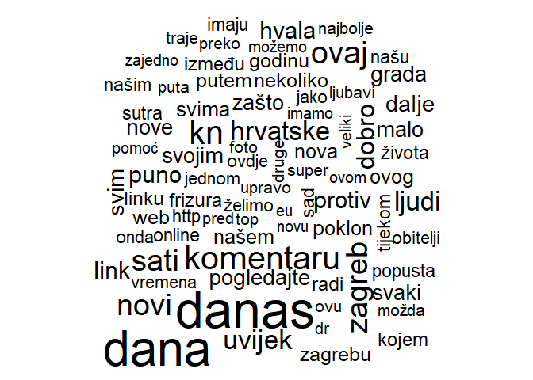
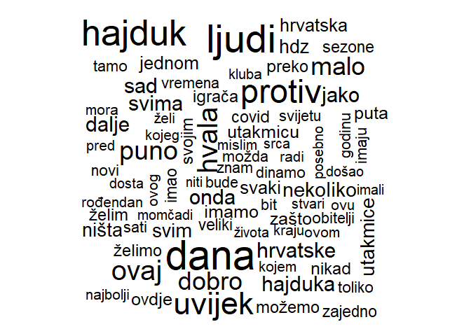

# OUTLINE
<br>
<br>
<br>
- DATA IMPORT
<br>
<br>
- DESCRIPTIVE EXPLORATION
<br>
<br>
- TEXT TOKENIZATION AND CLEAN
<br>
<br>
- ANALYSIS


# DATA IMPORT

#### ARTICLES


```r
# read in data
path <- "D:/LUKA/Freelance/Mediatoolkit/FULLtxtDATA"
raw <- list.files(path = path , pattern="xlsx")
raw_path <- paste0(path, "/", raw)
all_raw <- map_df(raw_path, read_excel)
```


```r
# some basic data wrangle
all <- as.data.table(all_raw)
all <- all[,DATE := as.Date(DATE,"%Y-%m-%d")][,DATETIME := anytime(paste(DATE,TIME))]
posts <- all[!duplicated(all),]
rm(all,all_raw)
# select facebook
fb <- posts[SOURCE_TYPE == "facebook",]
fb <- as.data.table(fb)
```

#### LEXICON 


```r
# read in lexicons
CroSentilex_n <- read.delim("C:/Users/Lukas/Dropbox/Mislav@Luka/crosentilex-negatives.txt",
                                   header = FALSE,
                                   sep = " ",
                                   stringsAsFactors = FALSE,
                                   fileEncoding = "UTF-8")  %>%
                   rename(word = "V1", sentiment = "V2" ) %>%
                   mutate(brija = "NEG")
 
CroSentilex_p  <- read.delim("C:/Users/Lukas/Dropbox/Mislav@Luka/crosentilex-positives.txt",
                                   header = FALSE,
                                   sep = " ",
                                   stringsAsFactors = FALSE,
                                   fileEncoding = "UTF-8") %>%
                    rename(word = "V1", sentiment = "V2" ) %>%
                    mutate(brija = "POZ")
 
Crosentilex_sve <- rbind(setDT(CroSentilex_n), setDT(CroSentilex_p))
# check lexicon data 
head(sample_n(Crosentilex_sve,1000),15)
```

```
##              word sentiment brija
##  1:     garešnica   0.23658   POZ
##  2:     oslobođen   0.41599   NEG
##  3:        belupo   0.41748   NEG
##  4:     varijanta   0.42725   NEG
##  5: tajkunizacija   0.33489   POZ
##  6:        klerik   0.21008   NEG
##  7:  književnički   0.38237   NEG
##  8:         cifra   0.28131   NEG
##  9:    razriješen   0.41636   POZ
## 10:       stevens   0.36212   POZ
## 11:          feđa   0.15710   POZ
## 12:     laninović   0.43913   NEG
## 13:      poreznik   0.37794   NEG
## 14:         dylan   0.57874   POZ
## 15:    arhetipski   0.30558   NEG
```

```r
CroSentilex_Gold  <- read.delim2("C:/Users/Lukas/Dropbox/Mislav@Luka/gs-sentiment-annotations.txt",
                                 header = FALSE,
                                 sep = " ",
                                 stringsAsFactors = FALSE) %>%
                    rename(word = "V1", sentiment = "V2" ) 
 Encoding(CroSentilex_Gold$word) <- "UTF-8"
 CroSentilex_Gold[1,1] <- "dati"
 CroSentilex_Gold$sentiment <- str_replace(CroSentilex_Gold$sentiment , "-", "1")
 CroSentilex_Gold$sentiment <- str_replace(CroSentilex_Gold$sentiment , "\\+", "2")
 CroSentilex_Gold$sentiment <- as.numeric(unlist(CroSentilex_Gold$sentiment))
# check lexicon data 
head(sample_n(CroSentilex_Gold,100),15)
```

```
##            word sentiment
## 1      slobodan         2
## 2         barel         0
## 3       staviti         0
## 4       javnost         0
## 5    odvjetnica         0
## 6  nezadovoljan         1
## 7      otkriven         0
## 8      temeljan         0
## 9       misliti         0
## 10      odličan         2
## 11          meč         0
## 12  razlikovati         0
## 13          val         0
## 14    prosječan         0
## 15      ukinuti         1
```

```r
# create stop words
stopwords_cro <- get_stopwords(language = "hr", source = "stopwords-iso")
# check stopwords data
head(sample_n(stopwords_cro,100),15)
```

```
## # A tibble: 15 x 2
##    word  lexicon      
##    <chr> <chr>        
##  1 će    stopwords-iso
##  2 bumo  stopwords-iso
##  3 biti  stopwords-iso
##  4 hoću  stopwords-iso
##  5 ili   stopwords-iso
##  6 me    stopwords-iso
##  7 ni    stopwords-iso
##  8 tvoje stopwords-iso
##  9 kao   stopwords-iso
## 10 mene  stopwords-iso
## 11 jeste stopwords-iso
## 12 hoće  stopwords-iso
## 13 naša  stopwords-iso
## 14 njima stopwords-iso
## 15 zar   stopwords-iso
```

```r
# extend stop words
my_stop_words <- tibble(
  word = c(
    "jedan","mjera", "može", "možete", "mogu", "kad", "sada", "treba", "ima", "osoba",
    "e","prvi", "dva","dvije","drugi",
    "tri","treći","pet","kod",
    "ove","ova",  "ovo","bez", "kod",
    "evo","oko",  "om", "ek",
    "mil","tko","šest", "sedam",
    "osam",   "čim", "zbog",
    "prema", "dok","zato", "koji", 
    "im", "čak","među", "tek",
    "koliko", "tko","kod","poput", 
    "baš", "dakle", "osim", "svih", 
    "svoju", "odnosno", "gdje",
    "kojoj", "ovi", "toga",
     "ubera", "vozača", "hrvatskoj", "usluge", "godine", "više", "taksi", "taxi", "taksija", "taksija", "kaže", "rekao", "19"," aee", "ae","bit.ly", "https", "one", "the"
  ),
  lexicon = "lux"
)
stop_corpus <- my_stop_words %>%
  bind_rows(stopwords_cro)
# check stopwords data
head(sample_n(stop_corpus,100),15)
```

```
## # A tibble: 15 x 2
##    word    lexicon      
##    <chr>   <chr>        
##  1 ove     lux          
##  2 pod     stopwords-iso
##  3 neću    stopwords-iso
##  4 https   lux          
##  5 sa      stopwords-iso
##  6 njezino stopwords-iso
##  7 sebi    stopwords-iso
##  8 moja    stopwords-iso
##  9 zato    lux          
## 10 kad     lux          
## 11 vam     stopwords-iso
## 12 kao     stopwords-iso
## 13 taxi    lux          
## 14 jim     stopwords-iso
## 15 mimo    stopwords-iso
```

# DESCRIPTIVE EXPLORATION


```r
# influencers by ACTIVITY
fb[,.N,FROM][order(-N)]

# influencers by FOLLOWERS
fb[,FOLLOWERS := max(FOLLOWERS_COUNT), FROM][,c("FOLLOWERS","FROM")][order(-FOLLOWERS)] %>% unique() 

# influencers by REACH
fb[,REACH := sum(REACH), FROM][,.(REACH,FROM)][order(-REACH)] %>% unique() 

# influencers by REACH II

fb %>% 
  group_by(FROM) %>%
  mutate(ACTIVITY = n(),
         REACH = sum(REACH),
         EFFECT = REACH/ACTIVITY) %>%
  filter(ACTIVITY>100) %>%
  arrange(desc(EFFECT)) %>%
  unique()
         
  fb %>% 
  group_by(FROM) %>%
  mutate(ACTIVITY = n(),
         REACH = sum(REACH),
         EFFECT = REACH/ACTIVITY) %>%
  filter(ACTIVITY>100) %>%
  arrange(desc(EFFECT)) %>%
  unique() -> fb
fb <- as.data.table(fb)
# influencers by LIKE
fb[,LIKE := sum(LIKE_COUNT), FROM][,.(LIKE,FROM)][order(-LIKE)] %>% unique() 

# influencers by LIKE II

fb %>% 
  group_by(FROM) %>%
  mutate(EFICIENCY = LIKE / ACTIVITY) %>%
  filter(ACTIVITY>100) %>%
  arrange(desc(EFICIENCY)) %>%
  unique()


# influencers by INTERACTIONS
fb[,INTERACTIONS := sum(INTERACTIONS), FROM][,.(INTERACTIONS,FROM)][order(-INTERACTIONS)] %>% unique() 


# influencers by COMMENT
fb[,COMMENT := sum(COMMENT_COUNT), FROM][,.(COMMENT,FROM)][order(-COMMENT)] %>% unique() 


# influencers by COMMENT II
fb[, `:=` (ACTIVITY = .N , COMMENT = sum(COMMENT_COUNT),ENGAGE = COMMENT/ACTIVITY), FROM][,.(FROM,ACTIVITY,COMMENT, ENGAGE)][ACTIVITY >= 100][order(-COMMENT)] %>% unique()

# influencers by SHARE
fb[,SHARE := sum(SHARE_COUNT), FROM][,.(SHARE,FROM)][order(-SHARE)] %>% unique() 


# influencers by SHARE II
fb[, `:=` (ACTIVITY = .N , SHARE = sum(SHARE_COUNT), DISPERSION = SHARE/ACTIVITY), FROM][,.(FROM,ACTIVITY,SHARE,DISPERSION)][ACTIVITY >= 100][order(-DISPERSION)] %>% unique()

# letters by influencer

fb[, `:=` (ACTIVITY = .N ,LETTERS = sum(nchar(FULL_TEXT))),FROM]

fb[, `:=` (ACTIVITY = .N ,LETTERS = sum(nchar(FULL_TEXT)), EFFORT = LETTERS/ACTIVITY), FROM][,.(FROM,ACTIVITY,LETTERS, EFFORT)][ACTIVITY >= 100][order(-EFFORT)] %>% unique()


# posts by REACH

fb[,.(SHARE_COUNT,FROM,FULL_TEXT, URL)][order(-SHARE_COUNT)] 

# posts by LIKE

fb[,.(LIKE_COUNT,FROM,FULL_TEXT, URL)][order(-LIKE_COUNT)] 

# posts by INTERACTIONS

fb[,.(INTERACTIONS,FROM,FULL_TEXT, URL)][order(-INTERACTIONS)]  

# posts by COMMENT

fb[,.(COMMENT_COUNT,FROM,FULL_TEXT, URL)][order(-COMMENT_COUNT)]  

# posts by SHARE

fb[,.(SHARE_COUNT,FROM,FULL_TEXT, URL)][order(-SHARE_COUNT)] 


# how many letters in a title
fb[,
       .(Avg = mean(nchar(TITLE), na.rm = T),
         STD = sd(nchar(TITLE), na.rm = T),
         min = min(nchar(TITLE), na.rm = T),
         max = max(nchar(TITLE), na.rm = T)),
      SOURCE_TYPE][order(-Avg),]
# how many letters in a text
fb[,
       .(Avg = mean(nchar(FULL_TEXT)),
         STD = sd(nchar(FULL_TEXT)),
         min = min(nchar(FULL_TEXT)),
         max = max(nchar(FULL_TEXT))),
      SOURCE_TYPE][order(-Avg),]
```


# TEXT TOKENIZATION AND CLEAN


#### TOKENIZE


```r
# dim before tokenize
dim(fb)
```

```
## [1] 278453     49
```

```r
# tokenize
fb %>% 
  unnest_tokens(word, FULL_TEXT) -> fb_token

# dim after tokenize
dim(fb_token)
```

```
## [1] 13414161       49
```

```r
# check
fb_token %>% 
  select(FROM, word, MENTION_SNIPPET ) %>%
    sample_n(.,10)
```

```
##                                            FROM       word
##  1:                      Kapljice ljubavi Božje          i
##  2:                                    Budicool        100
##  3:                                Duhos Osijek         sa
##  4:                              Kulturpunkt.hr       ovom
##  5:                                    Radio808      https
##  6: Centar za estetsku kirurgiju dr. Žgaljardić   bezbolan
##  7:                                       Živim   vlastito
##  8:                 LQ - Strive for development pročitajte
##  9:                             Velimir Bujanec     screen
## 10:                      Kapljice ljubavi Božje         si
##                                                                                                                                                                                                                                                                   MENTION_SNIPPET
##  1:                                IMENDANI: Priska, Margareta, Biserka Prvo čitanje: 1 Sam 16, 1-13 Samuel pomaza Davida usred njegove braće, i Duh ... će to čuti, i ubit će me!« Ali mu Gospodin odgovori: »Uzmi sa sobom junicu pa reci: 'Došao sam da žrtvujem Gospodinu!' I
##  2:      Dostupno u 3 boje: crvena, roza i ljubičasta Ovaj buket je bolji od bilo kojih ruža koje ste dosad vidjeli jer donose ... pouzećem ili bankarstvom(ovo molim da obavezno naglasite jer se inače šalje pouzećem) <U+0001F30D> PROCES NARUČIVANJA : <U+27A1><U+FE0F> IME I
##  3:                           Mnogi mu pristupaju iz tradicije i običaja, a poneki, usudim se reći, pristupaju na način police životnog osiguranja. To ... I danas mnogi ne znaju tko su, odakle dolaze i zbog toga prolaze kroz muku i suze. Mnogi se definiraju prema onome što
##  4:                                                                                    Luka Matić piše o HRT-ovom dugoočekivanom dokumentarnom serijalu "NDH" i problematičnim, nedostatnim povijesnim interpretacijama koje su u njemu u velikoj mjeri prezentirane <U+0001F6A9>
##  5:                                                                                                                                       I oprezno (sound: on) s pirotehnikom! <U+0001F973><U+0001F415><U+0001F408><U+0001F385> Awesome 2022. uz https://www.rtv808.com/awesome/
##  6: <U+0001F381>50% POPUSTA NA BODY LAB - dvostruki tretman za oblikovanje tijela <U+27A1>Dva tretmana PO CIJENI JEDNOG <U+27A1>Riječ je o novoj tehnologiji i aparatu koji funkcionira na principu visoko frekventnih magnetskih vibracija koje prodiru na 8 cm dubine od kože i
##  7:                                                                                                                                                Hrvatima su za sreću najvažniji skladni obiteljski odnosi, vlastito zdravlje i zdravlje najbližih te dobri prijateljski odnosi
##  8:                             I stalno se prilagođavamo normama, obiteljskim pravilima, pravilima podneblja u kojem živimo, pravilima kompanije, ... A onda nam je ta ista okolina kriva, i država nam je kriva, i roditelji, i oni neki ljudi na poslu ili neki drugi o kojima
##  9:                        24sata, jasno kaže: “Maska nije obveza, nego preporuka!” Sada, kada nam je resorni ministar sve lijepo objasnio, slobodni smo postaviti nekoliko pitanja… Na temelju čega su brojni građani kažnjavani za nenošenje maski - po kafićima, restoranima i
## 10:                                     Sveta Lucijo, moli za nas <U+0001F339> MOLITVA I LITANIJE SVETOJ LUCIJI <U+0001F339> O sveta Lucijo, čije ime znači svjetlost, pun pouzdanja dolazim preda te tražeći te svetu svjetlost koja će mi vratiti oprez u izbjegavanju putova i
```

#### CLEAN


```r
# remove stop words, numbers, single letters
fb_token %>% 
  anti_join(stop_corpus, by = "word") %>%
  mutate(word = gsub("\\d+", NA, word)) %>%
  mutate(word = gsub("^[a-zA-Z]$", NA, word)) -> fb_tokenTidy
# remove NA
fb_tokenTidy %>%
  filter(!is.na(word)) -> fb_tokenTidy

# check
fb_tokenTidy  %>% 
  select(FROM, word, MENTION_SNIPPET ) %>%
  sample_n(.,15)
```

```
##                                                                    FROM
##  1:                                                        ELLE CROATIA
##  2:                                                            Budicool
##  3:                                                 Radio Sveta Nedelja
##  4:                                                    Televizija Zapad
##  5:                                             Nacionalni Park Brijuni
##  6:                                                    Hrvatski Telekom
##  7:                                                        Fenserka.com
##  8:                                                       Udruga Franak
##  9: HDD - Hrvatsko dizajnersko društvo / Croatian Designers Association
## 10:                                                    Katarina Pavliša
## 11:                                                        Ideja godine
## 12:                                                    Domagoj Margetic
## 13:                                                      Rijeka Ljubavi
## 14:                                                        Super Ljilja
## 15:                                                        ELLE CROATIA
##             word
##  1:         vino
##  2:     budicool
##  3:       učenje
##  4:   razumljive
##  5:  panoramskim
##  6:      telekom
##  7:      ramazan
##  8:      temelju
##  9:  iskoristili
## 10: zadovoljstvo
## 11:     poslovni
## 12:        nitko
## 13:      osijeku
## 14:       ostane
## 15:   nekadašnji
##                                                                                                                                                                                                                                                                                                                                                                                                                                                                                                              MENTION_SNIPPET
##  1:                                                                                                                                                                                                                                                                                                                                                             Na što miriše zima? Na cimet, klinčiće, kuhano vino i ostala topla pića koja nam griju i dušu i tijelo. Evo dva recepta koja će vam vratiti osmijeh na lice…
##  2:                                                                                                                                                                                                                                                      Boje: tamnosiva, svijetlosiva, smeđa, bež, crna, bijela, bordo, plava, mint zelena, zeleno-žuta Najelegantniji i ... pouzećem ili bankarstvom(ovo molim da obavezno naglasite jer se inače šalje pouzećem) <U+0001F30D> PROCES NARUČIVANJA : <U+27A1><U+FE0F> IME I
##  3:                                                                                                                                                                                                                                                                     Sandri Vuk dodijeljena je Zahvalnica Grada Svete Nedelje za sveukupan rad i zasluge u promicanju obrazovanja na području Grada Svete Nedelje te novčana nagrada. Sandra Vuk je učiteljica savjetnica u Osnovnoj Školi Sveta Nedelja. Dugogodišnja je
##  4:                                                                                                                                                                                                                                                                                                                            Na taj način omogućit će svim građanima uvid u transparentnost proračunskog procesa uz dostupne i razumljive informacije. #općinabrdovec #proračun #transparentnostproračuna - Općina Brdovec
##  5: <U+0001D40F><U+0001D40E><U+0001D412><U+0001D409><U+0001D404><U+0001D413><U+0001D408> <U+0001D40D><U+0001D40F> <U+0001D401><U+0001D411><U+0001D408><U+0001D409><U+0001D414><U+0001D40D><U+0001D408> <U+0001D414> <U+0001D40F><U+0001D411><U+0001D40E><U+0001D412><U+0001D408><U+0001D40D><U+0001D402><U+0001D414> <U+0001F4E2> Individualni posjetitelji tijekom prosinca mogu posjetiti otok Veliki Brijun u vlastitom aranžmanu (bez vodiča i vožnje panoramskim vlakom). Posjet muzeju i izložbi te konzumacija pića i
##  6:                                                                                                                                                                                                                                                                   Krema za svaki dan važan je korak u rutini njege kože, a pronalaženje sebi najbolje najjednostavnije je u Kiehl'su i uz Moj Telekom aplikaciju. Svi artikli na popustu su 5%, a uz kupnju bilo kojega dobivaš i pet odabranih mini proizvoda. Požuri i
##  7:                                                                                                                                                                                                                                                                                                                                                                            “KLANJAO JE NA MOJE OČI! PROMIJENIO JE VJERU I POSTIO RAMAZAN” Oglasila se Dalilina majka, OTKRILA PRAVU ISTINU Link u komentaru <U+0001F53D>
##  8:                                                                                                                                                                                                                                                                         Tužitelja je uspješno zastupala osječka odvjetnica Sanja Hajnal. Kronologija događanja bila je sljedeća: 1. Najprije je tužitelj iz Osijeka na Općinskom sudu u Osijeku dobio 30. lipnja 2016. presudu za ništetnost promjenjive kamatne stope i
##  9:                                                                                                                                                                                                                                                                Lovorka Magaš i Patricia Počanić u [d]razgovoru s Markom Golubom o Studiju za industrijsko oblikovanje i kulturu stanovanja 1950ih. Otkako ih ne možemo raditi uživo s publikom, iskoristili smo priliku da šećemo među izlošcima i pokažemo vam što više
## 10:                                                                                                                                                                                                                                               Izradi svoju staklenku zahvalnosti i na Božić osjeti osjećaj sreće <U+0001F49B> Kako? 1. Pripremi svoju staklenku, ukrasi ju + pripremi papiriće, bijele, u boji, nacrtane… budi kreativan/a <U+0001F60A> 2. Kroz idućih 12 dana prati moje postove. Svaki dan odgovori na
## 11:                                                                                                                                                                                                                                                                izdanju natjecanja, a povodom toga smo uveli i neke promjene u natjecanje. No, suština je ostala ista, tražimo najbolji poslovni plan za neku poslovnu ideju koja uključuje nove tehnologije! Provjerite što je sve novo, koji su datumi i ne dvojite oko
## 12:                                                                                                                                                                                                                                                                   Mediji stvaraju takvo ozračje u kojem je onemogućena javna rasprava o skandaloznim izmjenama i dopunama Zakona o zaštiti pučanstva. Ali prenosim tekst koji zvuči suvislo i pokazuje kako se u javnom prostoru spriječava argumentirana rasprava o tom
## 13:                                                                                                                                                                                                                                                                                         naši donatori koji se odriče od sebe i ne zaboravljaju "Rijeku ljubavi" uplatili su financijsku potporu Z.M. iz ... iz Koprivnice..............................................................................200,00 kn I.V. iz
## 14:                                                                                                                                                                                                                                                                                     Njihov osmijeh grije srce, rastapa i najveće ledene sante i prodire do svakog, pa i onog najtvrđeg kamena! I nitko na njih ne ostane ravnodušan, probude makar onu trunčicu empatije koja čuči u svima! Volim kad se starci smiješe!
## 15:                                                                                                                                                                                                                                                                                                                    Nekadašnji model danas je majka troje djece i uspješna poslovna žena, a na dodjeli ovogodišnjih Elle Style Awardsa osvojila nas je odvažnim glam lookom i dokazala zašto zaslužuje titulu ikone stila
```


# ANALYSE


#### BASIC FREQUENCIES


```r
## Most common words
fb_tokenTidy[,.N,by = word][order(-N),]
```

```
##                          word     N
##      1:                 danas 19141
##      2:                  dana 18445
##      3:                   dan 15905
##      4:               vrijeme 13811
##      5:                godina 13789
##     ---                            
## 412800:         konstantinovu     1
## 412801:      rasprostranjenim     1
## 412802:              djetinja     1
## 412803:              stidjelo     1
## 412804: ivantemšić_masterchef     1
```

```r
## Vizualize most common words
fb_tokenTidy[,.N,by = word][N>7000][order(-N),][,word := reorder(word,N)] %>%
  ggplot(aes(word, N)) +
  geom_col() +
  xlab(NULL) +
  coord_flip() +
  theme_economist()
```

<!-- -->

```r
## Vizualize most common words over time
fb_tokenTidy[,DAY:=floor_date(DATE,"day")][,N:=.N,by=DAY][,gn:=sum(N)][
  word %in% c("zagreb", "život", "poklon", "grad", "cijena"),] %>%
  ggplot(., aes(DAY,  N / gn)) + 
   geom_point() +
   ggtitle("Učestalost korištenja riječi") +
   ylab("% ukupnih riječi") +
   geom_smooth() +
   facet_wrap(~ word, scales = "free_y") +
   scale_y_continuous(labels = scales::percent_format())+
   theme_economist()
```

<!-- -->

Simple WordCloud:


```r
## WordCloud(vulgaris)
fb_tokenTidy %>%
  anti_join(CroSentilex_Gold,by="word") %>% 
  count(word) %>% 
  arrange(desc(n)) %>%
  top_n(100) %>%
  with(wordcloud(word, n, max.words = 80)) 
```

<!-- -->

#### SENTIMENT


```r
## Sentiment over time
vizualiziraj_sentiment <- function(dataset, frq = "week") {
dataset %>%
  inner_join( Crosentilex_sve, by = "word") %>%
  filter(!is.na(word)) %>%
  select(word, brija, DATE, sentiment) %>% 
  unique() %>%
  spread(. , brija, sentiment) %>%
  mutate(sentiment = POZ - NEG) %>%
  select(word, DATE, sentiment) %>% 
  group_by(word) %>% 
  mutate(count = n()) %>%
  arrange(desc(count)) %>%
  mutate( score = sentiment*count) %>%
  ungroup() %>%
  group_by(DATE) %>%
  arrange(desc(DATE)) -> sm
 
sm %>%
  select(DATE, score) %>%
  group_by(DATE = floor_date(DATE, frq)) %>%
  summarise(Dnevni_sent = sum(score, na.rm = TRUE)) %>%
  ggplot(., aes(DATE, Dnevni_sent)) +
  geom_bar(stat = "identity") + 
  ggtitle(paste0("Sentiment over time;freqency:", frq)) +
  ylab("SentimentScore") +
  theme_economist()-> gg_sentiment_kroz_vrijeme_qv
gg_sentiment_kroz_vrijeme_qv
}
vizualiziraj_sentiment(fb_tokenTidy,"week")
```

<!-- -->


```r
## Sentiment 
doprinos_sentimentu <- function(dataset, no = n) {
dataset %>%
  inner_join(CroSentilex_Gold, by = "word") %>% 
  count(word, sentiment,sort = TRUE) %>% 
  group_by(sentiment) %>%
  top_n(no) %>%
  ungroup() %>%
  mutate(sentiment = case_when(sentiment == 0 ~ "NEUTRAL",
                                 sentiment == 1 ~ "NEGATIVE",
                                 sentiment == 2 ~ "POSITIVE")) %>%
  mutate(word = reorder(word, n)) %>%
  ggplot(aes(word, n, fill = sentiment)) +
  geom_col(show.legend = FALSE) +
  ggtitle( "Sentiment") +
  labs( x = "Riječ", y = "Number of words") +
  facet_wrap(~ sentiment, scales = "free_y") +
  coord_flip() +
  theme_economist() -> gg_doprinos_sentimentu
  
 gg_doprinos_sentimentu
 
}
doprinos_sentimentu(fb_tokenTidy,15)
```

<!-- -->


```r
## ComparisonCloud
fb_tokenTidy %>%
  inner_join(CroSentilex_Gold,by="word") %>% 
  count(word, sentiment) %>% 
  top_n(200) %>%
  mutate(sentiment = case_when(sentiment == 0 ~ "+/-",
                                 sentiment == 1 ~ "-",
                                 sentiment == 2 ~ "+")) %>%
  acast(word ~ sentiment, value.var = "n", fill = 0) %>%
  comparison.cloud(colors = c("firebrick3", "deepskyblue3","darkslategray"),
                   max.words = 120)
```

<!-- -->


```r
## Negative profiles
wCount <- fb_tokenTidy %>% 
  group_by(FROM) %>%
  summarise(word = n())
CroSentilex_Gold_neg <- CroSentilex_Gold %>% filter(sentiment == 1)
CroSentilex_Gold_poz <- CroSentilex_Gold %>% filter(sentiment == 2)
fb_tokenTidy %>% 
  semi_join(CroSentilex_Gold_neg, by= "word") %>%
  group_by(FROM) %>% 
  summarise(negWords = n()) %>%
  left_join(wCount, by = "FROM") %>%
  mutate(negativnostIndex = (negWords/word)*100) %>%
  arrange(desc(negativnostIndex)) %>%
  select(FROM, negativnostIndex)
```

```
## # A tibble: 2,472 x 2
##    FROM                negativnostIndex
##    <chr>                          <dbl>
##  1 <U+0413><U+0420><U+041E><U+0411><U+0410><U+0420><U+0418> 1970                    25  
##  2 Kobieta.Fakt                    25  
##  3 Čuvari Snova                    20  
##  4 <U+0417><U+0432><U+0435><U+0437><U+0434><U+0438><U+043D><U+0435> <U+0412><U+0435><U+0441><U+0442><U+0438>                  16.7
##  5 Dnevna Doza Novosti             15.4
##  6 BSD Forever                     14.3
##  7 Fashion room.rs                 14.3
##  8 mudreMISLI.net                  14.3
##  9 PINK DAY                        14.3
## 10 Social Wizard                   11.1
## # ... with 2,462 more rows
```


```r
## Najpozitivniji portali
CroSentilex_Gold_poz <- CroSentilex_Gold %>% filter(sentiment == 2)
fb_tokenTidy %>% 
  semi_join(CroSentilex_Gold_poz, by= "word") %>%
  group_by(FROM) %>% 
  summarise(pozWords = n()) %>%
  left_join(wCount, by = "FROM") %>%
  mutate(pozitivnostIndex = (pozWords/word)*100) %>%
  arrange(desc(pozitivnostIndex)) %>%
  select(FROM, pozitivnostIndex)
```

```
## # A tibble: 4,586 x 2
##    FROM                                      pozitivnostIndex
##    <chr>                                                <dbl>
##  1 posteljina.hr                                         66.7
##  2 Vjeko Begovic Photography                             66.7
##  3 Besty                                                 50  
##  4 Ob-Neob sa Brakusom i Banjcem                         50  
##  5 Blanka Vlasic Official Page                           40  
##  6 Srećko Puntarić - Felix                               40  
##  7 tamburaški sastav GARAVUŠE                            40  
##  8 <U+041A><U+0430><U+043C><U+0438><U+043E><U+043D><U+0438> <U+0420><U+0435><U+043F><U+0443><U+0431><U+043B><U+0438><U+043A><U+0430> <U+0421><U+0440><U+043F><U+0441><U+043A><U+0430> - Kamioni Srpska             33.3
##  9 Laburisti Trnje                                       33.3
## 10 Miss Bosne i Hercegovine za Miss Svijeta              33.3
## # ... with 4,576 more rows
```


# ANALYSIS OF MOST LIKED POSTS


```r
# Select postes with +5k likes
fb[order(-LIKE_COUNT)][LIKE_COUNT >= 1000] -> fb_TopLike
# check
dim(fb_TopLike)
```

```
## [1] 4937   49
```

```r
# influencer activity
fb_TopLike[,.N,FROM][order(-N)]
```

```
##                          FROM   N
##   1:                   24sata 257
##   2:         Hajdučke vijesti 223
##   3: FC Barcelona Balkan fans 210
##   4:                 Index.hr 196
##   5:             Čitaj knjigu 145
##  ---                             
## 489:                 Pan Pivo   1
## 490:                MM Medven   1
## 491:         Novalac Hrvatska   1
## 492:        Gold Coast Titans   1
## 493:                 Domaćica   1
```

```r
# influencer by like
fb_TopLike[,.(FROM, LIKE_COUNT)][,LIKES := sum(LIKE_COUNT),FROM][,.(FROM,LIKES)][order(-LIKES)] %>% unique()
```

```
##                   FROM  LIKES
##   1:            24sata 696802
##   2:  Hajdučke vijesti 442929
##   3:       HRT Vijesti 425465
##   4:          Index.hr 420040
##   5:  HNK Hajduk Split 361458
##  ---                         
## 489:          Pan Pivo   1006
## 490:         MM Medven   1004
## 491:  Novalac Hrvatska   1002
## 492: Gold Coast Titans   1002
## 493:          Domaćica   1000
```

```r
# tokenize
fb_TopLike %>% 
  unnest_tokens(word, FULL_TEXT) -> fb_token_TopLike

# dim after tokenize
dim(fb_token_TopLike)
```

```
## [1] 330646     49
```

```r
# remove stop words, numbers, single letters
fb_token_TopLike %>% 
  anti_join(stop_corpus, by = "word") %>%
  mutate(word = gsub("\\d+", NA, word)) %>%
  mutate(word = gsub("^[a-zA-Z]$", NA, word)) -> fb_tokenTidy_TopLike
# remove NA
fb_tokenTidy_TopLike %>%
  filter(!is.na(word)) -> fb_tokenTidy_TopLike
```


```r
## most common words
fb_tokenTidy_TopLike[,.N,by = word][order(-N),]
```

```
##             word   N
##     1:     danas 603
##     2:      dana 535
##     3:     ljudi 513
##     4:    hajduk 469
##     5:    godina 449
##    ---              
## 45359: posipajte   1
## 45360:  mljevene   1
## 45361:     orahe   1
## 45362:     sočan   1
## 45363:       fin   1
```

```r
## word cloud
fb_tokenTidy_TopLike %>%
  anti_join(CroSentilex_Gold,by="word") %>% 
  count(word) %>% 
  arrange(desc(n)) %>%
  top_n(100) %>%
  with(wordcloud(word, n, max.words = 80)) 
```

<!-- -->


#### TERM IMPORTANCE


```r
## Udio riječi po domenama
domenaWords <- fb_tokenTidy_TopLike %>%
  filter(FROM %in% c("24sata", "Hajdučke vijesti", "Ivan Vilibor Sinčić", "Index.hr" )) %>% 
  count(FROM, word, sort = T)
  
ukupnoWords <- domenaWords %>%
  group_by(FROM) %>%
  summarise(totWords = sum(n))
domenaWords <- left_join(domenaWords, ukupnoWords)
# domenaWords %>% head(15)
# domenaWords %>% 
# ggplot(., aes(n/totWords, fill = domena)) +
#   geom_histogram(show.legend = FALSE) +
#   xlim(NA, 0.0009) +
#   facet_wrap(~domena, ncol = 2, scales = "free_y")
## Najbitnije riječi po domenma
idf <- domenaWords %>%
  bind_tf_idf(word, FROM, n)
idf %>% head(10)
```

```
##                 FROM     word   n totWords          tf       idf      tf_idf
##  1: Hajdučke vijesti   hajduk 349    24491 0.014250133 0.6931472 0.009877439
##  2: Hajdučke vijesti  hajduka 169    24491 0.006900494 1.3862944 0.009566116
##  3: Hajdučke vijesti utakmicu 111    24491 0.004532277 0.6931472 0.003141535
##  4: Hajdučke vijesti utakmice 103    24491 0.004205627 0.2876821 0.001209883
##  5: Hajdučke vijesti     klub 100    24491 0.004083133 0.6931472 0.002830212
##  6: Hajdučke vijesti   livaja 100    24491 0.004083133 1.3862944 0.005660424
##  7: Hajdučke vijesti    dobro  91    24491 0.003715651 0.2876821 0.001068926
##  8: Hajdučke vijesti   protiv  89    24491 0.003633988 0.0000000 0.000000000
##  9: Hajdučke vijesti utakmica  87    24491 0.003552325 1.3862944 0.004924569
## 10: Hajdučke vijesti   igrača  81    24491 0.003307337 0.6931472 0.002292472
```

```r
# idf %>% 
#   select(-totWords) %>%
#   arrange(desc(tf_idf))
idf %>%
  arrange(desc(tf_idf)) %>%
  mutate(word = factor(word, levels = rev(unique(word)))) %>% 
  mutate(FROM = factor(FROM)) %>%
  group_by(FROM) %>% 
  top_n(11) %>% 
  ungroup() %>%
  ggplot(aes(word, tf_idf, fill = FROM)) +
  geom_col(show.legend = FALSE) +
  labs(x = NULL, y = "tf-idf") +
  facet_wrap(~FROM, ncol = 2, scales = "free") +
  coord_flip() +
  theme_economist()
```

<!-- -->


#### PHRASES


```r
fb_bigram <- fb_TopLike %>%
  unnest_tokens(bigram, FULL_TEXT, token = "ngrams", n = 2)
fb_bigram %>% head(10)
```

```
##           DATE     TIME
##  1: 2022-02-21 15:04:38
##  2: 2022-02-21 15:04:38
##  3: 2022-02-21 15:04:38
##  4: 2022-02-21 15:04:38
##  5: 2022-02-21 15:04:38
##  6: 2022-01-30 17:37:37
##  7: 2022-01-30 17:37:37
##  8: 2022-01-30 17:37:37
##  9: 2022-01-30 17:37:37
## 10: 2022-01-30 17:37:37
##                                                                                                                                                               TITLE
##  1:                                                                                                    D O I N G S <U+0001F92F><U+0001F608><U+0001F4AA><U+0001F3FF>
##  2:                                                                                                    D O I N G S <U+0001F92F><U+0001F608><U+0001F4AA><U+0001F3FF>
##  3:                                                                                                    D O I N G S <U+0001F92F><U+0001F608><U+0001F4AA><U+0001F3FF>
##  4:                                                                                                    D O I N G S <U+0001F92F><U+0001F608><U+0001F4AA><U+0001F3FF>
##  5:                                                                                                    D O I N G S <U+0001F92F><U+0001F608><U+0001F4AA><U+0001F3FF>
##  6: Jučer sam u Požegi nakon 8 mjeseci ponovo vidio rotvajlericu koju je udomio moj frend Mario a koju sam ja preuzeo u azilu u Čakovcu i odvezao ju u njen novi...
##  7: Jučer sam u Požegi nakon 8 mjeseci ponovo vidio rotvajlericu koju je udomio moj frend Mario a koju sam ja preuzeo u azilu u Čakovcu i odvezao ju u njen novi...
##  8: Jučer sam u Požegi nakon 8 mjeseci ponovo vidio rotvajlericu koju je udomio moj frend Mario a koju sam ja preuzeo u azilu u Čakovcu i odvezao ju u njen novi...
##  9: Jučer sam u Požegi nakon 8 mjeseci ponovo vidio rotvajlericu koju je udomio moj frend Mario a koju sam ja preuzeo u azilu u Čakovcu i odvezao ju u njen novi...
## 10: Jučer sam u Požegi nakon 8 mjeseci ponovo vidio rotvajlericu koju je udomio moj frend Mario a koju sam ja preuzeo u azilu u Čakovcu i odvezao ju u njen novi...
##                       FROM                 AUTHOR
##  1:                 Davido                 Davido
##  2:                 Davido                 Davido
##  3:                 Davido                 Davido
##  4:                 Davido                 Davido
##  5:                 Davido                 Davido
##  6: Mirko CroCop Filipovic Mirko CroCop Filipovic
##  7: Mirko CroCop Filipovic Mirko CroCop Filipovic
##  8: Mirko CroCop Filipovic Mirko CroCop Filipovic
##  9: Mirko CroCop Filipovic Mirko CroCop Filipovic
## 10: Mirko CroCop Filipovic Mirko CroCop Filipovic
##                                                                  URL
##  1: https://www.facebook.com/129734277227206/posts/1886588544875095/
##  2: https://www.facebook.com/129734277227206/posts/1886588544875095/
##  3: https://www.facebook.com/129734277227206/posts/1886588544875095/
##  4: https://www.facebook.com/129734277227206/posts/1886588544875095/
##  5: https://www.facebook.com/129734277227206/posts/1886588544875095/
##  6:   https://www.facebook.com/204263651063115/posts/486487156174095
##  7:   https://www.facebook.com/204263651063115/posts/486487156174095
##  8:   https://www.facebook.com/204263651063115/posts/486487156174095
##  9:   https://www.facebook.com/204263651063115/posts/486487156174095
## 10:   https://www.facebook.com/204263651063115/posts/486487156174095
##                                                                                                                                                                                                                                                                                                                                            URL_PHOTO
##  1: https://mediatoolkit.com/img/50x50,sc,sjcVjDJ0qchleb7VQojRPyFSP4WqXnvXUIi-FQbTFYko/https://graph.facebook.com/129734277227206/picture?access_token=EAACGZCGo2hpwBACC3jWd0JLlwAPIQiRG2F1R3mzrmpYfGrHgzKDUC30ZCljFOs4xjkWGZAZBX8CakUsaOgTCCpKjT3ZB8fPRxZA3NoT27LDxeJRpEPK7fhRWufZAeBXvXFQKC69v5EVik4LP9Gb1w6hEofclZBZCZBcO4Y01tHjxbZB9zeXeTZCTqqbE
##  2: https://mediatoolkit.com/img/50x50,sc,sjcVjDJ0qchleb7VQojRPyFSP4WqXnvXUIi-FQbTFYko/https://graph.facebook.com/129734277227206/picture?access_token=EAACGZCGo2hpwBACC3jWd0JLlwAPIQiRG2F1R3mzrmpYfGrHgzKDUC30ZCljFOs4xjkWGZAZBX8CakUsaOgTCCpKjT3ZB8fPRxZA3NoT27LDxeJRpEPK7fhRWufZAeBXvXFQKC69v5EVik4LP9Gb1w6hEofclZBZCZBcO4Y01tHjxbZB9zeXeTZCTqqbE
##  3: https://mediatoolkit.com/img/50x50,sc,sjcVjDJ0qchleb7VQojRPyFSP4WqXnvXUIi-FQbTFYko/https://graph.facebook.com/129734277227206/picture?access_token=EAACGZCGo2hpwBACC3jWd0JLlwAPIQiRG2F1R3mzrmpYfGrHgzKDUC30ZCljFOs4xjkWGZAZBX8CakUsaOgTCCpKjT3ZB8fPRxZA3NoT27LDxeJRpEPK7fhRWufZAeBXvXFQKC69v5EVik4LP9Gb1w6hEofclZBZCZBcO4Y01tHjxbZB9zeXeTZCTqqbE
##  4: https://mediatoolkit.com/img/50x50,sc,sjcVjDJ0qchleb7VQojRPyFSP4WqXnvXUIi-FQbTFYko/https://graph.facebook.com/129734277227206/picture?access_token=EAACGZCGo2hpwBACC3jWd0JLlwAPIQiRG2F1R3mzrmpYfGrHgzKDUC30ZCljFOs4xjkWGZAZBX8CakUsaOgTCCpKjT3ZB8fPRxZA3NoT27LDxeJRpEPK7fhRWufZAeBXvXFQKC69v5EVik4LP9Gb1w6hEofclZBZCZBcO4Y01tHjxbZB9zeXeTZCTqqbE
##  5: https://mediatoolkit.com/img/50x50,sc,sjcVjDJ0qchleb7VQojRPyFSP4WqXnvXUIi-FQbTFYko/https://graph.facebook.com/129734277227206/picture?access_token=EAACGZCGo2hpwBACC3jWd0JLlwAPIQiRG2F1R3mzrmpYfGrHgzKDUC30ZCljFOs4xjkWGZAZBX8CakUsaOgTCCpKjT3ZB8fPRxZA3NoT27LDxeJRpEPK7fhRWufZAeBXvXFQKC69v5EVik4LP9Gb1w6hEofclZBZCZBcO4Y01tHjxbZB9zeXeTZCTqqbE
##  6: https://mediatoolkit.com/img/50x50,sc,surKkG-OqwsUY7Sr-PjFSiE3Z7e53b1bl9tz-WG-etBs/https://graph.facebook.com/466911916686844/picture?access_token=EAACGZCGo2hpwBACC3jWd0JLlwAPIQiRG2F1R3mzrmpYfGrHgzKDUC30ZCljFOs4xjkWGZAZBX8CakUsaOgTCCpKjT3ZB8fPRxZA3NoT27LDxeJRpEPK7fhRWufZAeBXvXFQKC69v5EVik4LP9Gb1w6hEofclZBZCZBcO4Y01tHjxbZB9zeXeTZCTqqbE
##  7: https://mediatoolkit.com/img/50x50,sc,surKkG-OqwsUY7Sr-PjFSiE3Z7e53b1bl9tz-WG-etBs/https://graph.facebook.com/466911916686844/picture?access_token=EAACGZCGo2hpwBACC3jWd0JLlwAPIQiRG2F1R3mzrmpYfGrHgzKDUC30ZCljFOs4xjkWGZAZBX8CakUsaOgTCCpKjT3ZB8fPRxZA3NoT27LDxeJRpEPK7fhRWufZAeBXvXFQKC69v5EVik4LP9Gb1w6hEofclZBZCZBcO4Y01tHjxbZB9zeXeTZCTqqbE
##  8: https://mediatoolkit.com/img/50x50,sc,surKkG-OqwsUY7Sr-PjFSiE3Z7e53b1bl9tz-WG-etBs/https://graph.facebook.com/466911916686844/picture?access_token=EAACGZCGo2hpwBACC3jWd0JLlwAPIQiRG2F1R3mzrmpYfGrHgzKDUC30ZCljFOs4xjkWGZAZBX8CakUsaOgTCCpKjT3ZB8fPRxZA3NoT27LDxeJRpEPK7fhRWufZAeBXvXFQKC69v5EVik4LP9Gb1w6hEofclZBZCZBcO4Y01tHjxbZB9zeXeTZCTqqbE
##  9: https://mediatoolkit.com/img/50x50,sc,surKkG-OqwsUY7Sr-PjFSiE3Z7e53b1bl9tz-WG-etBs/https://graph.facebook.com/466911916686844/picture?access_token=EAACGZCGo2hpwBACC3jWd0JLlwAPIQiRG2F1R3mzrmpYfGrHgzKDUC30ZCljFOs4xjkWGZAZBX8CakUsaOgTCCpKjT3ZB8fPRxZA3NoT27LDxeJRpEPK7fhRWufZAeBXvXFQKC69v5EVik4LP9Gb1w6hEofclZBZCZBcO4Y01tHjxbZB9zeXeTZCTqqbE
## 10: https://mediatoolkit.com/img/50x50,sc,surKkG-OqwsUY7Sr-PjFSiE3Z7e53b1bl9tz-WG-etBs/https://graph.facebook.com/466911916686844/picture?access_token=EAACGZCGo2hpwBACC3jWd0JLlwAPIQiRG2F1R3mzrmpYfGrHgzKDUC30ZCljFOs4xjkWGZAZBX8CakUsaOgTCCpKjT3ZB8fPRxZA3NoT27LDxeJRpEPK7fhRWufZAeBXvXFQKC69v5EVik4LP9Gb1w6hEofclZBZCZBcO4Y01tHjxbZB9zeXeTZCTqqbE
##     SOURCE_TYPE GROUP_NAME KEYWORD_NAME FOUND_KEYWORDS  LANGUAGES
##  1:    facebook       Luka         opće              I hr, ru, sr
##  2:    facebook       Luka         opće              I hr, ru, sr
##  3:    facebook       Luka         opće              I hr, ru, sr
##  4:    facebook       Luka         opće              I hr, ru, sr
##  5:    facebook       Luka         opće              I hr, ru, sr
##  6:    facebook       Luka         opće              i     hr, bs
##  7:    facebook       Luka         opće              i     hr, bs
##  8:    facebook       Luka         opće              i     hr, bs
##  9:    facebook       Luka         opće              i     hr, bs
## 10:    facebook       Luka         opće              i     hr, bs
##              LOCATIONS TAGS MANUAL_SENTIMENT AUTO_SENTIMENT
##  1: RS, RU, ME, HR, BA   NA               NA        neutral
##  2: RS, RU, ME, HR, BA   NA               NA        neutral
##  3: RS, RU, ME, HR, BA   NA               NA        neutral
##  4: RS, RU, ME, HR, BA   NA               NA        neutral
##  5: RS, RU, ME, HR, BA   NA               NA        neutral
##  6:                 HR   NA               NA       positive
##  7:                 HR   NA               NA       positive
##  8:                 HR   NA               NA       positive
##  9:                 HR   NA               NA       positive
## 10:                 HR   NA               NA       positive
##                                                                                                                                                                                                                                               MENTION_SNIPPET
##  1:                                                                                                                                                                                              D O I N G S <U+0001F92F><U+0001F608><U+0001F4AA><U+0001F3FF>
##  2:                                                                                                                                                                                              D O I N G S <U+0001F92F><U+0001F608><U+0001F4AA><U+0001F3FF>
##  3:                                                                                                                                                                                              D O I N G S <U+0001F92F><U+0001F608><U+0001F4AA><U+0001F3FF>
##  4:                                                                                                                                                                                              D O I N G S <U+0001F92F><U+0001F608><U+0001F4AA><U+0001F3FF>
##  5:                                                                                                                                                                                              D O I N G S <U+0001F92F><U+0001F608><U+0001F4AA><U+0001F3FF>
##  6: Jučer sam u Požegi nakon 8 mjeseci ponovo vidio rotvajlericu koju je udomio moj frend Mario a koju sam ja preuzeo u azilu u Čakovcu i odvezao ju u njen novi dom gdje živi onako kako bi trebao živjeti svaki kućni ljubimac.Mene je vidjela samo taj put
##  7: Jučer sam u Požegi nakon 8 mjeseci ponovo vidio rotvajlericu koju je udomio moj frend Mario a koju sam ja preuzeo u azilu u Čakovcu i odvezao ju u njen novi dom gdje živi onako kako bi trebao živjeti svaki kućni ljubimac.Mene je vidjela samo taj put
##  8: Jučer sam u Požegi nakon 8 mjeseci ponovo vidio rotvajlericu koju je udomio moj frend Mario a koju sam ja preuzeo u azilu u Čakovcu i odvezao ju u njen novi dom gdje živi onako kako bi trebao živjeti svaki kućni ljubimac.Mene je vidjela samo taj put
##  9: Jučer sam u Požegi nakon 8 mjeseci ponovo vidio rotvajlericu koju je udomio moj frend Mario a koju sam ja preuzeo u azilu u Čakovcu i odvezao ju u njen novi dom gdje živi onako kako bi trebao živjeti svaki kućni ljubimac.Mene je vidjela samo taj put
## 10: Jučer sam u Požegi nakon 8 mjeseci ponovo vidio rotvajlericu koju je udomio moj frend Mario a koju sam ja preuzeo u azilu u Čakovcu i odvezao ju u njen novi dom gdje živi onako kako bi trebao živjeti svaki kućni ljubimac.Mene je vidjela samo taj put
##       REACH VIRALITY ENGAGEMENT_RATE INTERACTIONS FOLLOWERS_COUNT LIKE_COUNT
##  1: 2447414       NA        3.027604        74098         4225917      70748
##  2: 2447414       NA        3.027604        74098         4225917      70748
##  3: 2447414       NA        3.027604        74098         4225917      70748
##  4: 2447414       NA        3.027604        74098         4225917      70748
##  5: 2447414       NA        3.027604        74098         4225917      70748
##  6: 1552929       NA        2.942311        45692          528176      43708
##  7: 1552929       NA        2.942311        45692          528176      43708
##  8: 1552929       NA        2.942311        45692          528176      43708
##  9: 1552929       NA        2.942311        45692          528176      43708
## 10: 1552929       NA        2.942311        45692          528176      43708
##     COMMENT_COUNT SHARE_COUNT TWEET_COUNT LOVE_COUNT WOW_COUNT HAHA_COUNT
##  1:          2959         391          NA          0         0          0
##  2:          2959         391          NA          0         0          0
##  3:          2959         391          NA          0         0          0
##  4:          2959         391          NA          0         0          0
##  5:          2959         391          NA          0         0          0
##  6:          1372         612          NA          0         0          0
##  7:          1372         612          NA          0         0          0
##  8:          1372         612          NA          0         0          0
##  9:          1372         612          NA          0         0          0
## 10:          1372         612          NA          0         0          0
##     SAD_COUNT ANGRY_COUNT TOTAL_REACTIONS_COUNT FAVORITE_COUNT RETWEET_COUNT
##  1:         0           0                 74098             NA            NA
##  2:         0           0                 74098             NA            NA
##  3:         0           0                 74098             NA            NA
##  4:         0           0                 74098             NA            NA
##  5:         0           0                 74098             NA            NA
##  6:         0           0                 45692             NA            NA
##  7:         0           0                 45692             NA            NA
##  8:         0           0                 45692             NA            NA
##  9:         0           0                 45692             NA            NA
## 10:         0           0                 45692             NA            NA
##     VIEW_COUNT DISLIKE_COUNT COMMENTS_COUNT LIKES DISLIKES COUNT REPOST_COUNT
##  1:         NA            NA             NA    NA       NA    NA           NA
##  2:         NA            NA             NA    NA       NA    NA           NA
##  3:         NA            NA             NA    NA       NA    NA           NA
##  4:         NA            NA             NA    NA       NA    NA           NA
##  5:         NA            NA             NA    NA       NA    NA           NA
##  6:         NA            NA             NA    NA       NA    NA           NA
##  7:         NA            NA             NA    NA       NA    NA           NA
##  8:         NA            NA             NA    NA       NA    NA           NA
##  9:         NA            NA             NA    NA       NA    NA           NA
## 10:         NA            NA             NA    NA       NA    NA           NA
##     REDDIT_TYPE REDDIT_SCORE INFLUENCE_SCORE TWEET_TYPE TWEET_SOURCE_NAME
##  1:        <NA>           NA               1       <NA>              <NA>
##  2:        <NA>           NA               1       <NA>              <NA>
##  3:        <NA>           NA               1       <NA>              <NA>
##  4:        <NA>           NA               1       <NA>              <NA>
##  5:        <NA>           NA               1       <NA>              <NA>
##  6:        <NA>           NA               8       <NA>              <NA>
##  7:        <NA>           NA               8       <NA>              <NA>
##  8:        <NA>           NA               8       <NA>              <NA>
##  9:        <NA>           NA               8       <NA>              <NA>
## 10:        <NA>           NA               8       <NA>              <NA>
##     TWEET_SOURCE_URL            DATETIME       bigram
##  1:             <NA> 2022-02-21 15:04:38          d o
##  2:             <NA> 2022-02-21 15:04:38          o i
##  3:             <NA> 2022-02-21 15:04:38          i n
##  4:             <NA> 2022-02-21 15:04:38          n g
##  5:             <NA> 2022-02-21 15:04:38          g s
##  6:             <NA> 2022-01-30 17:37:37    jučer sam
##  7:             <NA> 2022-01-30 17:37:37        sam u
##  8:             <NA> 2022-01-30 17:37:37     u požegi
##  9:             <NA> 2022-01-30 17:37:37 požegi nakon
## 10:             <NA> 2022-01-30 17:37:37      nakon 8
```

```r
fb_bigram %>%
  count(bigram, sort = T) %>%
  head(15) 
```

```
##           bigram   n
##  1:        da je 630
##  2:        da se 486
##  3:         je u 397
##  4:       što je 357
##  5:        to je 348
##  6:      koji su 332
##  7:      koji je 330
##  8:         je i 298
##  9:        je to 275
## 10:        da će 269
## 11:        mi je 268
## 12: https bit.ly 262
## 13:         i da 262
## 14:          i u 255
## 15:        je da 225
```

```r
fb_bigram_sep <- fb_bigram %>%
  separate(bigram, c("word1","word2"), sep = " ")
fb_bigram_tidy <- fb_bigram_sep %>%
  filter(!word1 %in% stop_corpus$word) %>%
  filter(!word2 %in% stop_corpus$word) %>%
  mutate(word1 = gsub("\\d+", NA, word1)) %>%
  mutate(word2 = gsub("\\d+", NA, word2)) %>%
  mutate(word1 = gsub("^[a-zA-Z]$", NA, word1)) %>%
  mutate(word2 = gsub("^[a-zA-Z]$", NA, word2)) 
fb_bigram_tidy_bigram_counts <- fb_bigram_tidy %>% 
  count(word1, word2, sort = TRUE)

bigrams_united <- fb_bigram_tidy %>%
  unite(bigram, word1, word2, sep = " ") %>%
  filter(., !grepl("NA",bigram))
#bigrams_united
bigrams_united %>% 
  count(FROM,bigram,sort = T) -> topicBigram

bigrams_united %>%
  count(bigram, sort = T) %>%
  head(35) 
```

```
##                  bigram  n
##  1:       covid potvrda 78
##  2:           svaki dan 57
##  3:         godinu dana 55
##  4:          hnk hajduk 54
##  5:       covid potvrde 51
##  6:       nekoliko dana 43
##  7:        današnji dan 40
##  8:       milijuna eura 37
##  9:            ehf euro 36
## 10:     sretan rođendan 35
## 11:          ovu objavu 34
## 12:  republike hrvatske 34
## 13:      hajduk.hr klub 32
## 14:       klub clanstvo 32
## 15:          gnk dinamo 31
## 16:        hajduk split 31
## 17:         hvala svima 30
## 18:         lige prvaka 30
## 19:   sretnog dobitnika 30
## 20:  valdas dambrauskas 30
## 21:       našu stranicu 29
## 22:           ovaj post 29
## 23:        real madrida 29
## 24:        sretno svima 29
## 25:         aci marinas 28
## 26:        dustom sails 28
## 27:        marko livaja 28
## 28:            ovaj put 28
## 29:        helly hansen 27
## 30:         jednog dana 27
## 31:          navela doo 27
## 32:           svaki put 27
## 33: blagoslovljen božić 26
## 34:         index sport 26
## 35:          ovim putem 26
##                  bigram  n
```

```r
# Najvažniji bigrami po domenama
 bigram_tf_idf <- bigrams_united %>% 
#  filter (!is.na(bigram)) %>%
  count(FROM, bigram) %>%
  bind_tf_idf(bigram, FROM, n) %>%
  arrange(desc(tf_idf))
bigram_tf_idf %>%
  filter(FROM %in% c("Ivan Vilibor Sinčić", "Zoran Šprajc", "Velimir Bujanec", "Kristijan Iličić" )) %>%
  arrange(desc(tf_idf)) %>%
  mutate(bigram = factor(bigram, levels = rev(unique(bigram)))) %>% 
  group_by(FROM) %>% 
  top_n(10) %>% 
  ungroup() %>%
  ggplot(aes(bigram, tf_idf, fill = FROM)) +
  geom_col(show.legend = FALSE) +
  labs(x = NULL, y = "tf-idf") +
  facet_wrap(~FROM, ncol = 2, scales = "free") +
  coord_flip() + 
  theme_economist()
```

<!-- -->


```r
bigram_tf_idf %>%
  filter(FROM %in% c("Nikola Grmoja", "Mirko CroCop Filipovic", "Andrej Plenković", "Marko Perković Thompson" )) %>%
  arrange(desc(tf_idf)) %>%
  mutate(bigram = factor(bigram, levels = rev(unique(bigram)))) %>% 
  group_by(FROM) %>% 
  top_n(5) %>% 
  ungroup() %>%
  ggplot(aes(bigram, tf_idf, fill = FROM)) +
  geom_col(show.legend = FALSE) +
  labs(x = NULL, y = "tf-idf") +
  facet_wrap(~FROM, ncol = 2, scales = "free") +
  coord_flip() + 
  theme_economist()
```

<!-- -->


#### PHRASES CORRELATION


```r
fb_tokenTidy %>% 
#  filter(datum > "2020-02-20") %>%
  group_by(word) %>%
  filter(n() > 20) %>%
  filter(!is.na(word)) %>%
  pairwise_cor(word,DATE, sort = T) -> corsWords
#corsWords %>%
#  filter(item1 == "oporavak")
corsWords %>%
  filter(item1 %in% c("kupnja", "akcija", "sex", "poklon")) %>%
  group_by(item1) %>%
  top_n(10) %>%
  ungroup() %>%
  mutate(item2 = reorder(item2, correlation)) %>%
  ggplot(aes(item2, correlation)) +
  geom_bar(stat = "identity") +
  facet_wrap(~ item1, scales = "free") +
  coord_flip() + 
  theme_economist()
```


### TEMATIC ANALYSIS


```r
fb_tokenTidy_TopLike %>%
  count(FROM, word, sort = TRUE) %>%
  cast_dtm(FROM, word,n) -> dtm
fb_LDA <- LDA(dtm, k = 4,  control = list(seed = 1234))
fb_LDA_tidy <- tidy(fb_LDA, matrix = "beta")
#newsCOVID_LDA_tidy
insta_terms <- fb_LDA_tidy %>%
  drop_na(.) %>%
  group_by(topic) %>%
  top_n(15, beta) %>%
  ungroup() %>%
  arrange(topic, -beta)
#newsCOVID_terms
insta_terms %>%
  mutate(term = reorder_within(term, beta, topic)) %>%
  ggplot(aes(term, beta, fill = factor(topic))) +
  geom_col(show.legend = FALSE) +
  facet_wrap(~ topic, scales = "free") +
  coord_flip() +
  scale_x_reordered() + 
  theme_economist()
```

<!-- -->


```r
# Bigrami 
topicBigram %>%
  cast_dtm(FROM, bigram,n) -> dtmB
insta_LDA <- LDA(dtmB, k = 4,  control = list(seed = 1234))
insta_LDA_tidy <- tidy(insta_LDA, matrix = "beta")
#newsCOVID_LDA_tidy
insta_terms <- insta_LDA_tidy %>%
  drop_na(.) %>%
  group_by(topic) %>%
  top_n(10, beta) %>%
  ungroup() %>%
  arrange(topic, -beta)
#newsCOVID_terms
insta_terms %>%
  mutate(term = reorder_within(term, beta, topic)) %>%
  ggplot(aes(term, beta, fill = factor(topic))) +
  geom_col(show.legend = FALSE) +
  facet_wrap(~ topic, scales = "free") +
  coord_flip() +
  scale_x_reordered() + 
  theme_economist()
```

<!-- -->


