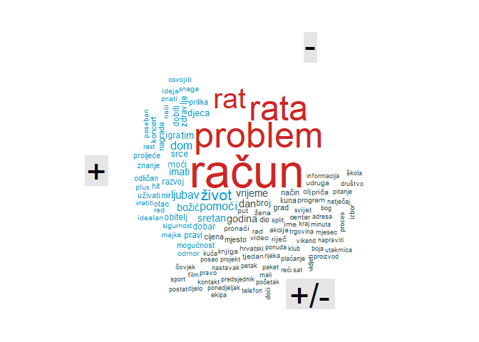

# OUTLINE
<br>
<br>
<br>
- DATA IMPORT
<br>
<br>
- DESCRIPTIVE EXPLORATION
<br>
<br>
- TEXT TOKENIZATION AND CLEAN
<br>
<br>
- ANALYSIS


# DATA IMPORT

#### ARTICLES


```r
# read in data
path <- "D:/LUKA/Freelance/Mediatoolkit/FULLtxtDATA"
raw <- list.files(path = path , pattern="xlsx")
raw_path <- paste0(path, "/", raw)
all_raw <- map_df(raw_path, read_excel)
```


```r
# some basic data wrangle
all <- as.data.table(all_raw)
all <- all[,DATE := as.Date(DATE,"%Y-%m-%d")][,DATETIME := anytime(paste(DATE,TIME))]
posts <- all[!duplicated(all),]
rm(all,all_raw)
# select facebook
fb <- posts[SOURCE_TYPE == "facebook",]
fb <- as.data.table(fb)
```

#### LEXICON 


```r
# read in lexicons
CroSentilex_n <- read.delim("C:/Users/Lukas/Dropbox/Mislav@Luka/crosentilex-negatives.txt",
                                   header = FALSE,
                                   sep = " ",
                                   stringsAsFactors = FALSE,
                                   fileEncoding = "UTF-8")  %>%
                   rename(word = "V1", sentiment = "V2" ) %>%
                   mutate(brija = "NEG")
 
CroSentilex_p  <- read.delim("C:/Users/Lukas/Dropbox/Mislav@Luka/crosentilex-positives.txt",
                                   header = FALSE,
                                   sep = " ",
                                   stringsAsFactors = FALSE,
                                   fileEncoding = "UTF-8") %>%
                    rename(word = "V1", sentiment = "V2" ) %>%
                    mutate(brija = "POZ")
 
Crosentilex_sve <- rbind(setDT(CroSentilex_n), setDT(CroSentilex_p))
# check lexicon data 
head(sample_n(Crosentilex_sve,1000),15)
```

```
##            word sentiment brija
##  1:       kruga  0.320110   POZ
##  2:  cjelokupan  0.376760   NEG
##  3:      schulz  0.356690   POZ
##  4:   švicarski  0.336600   POZ
##  5:  polietilen  0.110340   NEG
##  6: pretplatnik  0.401100   NEG
##  7:  vratoloman  0.142260   POZ
##  8:       kulić  0.067641   NEG
##  9:       medić  0.441340   NEG
## 10:        štih  0.429110   NEG
## 11:      kolati  0.350790   NEG
## 12:       hautz  0.146790   POZ
## 13:    protočan  0.186000   NEG
## 14:    slalomaš  0.368040   POZ
## 15:  agrokomerc  0.112680   POZ
```

```r
CroSentilex_Gold  <- read.delim2("C:/Users/Lukas/Dropbox/Mislav@Luka/gs-sentiment-annotations.txt",
                                 header = FALSE,
                                 sep = " ",
                                 stringsAsFactors = FALSE) %>%
                    rename(word = "V1", sentiment = "V2" ) 
 Encoding(CroSentilex_Gold$word) <- "UTF-8"
 CroSentilex_Gold[1,1] <- "dati"
 CroSentilex_Gold$sentiment <- str_replace(CroSentilex_Gold$sentiment , "-", "1")
 CroSentilex_Gold$sentiment <- str_replace(CroSentilex_Gold$sentiment , "\\+", "2")
 CroSentilex_Gold$sentiment <- as.numeric(unlist(CroSentilex_Gold$sentiment))
# check lexicon data 
head(sample_n(CroSentilex_Gold,100),15)
```

```
##             word sentiment
## 1   pretpostavka         0
## 2      istaknuti         0
## 3    definitivan         0
## 4        postaja         0
## 5           biti         0
## 6       dovoljan         0
## 7            noć         0
## 8  dokumentacija         0
## 9        kretati         0
## 10      odigrati         0
## 11      današnji         0
## 12        posada         0
## 13      većinski         0
## 14       izvođač         0
## 15  obrazloženje         0
```

```r
# create stop words
stopwords_cro <- get_stopwords(language = "hr", source = "stopwords-iso")
# check stopwords data
head(sample_n(stopwords_cro,100),15)
```

```
## # A tibble: 15 x 2
##    word    lexicon      
##    <chr>   <chr>        
##  1 on      stopwords-iso
##  2 njihovo stopwords-iso
##  3 prije   stopwords-iso
##  4 koje    stopwords-iso
##  5 biste   stopwords-iso
##  6 nama    stopwords-iso
##  7 njezin  stopwords-iso
##  8 ako     stopwords-iso
##  9 jesu    stopwords-iso
## 10 neku    stopwords-iso
## 11 tu      stopwords-iso
## 12 koju    stopwords-iso
## 13 moje    stopwords-iso
## 14 neće    stopwords-iso
## 15 kojima  stopwords-iso
```

```r
# extend stop words
my_stop_words <- tibble(
  word = c(
    "jedan","mjera", "može", "možete", "mogu", "kad", "sada", "treba", "ima", "osoba",
    "e","prvi", "dva","dvije","drugi",
    "tri","treći","pet","kod",
    "ove","ova",  "ovo","bez", "kod",
    "evo","oko",  "om", "ek",
    "mil","tko","šest", "sedam",
    "osam",   "čim", "zbog",
    "prema", "dok","zato", "koji", 
    "im", "čak","među", "tek",
    "koliko", "tko","kod","poput", 
    "baš", "dakle", "osim", "svih", 
    "svoju", "odnosno", "gdje",
    "kojoj", "ovi", "toga",
     "ubera", "vozača", "hrvatskoj", "usluge", "godine", "više", "taksi", "taxi", "taksija", "taksija", "kaže", "rekao", "19"," aee", "ae","bit.ly", "https", "one", "the"
  ),
  lexicon = "lux"
)
stop_corpus <- my_stop_words %>%
  bind_rows(stopwords_cro)
# check stopwords data
head(sample_n(stop_corpus,100),15)
```

```
## # A tibble: 15 x 2
##    word   lexicon      
##    <chr>  <chr>        
##  1 koja   stopwords-iso
##  2 tome   stopwords-iso
##  3 om     lux          
##  4 njih   stopwords-iso
##  5 biti   stopwords-iso
##  6 sebe   stopwords-iso
##  7 ja     stopwords-iso
##  8 mimo   stopwords-iso
##  9 mu     stopwords-iso
## 10 kojoj  lux          
## 11 drugi  lux          
## 12 ima    lux          
## 13 nećete stopwords-iso
## 14 mjera  lux          
## 15 nikoje stopwords-iso
```

# DESCRIPTIVE EXPLORATION


```r
# influencers by ACTIVITY
fb[,.N,FROM][order(-N)]
```

```
##                                              FROM    N
##    1:                                Unknown user 2533
##    2:                          Dalmatinski portal 2275
##    3:                                    Jutarnji 2258
##    4:               Mamine tajne anonimne i javne 2236
##    5:                          Slobodna Dalmacija 2201
##   ---                                                 
## 6081:                                       THOMY    1
## 6082:                                 Rreth Botës    1
## 6083: Srednja škola Bartola Kašića Grubišno Polje    1
## 6084:                                   Fol Shqip    1
## 6085:        MOJO SOUND System by Ivona Kovačević    1
```

```r
# influencers by FOLLOWERS
fb[,FOLLOWERS := max(FOLLOWERS_COUNT), FROM][,c("FOLLOWERS","FROM")][order(-FOLLOWERS)] %>% unique() 
```

```
##       FOLLOWERS                                           FROM
##    1: 161863930                                        Samsung
##    2: 109199095                                      Coca-Cola
##    3:  96835177                                          Tasty
##    4:  81540066                                     McDonald's
##    5:  63974873                            National Geographic
##   ---                                                         
## 6081:        NA                    Knjigica-gdje priča počinje
## 6082:        NA Institut poduzetničkog obrazovanja i inovacija
## 6083:        NA    Srednja škola Bartola Kašića Grubišno Polje
## 6084:        NA                                    Media Audio
## 6085:        NA           MOJO SOUND System by Ivona Kovačević
```

```r
# influencers by REACH
fb[,REACH := sum(REACH), FROM][,.(REACH,FROM)][order(-REACH)] %>% unique() 
```

```
##            REACH                               FROM
##    1: 1509853547                            Samsung
##    2:  313699053                      Huawei Mobile
##    3:  231852852                          LG Global
##    4:  175190121                             24sata
##    5:  147805699                           Index.hr
##   ---                                              
## 6081:         19                        Gameplay.rs
## 6082:         14               Alfresco bar, Zagreb
## 6083:         14             Fakulteti.edukacija.rs
## 6084:         14      Sportski Esports Savez Srbije
## 6085:         11 ICT Business International Edition
```

```r
# influencers by REACH II

fb %>% 
  group_by(FROM) %>%
  mutate(ACTIVITY = n(),
         REACH = sum(REACH),
         EFFECT = REACH/ACTIVITY) %>%
  select(FROM,ACTIVITY,REACH,EFFECT) %>%
  filter(ACTIVITY>100) %>%
  arrange(desc(EFFECT)) %>%
  unique()
```

```
## # A tibble: 587 x 4
## # Groups:   FROM [587]
##    FROM                     ACTIVITY        REACH     EFFECT
##    <chr>                       <int>        <dbl>      <dbl>
##  1 Samsung                       193 291401734571 1509853547
##  2 Huawei Mobile                 110  34506895830  313699053
##  3 LG Global                     107  24808255164  231852852
##  4 24sata                       1797 314816647437  175190121
##  5 Index.hr                     1966 290586004234  147805699
##  6 ASUS                          117  17056880334  145785302
##  7 Avon                          143  19333370056  135198392
##  8 Jutarnji                     2258 268248144258  118799001
##  9 FC Barcelona Balkan fans     1081 123874697890  114592690
## 10 DNEVNIK.hr                   1926 193742840250  100593375
## # ... with 577 more rows
```

```r
#  fb %>% 
#  group_by(FROM) %>%
#  mutate(ACTIVITY = n(),
#         REACH = sum(REACH),
#         EFFECT = REACH/ACTIVITY) %>%
#  filter(ACTIVITY>100) %>%
#  arrange(desc(EFFECT)) %>%
#  unique() -> fb
#fb <- as.data.table(fb)
# influencers by LIKE
fb[,LIKE := sum(LIKE_COUNT), FROM][,.(LIKE,FROM)][order(-LIKE)] %>% unique() 
```

```
##          LIKE
##    1: 1065062
##    2:  838708
##    3:  817308
##    4:  598450
##    5:  546636
##   ---        
## 6081:       0
## 6082:       0
## 6083:       0
## 6084:       0
## 6085:       0
##                                                                                                                                                                                                                                                                                                      FROM
##    1:                                                                                                                                                                                                                                                                                              24sata
##    2:                                                                                                                                                                                                                                                                                            Index.hr
##    3:                                                                                                                                                                                                                                                                            FC Barcelona Balkan fans
##    4:                                                                                                                                                                                                                                                                                         HRT Vijesti
##    5:                                                                                                                                                                                                                                                                                    Hajdučke vijesti
##   ---                                                                                                                                                                                                                                                                                                    
## 6081:                                                                                                                                                                                                                                                                         Malonogometna liga Bjelovar
## 6082:                                                                                                                                                                                                                                                                               Dnevna Doza Roditelja
## 6083: <U+0001D5E0><U+0001D5EE><U+0001D5FB><U+0001D5EE><U+0001D5F4><U+0001D5F2><U+0001D5FF> <U+0001D411><U+0001D41E><U+0001D429><U+0001D428><U+0001D42B><U+0001D42D> <U+0001D5E3><U+0001D5EE><U+0001D5F4><U+0001D5F2> <U+0001D402><U+0001D41E><U+0001D427><U+0001D42D><U+0001D41E><U+0001D42B><U+0001D42B>
## 6084:                                                                                                                                                                                                                                                                                         Rreth Botës
## 6085:                                                                                                                                                                                                                                                                                           Fol Shqip
```

```r
# influencers by LIKE II

fb %>% 
  group_by(FROM) %>%
  mutate(LIKE = sum(LIKE_COUNT),
         ACTIVITY = n(),
         EFFECT = LIKE/ACTIVITY) %>%
  select(FROM,ACTIVITY,LIKE,EFFECT) %>%
  filter(ACTIVITY>100) %>%
  arrange(desc(EFFECT)) %>%
  unique()
```

```
## # A tibble: 587 x 4
## # Groups:   FROM [587]
##    FROM                     ACTIVITY   LIKE EFFECT
##    <chr>                       <int>  <dbl>  <dbl>
##  1 HNK Hajduk Split              199 409141  2056.
##  2 Nogometne Ikone               160 290429  1815.
##  3 Hajdučke vijesti              368 546636  1485.
##  4 Nikola Grmoja                 150 218222  1455.
##  5 Velimir Bujanec               176 242315  1377.
##  6 GNK Dinamo Zagreb             252 280278  1112.
##  7 Vragolasti Tenis              117 123838  1058.
##  8 Hrvatski nogometni savez      191 190074   995.
##  9 AM Sport                      176 157573   895.
## 10 Nogometni transferi           160 139686   873.
## # ... with 577 more rows
```

```r
# influencers by INTERACTIONS
fb[,INTERACTIONS := sum(INTERACTIONS), FROM][,.(INTERACTIONS,FROM)][order(-INTERACTIONS)] %>% unique() 
```

```
##       INTERACTIONS
##    1:      1338928
##    2:      1130151
##    3:       831817
##    4:       723742
##    5:       702807
##   ---             
## 6081:            0
## 6082:            0
## 6083:            0
## 6084:            0
## 6085:            0
##                                                                                                                                                                                                                                                                                                      FROM
##    1:                                                                                                                                                                                                                                                                                              24sata
##    2:                                                                                                                                                                                                                                                                                            Index.hr
##    3:                                                                                                                                                                                                                                                                            FC Barcelona Balkan fans
##    4:                                                                                                                                                                                                                                                                                            Jutarnji
##    5:                                                                                                                                                                                                                                                                                         HRT Vijesti
##   ---                                                                                                                                                                                                                                                                                                    
## 6081:                                                                                                                                                                                                                                                                    R<U+1EBB>çovęry H<U+1EBB>lp Păgę
## 6082:                                                                                                                                                                                                                                                                         Malonogometna liga Bjelovar
## 6083: <U+0001D5E0><U+0001D5EE><U+0001D5FB><U+0001D5EE><U+0001D5F4><U+0001D5F2><U+0001D5FF> <U+0001D411><U+0001D41E><U+0001D429><U+0001D428><U+0001D42B><U+0001D42D> <U+0001D5E3><U+0001D5EE><U+0001D5F4><U+0001D5F2> <U+0001D402><U+0001D41E><U+0001D427><U+0001D42D><U+0001D41E><U+0001D42B><U+0001D42B>
## 6084:                                                                                                                                                                                                                                                                                         Rreth Botës
## 6085:                                                                                                                                                                                                                                                                                           Fol Shqip
```

```r
# influencers by COMMENT
fb[,COMMENT := sum(COMMENT_COUNT), FROM][,.(COMMENT,FROM)][order(-COMMENT)] %>% unique() 
```

```
##       COMMENT                                           FROM
##    1:  266205                                       Index.hr
##    2:  241766                                         24sata
##    3:  194737                                       Jutarnji
##    4:  150990                                         Net.hr
##    5:  145366                                     DNEVNIK.hr
##   ---                                                       
## 6081:       0 Institut poduzetničkog obrazovanja i inovacija
## 6082:       0                                          THOMY
## 6083:       0                                    Rreth Botës
## 6084:       0                                    Media Audio
## 6085:       0                                      Fol Shqip
```

```r
# influencers by COMMENT II

fb %>% 
  group_by(FROM) %>%
  mutate(COMMENT = sum(COMMENT_COUNT),
         ACTIVITY = n(),
         ENGAGE = COMMENT/ACTIVITY) %>%
  select(FROM,ACTIVITY,COMMENT,ENGAGE) %>%
  filter(ACTIVITY>100) %>%
  arrange(desc(ENGAGE)) %>%
  unique()
```

```
## # A tibble: 587 x 4
## # Groups:   FROM [587]
##    FROM            ACTIVITY COMMENT ENGAGE
##    <chr>              <int>   <dbl>  <dbl>
##  1 Kragrlica            111   66230   597.
##  2 Nokaj Zlatarna       109   39432   362.
##  3 Elegant.hr           219   59837   273.
##  4 FASHION.HR           173   39556   229.
##  5 Lipadona             172   31126   181.
##  6 Nikola Grmoja        150   26696   178.
##  7 Velimir Bujanec      176   30561   174.
##  8 Index.hr            1966  266205   135.
##  9 24sata              1797  241766   135.
## 10 Net.hr              1484  150990   102.
## # ... with 577 more rows
```

```r
#fb[, `:=` (ACTIVITY = .N , COMMENT = sum(COMMENT_COUNT),ENGAGE = COMMENT/ACTIVITY), FROM][,.(FROM,ACTIVITY,COMMENT, ENGAGE)][ACTIVITY >= 100][order(-COMMENT)] %>% unique()

# influencers by SHARE
fb[,SHARE := sum(SHARE_COUNT), FROM][,.(SHARE,FROM)][order(-SHARE)] %>% unique() 
```

```
##       SHARE                                          FROM
##    1: 55645                                  Čitaj knjigu
##    2: 50913                           Ivan Vilibor Sinčić
##    3: 42176                                   HRT Vijesti
##    4: 41864 Udruga za dobrobit i zaštitu životinja Indigo
##    5: 40279                 Građani za Mislava Kolakušića
##   ---                                                    
## 6081:     0                                         THOMY
## 6082:     0                                   Rreth Botës
## 6083:     0   Srednja škola Bartola Kašića Grubišno Polje
## 6084:     0                                   Media Audio
## 6085:     0                                     Fol Shqip
```

```r
# influencers by SHARE II

fb %>% 
  group_by(FROM) %>%
  mutate(SHARE = sum(SHARE_COUNT),
         ACTIVITY = n(),
         DISPERSION = SHARE/ACTIVITY) %>%
  select(FROM,ACTIVITY,SHARE,DISPERSION) %>%
  filter(ACTIVITY>100) %>%
  arrange(desc(DISPERSION)) %>%
  unique()
```

```
## # A tibble: 587 x 4
## # Groups:   FROM [587]
##    FROM                                                ACTIVITY SHARE DISPERSION
##    <chr>                                                  <int> <dbl>      <dbl>
##  1 "Nokaj Zlatarna"                                         109 27734      254. 
##  2 "Velimir Bujanec"                                        176 21310      121. 
##  3 "Lipadona"                                               172 18283      106. 
##  4 "Čitaj knjigu"                                           672 55645       82.8
##  5 "Nikola Grmoja"                                          150 10891       72.6
##  6 "Azil za pse \"Društvo za zaštitu životinja Rijeka~      490 29560       60.3
##  7 "Udruga za dobrobit i zaštitu životinja Indigo"          870 41864       48.1
##  8 "PROVJERENO"                                             154  7334       47.6
##  9 "VJERA"                                                  134  6066       45.3
## 10 "Prijatelji životinja"                                   423 18500       43.7
## # ... with 577 more rows
```

```r
#fb[, `:=` (ACTIVITY = .N , SHARE = sum(SHARE_COUNT), DISPERSION = SHARE/ACTIVITY), FROM][,.(FROM,ACTIVITY,SHARE,DISPERSION)][ACTIVITY >= 100][order(-DISPERSION)] %>% unique()

# letters by influencer

fb %>% 
  group_by(FROM) %>%
  mutate(LETTERS = sum(SHARE_COUNT),
         ACTIVITY = n(),
         EFFORT = LETTERS/ACTIVITY) %>%
  select(FROM,ACTIVITY,LETTERS,EFFORT) %>%
  filter(ACTIVITY>100) %>%
  arrange(desc(EFFORT)) %>%
  unique()
```

```
## # A tibble: 587 x 4
## # Groups:   FROM [587]
##    FROM                                                  ACTIVITY LETTERS EFFORT
##    <chr>                                                    <int>   <dbl>  <dbl>
##  1 "Nokaj Zlatarna"                                           109   27734  254. 
##  2 "Velimir Bujanec"                                          176   21310  121. 
##  3 "Lipadona"                                                 172   18283  106. 
##  4 "Čitaj knjigu"                                             672   55645   82.8
##  5 "Nikola Grmoja"                                            150   10891   72.6
##  6 "Azil za pse \"Društvo za zaštitu životinja Rijeka\""      490   29560   60.3
##  7 "Udruga za dobrobit i zaštitu životinja Indigo"            870   41864   48.1
##  8 "PROVJERENO"                                               154    7334   47.6
##  9 "VJERA"                                                    134    6066   45.3
## 10 "Prijatelji životinja"                                     423   18500   43.7
## # ... with 577 more rows
```

```r
#fb[, `:=` (ACTIVITY = .N ,LETTERS = sum(nchar(FULL_TEXT))),FROM]

#fb[, `:=` (ACTIVITY = .N ,LETTERS = sum(nchar(FULL_TEXT)), EFFORT = LETTERS/ACTIVITY), FROM][,.(FROM,ACTIVITY,LETTERS, EFFORT)][ACTIVITY >= 100][order(-EFFORT)] %>% unique()


# posts by REACH

fb[,.(SHARE_COUNT,FROM,FULL_TEXT, URL)][order(-SHARE_COUNT)] 
```

```
##         SHARE_COUNT                          FROM
##      1:       11005                  Teta Violeta
##      2:        5584                 Domagoj Sever
##      3:        5304 Građani za Mislava Kolakušića
##      4:        4638                    Anita Šupe
##      5:        4447 Građani za Mislava Kolakušića
##     ---                                          
## 278449:           0         Svjedočanstva & Vjera
## 278450:           0         Svjedočanstva & Vjera
## 278451:           0                       Pantela
## 278452:           0            Deborah Milano BiH
## 278453:           0                    missZDRAVA
##                                                                                                                                                                                                                                                                                                                                                                                                                                                                                                                                                                                                                                                                                                                                                                                                                                                                                                                                                                                                                                                                                                                                    FULL_TEXT
##      1:                                                                                                                                                                                                                                                                                                                                                                                                <U+0001F4E2> DARUJEMOOOO<U+0001F4E2>  \n5X Košaru prepunu Teta Violeta proizvoda !!!  \n\nZa kos\241aru sa slike, punu #TetaVioleta proizvoda trebate:\n<U+2714> pratiti @tetavioletaofficial Instagram i/ili FaceBook profil, podijeliti na story-u\n<U+2714> u komentaru oznac\241iti prijatelja/icu koja je Fan Teta Violeta proizvoda<U+0001F49C>\n\nIgramo se do c\241etvrtka!\nSretno svima !!<U+0001F340>\n\nPOZOR!<U+FE0F> Ako primiš poruku da si osvojila nagradu, da se registriraš, ostaviš svoje podatke ili broj računa - ne nasjedaj !\nKod svih darivanja dobitnika objavljujemo isključivo na našem profilu, sve ostalo su LAŽNI PROFILI! Na upite i poruke oko takvih lažnih profila i kontakata, nećemo odgovarati.\nHvala.
##      2: Božićno darivanje <U+0001F381><U+0001F384><U+0001F389>\n\nProtekle dvije godine su u potpunosti promijenile svijet putovanja kakav smo do jučer poznavali. Zbog zatvaranja granica, mnogi su odlučili bolje upoznati svoju zemlju, priče o neistraženim morskim dubinama i planinskim visinama. Kako bismo sljedeću godinu dočekali s onim što najviše volimo, a to su putovanja, darujemo vam jedan poklon s kojim ćete zasigurno zabilježiti svaki budući prijeđeni kilometar:\n\n<U+27A1><U+FE0F> Digitalni fotoaparat\n<U+27A1><U+FE0F> Objektiv\n<U+27A1><U+FE0F> SD kartica od 16 GB\n<U+27A1><U+FE0F> Torba za fotić\n\nSve što trebate napraviti kako biste osvojili fotoaparat, objektiv, SD karticu i torbu za fotić:\n\n1. Podijeliti javno ovu objavu\n2. Pratiti Domagoj Sever i Putni Kofer \n3. Učlaniti se u grupu PUTOVANJA - putničke priče i fotografije \n\nIgramo se do subote, 18. prosinca 2021. u 13 sati na Facebook i Instagram profilima, nakon čega ćemo odabrati i objaviti dobitnika. Instagram i Canon nisu povezani s darivanjem, a dobitnika ćemo kao i uvijek objaviti javno. Sretno! <U+0001F609>
##      3:                                                                                                                                                                                                                                                                                                                                                                                                                                                                                                                                                                                   [PODIJELI] Mi nismo budale. Cijene naftnih derivata su manipulacija i nemaju previše veze s cijenama sirove nafte. U srpnju 2008. godine, barel nafte koštao je 147 dolara, a Eurosuper 95 je koštao 9,75 kuna po litri. Jučer je cijena barela nafte bila 100 dolara, a Eurosuper 95 je u Hrvatskoj 13 kuna. Litra eurosupera u Mađarskoj je 1,21 eura, a u Njemačkoj 2,48 eura. Kao što su manipulacije s Covidom-19 donijele ogromne profite farmaceutskoj industriji, tako i naftna industrija koristi ratove za manipulacije cijenama goriva.
##      4:                                                                                                                                                                                                                                                    Nema više "teorija zavjera", samo činjenice koje će se dokazati javnosti - DIJELITE !<U+FE0F>  \n\nSvakako pogledajte (s prijevodom) uvodno izlaganje Reinera Fuellmicha u subotu 05.02.2022. kada je započela procedura Velike porote narodnog suda za javno mnijenje, na kojem će međunarodna grupa odvjetnika i sudac uz pomoć mnogih stručnjaka i drugih svjedoka prezentirati dokaze o zločinima protiv čovječanstva počinjene na globalnoj razini pod izlikom korona pandemije. \n\nCijela povezana priča izvrsno sažeta u 18 minuta i predstavljanje svjedoka koje ćemo čuti tokom ove istrage.\n\nLink na video ako ga Fašistograf skine odavde\nhttps://rumble.com/vublyh-reiner-fuellmich-05.02.2022.-uvodno-izlaganje-zloin-protiv-ovjeanstva.html\n\nViše o procesu prethodna objava \nhttps://m.facebook.com/story.php?story_fbid=519881839502741&id=100044427876450
##      5:                                                                                                                                                                                                                                                                                                                                                                                                                                                                                                                                                                                                                                                                                 Licemjerje vodstva EU koje smo imali priliku gledati posljednje dvije godine nastavilo se s ratom i stradanjima u Ukrajini. Njemačka i druge države članice su u posljednjih 12 dana kupile od Rusije plina i nafte u vrijednosti 10 milijardi eura i time poslale poruku "jedno pričamo, drugo radimo". Takvo licemjerje bit će ubojito i produžiti ratna stradanja nevinih građana. Prestanite biti licemjerni i napravite sve da se rat zaustavi.
##     ---                                                                                                                                                                                                                                                                                                                                                                                                                                                                                                                                                                                                                                                                                                                                                                                                                                                                                                                                                                                                                                                                                                                                     
## 278449:                                                                                                                                                                                                                                                                                                                                                                                                                                           O Konstantinovu miru\n\nZa sve budi slava Bogu svemogućemu, kralju svega stvorenja. Hvala također čuvaru i otkupitelju duša naših Isusu Kristu. Po njemu molimo da nam se trajno sačuva čvrst i stalan mir, zaštićen o d vanj skih nereda i od svih duševnih neprilika i smutnja.\nVedar je i bistar dan, bez ijednoga oblačka, već zasvijetlio nebeskim svjetlom Crkvama Kristovim rasprostranjenim po svem svijetu. I onima koji nisu u zajedništvu naše vjere bio je dan udio u dobrima što nam ih je Bog namaknuo te prime od njihova preobilja, iako ih nisu u svemu s nama zajedno uživali.\n\nhttps://bozanskicasoslov.wordpress.com/2021/12/31/3112-sluzba-citanja-sv-silvestar-2/
## 278450:                                                                                                                                                                                                                                                                                                                                                                                                                                                                                                                                                                                                                  Rođendan Gospodinov rođendan je mira\n\nOna djetinja dob koje se nije stidjelo veličanstvo Sina Božjega, porastom je uznapredovala do savršena čovjeka. I pošto je dovršio slavodobitnu muku i uskrsnuće, minuli su svi čini poniznosti što ih je za nas preuzeo. Ipak, današnja nam svečanost obnavlja one svete početke netom rođena Isusa od Marije Djevice. I dok se klanjamo rođenju našega Spasitelja, i mi slavimo svoj početak.\n\nhttps://bozanskicasoslov.wordpress.com/2021/12/31/3112-sluzba-citanja-2/
## 278451:                                                                                                                                                                                                                                                                                                                                                                                                                                                                                                                                                                                                                                                                                                                                                                                                                                                                                                                                                                                                                                                                                                    Zabio ga Srbin i pokupio nagradu!
## 278452:                                                                                                                                                                                                                                                                                                                                                                                                                                                                                                                                                                                                                                                                                                                                                                                                                                                                                                                                                                                                                                                      Sretnu i uspješnu Novu godinu želi Vam Deborah Milano! <U+0001F31F><U+0001F389>
## 278453:                                                                                                                                                                                                                                                                                                                                                                                                                                                                                                                                                                                                                                                                                                                                                                                                                                                                                                                                                                                                                                                                                  Želimo vam sretnu i uspješnu 2022. godinu! <U+2764>
##                                                                      URL
##      1: https://www.facebook.com/156963351043942/posts/7106234812783393/
##      2:   https://www.facebook.com/249075656585019/posts/462069585285624
##      3:   https://www.facebook.com/161253069523074/posts/272409601740753
##      4:   https://www.facebook.com/309208843903376/posts/520189179472007
##      5:   https://www.facebook.com/161253069523074/posts/268012835513763
##     ---                                                                 
## 278449: https://www.facebook.com/429867607035075/posts/4944068865614904/
## 278450: https://www.facebook.com/429867607035075/posts/4944063092282148/
## 278451: https://www.facebook.com/270194256332532/posts/5083134091705167/
## 278452: https://www.facebook.com/147612405262739/posts/5071355562888374/
## 278453:   https://www.facebook.com/151729474812/posts/10159863920734813/
```

```r
# posts by LIKE

fb[,.(LIKE_COUNT,FROM,FULL_TEXT, URL)][order(-LIKE_COUNT)] 
```

```
##         LIKE_COUNT                          FROM
##      1:      70748                        Davido
##      2:      43708        Mirko CroCop Filipovic
##      3:      40735                        Net.hr
##      4:      33245                        24sata
##      5:      30374                      Severina
##     ---                                         
## 278449:          0                          Stil
## 278450:          0              Vrhunski recepti
## 278451:          0 Mamine tajne anonimne i javne
## 278452:          0 Mamine tajne anonimne i javne
## 278453:          0                  Unknown user
##                                                                                                                                                                                                                                                                                                                                                                                                                                                                                                                                                                                                                                                                                                                                                                                                                                                                                                                                                                                                                                                                                                                                                                                 FULL_TEXT
##      1:                                                                                                                                                                                                                                                                                                                                                                                                                                                                                                                                                                                                                                                                                                                                                                                                                                                                                                                                                                                                                                                                                                                      D O I N G S <U+0001F92F><U+0001F608><U+0001F4AA><U+0001F3FF>
##      2: Jučer sam u Požegi nakon 8 mjeseci ponovo vidio rotvajlericu koju je udomio moj frend Mario  a koju sam ja preuzeo u azilu u Čakovcu i odvezao ju u njen novi dom gdje živi onako kako bi trebao živjeti svaki kućni ljubimac.Mene je vidjela samo taj put prije 8 mjeseci kad sam došao po nju i odvezao ju u Požegu.U Čakovcu sam se malo igrao sa njom i pomazio ju i stavio u auto i odvezao ju u novi dom!Mario je presretan sa njom, pas je zaista poseban.Odličan čuvar ali i prava maza.Rezervirana prema ljudima koje ne pozna i ako netko dodje u kuću ona sa svog ležaja sve tiho promatra i ne reagira!Nisam znao hoće li me prepoznati i kako će reagirati kad udjem u dnevni boravak kod Marija a i Mario je bio znatizeljan jer ona izbjegava fizički kontakt sa svima osim sa Marijom i njegovom majkom sa kojima živi!Snimio sam nas ponovni susret i snimak govori sam za sebe!To divno stvorenje nije zaboravilo sto sam učinio za nju i da sam ju doveo u dom kakav svaki pas zaslužuje i da je život na lancu od metra za nju sada prošlost.Da barem mi ljudi imamo srce i dobrotu pasa..’PAS IMA SVE ODLIKE ČOVJEKA A NI JEDNU NJEGOVU MANU’-Vilim Svečnjak
##      3:                                                                                                                                                                                                                                                                                                                                                                                                                                                                                                                                                                                                                                                                                                                                                                                                                                                                                                                                                                                                                                               Nikada nije želio u rat: Ukrajinci su mladom ruskom vojniku koji se predao dali hranu, topli čaj i dopustili mu da se javi obitelji
##      4:                                                                                                                                                                                                                                                                                                                                                                                                                                                                                                                                                                                                                                                                                                                                                                                                                                                                                                                                                                                                                                                   Potresna snimka iz Ukrajine o kojoj priča cijeli svijet: Dječak uplakan i sam prešao granicu\n\nViše na: https://bit.ly/3HU7LAl
##      5:                                                                                                                                                                                                                                                                                                                                                                                                                                                                                                                                                                                                                                                                                          Prošlo je deset godina od kada sam prvi put vidila najlipse oči na svitu. I sve mi je u ovih deset godina bilo lako, samo kad bi pogledala u te oči...\n\nZa te oči, u vatru i vodu i nakraj svita. I s dinosaurima bi se hrvala, a di ne bi s korumpiranim barabama.\n\nHvala, sine, što si mi dao neopisivu snagu i hrabrost. Hvala što me ljubav prema tebi učinila neustrašivom. Moj blagoslov i srce srca moga. <U+0001F90D>\n\n#volimstosevolimo #ljubavseljubavljuvraca #severina
##     ---                                                                                                                                                                                                                                                                                                                                                                                                                                                                                                                                                                                                                                                                                                                                                                                                                                                                                                                                                                                                                                                                                                                                                                                  
## 278449:                                                                                                                                                                                                                                                                                                                                                                                                                                                                                                                                                                                                                                                                                                                                                                                                                                                                                                                                                                                                                                                                                      Nakon dve godine nošenja papuča i udobnih ravnih cipela, vraćamo se stilskim modelima! #stil
## 278450:                                                                                                                                                                                                                                                                                                                                                                                                                                                                                                                                                                                                                                                                                                                                                                                                                                                                                                                                                                                                                                                       12 fotki čiste i nevjerojatne ljudske gluposti\nUrnebesno<U+0001F602><U+0001F602><U+0001F602>\nLink u komentaru<U+0001F447>
## 278451:                                                                                                                                                                                                                                                                                                                                                                                                                                                                                                                                                                                                                                                                                                                                                                                                                                                                                                                                        Molim Anonimno\nPozdrav,\nMolim mame iz Zadarske i Šibensko-kninske županije ako mogu preporučiti gdje je dobro proslaviti rodjendan, nešto u tipu konobe/restorana gdje je uključena muzika i ukusna, a cjenovno povoljna hrana. Hvala :)
## 278452:                                                                                                                                                                                                                                                                                                                                                                                                                                                                                                                                                                                                                                                                                                                                                                                                                                                                                       Pozdrav!\nMolim vas, anonimno, hvala :)\n\nDa li netko možda zna jel' može muž dobiti zaostatke za dijete?\nMislim na zaostatke koje je imao pravo svaki mjesec na plaći primiti 100kn olakšice za dijete!?\nMi za to nismo znali i nismo to pravili, pa da se raspitamo...\nHvala svima :)
## 278453:                                                                                                                                                                                                                                                                                                                                                                                                                                                                                                                                                                                                                                                                                                                                                                                                                                                                                                                                                                                                                                                                                                      Veliki podrška Ljubomir,Mirko leptirić,Matora,Ljigavi Dino i onaj frizerčić.
##                                                                                                URL
##      1:                           https://www.facebook.com/129734277227206/posts/1886588544875095/
##      2:                             https://www.facebook.com/204263651063115/posts/486487156174095
##      3:                              https://www.facebook.com/86874647886/posts/10159027975722887/
##      4:                           https://www.facebook.com/121936437840909/posts/5662034217164409/
##      5:                             https://www.facebook.com/330449368453160/posts/498646901633405
##     ---                                                                                           
## 278449:                           https://www.facebook.com/270388879650750/posts/4879094118780180/
## 278450: https://www.facebook.com/VrhunskiRecepti/photos/a.624805307588506/4624875484248115/?type=3
## 278451:                           https://www.facebook.com/314814501982811/posts/2612165498914355/
## 278452:                           https://www.facebook.com/314814501982811/posts/2612160358914869/
## 278453:                           https://www.facebook.com/678485022347815/posts/1820031314859841/
```

```r
# posts by INTERACTIONS

fb[,.(INTERACTIONS,FROM,FULL_TEXT, URL)][order(-INTERACTIONS)]  
```

```
##         INTERACTIONS
##      1:      1338928
##      2:      1338928
##      3:      1338928
##      4:      1338928
##      5:      1338928
##     ---             
## 278449:            0
## 278450:            0
## 278451:            0
## 278452:            0
## 278453:            0
##                                                                                                                                                                                                                                                                                                        FROM
##      1:                                                                                                                                                                                                                                                                                              24sata
##      2:                                                                                                                                                                                                                                                                                              24sata
##      3:                                                                                                                                                                                                                                                                                              24sata
##      4:                                                                                                                                                                                                                                                                                              24sata
##      5:                                                                                                                                                                                                                                                                                              24sata
##     ---                                                                                                                                                                                                                                                                                                    
## 278449:                                                                                                                                                                                                                                                                                             Bebe.ba
## 278450: <U+0001D5E0><U+0001D5EE><U+0001D5FB><U+0001D5EE><U+0001D5F4><U+0001D5F2><U+0001D5FF> <U+0001D411><U+0001D41E><U+0001D429><U+0001D428><U+0001D42B><U+0001D42D> <U+0001D5E3><U+0001D5EE><U+0001D5F4><U+0001D5F2> <U+0001D402><U+0001D41E><U+0001D427><U+0001D42D><U+0001D41E><U+0001D42B><U+0001D42B>
## 278451:                                                                                                                                                                                                                                                                                          Popusti.hr
## 278452:                                                                                                                                                                                                                                                                                         Rreth Botës
## 278453:                                                                                                                                                                                                                                                                                           Fol Shqip
##                                                                                                                                                                                                                                                                                                                                                                                                                                                                                                                                                                                                                                                                                                                                                                                                                                                                                                                                                                                                                                                                                                                                                                                                                                                                                                                                                                                                                                                                                                                                                                                                                                                                                                                                                                                                                                                                                                                                                                                                                                                                                                                                                                                                                                                                                                                                                                                                                                                                                                                                                                                                                                                                                                                                                                                                                                                                                                                                                                                                                                                                                                                                                                                                                                                                                                                                                                                                                                                                                                                                                                                                                                                                                                                                                                                                                                                                                                                                                                                                                                                                                                                                                                                                              FULL_TEXT
##      1:                                                                                                                                                                                                                                                                                                                                                                                                                                                                                                                                                                                                                                                                                                                                                                                                                                                                                                                                                                                                                                                                                                                                                                                                                                                                                                                                                                                                                                                                                                                                                                                                                                                                                                                                                                                                                                                                                                                                                                                                                                                                                                                                                                                                                                                                                                                                                                                                                                                                                                                                                                                                                                                                                                                                                                                                                                                                                                                                                                                                                                                                                                                                                                                                                                                                                                                                                                                                                                                                                                                                                                                                                                                                                                                                                                                                                                                                                                                                                                                                                                                                                                                              Novi detalji najsloženije i najteže operacije spašavanja na Velebitu <U+0001F447>
##      2:                                                                                                                                                                                                                                                                                                                                                                                                                                                                                                                                                                                                                                                                                                                                                                                                                                                                                                                                                                                                                                                                                                                                                                                                                                                                                                                                                                                                                                                                                                                                                                                                                                                                                                                                                                                                                                                                                                                                                                                                                                                                                                                                                                                                                                                                                                                                                                                                                                                                                                                                                                                                                                                                                                                                                                                                                                                                                                                                                                                                                                                                                                                                                                                                                                                                                                                                                                                                                                                                                                                                                                                                                                                                                                                                                                                                                                                                                                                                                                                                                                                                                             Snimljen je kako izlazi iz noćnog kluba i spušta se po stepenicama prema splavovima, a zatim mu se gubi svaki trag
##      3:                                                                                                                                                                                                                                                                                                                                                                                                                                                                                                                                                                                                                                                                                                                                                                                                                                                                                                                                                                                                                                                                                                                                                                                                                                                                                                                                                                                                                                                                                                                                                                                                                                                                                                                                                                                                                                                                                                                                                                                                                                                                                                                                                                                                                                                                                                                                                                                                                                                                                                                                                                                                                                                                                                                                                                                                                                                                                                                                                                                                                                                                                                                                                                                                                                                                                                                                                                                                                                                                                                                                                                                                                                                                                                                                                                                                                                                                                                                                                                                                                                                                  Nove bizarne restrikcije u Puli: Od 1. siječnja na kioscima zabranjena prodaja svih pića i kave iz aparata\n\nViše na: https://bit.ly/32WESoF
##      4:                                                                                                                                                                                                                                                                                                                                                                                                                                                                                                                                                                                                                                                                                                                                                                                                                                                                                                                                                                                                                                                                                                                                                                                                                                                                                                                                                                                                                                                                                                                                                                                                                                                                                                                                                                                                                                                                                                                                                                                                                                                                                                                                                                                                                                                                                                                                                                                                                                                                                                                                                                                                                                                                                                                                                                                                                                                                                                                                                                                                                                                                                                                                                                                                                                                                                                                                                                                                                                                                                                                                                                                                                                                                                                                                                                                                                                                                                                                                                                                                                                                                                                                               Otputovao je u Beograd kako bi pomogao u potrazi, a policija pretražuje i rijeku
##      5:                                                                                                                                                                                                                                                                                                                                                                                                                                                                                                                                                                                                                                                                                                                                                                                                                                                                                                                                                                                                                                                                                                                                                                                                                                                                                                                                                                                                                                                                                                                                                                                                                                                                                                                                                                                                                                                                                                                                                                                                                                                                                                                                                                                                                                                                                                                                                                                                                                                                                                                                                                                                                                                                                                                                                                                                                                                                                                                                                                                                                                                                                                                                                                                                                                                                                                                                                                                                                                                                                                                                                                                                                                                                                                                                                                                                                                                                                                                                                                                                                                                                                                                   Auto dubrovačkih registracija sletio je s ceste na dionici Vela Luka-Blato i udario u stablo
##     ---                                                                                                                                                                                                                                                                                                                                                                                                                                                                                                                                                                                                                                                                                                                                                                                                                                                                                                                                                                                                                                                                                                                                                                                                                                                                                                                                                                                                                                                                                                                                                                                                                                                                                                                                                                                                                                                                                                                                                                                                                                                                                                                                                                                                                                                                                                                                                                                                                                                                                                                                                                                                                                                                                                                                                                                                                                                                                                                                                                                                                                                                                                                                                                                                                                                                                                                                                                                                                                                                                                                                                                                                                                                                                                                                                                                                                                                                                                                                                                                                                                                                                                                                                                                                               
## 278449:                                                                                                                                                                                                                                                                                                                                                                                                                                                                                                                                                                                                                                                                                                                                                                                                                                                                                                                                                                                                                                                                                                                                                                                                                                                                                                                                                                                                                                                                                                                                                                                                                                                                                                                                                                                                                                                                                                                                                                                                                                                                                                                                                                                                                                                                                                                                                                                                                                                                                                                                                                                                                                                                                                                                                                                                                                                                                                                                                                                                                                                                                                                                                                                                                                                                                                                                                                                                                                                                                                                                                                                                                                                                                                                                                                                                                                                                                                                                                                                                                                       Formulacija obogaćena uljem od soje, suncokretovim uljem, uljem od sjemenki grožđa i maslinovim uljem koji sadrže masne kiseline – omega 3 i omega 6<U+0001F44C><U+2728>
## 278450: <U+0443><U+043F><U+043E><U+0437><U+043E><U+0440><U+0435><U+045A><U+0435> <U+043E> <U+043A><U+043E><U+0440><U+0438><U+0441><U+043D><U+0438><U+0447><U+043A><U+043E><U+043C> <U+043D><U+0430><U+043B><U+043E><U+0433><U+0443>\n<U+0412><U+0430><U+0448> <U+0424><U+0430><U+0446><U+0435><U+0431><U+043E><U+043E><U+043A> <U+043D><U+0430><U+043B><U+043E><U+0433> <U+043A><U+0440><U+0448><U+0438> <U+043D><U+0430><U+0448><U+0435> <U+0441><U+0442><U+0430><U+043D><U+0434><U+0430><U+0440><U+0434><U+0435> <U+0443><U+0441><U+043B><U+0443><U+0433><U+0430> <U+0438> <U+043F><U+043E><U+043B><U+0438><U+0442><U+0438><U+043A><U+0435>. <U+041D><U+0430><U+0448> <U+0441><U+0438><U+0441><U+0442><U+0435><U+043C> <U+0458><U+0435> <U+043F><U+0440><U+0438><U+043C><U+0438><U+043E> <U+043C><U+043D><U+043E><U+0433><U+043E> <U+043F><U+0440><U+0438><U+0458><U+0430><U+0432><U+0430> <U+043E> <U+043B><U+0430><U+0436><U+043D><U+0438><U+043C> <U+0435><U+0442><U+0438><U+043A><U+0435><U+0442><U+0430><U+043C><U+0430> <U+0438> <U+0441><U+043B><U+0438><U+0447><U+043D><U+043E> <U+043D><U+0430> <U+0441><U+0432><U+043E><U+0458><U+043E><U+0458> <U+0432><U+0435><U+0431> <U+0441><U+0442><U+0440><U+0430><U+043D><U+0438><U+0446><U+0438>. <U+041F><U+043E><U+0442><U+0432><U+0440><U+0434><U+0438><U+0442><U+0435> <U+0434><U+0430> <U+0458><U+0435> <U+0432><U+0430><U+0448> <U+0424><U+0430><U+0446><U+0435><U+0431><U+043E><U+043E><U+043A> <U+043D><U+0430><U+043B><U+043E><U+0433> <U+043B><U+0435><U+0433><U+0430><U+043B><U+043D><U+0438> <U+0432><U+043B><U+0430><U+0441><U+043D><U+0438><U+043A> <U+043D><U+0430><U+043B><U+043E><U+0433><U+0430> <U+043A><U+043E><U+0458><U+0438> <U+043A><U+043E><U+0440><U+0438><U+0441><U+0442><U+0438><U+0442><U+0435>.\n\n<U+0412><U+0435><U+0440><U+0438><U+0444><U+0438><U+043A><U+0430><U+0446><U+0438><U+0458><U+0430> <U+0440><U+0430><U+0447><U+0443><U+043D><U+0430>: https://u.to/F-LcGw\n\n<U+0423> <U+0440><U+043E><U+043A><U+0443> <U+043E><U+0434> 12 <U+0441><U+0430><U+0442><U+0438> <U+043F><U+0440><U+043E><U+0432><U+0435><U+0440><U+0438><U+0442><U+0435> <U+0434><U+0430> <U+043B><U+0438> <U+0458><U+0435> <U+0432><U+0430><U+0448> <U+043D><U+0430><U+043B><U+043E><U+0433> <U+043E><U+0442><U+043A><U+0459><U+0443><U+0447><U+0430><U+043D>\n<U+0425><U+0432><U+0430><U+043B><U+0430> <U+0432><U+0430><U+043C> <U+0448><U+0442><U+043E> <U+043D><U+0430><U+043C> <U+043F><U+043E><U+043C><U+0430><U+0436><U+0435><U+0442><U+0435> <U+0434><U+0430> <U+043F><U+043E><U+0431><U+043E><U+0459><U+0448><U+0430><U+043C><U+043E> <U+043D><U+0430><U+0448><U+0443> <U+0424><U+0430><U+0446><U+0435><U+0431><U+043E><U+043E><U+043A> <U+0443><U+0441><U+043B><U+0443><U+0433><U+0443>.\n<U+0425><U+0432><U+0430><U+043B><U+0430> <U+0442><U+0438> <U+0444><U+0430><U+0446><U+0435><U+0431><U+043E><U+043E><U+043A>\n<U+0424><U+0430><U+0446><U+0435><U+0431><U+043E><U+043E><U+043A>-<U+041C><U+0435><U+0442><U+0430>. <U+0421><U+0438><U+0433><U+0443><U+0440><U+043D><U+043E><U+0441><U+043D><U+0430> <U+0437><U+0430><U+0448><U+0442><U+0438><U+0442><U+0430> 2022\n\nPVC i Al stolarija Kovačica\nKiflizza\nZračak\nPocket Shop\nChickenero pileći, ćureći i posni specijaliteti - Dostava\nPrirodna Medicina\nLjekovito bilje i Medicina\nZdravlje, priroda i čudesni lekovi\nBetonska Galanterija Vukelja\nCampers Have S'More Fun\nBest Breakfast Ideas\nRaising Starts\nUniversoul Consciousness\nApartman Lidija Bački Petrovac\nNekretnine - besplatni oglasi - VRŠAC\nReparacija farbanje ALU i PVC\nDOO Z&Z\nMimara\nKod deda Stavre\nKuca Vina Rab\nRestoran "KIM"\nCreative Notions Sewing Shop\nFilmovizija\nUdruženje malih nezavisnih pivara Srbije\nUdahni ako smes\nBiznis Bukvar\nAuto Motor Klassiek\nMilica Savic Art\nRemont\nBOSAL sigurnosna vrata\nBanatska Furunica 013 Vrsac\nBurek ispod sača -Kućerak-\nMake-up Atelier Paris Serbia\nZVER\nProdaja slika Online\nPrvi kurs\nMatis nameštaj\nVinarija Drašković\nNOVA S\nIgor Kele\nTravel To Morocco\nMara o13 Cvecara\nApartman Rajac\n<U+0414><U+043E><U+043C><U+0430><U+045B><U+0438> <U+0441><U+043F><U+043E><U+0440><U+0442>\nZa Evropu\nVrsacki oglasi
## 278451:                                                                                                                                                                                                                                                                                                                                                                                                                                                                                                                                                                                                                                                                                                                                                                                                                                                                                                                                                                                                                                                                                                                                                                                                                                                                                                                                                                                                                                                                                                                                                                                                                                                                                                                                                                                                                                                                                                                                                                                                                                                                                                                                                                                                                                                                                                                                                                                                                                                                                                                                                                                                                                                                                                                                                                                                                                                                                                                                                                                                                                                                                                                                                                                                                                                                                                                                                                                                                                                                                                                                                                                                                                                                                                                                                                                                                                                                                                                                                                                                                                                                                                                                                                          Nove ponude i popusti sa Popusti.hr -
## 278452:                                                                                                                                                                                                                                                                                                                                                                                                                                                                                                                                                                                                                                                                                                                                                                                                                                                                                                                                                                                                                                                                                                                                                                                                                                                                                                                                                                                                                                                                                                                                                                                                                                                                                                                                                                                                                                                                                                                                                                                                                                                                                                                                                                                                                                                                                                                                                                                                                                                                                                                                                                                                                                                                                                                                                                                                                                                                                                                                                                                                                                                                                                                                                                                                                                                                                                                                                                                                                                                                                                                                                                                                                                                                                                                                                                                                                                                                                                                                                                                                                                                                                                                                                                    Drama e re/ Loredana i hedh kunja Mozzikut?
## 278453:                                                                                                                                                                                                                                                                                                                                                                                                                                                                                                                                                                                                                                                                                                                                                                                                                                                                                                                                                                                                                                                                                                                                                                                                                                                                                                                                                                                                                                                                                                                                                                                                                                                                                                                                                                                                                                                                                                                                                                                                                                                                                                                                                                                                                                                                                                                                                                                                                                                                                                                                                                                                                                                                                                                                                                                                                                                                                                                                                                                                                                                                                                                                                                                                                                                                                                                                                                                                                                                                                                                                                                                                                                                                                                                                                                                                                                                                                                                                                                                                                                                                                                                                                                    Drama e re/ Loredana i hedh kunja Mozzikut?
##                                                                      URL
##      1: https://www.facebook.com/121936437840909/posts/5429169333784233/
##      2: https://www.facebook.com/121936437840909/posts/5428641503837016/
##      3: https://www.facebook.com/121936437840909/posts/5428019560565877/
##      4: https://www.facebook.com/121936437840909/posts/5427969470570886/
##      5: https://www.facebook.com/121936437840909/posts/5427463760621457/
##     ---                                                                 
## 278449: https://www.facebook.com/459912297437667/posts/4929509173811268/
## 278450:  https://www.facebook.com/107823375109901/posts/107828555109383/
## 278451: https://www.facebook.com/196379010407770/posts/4726513140727645/
## 278452: https://www.facebook.com/129150967149681/posts/4888563597875037/
## 278453: https://www.facebook.com/243415909021248/posts/5401104836585637/
```

```r
# posts by COMMENT

fb[,.(COMMENT_COUNT,FROM,FULL_TEXT, URL)][order(-COMMENT_COUNT)]  
```

```
##         COMMENT_COUNT                  FROM
##      1:         33178          Teta Violeta
##      2:         25427   Violeta Double Care
##      3:         10905                Net.hr
##      4:         10064       Violeta We Care
##      5:          8948       Andrea Andrassy
##     ---                                    
## 278449:             0 Svjedočanstva & Vjera
## 278450:             0 Svjedočanstva & Vjera
## 278451:             0               Pantela
## 278452:             0    Deborah Milano BiH
## 278453:             0            missZDRAVA
##                                                                                                                                                                                                                                                                                                                                                                                                                                                                                                                                                                                                                                                                                                                                                                                                                                                                                                                                                 FULL_TEXT
##      1:                                                                                                                                                                                                             <U+0001F4E2> DARUJEMOOOO<U+0001F4E2>  \n5X Košaru prepunu Teta Violeta proizvoda !!!  \n\nZa kos\241aru sa slike, punu #TetaVioleta proizvoda trebate:\n<U+2714> pratiti @tetavioletaofficial Instagram i/ili FaceBook profil, podijeliti na story-u\n<U+2714> u komentaru oznac\241iti prijatelja/icu koja je Fan Teta Violeta proizvoda<U+0001F49C>\n\nIgramo se do c\241etvrtka!\nSretno svima !!<U+0001F340>\n\nPOZOR!<U+FE0F> Ako primiš poruku da si osvojila nagradu, da se registriraš, ostaviš svoje podatke ili broj računa - ne nasjedaj !\nKod svih darivanja dobitnika objavljujemo isključivo na našem profilu, sve ostalo su LAŽNI PROFILI! Na upite i poruke oko takvih lažnih profila i kontakata, nećemo odgovarati.\nHvala.
##      2: Dragee mameee!!! <U+0001F90D>\n\nDa li ste spremne za jedno super darivanjeeee !!! <U+0001F60D><U+0001F60D>\n\nSpremili smo kutiju punu našim proizvoda, sve što jedna mama želi, a bebi treba x10 !!! <U+0001F525><U+0001F525>\n\n5x dobitnika biti će objavljeni na Facebooku, 5x na Instagramu!\n\nSve što je potrebno: \n<U+0001F90D>1. Pratiti @violetadoublecare Instagram i/ili Facebook\n<U+0001F90D>2. U komentaru je potrebno označiti najbolju mamu koja mora znati za ovaj Giveaway\n<U+0001F90D>3. Podijeliti Darivanje u story-u \n\nDarivanje vrijedi za sve zemlje, igramo se do ponedjeljka  28.03.\n\nPOZOR <U+274C>Ako primiš poruku da si osvojila nagradu, da se registriraš, ostaviš svoje podatke ili broj računa - ne nasjedaj !\nKod svih darivanja dobitnika objavljujemo isključivo na našem profilu, sve ostalo su LAŽNI PROFILI! Na upite i poruke oko takvih lažnih profila i kontakata, nećemo odgovarati.\nHvala.
##      3:                                                                                                                                                                                                                                                                                                                                                                                                                                                                                                                                                                                                                                                                                                                                                                                                  Predsjednik Hrvatske ne prestaje skoro svaki dan šokirali javnost svojim neobičnim i skandaloznim izjavama. \n\nŠto mislite o tome? <U+0001F914>
##      4:                                 <U+2728>DARUJEMO<U+2728>\n\nZARA bon u iznosu od čak 2000kn ( stavljen namjerno na 2 kartice po 1000, ukoliko nekom želiš pokloniti polovicu).\n\nZa sudjelovanje u Darivanju potrebno je:\n\n<U+0001F493>Pratiti @violetawecare FaceBook i/ili Instagram profil\n<U+0001F493>U komentaru označiti osobu na koju misliš potrošiti barem dio bona <U+0001F60A>\n<U+0001F493>Podijeliti Darivanje u story-u\n\n<U+0001F493> Prekrižiti prste, jer sretne dobitnika/icu objavljujemo u petak 10.12.\n\nSretno svima !\n\nPOZOR!<U+FE0F> Ako primiš poruku da si osvojila nagradu, da se registriraš, ostaviš svoje podatke ili broj računa - ne nasjedaj !\nKod svih darivanja dobitnika objavljujemo isključivo na našem profilu, sve ostalo su LAŽNI PROFILI! Na upite i poruke oko takvih lažnih profila i kontakata, nećemo odgovarati.\nHvala.\n<U+2757>Darivanje ni na koji način nije povezano s Instagramom.
##      5:                                                                                                                                                                                                                            “Don’t get me something I need, get me something I want” - iako realno, poklon bon iz Prahir Fine Jewellery i trebaš i želiš. Možeš ga uzet sebi i nikom ne reć, možeš odvest mamu u shopping, možeš ovo osvojit za curu/ženu/onu treću, uzet joj nešto lijepo i prešutit da je od mene - sve možeš s ovim bonom, samo ga prvo trebaš imat u rukama.\n\nOvako ćemo se dogovorit - napiši mi kakvo zlato ti je ljepše, žuto ili bijelo. Nema točnog odgovora, a on može biti i “ne znam, ne mogu odlučit, sve je predivno” jer je to moj odgovor svaki put kad uđem u Prahir.\n\nTo je to, od ostalih inputa imam da skokneš na moj Instagram jer tamo poklanjam nešto što će ti olakšat proces izrade frizure. \n\nLp.
##     ---                                                                                                                                                                                                                                                                                                                                                                                                                                                                                                                                                                                                                                                                                                                                                                                                                                                                                                                                                  
## 278449:                                                                                                                                                                                                                                                        O Konstantinovu miru\n\nZa sve budi slava Bogu svemogućemu, kralju svega stvorenja. Hvala također čuvaru i otkupitelju duša naših Isusu Kristu. Po njemu molimo da nam se trajno sačuva čvrst i stalan mir, zaštićen o d vanj skih nereda i od svih duševnih neprilika i smutnja.\nVedar je i bistar dan, bez ijednoga oblačka, već zasvijetlio nebeskim svjetlom Crkvama Kristovim rasprostranjenim po svem svijetu. I onima koji nisu u zajedništvu naše vjere bio je dan udio u dobrima što nam ih je Bog namaknuo te prime od njihova preobilja, iako ih nisu u svemu s nama zajedno uživali.\n\nhttps://bozanskicasoslov.wordpress.com/2021/12/31/3112-sluzba-citanja-sv-silvestar-2/
## 278450:                                                                                                                                                                                                                                                                                                                                                                                                                               Rođendan Gospodinov rođendan je mira\n\nOna djetinja dob koje se nije stidjelo veličanstvo Sina Božjega, porastom je uznapredovala do savršena čovjeka. I pošto je dovršio slavodobitnu muku i uskrsnuće, minuli su svi čini poniznosti što ih je za nas preuzeo. Ipak, današnja nam svečanost obnavlja one svete početke netom rođena Isusa od Marije Djevice. I dok se klanjamo rođenju našega Spasitelja, i mi slavimo svoj početak.\n\nhttps://bozanskicasoslov.wordpress.com/2021/12/31/3112-sluzba-citanja-2/
## 278451:                                                                                                                                                                                                                                                                                                                                                                                                                                                                                                                                                                                                                                                                                                                                                                                                                                                                                                                 Zabio ga Srbin i pokupio nagradu!
## 278452:                                                                                                                                                                                                                                                                                                                                                                                                                                                                                                                                                                                                                                                                                                                                                                                                                                                                   Sretnu i uspješnu Novu godinu želi Vam Deborah Milano! <U+0001F31F><U+0001F389>
## 278453:                                                                                                                                                                                                                                                                                                                                                                                                                                                                                                                                                                                                                                                                                                                                                                                                                                                                                               Želimo vam sretnu i uspješnu 2022. godinu! <U+2764>
##                                                                                                  URL
##      1:                             https://www.facebook.com/156963351043942/posts/7106234812783393/
##      2: https://www.facebook.com/violetadoublecare/photos/a.384263591675247/4454159381352294/?type=3
##      3:                                https://www.facebook.com/86874647886/posts/10158881317187887/
##      4:                             https://www.facebook.com/804410399631342/posts/6497201163685542/
##      5:                               https://www.facebook.com/212304003596943/posts/460546415439366
##     ---                                                                                             
## 278449:                             https://www.facebook.com/429867607035075/posts/4944068865614904/
## 278450:                             https://www.facebook.com/429867607035075/posts/4944063092282148/
## 278451:                             https://www.facebook.com/270194256332532/posts/5083134091705167/
## 278452:                             https://www.facebook.com/147612405262739/posts/5071355562888374/
## 278453:                               https://www.facebook.com/151729474812/posts/10159863920734813/
```

```r
# posts by SHARE

fb[,.(SHARE_COUNT,FROM,FULL_TEXT, URL)][order(-SHARE_COUNT)] 
```

```
##         SHARE_COUNT                          FROM
##      1:       11005                  Teta Violeta
##      2:        5584                 Domagoj Sever
##      3:        5304 Građani za Mislava Kolakušića
##      4:        4638                    Anita Šupe
##      5:        4447 Građani za Mislava Kolakušića
##     ---                                          
## 278449:           0         Svjedočanstva & Vjera
## 278450:           0         Svjedočanstva & Vjera
## 278451:           0                       Pantela
## 278452:           0            Deborah Milano BiH
## 278453:           0                    missZDRAVA
##                                                                                                                                                                                                                                                                                                                                                                                                                                                                                                                                                                                                                                                                                                                                                                                                                                                                                                                                                                                                                                                                                                                                    FULL_TEXT
##      1:                                                                                                                                                                                                                                                                                                                                                                                                <U+0001F4E2> DARUJEMOOOO<U+0001F4E2>  \n5X Košaru prepunu Teta Violeta proizvoda !!!  \n\nZa kos\241aru sa slike, punu #TetaVioleta proizvoda trebate:\n<U+2714> pratiti @tetavioletaofficial Instagram i/ili FaceBook profil, podijeliti na story-u\n<U+2714> u komentaru oznac\241iti prijatelja/icu koja je Fan Teta Violeta proizvoda<U+0001F49C>\n\nIgramo se do c\241etvrtka!\nSretno svima !!<U+0001F340>\n\nPOZOR!<U+FE0F> Ako primiš poruku da si osvojila nagradu, da se registriraš, ostaviš svoje podatke ili broj računa - ne nasjedaj !\nKod svih darivanja dobitnika objavljujemo isključivo na našem profilu, sve ostalo su LAŽNI PROFILI! Na upite i poruke oko takvih lažnih profila i kontakata, nećemo odgovarati.\nHvala.
##      2: Božićno darivanje <U+0001F381><U+0001F384><U+0001F389>\n\nProtekle dvije godine su u potpunosti promijenile svijet putovanja kakav smo do jučer poznavali. Zbog zatvaranja granica, mnogi su odlučili bolje upoznati svoju zemlju, priče o neistraženim morskim dubinama i planinskim visinama. Kako bismo sljedeću godinu dočekali s onim što najviše volimo, a to su putovanja, darujemo vam jedan poklon s kojim ćete zasigurno zabilježiti svaki budući prijeđeni kilometar:\n\n<U+27A1><U+FE0F> Digitalni fotoaparat\n<U+27A1><U+FE0F> Objektiv\n<U+27A1><U+FE0F> SD kartica od 16 GB\n<U+27A1><U+FE0F> Torba za fotić\n\nSve što trebate napraviti kako biste osvojili fotoaparat, objektiv, SD karticu i torbu za fotić:\n\n1. Podijeliti javno ovu objavu\n2. Pratiti Domagoj Sever i Putni Kofer \n3. Učlaniti se u grupu PUTOVANJA - putničke priče i fotografije \n\nIgramo se do subote, 18. prosinca 2021. u 13 sati na Facebook i Instagram profilima, nakon čega ćemo odabrati i objaviti dobitnika. Instagram i Canon nisu povezani s darivanjem, a dobitnika ćemo kao i uvijek objaviti javno. Sretno! <U+0001F609>
##      3:                                                                                                                                                                                                                                                                                                                                                                                                                                                                                                                                                                                   [PODIJELI] Mi nismo budale. Cijene naftnih derivata su manipulacija i nemaju previše veze s cijenama sirove nafte. U srpnju 2008. godine, barel nafte koštao je 147 dolara, a Eurosuper 95 je koštao 9,75 kuna po litri. Jučer je cijena barela nafte bila 100 dolara, a Eurosuper 95 je u Hrvatskoj 13 kuna. Litra eurosupera u Mađarskoj je 1,21 eura, a u Njemačkoj 2,48 eura. Kao što su manipulacije s Covidom-19 donijele ogromne profite farmaceutskoj industriji, tako i naftna industrija koristi ratove za manipulacije cijenama goriva.
##      4:                                                                                                                                                                                                                                                    Nema više "teorija zavjera", samo činjenice koje će se dokazati javnosti - DIJELITE !<U+FE0F>  \n\nSvakako pogledajte (s prijevodom) uvodno izlaganje Reinera Fuellmicha u subotu 05.02.2022. kada je započela procedura Velike porote narodnog suda za javno mnijenje, na kojem će međunarodna grupa odvjetnika i sudac uz pomoć mnogih stručnjaka i drugih svjedoka prezentirati dokaze o zločinima protiv čovječanstva počinjene na globalnoj razini pod izlikom korona pandemije. \n\nCijela povezana priča izvrsno sažeta u 18 minuta i predstavljanje svjedoka koje ćemo čuti tokom ove istrage.\n\nLink na video ako ga Fašistograf skine odavde\nhttps://rumble.com/vublyh-reiner-fuellmich-05.02.2022.-uvodno-izlaganje-zloin-protiv-ovjeanstva.html\n\nViše o procesu prethodna objava \nhttps://m.facebook.com/story.php?story_fbid=519881839502741&id=100044427876450
##      5:                                                                                                                                                                                                                                                                                                                                                                                                                                                                                                                                                                                                                                                                                 Licemjerje vodstva EU koje smo imali priliku gledati posljednje dvije godine nastavilo se s ratom i stradanjima u Ukrajini. Njemačka i druge države članice su u posljednjih 12 dana kupile od Rusije plina i nafte u vrijednosti 10 milijardi eura i time poslale poruku "jedno pričamo, drugo radimo". Takvo licemjerje bit će ubojito i produžiti ratna stradanja nevinih građana. Prestanite biti licemjerni i napravite sve da se rat zaustavi.
##     ---                                                                                                                                                                                                                                                                                                                                                                                                                                                                                                                                                                                                                                                                                                                                                                                                                                                                                                                                                                                                                                                                                                                                     
## 278449:                                                                                                                                                                                                                                                                                                                                                                                                                                           O Konstantinovu miru\n\nZa sve budi slava Bogu svemogućemu, kralju svega stvorenja. Hvala također čuvaru i otkupitelju duša naših Isusu Kristu. Po njemu molimo da nam se trajno sačuva čvrst i stalan mir, zaštićen o d vanj skih nereda i od svih duševnih neprilika i smutnja.\nVedar je i bistar dan, bez ijednoga oblačka, već zasvijetlio nebeskim svjetlom Crkvama Kristovim rasprostranjenim po svem svijetu. I onima koji nisu u zajedništvu naše vjere bio je dan udio u dobrima što nam ih je Bog namaknuo te prime od njihova preobilja, iako ih nisu u svemu s nama zajedno uživali.\n\nhttps://bozanskicasoslov.wordpress.com/2021/12/31/3112-sluzba-citanja-sv-silvestar-2/
## 278450:                                                                                                                                                                                                                                                                                                                                                                                                                                                                                                                                                                                                                  Rođendan Gospodinov rođendan je mira\n\nOna djetinja dob koje se nije stidjelo veličanstvo Sina Božjega, porastom je uznapredovala do savršena čovjeka. I pošto je dovršio slavodobitnu muku i uskrsnuće, minuli su svi čini poniznosti što ih je za nas preuzeo. Ipak, današnja nam svečanost obnavlja one svete početke netom rođena Isusa od Marije Djevice. I dok se klanjamo rođenju našega Spasitelja, i mi slavimo svoj početak.\n\nhttps://bozanskicasoslov.wordpress.com/2021/12/31/3112-sluzba-citanja-2/
## 278451:                                                                                                                                                                                                                                                                                                                                                                                                                                                                                                                                                                                                                                                                                                                                                                                                                                                                                                                                                                                                                                                                                                    Zabio ga Srbin i pokupio nagradu!
## 278452:                                                                                                                                                                                                                                                                                                                                                                                                                                                                                                                                                                                                                                                                                                                                                                                                                                                                                                                                                                                                                                                      Sretnu i uspješnu Novu godinu želi Vam Deborah Milano! <U+0001F31F><U+0001F389>
## 278453:                                                                                                                                                                                                                                                                                                                                                                                                                                                                                                                                                                                                                                                                                                                                                                                                                                                                                                                                                                                                                                                                                  Želimo vam sretnu i uspješnu 2022. godinu! <U+2764>
##                                                                      URL
##      1: https://www.facebook.com/156963351043942/posts/7106234812783393/
##      2:   https://www.facebook.com/249075656585019/posts/462069585285624
##      3:   https://www.facebook.com/161253069523074/posts/272409601740753
##      4:   https://www.facebook.com/309208843903376/posts/520189179472007
##      5:   https://www.facebook.com/161253069523074/posts/268012835513763
##     ---                                                                 
## 278449: https://www.facebook.com/429867607035075/posts/4944068865614904/
## 278450: https://www.facebook.com/429867607035075/posts/4944063092282148/
## 278451: https://www.facebook.com/270194256332532/posts/5083134091705167/
## 278452: https://www.facebook.com/147612405262739/posts/5071355562888374/
## 278453:   https://www.facebook.com/151729474812/posts/10159863920734813/
```

```r
# how many letters in a title
fb[,
       .(Avg = mean(nchar(TITLE), na.rm = T),
         STD = sd(nchar(TITLE), na.rm = T),
         min = min(nchar(TITLE), na.rm = T),
         max = max(nchar(TITLE), na.rm = T)),
      SOURCE_TYPE][order(-Avg),]
```

```
##    SOURCE_TYPE      Avg      STD min max
## 1:    facebook 128.0845 39.09924   4 160
```

```r
# how many letters in a text
fb[,
       .(Avg = mean(nchar(FULL_TEXT)),
         STD = sd(nchar(FULL_TEXT)),
         min = min(nchar(FULL_TEXT)),
         max = max(nchar(FULL_TEXT))),
      SOURCE_TYPE][order(-Avg),]
```

```
##    SOURCE_TYPE      Avg      STD min   max
## 1:    facebook 318.2882 445.7185   4 32002
```


# TEXT TOKENIZATION AND CLEAN


#### TOKENIZE


```r
# dim before tokenize
dim(fb)
```

```
## [1] 278453     53
```

```r
# tokenize
fb %>% 
  unnest_tokens(word, FULL_TEXT) -> fb_token

# dim after tokenize
dim(fb_token)
```

```
## [1] 13414161       53
```

```r
# check
fb_token %>% 
  select(FROM, word, MENTION_SNIPPET ) %>%
    sample_n(.,10)
```

```
##                                        FROM        word
##  1:                                 PsiHelp        grlu
##  2:                                 VGdanas       svaka
##  3:                   Sport Vision Hrvatska     3pxrjo1
##  4:                                    HURA     beestro
##  5:                       SDP Velika Gorica          je
##  6:                              Bonjour.ba        naći
##  7: Ekonomski fakultet Sveučilišta u Rijeci    facebook
##  8:                Specijalna bolnica AGRAM        svih
##  9:                               Europa 92 proizvedeno
## 10:                 Udruga OSI SB Loco Moto          je
##                                                                                                                                                                                                                                                                                   MENTION_SNIPPET
##  1:                              Razmislite o tome kako emocije mogu igrati ulogu kada se osjećate bolesno i razgovarajte sa svojim liječnikom.<U+0001F914> Kada osoba nauči regulirati svoje emocije može doći do smanjenja simptoma nekih bolesti, odnosno do poboljšanja cjelokupnog stanja te
##  2:                                                                         <U+0001F4AA><U+0001F4AA> Bravooo!! Svaka čast!! Čestitke treneru Toplaku i nogometašima HNK Gorica na jednoj pravoj utakmici i zasluženom slavlju u okršaju s pretendentom za naslov prvaka! <U+0001F4AA><U+0001F4AA>
##  3:                                                              <U+0001F51B>Ako planirate osvježiti svoj ormar novim komadima, sada je pravo vrijeme da to učinite! Nova kolekcija poznatih svjetskih brandova stigla je u Sport Vision trgovine i web shop! <U+0001F449> https://bit.ly/3pxrjo1
##  4:                                                       Reroot, STUDIO NEXUS ENGAGED COMMUNITY Nije u redu u uredu Brend: CESI - Centar za edukaciju, savjetovanje i ... Djeda Božićnjaka Brend: Konzum Primarne agencije: ZOO agencija, Asombro Extremo ::: The Amazement Agency FINANCIJSKE I
##  5:                                          Bio je komunist, marksist, ali je bio veoma pragmatičan političar i želio je ostvariti ravnopravnost hrvatskog naroda u sklopu Jugoslavije, a želio je isto tako da njegova socijalistička Jugoslavija bude ravnopravna u odnosu na sovjetski savez.
##  6:                                                                                                                                                                                      Od ruža, pa sve do mimoza i tulipana, među ovim vjenčanim buketima naći ćete svog favorita! <U+0001F490>
##  7: <U+0001F642> <U+0001F4CD>Lokacija i vrijeme: Dvorana Aneks i online, 10. ožujak od 10:15 <U+2757>Sudjelovanje za sve zainteresirane studente je besplatno uz obveznu prijavu: https://us06web.zoom.us/webinar/register/WN_p_u4dxefRh2ab5EyxFCgLg <U+0001F449> Više informacija o konferenciji
##  8:                                         Od usluga bismo izdvojili: - RTG lakta - RTG nadlaktice - RTG ramena - RTG šake ili ručnog zgloba - RTG koljena - RTG natkoljenice ili potkoljenice - RTG skočnog zgloba ili stopala - RTG glave - RTG sinusa - RTG abdomena nativno - RTG zdjelice i
##  9:                                                                                                     Sve što trebaš napraviti je lajkati ovu objavu i proširiti vijest među svojim prijateljima. <U+0001F970> Igramo se do 17.12. kada izvlačimo sretnog dobitnika ili dobitnicu. <U+0001F973>
## 10:                                        Poklade su i ludi su dani. Dobro je bar jedan dan u godini pretvoriti se u nešto drugo, biti lud i radostan. Ako želite s nama podijeliti taj ludi dan, dođite na maškare u Udrugu Loco-Moto u ponedjeljak 28.02.2022. u 15,30. Maska je poželjna, ali
```

#### CLEAN


```r
# remove stop words, numbers, single letters
fb_token %>% 
  anti_join(stop_corpus, by = "word") %>%
  mutate(word = gsub("\\d+", NA, word)) %>%
  mutate(word = gsub("^[a-zA-Z]$", NA, word)) -> fb_tokenTidy
# remove NA
fb_tokenTidy %>%
  filter(!is.na(word)) -> fb_tokenTidy

# check
fb_tokenTidy  %>% 
  select(FROM, word, MENTION_SNIPPET ) %>%
  sample_n(.,15)
```

```
##                                               FROM         word
##  1:           Studentski zbor Sveučilišta u Splitu prijateljima
##  2:                    HÖGL Shoe Fashion - Croatia      odličan
##  3:                          Prihvati Isusa Krista    mjesecima
##  4:                                 VJERA U NAMA †       uvijek
##  5:                             **ŽeNsKe FrIzUrE**        svako
##  6:                                    Filip Sušac  predstavlja
##  7:                                    RCKTU Zabok    edukacija
##  8:                                   AgroKlub.com     fakultet
##  9:                                  Radio Vrbovec     ruralnog
## 10:                                    Zadarski.hr         pola
## 11:                                          Pevex    nagradnog
## 12:                                     Ana Rucner       kavica
## 13:                                   Index Oglasi     original
## 14: Udruga za djecu s teškoćama u razvoju Zvončići        rekli
## 15:                Escape Art - Escape Room Zagreb         room
##                                                                                                                                                                                                                                                                                                                                         MENTION_SNIPPET
##  1:                                                                                           Smrt ne postoji, ljudi umiru kada ih svi zaborave, ti si samo otišla u drugi dom, da se tvoja duša i misli oporave, postala si anđeo čuvar naše sreće i naše tuge, uvijek ćemo čuvati sjećanje na tebe. Riječi možda nisu dovoljne da izraze iskrenu tugu
##  2:                                                                                                                                                         Detalji čine razliku - mokasinke STACY odličan su izbor za moderan i urbani look, a zlatni detalj čini ih posebno privlačnima. Pogledajte više: https://hoegl.com/hr-en/stacy-2-101624.html
##  3:                                                                                              SIJEČANJ Pročitajte: Prva Ivanova poslanica 4:10-21 Mi smo upoznali ljubav koju Bog ima prema nama i povjerovali joj. 1 ... I vama također!« No jednoga dana učenik je odgovorio: »Volim vas.« Iznenađen, profesor je odgovorio: »I ja tebe volim!« Te
##  4:                                                                                                ČIN POSVETE SVIJETA BOŽJEMU MILOSRĐU Bože, Milosrdni Oče, koji si objavio svoju ljubav u svome Sinu Isusu Kristu, a na nas si je izlio u Duhu Svetom, Tješitelju, danas ti povjeravamo sudbine svijeta i svakoga čovjeka. Sagni se nad nas grešnike,
##  5:                                                                                                                                                                 KLIKNI I POGLEDAJ: TOP Savršena nijansa plave koja svako lice čini odmornijim!!!!!!!!!!!https://www.frizure.hr/frizura/savrsena-nijansa-plave-koja-svako-lice-cini-odmornijim/5266/
##  6:                                                                         ~ Adica ~ Danas je potpisan ugovor o izgradnji šetnice i adrenalinskog parka u park šumi Adica. <U+0001F44F> Ovaj projekt sastavni je dio intervencijskog plana Grad Vukovar, a ukupna vrijednost projekta je preko 30 milijuna kuna. <U+0001F44D> Rokovi izvođenja su 18 i
##  7:                                                                                               #Tjedanedukacija u RCKTU - jačanje #kompetencija nastavnika i mentora Projekt uspostave Regionalnog centra kompetentnosti u turizmu i ugostiteljstvu - Zabok orijentiran je na transformaciju SŠ Zabok u Centar kvalitetnog, praktičnog i međunarodno
##  8:                                                                                              Novoosnovana udruga #ZeleniInkubator iza koje stoje Dario Juričan, Andreja Čoh i Saša Paparella i koja je stručnu pomoć dobila od Sveučilište u Zagrebu Agronomski fakultet , Prehrambeno-biotehnološki fakultet te Fakultet agrobiotehničkih znanosti
##  9:                                                                                                                                                                                        U srijedu, 16. veljače započinje isplata prve rate izravnih plaćanja i IAKS mjera ruralnog razvoja poljoprivrednicima u iznosu od gotovo 2,1 milijardi kuna.
## 10:                                                                                                                                                              Raspisan je natječaj, KK Zadar traži sportskog direktora, a Žilavec kaže: "Imam pravo imenovati sportskog direktora i sklopiti ugovor do pola milijuna kuna ili na rok od 18 mjeseci!"
## 11: <U+0001F38A><U+0001F381>[Pevexova božićna škrinjica -> INSTAGRAM]<U+0001F381><U+0001F38A> Danas dijelimo gaming set Rampage <U+0001F3AE> koji će ti pomoći rasturiti sve online protivnike <U+0001F60E> Sve što moraš je <U+0001F447> <U+0001F7E2> lajkati Pevex Facebook i Instagram profil <U+0001F7E2> napisati komentar na Instagram profilu ->
## 12:                                                                                                                                  Početak novog tjedna, kavica i uvijek najdraža torbica Galko <U+2764><U+FE0F><U+2615><U+FE0F><U+0001F618> Grlim vas<U+2763><U+FE0F> #AnaRucner #NovaKolekcija #ProljećeLjeto #Galko Foto<U+0001F4F8> Danijel Galić
## 13:                                                                                                                                                                                                         Auto je u vrhunskom stanju i sve je na njemu original, nigdje nije ogreban i oštećen, kako izvana tako i izunutra! <U+0001F51D><U+0001F44C>
## 14:                                                                                                 Već smo vas upoznali s aktivnostima koje smo proveli povodom Svjetskog dana svjesnosti o autizmu u Osnovnoj školi Braće Seljan. Na dojmljiv i inovativan način predočili smo senzorno iskustvo autistične osobe i njegov snažan utjecaj na općeniti
## 15:                                                                                              Vino i gitare, nek' opet ispune mi noć... Tako kaže pjesma, a mi kažemo može i bolje – vino i escape room! Zamisli sad ovo – za svaki riješeni escape room zadatak piješ najbolja vina @vinamatosevic Tako je! Vinarija Matošević ima genijalnu escape
```


# ANALYSE


#### BASIC FREQUENCIES


```r
## Most common words
fb_tokenTidy[,.N,by = word][order(-N),]
```

```
##                          word     N
##      1:                 danas 19141
##      2:                  dana 18445
##      3:                   dan 15905
##      4:               vrijeme 13811
##      5:                godina 13789
##     ---                            
## 412800:         konstantinovu     1
## 412801:      rasprostranjenim     1
## 412802:              djetinja     1
## 412803:              stidjelo     1
## 412804: ivantemšić_masterchef     1
```

```r
## Vizualize most common words
fb_tokenTidy[,.N,by = word][N>7000][order(-N),][,word := reorder(word,N)] %>%
  ggplot(aes(word, N)) +
  geom_col() +
  xlab(NULL) +
  coord_flip() +
  theme_economist()
```

<!-- -->

```r
## Vizualize most common words over time
fb_tokenTidy[,DAY:=floor_date(DATE,"day")][,N:=.N,by=DAY][,gn:=sum(N)][
  word %in% c("zagreb", "život", "poklon", "grad", "cijena"),] %>%
  ggplot(., aes(DAY,  N / gn)) + 
   geom_point() +
   ggtitle("Učestalost korištenja riječi") +
   ylab("% ukupnih riječi") +
   geom_smooth() +
   facet_wrap(~ word, scales = "free_y") +
   scale_y_continuous(labels = scales::percent_format())+
   theme_economist()
```

<!-- -->

Simple WordCloud:


```r
## WordCloud(vulgaris)
fb_tokenTidy %>%
  anti_join(CroSentilex_Gold,by="word") %>% 
  count(word) %>% 
  arrange(desc(n)) %>%
  top_n(100) %>%
  with(wordcloud(word, n, max.words = 80)) 
```

<!-- -->

#### SENTIMENT


```r
## Sentiment over time
vizualiziraj_sentiment <- function(dataset, frq = "week") {
dataset %>%
  inner_join( Crosentilex_sve, by = "word") %>%
  filter(!is.na(word)) %>%
  select(word, brija, DATE, sentiment) %>% 
  unique() %>%
  spread(. , brija, sentiment) %>%
  mutate(sentiment = POZ - NEG) %>%
  select(word, DATE, sentiment) %>% 
  group_by(word) %>% 
  mutate(count = n()) %>%
  arrange(desc(count)) %>%
  mutate( score = sentiment*count) %>%
  ungroup() %>%
  group_by(DATE) %>%
  arrange(desc(DATE)) -> sm
 
sm %>%
  select(DATE, score) %>%
  group_by(DATE = floor_date(DATE, frq)) %>%
  summarise(Dnevni_sent = sum(score, na.rm = TRUE)) %>%
  ggplot(., aes(DATE, Dnevni_sent)) +
  geom_bar(stat = "identity") + 
  ggtitle(paste0("Sentiment over time;freqency:", frq)) +
  ylab("SentimentScore") +
  theme_economist()-> gg_sentiment_kroz_vrijeme_qv
gg_sentiment_kroz_vrijeme_qv
}
vizualiziraj_sentiment(fb_tokenTidy,"week")
```

<!-- -->


```r
## Sentiment 
doprinos_sentimentu <- function(dataset, no = n) {
dataset %>%
  inner_join(CroSentilex_Gold, by = "word") %>% 
  count(word, sentiment,sort = TRUE) %>% 
  group_by(sentiment) %>%
  top_n(no) %>%
  ungroup() %>%
  mutate(sentiment = case_when(sentiment == 0 ~ "NEUTRAL",
                                 sentiment == 1 ~ "NEGATIVE",
                                 sentiment == 2 ~ "POSITIVE")) %>%
  mutate(word = reorder(word, n)) %>%
  ggplot(aes(word, n, fill = sentiment)) +
  geom_col(show.legend = FALSE) +
  ggtitle( "Sentiment") +
  labs( x = "Riječ", y = "Number of words") +
  facet_wrap(~ sentiment, scales = "free_y") +
  coord_flip() +
  theme_economist() -> gg_doprinos_sentimentu
  
 gg_doprinos_sentimentu
 
}
doprinos_sentimentu(fb_tokenTidy,15)
```

<!-- -->


```r
## ComparisonCloud
fb_tokenTidy %>%
  inner_join(CroSentilex_Gold,by="word") %>% 
  count(word, sentiment) %>% 
  top_n(200) %>%
  mutate(sentiment = case_when(sentiment == 0 ~ "+/-",
                                 sentiment == 1 ~ "-",
                                 sentiment == 2 ~ "+")) %>%
  acast(word ~ sentiment, value.var = "n", fill = 0) %>%
  comparison.cloud(colors = c("firebrick3", "deepskyblue3","darkslategray"),
                   max.words = 120)
```

<!-- -->


```r
## Negative profiles
wCount <- fb_tokenTidy %>% 
  group_by(FROM) %>%
  summarise(word = n())
CroSentilex_Gold_neg <- CroSentilex_Gold %>% filter(sentiment == 1)
CroSentilex_Gold_poz <- CroSentilex_Gold %>% filter(sentiment == 2)
fb_tokenTidy %>% 
  semi_join(CroSentilex_Gold_neg, by= "word") %>%
  group_by(FROM) %>% 
  summarise(negWords = n()) %>%
  left_join(wCount, by = "FROM") %>%
  mutate(negativnostIndex = (negWords/word)*100) %>%
  arrange(desc(negativnostIndex)) %>%
  select(FROM, negativnostIndex)
```

```
## # A tibble: 2,472 x 2
##    FROM                negativnostIndex
##    <chr>                          <dbl>
##  1 <U+0413><U+0420><U+041E><U+0411><U+0410><U+0420><U+0418> 1970                    25  
##  2 Kobieta.Fakt                    25  
##  3 Čuvari Snova                    20  
##  4 <U+0417><U+0432><U+0435><U+0437><U+0434><U+0438><U+043D><U+0435> <U+0412><U+0435><U+0441><U+0442><U+0438>                  16.7
##  5 Dnevna Doza Novosti             15.4
##  6 BSD Forever                     14.3
##  7 Fashion room.rs                 14.3
##  8 mudreMISLI.net                  14.3
##  9 PINK DAY                        14.3
## 10 Social Wizard                   11.1
## # ... with 2,462 more rows
```


```r
## Najpozitivniji portali
CroSentilex_Gold_poz <- CroSentilex_Gold %>% filter(sentiment == 2)
fb_tokenTidy %>% 
  semi_join(CroSentilex_Gold_poz, by= "word") %>%
  group_by(FROM) %>% 
  summarise(pozWords = n()) %>%
  left_join(wCount, by = "FROM") %>%
  mutate(pozitivnostIndex = (pozWords/word)*100) %>%
  arrange(desc(pozitivnostIndex)) %>%
  select(FROM, pozitivnostIndex)
```

```
## # A tibble: 4,586 x 2
##    FROM                                      pozitivnostIndex
##    <chr>                                                <dbl>
##  1 posteljina.hr                                         66.7
##  2 Vjeko Begovic Photography                             66.7
##  3 Besty                                                 50  
##  4 Ob-Neob sa Brakusom i Banjcem                         50  
##  5 Blanka Vlasic Official Page                           40  
##  6 Srećko Puntarić - Felix                               40  
##  7 tamburaški sastav GARAVUŠE                            40  
##  8 <U+041A><U+0430><U+043C><U+0438><U+043E><U+043D><U+0438> <U+0420><U+0435><U+043F><U+0443><U+0431><U+043B><U+0438><U+043A><U+0430> <U+0421><U+0440><U+043F><U+0441><U+043A><U+0430> - Kamioni Srpska             33.3
##  9 Laburisti Trnje                                       33.3
## 10 Miss Bosne i Hercegovine za Miss Svijeta              33.3
## # ... with 4,576 more rows
```


# ANALYSIS OF MOST LIKED POSTS


```r
# Select postes with +5k likes
fb[order(-LIKE_COUNT)][LIKE_COUNT >= 1000] -> fb_TopLike
# check
dim(fb_TopLike)
```

```
## [1] 4937   53
```

```r
# influencer activity
fb_TopLike[,.N,FROM][order(-N)]
```

```
##                          FROM   N
##   1:                   24sata 257
##   2:         Hajdučke vijesti 223
##   3: FC Barcelona Balkan fans 210
##   4:                 Index.hr 196
##   5:             Čitaj knjigu 145
##  ---                             
## 489:                 Pan Pivo   1
## 490:                MM Medven   1
## 491:         Novalac Hrvatska   1
## 492:        Gold Coast Titans   1
## 493:                 Domaćica   1
```

```r
# influencer by like
fb_TopLike[,.(FROM, LIKE_COUNT)][,LIKES := sum(LIKE_COUNT),FROM][,.(FROM,LIKES)][order(-LIKES)] %>% unique()
```

```
##                   FROM  LIKES
##   1:            24sata 696802
##   2:  Hajdučke vijesti 442929
##   3:       HRT Vijesti 425465
##   4:          Index.hr 420040
##   5:  HNK Hajduk Split 361458
##  ---                         
## 489:          Pan Pivo   1006
## 490:         MM Medven   1004
## 491:  Novalac Hrvatska   1002
## 492: Gold Coast Titans   1002
## 493:          Domaćica   1000
```

```r
# tokenize
fb_TopLike %>% 
  unnest_tokens(word, FULL_TEXT) -> fb_token_TopLike

# dim after tokenize
dim(fb_token_TopLike)
```

```
## [1] 330646     53
```

```r
# remove stop words, numbers, single letters
fb_token_TopLike %>% 
  anti_join(stop_corpus, by = "word") %>%
  mutate(word = gsub("\\d+", NA, word)) %>%
  mutate(word = gsub("^[a-zA-Z]$", NA, word)) -> fb_tokenTidy_TopLike
# remove NA
fb_tokenTidy_TopLike %>%
  filter(!is.na(word)) -> fb_tokenTidy_TopLike
```


```r
## most common words
fb_tokenTidy_TopLike[,.N,by = word][order(-N),]
```

```
##             word   N
##     1:     danas 603
##     2:      dana 535
##     3:     ljudi 513
##     4:    hajduk 469
##     5:    godina 449
##    ---              
## 45359: posipajte   1
## 45360:  mljevene   1
## 45361:     orahe   1
## 45362:     sočan   1
## 45363:       fin   1
```

```r
## word cloud
fb_tokenTidy_TopLike %>%
  anti_join(CroSentilex_Gold,by="word") %>% 
  count(word) %>% 
  arrange(desc(n)) %>%
  top_n(100) %>%
  with(wordcloud(word, n, max.words = 80)) 
```

<!-- -->


#### TERM IMPORTANCE


```r
## Udio riječi po domenama
domenaWords <- fb_tokenTidy_TopLike %>%
  filter(FROM %in% c("24sata", "Hajdučke vijesti", "Ivan Vilibor Sinčić", "Index.hr" )) %>% 
  count(FROM, word, sort = T)
  
ukupnoWords <- domenaWords %>%
  group_by(FROM) %>%
  summarise(totWords = sum(n))
domenaWords <- left_join(domenaWords, ukupnoWords)
# domenaWords %>% head(15)
# domenaWords %>% 
# ggplot(., aes(n/totWords, fill = domena)) +
#   geom_histogram(show.legend = FALSE) +
#   xlim(NA, 0.0009) +
#   facet_wrap(~domena, ncol = 2, scales = "free_y")
## Najbitnije riječi po domenma
idf <- domenaWords %>%
  bind_tf_idf(word, FROM, n)
idf %>% head(10)
```

```
##                 FROM     word   n totWords          tf       idf      tf_idf
##  1: Hajdučke vijesti   hajduk 349    24491 0.014250133 0.6931472 0.009877439
##  2: Hajdučke vijesti  hajduka 169    24491 0.006900494 1.3862944 0.009566116
##  3: Hajdučke vijesti utakmicu 111    24491 0.004532277 0.6931472 0.003141535
##  4: Hajdučke vijesti utakmice 103    24491 0.004205627 0.2876821 0.001209883
##  5: Hajdučke vijesti     klub 100    24491 0.004083133 0.6931472 0.002830212
##  6: Hajdučke vijesti   livaja 100    24491 0.004083133 1.3862944 0.005660424
##  7: Hajdučke vijesti    dobro  91    24491 0.003715651 0.2876821 0.001068926
##  8: Hajdučke vijesti   protiv  89    24491 0.003633988 0.0000000 0.000000000
##  9: Hajdučke vijesti utakmica  87    24491 0.003552325 1.3862944 0.004924569
## 10: Hajdučke vijesti   igrača  81    24491 0.003307337 0.6931472 0.002292472
```

```r
# idf %>% 
#   select(-totWords) %>%
#   arrange(desc(tf_idf))
idf %>%
  arrange(desc(tf_idf)) %>%
  mutate(word = factor(word, levels = rev(unique(word)))) %>% 
  mutate(FROM = factor(FROM)) %>%
  group_by(FROM) %>% 
  top_n(11) %>% 
  ungroup() %>%
  ggplot(aes(word, tf_idf, fill = FROM)) +
  geom_col(show.legend = FALSE) +
  labs(x = NULL, y = "tf-idf") +
  facet_wrap(~FROM, ncol = 2, scales = "free") +
  coord_flip() +
  theme_economist()
```

<!-- -->


#### PHRASES


```r
fb_bigram <- fb_TopLike %>%
  unnest_tokens(bigram, FULL_TEXT, token = "ngrams", n = 2)
fb_bigram %>% head(10)
```

```
##           DATE     TIME
##  1: 2022-02-21 15:04:38
##  2: 2022-02-21 15:04:38
##  3: 2022-02-21 15:04:38
##  4: 2022-02-21 15:04:38
##  5: 2022-02-21 15:04:38
##  6: 2022-01-30 17:37:37
##  7: 2022-01-30 17:37:37
##  8: 2022-01-30 17:37:37
##  9: 2022-01-30 17:37:37
## 10: 2022-01-30 17:37:37
##                                                                                                                                                               TITLE
##  1:                                                                                                    D O I N G S <U+0001F92F><U+0001F608><U+0001F4AA><U+0001F3FF>
##  2:                                                                                                    D O I N G S <U+0001F92F><U+0001F608><U+0001F4AA><U+0001F3FF>
##  3:                                                                                                    D O I N G S <U+0001F92F><U+0001F608><U+0001F4AA><U+0001F3FF>
##  4:                                                                                                    D O I N G S <U+0001F92F><U+0001F608><U+0001F4AA><U+0001F3FF>
##  5:                                                                                                    D O I N G S <U+0001F92F><U+0001F608><U+0001F4AA><U+0001F3FF>
##  6: Jučer sam u Požegi nakon 8 mjeseci ponovo vidio rotvajlericu koju je udomio moj frend Mario a koju sam ja preuzeo u azilu u Čakovcu i odvezao ju u njen novi...
##  7: Jučer sam u Požegi nakon 8 mjeseci ponovo vidio rotvajlericu koju je udomio moj frend Mario a koju sam ja preuzeo u azilu u Čakovcu i odvezao ju u njen novi...
##  8: Jučer sam u Požegi nakon 8 mjeseci ponovo vidio rotvajlericu koju je udomio moj frend Mario a koju sam ja preuzeo u azilu u Čakovcu i odvezao ju u njen novi...
##  9: Jučer sam u Požegi nakon 8 mjeseci ponovo vidio rotvajlericu koju je udomio moj frend Mario a koju sam ja preuzeo u azilu u Čakovcu i odvezao ju u njen novi...
## 10: Jučer sam u Požegi nakon 8 mjeseci ponovo vidio rotvajlericu koju je udomio moj frend Mario a koju sam ja preuzeo u azilu u Čakovcu i odvezao ju u njen novi...
##                       FROM                 AUTHOR
##  1:                 Davido                 Davido
##  2:                 Davido                 Davido
##  3:                 Davido                 Davido
##  4:                 Davido                 Davido
##  5:                 Davido                 Davido
##  6: Mirko CroCop Filipovic Mirko CroCop Filipovic
##  7: Mirko CroCop Filipovic Mirko CroCop Filipovic
##  8: Mirko CroCop Filipovic Mirko CroCop Filipovic
##  9: Mirko CroCop Filipovic Mirko CroCop Filipovic
## 10: Mirko CroCop Filipovic Mirko CroCop Filipovic
##                                                                  URL
##  1: https://www.facebook.com/129734277227206/posts/1886588544875095/
##  2: https://www.facebook.com/129734277227206/posts/1886588544875095/
##  3: https://www.facebook.com/129734277227206/posts/1886588544875095/
##  4: https://www.facebook.com/129734277227206/posts/1886588544875095/
##  5: https://www.facebook.com/129734277227206/posts/1886588544875095/
##  6:   https://www.facebook.com/204263651063115/posts/486487156174095
##  7:   https://www.facebook.com/204263651063115/posts/486487156174095
##  8:   https://www.facebook.com/204263651063115/posts/486487156174095
##  9:   https://www.facebook.com/204263651063115/posts/486487156174095
## 10:   https://www.facebook.com/204263651063115/posts/486487156174095
##                                                                                                                                                                                                                                                                                                                                            URL_PHOTO
##  1: https://mediatoolkit.com/img/50x50,sc,sjcVjDJ0qchleb7VQojRPyFSP4WqXnvXUIi-FQbTFYko/https://graph.facebook.com/129734277227206/picture?access_token=EAACGZCGo2hpwBACC3jWd0JLlwAPIQiRG2F1R3mzrmpYfGrHgzKDUC30ZCljFOs4xjkWGZAZBX8CakUsaOgTCCpKjT3ZB8fPRxZA3NoT27LDxeJRpEPK7fhRWufZAeBXvXFQKC69v5EVik4LP9Gb1w6hEofclZBZCZBcO4Y01tHjxbZB9zeXeTZCTqqbE
##  2: https://mediatoolkit.com/img/50x50,sc,sjcVjDJ0qchleb7VQojRPyFSP4WqXnvXUIi-FQbTFYko/https://graph.facebook.com/129734277227206/picture?access_token=EAACGZCGo2hpwBACC3jWd0JLlwAPIQiRG2F1R3mzrmpYfGrHgzKDUC30ZCljFOs4xjkWGZAZBX8CakUsaOgTCCpKjT3ZB8fPRxZA3NoT27LDxeJRpEPK7fhRWufZAeBXvXFQKC69v5EVik4LP9Gb1w6hEofclZBZCZBcO4Y01tHjxbZB9zeXeTZCTqqbE
##  3: https://mediatoolkit.com/img/50x50,sc,sjcVjDJ0qchleb7VQojRPyFSP4WqXnvXUIi-FQbTFYko/https://graph.facebook.com/129734277227206/picture?access_token=EAACGZCGo2hpwBACC3jWd0JLlwAPIQiRG2F1R3mzrmpYfGrHgzKDUC30ZCljFOs4xjkWGZAZBX8CakUsaOgTCCpKjT3ZB8fPRxZA3NoT27LDxeJRpEPK7fhRWufZAeBXvXFQKC69v5EVik4LP9Gb1w6hEofclZBZCZBcO4Y01tHjxbZB9zeXeTZCTqqbE
##  4: https://mediatoolkit.com/img/50x50,sc,sjcVjDJ0qchleb7VQojRPyFSP4WqXnvXUIi-FQbTFYko/https://graph.facebook.com/129734277227206/picture?access_token=EAACGZCGo2hpwBACC3jWd0JLlwAPIQiRG2F1R3mzrmpYfGrHgzKDUC30ZCljFOs4xjkWGZAZBX8CakUsaOgTCCpKjT3ZB8fPRxZA3NoT27LDxeJRpEPK7fhRWufZAeBXvXFQKC69v5EVik4LP9Gb1w6hEofclZBZCZBcO4Y01tHjxbZB9zeXeTZCTqqbE
##  5: https://mediatoolkit.com/img/50x50,sc,sjcVjDJ0qchleb7VQojRPyFSP4WqXnvXUIi-FQbTFYko/https://graph.facebook.com/129734277227206/picture?access_token=EAACGZCGo2hpwBACC3jWd0JLlwAPIQiRG2F1R3mzrmpYfGrHgzKDUC30ZCljFOs4xjkWGZAZBX8CakUsaOgTCCpKjT3ZB8fPRxZA3NoT27LDxeJRpEPK7fhRWufZAeBXvXFQKC69v5EVik4LP9Gb1w6hEofclZBZCZBcO4Y01tHjxbZB9zeXeTZCTqqbE
##  6: https://mediatoolkit.com/img/50x50,sc,surKkG-OqwsUY7Sr-PjFSiE3Z7e53b1bl9tz-WG-etBs/https://graph.facebook.com/466911916686844/picture?access_token=EAACGZCGo2hpwBACC3jWd0JLlwAPIQiRG2F1R3mzrmpYfGrHgzKDUC30ZCljFOs4xjkWGZAZBX8CakUsaOgTCCpKjT3ZB8fPRxZA3NoT27LDxeJRpEPK7fhRWufZAeBXvXFQKC69v5EVik4LP9Gb1w6hEofclZBZCZBcO4Y01tHjxbZB9zeXeTZCTqqbE
##  7: https://mediatoolkit.com/img/50x50,sc,surKkG-OqwsUY7Sr-PjFSiE3Z7e53b1bl9tz-WG-etBs/https://graph.facebook.com/466911916686844/picture?access_token=EAACGZCGo2hpwBACC3jWd0JLlwAPIQiRG2F1R3mzrmpYfGrHgzKDUC30ZCljFOs4xjkWGZAZBX8CakUsaOgTCCpKjT3ZB8fPRxZA3NoT27LDxeJRpEPK7fhRWufZAeBXvXFQKC69v5EVik4LP9Gb1w6hEofclZBZCZBcO4Y01tHjxbZB9zeXeTZCTqqbE
##  8: https://mediatoolkit.com/img/50x50,sc,surKkG-OqwsUY7Sr-PjFSiE3Z7e53b1bl9tz-WG-etBs/https://graph.facebook.com/466911916686844/picture?access_token=EAACGZCGo2hpwBACC3jWd0JLlwAPIQiRG2F1R3mzrmpYfGrHgzKDUC30ZCljFOs4xjkWGZAZBX8CakUsaOgTCCpKjT3ZB8fPRxZA3NoT27LDxeJRpEPK7fhRWufZAeBXvXFQKC69v5EVik4LP9Gb1w6hEofclZBZCZBcO4Y01tHjxbZB9zeXeTZCTqqbE
##  9: https://mediatoolkit.com/img/50x50,sc,surKkG-OqwsUY7Sr-PjFSiE3Z7e53b1bl9tz-WG-etBs/https://graph.facebook.com/466911916686844/picture?access_token=EAACGZCGo2hpwBACC3jWd0JLlwAPIQiRG2F1R3mzrmpYfGrHgzKDUC30ZCljFOs4xjkWGZAZBX8CakUsaOgTCCpKjT3ZB8fPRxZA3NoT27LDxeJRpEPK7fhRWufZAeBXvXFQKC69v5EVik4LP9Gb1w6hEofclZBZCZBcO4Y01tHjxbZB9zeXeTZCTqqbE
## 10: https://mediatoolkit.com/img/50x50,sc,surKkG-OqwsUY7Sr-PjFSiE3Z7e53b1bl9tz-WG-etBs/https://graph.facebook.com/466911916686844/picture?access_token=EAACGZCGo2hpwBACC3jWd0JLlwAPIQiRG2F1R3mzrmpYfGrHgzKDUC30ZCljFOs4xjkWGZAZBX8CakUsaOgTCCpKjT3ZB8fPRxZA3NoT27LDxeJRpEPK7fhRWufZAeBXvXFQKC69v5EVik4LP9Gb1w6hEofclZBZCZBcO4Y01tHjxbZB9zeXeTZCTqqbE
##     SOURCE_TYPE GROUP_NAME KEYWORD_NAME FOUND_KEYWORDS  LANGUAGES
##  1:    facebook       Luka         opće              I hr, ru, sr
##  2:    facebook       Luka         opće              I hr, ru, sr
##  3:    facebook       Luka         opće              I hr, ru, sr
##  4:    facebook       Luka         opće              I hr, ru, sr
##  5:    facebook       Luka         opće              I hr, ru, sr
##  6:    facebook       Luka         opće              i     hr, bs
##  7:    facebook       Luka         opće              i     hr, bs
##  8:    facebook       Luka         opće              i     hr, bs
##  9:    facebook       Luka         opće              i     hr, bs
## 10:    facebook       Luka         opće              i     hr, bs
##              LOCATIONS TAGS MANUAL_SENTIMENT AUTO_SENTIMENT
##  1: RS, RU, ME, HR, BA   NA               NA        neutral
##  2: RS, RU, ME, HR, BA   NA               NA        neutral
##  3: RS, RU, ME, HR, BA   NA               NA        neutral
##  4: RS, RU, ME, HR, BA   NA               NA        neutral
##  5: RS, RU, ME, HR, BA   NA               NA        neutral
##  6:                 HR   NA               NA       positive
##  7:                 HR   NA               NA       positive
##  8:                 HR   NA               NA       positive
##  9:                 HR   NA               NA       positive
## 10:                 HR   NA               NA       positive
##                                                                                                                                                                                                                                               MENTION_SNIPPET
##  1:                                                                                                                                                                                              D O I N G S <U+0001F92F><U+0001F608><U+0001F4AA><U+0001F3FF>
##  2:                                                                                                                                                                                              D O I N G S <U+0001F92F><U+0001F608><U+0001F4AA><U+0001F3FF>
##  3:                                                                                                                                                                                              D O I N G S <U+0001F92F><U+0001F608><U+0001F4AA><U+0001F3FF>
##  4:                                                                                                                                                                                              D O I N G S <U+0001F92F><U+0001F608><U+0001F4AA><U+0001F3FF>
##  5:                                                                                                                                                                                              D O I N G S <U+0001F92F><U+0001F608><U+0001F4AA><U+0001F3FF>
##  6: Jučer sam u Požegi nakon 8 mjeseci ponovo vidio rotvajlericu koju je udomio moj frend Mario a koju sam ja preuzeo u azilu u Čakovcu i odvezao ju u njen novi dom gdje živi onako kako bi trebao živjeti svaki kućni ljubimac.Mene je vidjela samo taj put
##  7: Jučer sam u Požegi nakon 8 mjeseci ponovo vidio rotvajlericu koju je udomio moj frend Mario a koju sam ja preuzeo u azilu u Čakovcu i odvezao ju u njen novi dom gdje živi onako kako bi trebao živjeti svaki kućni ljubimac.Mene je vidjela samo taj put
##  8: Jučer sam u Požegi nakon 8 mjeseci ponovo vidio rotvajlericu koju je udomio moj frend Mario a koju sam ja preuzeo u azilu u Čakovcu i odvezao ju u njen novi dom gdje živi onako kako bi trebao živjeti svaki kućni ljubimac.Mene je vidjela samo taj put
##  9: Jučer sam u Požegi nakon 8 mjeseci ponovo vidio rotvajlericu koju je udomio moj frend Mario a koju sam ja preuzeo u azilu u Čakovcu i odvezao ju u njen novi dom gdje živi onako kako bi trebao živjeti svaki kućni ljubimac.Mene je vidjela samo taj put
## 10: Jučer sam u Požegi nakon 8 mjeseci ponovo vidio rotvajlericu koju je udomio moj frend Mario a koju sam ja preuzeo u azilu u Čakovcu i odvezao ju u njen novi dom gdje živi onako kako bi trebao živjeti svaki kućni ljubimac.Mene je vidjela samo taj put
##       REACH VIRALITY ENGAGEMENT_RATE INTERACTIONS FOLLOWERS_COUNT LIKE_COUNT
##  1: 2447414       NA        3.027604        74098         4225917      70748
##  2: 2447414       NA        3.027604        74098         4225917      70748
##  3: 2447414       NA        3.027604        74098         4225917      70748
##  4: 2447414       NA        3.027604        74098         4225917      70748
##  5: 2447414       NA        3.027604        74098         4225917      70748
##  6: 4420948       NA        2.942311       127594          528176      43708
##  7: 4420948       NA        2.942311       127594          528176      43708
##  8: 4420948       NA        2.942311       127594          528176      43708
##  9: 4420948       NA        2.942311       127594          528176      43708
## 10: 4420948       NA        2.942311       127594          528176      43708
##     COMMENT_COUNT SHARE_COUNT TWEET_COUNT LOVE_COUNT WOW_COUNT HAHA_COUNT
##  1:          2959         391          NA          0         0          0
##  2:          2959         391          NA          0         0          0
##  3:          2959         391          NA          0         0          0
##  4:          2959         391          NA          0         0          0
##  5:          2959         391          NA          0         0          0
##  6:          1372         612          NA          0         0          0
##  7:          1372         612          NA          0         0          0
##  8:          1372         612          NA          0         0          0
##  9:          1372         612          NA          0         0          0
## 10:          1372         612          NA          0         0          0
##     SAD_COUNT ANGRY_COUNT TOTAL_REACTIONS_COUNT FAVORITE_COUNT RETWEET_COUNT
##  1:         0           0                 74098             NA            NA
##  2:         0           0                 74098             NA            NA
##  3:         0           0                 74098             NA            NA
##  4:         0           0                 74098             NA            NA
##  5:         0           0                 74098             NA            NA
##  6:         0           0                 45692             NA            NA
##  7:         0           0                 45692             NA            NA
##  8:         0           0                 45692             NA            NA
##  9:         0           0                 45692             NA            NA
## 10:         0           0                 45692             NA            NA
##     VIEW_COUNT DISLIKE_COUNT COMMENTS_COUNT LIKES DISLIKES COUNT REPOST_COUNT
##  1:         NA            NA             NA    NA       NA    NA           NA
##  2:         NA            NA             NA    NA       NA    NA           NA
##  3:         NA            NA             NA    NA       NA    NA           NA
##  4:         NA            NA             NA    NA       NA    NA           NA
##  5:         NA            NA             NA    NA       NA    NA           NA
##  6:         NA            NA             NA    NA       NA    NA           NA
##  7:         NA            NA             NA    NA       NA    NA           NA
##  8:         NA            NA             NA    NA       NA    NA           NA
##  9:         NA            NA             NA    NA       NA    NA           NA
## 10:         NA            NA             NA    NA       NA    NA           NA
##     REDDIT_TYPE REDDIT_SCORE INFLUENCE_SCORE TWEET_TYPE TWEET_SOURCE_NAME
##  1:        <NA>           NA               1       <NA>              <NA>
##  2:        <NA>           NA               1       <NA>              <NA>
##  3:        <NA>           NA               1       <NA>              <NA>
##  4:        <NA>           NA               1       <NA>              <NA>
##  5:        <NA>           NA               1       <NA>              <NA>
##  6:        <NA>           NA               8       <NA>              <NA>
##  7:        <NA>           NA               8       <NA>              <NA>
##  8:        <NA>           NA               8       <NA>              <NA>
##  9:        <NA>           NA               8       <NA>              <NA>
## 10:        <NA>           NA               8       <NA>              <NA>
##     TWEET_SOURCE_URL            DATETIME FOLLOWERS   LIKE COMMENT SHARE
##  1:             <NA> 2022-02-21 15:04:38   4225917  70748    2959   391
##  2:             <NA> 2022-02-21 15:04:38   4225917  70748    2959   391
##  3:             <NA> 2022-02-21 15:04:38   4225917  70748    2959   391
##  4:             <NA> 2022-02-21 15:04:38   4225917  70748    2959   391
##  5:             <NA> 2022-02-21 15:04:38   4225917  70748    2959   391
##  6:             <NA> 2022-01-30 17:37:37    543960 122343    3724  1527
##  7:             <NA> 2022-01-30 17:37:37    543960 122343    3724  1527
##  8:             <NA> 2022-01-30 17:37:37    543960 122343    3724  1527
##  9:             <NA> 2022-01-30 17:37:37    543960 122343    3724  1527
## 10:             <NA> 2022-01-30 17:37:37    543960 122343    3724  1527
##           bigram
##  1:          d o
##  2:          o i
##  3:          i n
##  4:          n g
##  5:          g s
##  6:    jučer sam
##  7:        sam u
##  8:     u požegi
##  9: požegi nakon
## 10:      nakon 8
```

```r
fb_bigram %>%
  count(bigram, sort = T) %>%
  head(15) 
```

```
##           bigram   n
##  1:        da je 630
##  2:        da se 486
##  3:         je u 397
##  4:       što je 357
##  5:        to je 348
##  6:      koji su 332
##  7:      koji je 330
##  8:         je i 298
##  9:        je to 275
## 10:        da će 269
## 11:        mi je 268
## 12: https bit.ly 262
## 13:         i da 262
## 14:          i u 255
## 15:        je da 225
```

```r
fb_bigram_sep <- fb_bigram %>%
  separate(bigram, c("word1","word2"), sep = " ")
fb_bigram_tidy <- fb_bigram_sep %>%
  filter(!word1 %in% stop_corpus$word) %>%
  filter(!word2 %in% stop_corpus$word) %>%
  mutate(word1 = gsub("\\d+", NA, word1)) %>%
  mutate(word2 = gsub("\\d+", NA, word2)) %>%
  mutate(word1 = gsub("^[a-zA-Z]$", NA, word1)) %>%
  mutate(word2 = gsub("^[a-zA-Z]$", NA, word2)) 
fb_bigram_tidy_bigram_counts <- fb_bigram_tidy %>% 
  count(word1, word2, sort = TRUE)

bigrams_united <- fb_bigram_tidy %>%
  unite(bigram, word1, word2, sep = " ") %>%
  filter(., !grepl("NA",bigram))
#bigrams_united
bigrams_united %>% 
  count(FROM,bigram,sort = T) -> topicBigram

bigrams_united %>%
  count(bigram, sort = T) %>%
  head(35) 
```

```
##                  bigram  n
##  1:       covid potvrda 78
##  2:           svaki dan 57
##  3:         godinu dana 55
##  4:          hnk hajduk 54
##  5:       covid potvrde 51
##  6:       nekoliko dana 43
##  7:        današnji dan 40
##  8:       milijuna eura 37
##  9:            ehf euro 36
## 10:     sretan rođendan 35
## 11:          ovu objavu 34
## 12:  republike hrvatske 34
## 13:      hajduk.hr klub 32
## 14:       klub clanstvo 32
## 15:          gnk dinamo 31
## 16:        hajduk split 31
## 17:         hvala svima 30
## 18:         lige prvaka 30
## 19:   sretnog dobitnika 30
## 20:  valdas dambrauskas 30
## 21:       našu stranicu 29
## 22:           ovaj post 29
## 23:        real madrida 29
## 24:        sretno svima 29
## 25:         aci marinas 28
## 26:        dustom sails 28
## 27:        marko livaja 28
## 28:            ovaj put 28
## 29:        helly hansen 27
## 30:         jednog dana 27
## 31:          navela doo 27
## 32:           svaki put 27
## 33: blagoslovljen božić 26
## 34:         index sport 26
## 35:          ovim putem 26
##                  bigram  n
```

```r
# Najvažniji bigrami po domenama
 bigram_tf_idf <- bigrams_united %>% 
#  filter (!is.na(bigram)) %>%
  count(FROM, bigram) %>%
  bind_tf_idf(bigram, FROM, n) %>%
  arrange(desc(tf_idf))
bigram_tf_idf %>%
  filter(FROM %in% c("Ivan Vilibor Sinčić", "Zoran Šprajc", "Velimir Bujanec", "Kristijan Iličić" )) %>%
  arrange(desc(tf_idf)) %>%
  mutate(bigram = factor(bigram, levels = rev(unique(bigram)))) %>% 
  group_by(FROM) %>% 
  top_n(10) %>% 
  ungroup() %>%
  ggplot(aes(bigram, tf_idf, fill = FROM)) +
  geom_col(show.legend = FALSE) +
  labs(x = NULL, y = "tf-idf") +
  facet_wrap(~FROM, ncol = 2, scales = "free") +
  coord_flip() + 
  theme_economist()
```

<!-- -->


```r
bigram_tf_idf %>%
  filter(FROM %in% c("Nikola Grmoja", "Mirko CroCop Filipovic", "Andrej Plenković", "Marko Perković Thompson" )) %>%
  arrange(desc(tf_idf)) %>%
  mutate(bigram = factor(bigram, levels = rev(unique(bigram)))) %>% 
  group_by(FROM) %>% 
  top_n(5) %>% 
  ungroup() %>%
  ggplot(aes(bigram, tf_idf, fill = FROM)) +
  geom_col(show.legend = FALSE) +
  labs(x = NULL, y = "tf-idf") +
  facet_wrap(~FROM, ncol = 2, scales = "free") +
  coord_flip() + 
  theme_economist()
```

<!-- -->


#### PHRASES CORRELATION


```r
fb_tokenTidy %>% 
#  filter(datum > "2020-02-20") %>%
  group_by(word) %>%
  filter(n() > 20) %>%
  filter(!is.na(word)) %>%
  pairwise_cor(word,DATE, sort = T) -> corsWords
#corsWords %>%
#  filter(item1 == "oporavak")
corsWords %>%
  filter(item1 %in% c("kupnja", "akcija", "sex", "poklon")) %>%
  group_by(item1) %>%
  top_n(10) %>%
  ungroup() %>%
  mutate(item2 = reorder(item2, correlation)) %>%
  ggplot(aes(item2, correlation)) +
  geom_bar(stat = "identity") +
  facet_wrap(~ item1, scales = "free") +
  coord_flip() + 
  theme_economist()
```


### TEMATIC ANALYSIS


```r
fb_tokenTidy_TopLike %>%
  count(FROM, word, sort = TRUE) %>%
  cast_dtm(FROM, word,n) -> dtm
fb_LDA <- LDA(dtm, k = 4,  control = list(seed = 1234))
fb_LDA_tidy <- tidy(fb_LDA, matrix = "beta")
#newsCOVID_LDA_tidy
insta_terms <- fb_LDA_tidy %>%
  drop_na(.) %>%
  group_by(topic) %>%
  top_n(15, beta) %>%
  ungroup() %>%
  arrange(topic, -beta)
#newsCOVID_terms
insta_terms %>%
  mutate(term = reorder_within(term, beta, topic)) %>%
  ggplot(aes(term, beta, fill = factor(topic))) +
  geom_col(show.legend = FALSE) +
  facet_wrap(~ topic, scales = "free") +
  coord_flip() +
  scale_x_reordered() + 
  theme_economist()
```

<!-- -->


```r
# Bigrami 
topicBigram %>%
  cast_dtm(FROM, bigram,n) -> dtmB
insta_LDA <- LDA(dtmB, k = 4,  control = list(seed = 1234))
insta_LDA_tidy <- tidy(insta_LDA, matrix = "beta")
#newsCOVID_LDA_tidy
insta_terms <- insta_LDA_tidy %>%
  drop_na(.) %>%
  group_by(topic) %>%
  top_n(10, beta) %>%
  ungroup() %>%
  arrange(topic, -beta)
#newsCOVID_terms
insta_terms %>%
  mutate(term = reorder_within(term, beta, topic)) %>%
  ggplot(aes(term, beta, fill = factor(topic))) +
  geom_col(show.legend = FALSE) +
  facet_wrap(~ topic, scales = "free") +
  coord_flip() +
  scale_x_reordered() + 
  theme_economist()
```

<!-- -->


