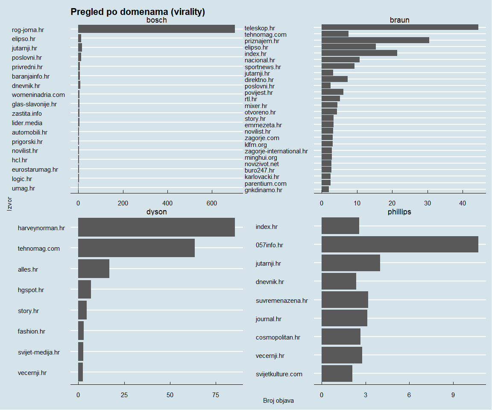

<div class="mycontent">


<br>
<br>
<br>
<br>


# **Što je unutra?**

***


- cijeli hrvatski medijski prostor za četiri konkurenta **Bosch, Braun, Phillips, Dyson** 
<br><br>
- objave uključuju sve hrvatske društvene medije: *web, facebook, youtube, twitter, instagram, forum, reddit i komentare*
<br><br>
- sve medijske objave koje sadrže naziv branda u **razdoblju od tri mjeseca** (2021/10/06 do 2022/01/06)
<br><br>
- ukupno 2677 objava, odnosno 29.0978261 objava dnevno
<br><br>
- ukupno XXX riječi u svim tekstovima

<br>

# **Sadržaj**

***

<br>

- na početku izvještaja **skupni prikaz** medijskog prostora
<br><br>
- nakon toga opisani **izabrani mediji**
<br><br>
- potom analiziran sadržaj objava za **izabrane brandove**
<br><br>
- na kraju **najvažniji zaključci**

<br>

# **Skupni prikaz**

***


<br>


- najveću medijsku prisutnost ima Bosch, nakon toga slijede Braun i Phillips, a na kraju Dyson
<br><br>
- tržišni lideri dominiraju na svakom pojedinačnom mediju i konzistentno kroz cijelo promatrano razdoblje


<br>

### **Brandovi**

***

<br>


<div class = "row">

<div class = "col-sm-4">
<br><br>Bosch i Braun zajedno imaju više od 60% svih objava i znatno su zastupljeniji u medijskom prostoru od  Phillipsa i Dysona na koje odlazi manje od 15% svih objava. Pri tome je oko 25% svih objava nesvrstano jer je tekst objave anonimiziran.

</div>

  
<div class = "col-sm-2">
<table class=" lightable-paper" style='font-family: "Arial Narrow", arial, helvetica, sans-serif; width: auto !important; float: right; margin-left: 10px;border-bottom: 0;'>
 <thead>
  <tr>
   <th style="text-align:left;"> Brand </th>
   <th style="text-align:right;"> Broj objava </th>
   <th style="text-align:right;"> Udio % </th>
  </tr>
 </thead>
<tbody>
  <tr>
   <td style="text-align:left;"> NA </td>
   <td style="text-align:right;"> 2447 </td>
   <td style="text-align:right;"> 91.41 </td>
  </tr>
  <tr>
   <td style="text-align:left;"> bosch </td>
   <td style="text-align:right;"> 151 </td>
   <td style="text-align:right;"> 5.64 </td>
  </tr>
  <tr>
   <td style="text-align:left;"> braun </td>
   <td style="text-align:right;"> 36 </td>
   <td style="text-align:right;"> 1.34 </td>
  </tr>
  <tr>
   <td style="text-align:left;"> dyson </td>
   <td style="text-align:right;"> 34 </td>
   <td style="text-align:right;"> 1.27 </td>
  </tr>
  <tr>
   <td style="text-align:left;"> phillips </td>
   <td style="text-align:right;"> 9 </td>
   <td style="text-align:right;"> 0.34 </td>
  </tr>
</tbody>
<tfoot>
<tr><td style="padding: 0; " colspan="100%"><span style="font-style: italic;">Note: </span></td></tr>
<tr><td style="padding: 0; " colspan="100%">
<sup></sup> *Broj objava u naslovu:</td></tr>
</tfoot>
</table>


</div>
  
<div class = "col-sm-3">
<br><br>Zanimljivo je primijetiti da je Phillips na zadnjem mjestu po broju objava u kojima se riječ *Phillips* u naslovu objave te da je *Dyson* puno bliži *Braunu* prema ovom kriteriju.
</div>
  
<div class = "col-sm-3">

<table class=" lightable-paper" style='font-family: "Arial Narrow", arial, helvetica, sans-serif; width: auto !important; float: left; margin-right: 10px;border-bottom: 0;'>
 <thead>
  <tr>
   <th style="text-align:left;"> Brand </th>
   <th style="text-align:right;"> Broj objava </th>
   <th style="text-align:right;"> Udio % </th>
  </tr>
 </thead>
<tbody>
  <tr>
   <td style="text-align:left;"> bosch </td>
   <td style="text-align:right;"> 1160 </td>
   <td style="text-align:right;"> 43.3 </td>
  </tr>
  <tr>
   <td style="text-align:left;"> NA </td>
   <td style="text-align:right;"> 651 </td>
   <td style="text-align:right;"> 24.3 </td>
  </tr>
  <tr>
   <td style="text-align:left;"> braun </td>
   <td style="text-align:right;"> 542 </td>
   <td style="text-align:right;"> 20.2 </td>
  </tr>
  <tr>
   <td style="text-align:left;"> phillips </td>
   <td style="text-align:right;"> 215 </td>
   <td style="text-align:right;"> 8.0 </td>
  </tr>
  <tr>
   <td style="text-align:left;"> dyson </td>
   <td style="text-align:right;"> 109 </td>
   <td style="text-align:right;"> 4.1 </td>
  </tr>
</tbody>
<tfoot>
<tr><td style="padding: 0; " colspan="100%"><span style="font-style: italic;">Note: </span></td></tr>
<tr><td style="padding: 0; " colspan="100%">
<sup></sup> *Broj objava u tekstu:</td></tr>
</tfoot>
</table>

</div>
</div>


<br>
<br>

<div class="figure" style="text-align: center">

```{=html}
<div id="htmlwidget-d26d53ab7b96610da6d7" style="width:1440px;height:960px;" class="plotly html-widget"></div>
<script type="application/json" data-for="htmlwidget-d26d53ab7b96610da6d7">{"x":{"data":[{"orientation":"v","width":[0.900000000001455,0.900000000001455,0.900000000001455,0.900000000001455,0.900000000001455,0.900000000001455,0.900000000001455,0.900000000001455,0.900000000001455,0.900000000001455,0.900000000001455,0.900000000001455,0.900000000001455,0.900000000001455,0.900000000001455,0.900000000001455,0.900000000001455,0.900000000001455,0.900000000001455,0.900000000001455,0.900000000001455,0.900000000001455,0.900000000001455,0.900000000001455,0.900000000001455,0.900000000001455,0.900000000001455,0.900000000001455,0.900000000001455,0.900000000001455,0.900000000001455,0.900000000001455,0.900000000001455,0.900000000001455,0.900000000001455,0.900000000001455,0.900000000001455,0.900000000001455,0.900000000001455,0.900000000001455,0.900000000001455,0.900000000001455,0.900000000001455,0.900000000001455,0.900000000001455,0.900000000001455,0.900000000001455,0.900000000001455,0.900000000001455,0.900000000001455,0.900000000001455,0.900000000001455,0.900000000001455,0.900000000001455,0.900000000001455,0.900000000001455,0.900000000001455,0.900000000001455,0.900000000001455,0.900000000001455,0.900000000001455,0.900000000001455,0.900000000001455,0.900000000001455,0.900000000001455,0.900000000001455,0.900000000001455,0.900000000001455,0.900000000001455,0.900000000001455,0.900000000001455,0.900000000001455,0.900000000001455,0.900000000001455,0.900000000001455,0.900000000001455,0.900000000001455,0.900000000001455,0.900000000001455,0.900000000001455,0.900000000001455,0.900000000001455,0.900000000001455,0.900000000001455,0.900000000001455,0.900000000001455,0.900000000001455,0.900000000001455,0.900000000001455,0.900000000001455,0.900000000001455,0.900000000001455],"base":[0,0,0,0,0,0,0,0,0,0,0,0,0,0,0,0,0,0,0,0,0,0,0,0,0,0,0,0,0,0,0,0,0,0,0,0,0,0,0,0,0,0,0,0,0,0,0,0,0,0,0,0,0,0,0,0,0,0,0,0,0,0,0,0,0,0,0,0,0,0,0,0,0,0,0,0,0,0,0,0,0,0,0,0,0,0,0,0,0,0,0,0],"x":[18906,18907,18908,18909,18910,18911,18912,18913,18914,18915,18916,18917,18918,18919,18920,18921,18922,18923,18924,18925,18926,18927,18928,18929,18930,18931,18932,18933,18934,18935,18936,18937,18938,18939,18940,18941,18942,18943,18944,18945,18946,18947,18948,18949,18950,18951,18952,18953,18954,18955,18956,18957,18958,18959,18960,18961,18962,18963,18964,18965,18966,18967,18968,18969,18970,18971,18972,18973,18974,18975,18976,18977,18978,18979,18980,18981,18982,18983,18984,18985,18986,18987,18988,18989,18990,18991,18992,18993,18994,18995,18996,18997],"y":[0.6,0.166666666666667,0.647058823529412,0.4375,0.476190476190476,0.5,0.333333333333333,0.6,0.45,0.296296296296296,0.5,0.478260869565217,0.75,0.857142857142857,0.454545454545455,0.730769230769231,0.703703703703704,0.666666666666667,0.361111111111111,0.71875,0.882352941176471,0.727272727272727,0.387096774193548,0.5,0.555555555555556,0.0714285714285714,0.793103448275862,0.588235294117647,0.961538461538462,0.161290322580645,0.625,0.571428571428571,0.857142857142857,0.538461538461538,0.72,0.71875,0.692307692307692,0.117647058823529,0.636363636363636,0.529411764705882,0.267857142857143,0.727272727272727,0.760869565217391,0.4,0.696969696969697,0.5,0.5625,0.435897435897436,0.410714285714286,0.785714285714286,0.766666666666667,0.869565217391304,0.2,0.764705882352941,0.857142857142857,0.533333333333333,0.59375,0.347826086956522,0.722222222222222,0.315789473684211,0.733333333333333,0.692307692307692,0.607142857142857,0.653846153846154,0.161290322580645,0.789473684210526,0.545454545454545,0.722222222222222,0.853658536585366,0.857142857142857,0.8,0.5,0.464285714285714,0.571428571428571,0.6,0.888888888888889,0.807692307692308,0.6,0.666666666666667,0.916666666666667,0.545454545454545,0.571428571428571,0.807692307692308,0.625,0.814814814814815,0.733333333333333,0.8,0.5,0.8,0.714285714285714,0.714285714285714,0.533333333333333],"text":["time: 2021-10-06<br />n/gn: 0.60000000","time: 2021-10-07<br />n/gn: 0.16666667","time: 2021-10-08<br />n/gn: 0.64705882","time: 2021-10-09<br />n/gn: 0.43750000","time: 2021-10-10<br />n/gn: 0.47619048","time: 2021-10-11<br />n/gn: 0.50000000","time: 2021-10-12<br />n/gn: 0.33333333","time: 2021-10-13<br />n/gn: 0.60000000","time: 2021-10-14<br />n/gn: 0.45000000","time: 2021-10-15<br />n/gn: 0.29629630","time: 2021-10-16<br />n/gn: 0.50000000","time: 2021-10-17<br />n/gn: 0.47826087","time: 2021-10-18<br />n/gn: 0.75000000","time: 2021-10-19<br />n/gn: 0.85714286","time: 2021-10-20<br />n/gn: 0.45454545","time: 2021-10-21<br />n/gn: 0.73076923","time: 2021-10-22<br />n/gn: 0.70370370","time: 2021-10-23<br />n/gn: 0.66666667","time: 2021-10-24<br />n/gn: 0.36111111","time: 2021-10-25<br />n/gn: 0.71875000","time: 2021-10-26<br />n/gn: 0.88235294","time: 2021-10-27<br />n/gn: 0.72727273","time: 2021-10-28<br />n/gn: 0.38709677","time: 2021-10-29<br />n/gn: 0.50000000","time: 2021-10-30<br />n/gn: 0.55555556","time: 2021-10-31<br />n/gn: 0.07142857","time: 2021-11-01<br />n/gn: 0.79310345","time: 2021-11-02<br />n/gn: 0.58823529","time: 2021-11-03<br />n/gn: 0.96153846","time: 2021-11-04<br />n/gn: 0.16129032","time: 2021-11-05<br />n/gn: 0.62500000","time: 2021-11-06<br />n/gn: 0.57142857","time: 2021-11-07<br />n/gn: 0.85714286","time: 2021-11-08<br />n/gn: 0.53846154","time: 2021-11-09<br />n/gn: 0.72000000","time: 2021-11-10<br />n/gn: 0.71875000","time: 2021-11-11<br />n/gn: 0.69230769","time: 2021-11-12<br />n/gn: 0.11764706","time: 2021-11-13<br />n/gn: 0.63636364","time: 2021-11-14<br />n/gn: 0.52941176","time: 2021-11-15<br />n/gn: 0.26785714","time: 2021-11-16<br />n/gn: 0.72727273","time: 2021-11-17<br />n/gn: 0.76086957","time: 2021-11-18<br />n/gn: 0.40000000","time: 2021-11-19<br />n/gn: 0.69696970","time: 2021-11-20<br />n/gn: 0.50000000","time: 2021-11-21<br />n/gn: 0.56250000","time: 2021-11-22<br />n/gn: 0.43589744","time: 2021-11-23<br />n/gn: 0.41071429","time: 2021-11-24<br />n/gn: 0.78571429","time: 2021-11-25<br />n/gn: 0.76666667","time: 2021-11-26<br />n/gn: 0.86956522","time: 2021-11-27<br />n/gn: 0.20000000","time: 2021-11-28<br />n/gn: 0.76470588","time: 2021-11-29<br />n/gn: 0.85714286","time: 2021-11-30<br />n/gn: 0.53333333","time: 2021-12-01<br />n/gn: 0.59375000","time: 2021-12-02<br />n/gn: 0.34782609","time: 2021-12-03<br />n/gn: 0.72222222","time: 2021-12-04<br />n/gn: 0.31578947","time: 2021-12-05<br />n/gn: 0.73333333","time: 2021-12-06<br />n/gn: 0.69230769","time: 2021-12-07<br />n/gn: 0.60714286","time: 2021-12-08<br />n/gn: 0.65384615","time: 2021-12-09<br />n/gn: 0.16129032","time: 2021-12-10<br />n/gn: 0.78947368","time: 2021-12-11<br />n/gn: 0.54545455","time: 2021-12-12<br />n/gn: 0.72222222","time: 2021-12-13<br />n/gn: 0.85365854","time: 2021-12-14<br />n/gn: 0.85714286","time: 2021-12-15<br />n/gn: 0.80000000","time: 2021-12-16<br />n/gn: 0.50000000","time: 2021-12-17<br />n/gn: 0.46428571","time: 2021-12-18<br />n/gn: 0.57142857","time: 2021-12-19<br />n/gn: 0.60000000","time: 2021-12-20<br />n/gn: 0.88888889","time: 2021-12-21<br />n/gn: 0.80769231","time: 2021-12-22<br />n/gn: 0.60000000","time: 2021-12-23<br />n/gn: 0.66666667","time: 2021-12-24<br />n/gn: 0.91666667","time: 2021-12-25<br />n/gn: 0.54545455","time: 2021-12-26<br />n/gn: 0.57142857","time: 2021-12-27<br />n/gn: 0.80769231","time: 2021-12-28<br />n/gn: 0.62500000","time: 2021-12-29<br />n/gn: 0.81481481","time: 2021-12-30<br />n/gn: 0.73333333","time: 2021-12-31<br />n/gn: 0.80000000","time: 2022-01-01<br />n/gn: 0.50000000","time: 2022-01-02<br />n/gn: 0.80000000","time: 2022-01-03<br />n/gn: 0.71428571","time: 2022-01-04<br />n/gn: 0.71428571","time: 2022-01-05<br />n/gn: 0.53333333"],"type":"bar","marker":{"autocolorscale":false,"color":"rgba(89,89,89,1)","line":{"width":1.88976377952756,"color":"transparent"}},"showlegend":false,"xaxis":"x","yaxis":"y","hoverinfo":"text","frame":null},{"orientation":"v","width":[0.900000000001455,0.900000000001455,0.900000000001455,0.900000000001455,0.900000000001455,0.900000000001455,0.900000000001455,0.900000000001455,0.900000000001455,0.900000000001455,0.900000000001455,0.900000000001455,0.900000000001455,0.900000000001455,0.900000000001455,0.900000000001455,0.900000000001455,0.900000000001455,0.900000000001455,0.900000000001455,0.900000000001455,0.900000000001455,0.900000000001455,0.900000000001455,0.900000000001455,0.900000000001455,0.900000000001455,0.900000000001455,0.900000000001455,0.900000000001455,0.900000000001455,0.900000000001455,0.900000000001455,0.900000000001455,0.900000000001455,0.900000000001455,0.900000000001455,0.900000000001455,0.900000000001455,0.900000000001455,0.900000000001455,0.900000000001455,0.900000000001455,0.900000000001455,0.900000000001455,0.900000000001455,0.900000000001455,0.900000000001455,0.900000000001455,0.900000000001455,0.900000000001455,0.900000000001455,0.900000000001455,0.900000000001455,0.900000000001455,0.900000000001455,0.900000000001455,0.900000000001455,0.900000000001455,0.900000000001455,0.900000000001455,0.900000000001455,0.900000000001455,0.900000000001455,0.900000000001455,0.900000000001455,0.900000000001455,0.900000000001455,0.900000000001455,0.900000000001455,0.900000000001455,0.900000000001455,0.900000000001455,0.900000000001455,0.900000000001455,0.900000000001455,0.900000000001455,0.900000000001455,0.900000000001455,0.900000000001455,0.900000000001455,0.900000000001455,0.900000000001455,0.900000000001455,0.900000000001455],"base":[0,0,0,0,0,0,0,0,0,0,0,0,0,0,0,0,0,0,0,0,0,0,0,0,0,0,0,0,0,0,0,0,0,0,0,0,0,0,0,0,0,0,0,0,0,0,0,0,0,0,0,0,0,0,0,0,0,0,0,0,0,0,0,0,0,0,0,0,0,0,0,0,0,0,0,0,0,0,0,0,0,0,0,0,0],"x":[18906,18907,18908,18909,18910,18911,18912,18913,18914,18915,18916,18917,18918,18919,18920,18921,18922,18923,18924,18925,18927,18928,18929,18930,18931,18932,18933,18935,18936,18937,18938,18939,18940,18941,18942,18943,18944,18945,18946,18948,18949,18950,18951,18952,18953,18954,18955,18956,18957,18958,18959,18960,18961,18962,18963,18964,18965,18966,18968,18969,18970,18971,18972,18973,18974,18975,18977,18978,18979,18980,18982,18983,18984,18985,18986,18987,18988,18989,18990,18991,18992,18993,18994,18996,18997],"y":[0.1,0.5,0.176470588235294,0.4375,0.238095238095238,0.3,0.5,0.3,0.25,0.592592592592593,0.346153846153846,0.304347826086957,0.0625,0.0952380952380952,0.363636363636364,0.115384615384615,0.185185185185185,0.148148148148148,0.555555555555556,0.03125,0.181818181818182,0.225806451612903,0.346153846153846,0.277777777777778,0.214285714285714,0.172413793103448,0.235294117647059,0.596774193548387,0.3125,0.214285714285714,0.142857142857143,0.230769230769231,0.28,0.09375,0.0384615384615385,0.852941176470588,0.0909090909090909,0.117647058823529,0.642857142857143,0.173913043478261,0.2,0.0909090909090909,0.5,0.25,0.487179487179487,0.339285714285714,0.0357142857142857,0.0333333333333333,0.0869565217391304,0.755555555555556,0.0588235294117647,0.142857142857143,0.3,0.125,0.521739130434783,0.277777777777778,0.105263157894737,0.133333333333333,0.321428571428571,0.153846153846154,0.67741935483871,0.105263157894737,0.0909090909090909,0.277777777777778,0.0975609756097561,0.114285714285714,0.5,0.428571428571429,0.214285714285714,0.0666666666666667,0.115384615384615,0.2,0.0833333333333333,0.0833333333333333,0.181818181818182,0.285714285714286,0.115384615384615,0.125,0.037037037037037,0.133333333333333,0.2,0.5,0.2,0.142857142857143,0.333333333333333],"text":["time: 2021-10-06<br />n/gn: 0.10000000","time: 2021-10-07<br />n/gn: 0.50000000","time: 2021-10-08<br />n/gn: 0.17647059","time: 2021-10-09<br />n/gn: 0.43750000","time: 2021-10-10<br />n/gn: 0.23809524","time: 2021-10-11<br />n/gn: 0.30000000","time: 2021-10-12<br />n/gn: 0.50000000","time: 2021-10-13<br />n/gn: 0.30000000","time: 2021-10-14<br />n/gn: 0.25000000","time: 2021-10-15<br />n/gn: 0.59259259","time: 2021-10-16<br />n/gn: 0.34615385","time: 2021-10-17<br />n/gn: 0.30434783","time: 2021-10-18<br />n/gn: 0.06250000","time: 2021-10-19<br />n/gn: 0.09523810","time: 2021-10-20<br />n/gn: 0.36363636","time: 2021-10-21<br />n/gn: 0.11538462","time: 2021-10-22<br />n/gn: 0.18518519","time: 2021-10-23<br />n/gn: 0.14814815","time: 2021-10-24<br />n/gn: 0.55555556","time: 2021-10-25<br />n/gn: 0.03125000","time: 2021-10-27<br />n/gn: 0.18181818","time: 2021-10-28<br />n/gn: 0.22580645","time: 2021-10-29<br />n/gn: 0.34615385","time: 2021-10-30<br />n/gn: 0.27777778","time: 2021-10-31<br />n/gn: 0.21428571","time: 2021-11-01<br />n/gn: 0.17241379","time: 2021-11-02<br />n/gn: 0.23529412","time: 2021-11-04<br />n/gn: 0.59677419","time: 2021-11-05<br />n/gn: 0.31250000","time: 2021-11-06<br />n/gn: 0.21428571","time: 2021-11-07<br />n/gn: 0.14285714","time: 2021-11-08<br />n/gn: 0.23076923","time: 2021-11-09<br />n/gn: 0.28000000","time: 2021-11-10<br />n/gn: 0.09375000","time: 2021-11-11<br />n/gn: 0.03846154","time: 2021-11-12<br />n/gn: 0.85294118","time: 2021-11-13<br />n/gn: 0.09090909","time: 2021-11-14<br />n/gn: 0.11764706","time: 2021-11-15<br />n/gn: 0.64285714","time: 2021-11-17<br />n/gn: 0.17391304","time: 2021-11-18<br />n/gn: 0.20000000","time: 2021-11-19<br />n/gn: 0.09090909","time: 2021-11-20<br />n/gn: 0.50000000","time: 2021-11-21<br />n/gn: 0.25000000","time: 2021-11-22<br />n/gn: 0.48717949","time: 2021-11-23<br />n/gn: 0.33928571","time: 2021-11-24<br />n/gn: 0.03571429","time: 2021-11-25<br />n/gn: 0.03333333","time: 2021-11-26<br />n/gn: 0.08695652","time: 2021-11-27<br />n/gn: 0.75555556","time: 2021-11-28<br />n/gn: 0.05882353","time: 2021-11-29<br />n/gn: 0.14285714","time: 2021-11-30<br />n/gn: 0.30000000","time: 2021-12-01<br />n/gn: 0.12500000","time: 2021-12-02<br />n/gn: 0.52173913","time: 2021-12-03<br />n/gn: 0.27777778","time: 2021-12-04<br />n/gn: 0.10526316","time: 2021-12-05<br />n/gn: 0.13333333","time: 2021-12-07<br />n/gn: 0.32142857","time: 2021-12-08<br />n/gn: 0.15384615","time: 2021-12-09<br />n/gn: 0.67741935","time: 2021-12-10<br />n/gn: 0.10526316","time: 2021-12-11<br />n/gn: 0.09090909","time: 2021-12-12<br />n/gn: 0.27777778","time: 2021-12-13<br />n/gn: 0.09756098","time: 2021-12-14<br />n/gn: 0.11428571","time: 2021-12-16<br />n/gn: 0.50000000","time: 2021-12-17<br />n/gn: 0.42857143","time: 2021-12-18<br />n/gn: 0.21428571","time: 2021-12-19<br />n/gn: 0.06666667","time: 2021-12-21<br />n/gn: 0.11538462","time: 2021-12-22<br />n/gn: 0.20000000","time: 2021-12-23<br />n/gn: 0.08333333","time: 2021-12-24<br />n/gn: 0.08333333","time: 2021-12-25<br />n/gn: 0.18181818","time: 2021-12-26<br />n/gn: 0.28571429","time: 2021-12-27<br />n/gn: 0.11538462","time: 2021-12-28<br />n/gn: 0.12500000","time: 2021-12-29<br />n/gn: 0.03703704","time: 2021-12-30<br />n/gn: 0.13333333","time: 2021-12-31<br />n/gn: 0.20000000","time: 2022-01-01<br />n/gn: 0.50000000","time: 2022-01-02<br />n/gn: 0.20000000","time: 2022-01-04<br />n/gn: 0.14285714","time: 2022-01-05<br />n/gn: 0.33333333"],"type":"bar","marker":{"autocolorscale":false,"color":"rgba(89,89,89,1)","line":{"width":1.88976377952756,"color":"transparent"}},"showlegend":false,"xaxis":"x2","yaxis":"y","hoverinfo":"text","frame":null},{"orientation":"v","width":[0.900000000001455,0.900000000001455,0.900000000001455,0.900000000001455,0.900000000001455,0.900000000001455,0.900000000001455,0.900000000001455,0.900000000001455,0.900000000001455,0.900000000001455,0.900000000001455,0.900000000001455,0.900000000001455,0.900000000001455,0.900000000001455,0.900000000001455,0.900000000001455,0.900000000001455,0.900000000001455,0.900000000001455,0.900000000001455,0.900000000001455,0.900000000001455,0.900000000001455,0.900000000001455,0.900000000001455,0.900000000001455,0.900000000001455,0.900000000001455,0.900000000001455,0.900000000001455,0.900000000001455,0.900000000001455,0.900000000001455,0.900000000001455,0.900000000001455,0.900000000001455,0.900000000001455,0.900000000001455,0.900000000001455,0.900000000001455,0.900000000001455,0.900000000001455,0.900000000001455,0.900000000001455,0.900000000001455,0.900000000001455,0.900000000001455,0.900000000001455,0.900000000001455,0.900000000001455,0.900000000001455],"base":[0,0,0,0,0,0,0,0,0,0,0,0,0,0,0,0,0,0,0,0,0,0,0,0,0,0,0,0,0,0,0,0,0,0,0,0,0,0,0,0,0,0,0,0,0,0,0,0,0,0,0,0,0],"x":[18908,18910,18912,18923,18924,18925,18926,18927,18928,18929,18930,18931,18932,18933,18935,18937,18939,18941,18942,18944,18945,18947,18948,18949,18950,18954,18955,18956,18957,18958,18959,18961,18962,18963,18965,18966,18967,18969,18970,18971,18972,18976,18978,18979,18980,18981,18984,18986,18987,18990,18995,18996,18997],"y":[0.117647058823529,0.0952380952380952,0.0833333333333333,0.111111111111111,0.0277777777777778,0.15625,0.0588235294117647,0.0454545454545455,0.258064516129032,0.0384615384615385,0.0555555555555556,0.142857142857143,0.0344827586206897,0.117647058823529,0.0645161290322581,0.0714285714285714,0.153846153846154,0.03125,0.0769230769230769,0.181818181818182,0.0588235294117647,0.0909090909090909,0.0434782608695652,0.3,0.0303030303030303,0.214285714285714,0.0714285714285714,0.133333333333333,0.0434782608695652,0.0222222222222222,0.0588235294117647,0.0666666666666667,0.03125,0.0434782608695652,0.105263157894737,0.0666666666666667,0.153846153846154,0.0769230769230769,0.112903225806452,0.0526315789473684,0.0909090909090909,0.133333333333333,0.107142857142857,0.0714285714285714,0.0666666666666667,0.0555555555555556,0.0833333333333333,0.0909090909090909,0.0714285714285714,0.0740740740740741,0.142857142857143,0.0714285714285714,0.133333333333333],"text":["time: 2021-10-08<br />n/gn: 0.11764706","time: 2021-10-10<br />n/gn: 0.09523810","time: 2021-10-12<br />n/gn: 0.08333333","time: 2021-10-23<br />n/gn: 0.11111111","time: 2021-10-24<br />n/gn: 0.02777778","time: 2021-10-25<br />n/gn: 0.15625000","time: 2021-10-26<br />n/gn: 0.05882353","time: 2021-10-27<br />n/gn: 0.04545455","time: 2021-10-28<br />n/gn: 0.25806452","time: 2021-10-29<br />n/gn: 0.03846154","time: 2021-10-30<br />n/gn: 0.05555556","time: 2021-10-31<br />n/gn: 0.14285714","time: 2021-11-01<br />n/gn: 0.03448276","time: 2021-11-02<br />n/gn: 0.11764706","time: 2021-11-04<br />n/gn: 0.06451613","time: 2021-11-06<br />n/gn: 0.07142857","time: 2021-11-08<br />n/gn: 0.15384615","time: 2021-11-10<br />n/gn: 0.03125000","time: 2021-11-11<br />n/gn: 0.07692308","time: 2021-11-13<br />n/gn: 0.18181818","time: 2021-11-14<br />n/gn: 0.05882353","time: 2021-11-16<br />n/gn: 0.09090909","time: 2021-11-17<br />n/gn: 0.04347826","time: 2021-11-18<br />n/gn: 0.30000000","time: 2021-11-19<br />n/gn: 0.03030303","time: 2021-11-23<br />n/gn: 0.21428571","time: 2021-11-24<br />n/gn: 0.07142857","time: 2021-11-25<br />n/gn: 0.13333333","time: 2021-11-26<br />n/gn: 0.04347826","time: 2021-11-27<br />n/gn: 0.02222222","time: 2021-11-28<br />n/gn: 0.05882353","time: 2021-11-30<br />n/gn: 0.06666667","time: 2021-12-01<br />n/gn: 0.03125000","time: 2021-12-02<br />n/gn: 0.04347826","time: 2021-12-04<br />n/gn: 0.10526316","time: 2021-12-05<br />n/gn: 0.06666667","time: 2021-12-06<br />n/gn: 0.15384615","time: 2021-12-08<br />n/gn: 0.07692308","time: 2021-12-09<br />n/gn: 0.11290323","time: 2021-12-10<br />n/gn: 0.05263158","time: 2021-12-11<br />n/gn: 0.09090909","time: 2021-12-15<br />n/gn: 0.13333333","time: 2021-12-17<br />n/gn: 0.10714286","time: 2021-12-18<br />n/gn: 0.07142857","time: 2021-12-19<br />n/gn: 0.06666667","time: 2021-12-20<br />n/gn: 0.05555556","time: 2021-12-23<br />n/gn: 0.08333333","time: 2021-12-25<br />n/gn: 0.09090909","time: 2021-12-26<br />n/gn: 0.07142857","time: 2021-12-29<br />n/gn: 0.07407407","time: 2022-01-03<br />n/gn: 0.14285714","time: 2022-01-04<br />n/gn: 0.07142857","time: 2022-01-05<br />n/gn: 0.13333333"],"type":"bar","marker":{"autocolorscale":false,"color":"rgba(89,89,89,1)","line":{"width":1.88976377952756,"color":"transparent"}},"showlegend":false,"xaxis":"x","yaxis":"y2","hoverinfo":"text","frame":null},{"orientation":"v","width":[0.900000000001455,0.900000000001455,0.900000000001455,0.900000000001455,0.900000000001455,0.900000000001455,0.900000000001455,0.900000000001455,0.900000000001455,0.900000000001455,0.900000000001455,0.900000000001455,0.900000000001455,0.900000000001455,0.900000000001455,0.900000000001455,0.900000000001455,0.900000000001455,0.900000000001455,0.900000000001455,0.900000000001455,0.900000000001455,0.900000000001455,0.900000000001455,0.900000000001455,0.900000000001455,0.900000000001455,0.900000000001455,0.900000000001455,0.900000000001455,0.900000000001455,0.900000000001455,0.900000000001455,0.900000000001455,0.900000000001455,0.900000000001455,0.900000000001455,0.900000000001455,0.900000000001455,0.900000000001455,0.900000000001455,0.900000000001455,0.900000000001455,0.900000000001455,0.900000000001455,0.900000000001455,0.900000000001455,0.900000000001455,0.900000000001455,0.900000000001455,0.900000000001455,0.900000000001455,0.900000000001455,0.900000000001455,0.900000000001455,0.900000000001455,0.900000000001455,0.900000000001455,0.900000000001455,0.900000000001455,0.900000000001455,0.900000000001455,0.900000000001455,0.900000000001455,0.900000000001455,0.900000000001455,0.900000000001455,0.900000000001455,0.900000000001455,0.900000000001455,0.900000000001455,0.900000000001455,0.900000000001455,0.900000000001455,0.900000000001455,0.900000000001455,0.900000000001455],"base":[0,0,0,0,0,0,0,0,0,0,0,0,0,0,0,0,0,0,0,0,0,0,0,0,0,0,0,0,0,0,0,0,0,0,0,0,0,0,0,0,0,0,0,0,0,0,0,0,0,0,0,0,0,0,0,0,0,0,0,0,0,0,0,0,0,0,0,0,0,0,0,0,0,0,0,0,0],"x":[18906,18907,18908,18909,18910,18911,18912,18913,18914,18915,18916,18917,18918,18919,18920,18921,18922,18923,18924,18925,18926,18927,18928,18929,18930,18931,18933,18934,18935,18936,18937,18939,18941,18942,18943,18944,18945,18946,18947,18948,18949,18950,18952,18953,18954,18955,18956,18958,18959,18961,18962,18963,18965,18966,18967,18968,18969,18970,18971,18972,18974,18975,18976,18979,18980,18981,18982,18983,18984,18986,18987,18988,18989,18990,18991,18995,18996],"y":[0.3,0.333333333333333,0.0588235294117647,0.125,0.19047619047619,0.2,0.0833333333333333,0.1,0.3,0.111111111111111,0.153846153846154,0.217391304347826,0.1875,0.0476190476190476,0.181818181818182,0.153846153846154,0.111111111111111,0.0740740740740741,0.0555555555555556,0.09375,0.0588235294117647,0.0454545454545455,0.129032258064516,0.115384615384615,0.111111111111111,0.571428571428571,0.0588235294117647,0.0384615384615385,0.17741935483871,0.0625,0.142857142857143,0.0769230769230769,0.15625,0.192307692307692,0.0294117647058824,0.0909090909090909,0.294117647058824,0.0892857142857143,0.181818181818182,0.0217391304347826,0.1,0.181818181818182,0.1875,0.0769230769230769,0.0357142857142857,0.107142857142857,0.0666666666666667,0.0222222222222222,0.117647058823529,0.1,0.25,0.0869565217391304,0.473684210526316,0.0666666666666667,0.153846153846154,0.0714285714285714,0.115384615384615,0.0483870967741935,0.0526315789473684,0.272727272727273,0.0487804878048781,0.0285714285714286,0.0666666666666667,0.142857142857143,0.266666666666667,0.0555555555555556,0.0769230769230769,0.2,0.166666666666667,0.181818181818182,0.0714285714285714,0.0769230769230769,0.25,0.0740740740740741,0.133333333333333,0.142857142857143,0.0714285714285714],"text":["time: 2021-10-06<br />n/gn: 0.30000000","time: 2021-10-07<br />n/gn: 0.33333333","time: 2021-10-08<br />n/gn: 0.05882353","time: 2021-10-09<br />n/gn: 0.12500000","time: 2021-10-10<br />n/gn: 0.19047619","time: 2021-10-11<br />n/gn: 0.20000000","time: 2021-10-12<br />n/gn: 0.08333333","time: 2021-10-13<br />n/gn: 0.10000000","time: 2021-10-14<br />n/gn: 0.30000000","time: 2021-10-15<br />n/gn: 0.11111111","time: 2021-10-16<br />n/gn: 0.15384615","time: 2021-10-17<br />n/gn: 0.21739130","time: 2021-10-18<br />n/gn: 0.18750000","time: 2021-10-19<br />n/gn: 0.04761905","time: 2021-10-20<br />n/gn: 0.18181818","time: 2021-10-21<br />n/gn: 0.15384615","time: 2021-10-22<br />n/gn: 0.11111111","time: 2021-10-23<br />n/gn: 0.07407407","time: 2021-10-24<br />n/gn: 0.05555556","time: 2021-10-25<br />n/gn: 0.09375000","time: 2021-10-26<br />n/gn: 0.05882353","time: 2021-10-27<br />n/gn: 0.04545455","time: 2021-10-28<br />n/gn: 0.12903226","time: 2021-10-29<br />n/gn: 0.11538462","time: 2021-10-30<br />n/gn: 0.11111111","time: 2021-10-31<br />n/gn: 0.57142857","time: 2021-11-02<br />n/gn: 0.05882353","time: 2021-11-03<br />n/gn: 0.03846154","time: 2021-11-04<br />n/gn: 0.17741935","time: 2021-11-05<br />n/gn: 0.06250000","time: 2021-11-06<br />n/gn: 0.14285714","time: 2021-11-08<br />n/gn: 0.07692308","time: 2021-11-10<br />n/gn: 0.15625000","time: 2021-11-11<br />n/gn: 0.19230769","time: 2021-11-12<br />n/gn: 0.02941176","time: 2021-11-13<br />n/gn: 0.09090909","time: 2021-11-14<br />n/gn: 0.29411765","time: 2021-11-15<br />n/gn: 0.08928571","time: 2021-11-16<br />n/gn: 0.18181818","time: 2021-11-17<br />n/gn: 0.02173913","time: 2021-11-18<br />n/gn: 0.10000000","time: 2021-11-19<br />n/gn: 0.18181818","time: 2021-11-21<br />n/gn: 0.18750000","time: 2021-11-22<br />n/gn: 0.07692308","time: 2021-11-23<br />n/gn: 0.03571429","time: 2021-11-24<br />n/gn: 0.10714286","time: 2021-11-25<br />n/gn: 0.06666667","time: 2021-11-27<br />n/gn: 0.02222222","time: 2021-11-28<br />n/gn: 0.11764706","time: 2021-11-30<br />n/gn: 0.10000000","time: 2021-12-01<br />n/gn: 0.25000000","time: 2021-12-02<br />n/gn: 0.08695652","time: 2021-12-04<br />n/gn: 0.47368421","time: 2021-12-05<br />n/gn: 0.06666667","time: 2021-12-06<br />n/gn: 0.15384615","time: 2021-12-07<br />n/gn: 0.07142857","time: 2021-12-08<br />n/gn: 0.11538462","time: 2021-12-09<br />n/gn: 0.04838710","time: 2021-12-10<br />n/gn: 0.05263158","time: 2021-12-11<br />n/gn: 0.27272727","time: 2021-12-13<br />n/gn: 0.04878049","time: 2021-12-14<br />n/gn: 0.02857143","time: 2021-12-15<br />n/gn: 0.06666667","time: 2021-12-18<br />n/gn: 0.14285714","time: 2021-12-19<br />n/gn: 0.26666667","time: 2021-12-20<br />n/gn: 0.05555556","time: 2021-12-21<br />n/gn: 0.07692308","time: 2021-12-22<br />n/gn: 0.20000000","time: 2021-12-23<br />n/gn: 0.16666667","time: 2021-12-25<br />n/gn: 0.18181818","time: 2021-12-26<br />n/gn: 0.07142857","time: 2021-12-27<br />n/gn: 0.07692308","time: 2021-12-28<br />n/gn: 0.25000000","time: 2021-12-29<br />n/gn: 0.07407407","time: 2021-12-30<br />n/gn: 0.13333333","time: 2022-01-03<br />n/gn: 0.14285714","time: 2022-01-04<br />n/gn: 0.07142857"],"type":"bar","marker":{"autocolorscale":false,"color":"rgba(89,89,89,1)","line":{"width":1.88976377952756,"color":"transparent"}},"showlegend":false,"xaxis":"x2","yaxis":"y2","hoverinfo":"text","frame":null},{"x":[18906,18907,18908,18909,18910,18911,18912,18913,18914,18915,18916,18917,18918,18919,18920,18921,18922,18923,18924,18925,18926,18927,18928,18929,18930,18931,18932,18933,18934,18935,18936,18937,18938,18939,18940,18941,18942,18943,18944,18945,18946,18947,18948,18949,18950,18951,18952,18953,18954,18955,18956,18957,18958,18959,18960,18961,18962,18963,18964,18965,18966,18967,18968,18969,18970,18971,18972,18973,18974,18975,18976,18977,18978,18979,18980,18981,18982,18983,18984,18985,18986,18987,18988,18989,18990,18991,18992,18993,18994,18995,18996,18997],"y":[0.6,0.166666666666667,0.647058823529412,0.4375,0.476190476190476,0.5,0.333333333333333,0.6,0.45,0.296296296296296,0.5,0.478260869565217,0.75,0.857142857142857,0.454545454545455,0.730769230769231,0.703703703703704,0.666666666666667,0.361111111111111,0.71875,0.882352941176471,0.727272727272727,0.387096774193548,0.5,0.555555555555556,0.0714285714285714,0.793103448275862,0.588235294117647,0.961538461538462,0.161290322580645,0.625,0.571428571428571,0.857142857142857,0.538461538461538,0.72,0.71875,0.692307692307692,0.117647058823529,0.636363636363636,0.529411764705882,0.267857142857143,0.727272727272727,0.760869565217391,0.4,0.696969696969697,0.5,0.5625,0.435897435897436,0.410714285714286,0.785714285714286,0.766666666666667,0.869565217391304,0.2,0.764705882352941,0.857142857142857,0.533333333333333,0.59375,0.347826086956522,0.722222222222222,0.315789473684211,0.733333333333333,0.692307692307692,0.607142857142857,0.653846153846154,0.161290322580645,0.789473684210526,0.545454545454545,0.722222222222222,0.853658536585366,0.857142857142857,0.8,0.5,0.464285714285714,0.571428571428571,0.6,0.888888888888889,0.807692307692308,0.6,0.666666666666667,0.916666666666667,0.545454545454545,0.571428571428571,0.807692307692308,0.625,0.814814814814815,0.733333333333333,0.8,0.5,0.8,0.714285714285714,0.714285714285714,0.533333333333333],"text":["time: 2021-10-06<br />n/gn: 0.60000000","time: 2021-10-07<br />n/gn: 0.16666667","time: 2021-10-08<br />n/gn: 0.64705882","time: 2021-10-09<br />n/gn: 0.43750000","time: 2021-10-10<br />n/gn: 0.47619048","time: 2021-10-11<br />n/gn: 0.50000000","time: 2021-10-12<br />n/gn: 0.33333333","time: 2021-10-13<br />n/gn: 0.60000000","time: 2021-10-14<br />n/gn: 0.45000000","time: 2021-10-15<br />n/gn: 0.29629630","time: 2021-10-16<br />n/gn: 0.50000000","time: 2021-10-17<br />n/gn: 0.47826087","time: 2021-10-18<br />n/gn: 0.75000000","time: 2021-10-19<br />n/gn: 0.85714286","time: 2021-10-20<br />n/gn: 0.45454545","time: 2021-10-21<br />n/gn: 0.73076923","time: 2021-10-22<br />n/gn: 0.70370370","time: 2021-10-23<br />n/gn: 0.66666667","time: 2021-10-24<br />n/gn: 0.36111111","time: 2021-10-25<br />n/gn: 0.71875000","time: 2021-10-26<br />n/gn: 0.88235294","time: 2021-10-27<br />n/gn: 0.72727273","time: 2021-10-28<br />n/gn: 0.38709677","time: 2021-10-29<br />n/gn: 0.50000000","time: 2021-10-30<br />n/gn: 0.55555556","time: 2021-10-31<br />n/gn: 0.07142857","time: 2021-11-01<br />n/gn: 0.79310345","time: 2021-11-02<br />n/gn: 0.58823529","time: 2021-11-03<br />n/gn: 0.96153846","time: 2021-11-04<br />n/gn: 0.16129032","time: 2021-11-05<br />n/gn: 0.62500000","time: 2021-11-06<br />n/gn: 0.57142857","time: 2021-11-07<br />n/gn: 0.85714286","time: 2021-11-08<br />n/gn: 0.53846154","time: 2021-11-09<br />n/gn: 0.72000000","time: 2021-11-10<br />n/gn: 0.71875000","time: 2021-11-11<br />n/gn: 0.69230769","time: 2021-11-12<br />n/gn: 0.11764706","time: 2021-11-13<br />n/gn: 0.63636364","time: 2021-11-14<br />n/gn: 0.52941176","time: 2021-11-15<br />n/gn: 0.26785714","time: 2021-11-16<br />n/gn: 0.72727273","time: 2021-11-17<br />n/gn: 0.76086957","time: 2021-11-18<br />n/gn: 0.40000000","time: 2021-11-19<br />n/gn: 0.69696970","time: 2021-11-20<br />n/gn: 0.50000000","time: 2021-11-21<br />n/gn: 0.56250000","time: 2021-11-22<br />n/gn: 0.43589744","time: 2021-11-23<br />n/gn: 0.41071429","time: 2021-11-24<br />n/gn: 0.78571429","time: 2021-11-25<br />n/gn: 0.76666667","time: 2021-11-26<br />n/gn: 0.86956522","time: 2021-11-27<br />n/gn: 0.20000000","time: 2021-11-28<br />n/gn: 0.76470588","time: 2021-11-29<br />n/gn: 0.85714286","time: 2021-11-30<br />n/gn: 0.53333333","time: 2021-12-01<br />n/gn: 0.59375000","time: 2021-12-02<br />n/gn: 0.34782609","time: 2021-12-03<br />n/gn: 0.72222222","time: 2021-12-04<br />n/gn: 0.31578947","time: 2021-12-05<br />n/gn: 0.73333333","time: 2021-12-06<br />n/gn: 0.69230769","time: 2021-12-07<br />n/gn: 0.60714286","time: 2021-12-08<br />n/gn: 0.65384615","time: 2021-12-09<br />n/gn: 0.16129032","time: 2021-12-10<br />n/gn: 0.78947368","time: 2021-12-11<br />n/gn: 0.54545455","time: 2021-12-12<br />n/gn: 0.72222222","time: 2021-12-13<br />n/gn: 0.85365854","time: 2021-12-14<br />n/gn: 0.85714286","time: 2021-12-15<br />n/gn: 0.80000000","time: 2021-12-16<br />n/gn: 0.50000000","time: 2021-12-17<br />n/gn: 0.46428571","time: 2021-12-18<br />n/gn: 0.57142857","time: 2021-12-19<br />n/gn: 0.60000000","time: 2021-12-20<br />n/gn: 0.88888889","time: 2021-12-21<br />n/gn: 0.80769231","time: 2021-12-22<br />n/gn: 0.60000000","time: 2021-12-23<br />n/gn: 0.66666667","time: 2021-12-24<br />n/gn: 0.91666667","time: 2021-12-25<br />n/gn: 0.54545455","time: 2021-12-26<br />n/gn: 0.57142857","time: 2021-12-27<br />n/gn: 0.80769231","time: 2021-12-28<br />n/gn: 0.62500000","time: 2021-12-29<br />n/gn: 0.81481481","time: 2021-12-30<br />n/gn: 0.73333333","time: 2021-12-31<br />n/gn: 0.80000000","time: 2022-01-01<br />n/gn: 0.50000000","time: 2022-01-02<br />n/gn: 0.80000000","time: 2022-01-03<br />n/gn: 0.71428571","time: 2022-01-04<br />n/gn: 0.71428571","time: 2022-01-05<br />n/gn: 0.53333333"],"type":"scatter","mode":"lines","line":{"width":1.88976377952756,"color":"rgba(0,0,0,1)","dash":"solid"},"hoveron":"points","showlegend":false,"xaxis":"x","yaxis":"y","hoverinfo":"text","frame":null},{"x":[18906,18907,18908,18909,18910,18911,18912,18913,18914,18915,18916,18917,18918,18919,18920,18921,18922,18923,18924,18925,18927,18928,18929,18930,18931,18932,18933,18935,18936,18937,18938,18939,18940,18941,18942,18943,18944,18945,18946,18948,18949,18950,18951,18952,18953,18954,18955,18956,18957,18958,18959,18960,18961,18962,18963,18964,18965,18966,18968,18969,18970,18971,18972,18973,18974,18975,18977,18978,18979,18980,18982,18983,18984,18985,18986,18987,18988,18989,18990,18991,18992,18993,18994,18996,18997],"y":[0.1,0.5,0.176470588235294,0.4375,0.238095238095238,0.3,0.5,0.3,0.25,0.592592592592593,0.346153846153846,0.304347826086957,0.0625,0.0952380952380952,0.363636363636364,0.115384615384615,0.185185185185185,0.148148148148148,0.555555555555556,0.03125,0.181818181818182,0.225806451612903,0.346153846153846,0.277777777777778,0.214285714285714,0.172413793103448,0.235294117647059,0.596774193548387,0.3125,0.214285714285714,0.142857142857143,0.230769230769231,0.28,0.09375,0.0384615384615385,0.852941176470588,0.0909090909090909,0.117647058823529,0.642857142857143,0.173913043478261,0.2,0.0909090909090909,0.5,0.25,0.487179487179487,0.339285714285714,0.0357142857142857,0.0333333333333333,0.0869565217391304,0.755555555555556,0.0588235294117647,0.142857142857143,0.3,0.125,0.521739130434783,0.277777777777778,0.105263157894737,0.133333333333333,0.321428571428571,0.153846153846154,0.67741935483871,0.105263157894737,0.0909090909090909,0.277777777777778,0.0975609756097561,0.114285714285714,0.5,0.428571428571429,0.214285714285714,0.0666666666666667,0.115384615384615,0.2,0.0833333333333333,0.0833333333333333,0.181818181818182,0.285714285714286,0.115384615384615,0.125,0.037037037037037,0.133333333333333,0.2,0.5,0.2,0.142857142857143,0.333333333333333],"text":["time: 2021-10-06<br />n/gn: 0.10000000","time: 2021-10-07<br />n/gn: 0.50000000","time: 2021-10-08<br />n/gn: 0.17647059","time: 2021-10-09<br />n/gn: 0.43750000","time: 2021-10-10<br />n/gn: 0.23809524","time: 2021-10-11<br />n/gn: 0.30000000","time: 2021-10-12<br />n/gn: 0.50000000","time: 2021-10-13<br />n/gn: 0.30000000","time: 2021-10-14<br />n/gn: 0.25000000","time: 2021-10-15<br />n/gn: 0.59259259","time: 2021-10-16<br />n/gn: 0.34615385","time: 2021-10-17<br />n/gn: 0.30434783","time: 2021-10-18<br />n/gn: 0.06250000","time: 2021-10-19<br />n/gn: 0.09523810","time: 2021-10-20<br />n/gn: 0.36363636","time: 2021-10-21<br />n/gn: 0.11538462","time: 2021-10-22<br />n/gn: 0.18518519","time: 2021-10-23<br />n/gn: 0.14814815","time: 2021-10-24<br />n/gn: 0.55555556","time: 2021-10-25<br />n/gn: 0.03125000","time: 2021-10-27<br />n/gn: 0.18181818","time: 2021-10-28<br />n/gn: 0.22580645","time: 2021-10-29<br />n/gn: 0.34615385","time: 2021-10-30<br />n/gn: 0.27777778","time: 2021-10-31<br />n/gn: 0.21428571","time: 2021-11-01<br />n/gn: 0.17241379","time: 2021-11-02<br />n/gn: 0.23529412","time: 2021-11-04<br />n/gn: 0.59677419","time: 2021-11-05<br />n/gn: 0.31250000","time: 2021-11-06<br />n/gn: 0.21428571","time: 2021-11-07<br />n/gn: 0.14285714","time: 2021-11-08<br />n/gn: 0.23076923","time: 2021-11-09<br />n/gn: 0.28000000","time: 2021-11-10<br />n/gn: 0.09375000","time: 2021-11-11<br />n/gn: 0.03846154","time: 2021-11-12<br />n/gn: 0.85294118","time: 2021-11-13<br />n/gn: 0.09090909","time: 2021-11-14<br />n/gn: 0.11764706","time: 2021-11-15<br />n/gn: 0.64285714","time: 2021-11-17<br />n/gn: 0.17391304","time: 2021-11-18<br />n/gn: 0.20000000","time: 2021-11-19<br />n/gn: 0.09090909","time: 2021-11-20<br />n/gn: 0.50000000","time: 2021-11-21<br />n/gn: 0.25000000","time: 2021-11-22<br />n/gn: 0.48717949","time: 2021-11-23<br />n/gn: 0.33928571","time: 2021-11-24<br />n/gn: 0.03571429","time: 2021-11-25<br />n/gn: 0.03333333","time: 2021-11-26<br />n/gn: 0.08695652","time: 2021-11-27<br />n/gn: 0.75555556","time: 2021-11-28<br />n/gn: 0.05882353","time: 2021-11-29<br />n/gn: 0.14285714","time: 2021-11-30<br />n/gn: 0.30000000","time: 2021-12-01<br />n/gn: 0.12500000","time: 2021-12-02<br />n/gn: 0.52173913","time: 2021-12-03<br />n/gn: 0.27777778","time: 2021-12-04<br />n/gn: 0.10526316","time: 2021-12-05<br />n/gn: 0.13333333","time: 2021-12-07<br />n/gn: 0.32142857","time: 2021-12-08<br />n/gn: 0.15384615","time: 2021-12-09<br />n/gn: 0.67741935","time: 2021-12-10<br />n/gn: 0.10526316","time: 2021-12-11<br />n/gn: 0.09090909","time: 2021-12-12<br />n/gn: 0.27777778","time: 2021-12-13<br />n/gn: 0.09756098","time: 2021-12-14<br />n/gn: 0.11428571","time: 2021-12-16<br />n/gn: 0.50000000","time: 2021-12-17<br />n/gn: 0.42857143","time: 2021-12-18<br />n/gn: 0.21428571","time: 2021-12-19<br />n/gn: 0.06666667","time: 2021-12-21<br />n/gn: 0.11538462","time: 2021-12-22<br />n/gn: 0.20000000","time: 2021-12-23<br />n/gn: 0.08333333","time: 2021-12-24<br />n/gn: 0.08333333","time: 2021-12-25<br />n/gn: 0.18181818","time: 2021-12-26<br />n/gn: 0.28571429","time: 2021-12-27<br />n/gn: 0.11538462","time: 2021-12-28<br />n/gn: 0.12500000","time: 2021-12-29<br />n/gn: 0.03703704","time: 2021-12-30<br />n/gn: 0.13333333","time: 2021-12-31<br />n/gn: 0.20000000","time: 2022-01-01<br />n/gn: 0.50000000","time: 2022-01-02<br />n/gn: 0.20000000","time: 2022-01-04<br />n/gn: 0.14285714","time: 2022-01-05<br />n/gn: 0.33333333"],"type":"scatter","mode":"lines","line":{"width":1.88976377952756,"color":"rgba(0,0,0,1)","dash":"solid"},"hoveron":"points","showlegend":false,"xaxis":"x2","yaxis":"y","hoverinfo":"text","frame":null},{"x":[18908,18910,18912,18923,18924,18925,18926,18927,18928,18929,18930,18931,18932,18933,18935,18937,18939,18941,18942,18944,18945,18947,18948,18949,18950,18954,18955,18956,18957,18958,18959,18961,18962,18963,18965,18966,18967,18969,18970,18971,18972,18976,18978,18979,18980,18981,18984,18986,18987,18990,18995,18996,18997],"y":[0.117647058823529,0.0952380952380952,0.0833333333333333,0.111111111111111,0.0277777777777778,0.15625,0.0588235294117647,0.0454545454545455,0.258064516129032,0.0384615384615385,0.0555555555555556,0.142857142857143,0.0344827586206897,0.117647058823529,0.0645161290322581,0.0714285714285714,0.153846153846154,0.03125,0.0769230769230769,0.181818181818182,0.0588235294117647,0.0909090909090909,0.0434782608695652,0.3,0.0303030303030303,0.214285714285714,0.0714285714285714,0.133333333333333,0.0434782608695652,0.0222222222222222,0.0588235294117647,0.0666666666666667,0.03125,0.0434782608695652,0.105263157894737,0.0666666666666667,0.153846153846154,0.0769230769230769,0.112903225806452,0.0526315789473684,0.0909090909090909,0.133333333333333,0.107142857142857,0.0714285714285714,0.0666666666666667,0.0555555555555556,0.0833333333333333,0.0909090909090909,0.0714285714285714,0.0740740740740741,0.142857142857143,0.0714285714285714,0.133333333333333],"text":["time: 2021-10-08<br />n/gn: 0.11764706","time: 2021-10-10<br />n/gn: 0.09523810","time: 2021-10-12<br />n/gn: 0.08333333","time: 2021-10-23<br />n/gn: 0.11111111","time: 2021-10-24<br />n/gn: 0.02777778","time: 2021-10-25<br />n/gn: 0.15625000","time: 2021-10-26<br />n/gn: 0.05882353","time: 2021-10-27<br />n/gn: 0.04545455","time: 2021-10-28<br />n/gn: 0.25806452","time: 2021-10-29<br />n/gn: 0.03846154","time: 2021-10-30<br />n/gn: 0.05555556","time: 2021-10-31<br />n/gn: 0.14285714","time: 2021-11-01<br />n/gn: 0.03448276","time: 2021-11-02<br />n/gn: 0.11764706","time: 2021-11-04<br />n/gn: 0.06451613","time: 2021-11-06<br />n/gn: 0.07142857","time: 2021-11-08<br />n/gn: 0.15384615","time: 2021-11-10<br />n/gn: 0.03125000","time: 2021-11-11<br />n/gn: 0.07692308","time: 2021-11-13<br />n/gn: 0.18181818","time: 2021-11-14<br />n/gn: 0.05882353","time: 2021-11-16<br />n/gn: 0.09090909","time: 2021-11-17<br />n/gn: 0.04347826","time: 2021-11-18<br />n/gn: 0.30000000","time: 2021-11-19<br />n/gn: 0.03030303","time: 2021-11-23<br />n/gn: 0.21428571","time: 2021-11-24<br />n/gn: 0.07142857","time: 2021-11-25<br />n/gn: 0.13333333","time: 2021-11-26<br />n/gn: 0.04347826","time: 2021-11-27<br />n/gn: 0.02222222","time: 2021-11-28<br />n/gn: 0.05882353","time: 2021-11-30<br />n/gn: 0.06666667","time: 2021-12-01<br />n/gn: 0.03125000","time: 2021-12-02<br />n/gn: 0.04347826","time: 2021-12-04<br />n/gn: 0.10526316","time: 2021-12-05<br />n/gn: 0.06666667","time: 2021-12-06<br />n/gn: 0.15384615","time: 2021-12-08<br />n/gn: 0.07692308","time: 2021-12-09<br />n/gn: 0.11290323","time: 2021-12-10<br />n/gn: 0.05263158","time: 2021-12-11<br />n/gn: 0.09090909","time: 2021-12-15<br />n/gn: 0.13333333","time: 2021-12-17<br />n/gn: 0.10714286","time: 2021-12-18<br />n/gn: 0.07142857","time: 2021-12-19<br />n/gn: 0.06666667","time: 2021-12-20<br />n/gn: 0.05555556","time: 2021-12-23<br />n/gn: 0.08333333","time: 2021-12-25<br />n/gn: 0.09090909","time: 2021-12-26<br />n/gn: 0.07142857","time: 2021-12-29<br />n/gn: 0.07407407","time: 2022-01-03<br />n/gn: 0.14285714","time: 2022-01-04<br />n/gn: 0.07142857","time: 2022-01-05<br />n/gn: 0.13333333"],"type":"scatter","mode":"lines","line":{"width":1.88976377952756,"color":"rgba(0,0,0,1)","dash":"solid"},"hoveron":"points","showlegend":false,"xaxis":"x","yaxis":"y2","hoverinfo":"text","frame":null},{"x":[18906,18907,18908,18909,18910,18911,18912,18913,18914,18915,18916,18917,18918,18919,18920,18921,18922,18923,18924,18925,18926,18927,18928,18929,18930,18931,18933,18934,18935,18936,18937,18939,18941,18942,18943,18944,18945,18946,18947,18948,18949,18950,18952,18953,18954,18955,18956,18958,18959,18961,18962,18963,18965,18966,18967,18968,18969,18970,18971,18972,18974,18975,18976,18979,18980,18981,18982,18983,18984,18986,18987,18988,18989,18990,18991,18995,18996],"y":[0.3,0.333333333333333,0.0588235294117647,0.125,0.19047619047619,0.2,0.0833333333333333,0.1,0.3,0.111111111111111,0.153846153846154,0.217391304347826,0.1875,0.0476190476190476,0.181818181818182,0.153846153846154,0.111111111111111,0.0740740740740741,0.0555555555555556,0.09375,0.0588235294117647,0.0454545454545455,0.129032258064516,0.115384615384615,0.111111111111111,0.571428571428571,0.0588235294117647,0.0384615384615385,0.17741935483871,0.0625,0.142857142857143,0.0769230769230769,0.15625,0.192307692307692,0.0294117647058824,0.0909090909090909,0.294117647058824,0.0892857142857143,0.181818181818182,0.0217391304347826,0.1,0.181818181818182,0.1875,0.0769230769230769,0.0357142857142857,0.107142857142857,0.0666666666666667,0.0222222222222222,0.117647058823529,0.1,0.25,0.0869565217391304,0.473684210526316,0.0666666666666667,0.153846153846154,0.0714285714285714,0.115384615384615,0.0483870967741935,0.0526315789473684,0.272727272727273,0.0487804878048781,0.0285714285714286,0.0666666666666667,0.142857142857143,0.266666666666667,0.0555555555555556,0.0769230769230769,0.2,0.166666666666667,0.181818181818182,0.0714285714285714,0.0769230769230769,0.25,0.0740740740740741,0.133333333333333,0.142857142857143,0.0714285714285714],"text":["time: 2021-10-06<br />n/gn: 0.30000000","time: 2021-10-07<br />n/gn: 0.33333333","time: 2021-10-08<br />n/gn: 0.05882353","time: 2021-10-09<br />n/gn: 0.12500000","time: 2021-10-10<br />n/gn: 0.19047619","time: 2021-10-11<br />n/gn: 0.20000000","time: 2021-10-12<br />n/gn: 0.08333333","time: 2021-10-13<br />n/gn: 0.10000000","time: 2021-10-14<br />n/gn: 0.30000000","time: 2021-10-15<br />n/gn: 0.11111111","time: 2021-10-16<br />n/gn: 0.15384615","time: 2021-10-17<br />n/gn: 0.21739130","time: 2021-10-18<br />n/gn: 0.18750000","time: 2021-10-19<br />n/gn: 0.04761905","time: 2021-10-20<br />n/gn: 0.18181818","time: 2021-10-21<br />n/gn: 0.15384615","time: 2021-10-22<br />n/gn: 0.11111111","time: 2021-10-23<br />n/gn: 0.07407407","time: 2021-10-24<br />n/gn: 0.05555556","time: 2021-10-25<br />n/gn: 0.09375000","time: 2021-10-26<br />n/gn: 0.05882353","time: 2021-10-27<br />n/gn: 0.04545455","time: 2021-10-28<br />n/gn: 0.12903226","time: 2021-10-29<br />n/gn: 0.11538462","time: 2021-10-30<br />n/gn: 0.11111111","time: 2021-10-31<br />n/gn: 0.57142857","time: 2021-11-02<br />n/gn: 0.05882353","time: 2021-11-03<br />n/gn: 0.03846154","time: 2021-11-04<br />n/gn: 0.17741935","time: 2021-11-05<br />n/gn: 0.06250000","time: 2021-11-06<br />n/gn: 0.14285714","time: 2021-11-08<br />n/gn: 0.07692308","time: 2021-11-10<br />n/gn: 0.15625000","time: 2021-11-11<br />n/gn: 0.19230769","time: 2021-11-12<br />n/gn: 0.02941176","time: 2021-11-13<br />n/gn: 0.09090909","time: 2021-11-14<br />n/gn: 0.29411765","time: 2021-11-15<br />n/gn: 0.08928571","time: 2021-11-16<br />n/gn: 0.18181818","time: 2021-11-17<br />n/gn: 0.02173913","time: 2021-11-18<br />n/gn: 0.10000000","time: 2021-11-19<br />n/gn: 0.18181818","time: 2021-11-21<br />n/gn: 0.18750000","time: 2021-11-22<br />n/gn: 0.07692308","time: 2021-11-23<br />n/gn: 0.03571429","time: 2021-11-24<br />n/gn: 0.10714286","time: 2021-11-25<br />n/gn: 0.06666667","time: 2021-11-27<br />n/gn: 0.02222222","time: 2021-11-28<br />n/gn: 0.11764706","time: 2021-11-30<br />n/gn: 0.10000000","time: 2021-12-01<br />n/gn: 0.25000000","time: 2021-12-02<br />n/gn: 0.08695652","time: 2021-12-04<br />n/gn: 0.47368421","time: 2021-12-05<br />n/gn: 0.06666667","time: 2021-12-06<br />n/gn: 0.15384615","time: 2021-12-07<br />n/gn: 0.07142857","time: 2021-12-08<br />n/gn: 0.11538462","time: 2021-12-09<br />n/gn: 0.04838710","time: 2021-12-10<br />n/gn: 0.05263158","time: 2021-12-11<br />n/gn: 0.27272727","time: 2021-12-13<br />n/gn: 0.04878049","time: 2021-12-14<br />n/gn: 0.02857143","time: 2021-12-15<br />n/gn: 0.06666667","time: 2021-12-18<br />n/gn: 0.14285714","time: 2021-12-19<br />n/gn: 0.26666667","time: 2021-12-20<br />n/gn: 0.05555556","time: 2021-12-21<br />n/gn: 0.07692308","time: 2021-12-22<br />n/gn: 0.20000000","time: 2021-12-23<br />n/gn: 0.16666667","time: 2021-12-25<br />n/gn: 0.18181818","time: 2021-12-26<br />n/gn: 0.07142857","time: 2021-12-27<br />n/gn: 0.07692308","time: 2021-12-28<br />n/gn: 0.25000000","time: 2021-12-29<br />n/gn: 0.07407407","time: 2021-12-30<br />n/gn: 0.13333333","time: 2022-01-03<br />n/gn: 0.14285714","time: 2022-01-04<br />n/gn: 0.07142857"],"type":"scatter","mode":"lines","line":{"width":1.88976377952756,"color":"rgba(0,0,0,1)","dash":"solid"},"hoveron":"points","showlegend":false,"xaxis":"x2","yaxis":"y2","hoverinfo":"text","frame":null}],"layout":{"margin":{"t":47.9521793275218,"r":19.2,"b":39.1252801992528,"l":55.065504358655},"plot_bgcolor":"rgba(248,242,228,1)","paper_bgcolor":"rgba(248,242,228,1)","font":{"color":"rgba(0,0,0,1)","family":"sans","size":15.9402241594022},"xaxis":{"domain":[0,0.495848899958489],"automargin":true,"type":"linear","autorange":false,"range":[18900.955,19002.045],"tickmode":"array","ticktext":["01-10","01-11","01-12","01-01"],"tickvals":[18901,18932,18962,18993],"categoryorder":"array","categoryarray":["01-10","01-11","01-12","01-01"],"nticks":null,"ticks":"outside","tickcolor":"rgba(0,0,0,1)","ticklen":3.98505603985056,"tickwidth":0.724555643609193,"showticklabels":true,"tickfont":{"color":"rgba(0,0,0,1)","family":"sans","size":15.9402241594022},"tickangle":-0,"showline":true,"linecolor":"rgba(0,0,0,1)","linewidth":0.724555643609193,"showgrid":false,"gridcolor":null,"gridwidth":0,"zeroline":false,"anchor":"y2","title":"","hoverformat":".2f"},"yaxis":{"domain":[0.516189290161893,1],"automargin":true,"type":"linear","autorange":false,"range":[-0.0480769230769231,1.00961538461538],"tickmode":"array","ticktext":["0%","25%","50%","75%","100%"],"tickvals":[0,0.25,0.5,0.75,1],"categoryorder":"array","categoryarray":["0%","25%","50%","75%","100%"],"nticks":null,"ticks":"","tickcolor":null,"ticklen":3.98505603985056,"tickwidth":0,"showticklabels":true,"tickfont":{"color":"rgba(0,0,0,1)","family":"sans","size":15.9402241594022},"tickangle":-0,"showline":false,"linecolor":null,"linewidth":0,"showgrid":true,"gridcolor":"rgba(0,0,0,1)","gridwidth":0.724555643609193,"zeroline":false,"anchor":"x","title":"","hoverformat":".2f"},"shapes":[{"type":"rect","fillcolor":"transparent","line":{"color":"transparent","width":0.724555643609193,"linetype":"none"},"yref":"paper","xref":"paper","x0":0,"x1":0.495848899958489,"y0":0.516189290161893,"y1":1},{"type":"rect","fillcolor":"rgba(248,242,228,1)","line":{"color":"transparent","width":0.724555643609193,"linetype":"none"},"yref":"paper","xref":"paper","x0":0,"x1":0.495848899958489,"y0":0,"y1":25.5043586550436,"yanchor":1,"ysizemode":"pixel"},{"type":"rect","fillcolor":"transparent","line":{"color":"transparent","width":0.724555643609193,"linetype":"none"},"yref":"paper","xref":"paper","x0":0.504151100041511,"x1":1,"y0":0.516189290161893,"y1":1},{"type":"rect","fillcolor":"rgba(248,242,228,1)","line":{"color":"transparent","width":0.724555643609193,"linetype":"none"},"yref":"paper","xref":"paper","x0":0.504151100041511,"x1":1,"y0":0,"y1":25.5043586550436,"yanchor":1,"ysizemode":"pixel"},{"type":"rect","fillcolor":"transparent","line":{"color":"transparent","width":0.724555643609193,"linetype":"none"},"yref":"paper","xref":"paper","x0":0,"x1":0.495848899958489,"y0":0,"y1":0.483810709838107},{"type":"rect","fillcolor":"rgba(248,242,228,1)","line":{"color":"transparent","width":0.724555643609193,"linetype":"none"},"yref":"paper","xref":"paper","x0":0,"x1":0.495848899958489,"y0":0,"y1":25.5043586550436,"yanchor":0.483810709838107,"ysizemode":"pixel"},{"type":"rect","fillcolor":"transparent","line":{"color":"transparent","width":0.724555643609193,"linetype":"none"},"yref":"paper","xref":"paper","x0":0.504151100041511,"x1":1,"y0":0,"y1":0.483810709838107},{"type":"rect","fillcolor":"rgba(248,242,228,1)","line":{"color":"transparent","width":0.724555643609193,"linetype":"none"},"yref":"paper","xref":"paper","x0":0.504151100041511,"x1":1,"y0":0,"y1":25.5043586550436,"yanchor":0.483810709838107,"ysizemode":"pixel"}],"annotations":[{"text":"bosch","x":0.247924449979245,"y":1,"showarrow":false,"ax":0,"ay":0,"font":{"color":"rgba(0,0,0,1)","family":"sans","size":12.7521793275218},"xref":"paper","yref":"paper","textangle":-0,"xanchor":"center","yanchor":"bottom"},{"text":"braun","x":0.752075550020755,"y":1,"showarrow":false,"ax":0,"ay":0,"font":{"color":"rgba(0,0,0,1)","family":"sans","size":12.7521793275218},"xref":"paper","yref":"paper","textangle":-0,"xanchor":"center","yanchor":"bottom"},{"text":"dyson","x":0.247924449979245,"y":0.483810709838107,"showarrow":false,"ax":0,"ay":0,"font":{"color":"rgba(0,0,0,1)","family":"sans","size":12.7521793275218},"xref":"paper","yref":"paper","textangle":-0,"xanchor":"center","yanchor":"bottom"},{"text":"phillips","x":0.752075550020755,"y":0.483810709838107,"showarrow":false,"ax":0,"ay":0,"font":{"color":"rgba(0,0,0,1)","family":"sans","size":12.7521793275218},"xref":"paper","yref":"paper","textangle":-0,"xanchor":"center","yanchor":"bottom"}],"xaxis2":{"type":"linear","autorange":false,"range":[18900.955,19002.045],"tickmode":"array","ticktext":["01-10","01-11","01-12","01-01"],"tickvals":[18901,18932,18962,18993],"categoryorder":"array","categoryarray":["01-10","01-11","01-12","01-01"],"nticks":null,"ticks":"outside","tickcolor":"rgba(0,0,0,1)","ticklen":3.98505603985056,"tickwidth":0.724555643609193,"showticklabels":true,"tickfont":{"color":"rgba(0,0,0,1)","family":"sans","size":15.9402241594022},"tickangle":-0,"showline":true,"linecolor":"rgba(0,0,0,1)","linewidth":0.724555643609193,"showgrid":false,"domain":[0.504151100041511,1],"gridcolor":null,"gridwidth":0,"zeroline":false,"anchor":"y2","title":"","hoverformat":".2f"},"yaxis2":{"type":"linear","autorange":false,"range":[-0.0480769230769231,1.00961538461538],"tickmode":"array","ticktext":["0%","25%","50%","75%","100%"],"tickvals":[0,0.25,0.5,0.75,1],"categoryorder":"array","categoryarray":["0%","25%","50%","75%","100%"],"nticks":null,"ticks":"","tickcolor":null,"ticklen":3.98505603985056,"tickwidth":0,"showticklabels":true,"tickfont":{"color":"rgba(0,0,0,1)","family":"sans","size":15.9402241594022},"tickangle":-0,"showline":false,"linecolor":null,"linewidth":0,"showgrid":true,"domain":[0,0.483810709838107],"gridcolor":"rgba(0,0,0,1)","gridwidth":0.724555643609193,"zeroline":false,"anchor":"x","title":"","hoverformat":".2f"},"showlegend":false,"legend":{"bgcolor":"rgba(248,242,228,1)","bordercolor":"transparent","borderwidth":2.06156048675734,"font":{"color":"rgba(0,0,0,1)","family":"sans","size":12.7521793275218}},"hovermode":"closest","barmode":"relative"},"config":{"doubleClick":"reset","showSendToCloud":false},"source":"A","attrs":{"2c542da14a46":{"x":{},"y":{},"type":"bar"},"2c5459d2457":{"x":{},"y":{}}},"cur_data":"2c542da14a46","visdat":{"2c542da14a46":["function (y) ","x"],"2c5459d2457":["function (y) ","x"]},"highlight":{"on":"plotly_click","persistent":false,"dynamic":false,"selectize":false,"opacityDim":0.2,"selected":{"opacity":1},"debounce":0},"shinyEvents":["plotly_hover","plotly_click","plotly_selected","plotly_relayout","plotly_brushed","plotly_brushing","plotly_clickannotation","plotly_doubleclick","plotly_deselect","plotly_afterplot","plotly_sunburstclick"],"base_url":"https://plot.ly"},"evals":[],"jsHooks":[]}</script>
```

<p class="caption">Grafikon: Udio (%) u ukupnom broju dnevnih objava o brandu kroz vrijeme.</p>
</div>
<br>

Vremenska dinamika objava potvrđuje Bosch kao tržišnog lidera koji je postojano u rasponu od 50% do 80% svih objava na dnevnoj razini. Znatno veća volatilnost je karakteristična za Braun koji je najčešće ispod 25% dnevnih objava sa povremenim povećanjima medijske aktivnosti preko 50% na (otprilike) tjednoj razini. Phillips je je postojano ispod 20% dnevnih objava sa rijetkim epizodama povećane medijske aktivnosti od 50% i 25% ukupnih objava.

<br>


### **Mediji**

***

<br>

<div class = "row">

<div class = "col-sm-10">
<br><br>Najviše medijske aktivnosti (1041 objava) vezano uz četiri konkurenta je u na forumima. Nakon toga slijedi web sa 785 objava što ga čini najvažnijim medijskim prostorom. Nakon toga slijede instagram i facebook sa podjednakim brojem objava pri čemu ni youtube ne zaostaje mnogo. Uzevši u obzir da [se na youtube-u provodi više vremena (pažnje) po objavi nego na drugim medijima](https://datareportal.com/reports/digital-2021-croatia), ovo čini youtube izrazto važnim medijskim prostorom. Iako twitter nije jako popularan medij u Hrvatskoj, 144 objave su i dalje relevantan broj, pogotovo zbog kvalitetnije publike na ovoj mreži (koja je sklonija promovirati proizvod na osnovi kvalitete). Reddit i komentari nisu relevantan medij za analizirane konkurente jer na oba medija odlazi manje od 30 objava u cjelokupnom analiziranom razdoblju. Detaljan pregled se nalazi u tablici na desnoj strani.

</div>

<div class = "col-sm-2">
<table class=" lightable-paper" style='font-family: "Arial Narrow", arial, helvetica, sans-serif; width: auto !important; margin-right: 0; margin-left: auto'>
<caption>Broj objava po medijima</caption>
 <thead>
  <tr>
   <th style="text-align:left;"> Medij </th>
   <th style="text-align:right;"> Broj objava </th>
   <th style="text-align:right;"> Udio % </th>
  </tr>
 </thead>
<tbody>
  <tr>
   <td style="text-align:left;"> forum </td>
   <td style="text-align:right;"> 1041 </td>
   <td style="text-align:right;"> 38.89 </td>
  </tr>
  <tr>
   <td style="text-align:left;"> web </td>
   <td style="text-align:right;"> 785 </td>
   <td style="text-align:right;"> 29.32 </td>
  </tr>
  <tr>
   <td style="text-align:left;"> instagram </td>
   <td style="text-align:right;"> 266 </td>
   <td style="text-align:right;"> 9.94 </td>
  </tr>
  <tr>
   <td style="text-align:left;"> facebook </td>
   <td style="text-align:right;"> 241 </td>
   <td style="text-align:right;"> 9.00 </td>
  </tr>
  <tr>
   <td style="text-align:left;"> youtube </td>
   <td style="text-align:right;"> 171 </td>
   <td style="text-align:right;"> 6.39 </td>
  </tr>
  <tr>
   <td style="text-align:left;"> twitter </td>
   <td style="text-align:right;"> 144 </td>
   <td style="text-align:right;"> 5.38 </td>
  </tr>
  <tr>
   <td style="text-align:left;"> reddit </td>
   <td style="text-align:right;"> 24 </td>
   <td style="text-align:right;"> 0.90 </td>
  </tr>
  <tr>
   <td style="text-align:left;"> comment </td>
   <td style="text-align:right;"> 5 </td>
   <td style="text-align:right;"> 0.19 </td>
  </tr>
</tbody>
</table>
</div>
</div>


<div class="figure">

```{=html}
<div id="htmlwidget-841f0be60554a5bfa062" style="width:1152px;height:768px;" class="plotly html-widget"></div>
<script type="application/json" data-for="htmlwidget-841f0be60554a5bfa062">{"x":{"data":[{"orientation":"v","width":[0.900000000001455,0.900000000001455,0.900000000001455,0.900000000001455,0.900000000001455],"base":[0,0,0,0,0],"x":[18927,18934,18957,18961,18988],"y":[0.03125,0.0294117647058824,0.0303030303030303,0.0256410256410256,0.0294117647058824],"text":["time: 2021-10-27<br />n/gn: 0.031","time: 2021-11-03<br />n/gn: 0.029","time: 2021-11-26<br />n/gn: 0.030","time: 2021-11-30<br />n/gn: 0.026","time: 2021-12-27<br />n/gn: 0.029"],"type":"bar","marker":{"autocolorscale":false,"color":"rgba(89,89,89,1)","line":{"width":1.88976377952756,"color":"transparent"}},"showlegend":false,"xaxis":"x","yaxis":"y","hoverinfo":"text","frame":null},{"orientation":"v","width":[0.900000000001455,0.900000000001455,0.900000000001455,0.900000000001455,0.900000000001455,0.900000000001455,0.900000000001455,0.900000000001455,0.900000000001455,0.900000000001455,0.900000000001455,0.900000000001455,0.900000000001455,0.900000000001455,0.900000000001455,0.900000000001455,0.900000000001455,0.900000000001455,0.900000000001455,0.900000000001455,0.900000000001455,0.900000000001455,0.900000000001455,0.900000000001455,0.900000000001455,0.900000000001455,0.900000000001455,0.900000000001455,0.900000000001455,0.900000000001455,0.900000000001455,0.900000000001455,0.900000000001455,0.900000000001455,0.900000000001455,0.900000000001455,0.900000000001455,0.900000000001455,0.900000000001455,0.900000000001455,0.900000000001455,0.900000000001455,0.900000000001455,0.900000000001455,0.900000000001455,0.900000000001455,0.900000000001455,0.900000000001455,0.900000000001455,0.900000000001455,0.900000000001455,0.900000000001455,0.900000000001455,0.900000000001455,0.900000000001455,0.900000000001455,0.900000000001455,0.900000000001455,0.900000000001455,0.900000000001455,0.900000000001455,0.900000000001455,0.900000000001455,0.900000000001455,0.900000000001455,0.900000000001455,0.900000000001455,0.900000000001455,0.900000000001455,0.900000000001455,0.900000000001455,0.900000000001455,0.900000000001455,0.900000000001455,0.900000000001455,0.900000000001455,0.900000000001455,0.900000000001455],"base":[0,0,0,0,0,0,0,0,0,0,0,0,0,0,0,0,0,0,0,0,0,0,0,0,0,0,0,0,0,0,0,0,0,0,0,0,0,0,0,0,0,0,0,0,0,0,0,0,0,0,0,0,0,0,0,0,0,0,0,0,0,0,0,0,0,0,0,0,0,0,0,0,0,0,0,0,0,0],"x":[18906,18907,18908,18909,18910,18912,18914,18915,18917,18918,18919,18920,18921,18922,18923,18924,18925,18926,18927,18928,18929,18930,18931,18932,18933,18934,18935,18936,18937,18939,18940,18941,18942,18943,18946,18947,18948,18949,18950,18952,18953,18954,18955,18956,18957,18958,18959,18961,18962,18963,18964,18965,18966,18967,18968,18969,18970,18971,18972,18973,18974,18975,18976,18977,18978,18979,18980,18981,18982,18983,18984,18985,18988,18989,18990,18991,18992,18997],"y":[0.25,0.16,0.115384615384615,0.0434782608695652,0.0384615384615385,0.142857142857143,0.08,0.111111111111111,0.1,0.0740740740740741,0.129032258064516,0.09375,0.0571428571428571,0.114285714285714,0.0909090909090909,0.152173913043478,0.0263157894736842,0.137931034482759,0.0625,0.0789473684210526,0.0975609756097561,0.0833333333333333,0.0952380952380952,0.0277777777777778,0.0869565217391304,0.147058823529412,0.0694444444444444,0.181818181818182,0.157894736842105,0.0526315789473684,0.108108108108108,0.0434782608695652,0.0645161290322581,0.0930232558139535,0.104477611940299,0.19047619047619,0.0714285714285714,0.15,0.027027027027027,0.0434782608695652,0.0227272727272727,0.0422535211267606,0.0952380952380952,0.0731707317073171,0.181818181818182,0.06,0.0526315789473684,0.0769230769230769,0.125,0.210526315789474,0.153846153846154,0.0869565217391304,0.157894736842105,0.304347826086957,0.0588235294117647,0.186046511627907,0.0735294117647059,0.0689655172413793,0.0833333333333333,0.24,0.06,0.0263157894736842,0.130434782608696,0.5,0.138888888888889,0.0526315789473684,0.19047619047619,0.0833333333333333,0.0645161290322581,0.037037037037037,0.0588235294117647,0.111111111111111,0.0882352941176471,0.0769230769230769,0.117647058823529,0.0476190476190476,0.142857142857143,0.0555555555555556],"text":["time: 2021-10-06<br />n/gn: 0.250","time: 2021-10-07<br />n/gn: 0.160","time: 2021-10-08<br />n/gn: 0.115","time: 2021-10-09<br />n/gn: 0.043","time: 2021-10-10<br />n/gn: 0.038","time: 2021-10-12<br />n/gn: 0.143","time: 2021-10-14<br />n/gn: 0.080","time: 2021-10-15<br />n/gn: 0.111","time: 2021-10-17<br />n/gn: 0.100","time: 2021-10-18<br />n/gn: 0.074","time: 2021-10-19<br />n/gn: 0.129","time: 2021-10-20<br />n/gn: 0.094","time: 2021-10-21<br />n/gn: 0.057","time: 2021-10-22<br />n/gn: 0.114","time: 2021-10-23<br />n/gn: 0.091","time: 2021-10-24<br />n/gn: 0.152","time: 2021-10-25<br />n/gn: 0.026","time: 2021-10-26<br />n/gn: 0.138","time: 2021-10-27<br />n/gn: 0.062","time: 2021-10-28<br />n/gn: 0.079","time: 2021-10-29<br />n/gn: 0.098","time: 2021-10-30<br />n/gn: 0.083","time: 2021-10-31<br />n/gn: 0.095","time: 2021-11-01<br />n/gn: 0.028","time: 2021-11-02<br />n/gn: 0.087","time: 2021-11-03<br />n/gn: 0.147","time: 2021-11-04<br />n/gn: 0.069","time: 2021-11-05<br />n/gn: 0.182","time: 2021-11-06<br />n/gn: 0.158","time: 2021-11-08<br />n/gn: 0.053","time: 2021-11-09<br />n/gn: 0.108","time: 2021-11-10<br />n/gn: 0.043","time: 2021-11-11<br />n/gn: 0.065","time: 2021-11-12<br />n/gn: 0.093","time: 2021-11-15<br />n/gn: 0.104","time: 2021-11-16<br />n/gn: 0.190","time: 2021-11-17<br />n/gn: 0.071","time: 2021-11-18<br />n/gn: 0.150","time: 2021-11-19<br />n/gn: 0.027","time: 2021-11-21<br />n/gn: 0.043","time: 2021-11-22<br />n/gn: 0.023","time: 2021-11-23<br />n/gn: 0.042","time: 2021-11-24<br />n/gn: 0.095","time: 2021-11-25<br />n/gn: 0.073","time: 2021-11-26<br />n/gn: 0.182","time: 2021-11-27<br />n/gn: 0.060","time: 2021-11-28<br />n/gn: 0.053","time: 2021-11-30<br />n/gn: 0.077","time: 2021-12-01<br />n/gn: 0.125","time: 2021-12-02<br />n/gn: 0.211","time: 2021-12-03<br />n/gn: 0.154","time: 2021-12-04<br />n/gn: 0.087","time: 2021-12-05<br />n/gn: 0.158","time: 2021-12-06<br />n/gn: 0.304","time: 2021-12-07<br />n/gn: 0.059","time: 2021-12-08<br />n/gn: 0.186","time: 2021-12-09<br />n/gn: 0.074","time: 2021-12-10<br />n/gn: 0.069","time: 2021-12-11<br />n/gn: 0.083","time: 2021-12-12<br />n/gn: 0.240","time: 2021-12-13<br />n/gn: 0.060","time: 2021-12-14<br />n/gn: 0.026","time: 2021-12-15<br />n/gn: 0.130","time: 2021-12-16<br />n/gn: 0.500","time: 2021-12-17<br />n/gn: 0.139","time: 2021-12-18<br />n/gn: 0.053","time: 2021-12-19<br />n/gn: 0.190","time: 2021-12-20<br />n/gn: 0.083","time: 2021-12-21<br />n/gn: 0.065","time: 2021-12-22<br />n/gn: 0.037","time: 2021-12-23<br />n/gn: 0.059","time: 2021-12-24<br />n/gn: 0.111","time: 2021-12-27<br />n/gn: 0.088","time: 2021-12-28<br />n/gn: 0.077","time: 2021-12-29<br />n/gn: 0.118","time: 2021-12-30<br />n/gn: 0.048","time: 2021-12-31<br />n/gn: 0.143","time: 2022-01-05<br />n/gn: 0.056"],"type":"bar","marker":{"autocolorscale":false,"color":"rgba(89,89,89,1)","line":{"width":1.88976377952756,"color":"transparent"}},"showlegend":false,"xaxis":"x2","yaxis":"y","hoverinfo":"text","frame":null},{"orientation":"v","width":[0.900000000001455,0.900000000001455,0.900000000001455,0.900000000001455,0.900000000001455,0.900000000001455,0.900000000001455,0.900000000001455,0.900000000001455,0.900000000001455,0.900000000001455,0.900000000001455,0.900000000001455,0.900000000001455,0.900000000001455,0.900000000001455,0.900000000001455,0.900000000001455,0.900000000001455,0.900000000001455,0.900000000001455,0.900000000001455,0.900000000001455,0.900000000001455,0.900000000001455,0.900000000001455,0.900000000001455,0.900000000001455,0.900000000001455,0.900000000001455,0.900000000001455,0.900000000001455,0.900000000001455,0.900000000001455,0.900000000001455,0.900000000001455,0.900000000001455,0.900000000001455,0.900000000001455,0.900000000001455,0.900000000001455,0.900000000001455,0.900000000001455,0.900000000001455,0.900000000001455,0.900000000001455,0.900000000001455,0.900000000001455,0.900000000001455,0.900000000001455,0.900000000001455,0.900000000001455,0.900000000001455,0.900000000001455,0.900000000001455,0.900000000001455,0.900000000001455,0.900000000001455,0.900000000001455,0.900000000001455,0.900000000001455,0.900000000001455,0.900000000001455,0.900000000001455,0.900000000001455,0.900000000001455,0.900000000001455,0.900000000001455,0.900000000001455,0.900000000001455,0.900000000001455,0.900000000001455,0.900000000001455,0.900000000001455,0.900000000001455,0.900000000001455,0.900000000001455,0.900000000001455,0.900000000001455,0.900000000001455,0.900000000001455,0.900000000001455,0.900000000001455,0.900000000001455,0.900000000001455,0.900000000001455,0.900000000001455,0.900000000001455,0.900000000001455,0.900000000001455,0.900000000001455],"base":[0,0,0,0,0,0,0,0,0,0,0,0,0,0,0,0,0,0,0,0,0,0,0,0,0,0,0,0,0,0,0,0,0,0,0,0,0,0,0,0,0,0,0,0,0,0,0,0,0,0,0,0,0,0,0,0,0,0,0,0,0,0,0,0,0,0,0,0,0,0,0,0,0,0,0,0,0,0,0,0,0,0,0,0,0,0,0,0,0,0,0],"x":[18906,18907,18908,18909,18910,18911,18912,18914,18915,18916,18917,18918,18919,18920,18921,18922,18923,18924,18925,18926,18927,18928,18929,18930,18931,18932,18933,18934,18935,18936,18937,18938,18939,18940,18941,18942,18943,18944,18945,18946,18947,18948,18949,18950,18951,18952,18953,18954,18955,18956,18957,18958,18959,18960,18961,18962,18963,18964,18965,18966,18967,18968,18969,18970,18971,18972,18973,18974,18975,18976,18977,18978,18979,18980,18981,18982,18983,18984,18985,18986,18987,18988,18989,18990,18991,18992,18993,18994,18995,18996,18997],"y":[0.05,0.44,0.384615384615385,0.521739130434783,0.307692307692308,0.304347826086957,0.0476190476190476,0.2,0.555555555555556,0.566666666666667,0.6,0.407407407407407,0.451612903225806,0.53125,0.457142857142857,0.457142857142857,0.424242424242424,0.673913043478261,0.526315789473684,0.310344827586207,0.3125,0.315789473684211,0.170731707317073,0.208333333333333,0.0476190476190476,0.583333333333333,0.260869565217391,0.529411764705882,0.152777777777778,0.363636363636364,0.368421052631579,0.625,0.421052631578947,0.351351351351351,0.304347826086957,0.451612903225806,0.627906976744186,0.636363636363636,0.473684210526316,0.656716417910448,0.333333333333333,0.357142857142857,0.3,0.540540540540541,0.3,0.347826086956522,0.75,0.323943661971831,0.333333333333333,0.390243902439024,0.393939393939394,0.8,0.578947368421053,0.583333333333333,0.435897435897436,0.275,0.342105263157895,0.269230769230769,0.260869565217391,0.578947368421053,0.304347826086957,0.264705882352941,0.209302325581395,0.191176470588235,0.206896551724138,0.416666666666667,0.48,0.46,0.526315789473684,0.521739130434783,0.25,0.277777777777778,0.473684210526316,0.428571428571429,0.333333333333333,0.387096774193548,0.481481481481481,0.235294117647059,0.111111111111111,0.214285714285714,0.294117647058824,0.0294117647058824,0.230769230769231,0.5,0.333333333333333,0.142857142857143,0.25,0.333333333333333,0.5,0.3125,0.388888888888889],"text":["time: 2021-10-06<br />n/gn: 0.050","time: 2021-10-07<br />n/gn: 0.440","time: 2021-10-08<br />n/gn: 0.385","time: 2021-10-09<br />n/gn: 0.522","time: 2021-10-10<br />n/gn: 0.308","time: 2021-10-11<br />n/gn: 0.304","time: 2021-10-12<br />n/gn: 0.048","time: 2021-10-14<br />n/gn: 0.200","time: 2021-10-15<br />n/gn: 0.556","time: 2021-10-16<br />n/gn: 0.567","time: 2021-10-17<br />n/gn: 0.600","time: 2021-10-18<br />n/gn: 0.407","time: 2021-10-19<br />n/gn: 0.452","time: 2021-10-20<br />n/gn: 0.531","time: 2021-10-21<br />n/gn: 0.457","time: 2021-10-22<br />n/gn: 0.457","time: 2021-10-23<br />n/gn: 0.424","time: 2021-10-24<br />n/gn: 0.674","time: 2021-10-25<br />n/gn: 0.526","time: 2021-10-26<br />n/gn: 0.310","time: 2021-10-27<br />n/gn: 0.312","time: 2021-10-28<br />n/gn: 0.316","time: 2021-10-29<br />n/gn: 0.171","time: 2021-10-30<br />n/gn: 0.208","time: 2021-10-31<br />n/gn: 0.048","time: 2021-11-01<br />n/gn: 0.583","time: 2021-11-02<br />n/gn: 0.261","time: 2021-11-03<br />n/gn: 0.529","time: 2021-11-04<br />n/gn: 0.153","time: 2021-11-05<br />n/gn: 0.364","time: 2021-11-06<br />n/gn: 0.368","time: 2021-11-07<br />n/gn: 0.625","time: 2021-11-08<br />n/gn: 0.421","time: 2021-11-09<br />n/gn: 0.351","time: 2021-11-10<br />n/gn: 0.304","time: 2021-11-11<br />n/gn: 0.452","time: 2021-11-12<br />n/gn: 0.628","time: 2021-11-13<br />n/gn: 0.636","time: 2021-11-14<br />n/gn: 0.474","time: 2021-11-15<br />n/gn: 0.657","time: 2021-11-16<br />n/gn: 0.333","time: 2021-11-17<br />n/gn: 0.357","time: 2021-11-18<br />n/gn: 0.300","time: 2021-11-19<br />n/gn: 0.541","time: 2021-11-20<br />n/gn: 0.300","time: 2021-11-21<br />n/gn: 0.348","time: 2021-11-22<br />n/gn: 0.750","time: 2021-11-23<br />n/gn: 0.324","time: 2021-11-24<br />n/gn: 0.333","time: 2021-11-25<br />n/gn: 0.390","time: 2021-11-26<br />n/gn: 0.394","time: 2021-11-27<br />n/gn: 0.800","time: 2021-11-28<br />n/gn: 0.579","time: 2021-11-29<br />n/gn: 0.583","time: 2021-11-30<br />n/gn: 0.436","time: 2021-12-01<br />n/gn: 0.275","time: 2021-12-02<br />n/gn: 0.342","time: 2021-12-03<br />n/gn: 0.269","time: 2021-12-04<br />n/gn: 0.261","time: 2021-12-05<br />n/gn: 0.579","time: 2021-12-06<br />n/gn: 0.304","time: 2021-12-07<br />n/gn: 0.265","time: 2021-12-08<br />n/gn: 0.209","time: 2021-12-09<br />n/gn: 0.191","time: 2021-12-10<br />n/gn: 0.207","time: 2021-12-11<br />n/gn: 0.417","time: 2021-12-12<br />n/gn: 0.480","time: 2021-12-13<br />n/gn: 0.460","time: 2021-12-14<br />n/gn: 0.526","time: 2021-12-15<br />n/gn: 0.522","time: 2021-12-16<br />n/gn: 0.250","time: 2021-12-17<br />n/gn: 0.278","time: 2021-12-18<br />n/gn: 0.474","time: 2021-12-19<br />n/gn: 0.429","time: 2021-12-20<br />n/gn: 0.333","time: 2021-12-21<br />n/gn: 0.387","time: 2021-12-22<br />n/gn: 0.481","time: 2021-12-23<br />n/gn: 0.235","time: 2021-12-24<br />n/gn: 0.111","time: 2021-12-25<br />n/gn: 0.214","time: 2021-12-26<br />n/gn: 0.294","time: 2021-12-27<br />n/gn: 0.029","time: 2021-12-28<br />n/gn: 0.231","time: 2021-12-29<br />n/gn: 0.500","time: 2021-12-30<br />n/gn: 0.333","time: 2021-12-31<br />n/gn: 0.143","time: 2022-01-01<br />n/gn: 0.250","time: 2022-01-02<br />n/gn: 0.333","time: 2022-01-03<br />n/gn: 0.500","time: 2022-01-04<br />n/gn: 0.312","time: 2022-01-05<br />n/gn: 0.389"],"type":"bar","marker":{"autocolorscale":false,"color":"rgba(89,89,89,1)","line":{"width":1.88976377952756,"color":"transparent"}},"showlegend":false,"xaxis":"x3","yaxis":"y","hoverinfo":"text","frame":null},{"orientation":"v","width":[0.900000000001455,0.900000000001455,0.900000000001455,0.900000000001455,0.900000000001455,0.900000000001455,0.900000000001455,0.900000000001455,0.900000000001455,0.900000000001455,0.900000000001455,0.900000000001455,0.900000000001455,0.900000000001455,0.900000000001455,0.900000000001455,0.900000000001455,0.900000000001455,0.900000000001455,0.900000000001455,0.900000000001455,0.900000000001455,0.900000000001455,0.900000000001455,0.900000000001455,0.900000000001455,0.900000000001455,0.900000000001455,0.900000000001455,0.900000000001455,0.900000000001455,0.900000000001455,0.900000000001455,0.900000000001455,0.900000000001455,0.900000000001455,0.900000000001455,0.900000000001455,0.900000000001455,0.900000000001455,0.900000000001455,0.900000000001455,0.900000000001455,0.900000000001455,0.900000000001455,0.900000000001455,0.900000000001455,0.900000000001455,0.900000000001455,0.900000000001455,0.900000000001455,0.900000000001455,0.900000000001455,0.900000000001455,0.900000000001455,0.900000000001455,0.900000000001455,0.900000000001455,0.900000000001455,0.900000000001455,0.900000000001455,0.900000000001455,0.900000000001455,0.900000000001455,0.900000000001455,0.900000000001455,0.900000000001455,0.900000000001455,0.900000000001455,0.900000000001455,0.900000000001455,0.900000000001455,0.900000000001455,0.900000000001455,0.900000000001455,0.900000000001455,0.900000000001455,0.900000000001455,0.900000000001455,0.900000000001455,0.900000000001455,0.900000000001455,0.900000000001455,0.900000000001455],"base":[0,0,0,0,0,0,0,0,0,0,0,0,0,0,0,0,0,0,0,0,0,0,0,0,0,0,0,0,0,0,0,0,0,0,0,0,0,0,0,0,0,0,0,0,0,0,0,0,0,0,0,0,0,0,0,0,0,0,0,0,0,0,0,0,0,0,0,0,0,0,0,0,0,0,0,0,0,0,0,0,0,0,0,0],"x":[18906,18907,18908,18909,18910,18911,18912,18913,18914,18915,18916,18917,18918,18919,18920,18921,18922,18923,18924,18925,18926,18927,18928,18929,18930,18931,18932,18933,18934,18935,18936,18937,18939,18940,18941,18942,18943,18945,18946,18947,18948,18949,18950,18951,18952,18953,18954,18955,18956,18957,18958,18959,18960,18961,18962,18963,18964,18965,18966,18967,18968,18969,18971,18974,18975,18976,18977,18978,18979,18980,18981,18982,18983,18984,18985,18986,18987,18988,18989,18990,18991,18994,18995,18997],"y":[0.25,0.12,0.153846153846154,0.130434782608696,0.0384615384615385,0.0869565217391304,0.0952380952380952,0.478260869565217,0.12,0.111111111111111,0.1,0.0333333333333333,0.259259259259259,0.193548387096774,0.15625,0.142857142857143,0.0857142857142857,0.0909090909090909,0.0434782608695652,0.0789473684210526,0.137931034482759,0.1875,0.0789473684210526,0.0487804878048781,0.125,0.0476190476190476,0.111111111111111,0.173913043478261,0.0588235294117647,0.0277777777777778,0.0454545454545455,0.0526315789473684,0.157894736842105,0.0810810810810811,0.152173913043478,0.032258064516129,0.0465116279069767,0.0526315789473684,0.0597014925373134,0.285714285714286,0.0714285714285714,0.3,0.0540540540540541,0.4,0.130434782608696,0.0909090909090909,0.126760563380282,0.19047619047619,0.024390243902439,0.0303030303030303,0.02,0.0526315789473684,0.0833333333333333,0.0769230769230769,0.025,0.0789473684210526,0.153846153846154,0.0434782608695652,0.0526315789473684,0.0869565217391304,0.0882352941176471,0.13953488372093,0.172413793103448,0.12,0.0263157894736842,0.130434782608696,0.166666666666667,0.0833333333333333,0.105263157894737,0.0476190476190476,0.166666666666667,0.0645161290322581,0.185185185185185,0.176470588235294,0.166666666666667,0.214285714285714,0.117647058823529,0.147058823529412,0.153846153846154,0.0588235294117647,0.0952380952380952,0.166666666666667,0.2,0.0555555555555556],"text":["time: 2021-10-06<br />n/gn: 0.250","time: 2021-10-07<br />n/gn: 0.120","time: 2021-10-08<br />n/gn: 0.154","time: 2021-10-09<br />n/gn: 0.130","time: 2021-10-10<br />n/gn: 0.038","time: 2021-10-11<br />n/gn: 0.087","time: 2021-10-12<br />n/gn: 0.095","time: 2021-10-13<br />n/gn: 0.478","time: 2021-10-14<br />n/gn: 0.120","time: 2021-10-15<br />n/gn: 0.111","time: 2021-10-16<br />n/gn: 0.100","time: 2021-10-17<br />n/gn: 0.033","time: 2021-10-18<br />n/gn: 0.259","time: 2021-10-19<br />n/gn: 0.194","time: 2021-10-20<br />n/gn: 0.156","time: 2021-10-21<br />n/gn: 0.143","time: 2021-10-22<br />n/gn: 0.086","time: 2021-10-23<br />n/gn: 0.091","time: 2021-10-24<br />n/gn: 0.043","time: 2021-10-25<br />n/gn: 0.079","time: 2021-10-26<br />n/gn: 0.138","time: 2021-10-27<br />n/gn: 0.188","time: 2021-10-28<br />n/gn: 0.079","time: 2021-10-29<br />n/gn: 0.049","time: 2021-10-30<br />n/gn: 0.125","time: 2021-10-31<br />n/gn: 0.048","time: 2021-11-01<br />n/gn: 0.111","time: 2021-11-02<br />n/gn: 0.174","time: 2021-11-03<br />n/gn: 0.059","time: 2021-11-04<br />n/gn: 0.028","time: 2021-11-05<br />n/gn: 0.045","time: 2021-11-06<br />n/gn: 0.053","time: 2021-11-08<br />n/gn: 0.158","time: 2021-11-09<br />n/gn: 0.081","time: 2021-11-10<br />n/gn: 0.152","time: 2021-11-11<br />n/gn: 0.032","time: 2021-11-12<br />n/gn: 0.047","time: 2021-11-14<br />n/gn: 0.053","time: 2021-11-15<br />n/gn: 0.060","time: 2021-11-16<br />n/gn: 0.286","time: 2021-11-17<br />n/gn: 0.071","time: 2021-11-18<br />n/gn: 0.300","time: 2021-11-19<br />n/gn: 0.054","time: 2021-11-20<br />n/gn: 0.400","time: 2021-11-21<br />n/gn: 0.130","time: 2021-11-22<br />n/gn: 0.091","time: 2021-11-23<br />n/gn: 0.127","time: 2021-11-24<br />n/gn: 0.190","time: 2021-11-25<br />n/gn: 0.024","time: 2021-11-26<br />n/gn: 0.030","time: 2021-11-27<br />n/gn: 0.020","time: 2021-11-28<br />n/gn: 0.053","time: 2021-11-29<br />n/gn: 0.083","time: 2021-11-30<br />n/gn: 0.077","time: 2021-12-01<br />n/gn: 0.025","time: 2021-12-02<br />n/gn: 0.079","time: 2021-12-03<br />n/gn: 0.154","time: 2021-12-04<br />n/gn: 0.043","time: 2021-12-05<br />n/gn: 0.053","time: 2021-12-06<br />n/gn: 0.087","time: 2021-12-07<br />n/gn: 0.088","time: 2021-12-08<br />n/gn: 0.140","time: 2021-12-10<br />n/gn: 0.172","time: 2021-12-13<br />n/gn: 0.120","time: 2021-12-14<br />n/gn: 0.026","time: 2021-12-15<br />n/gn: 0.130","time: 2021-12-16<br />n/gn: 0.167","time: 2021-12-17<br />n/gn: 0.083","time: 2021-12-18<br />n/gn: 0.105","time: 2021-12-19<br />n/gn: 0.048","time: 2021-12-20<br />n/gn: 0.167","time: 2021-12-21<br />n/gn: 0.065","time: 2021-12-22<br />n/gn: 0.185","time: 2021-12-23<br />n/gn: 0.176","time: 2021-12-24<br />n/gn: 0.167","time: 2021-12-25<br />n/gn: 0.214","time: 2021-12-26<br />n/gn: 0.118","time: 2021-12-27<br />n/gn: 0.147","time: 2021-12-28<br />n/gn: 0.154","time: 2021-12-29<br />n/gn: 0.059","time: 2021-12-30<br />n/gn: 0.095","time: 2022-01-02<br />n/gn: 0.167","time: 2022-01-03<br />n/gn: 0.200","time: 2022-01-05<br />n/gn: 0.056"],"type":"bar","marker":{"autocolorscale":false,"color":"rgba(89,89,89,1)","line":{"width":1.88976377952756,"color":"transparent"}},"showlegend":false,"xaxis":"x","yaxis":"y2","hoverinfo":"text","frame":null},{"orientation":"v","width":[0.900000000001455,0.900000000001455,0.900000000001455,0.900000000001455,0.900000000001455,0.900000000001455,0.900000000001455,0.900000000001455,0.900000000001455,0.900000000001455,0.900000000001455,0.900000000001455,0.900000000001455,0.900000000001455,0.900000000001455,0.900000000001455,0.900000000001455],"base":[0,0,0,0,0,0,0,0,0,0,0,0,0,0,0,0,0],"x":[18910,18932,18934,18937,18942,18950,18951,18952,18953,18955,18962,18968,18969,18971,18974,18977,18994],"y":[0.0384615384615385,0.0833333333333333,0.0294117647058824,0.105263157894737,0.032258064516129,0.027027027027027,0.1,0.0434782608695652,0.0227272727272727,0.0238095238095238,0.05,0.0882352941176471,0.0232558139534884,0.0344827586206897,0.02,0.0833333333333333,0.333333333333333],"text":["time: 2021-10-10<br />n/gn: 0.038","time: 2021-11-01<br />n/gn: 0.083","time: 2021-11-03<br />n/gn: 0.029","time: 2021-11-06<br />n/gn: 0.105","time: 2021-11-11<br />n/gn: 0.032","time: 2021-11-19<br />n/gn: 0.027","time: 2021-11-20<br />n/gn: 0.100","time: 2021-11-21<br />n/gn: 0.043","time: 2021-11-22<br />n/gn: 0.023","time: 2021-11-24<br />n/gn: 0.024","time: 2021-12-01<br />n/gn: 0.050","time: 2021-12-07<br />n/gn: 0.088","time: 2021-12-08<br />n/gn: 0.023","time: 2021-12-10<br />n/gn: 0.034","time: 2021-12-13<br />n/gn: 0.020","time: 2021-12-16<br />n/gn: 0.083","time: 2022-01-02<br />n/gn: 0.333"],"type":"bar","marker":{"autocolorscale":false,"color":"rgba(89,89,89,1)","line":{"width":1.88976377952756,"color":"transparent"}},"showlegend":false,"xaxis":"x2","yaxis":"y2","hoverinfo":"text","frame":null},{"orientation":"v","width":[0.900000000001455,0.900000000001455,0.900000000001455,0.900000000001455,0.900000000001455,0.900000000001455,0.900000000001455,0.900000000001455,0.900000000001455,0.900000000001455,0.900000000001455,0.900000000001455,0.900000000001455,0.900000000001455,0.900000000001455,0.900000000001455,0.900000000001455,0.900000000001455,0.900000000001455,0.900000000001455,0.900000000001455,0.900000000001455,0.900000000001455,0.900000000001455,0.900000000001455,0.900000000001455,0.900000000001455,0.900000000001455,0.900000000001455,0.900000000001455,0.900000000001455,0.900000000001455,0.900000000001455,0.900000000001455,0.900000000001455,0.900000000001455,0.900000000001455,0.900000000001455,0.900000000001455,0.900000000001455,0.900000000001455,0.900000000001455,0.900000000001455,0.900000000001455,0.900000000001455,0.900000000001455,0.900000000001455,0.900000000001455,0.900000000001455,0.900000000001455,0.900000000001455,0.900000000001455,0.900000000001455,0.900000000001455,0.900000000001455,0.900000000001455,0.900000000001455,0.900000000001455,0.900000000001455,0.900000000001455,0.900000000001455,0.900000000001455,0.900000000001455,0.900000000001455,0.900000000001455,0.900000000001455,0.900000000001455,0.900000000001455,0.900000000001455],"base":[0,0,0,0,0,0,0,0,0,0,0,0,0,0,0,0,0,0,0,0,0,0,0,0,0,0,0,0,0,0,0,0,0,0,0,0,0,0,0,0,0,0,0,0,0,0,0,0,0,0,0,0,0,0,0,0,0,0,0,0,0,0,0,0,0,0,0,0,0],"x":[18908,18909,18910,18911,18912,18913,18915,18916,18917,18918,18920,18921,18922,18924,18925,18926,18927,18928,18929,18930,18931,18932,18934,18935,18936,18937,18938,18939,18940,18941,18942,18943,18945,18948,18949,18950,18952,18954,18955,18956,18957,18958,18960,18961,18962,18963,18965,18967,18968,18969,18970,18971,18973,18975,18976,18979,18980,18982,18983,18984,18985,18987,18989,18990,18991,18992,18995,18996,18997],"y":[0.0769230769230769,0.130434782608696,0.115384615384615,0.0434782608695652,0.19047619047619,0.0869565217391304,0.0277777777777778,0.0333333333333333,0.1,0.0740740740740741,0.0625,0.0571428571428571,0.0285714285714286,0.0217391304347826,0.0526315789473684,0.137931034482759,0.0625,0.0263157894736842,0.219512195121951,0.0416666666666667,0.19047619047619,0.0555555555555556,0.0294117647058824,0.0416666666666667,0.0454545454545455,0.0526315789473684,0.125,0.105263157894737,0.135135135135135,0.108695652173913,0.0645161290322581,0.0697674418604651,0.0526315789473684,0.0357142857142857,0.05,0.027027027027027,0.130434782608696,0.0422535211267606,0.0476190476190476,0.170731707317073,0.0909090909090909,0.02,0.0416666666666667,0.0769230769230769,0.05,0.105263157894737,0.0434782608695652,0.0434782608695652,0.0294117647058824,0.0697674418604651,0.0147058823529412,0.103448275862069,0.04,0.0263157894736842,0.0869565217391304,0.105263157894737,0.0476190476190476,0.032258064516129,0.037037037037037,0.0588235294117647,0.0555555555555556,0.0588235294117647,0.153846153846154,0.0294117647058824,0.142857142857143,0.142857142857143,0.1,0.125,0.0555555555555556],"text":["time: 2021-10-08<br />n/gn: 0.077","time: 2021-10-09<br />n/gn: 0.130","time: 2021-10-10<br />n/gn: 0.115","time: 2021-10-11<br />n/gn: 0.043","time: 2021-10-12<br />n/gn: 0.190","time: 2021-10-13<br />n/gn: 0.087","time: 2021-10-15<br />n/gn: 0.028","time: 2021-10-16<br />n/gn: 0.033","time: 2021-10-17<br />n/gn: 0.100","time: 2021-10-18<br />n/gn: 0.074","time: 2021-10-20<br />n/gn: 0.062","time: 2021-10-21<br />n/gn: 0.057","time: 2021-10-22<br />n/gn: 0.029","time: 2021-10-24<br />n/gn: 0.022","time: 2021-10-25<br />n/gn: 0.053","time: 2021-10-26<br />n/gn: 0.138","time: 2021-10-27<br />n/gn: 0.062","time: 2021-10-28<br />n/gn: 0.026","time: 2021-10-29<br />n/gn: 0.220","time: 2021-10-30<br />n/gn: 0.042","time: 2021-10-31<br />n/gn: 0.190","time: 2021-11-01<br />n/gn: 0.056","time: 2021-11-03<br />n/gn: 0.029","time: 2021-11-04<br />n/gn: 0.042","time: 2021-11-05<br />n/gn: 0.045","time: 2021-11-06<br />n/gn: 0.053","time: 2021-11-07<br />n/gn: 0.125","time: 2021-11-08<br />n/gn: 0.105","time: 2021-11-09<br />n/gn: 0.135","time: 2021-11-10<br />n/gn: 0.109","time: 2021-11-11<br />n/gn: 0.065","time: 2021-11-12<br />n/gn: 0.070","time: 2021-11-14<br />n/gn: 0.053","time: 2021-11-17<br />n/gn: 0.036","time: 2021-11-18<br />n/gn: 0.050","time: 2021-11-19<br />n/gn: 0.027","time: 2021-11-21<br />n/gn: 0.130","time: 2021-11-23<br />n/gn: 0.042","time: 2021-11-24<br />n/gn: 0.048","time: 2021-11-25<br />n/gn: 0.171","time: 2021-11-26<br />n/gn: 0.091","time: 2021-11-27<br />n/gn: 0.020","time: 2021-11-29<br />n/gn: 0.042","time: 2021-11-30<br />n/gn: 0.077","time: 2021-12-01<br />n/gn: 0.050","time: 2021-12-02<br />n/gn: 0.105","time: 2021-12-04<br />n/gn: 0.043","time: 2021-12-06<br />n/gn: 0.043","time: 2021-12-07<br />n/gn: 0.029","time: 2021-12-08<br />n/gn: 0.070","time: 2021-12-09<br />n/gn: 0.015","time: 2021-12-10<br />n/gn: 0.103","time: 2021-12-12<br />n/gn: 0.040","time: 2021-12-14<br />n/gn: 0.026","time: 2021-12-15<br />n/gn: 0.087","time: 2021-12-18<br />n/gn: 0.105","time: 2021-12-19<br />n/gn: 0.048","time: 2021-12-21<br />n/gn: 0.032","time: 2021-12-22<br />n/gn: 0.037","time: 2021-12-23<br />n/gn: 0.059","time: 2021-12-24<br />n/gn: 0.056","time: 2021-12-26<br />n/gn: 0.059","time: 2021-12-28<br />n/gn: 0.154","time: 2021-12-29<br />n/gn: 0.029","time: 2021-12-30<br />n/gn: 0.143","time: 2021-12-31<br />n/gn: 0.143","time: 2022-01-03<br />n/gn: 0.100","time: 2022-01-04<br />n/gn: 0.125","time: 2022-01-05<br />n/gn: 0.056"],"type":"bar","marker":{"autocolorscale":false,"color":"rgba(89,89,89,1)","line":{"width":1.88976377952756,"color":"transparent"}},"showlegend":false,"xaxis":"x3","yaxis":"y2","hoverinfo":"text","frame":null},{"orientation":"v","width":[0.900000000001455,0.900000000001455,0.900000000001455,0.900000000001455,0.900000000001455,0.900000000001455,0.900000000001455,0.900000000001455,0.900000000001455,0.900000000001455,0.900000000001455,0.900000000001455,0.900000000001455,0.900000000001455,0.900000000001455,0.900000000001455,0.900000000001455,0.900000000001455,0.900000000001455,0.900000000001455,0.900000000001455,0.900000000001455,0.900000000001455,0.900000000001455,0.900000000001455,0.900000000001455,0.900000000001455,0.900000000001455,0.900000000001455,0.900000000001455,0.900000000001455,0.900000000001455,0.900000000001455,0.900000000001455,0.900000000001455,0.900000000001455,0.900000000001455,0.900000000001455,0.900000000001455,0.900000000001455,0.900000000001455,0.900000000001455,0.900000000001455,0.900000000001455,0.900000000001455,0.900000000001455,0.900000000001455,0.900000000001455,0.900000000001455,0.900000000001455,0.900000000001455,0.900000000001455,0.900000000001455,0.900000000001455,0.900000000001455,0.900000000001455,0.900000000001455,0.900000000001455,0.900000000001455,0.900000000001455,0.900000000001455,0.900000000001455,0.900000000001455,0.900000000001455,0.900000000001455,0.900000000001455,0.900000000001455,0.900000000001455,0.900000000001455,0.900000000001455,0.900000000001455,0.900000000001455,0.900000000001455,0.900000000001455,0.900000000001455,0.900000000001455,0.900000000001455,0.900000000001455,0.900000000001455,0.900000000001455,0.900000000001455,0.900000000001455,0.900000000001455,0.900000000001455,0.900000000001455,0.900000000001455,0.900000000001455,0.900000000001455,0.900000000001455],"base":[0,0,0,0,0,0,0,0,0,0,0,0,0,0,0,0,0,0,0,0,0,0,0,0,0,0,0,0,0,0,0,0,0,0,0,0,0,0,0,0,0,0,0,0,0,0,0,0,0,0,0,0,0,0,0,0,0,0,0,0,0,0,0,0,0,0,0,0,0,0,0,0,0,0,0,0,0,0,0,0,0,0,0,0,0,0,0,0,0],"x":[18906,18907,18908,18909,18910,18911,18912,18913,18914,18915,18916,18917,18918,18919,18920,18921,18922,18923,18924,18925,18926,18927,18928,18929,18930,18931,18932,18933,18934,18935,18936,18937,18938,18939,18940,18941,18942,18943,18944,18945,18946,18947,18948,18949,18950,18952,18953,18954,18955,18956,18957,18958,18959,18960,18961,18962,18963,18964,18965,18966,18967,18968,18969,18970,18971,18972,18973,18974,18975,18976,18978,18979,18980,18981,18982,18983,18984,18985,18986,18987,18988,18989,18990,18991,18992,18994,18995,18996,18997],"y":[0.45,0.16,0.230769230769231,0.130434782608696,0.423076923076923,0.434782608695652,0.476190476190476,0.347826086956522,0.52,0.166666666666667,0.3,0.1,0.148148148148148,0.225806451612903,0.15625,0.2,0.2,0.242424242424242,0.0869565217391304,0.210526315789474,0.241379310344828,0.28125,0.421052631578947,0.390243902439024,0.25,0.619047619047619,0.138888888888889,0.434782608695652,0.147058823529412,0.666666666666667,0.227272727272727,0.210526315789474,0.125,0.157894736842105,0.216216216216216,0.369565217391304,0.32258064516129,0.13953488372093,0.181818181818182,0.157894736842105,0.149253731343284,0.0952380952380952,0.160714285714286,0.15,0.216216216216216,0.260869565217391,0.113636363636364,0.394366197183099,0.238095238095238,0.24390243902439,0.242424242424242,0.1,0.210526315789474,0.25,0.282051282051282,0.425,0.210526315789474,0.307692307692308,0.521739130434783,0.157894736842105,0.217391304347826,0.470588235294118,0.302325581395349,0.705882352941177,0.310344827586207,0.5,0.2,0.34,0.263157894736842,0.0869565217391304,0.444444444444444,0.210526315789474,0.285714285714286,0.375,0.32258064516129,0.259259259259259,0.411764705882353,0.388888888888889,0.5,0.294117647058824,0.705882352941177,0.307692307692308,0.294117647058824,0.333333333333333,0.571428571428571,0.166666666666667,0.2,0.5625,0.333333333333333],"text":["time: 2021-10-06<br />n/gn: 0.450","time: 2021-10-07<br />n/gn: 0.160","time: 2021-10-08<br />n/gn: 0.231","time: 2021-10-09<br />n/gn: 0.130","time: 2021-10-10<br />n/gn: 0.423","time: 2021-10-11<br />n/gn: 0.435","time: 2021-10-12<br />n/gn: 0.476","time: 2021-10-13<br />n/gn: 0.348","time: 2021-10-14<br />n/gn: 0.520","time: 2021-10-15<br />n/gn: 0.167","time: 2021-10-16<br />n/gn: 0.300","time: 2021-10-17<br />n/gn: 0.100","time: 2021-10-18<br />n/gn: 0.148","time: 2021-10-19<br />n/gn: 0.226","time: 2021-10-20<br />n/gn: 0.156","time: 2021-10-21<br />n/gn: 0.200","time: 2021-10-22<br />n/gn: 0.200","time: 2021-10-23<br />n/gn: 0.242","time: 2021-10-24<br />n/gn: 0.087","time: 2021-10-25<br />n/gn: 0.211","time: 2021-10-26<br />n/gn: 0.241","time: 2021-10-27<br />n/gn: 0.281","time: 2021-10-28<br />n/gn: 0.421","time: 2021-10-29<br />n/gn: 0.390","time: 2021-10-30<br />n/gn: 0.250","time: 2021-10-31<br />n/gn: 0.619","time: 2021-11-01<br />n/gn: 0.139","time: 2021-11-02<br />n/gn: 0.435","time: 2021-11-03<br />n/gn: 0.147","time: 2021-11-04<br />n/gn: 0.667","time: 2021-11-05<br />n/gn: 0.227","time: 2021-11-06<br />n/gn: 0.211","time: 2021-11-07<br />n/gn: 0.125","time: 2021-11-08<br />n/gn: 0.158","time: 2021-11-09<br />n/gn: 0.216","time: 2021-11-10<br />n/gn: 0.370","time: 2021-11-11<br />n/gn: 0.323","time: 2021-11-12<br />n/gn: 0.140","time: 2021-11-13<br />n/gn: 0.182","time: 2021-11-14<br />n/gn: 0.158","time: 2021-11-15<br />n/gn: 0.149","time: 2021-11-16<br />n/gn: 0.095","time: 2021-11-17<br />n/gn: 0.161","time: 2021-11-18<br />n/gn: 0.150","time: 2021-11-19<br />n/gn: 0.216","time: 2021-11-21<br />n/gn: 0.261","time: 2021-11-22<br />n/gn: 0.114","time: 2021-11-23<br />n/gn: 0.394","time: 2021-11-24<br />n/gn: 0.238","time: 2021-11-25<br />n/gn: 0.244","time: 2021-11-26<br />n/gn: 0.242","time: 2021-11-27<br />n/gn: 0.100","time: 2021-11-28<br />n/gn: 0.211","time: 2021-11-29<br />n/gn: 0.250","time: 2021-11-30<br />n/gn: 0.282","time: 2021-12-01<br />n/gn: 0.425","time: 2021-12-02<br />n/gn: 0.211","time: 2021-12-03<br />n/gn: 0.308","time: 2021-12-04<br />n/gn: 0.522","time: 2021-12-05<br />n/gn: 0.158","time: 2021-12-06<br />n/gn: 0.217","time: 2021-12-07<br />n/gn: 0.471","time: 2021-12-08<br />n/gn: 0.302","time: 2021-12-09<br />n/gn: 0.706","time: 2021-12-10<br />n/gn: 0.310","time: 2021-12-11<br />n/gn: 0.500","time: 2021-12-12<br />n/gn: 0.200","time: 2021-12-13<br />n/gn: 0.340","time: 2021-12-14<br />n/gn: 0.263","time: 2021-12-15<br />n/gn: 0.087","time: 2021-12-17<br />n/gn: 0.444","time: 2021-12-18<br />n/gn: 0.211","time: 2021-12-19<br />n/gn: 0.286","time: 2021-12-20<br />n/gn: 0.375","time: 2021-12-21<br />n/gn: 0.323","time: 2021-12-22<br />n/gn: 0.259","time: 2021-12-23<br />n/gn: 0.412","time: 2021-12-24<br />n/gn: 0.389","time: 2021-12-25<br />n/gn: 0.500","time: 2021-12-26<br />n/gn: 0.294","time: 2021-12-27<br />n/gn: 0.706","time: 2021-12-28<br />n/gn: 0.308","time: 2021-12-29<br />n/gn: 0.294","time: 2021-12-30<br />n/gn: 0.333","time: 2021-12-31<br />n/gn: 0.571","time: 2022-01-02<br />n/gn: 0.167","time: 2022-01-03<br />n/gn: 0.200","time: 2022-01-04<br />n/gn: 0.562","time: 2022-01-05<br />n/gn: 0.333"],"type":"bar","marker":{"autocolorscale":false,"color":"rgba(89,89,89,1)","line":{"width":1.88976377952756,"color":"transparent"}},"showlegend":false,"xaxis":"x","yaxis":"y3","hoverinfo":"text","frame":null},{"orientation":"v","width":[0.900000000001455,0.900000000001455,0.900000000001455,0.900000000001455,0.900000000001455,0.900000000001455,0.900000000001455,0.900000000001455,0.900000000001455,0.900000000001455,0.900000000001455,0.900000000001455,0.900000000001455,0.900000000001455,0.900000000001455,0.900000000001455,0.900000000001455,0.900000000001455,0.900000000001455,0.900000000001455,0.900000000001455,0.900000000001455,0.900000000001455,0.900000000001455,0.900000000001455,0.900000000001455,0.900000000001455,0.900000000001455,0.900000000001455,0.900000000001455,0.900000000001455,0.900000000001455,0.900000000001455,0.900000000001455,0.900000000001455,0.900000000001455,0.900000000001455,0.900000000001455,0.900000000001455,0.900000000001455,0.900000000001455,0.900000000001455,0.900000000001455,0.900000000001455,0.900000000001455,0.900000000001455,0.900000000001455,0.900000000001455,0.900000000001455,0.900000000001455,0.900000000001455,0.900000000001455,0.900000000001455,0.900000000001455,0.900000000001455,0.900000000001455,0.900000000001455,0.900000000001455,0.900000000001455,0.900000000001455,0.900000000001455,0.900000000001455,0.900000000001455,0.900000000001455,0.900000000001455,0.900000000001455,0.900000000001455,0.900000000001455,0.900000000001455,0.900000000001455,0.900000000001455,0.900000000001455],"base":[0,0,0,0,0,0,0,0,0,0,0,0,0,0,0,0,0,0,0,0,0,0,0,0,0,0,0,0,0,0,0,0,0,0,0,0,0,0,0,0,0,0,0,0,0,0,0,0,0,0,0,0,0,0,0,0,0,0,0,0,0,0,0,0,0,0,0,0,0,0,0,0],"x":[18907,18908,18909,18910,18911,18912,18913,18914,18915,18917,18918,18921,18922,18923,18924,18925,18926,18927,18928,18929,18930,18933,18934,18935,18936,18937,18938,18939,18940,18941,18942,18943,18944,18945,18946,18947,18948,18949,18950,18951,18952,18954,18955,18956,18957,18959,18960,18961,18962,18963,18964,18965,18966,18967,18969,18970,18971,18973,18975,18976,18978,18979,18981,18982,18984,18985,18986,18987,18989,18991,18993,18997],"y":[0.12,0.0384615384615385,0.0434782608695652,0.0384615384615385,0.130434782608696,0.0476190476190476,0.0869565217391304,0.08,0.0277777777777778,0.0666666666666667,0.037037037037037,0.0857142857142857,0.114285714285714,0.151515151515152,0.0217391304347826,0.105263157894737,0.0344827586206897,0.0625,0.0789473684210526,0.0731707317073171,0.291666666666667,0.0434782608695652,0.0294117647058824,0.0416666666666667,0.136363636363636,0.0526315789473684,0.125,0.105263157894737,0.108108108108108,0.0217391304347826,0.032258064516129,0.0232558139534884,0.181818181818182,0.263157894736842,0.0298507462686567,0.0952380952380952,0.303571428571429,0.05,0.108108108108108,0.2,0.0434782608695652,0.0704225352112676,0.0714285714285714,0.0975609756097561,0.0303030303030303,0.105263157894737,0.0416666666666667,0.0256410256410256,0.05,0.0526315789473684,0.115384615384615,0.0434782608695652,0.0526315789473684,0.0434782608695652,0.0697674418604651,0.0147058823529412,0.103448275862069,0.04,0.131578947368421,0.0434782608695652,0.0555555555555556,0.0526315789473684,0.0416666666666667,0.129032258064516,0.0588235294117647,0.166666666666667,0.0714285714285714,0.235294117647059,0.0769230769230769,0.0476190476190476,0.75,0.111111111111111],"text":["time: 2021-10-07<br />n/gn: 0.120","time: 2021-10-08<br />n/gn: 0.038","time: 2021-10-09<br />n/gn: 0.043","time: 2021-10-10<br />n/gn: 0.038","time: 2021-10-11<br />n/gn: 0.130","time: 2021-10-12<br />n/gn: 0.048","time: 2021-10-13<br />n/gn: 0.087","time: 2021-10-14<br />n/gn: 0.080","time: 2021-10-15<br />n/gn: 0.028","time: 2021-10-17<br />n/gn: 0.067","time: 2021-10-18<br />n/gn: 0.037","time: 2021-10-21<br />n/gn: 0.086","time: 2021-10-22<br />n/gn: 0.114","time: 2021-10-23<br />n/gn: 0.152","time: 2021-10-24<br />n/gn: 0.022","time: 2021-10-25<br />n/gn: 0.105","time: 2021-10-26<br />n/gn: 0.034","time: 2021-10-27<br />n/gn: 0.062","time: 2021-10-28<br />n/gn: 0.079","time: 2021-10-29<br />n/gn: 0.073","time: 2021-10-30<br />n/gn: 0.292","time: 2021-11-02<br />n/gn: 0.043","time: 2021-11-03<br />n/gn: 0.029","time: 2021-11-04<br />n/gn: 0.042","time: 2021-11-05<br />n/gn: 0.136","time: 2021-11-06<br />n/gn: 0.053","time: 2021-11-07<br />n/gn: 0.125","time: 2021-11-08<br />n/gn: 0.105","time: 2021-11-09<br />n/gn: 0.108","time: 2021-11-10<br />n/gn: 0.022","time: 2021-11-11<br />n/gn: 0.032","time: 2021-11-12<br />n/gn: 0.023","time: 2021-11-13<br />n/gn: 0.182","time: 2021-11-14<br />n/gn: 0.263","time: 2021-11-15<br />n/gn: 0.030","time: 2021-11-16<br />n/gn: 0.095","time: 2021-11-17<br />n/gn: 0.304","time: 2021-11-18<br />n/gn: 0.050","time: 2021-11-19<br />n/gn: 0.108","time: 2021-11-20<br />n/gn: 0.200","time: 2021-11-21<br />n/gn: 0.043","time: 2021-11-23<br />n/gn: 0.070","time: 2021-11-24<br />n/gn: 0.071","time: 2021-11-25<br />n/gn: 0.098","time: 2021-11-26<br />n/gn: 0.030","time: 2021-11-28<br />n/gn: 0.105","time: 2021-11-29<br />n/gn: 0.042","time: 2021-11-30<br />n/gn: 0.026","time: 2021-12-01<br />n/gn: 0.050","time: 2021-12-02<br />n/gn: 0.053","time: 2021-12-03<br />n/gn: 0.115","time: 2021-12-04<br />n/gn: 0.043","time: 2021-12-05<br />n/gn: 0.053","time: 2021-12-06<br />n/gn: 0.043","time: 2021-12-08<br />n/gn: 0.070","time: 2021-12-09<br />n/gn: 0.015","time: 2021-12-10<br />n/gn: 0.103","time: 2021-12-12<br />n/gn: 0.040","time: 2021-12-14<br />n/gn: 0.132","time: 2021-12-15<br />n/gn: 0.043","time: 2021-12-17<br />n/gn: 0.056","time: 2021-12-18<br />n/gn: 0.053","time: 2021-12-20<br />n/gn: 0.042","time: 2021-12-21<br />n/gn: 0.129","time: 2021-12-23<br />n/gn: 0.059","time: 2021-12-24<br />n/gn: 0.167","time: 2021-12-25<br />n/gn: 0.071","time: 2021-12-26<br />n/gn: 0.235","time: 2021-12-28<br />n/gn: 0.077","time: 2021-12-30<br />n/gn: 0.048","time: 2022-01-01<br />n/gn: 0.750","time: 2022-01-05<br />n/gn: 0.111"],"type":"bar","marker":{"autocolorscale":false,"color":"rgba(89,89,89,1)","line":{"width":1.88976377952756,"color":"transparent"}},"showlegend":false,"xaxis":"x2","yaxis":"y3","hoverinfo":"text","frame":null},{"x":[18927,18934,18957,18961,18988],"y":[0.03125,0.0294117647058824,0.0303030303030303,0.0256410256410256,0.0294117647058824],"text":["time: 2021-10-27<br />n/gn: 0.031","time: 2021-11-03<br />n/gn: 0.029","time: 2021-11-26<br />n/gn: 0.030","time: 2021-11-30<br />n/gn: 0.026","time: 2021-12-27<br />n/gn: 0.029"],"type":"scatter","mode":"lines","line":{"width":1.88976377952756,"color":"rgba(0,0,0,1)","dash":"solid"},"hoveron":"points","showlegend":false,"xaxis":"x","yaxis":"y","hoverinfo":"text","frame":null},{"x":[18906,18907,18908,18909,18910,18912,18914,18915,18917,18918,18919,18920,18921,18922,18923,18924,18925,18926,18927,18928,18929,18930,18931,18932,18933,18934,18935,18936,18937,18939,18940,18941,18942,18943,18946,18947,18948,18949,18950,18952,18953,18954,18955,18956,18957,18958,18959,18961,18962,18963,18964,18965,18966,18967,18968,18969,18970,18971,18972,18973,18974,18975,18976,18977,18978,18979,18980,18981,18982,18983,18984,18985,18988,18989,18990,18991,18992,18997],"y":[0.25,0.16,0.115384615384615,0.0434782608695652,0.0384615384615385,0.142857142857143,0.08,0.111111111111111,0.1,0.0740740740740741,0.129032258064516,0.09375,0.0571428571428571,0.114285714285714,0.0909090909090909,0.152173913043478,0.0263157894736842,0.137931034482759,0.0625,0.0789473684210526,0.0975609756097561,0.0833333333333333,0.0952380952380952,0.0277777777777778,0.0869565217391304,0.147058823529412,0.0694444444444444,0.181818181818182,0.157894736842105,0.0526315789473684,0.108108108108108,0.0434782608695652,0.0645161290322581,0.0930232558139535,0.104477611940299,0.19047619047619,0.0714285714285714,0.15,0.027027027027027,0.0434782608695652,0.0227272727272727,0.0422535211267606,0.0952380952380952,0.0731707317073171,0.181818181818182,0.06,0.0526315789473684,0.0769230769230769,0.125,0.210526315789474,0.153846153846154,0.0869565217391304,0.157894736842105,0.304347826086957,0.0588235294117647,0.186046511627907,0.0735294117647059,0.0689655172413793,0.0833333333333333,0.24,0.06,0.0263157894736842,0.130434782608696,0.5,0.138888888888889,0.0526315789473684,0.19047619047619,0.0833333333333333,0.0645161290322581,0.037037037037037,0.0588235294117647,0.111111111111111,0.0882352941176471,0.0769230769230769,0.117647058823529,0.0476190476190476,0.142857142857143,0.0555555555555556],"text":["time: 2021-10-06<br />n/gn: 0.250","time: 2021-10-07<br />n/gn: 0.160","time: 2021-10-08<br />n/gn: 0.115","time: 2021-10-09<br />n/gn: 0.043","time: 2021-10-10<br />n/gn: 0.038","time: 2021-10-12<br />n/gn: 0.143","time: 2021-10-14<br />n/gn: 0.080","time: 2021-10-15<br />n/gn: 0.111","time: 2021-10-17<br />n/gn: 0.100","time: 2021-10-18<br />n/gn: 0.074","time: 2021-10-19<br />n/gn: 0.129","time: 2021-10-20<br />n/gn: 0.094","time: 2021-10-21<br />n/gn: 0.057","time: 2021-10-22<br />n/gn: 0.114","time: 2021-10-23<br />n/gn: 0.091","time: 2021-10-24<br />n/gn: 0.152","time: 2021-10-25<br />n/gn: 0.026","time: 2021-10-26<br />n/gn: 0.138","time: 2021-10-27<br />n/gn: 0.062","time: 2021-10-28<br />n/gn: 0.079","time: 2021-10-29<br />n/gn: 0.098","time: 2021-10-30<br />n/gn: 0.083","time: 2021-10-31<br />n/gn: 0.095","time: 2021-11-01<br />n/gn: 0.028","time: 2021-11-02<br />n/gn: 0.087","time: 2021-11-03<br />n/gn: 0.147","time: 2021-11-04<br />n/gn: 0.069","time: 2021-11-05<br />n/gn: 0.182","time: 2021-11-06<br />n/gn: 0.158","time: 2021-11-08<br />n/gn: 0.053","time: 2021-11-09<br />n/gn: 0.108","time: 2021-11-10<br />n/gn: 0.043","time: 2021-11-11<br />n/gn: 0.065","time: 2021-11-12<br />n/gn: 0.093","time: 2021-11-15<br />n/gn: 0.104","time: 2021-11-16<br />n/gn: 0.190","time: 2021-11-17<br />n/gn: 0.071","time: 2021-11-18<br />n/gn: 0.150","time: 2021-11-19<br />n/gn: 0.027","time: 2021-11-21<br />n/gn: 0.043","time: 2021-11-22<br />n/gn: 0.023","time: 2021-11-23<br />n/gn: 0.042","time: 2021-11-24<br />n/gn: 0.095","time: 2021-11-25<br />n/gn: 0.073","time: 2021-11-26<br />n/gn: 0.182","time: 2021-11-27<br />n/gn: 0.060","time: 2021-11-28<br />n/gn: 0.053","time: 2021-11-30<br />n/gn: 0.077","time: 2021-12-01<br />n/gn: 0.125","time: 2021-12-02<br />n/gn: 0.211","time: 2021-12-03<br />n/gn: 0.154","time: 2021-12-04<br />n/gn: 0.087","time: 2021-12-05<br />n/gn: 0.158","time: 2021-12-06<br />n/gn: 0.304","time: 2021-12-07<br />n/gn: 0.059","time: 2021-12-08<br />n/gn: 0.186","time: 2021-12-09<br />n/gn: 0.074","time: 2021-12-10<br />n/gn: 0.069","time: 2021-12-11<br />n/gn: 0.083","time: 2021-12-12<br />n/gn: 0.240","time: 2021-12-13<br />n/gn: 0.060","time: 2021-12-14<br />n/gn: 0.026","time: 2021-12-15<br />n/gn: 0.130","time: 2021-12-16<br />n/gn: 0.500","time: 2021-12-17<br />n/gn: 0.139","time: 2021-12-18<br />n/gn: 0.053","time: 2021-12-19<br />n/gn: 0.190","time: 2021-12-20<br />n/gn: 0.083","time: 2021-12-21<br />n/gn: 0.065","time: 2021-12-22<br />n/gn: 0.037","time: 2021-12-23<br />n/gn: 0.059","time: 2021-12-24<br />n/gn: 0.111","time: 2021-12-27<br />n/gn: 0.088","time: 2021-12-28<br />n/gn: 0.077","time: 2021-12-29<br />n/gn: 0.118","time: 2021-12-30<br />n/gn: 0.048","time: 2021-12-31<br />n/gn: 0.143","time: 2022-01-05<br />n/gn: 0.056"],"type":"scatter","mode":"lines","line":{"width":1.88976377952756,"color":"rgba(0,0,0,1)","dash":"solid"},"hoveron":"points","showlegend":false,"xaxis":"x2","yaxis":"y","hoverinfo":"text","frame":null},{"x":[18906,18907,18908,18909,18910,18911,18912,18914,18915,18916,18917,18918,18919,18920,18921,18922,18923,18924,18925,18926,18927,18928,18929,18930,18931,18932,18933,18934,18935,18936,18937,18938,18939,18940,18941,18942,18943,18944,18945,18946,18947,18948,18949,18950,18951,18952,18953,18954,18955,18956,18957,18958,18959,18960,18961,18962,18963,18964,18965,18966,18967,18968,18969,18970,18971,18972,18973,18974,18975,18976,18977,18978,18979,18980,18981,18982,18983,18984,18985,18986,18987,18988,18989,18990,18991,18992,18993,18994,18995,18996,18997],"y":[0.05,0.44,0.384615384615385,0.521739130434783,0.307692307692308,0.304347826086957,0.0476190476190476,0.2,0.555555555555556,0.566666666666667,0.6,0.407407407407407,0.451612903225806,0.53125,0.457142857142857,0.457142857142857,0.424242424242424,0.673913043478261,0.526315789473684,0.310344827586207,0.3125,0.315789473684211,0.170731707317073,0.208333333333333,0.0476190476190476,0.583333333333333,0.260869565217391,0.529411764705882,0.152777777777778,0.363636363636364,0.368421052631579,0.625,0.421052631578947,0.351351351351351,0.304347826086957,0.451612903225806,0.627906976744186,0.636363636363636,0.473684210526316,0.656716417910448,0.333333333333333,0.357142857142857,0.3,0.540540540540541,0.3,0.347826086956522,0.75,0.323943661971831,0.333333333333333,0.390243902439024,0.393939393939394,0.8,0.578947368421053,0.583333333333333,0.435897435897436,0.275,0.342105263157895,0.269230769230769,0.260869565217391,0.578947368421053,0.304347826086957,0.264705882352941,0.209302325581395,0.191176470588235,0.206896551724138,0.416666666666667,0.48,0.46,0.526315789473684,0.521739130434783,0.25,0.277777777777778,0.473684210526316,0.428571428571429,0.333333333333333,0.387096774193548,0.481481481481481,0.235294117647059,0.111111111111111,0.214285714285714,0.294117647058824,0.0294117647058824,0.230769230769231,0.5,0.333333333333333,0.142857142857143,0.25,0.333333333333333,0.5,0.3125,0.388888888888889],"text":["time: 2021-10-06<br />n/gn: 0.050","time: 2021-10-07<br />n/gn: 0.440","time: 2021-10-08<br />n/gn: 0.385","time: 2021-10-09<br />n/gn: 0.522","time: 2021-10-10<br />n/gn: 0.308","time: 2021-10-11<br />n/gn: 0.304","time: 2021-10-12<br />n/gn: 0.048","time: 2021-10-14<br />n/gn: 0.200","time: 2021-10-15<br />n/gn: 0.556","time: 2021-10-16<br />n/gn: 0.567","time: 2021-10-17<br />n/gn: 0.600","time: 2021-10-18<br />n/gn: 0.407","time: 2021-10-19<br />n/gn: 0.452","time: 2021-10-20<br />n/gn: 0.531","time: 2021-10-21<br />n/gn: 0.457","time: 2021-10-22<br />n/gn: 0.457","time: 2021-10-23<br />n/gn: 0.424","time: 2021-10-24<br />n/gn: 0.674","time: 2021-10-25<br />n/gn: 0.526","time: 2021-10-26<br />n/gn: 0.310","time: 2021-10-27<br />n/gn: 0.312","time: 2021-10-28<br />n/gn: 0.316","time: 2021-10-29<br />n/gn: 0.171","time: 2021-10-30<br />n/gn: 0.208","time: 2021-10-31<br />n/gn: 0.048","time: 2021-11-01<br />n/gn: 0.583","time: 2021-11-02<br />n/gn: 0.261","time: 2021-11-03<br />n/gn: 0.529","time: 2021-11-04<br />n/gn: 0.153","time: 2021-11-05<br />n/gn: 0.364","time: 2021-11-06<br />n/gn: 0.368","time: 2021-11-07<br />n/gn: 0.625","time: 2021-11-08<br />n/gn: 0.421","time: 2021-11-09<br />n/gn: 0.351","time: 2021-11-10<br />n/gn: 0.304","time: 2021-11-11<br />n/gn: 0.452","time: 2021-11-12<br />n/gn: 0.628","time: 2021-11-13<br />n/gn: 0.636","time: 2021-11-14<br />n/gn: 0.474","time: 2021-11-15<br />n/gn: 0.657","time: 2021-11-16<br />n/gn: 0.333","time: 2021-11-17<br />n/gn: 0.357","time: 2021-11-18<br />n/gn: 0.300","time: 2021-11-19<br />n/gn: 0.541","time: 2021-11-20<br />n/gn: 0.300","time: 2021-11-21<br />n/gn: 0.348","time: 2021-11-22<br />n/gn: 0.750","time: 2021-11-23<br />n/gn: 0.324","time: 2021-11-24<br />n/gn: 0.333","time: 2021-11-25<br />n/gn: 0.390","time: 2021-11-26<br />n/gn: 0.394","time: 2021-11-27<br />n/gn: 0.800","time: 2021-11-28<br />n/gn: 0.579","time: 2021-11-29<br />n/gn: 0.583","time: 2021-11-30<br />n/gn: 0.436","time: 2021-12-01<br />n/gn: 0.275","time: 2021-12-02<br />n/gn: 0.342","time: 2021-12-03<br />n/gn: 0.269","time: 2021-12-04<br />n/gn: 0.261","time: 2021-12-05<br />n/gn: 0.579","time: 2021-12-06<br />n/gn: 0.304","time: 2021-12-07<br />n/gn: 0.265","time: 2021-12-08<br />n/gn: 0.209","time: 2021-12-09<br />n/gn: 0.191","time: 2021-12-10<br />n/gn: 0.207","time: 2021-12-11<br />n/gn: 0.417","time: 2021-12-12<br />n/gn: 0.480","time: 2021-12-13<br />n/gn: 0.460","time: 2021-12-14<br />n/gn: 0.526","time: 2021-12-15<br />n/gn: 0.522","time: 2021-12-16<br />n/gn: 0.250","time: 2021-12-17<br />n/gn: 0.278","time: 2021-12-18<br />n/gn: 0.474","time: 2021-12-19<br />n/gn: 0.429","time: 2021-12-20<br />n/gn: 0.333","time: 2021-12-21<br />n/gn: 0.387","time: 2021-12-22<br />n/gn: 0.481","time: 2021-12-23<br />n/gn: 0.235","time: 2021-12-24<br />n/gn: 0.111","time: 2021-12-25<br />n/gn: 0.214","time: 2021-12-26<br />n/gn: 0.294","time: 2021-12-27<br />n/gn: 0.029","time: 2021-12-28<br />n/gn: 0.231","time: 2021-12-29<br />n/gn: 0.500","time: 2021-12-30<br />n/gn: 0.333","time: 2021-12-31<br />n/gn: 0.143","time: 2022-01-01<br />n/gn: 0.250","time: 2022-01-02<br />n/gn: 0.333","time: 2022-01-03<br />n/gn: 0.500","time: 2022-01-04<br />n/gn: 0.312","time: 2022-01-05<br />n/gn: 0.389"],"type":"scatter","mode":"lines","line":{"width":1.88976377952756,"color":"rgba(0,0,0,1)","dash":"solid"},"hoveron":"points","showlegend":false,"xaxis":"x3","yaxis":"y","hoverinfo":"text","frame":null},{"x":[18906,18907,18908,18909,18910,18911,18912,18913,18914,18915,18916,18917,18918,18919,18920,18921,18922,18923,18924,18925,18926,18927,18928,18929,18930,18931,18932,18933,18934,18935,18936,18937,18939,18940,18941,18942,18943,18945,18946,18947,18948,18949,18950,18951,18952,18953,18954,18955,18956,18957,18958,18959,18960,18961,18962,18963,18964,18965,18966,18967,18968,18969,18971,18974,18975,18976,18977,18978,18979,18980,18981,18982,18983,18984,18985,18986,18987,18988,18989,18990,18991,18994,18995,18997],"y":[0.25,0.12,0.153846153846154,0.130434782608696,0.0384615384615385,0.0869565217391304,0.0952380952380952,0.478260869565217,0.12,0.111111111111111,0.1,0.0333333333333333,0.259259259259259,0.193548387096774,0.15625,0.142857142857143,0.0857142857142857,0.0909090909090909,0.0434782608695652,0.0789473684210526,0.137931034482759,0.1875,0.0789473684210526,0.0487804878048781,0.125,0.0476190476190476,0.111111111111111,0.173913043478261,0.0588235294117647,0.0277777777777778,0.0454545454545455,0.0526315789473684,0.157894736842105,0.0810810810810811,0.152173913043478,0.032258064516129,0.0465116279069767,0.0526315789473684,0.0597014925373134,0.285714285714286,0.0714285714285714,0.3,0.0540540540540541,0.4,0.130434782608696,0.0909090909090909,0.126760563380282,0.19047619047619,0.024390243902439,0.0303030303030303,0.02,0.0526315789473684,0.0833333333333333,0.0769230769230769,0.025,0.0789473684210526,0.153846153846154,0.0434782608695652,0.0526315789473684,0.0869565217391304,0.0882352941176471,0.13953488372093,0.172413793103448,0.12,0.0263157894736842,0.130434782608696,0.166666666666667,0.0833333333333333,0.105263157894737,0.0476190476190476,0.166666666666667,0.0645161290322581,0.185185185185185,0.176470588235294,0.166666666666667,0.214285714285714,0.117647058823529,0.147058823529412,0.153846153846154,0.0588235294117647,0.0952380952380952,0.166666666666667,0.2,0.0555555555555556],"text":["time: 2021-10-06<br />n/gn: 0.250","time: 2021-10-07<br />n/gn: 0.120","time: 2021-10-08<br />n/gn: 0.154","time: 2021-10-09<br />n/gn: 0.130","time: 2021-10-10<br />n/gn: 0.038","time: 2021-10-11<br />n/gn: 0.087","time: 2021-10-12<br />n/gn: 0.095","time: 2021-10-13<br />n/gn: 0.478","time: 2021-10-14<br />n/gn: 0.120","time: 2021-10-15<br />n/gn: 0.111","time: 2021-10-16<br />n/gn: 0.100","time: 2021-10-17<br />n/gn: 0.033","time: 2021-10-18<br />n/gn: 0.259","time: 2021-10-19<br />n/gn: 0.194","time: 2021-10-20<br />n/gn: 0.156","time: 2021-10-21<br />n/gn: 0.143","time: 2021-10-22<br />n/gn: 0.086","time: 2021-10-23<br />n/gn: 0.091","time: 2021-10-24<br />n/gn: 0.043","time: 2021-10-25<br />n/gn: 0.079","time: 2021-10-26<br />n/gn: 0.138","time: 2021-10-27<br />n/gn: 0.188","time: 2021-10-28<br />n/gn: 0.079","time: 2021-10-29<br />n/gn: 0.049","time: 2021-10-30<br />n/gn: 0.125","time: 2021-10-31<br />n/gn: 0.048","time: 2021-11-01<br />n/gn: 0.111","time: 2021-11-02<br />n/gn: 0.174","time: 2021-11-03<br />n/gn: 0.059","time: 2021-11-04<br />n/gn: 0.028","time: 2021-11-05<br />n/gn: 0.045","time: 2021-11-06<br />n/gn: 0.053","time: 2021-11-08<br />n/gn: 0.158","time: 2021-11-09<br />n/gn: 0.081","time: 2021-11-10<br />n/gn: 0.152","time: 2021-11-11<br />n/gn: 0.032","time: 2021-11-12<br />n/gn: 0.047","time: 2021-11-14<br />n/gn: 0.053","time: 2021-11-15<br />n/gn: 0.060","time: 2021-11-16<br />n/gn: 0.286","time: 2021-11-17<br />n/gn: 0.071","time: 2021-11-18<br />n/gn: 0.300","time: 2021-11-19<br />n/gn: 0.054","time: 2021-11-20<br />n/gn: 0.400","time: 2021-11-21<br />n/gn: 0.130","time: 2021-11-22<br />n/gn: 0.091","time: 2021-11-23<br />n/gn: 0.127","time: 2021-11-24<br />n/gn: 0.190","time: 2021-11-25<br />n/gn: 0.024","time: 2021-11-26<br />n/gn: 0.030","time: 2021-11-27<br />n/gn: 0.020","time: 2021-11-28<br />n/gn: 0.053","time: 2021-11-29<br />n/gn: 0.083","time: 2021-11-30<br />n/gn: 0.077","time: 2021-12-01<br />n/gn: 0.025","time: 2021-12-02<br />n/gn: 0.079","time: 2021-12-03<br />n/gn: 0.154","time: 2021-12-04<br />n/gn: 0.043","time: 2021-12-05<br />n/gn: 0.053","time: 2021-12-06<br />n/gn: 0.087","time: 2021-12-07<br />n/gn: 0.088","time: 2021-12-08<br />n/gn: 0.140","time: 2021-12-10<br />n/gn: 0.172","time: 2021-12-13<br />n/gn: 0.120","time: 2021-12-14<br />n/gn: 0.026","time: 2021-12-15<br />n/gn: 0.130","time: 2021-12-16<br />n/gn: 0.167","time: 2021-12-17<br />n/gn: 0.083","time: 2021-12-18<br />n/gn: 0.105","time: 2021-12-19<br />n/gn: 0.048","time: 2021-12-20<br />n/gn: 0.167","time: 2021-12-21<br />n/gn: 0.065","time: 2021-12-22<br />n/gn: 0.185","time: 2021-12-23<br />n/gn: 0.176","time: 2021-12-24<br />n/gn: 0.167","time: 2021-12-25<br />n/gn: 0.214","time: 2021-12-26<br />n/gn: 0.118","time: 2021-12-27<br />n/gn: 0.147","time: 2021-12-28<br />n/gn: 0.154","time: 2021-12-29<br />n/gn: 0.059","time: 2021-12-30<br />n/gn: 0.095","time: 2022-01-02<br />n/gn: 0.167","time: 2022-01-03<br />n/gn: 0.200","time: 2022-01-05<br />n/gn: 0.056"],"type":"scatter","mode":"lines","line":{"width":1.88976377952756,"color":"rgba(0,0,0,1)","dash":"solid"},"hoveron":"points","showlegend":false,"xaxis":"x","yaxis":"y2","hoverinfo":"text","frame":null},{"x":[18910,18932,18934,18937,18942,18950,18951,18952,18953,18955,18962,18968,18969,18971,18974,18977,18994],"y":[0.0384615384615385,0.0833333333333333,0.0294117647058824,0.105263157894737,0.032258064516129,0.027027027027027,0.1,0.0434782608695652,0.0227272727272727,0.0238095238095238,0.05,0.0882352941176471,0.0232558139534884,0.0344827586206897,0.02,0.0833333333333333,0.333333333333333],"text":["time: 2021-10-10<br />n/gn: 0.038","time: 2021-11-01<br />n/gn: 0.083","time: 2021-11-03<br />n/gn: 0.029","time: 2021-11-06<br />n/gn: 0.105","time: 2021-11-11<br />n/gn: 0.032","time: 2021-11-19<br />n/gn: 0.027","time: 2021-11-20<br />n/gn: 0.100","time: 2021-11-21<br />n/gn: 0.043","time: 2021-11-22<br />n/gn: 0.023","time: 2021-11-24<br />n/gn: 0.024","time: 2021-12-01<br />n/gn: 0.050","time: 2021-12-07<br />n/gn: 0.088","time: 2021-12-08<br />n/gn: 0.023","time: 2021-12-10<br />n/gn: 0.034","time: 2021-12-13<br />n/gn: 0.020","time: 2021-12-16<br />n/gn: 0.083","time: 2022-01-02<br />n/gn: 0.333"],"type":"scatter","mode":"lines","line":{"width":1.88976377952756,"color":"rgba(0,0,0,1)","dash":"solid"},"hoveron":"points","showlegend":false,"xaxis":"x2","yaxis":"y2","hoverinfo":"text","frame":null},{"x":[18908,18909,18910,18911,18912,18913,18915,18916,18917,18918,18920,18921,18922,18924,18925,18926,18927,18928,18929,18930,18931,18932,18934,18935,18936,18937,18938,18939,18940,18941,18942,18943,18945,18948,18949,18950,18952,18954,18955,18956,18957,18958,18960,18961,18962,18963,18965,18967,18968,18969,18970,18971,18973,18975,18976,18979,18980,18982,18983,18984,18985,18987,18989,18990,18991,18992,18995,18996,18997],"y":[0.0769230769230769,0.130434782608696,0.115384615384615,0.0434782608695652,0.19047619047619,0.0869565217391304,0.0277777777777778,0.0333333333333333,0.1,0.0740740740740741,0.0625,0.0571428571428571,0.0285714285714286,0.0217391304347826,0.0526315789473684,0.137931034482759,0.0625,0.0263157894736842,0.219512195121951,0.0416666666666667,0.19047619047619,0.0555555555555556,0.0294117647058824,0.0416666666666667,0.0454545454545455,0.0526315789473684,0.125,0.105263157894737,0.135135135135135,0.108695652173913,0.0645161290322581,0.0697674418604651,0.0526315789473684,0.0357142857142857,0.05,0.027027027027027,0.130434782608696,0.0422535211267606,0.0476190476190476,0.170731707317073,0.0909090909090909,0.02,0.0416666666666667,0.0769230769230769,0.05,0.105263157894737,0.0434782608695652,0.0434782608695652,0.0294117647058824,0.0697674418604651,0.0147058823529412,0.103448275862069,0.04,0.0263157894736842,0.0869565217391304,0.105263157894737,0.0476190476190476,0.032258064516129,0.037037037037037,0.0588235294117647,0.0555555555555556,0.0588235294117647,0.153846153846154,0.0294117647058824,0.142857142857143,0.142857142857143,0.1,0.125,0.0555555555555556],"text":["time: 2021-10-08<br />n/gn: 0.077","time: 2021-10-09<br />n/gn: 0.130","time: 2021-10-10<br />n/gn: 0.115","time: 2021-10-11<br />n/gn: 0.043","time: 2021-10-12<br />n/gn: 0.190","time: 2021-10-13<br />n/gn: 0.087","time: 2021-10-15<br />n/gn: 0.028","time: 2021-10-16<br />n/gn: 0.033","time: 2021-10-17<br />n/gn: 0.100","time: 2021-10-18<br />n/gn: 0.074","time: 2021-10-20<br />n/gn: 0.062","time: 2021-10-21<br />n/gn: 0.057","time: 2021-10-22<br />n/gn: 0.029","time: 2021-10-24<br />n/gn: 0.022","time: 2021-10-25<br />n/gn: 0.053","time: 2021-10-26<br />n/gn: 0.138","time: 2021-10-27<br />n/gn: 0.062","time: 2021-10-28<br />n/gn: 0.026","time: 2021-10-29<br />n/gn: 0.220","time: 2021-10-30<br />n/gn: 0.042","time: 2021-10-31<br />n/gn: 0.190","time: 2021-11-01<br />n/gn: 0.056","time: 2021-11-03<br />n/gn: 0.029","time: 2021-11-04<br />n/gn: 0.042","time: 2021-11-05<br />n/gn: 0.045","time: 2021-11-06<br />n/gn: 0.053","time: 2021-11-07<br />n/gn: 0.125","time: 2021-11-08<br />n/gn: 0.105","time: 2021-11-09<br />n/gn: 0.135","time: 2021-11-10<br />n/gn: 0.109","time: 2021-11-11<br />n/gn: 0.065","time: 2021-11-12<br />n/gn: 0.070","time: 2021-11-14<br />n/gn: 0.053","time: 2021-11-17<br />n/gn: 0.036","time: 2021-11-18<br />n/gn: 0.050","time: 2021-11-19<br />n/gn: 0.027","time: 2021-11-21<br />n/gn: 0.130","time: 2021-11-23<br />n/gn: 0.042","time: 2021-11-24<br />n/gn: 0.048","time: 2021-11-25<br />n/gn: 0.171","time: 2021-11-26<br />n/gn: 0.091","time: 2021-11-27<br />n/gn: 0.020","time: 2021-11-29<br />n/gn: 0.042","time: 2021-11-30<br />n/gn: 0.077","time: 2021-12-01<br />n/gn: 0.050","time: 2021-12-02<br />n/gn: 0.105","time: 2021-12-04<br />n/gn: 0.043","time: 2021-12-06<br />n/gn: 0.043","time: 2021-12-07<br />n/gn: 0.029","time: 2021-12-08<br />n/gn: 0.070","time: 2021-12-09<br />n/gn: 0.015","time: 2021-12-10<br />n/gn: 0.103","time: 2021-12-12<br />n/gn: 0.040","time: 2021-12-14<br />n/gn: 0.026","time: 2021-12-15<br />n/gn: 0.087","time: 2021-12-18<br />n/gn: 0.105","time: 2021-12-19<br />n/gn: 0.048","time: 2021-12-21<br />n/gn: 0.032","time: 2021-12-22<br />n/gn: 0.037","time: 2021-12-23<br />n/gn: 0.059","time: 2021-12-24<br />n/gn: 0.056","time: 2021-12-26<br />n/gn: 0.059","time: 2021-12-28<br />n/gn: 0.154","time: 2021-12-29<br />n/gn: 0.029","time: 2021-12-30<br />n/gn: 0.143","time: 2021-12-31<br />n/gn: 0.143","time: 2022-01-03<br />n/gn: 0.100","time: 2022-01-04<br />n/gn: 0.125","time: 2022-01-05<br />n/gn: 0.056"],"type":"scatter","mode":"lines","line":{"width":1.88976377952756,"color":"rgba(0,0,0,1)","dash":"solid"},"hoveron":"points","showlegend":false,"xaxis":"x3","yaxis":"y2","hoverinfo":"text","frame":null},{"x":[18906,18907,18908,18909,18910,18911,18912,18913,18914,18915,18916,18917,18918,18919,18920,18921,18922,18923,18924,18925,18926,18927,18928,18929,18930,18931,18932,18933,18934,18935,18936,18937,18938,18939,18940,18941,18942,18943,18944,18945,18946,18947,18948,18949,18950,18952,18953,18954,18955,18956,18957,18958,18959,18960,18961,18962,18963,18964,18965,18966,18967,18968,18969,18970,18971,18972,18973,18974,18975,18976,18978,18979,18980,18981,18982,18983,18984,18985,18986,18987,18988,18989,18990,18991,18992,18994,18995,18996,18997],"y":[0.45,0.16,0.230769230769231,0.130434782608696,0.423076923076923,0.434782608695652,0.476190476190476,0.347826086956522,0.52,0.166666666666667,0.3,0.1,0.148148148148148,0.225806451612903,0.15625,0.2,0.2,0.242424242424242,0.0869565217391304,0.210526315789474,0.241379310344828,0.28125,0.421052631578947,0.390243902439024,0.25,0.619047619047619,0.138888888888889,0.434782608695652,0.147058823529412,0.666666666666667,0.227272727272727,0.210526315789474,0.125,0.157894736842105,0.216216216216216,0.369565217391304,0.32258064516129,0.13953488372093,0.181818181818182,0.157894736842105,0.149253731343284,0.0952380952380952,0.160714285714286,0.15,0.216216216216216,0.260869565217391,0.113636363636364,0.394366197183099,0.238095238095238,0.24390243902439,0.242424242424242,0.1,0.210526315789474,0.25,0.282051282051282,0.425,0.210526315789474,0.307692307692308,0.521739130434783,0.157894736842105,0.217391304347826,0.470588235294118,0.302325581395349,0.705882352941177,0.310344827586207,0.5,0.2,0.34,0.263157894736842,0.0869565217391304,0.444444444444444,0.210526315789474,0.285714285714286,0.375,0.32258064516129,0.259259259259259,0.411764705882353,0.388888888888889,0.5,0.294117647058824,0.705882352941177,0.307692307692308,0.294117647058824,0.333333333333333,0.571428571428571,0.166666666666667,0.2,0.5625,0.333333333333333],"text":["time: 2021-10-06<br />n/gn: 0.450","time: 2021-10-07<br />n/gn: 0.160","time: 2021-10-08<br />n/gn: 0.231","time: 2021-10-09<br />n/gn: 0.130","time: 2021-10-10<br />n/gn: 0.423","time: 2021-10-11<br />n/gn: 0.435","time: 2021-10-12<br />n/gn: 0.476","time: 2021-10-13<br />n/gn: 0.348","time: 2021-10-14<br />n/gn: 0.520","time: 2021-10-15<br />n/gn: 0.167","time: 2021-10-16<br />n/gn: 0.300","time: 2021-10-17<br />n/gn: 0.100","time: 2021-10-18<br />n/gn: 0.148","time: 2021-10-19<br />n/gn: 0.226","time: 2021-10-20<br />n/gn: 0.156","time: 2021-10-21<br />n/gn: 0.200","time: 2021-10-22<br />n/gn: 0.200","time: 2021-10-23<br />n/gn: 0.242","time: 2021-10-24<br />n/gn: 0.087","time: 2021-10-25<br />n/gn: 0.211","time: 2021-10-26<br />n/gn: 0.241","time: 2021-10-27<br />n/gn: 0.281","time: 2021-10-28<br />n/gn: 0.421","time: 2021-10-29<br />n/gn: 0.390","time: 2021-10-30<br />n/gn: 0.250","time: 2021-10-31<br />n/gn: 0.619","time: 2021-11-01<br />n/gn: 0.139","time: 2021-11-02<br />n/gn: 0.435","time: 2021-11-03<br />n/gn: 0.147","time: 2021-11-04<br />n/gn: 0.667","time: 2021-11-05<br />n/gn: 0.227","time: 2021-11-06<br />n/gn: 0.211","time: 2021-11-07<br />n/gn: 0.125","time: 2021-11-08<br />n/gn: 0.158","time: 2021-11-09<br />n/gn: 0.216","time: 2021-11-10<br />n/gn: 0.370","time: 2021-11-11<br />n/gn: 0.323","time: 2021-11-12<br />n/gn: 0.140","time: 2021-11-13<br />n/gn: 0.182","time: 2021-11-14<br />n/gn: 0.158","time: 2021-11-15<br />n/gn: 0.149","time: 2021-11-16<br />n/gn: 0.095","time: 2021-11-17<br />n/gn: 0.161","time: 2021-11-18<br />n/gn: 0.150","time: 2021-11-19<br />n/gn: 0.216","time: 2021-11-21<br />n/gn: 0.261","time: 2021-11-22<br />n/gn: 0.114","time: 2021-11-23<br />n/gn: 0.394","time: 2021-11-24<br />n/gn: 0.238","time: 2021-11-25<br />n/gn: 0.244","time: 2021-11-26<br />n/gn: 0.242","time: 2021-11-27<br />n/gn: 0.100","time: 2021-11-28<br />n/gn: 0.211","time: 2021-11-29<br />n/gn: 0.250","time: 2021-11-30<br />n/gn: 0.282","time: 2021-12-01<br />n/gn: 0.425","time: 2021-12-02<br />n/gn: 0.211","time: 2021-12-03<br />n/gn: 0.308","time: 2021-12-04<br />n/gn: 0.522","time: 2021-12-05<br />n/gn: 0.158","time: 2021-12-06<br />n/gn: 0.217","time: 2021-12-07<br />n/gn: 0.471","time: 2021-12-08<br />n/gn: 0.302","time: 2021-12-09<br />n/gn: 0.706","time: 2021-12-10<br />n/gn: 0.310","time: 2021-12-11<br />n/gn: 0.500","time: 2021-12-12<br />n/gn: 0.200","time: 2021-12-13<br />n/gn: 0.340","time: 2021-12-14<br />n/gn: 0.263","time: 2021-12-15<br />n/gn: 0.087","time: 2021-12-17<br />n/gn: 0.444","time: 2021-12-18<br />n/gn: 0.211","time: 2021-12-19<br />n/gn: 0.286","time: 2021-12-20<br />n/gn: 0.375","time: 2021-12-21<br />n/gn: 0.323","time: 2021-12-22<br />n/gn: 0.259","time: 2021-12-23<br />n/gn: 0.412","time: 2021-12-24<br />n/gn: 0.389","time: 2021-12-25<br />n/gn: 0.500","time: 2021-12-26<br />n/gn: 0.294","time: 2021-12-27<br />n/gn: 0.706","time: 2021-12-28<br />n/gn: 0.308","time: 2021-12-29<br />n/gn: 0.294","time: 2021-12-30<br />n/gn: 0.333","time: 2021-12-31<br />n/gn: 0.571","time: 2022-01-02<br />n/gn: 0.167","time: 2022-01-03<br />n/gn: 0.200","time: 2022-01-04<br />n/gn: 0.562","time: 2022-01-05<br />n/gn: 0.333"],"type":"scatter","mode":"lines","line":{"width":1.88976377952756,"color":"rgba(0,0,0,1)","dash":"solid"},"hoveron":"points","showlegend":false,"xaxis":"x","yaxis":"y3","hoverinfo":"text","frame":null},{"x":[18907,18908,18909,18910,18911,18912,18913,18914,18915,18917,18918,18921,18922,18923,18924,18925,18926,18927,18928,18929,18930,18933,18934,18935,18936,18937,18938,18939,18940,18941,18942,18943,18944,18945,18946,18947,18948,18949,18950,18951,18952,18954,18955,18956,18957,18959,18960,18961,18962,18963,18964,18965,18966,18967,18969,18970,18971,18973,18975,18976,18978,18979,18981,18982,18984,18985,18986,18987,18989,18991,18993,18997],"y":[0.12,0.0384615384615385,0.0434782608695652,0.0384615384615385,0.130434782608696,0.0476190476190476,0.0869565217391304,0.08,0.0277777777777778,0.0666666666666667,0.037037037037037,0.0857142857142857,0.114285714285714,0.151515151515152,0.0217391304347826,0.105263157894737,0.0344827586206897,0.0625,0.0789473684210526,0.0731707317073171,0.291666666666667,0.0434782608695652,0.0294117647058824,0.0416666666666667,0.136363636363636,0.0526315789473684,0.125,0.105263157894737,0.108108108108108,0.0217391304347826,0.032258064516129,0.0232558139534884,0.181818181818182,0.263157894736842,0.0298507462686567,0.0952380952380952,0.303571428571429,0.05,0.108108108108108,0.2,0.0434782608695652,0.0704225352112676,0.0714285714285714,0.0975609756097561,0.0303030303030303,0.105263157894737,0.0416666666666667,0.0256410256410256,0.05,0.0526315789473684,0.115384615384615,0.0434782608695652,0.0526315789473684,0.0434782608695652,0.0697674418604651,0.0147058823529412,0.103448275862069,0.04,0.131578947368421,0.0434782608695652,0.0555555555555556,0.0526315789473684,0.0416666666666667,0.129032258064516,0.0588235294117647,0.166666666666667,0.0714285714285714,0.235294117647059,0.0769230769230769,0.0476190476190476,0.75,0.111111111111111],"text":["time: 2021-10-07<br />n/gn: 0.120","time: 2021-10-08<br />n/gn: 0.038","time: 2021-10-09<br />n/gn: 0.043","time: 2021-10-10<br />n/gn: 0.038","time: 2021-10-11<br />n/gn: 0.130","time: 2021-10-12<br />n/gn: 0.048","time: 2021-10-13<br />n/gn: 0.087","time: 2021-10-14<br />n/gn: 0.080","time: 2021-10-15<br />n/gn: 0.028","time: 2021-10-17<br />n/gn: 0.067","time: 2021-10-18<br />n/gn: 0.037","time: 2021-10-21<br />n/gn: 0.086","time: 2021-10-22<br />n/gn: 0.114","time: 2021-10-23<br />n/gn: 0.152","time: 2021-10-24<br />n/gn: 0.022","time: 2021-10-25<br />n/gn: 0.105","time: 2021-10-26<br />n/gn: 0.034","time: 2021-10-27<br />n/gn: 0.062","time: 2021-10-28<br />n/gn: 0.079","time: 2021-10-29<br />n/gn: 0.073","time: 2021-10-30<br />n/gn: 0.292","time: 2021-11-02<br />n/gn: 0.043","time: 2021-11-03<br />n/gn: 0.029","time: 2021-11-04<br />n/gn: 0.042","time: 2021-11-05<br />n/gn: 0.136","time: 2021-11-06<br />n/gn: 0.053","time: 2021-11-07<br />n/gn: 0.125","time: 2021-11-08<br />n/gn: 0.105","time: 2021-11-09<br />n/gn: 0.108","time: 2021-11-10<br />n/gn: 0.022","time: 2021-11-11<br />n/gn: 0.032","time: 2021-11-12<br />n/gn: 0.023","time: 2021-11-13<br />n/gn: 0.182","time: 2021-11-14<br />n/gn: 0.263","time: 2021-11-15<br />n/gn: 0.030","time: 2021-11-16<br />n/gn: 0.095","time: 2021-11-17<br />n/gn: 0.304","time: 2021-11-18<br />n/gn: 0.050","time: 2021-11-19<br />n/gn: 0.108","time: 2021-11-20<br />n/gn: 0.200","time: 2021-11-21<br />n/gn: 0.043","time: 2021-11-23<br />n/gn: 0.070","time: 2021-11-24<br />n/gn: 0.071","time: 2021-11-25<br />n/gn: 0.098","time: 2021-11-26<br />n/gn: 0.030","time: 2021-11-28<br />n/gn: 0.105","time: 2021-11-29<br />n/gn: 0.042","time: 2021-11-30<br />n/gn: 0.026","time: 2021-12-01<br />n/gn: 0.050","time: 2021-12-02<br />n/gn: 0.053","time: 2021-12-03<br />n/gn: 0.115","time: 2021-12-04<br />n/gn: 0.043","time: 2021-12-05<br />n/gn: 0.053","time: 2021-12-06<br />n/gn: 0.043","time: 2021-12-08<br />n/gn: 0.070","time: 2021-12-09<br />n/gn: 0.015","time: 2021-12-10<br />n/gn: 0.103","time: 2021-12-12<br />n/gn: 0.040","time: 2021-12-14<br />n/gn: 0.132","time: 2021-12-15<br />n/gn: 0.043","time: 2021-12-17<br />n/gn: 0.056","time: 2021-12-18<br />n/gn: 0.053","time: 2021-12-20<br />n/gn: 0.042","time: 2021-12-21<br />n/gn: 0.129","time: 2021-12-23<br />n/gn: 0.059","time: 2021-12-24<br />n/gn: 0.167","time: 2021-12-25<br />n/gn: 0.071","time: 2021-12-26<br />n/gn: 0.235","time: 2021-12-28<br />n/gn: 0.077","time: 2021-12-30<br />n/gn: 0.048","time: 2022-01-01<br />n/gn: 0.750","time: 2022-01-05<br />n/gn: 0.111"],"type":"scatter","mode":"lines","line":{"width":1.88976377952756,"color":"rgba(0,0,0,1)","dash":"solid"},"hoveron":"points","showlegend":false,"xaxis":"x2","yaxis":"y3","hoverinfo":"text","frame":null}],"layout":{"margin":{"t":50.2050643420506,"r":13.2835201328352,"b":23.9103362391034,"l":28.5595682855957},"plot_bgcolor":"transparent","paper_bgcolor":"rgba(213,228,235,1)","font":{"color":"rgba(0,0,0,1)","family":"","size":14.6118721461187},"xaxis":{"domain":[0,0.330208333333333],"automargin":true,"type":"linear","autorange":false,"range":[18900.955,19002.045],"tickmode":"array","ticktext":["01-10","01-11","01-12","01-01"],"tickvals":[18901,18932,18962,18993],"categoryorder":"array","categoryarray":["01-10","01-11","01-12","01-01"],"nticks":null,"ticks":"outside","tickcolor":"rgba(0,0,0,1)","ticklen":-6.6417600664176,"tickwidth":0.66417600664176,"showticklabels":true,"tickfont":{"color":"rgba(0,0,0,1)","family":"","size":14.6118721461187},"tickangle":-0,"showline":true,"linecolor":"rgba(0,0,0,1)","linewidth":0.531340805313408,"showgrid":false,"gridcolor":null,"gridwidth":0,"zeroline":false,"anchor":"y3","title":"","hoverformat":".2f"},"yaxis":{"domain":[0.689190924657534,1],"automargin":true,"type":"linear","autorange":false,"range":[-0.04,0.84],"tickmode":"array","ticktext":["0%","20%","40%","60%","80%"],"tickvals":[0,0.2,0.4,0.6,0.8],"categoryorder":"array","categoryarray":["0%","20%","40%","60%","80%"],"nticks":null,"ticks":"","tickcolor":null,"ticklen":-6.6417600664176,"tickwidth":0,"showticklabels":true,"tickfont":{"color":"rgba(0,0,0,1)","family":"","size":14.6118721461187},"tickangle":-0,"showline":false,"linecolor":null,"linewidth":0,"showgrid":true,"gridcolor":"rgba(255,255,255,1)","gridwidth":1.16230801162308,"zeroline":false,"anchor":"x","title":"","hoverformat":".2f"},"shapes":[{"type":"rect","fillcolor":null,"line":{"color":null,"width":0,"linetype":[]},"yref":"paper","xref":"paper","x0":0,"x1":0.330208333333333,"y0":0.689190924657534,"y1":1},{"type":"rect","fillcolor":"transparent","line":{"color":"transparent","width":0.66417600664176,"linetype":"none"},"yref":"paper","xref":"paper","x0":0,"x1":0.330208333333333,"y0":0,"y1":18.2648401826484,"yanchor":1,"ysizemode":"pixel"},{"type":"rect","fillcolor":null,"line":{"color":null,"width":0,"linetype":[]},"yref":"paper","xref":"paper","x0":0.336458333333333,"x1":0.663541666666667,"y0":0.689190924657534,"y1":1},{"type":"rect","fillcolor":"transparent","line":{"color":"transparent","width":0.66417600664176,"linetype":"none"},"yref":"paper","xref":"paper","x0":0.336458333333333,"x1":0.663541666666667,"y0":0,"y1":18.2648401826484,"yanchor":1,"ysizemode":"pixel"},{"type":"rect","fillcolor":null,"line":{"color":null,"width":0,"linetype":[]},"yref":"paper","xref":"paper","x0":0.669791666666667,"x1":1,"y0":0.689190924657534,"y1":1},{"type":"rect","fillcolor":"transparent","line":{"color":"transparent","width":0.66417600664176,"linetype":"none"},"yref":"paper","xref":"paper","x0":0.669791666666667,"x1":1,"y0":0,"y1":18.2648401826484,"yanchor":1,"ysizemode":"pixel"},{"type":"rect","fillcolor":null,"line":{"color":null,"width":0,"linetype":[]},"yref":"paper","xref":"paper","x0":0,"x1":0.330208333333333,"y0":0.355857591324201,"y1":0.644142408675799},{"type":"rect","fillcolor":"transparent","line":{"color":"transparent","width":0.66417600664176,"linetype":"none"},"yref":"paper","xref":"paper","x0":0,"x1":0.330208333333333,"y0":0,"y1":18.2648401826484,"yanchor":0.644142408675799,"ysizemode":"pixel"},{"type":"rect","fillcolor":null,"line":{"color":null,"width":0,"linetype":[]},"yref":"paper","xref":"paper","x0":0.336458333333333,"x1":0.663541666666667,"y0":0.355857591324201,"y1":0.644142408675799},{"type":"rect","fillcolor":"transparent","line":{"color":"transparent","width":0.66417600664176,"linetype":"none"},"yref":"paper","xref":"paper","x0":0.336458333333333,"x1":0.663541666666667,"y0":0,"y1":18.2648401826484,"yanchor":0.644142408675799,"ysizemode":"pixel"},{"type":"rect","fillcolor":null,"line":{"color":null,"width":0,"linetype":[]},"yref":"paper","xref":"paper","x0":0.669791666666667,"x1":1,"y0":0.355857591324201,"y1":0.644142408675799},{"type":"rect","fillcolor":"transparent","line":{"color":"transparent","width":0.66417600664176,"linetype":"none"},"yref":"paper","xref":"paper","x0":0.669791666666667,"x1":1,"y0":0,"y1":18.2648401826484,"yanchor":0.644142408675799,"ysizemode":"pixel"},{"type":"rect","fillcolor":null,"line":{"color":null,"width":0,"linetype":[]},"yref":"paper","xref":"paper","x0":0,"x1":0.330208333333333,"y0":0,"y1":0.310809075342466},{"type":"rect","fillcolor":"transparent","line":{"color":"transparent","width":0.66417600664176,"linetype":"none"},"yref":"paper","xref":"paper","x0":0,"x1":0.330208333333333,"y0":0,"y1":18.2648401826484,"yanchor":0.310809075342466,"ysizemode":"pixel"},{"type":"rect","fillcolor":null,"line":{"color":null,"width":0,"linetype":[]},"yref":"paper","xref":"paper","x0":0.336458333333333,"x1":0.663541666666667,"y0":0,"y1":0.310809075342466},{"type":"rect","fillcolor":"transparent","line":{"color":"transparent","width":0.66417600664176,"linetype":"none"},"yref":"paper","xref":"paper","x0":0.336458333333333,"x1":0.663541666666667,"y0":0,"y1":18.2648401826484,"yanchor":0.310809075342466,"ysizemode":"pixel"}],"annotations":[{"text":"comment","x":0.165104166666667,"y":1,"showarrow":false,"ax":0,"ay":0,"font":{"color":"rgba(0,0,0,1)","family":"","size":18.2648401826484},"xref":"paper","yref":"paper","textangle":-0,"xanchor":"center","yanchor":"bottom"},{"text":"facebook","x":0.5,"y":1,"showarrow":false,"ax":0,"ay":0,"font":{"color":"rgba(0,0,0,1)","family":"","size":18.2648401826484},"xref":"paper","yref":"paper","textangle":-0,"xanchor":"center","yanchor":"bottom"},{"text":"forum","x":0.834895833333333,"y":1,"showarrow":false,"ax":0,"ay":0,"font":{"color":"rgba(0,0,0,1)","family":"","size":18.2648401826484},"xref":"paper","yref":"paper","textangle":-0,"xanchor":"center","yanchor":"bottom"},{"text":"instagram","x":0.165104166666667,"y":0.644142408675799,"showarrow":false,"ax":0,"ay":0,"font":{"color":"rgba(0,0,0,1)","family":"","size":18.2648401826484},"xref":"paper","yref":"paper","textangle":-0,"xanchor":"center","yanchor":"bottom"},{"text":"reddit","x":0.5,"y":0.644142408675799,"showarrow":false,"ax":0,"ay":0,"font":{"color":"rgba(0,0,0,1)","family":"","size":18.2648401826484},"xref":"paper","yref":"paper","textangle":-0,"xanchor":"center","yanchor":"bottom"},{"text":"twitter","x":0.834895833333333,"y":0.644142408675799,"showarrow":false,"ax":0,"ay":0,"font":{"color":"rgba(0,0,0,1)","family":"","size":18.2648401826484},"xref":"paper","yref":"paper","textangle":-0,"xanchor":"center","yanchor":"bottom"},{"text":"web","x":0.165104166666667,"y":0.310809075342466,"showarrow":false,"ax":0,"ay":0,"font":{"color":"rgba(0,0,0,1)","family":"","size":18.2648401826484},"xref":"paper","yref":"paper","textangle":-0,"xanchor":"center","yanchor":"bottom"},{"text":"youtube","x":0.5,"y":0.310809075342466,"showarrow":false,"ax":0,"ay":0,"font":{"color":"rgba(0,0,0,1)","family":"","size":18.2648401826484},"xref":"paper","yref":"paper","textangle":-0,"xanchor":"center","yanchor":"bottom"}],"xaxis2":{"type":"linear","autorange":false,"range":[18900.955,19002.045],"tickmode":"array","ticktext":["01-10","01-11","01-12","01-01"],"tickvals":[18901,18932,18962,18993],"categoryorder":"array","categoryarray":["01-10","01-11","01-12","01-01"],"nticks":null,"ticks":"outside","tickcolor":"rgba(0,0,0,1)","ticklen":-6.6417600664176,"tickwidth":0.66417600664176,"showticklabels":true,"tickfont":{"color":"rgba(0,0,0,1)","family":"","size":14.6118721461187},"tickangle":-0,"showline":true,"linecolor":"rgba(0,0,0,1)","linewidth":0.531340805313408,"showgrid":false,"domain":[0.336458333333333,0.663541666666667],"gridcolor":null,"gridwidth":0,"zeroline":false,"anchor":"y3","title":"","hoverformat":".2f"},"xaxis3":{"type":"linear","autorange":false,"range":[18900.955,19002.045],"tickmode":"array","ticktext":["01-10","01-11","01-12","01-01"],"tickvals":[18901,18932,18962,18993],"categoryorder":"array","categoryarray":["01-10","01-11","01-12","01-01"],"nticks":null,"ticks":"outside","tickcolor":"rgba(0,0,0,1)","ticklen":-6.6417600664176,"tickwidth":0.66417600664176,"showticklabels":true,"tickfont":{"color":"rgba(0,0,0,1)","family":"","size":14.6118721461187},"tickangle":-0,"showline":true,"linecolor":"rgba(0,0,0,1)","linewidth":0.531340805313408,"showgrid":false,"domain":[0.669791666666667,1],"gridcolor":null,"gridwidth":0,"zeroline":false,"anchor":"y2","title":"","hoverformat":".2f"},"yaxis2":{"type":"linear","autorange":false,"range":[-0.04,0.84],"tickmode":"array","ticktext":["0%","20%","40%","60%","80%"],"tickvals":[0,0.2,0.4,0.6,0.8],"categoryorder":"array","categoryarray":["0%","20%","40%","60%","80%"],"nticks":null,"ticks":"","tickcolor":null,"ticklen":-6.6417600664176,"tickwidth":0,"showticklabels":true,"tickfont":{"color":"rgba(0,0,0,1)","family":"","size":14.6118721461187},"tickangle":-0,"showline":false,"linecolor":null,"linewidth":0,"showgrid":true,"domain":[0.355857591324201,0.644142408675799],"gridcolor":"rgba(255,255,255,1)","gridwidth":1.16230801162308,"zeroline":false,"anchor":"x","title":"","hoverformat":".2f"},"yaxis3":{"type":"linear","autorange":false,"range":[-0.04,0.84],"tickmode":"array","ticktext":["0%","20%","40%","60%","80%"],"tickvals":[0,0.2,0.4,0.6,0.8],"categoryorder":"array","categoryarray":["0%","20%","40%","60%","80%"],"nticks":null,"ticks":"","tickcolor":null,"ticklen":-6.6417600664176,"tickwidth":0,"showticklabels":true,"tickfont":{"color":"rgba(0,0,0,1)","family":"","size":14.6118721461187},"tickangle":-0,"showline":false,"linecolor":null,"linewidth":0,"showgrid":true,"domain":[0,0.310809075342466],"gridcolor":"rgba(255,255,255,1)","gridwidth":1.16230801162308,"zeroline":false,"anchor":"x","title":"","hoverformat":".2f"},"showlegend":false,"legend":{"bgcolor":"transparent","bordercolor":"transparent","borderwidth":1.88976377952756,"font":{"color":"rgba(0,0,0,1)","family":"","size":18.2648401826484}},"hovermode":"closest","barmode":"relative"},"config":{"doubleClick":"reset","showSendToCloud":false},"source":"A","attrs":{"1b8445b16c8":{"x":{},"y":{},"type":"bar"},"1b847a385f7b":{"x":{},"y":{}}},"cur_data":"1b8445b16c8","visdat":{"1b8445b16c8":["function (y) ","x"],"1b847a385f7b":["function (y) ","x"]},"highlight":{"on":"plotly_click","persistent":false,"dynamic":false,"selectize":false,"opacityDim":0.2,"selected":{"opacity":1},"debounce":0},"shinyEvents":["plotly_hover","plotly_click","plotly_selected","plotly_relayout","plotly_brushed","plotly_brushing","plotly_clickannotation","plotly_doubleclick","plotly_deselect","plotly_afterplot","plotly_sunburstclick"],"base_url":"https://plot.ly"},"evals":[],"jsHooks":[]}</script>
```

<p class="caption">Grafikon: Udio (%) u ukupnom broju dnevnih objava po mediju kroz vrijeme.</p>
</div>

<br>

Vremenska dinamika objava po medijima jasno ukazuje na znatan i postojan intenzitet objava na forumima na prosječnoj razini od 25% ukupne dnevne aktivnosti sa čestim povećanjima aktivnosti u valovima. Također je vidljiva postojana dinamika aktivnosti na facebook-u na razini od oko 10% dnevnih objava uz vrlo rijetka povećanja aktivnosti. Posebno je zanimljiva dinamika objava na web-u gdje se raspoznaje kostantna dnevna aktivnost na razini od oko 20% ukupnih dnavenih objava uz jedan period znatnog povećanja aktivnosti svakog mjseseca pred kraj/početak mjeseca. Slična dinamika je primjetna i na youtbe platformi uz znatno manji udio dnevnih objava. Usporedivi trendovi se raspoznaju i na twitter-u. 

<br>
 
### **Brand & medij**

***

<br>


Zastupljenost brand-ova po medijima je jednaka kao u cjelokupnom medijskom prostoru pa su općeniti lideri ujedno i lideri u svakom pojedinačnom mediju. I pak je zanimljivo prmijetiti da je prednopst koju ima Bosch naveća na forumima i youtube-u dok ja na web-u prednost Bosch-a i Braun-a u odnosu na Phillips znatno manja. Također, Dyson koji zauzima zadnju poziciju u ukupnom medijskom prostoru ima bolju poziciju na youtube-u.

<br>

<div class="figure">

```{=html}
<div id="htmlwidget-8d1820cf776fcfefd32f" style="width:1248px;height:768px;" class="plotly html-widget"></div>
<script type="application/json" data-for="htmlwidget-8d1820cf776fcfefd32f">{"x":{"data":[{"orientation":"v","width":[0.9,0.9],"base":[0,0],"x":[2,1],"y":[4,1],"text":["kword: braun<br />N:   4","kword: bosch<br />N:   1"],"type":"bar","marker":{"autocolorscale":false,"color":"rgba(89,89,89,1)","line":{"width":1.88976377952756,"color":"transparent"}},"showlegend":false,"xaxis":"x","yaxis":"y","hoverinfo":"text","frame":null},{"orientation":"v","width":[0.9,0.9,0.9,0.9],"base":[0,0,0,0],"x":[1,2,4,3],"y":[707,264,47,23],"text":["kword: bosch<br />N: 707","kword: braun<br />N: 264","kword: phillips<br />N:  47","kword: dyson<br />N:  23"],"type":"bar","marker":{"autocolorscale":false,"color":"rgba(89,89,89,1)","line":{"width":1.88976377952756,"color":"transparent"}},"showlegend":false,"xaxis":"x2","yaxis":"y2","hoverinfo":"text","frame":null},{"orientation":"v","width":[0.9,0.9,0.9],"base":[0,0,0],"x":[1,2,3],"y":[15,6,3],"text":["kword: bosch<br />N:  15","kword: braun<br />N:   6","kword: dyson<br />N:   3"],"type":"bar","marker":{"autocolorscale":false,"color":"rgba(89,89,89,1)","line":{"width":1.88976377952756,"color":"transparent"}},"showlegend":false,"xaxis":"x3","yaxis":"y3","hoverinfo":"text","frame":null},{"orientation":"v","width":[0.9,0.9,0.9,0.9],"base":[0,0,0,0],"x":[1,2,4,3],"y":[319,248,155,63],"text":["kword: bosch<br />N: 319","kword: braun<br />N: 248","kword: phillips<br />N: 155","kword: dyson<br />N:  63"],"type":"bar","marker":{"autocolorscale":false,"color":"rgba(89,89,89,1)","line":{"width":1.88976377952756,"color":"transparent"}},"showlegend":false,"xaxis":"x4","yaxis":"y4","hoverinfo":"text","frame":null},{"orientation":"v","width":[0.9,0.9,0.9,0.9],"base":[0,0,0,0],"x":[1,2,3,4],"y":[118,20,20,13],"text":["kword: bosch<br />N: 118","kword: braun<br />N:  20","kword: dyson<br />N:  20","kword: phillips<br />N:  13"],"type":"bar","marker":{"autocolorscale":false,"color":"rgba(89,89,89,1)","line":{"width":1.88976377952756,"color":"transparent"}},"showlegend":false,"xaxis":"x5","yaxis":"y5","hoverinfo":"text","frame":null},{"x":[1,null,2],"y":[1,null,4],"text":["kword: bosch<br />N:   1",null,"kword: braun<br />N:   4"],"type":"scatter","mode":"lines","line":{"width":1.88976377952756,"color":"rgba(0,0,0,1)","dash":"solid"},"hoveron":"points","showlegend":false,"xaxis":"x","yaxis":"y","hoverinfo":"text","frame":null},{"x":[1,null,2,null,3,null,4],"y":[707,null,264,null,23,null,47],"text":["kword: bosch<br />N: 707",null,"kword: braun<br />N: 264",null,"kword: dyson<br />N:  23",null,"kword: phillips<br />N:  47"],"type":"scatter","mode":"lines","line":{"width":1.88976377952756,"color":"rgba(0,0,0,1)","dash":"solid"},"hoveron":"points","showlegend":false,"xaxis":"x2","yaxis":"y2","hoverinfo":"text","frame":null},{"x":[1,null,2,null,3],"y":[15,null,6,null,3],"text":["kword: bosch<br />N:  15",null,"kword: braun<br />N:   6",null,"kword: dyson<br />N:   3"],"type":"scatter","mode":"lines","line":{"width":1.88976377952756,"color":"rgba(0,0,0,1)","dash":"solid"},"hoveron":"points","showlegend":false,"xaxis":"x3","yaxis":"y3","hoverinfo":"text","frame":null},{"x":[1,null,2,null,3,null,4],"y":[319,null,248,null,63,null,155],"text":["kword: bosch<br />N: 319",null,"kword: braun<br />N: 248",null,"kword: dyson<br />N:  63",null,"kword: phillips<br />N: 155"],"type":"scatter","mode":"lines","line":{"width":1.88976377952756,"color":"rgba(0,0,0,1)","dash":"solid"},"hoveron":"points","showlegend":false,"xaxis":"x4","yaxis":"y4","hoverinfo":"text","frame":null},{"x":[1,null,2,null,3,null,4],"y":[118,null,20,null,20,null,13],"text":["kword: bosch<br />N: 118",null,"kword: braun<br />N:  20",null,"kword: dyson<br />N:  20",null,"kword: phillips<br />N:  13"],"type":"scatter","mode":"lines","line":{"width":1.88976377952756,"color":"rgba(0,0,0,1)","dash":"solid"},"hoveron":"points","showlegend":false,"xaxis":"x5","yaxis":"y5","hoverinfo":"text","frame":null}],"layout":{"margin":{"t":50.2050643420506,"r":13.2835201328352,"b":23.9103362391034,"l":13.947696139477},"plot_bgcolor":"transparent","paper_bgcolor":"rgba(213,228,235,1)","font":{"color":"rgba(0,0,0,1)","family":"","size":14.6118721461187},"xaxis":{"domain":[0,0.317276958201616],"automargin":true,"type":"linear","autorange":false,"range":[0.4,2.6],"tickmode":"array","ticktext":["bosch","braun"],"tickvals":[1,2],"categoryorder":"array","categoryarray":["bosch","braun"],"nticks":null,"ticks":"outside","tickcolor":"rgba(0,0,0,1)","ticklen":-6.6417600664176,"tickwidth":0.66417600664176,"showticklabels":true,"tickfont":{"color":"rgba(0,0,0,1)","family":"","size":14.6118721461187},"tickangle":-0,"showline":true,"linecolor":"rgba(0,0,0,1)","linewidth":0.531340805313408,"showgrid":false,"gridcolor":null,"gridwidth":0,"zeroline":false,"anchor":"y","title":"","hoverformat":".2f"},"yaxis":{"domain":[0.537442273765048,1],"automargin":true,"type":"linear","autorange":false,"range":[-0.2,4.2],"tickmode":"array","ticktext":["0","1","2","3","4"],"tickvals":[0,1,2,3,4],"categoryorder":"array","categoryarray":["0","1","2","3","4"],"nticks":null,"ticks":"","tickcolor":null,"ticklen":-6.6417600664176,"tickwidth":0,"showticklabels":true,"tickfont":{"color":"rgba(0,0,0,1)","family":"","size":14.6118721461187},"tickangle":-0,"showline":false,"linecolor":null,"linewidth":0,"showgrid":true,"gridcolor":"rgba(255,255,255,1)","gridwidth":1.16230801162308,"zeroline":false,"anchor":"x","title":"","hoverformat":".2f"},"shapes":[{"type":"rect","fillcolor":null,"line":{"color":null,"width":0,"linetype":[]},"yref":"paper","xref":"paper","x0":0,"x1":0.317276958201616,"y0":0.537442273765048,"y1":1},{"type":"rect","fillcolor":"transparent","line":{"color":"transparent","width":0.66417600664176,"linetype":"none"},"yref":"paper","xref":"paper","x0":0,"x1":0.317276958201616,"y0":0,"y1":18.2648401826484,"yanchor":1,"ysizemode":"pixel"},{"type":"rect","fillcolor":null,"line":{"color":null,"width":0,"linetype":[]},"yref":"paper","xref":"paper","x0":0.349389708465051,"x1":0.650610291534949,"y0":0.537442273765048,"y1":1},{"type":"rect","fillcolor":"transparent","line":{"color":"transparent","width":0.66417600664176,"linetype":"none"},"yref":"paper","xref":"paper","x0":0.349389708465051,"x1":0.650610291534949,"y0":0,"y1":18.2648401826484,"yanchor":1,"ysizemode":"pixel"},{"type":"rect","fillcolor":null,"line":{"color":null,"width":0,"linetype":[]},"yref":"paper","xref":"paper","x0":0.682723041798384,"x1":1,"y0":0.537442273765048,"y1":1},{"type":"rect","fillcolor":"transparent","line":{"color":"transparent","width":0.66417600664176,"linetype":"none"},"yref":"paper","xref":"paper","x0":0.682723041798384,"x1":1,"y0":0,"y1":18.2648401826484,"yanchor":1,"ysizemode":"pixel"},{"type":"rect","fillcolor":null,"line":{"color":null,"width":0,"linetype":[]},"yref":"paper","xref":"paper","x0":0,"x1":0.317276958201616,"y0":0,"y1":0.462557726234952},{"type":"rect","fillcolor":"transparent","line":{"color":"transparent","width":0.66417600664176,"linetype":"none"},"yref":"paper","xref":"paper","x0":0,"x1":0.317276958201616,"y0":0,"y1":18.2648401826484,"yanchor":0.462557726234952,"ysizemode":"pixel"},{"type":"rect","fillcolor":null,"line":{"color":null,"width":0,"linetype":[]},"yref":"paper","xref":"paper","x0":0.349389708465051,"x1":0.650610291534949,"y0":0,"y1":0.462557726234952},{"type":"rect","fillcolor":"transparent","line":{"color":"transparent","width":0.66417600664176,"linetype":"none"},"yref":"paper","xref":"paper","x0":0.349389708465051,"x1":0.650610291534949,"y0":0,"y1":18.2648401826484,"yanchor":0.462557726234952,"ysizemode":"pixel"}],"annotations":[{"text":"comment","x":0.158638479100808,"y":1,"showarrow":false,"ax":0,"ay":0,"font":{"color":"rgba(0,0,0,1)","family":"","size":18.2648401826484},"xref":"paper","yref":"paper","textangle":-0,"xanchor":"center","yanchor":"bottom"},{"text":"forum","x":0.5,"y":1,"showarrow":false,"ax":0,"ay":0,"font":{"color":"rgba(0,0,0,1)","family":"","size":18.2648401826484},"xref":"paper","yref":"paper","textangle":-0,"xanchor":"center","yanchor":"bottom"},{"text":"reddit","x":0.841361520899192,"y":1,"showarrow":false,"ax":0,"ay":0,"font":{"color":"rgba(0,0,0,1)","family":"","size":18.2648401826484},"xref":"paper","yref":"paper","textangle":-0,"xanchor":"center","yanchor":"bottom"},{"text":"web","x":0.158638479100808,"y":0.462557726234952,"showarrow":false,"ax":0,"ay":0,"font":{"color":"rgba(0,0,0,1)","family":"","size":18.2648401826484},"xref":"paper","yref":"paper","textangle":-0,"xanchor":"center","yanchor":"bottom"},{"text":"youtube","x":0.5,"y":0.462557726234952,"showarrow":false,"ax":0,"ay":0,"font":{"color":"rgba(0,0,0,1)","family":"","size":18.2648401826484},"xref":"paper","yref":"paper","textangle":-0,"xanchor":"center","yanchor":"bottom"}],"xaxis2":{"type":"linear","autorange":false,"range":[0.4,4.6],"tickmode":"array","ticktext":["bosch","braun","dyson","phillips"],"tickvals":[1,2,3,4],"categoryorder":"array","categoryarray":["bosch","braun","dyson","phillips"],"nticks":null,"ticks":"outside","tickcolor":"rgba(0,0,0,1)","ticklen":-6.6417600664176,"tickwidth":0.66417600664176,"showticklabels":true,"tickfont":{"color":"rgba(0,0,0,1)","family":"","size":14.6118721461187},"tickangle":-0,"showline":true,"linecolor":"rgba(0,0,0,1)","linewidth":0.531340805313408,"showgrid":false,"domain":[0.349389708465051,0.650610291534949],"gridcolor":null,"gridwidth":0,"zeroline":false,"anchor":"y2","title":"","hoverformat":".2f"},"yaxis2":{"type":"linear","autorange":false,"range":[-35.35,742.35],"tickmode":"array","ticktext":["0","200","400","600"],"tickvals":[0,200,400,600],"categoryorder":"array","categoryarray":["0","200","400","600"],"nticks":null,"ticks":"","tickcolor":null,"ticklen":-6.6417600664176,"tickwidth":0,"showticklabels":true,"tickfont":{"color":"rgba(0,0,0,1)","family":"","size":14.6118721461187},"tickangle":-0,"showline":false,"linecolor":null,"linewidth":0,"showgrid":true,"domain":[0.537442273765048,1],"gridcolor":"rgba(255,255,255,1)","gridwidth":1.16230801162308,"zeroline":false,"anchor":"x2","title":"","hoverformat":".2f"},"xaxis3":{"type":"linear","autorange":false,"range":[0.4,3.6],"tickmode":"array","ticktext":["bosch","braun","dyson"],"tickvals":[1,2,3],"categoryorder":"array","categoryarray":["bosch","braun","dyson"],"nticks":null,"ticks":"outside","tickcolor":"rgba(0,0,0,1)","ticklen":-6.6417600664176,"tickwidth":0.66417600664176,"showticklabels":true,"tickfont":{"color":"rgba(0,0,0,1)","family":"","size":14.6118721461187},"tickangle":-0,"showline":true,"linecolor":"rgba(0,0,0,1)","linewidth":0.531340805313408,"showgrid":false,"domain":[0.682723041798384,1],"gridcolor":null,"gridwidth":0,"zeroline":false,"anchor":"y3","title":"","hoverformat":".2f"},"yaxis3":{"type":"linear","autorange":false,"range":[-0.75,15.75],"tickmode":"array","ticktext":["0","5","10","15"],"tickvals":[0,5,10,15],"categoryorder":"array","categoryarray":["0","5","10","15"],"nticks":null,"ticks":"","tickcolor":null,"ticklen":-6.6417600664176,"tickwidth":0,"showticklabels":true,"tickfont":{"color":"rgba(0,0,0,1)","family":"","size":14.6118721461187},"tickangle":-0,"showline":false,"linecolor":null,"linewidth":0,"showgrid":true,"domain":[0.537442273765048,1],"gridcolor":"rgba(255,255,255,1)","gridwidth":1.16230801162308,"zeroline":false,"anchor":"x3","title":"","hoverformat":".2f"},"xaxis4":{"type":"linear","autorange":false,"range":[0.4,4.6],"tickmode":"array","ticktext":["bosch","braun","dyson","phillips"],"tickvals":[1,2,3,4],"categoryorder":"array","categoryarray":["bosch","braun","dyson","phillips"],"nticks":null,"ticks":"outside","tickcolor":"rgba(0,0,0,1)","ticklen":-6.6417600664176,"tickwidth":0.66417600664176,"showticklabels":true,"tickfont":{"color":"rgba(0,0,0,1)","family":"","size":14.6118721461187},"tickangle":-0,"showline":true,"linecolor":"rgba(0,0,0,1)","linewidth":0.531340805313408,"showgrid":false,"domain":[0,0.317276958201616],"gridcolor":null,"gridwidth":0,"zeroline":false,"anchor":"y4","title":"","hoverformat":".2f"},"yaxis4":{"type":"linear","autorange":false,"range":[-15.95,334.95],"tickmode":"array","ticktext":["0","100","200","300"],"tickvals":[0,100,200,300],"categoryorder":"array","categoryarray":["0","100","200","300"],"nticks":null,"ticks":"","tickcolor":null,"ticklen":-6.6417600664176,"tickwidth":0,"showticklabels":true,"tickfont":{"color":"rgba(0,0,0,1)","family":"","size":14.6118721461187},"tickangle":-0,"showline":false,"linecolor":null,"linewidth":0,"showgrid":true,"domain":[0,0.462557726234952],"gridcolor":"rgba(255,255,255,1)","gridwidth":1.16230801162308,"zeroline":false,"anchor":"x4","title":"","hoverformat":".2f"},"xaxis5":{"type":"linear","autorange":false,"range":[0.4,4.6],"tickmode":"array","ticktext":["bosch","braun","dyson","phillips"],"tickvals":[1,2,3,4],"categoryorder":"array","categoryarray":["bosch","braun","dyson","phillips"],"nticks":null,"ticks":"outside","tickcolor":"rgba(0,0,0,1)","ticklen":-6.6417600664176,"tickwidth":0.66417600664176,"showticklabels":true,"tickfont":{"color":"rgba(0,0,0,1)","family":"","size":14.6118721461187},"tickangle":-0,"showline":true,"linecolor":"rgba(0,0,0,1)","linewidth":0.531340805313408,"showgrid":false,"domain":[0.349389708465051,0.650610291534949],"gridcolor":null,"gridwidth":0,"zeroline":false,"anchor":"y5","title":"","hoverformat":".2f"},"yaxis5":{"type":"linear","autorange":false,"range":[-5.9,123.9],"tickmode":"array","ticktext":["0","30","60","90","120"],"tickvals":[0,30,60,90,120],"categoryorder":"array","categoryarray":["0","30","60","90","120"],"nticks":null,"ticks":"","tickcolor":null,"ticklen":-6.6417600664176,"tickwidth":0,"showticklabels":true,"tickfont":{"color":"rgba(0,0,0,1)","family":"","size":14.6118721461187},"tickangle":-0,"showline":false,"linecolor":null,"linewidth":0,"showgrid":true,"domain":[0,0.462557726234952],"gridcolor":"rgba(255,255,255,1)","gridwidth":1.16230801162308,"zeroline":false,"anchor":"x5","title":"","hoverformat":".2f"},"showlegend":false,"legend":{"bgcolor":"transparent","bordercolor":"transparent","borderwidth":1.88976377952756,"font":{"color":"rgba(0,0,0,1)","family":"","size":18.2648401826484}},"hovermode":"closest","barmode":"relative"},"config":{"doubleClick":"reset","showSendToCloud":false},"source":"A","attrs":{"1b8433c874d8":{"x":{},"y":{},"type":"bar"},"1b8479624b1d":{"x":{},"y":{}}},"cur_data":"1b8433c874d8","visdat":{"1b8433c874d8":["function (y) ","x"],"1b8479624b1d":["function (y) ","x"]},"highlight":{"on":"plotly_click","persistent":false,"dynamic":false,"selectize":false,"opacityDim":0.2,"selected":{"opacity":1},"debounce":0},"shinyEvents":["plotly_hover","plotly_click","plotly_selected","plotly_relayout","plotly_brushed","plotly_brushing","plotly_clickannotation","plotly_doubleclick","plotly_deselect","plotly_afterplot","plotly_sunburstclick"],"base_url":"https://plot.ly"},"evals":[],"jsHooks":[]}</script>
```

<p class="caption">Grafikon: Broj objava za medij i brand u cjelom razdoblju.</p>
</div>

<br>

# **Izabrani mediji**

***

<br>

Za detaljniji prikazsu izabrani web i youtube. Važnost web-a proizlazi iz obujma objava, a youtube zbog visokog fokusa (attention span) koji korisnici posvećuju sadržaju na ovoj platformi.

<br>

### **Web**

***

<br>


Pregled objava po domenama je izrazito informativan. Prvi grafikon prikazuje ukupan broj objava prema web izvorima za sve brandove. Za tržišne lidere Bosch i Braun ali i Dyson je vidljiva važnost e-commmerce stranica i preprodavača tehnike različite vrste poput mall.hr, rog-joma.hr, elipso.hr i dr. Sa druge strane, za Philips najveću važnost imaju popularni portali za informiranje puput index.hr, 24sata.hr, jutarnji.hr, a slika ostaje ista kada se promatraju drugi kriteriji važnosti poput dosega objava (reach), PR  važnosti, angažiranosti.Kod tržišnih lidera je situacija nešto drugačija i oni koriste različite medije za postizanje specifičnih ciljeva prepoznatljivosti na web-u.

<br>


```{=html}
<div id="htmlwidget-f7bcd60f0d92f3f0bafa" style="width:1152px;height:960px;" class="plotly html-widget"></div>
<script type="application/json" data-for="htmlwidget-f7bcd60f0d92f3f0bafa">{"x":{"data":[{"orientation":"h","width":[0.900000000000002,0.899999999999999,0.899999999999999,0.899999999999999,0.899999999999999,0.899999999999999,0.899999999999999,0.899999999999999,0.899999999999999,0.899999999999999,0.899999999999999,0.899999999999999,0.899999999999999,0.9,0.9,0.899999999999999,0.899999999999999,0.899999999999999,0.899999999999999,0.899999999999999,0.899999999999999,0.899999999999999,0.899999999999999,0.9,0.899999999999999,0.899999999999999,0.9,0.9,0.9,0.899999999999999,0.9,0.899999999999999],"base":[0,0,0,0,0,0,0,0,0,0,0,0,0,0,0,0,0,0,0,0,0,0,0,0,0,0,0,0,0,0,0,0],"x":[24,20,17,14,9,9,8,8,7,7,7,7,5,4,4,4,4,4,4,4,4,4,4,3,3,3,3,3,3,3,3,3],"y":[32,31,30,28,27,29,26,15,21,24,18,25,16,6,7,8,17,9,19,10,11,20,12,1,13,23,2,3,4,14,5,22],"text":["reorder(domain, N): johnnybet.com<br />N: 24","reorder(domain, N): mall.hr<br />N: 20","reorder(domain, N): jutarnji.hr<br />N: 17","reorder(domain, N): tehnomag.com<br />N: 14","reorder(domain, N): automania.hr<br />N:  9","reorder(domain, N): zastita.info<br />N:  9","reorder(domain, N): 360hr.news<br />N:  8","reorder(domain, N): svijet-medija.hr<br />N:  8","reorder(domain, N): elipso.hr<br />N:  7","reorder(domain, N): glas-slavonije.hr<br />N:  7","reorder(domain, N): poslovni.hr<br />N:  7","reorder(domain, N): rog-joma.hr<br />N:  7","reorder(domain, N): tvprofil.com<br />N:  5","reorder(domain, N): cropc.net<br />N:  4","reorder(domain, N): dalmatinskiportal.hr<br />N:  4","reorder(domain, N): glas.hr<br />N:  4","reorder(domain, N): glasistre.hr<br />N:  4","reorder(domain, N): lider.media<br />N:  4","reorder(domain, N): nacional.hr<br />N:  4","reorder(domain, N): novine.hr<br />N:  4","reorder(domain, N): profitiraj.hr<br />N:  4","reorder(domain, N): vecernji.hr<br />N:  4","reorder(domain, N): webgradnja.hr<br />N:  4","reorder(domain, N): dalmacijadanas.hr<br />N:  3","reorder(domain, N): dnevnik.hr<br />N:  3","reorder(domain, N): index.hr<br />N:  3","reorder(domain, N): motorsport.hr<br />N:  3","reorder(domain, N): pcekspert.com<br />N:  3","reorder(domain, N): privredni.hr<br />N:  3","reorder(domain, N): slobodnadalmacija.hr<br />N:  3","reorder(domain, N): sportklub.hr<br />N:  3","reorder(domain, N): tportal.hr<br />N:  3"],"type":"bar","marker":{"autocolorscale":false,"color":"rgba(89,89,89,1)","line":{"width":1.88976377952756,"color":"transparent"}},"showlegend":false,"xaxis":"x","yaxis":"y","hoverinfo":"text","frame":null},{"orientation":"h","width":[0.899999999999999,0.899999999999999,0.899999999999999,0.899999999999999,0.899999999999999,0.899999999999999,0.899999999999999,0.899999999999999,0.899999999999999,0.899999999999999,0.899999999999999,0.899999999999999,0.9,0.899999999999999,0.899999999999999,0.899999999999999,0.899999999999999,0.899999999999999,0.9,0.9,0.899999999999999,0.899999999999999,0.899999999999999,0.9,0.9,0.9,0.9,0.899999999999999,0.899999999999999],"base":[0,0,0,0,0,0,0,0,0,0,0,0,0,0,0,0,0,0,0,0,0,0,0,0,0,0,0,0,0],"x":[13,10,10,10,9,8,7,6,6,6,5,5,5,5,5,5,5,5,4,4,4,4,4,3,3,3,3,3,3],"y":[26,24,28,23,19,21,17,22,25,20,10,12,7,29,13,14,15,9,5,6,18,11,8,1,2,3,4,16,27],"text":["reorder(domain, N): 24sata.hr<br />N: 13","reorder(domain, N): index.hr<br />N: 10","reorder(domain, N): jutarnji.hr<br />N: 10","reorder(domain, N): tportal.hr<br />N: 10","reorder(domain, N): nacional.hr<br />N:  9","reorder(domain, N): vecernji.hr<br />N:  8","reorder(domain, N): glasistre.hr<br />N:  7","reorder(domain, N): elipso.hr<br />N:  6","reorder(domain, N): novilist.hr<br />N:  6","reorder(domain, N): zagorje.com<br />N:  6","reorder(domain, N): dnevnik.hr<br />N:  5","reorder(domain, N): dw.com<br />N:  5","reorder(domain, N): hrt.hr<br />N:  5","reorder(domain, N): mall.hr<br />N:  5","reorder(domain, N): mixer.hr<br />N:  5","reorder(domain, N): n1info.com<br />N:  5","reorder(domain, N): seebiz.eu<br />N:  5","reorder(domain, N): telegram.hr<br />N:  5","reorder(domain, N): direktno.hr<br />N:  4","reorder(domain, N): hgspot.hr<br />N:  4","reorder(domain, N): poslovni.hr<br />N:  4","reorder(domain, N): slobodnadalmacija.hr<br />N:  4","reorder(domain, N): story.hr<br />N:  4","reorder(domain, N): gnkdinamo.hr<br />N:  3","reorder(domain, N): otvoreno.hr<br />N:  3","reorder(domain, N): politikaplus.com<br />N:  3","reorder(domain, N): povijest.hr<br />N:  3","reorder(domain, N): svijet-medija.hr<br />N:  3","reorder(domain, N): tehnomag.com<br />N:  3"],"type":"bar","marker":{"autocolorscale":false,"color":"rgba(89,89,89,1)","line":{"width":1.88976377952756,"color":"transparent"}},"showlegend":false,"xaxis":"x2","yaxis":"y2","hoverinfo":"text","frame":null},{"orientation":"h","width":[0.9,0.9,0.9],"base":[0,0,0],"x":[10,4,3],"y":[3,2,1],"text":["reorder(domain, N): tehnomag.com<br />N: 10","reorder(domain, N): svijet-medija.hr<br />N:  4","reorder(domain, N): fashion.hr<br />N:  3"],"type":"bar","marker":{"autocolorscale":false,"color":"rgba(89,89,89,1)","line":{"width":1.88976377952756,"color":"transparent"}},"showlegend":false,"xaxis":"x3","yaxis":"y3","hoverinfo":"text","frame":null},{"orientation":"h","width":[0.899999999999999,0.899999999999999,0.899999999999999,0.899999999999999,0.9,0.899999999999999,0.9,0.9,0.899999999999999,0.9,0.9,0.9,0.9],"base":[0,0,0,0,0,0,0,0,0,0,0,0,0],"x":[10,9,8,7,7,7,6,6,5,5,4,3,3],"y":[13,12,10,9,5,8,4,6,11,7,2,1,3],"text":["reorder(domain, N): jutarnji.hr<br />N: 10","reorder(domain, N): stripovi.com<br />N:  9","reorder(domain, N): novilist.hr<br />N:  8","reorder(domain, N): index.hr<br />N:  7","reorder(domain, N): slobodnadalmacija.hr<br />N:  7","reorder(domain, N): vecernji.hr<br />N:  7","reorder(domain, N): dnevnik.hr<br />N:  6","reorder(domain, N): mojtv.hr<br />N:  6","reorder(domain, N): 24sata.hr<br />N:  5","reorder(domain, N): nacional.hr<br />N:  5","reorder(domain, N): story.hr<br />N:  4","reorder(domain, N): hrt.hr<br />N:  3","reorder(domain, N): telegram.hr<br />N:  3"],"type":"bar","marker":{"autocolorscale":false,"color":"rgba(89,89,89,1)","line":{"width":1.88976377952756,"color":"transparent"}},"showlegend":false,"xaxis":"x4","yaxis":"y4","hoverinfo":"text","frame":null}],"layout":{"margin":{"t":72.1228725612287,"r":13.2835201328352,"b":38.5222083852221,"l":167.372353673724},"plot_bgcolor":"transparent","paper_bgcolor":"rgba(213,228,235,1)","font":{"color":"rgba(0,0,0,1)","family":"","size":14.6118721461187},"title":{"text":"<b> Pregled po domenama <\/b>","font":{"color":"rgba(0,0,0,1)","family":"","size":21.9178082191781},"x":0,"xref":"paper"},"xaxis":{"domain":[0,0.401745624048706],"automargin":true,"type":"linear","autorange":false,"range":[-1.2,25.2],"tickmode":"array","ticktext":["0","5","10","15","20","25"],"tickvals":[0,5,10,15,20,25],"categoryorder":"array","categoryarray":["0","5","10","15","20","25"],"nticks":null,"ticks":"outside","tickcolor":"rgba(0,0,0,1)","ticklen":-6.6417600664176,"tickwidth":0.66417600664176,"showticklabels":true,"tickfont":{"color":"rgba(0,0,0,1)","family":"","size":14.6118721461187},"tickangle":-0,"showline":true,"linecolor":"rgba(0,0,0,1)","linewidth":0.531340805313408,"showgrid":false,"gridcolor":null,"gridwidth":0,"zeroline":false,"anchor":"y","title":"","hoverformat":".2f"},"annotations":[{"text":"Broj objava","x":0.5,"y":-0.0119344126193441,"showarrow":false,"ax":0,"ay":0,"font":{"color":"rgba(0,0,0,1)","family":"","size":14.6118721461187},"xref":"paper","yref":"paper","textangle":-0,"xanchor":"center","yanchor":"top","annotationType":"axis"},{"text":"Izvor","x":-0.0955617822056178,"y":0.5,"showarrow":false,"ax":0,"ay":0,"font":{"color":"rgba(0,0,0,1)","family":"","size":14.6118721461187},"xref":"paper","yref":"paper","textangle":-90,"xanchor":"right","yanchor":"center","annotationType":"axis"},{"text":"bosch","x":0.200872812024353,"y":1,"showarrow":false,"ax":0,"ay":0,"font":{"color":"rgba(0,0,0,1)","family":"","size":18.2648401826484},"xref":"paper","yref":"paper","textangle":-0,"xanchor":"center","yanchor":"bottom"},{"text":"braun","x":0.799127187975647,"y":1,"showarrow":false,"ax":0,"ay":0,"font":{"color":"rgba(0,0,0,1)","family":"","size":18.2648401826484},"xref":"paper","yref":"paper","textangle":-0,"xanchor":"center","yanchor":"bottom"},{"text":"dyson","x":0.200872812024353,"y":0.470046180987962,"showarrow":false,"ax":0,"ay":0,"font":{"color":"rgba(0,0,0,1)","family":"","size":18.2648401826484},"xref":"paper","yref":"paper","textangle":-0,"xanchor":"center","yanchor":"bottom"},{"text":"phillips","x":0.799127187975647,"y":0.470046180987962,"showarrow":false,"ax":0,"ay":0,"font":{"color":"rgba(0,0,0,1)","family":"","size":18.2648401826484},"xref":"paper","yref":"paper","textangle":-0,"xanchor":"center","yanchor":"bottom"}],"yaxis":{"domain":[0.529953819012038,1],"automargin":true,"type":"linear","autorange":false,"range":[0.4,32.6],"tickmode":"array","ticktext":["dalmacijadanas.hr","motorsport.hr","pcekspert.com","privredni.hr","sportklub.hr","cropc.net","dalmatinskiportal.hr","glas.hr","lider.media","novine.hr","profitiraj.hr","webgradnja.hr","dnevnik.hr","slobodnadalmacija.hr","svijet-medija.hr","tvprofil.com","glasistre.hr","poslovni.hr","nacional.hr","vecernji.hr","elipso.hr","tportal.hr","index.hr","glas-slavonije.hr","rog-joma.hr","360hr.news","automania.hr","tehnomag.com","zastita.info","jutarnji.hr","mall.hr","johnnybet.com"],"tickvals":[1,2,3,4,5,6,7,8,9,10,11,12,13,14,15,16,17,18,19,20,21,22,23,24,25,26,27,28,29,30,31,32],"categoryorder":"array","categoryarray":["dalmacijadanas.hr","motorsport.hr","pcekspert.com","privredni.hr","sportklub.hr","cropc.net","dalmatinskiportal.hr","glas.hr","lider.media","novine.hr","profitiraj.hr","webgradnja.hr","dnevnik.hr","slobodnadalmacija.hr","svijet-medija.hr","tvprofil.com","glasistre.hr","poslovni.hr","nacional.hr","vecernji.hr","elipso.hr","tportal.hr","index.hr","glas-slavonije.hr","rog-joma.hr","360hr.news","automania.hr","tehnomag.com","zastita.info","jutarnji.hr","mall.hr","johnnybet.com"],"nticks":null,"ticks":"","tickcolor":null,"ticklen":-6.6417600664176,"tickwidth":0,"showticklabels":true,"tickfont":{"color":"rgba(0,0,0,1)","family":"","size":14.6118721461187},"tickangle":-0,"showline":false,"linecolor":null,"linewidth":0,"showgrid":true,"gridcolor":"rgba(255,255,255,1)","gridwidth":1.16230801162308,"zeroline":false,"anchor":"x","title":"","hoverformat":".2f"},"shapes":[{"type":"rect","fillcolor":null,"line":{"color":null,"width":0,"linetype":[]},"yref":"paper","xref":"paper","x0":0,"x1":0.401745624048706,"y0":0.529953819012038,"y1":1},{"type":"rect","fillcolor":"transparent","line":{"color":"transparent","width":0.66417600664176,"linetype":"none"},"yref":"paper","xref":"paper","x0":0,"x1":0.401745624048706,"y0":0,"y1":18.2648401826484,"yanchor":1,"ysizemode":"pixel"},{"type":"rect","fillcolor":null,"line":{"color":null,"width":0,"linetype":[]},"yref":"paper","xref":"paper","x0":0.598254375951294,"x1":1,"y0":0.529953819012038,"y1":1},{"type":"rect","fillcolor":"transparent","line":{"color":"transparent","width":0.66417600664176,"linetype":"none"},"yref":"paper","xref":"paper","x0":0.598254375951294,"x1":1,"y0":0,"y1":18.2648401826484,"yanchor":1,"ysizemode":"pixel"},{"type":"rect","fillcolor":null,"line":{"color":null,"width":0,"linetype":[]},"yref":"paper","xref":"paper","x0":0,"x1":0.401745624048706,"y0":0,"y1":0.470046180987962},{"type":"rect","fillcolor":"transparent","line":{"color":"transparent","width":0.66417600664176,"linetype":"none"},"yref":"paper","xref":"paper","x0":0,"x1":0.401745624048706,"y0":0,"y1":18.2648401826484,"yanchor":0.470046180987962,"ysizemode":"pixel"},{"type":"rect","fillcolor":null,"line":{"color":null,"width":0,"linetype":[]},"yref":"paper","xref":"paper","x0":0.598254375951294,"x1":1,"y0":0,"y1":0.470046180987962},{"type":"rect","fillcolor":"transparent","line":{"color":"transparent","width":0.66417600664176,"linetype":"none"},"yref":"paper","xref":"paper","x0":0.598254375951294,"x1":1,"y0":0,"y1":18.2648401826484,"yanchor":0.470046180987962,"ysizemode":"pixel"}],"xaxis2":{"type":"linear","autorange":false,"range":[-0.65,13.65],"tickmode":"array","ticktext":["0","5","10"],"tickvals":[0,5,10],"categoryorder":"array","categoryarray":["0","5","10"],"nticks":null,"ticks":"outside","tickcolor":"rgba(0,0,0,1)","ticklen":-6.6417600664176,"tickwidth":0.66417600664176,"showticklabels":true,"tickfont":{"color":"rgba(0,0,0,1)","family":"","size":14.6118721461187},"tickangle":-0,"showline":true,"linecolor":"rgba(0,0,0,1)","linewidth":0.531340805313408,"showgrid":false,"domain":[0.598254375951294,1],"gridcolor":null,"gridwidth":0,"zeroline":false,"anchor":"y2","title":"","hoverformat":".2f"},"yaxis2":{"type":"linear","autorange":false,"range":[0.4,29.6],"tickmode":"array","ticktext":["gnkdinamo.hr","otvoreno.hr","politikaplus.com","povijest.hr","direktno.hr","hgspot.hr","hrt.hr","story.hr","telegram.hr","dnevnik.hr","slobodnadalmacija.hr","dw.com","mixer.hr","n1info.com","seebiz.eu","svijet-medija.hr","glasistre.hr","poslovni.hr","nacional.hr","zagorje.com","vecernji.hr","elipso.hr","tportal.hr","index.hr","novilist.hr","24sata.hr","tehnomag.com","jutarnji.hr","mall.hr"],"tickvals":[1,2,3,4,5,6,7,8,9,10,11,12,13,14,15,16,17,18,19,20,21,22,23,24,25,26,27,28,29],"categoryorder":"array","categoryarray":["gnkdinamo.hr","otvoreno.hr","politikaplus.com","povijest.hr","direktno.hr","hgspot.hr","hrt.hr","story.hr","telegram.hr","dnevnik.hr","slobodnadalmacija.hr","dw.com","mixer.hr","n1info.com","seebiz.eu","svijet-medija.hr","glasistre.hr","poslovni.hr","nacional.hr","zagorje.com","vecernji.hr","elipso.hr","tportal.hr","index.hr","novilist.hr","24sata.hr","tehnomag.com","jutarnji.hr","mall.hr"],"nticks":null,"ticks":"","tickcolor":null,"ticklen":-6.6417600664176,"tickwidth":0,"showticklabels":true,"tickfont":{"color":"rgba(0,0,0,1)","family":"","size":14.6118721461187},"tickangle":-0,"showline":false,"linecolor":null,"linewidth":0,"showgrid":true,"domain":[0.529953819012038,1],"gridcolor":"rgba(255,255,255,1)","gridwidth":1.16230801162308,"zeroline":false,"anchor":"x2","title":"","hoverformat":".2f"},"xaxis3":{"type":"linear","autorange":false,"range":[-0.5,10.5],"tickmode":"array","ticktext":["0.0","2.5","5.0","7.5","10.0"],"tickvals":[0,2.5,5,7.5,10],"categoryorder":"array","categoryarray":["0.0","2.5","5.0","7.5","10.0"],"nticks":null,"ticks":"outside","tickcolor":"rgba(0,0,0,1)","ticklen":-6.6417600664176,"tickwidth":0.66417600664176,"showticklabels":true,"tickfont":{"color":"rgba(0,0,0,1)","family":"","size":14.6118721461187},"tickangle":-0,"showline":true,"linecolor":"rgba(0,0,0,1)","linewidth":0.531340805313408,"showgrid":false,"domain":[0,0.401745624048706],"gridcolor":null,"gridwidth":0,"zeroline":false,"anchor":"y3","title":"","hoverformat":".2f"},"yaxis3":{"type":"linear","autorange":false,"range":[0.4,3.6],"tickmode":"array","ticktext":["fashion.hr","svijet-medija.hr","tehnomag.com"],"tickvals":[1,2,3],"categoryorder":"array","categoryarray":["fashion.hr","svijet-medija.hr","tehnomag.com"],"nticks":null,"ticks":"","tickcolor":null,"ticklen":-6.6417600664176,"tickwidth":0,"showticklabels":true,"tickfont":{"color":"rgba(0,0,0,1)","family":"","size":14.6118721461187},"tickangle":-0,"showline":false,"linecolor":null,"linewidth":0,"showgrid":true,"domain":[0,0.470046180987962],"gridcolor":"rgba(255,255,255,1)","gridwidth":1.16230801162308,"zeroline":false,"anchor":"x3","title":"","hoverformat":".2f"},"xaxis4":{"type":"linear","autorange":false,"range":[-0.5,10.5],"tickmode":"array","ticktext":["0.0","2.5","5.0","7.5","10.0"],"tickvals":[0,2.5,5,7.5,10],"categoryorder":"array","categoryarray":["0.0","2.5","5.0","7.5","10.0"],"nticks":null,"ticks":"outside","tickcolor":"rgba(0,0,0,1)","ticklen":-6.6417600664176,"tickwidth":0.66417600664176,"showticklabels":true,"tickfont":{"color":"rgba(0,0,0,1)","family":"","size":14.6118721461187},"tickangle":-0,"showline":true,"linecolor":"rgba(0,0,0,1)","linewidth":0.531340805313408,"showgrid":false,"domain":[0.598254375951294,1],"gridcolor":null,"gridwidth":0,"zeroline":false,"anchor":"y4","title":"","hoverformat":".2f"},"yaxis4":{"type":"linear","autorange":false,"range":[0.4,13.6],"tickmode":"array","ticktext":["hrt.hr","story.hr","telegram.hr","dnevnik.hr","slobodnadalmacija.hr","mojtv.hr","nacional.hr","vecernji.hr","index.hr","novilist.hr","24sata.hr","stripovi.com","jutarnji.hr"],"tickvals":[1,2,3,4,5,6,7,8,9,10,11,12,13],"categoryorder":"array","categoryarray":["hrt.hr","story.hr","telegram.hr","dnevnik.hr","slobodnadalmacija.hr","mojtv.hr","nacional.hr","vecernji.hr","index.hr","novilist.hr","24sata.hr","stripovi.com","jutarnji.hr"],"nticks":null,"ticks":"","tickcolor":null,"ticklen":-6.6417600664176,"tickwidth":0,"showticklabels":true,"tickfont":{"color":"rgba(0,0,0,1)","family":"","size":14.6118721461187},"tickangle":-0,"showline":false,"linecolor":null,"linewidth":0,"showgrid":true,"domain":[0,0.470046180987962],"gridcolor":"rgba(255,255,255,1)","gridwidth":1.16230801162308,"zeroline":false,"anchor":"x4","title":"","hoverformat":".2f"},"showlegend":false,"legend":{"bgcolor":"transparent","bordercolor":"transparent","borderwidth":1.88976377952756,"font":{"color":"rgba(0,0,0,1)","family":"","size":18.2648401826484}},"hovermode":"closest","barmode":"relative"},"config":{"doubleClick":"reset","showSendToCloud":false},"source":"A","attrs":{"1b8429441deb":{"x":{},"y":{},"type":"bar"}},"cur_data":"1b8429441deb","visdat":{"1b8429441deb":["function (y) ","x"]},"highlight":{"on":"plotly_click","persistent":false,"dynamic":false,"selectize":false,"opacityDim":0.2,"selected":{"opacity":1},"debounce":0},"shinyEvents":["plotly_hover","plotly_click","plotly_selected","plotly_relayout","plotly_brushed","plotly_brushing","plotly_clickannotation","plotly_doubleclick","plotly_deselect","plotly_afterplot","plotly_sunburstclick"],"base_url":"https://plot.ly"},"evals":[],"jsHooks":[]}</script>
```


```{=html}
<div id="htmlwidget-e22ffc7035b12f3a9aff" style="width:1152px;height:960px;" class="plotly html-widget"></div>
<script type="application/json" data-for="htmlwidget-e22ffc7035b12f3a9aff">{"x":{"data":[{"orientation":"h","width":[0.899999999999999,0.899999999999999,0.899999999999999,0.899999999999999,0.899999999999999,0.899999999999999,0.899999999999999,0.899999999999999,0.899999999999999,0.899999999999999,0.899999999999999,0.9,0.899999999999999,0.9,0.9,0.9,0.9,0.899999999999999,0.9,0.9],"base":[0,0,0,0,0,0,0,0,0,0,0,0,0,0,0,0,0,0,0,0],"x":[922626,42408,33309,27048,25659,15995,9448,7000,5748,4267,4216,3619,3317,3283,3248,2886,2631,2414,2236,2235],"y":[20,18,17,16,19,13,14,11,10,8,9,7,15,6,5,4,3,12,2,1],"text":["reorder(domain, N): rog-joma.hr<br />N: 922626","reorder(domain, N): jutarnji.hr<br />N:  42408","reorder(domain, N): dnevnik.hr<br />N:  33309","reorder(domain, N): 24sata.hr<br />N:  27048","reorder(domain, N): index.hr<br />N:  25659","reorder(domain, N): vecernji.hr<br />N:  15995","reorder(domain, N): johnnybet.com<br />N:   9448","reorder(domain, N): skole.hr<br />N:   7000","reorder(domain, N): poslovni.hr<br />N:   5748","reorder(domain, N): n1info.com<br />N:   4267","reorder(domain, N): privredni.hr<br />N:   4216","reorder(domain, N): elipso.hr<br />N:   3619","reorder(domain, N): tehnomag.com<br />N:   3317","reorder(domain, N): mall.hr<br />N:   3283","reorder(domain, N): oplant.hr<br />N:   3248","reorder(domain, N): automobili.hr<br />N:   2886","reorder(domain, N): agroklub.com<br />N:   2631","reorder(domain, N): slobodnadalmacija.hr<br />N:   2414","reorder(domain, N): zastita.info<br />N:   2236","reorder(domain, N): bosch-home.com<br />N:   2235"],"type":"bar","marker":{"autocolorscale":false,"color":"rgba(89,89,89,1)","line":{"width":1.88976377952756,"color":"transparent"}},"showlegend":false,"xaxis":"x","yaxis":"y","hoverinfo":"text","frame":null},{"orientation":"h","width":[0.899999999999999,0.899999999999999,0.899999999999999,0.899999999999999,0.899999999999999,0.899999999999999,0.899999999999999,0.899999999999999,0.899999999999999,0.9,0.9,0.9,0.9,0.899999999999999,0.9,0.9,0.9],"base":[0,0,0,0,0,0,0,0,0,0,0,0,0,0,0,0,0],"x":[41312,35257,32391,28942,17248,15393,11813,8570,5600,3527,3315,3308,3180,2557,2533,2445,2308],"y":[17,16,15,14,13,11,12,8,9,6,4,7,5,10,3,2,1],"text":["reorder(domain, N): dw.com<br />N:  41312","reorder(domain, N): teleskop.hr<br />N:  35257","reorder(domain, N): priznajem.hr<br />N:  32391","reorder(domain, N): index.hr<br />N:  28942","reorder(domain, N): jutarnji.hr<br />N:  17248","reorder(domain, N): 24sata.hr<br />N:  15393","reorder(domain, N): dnevnik.hr<br />N:  11813","reorder(domain, N): tportal.hr<br />N:   8570","reorder(domain, N): vecernji.hr<br />N:   5600","reorder(domain, N): zagorje-international.hr<br />N:   3527","reorder(domain, N): novizivot.net<br />N:   3315","reorder(domain, N): n1info.com<br />N:   3308","reorder(domain, N): elipso.hr<br />N:   3180","reorder(domain, N): tehnomag.com<br />N:   2557","reorder(domain, N): telegram.hr<br />N:   2533","reorder(domain, N): rtl.hr<br />N:   2445","reorder(domain, N): gloria.hr<br />N:   2308"],"type":"bar","marker":{"autocolorscale":false,"color":"rgba(89,89,89,1)","line":{"width":1.88976377952756,"color":"transparent"}},"showlegend":false,"xaxis":"x2","yaxis":"y2","hoverinfo":"text","frame":null},{"orientation":"h","width":[0.9,0.9,0.9,0.9,0.9,0.9,0.9],"base":[0,0,0,0,0,0,0],"x":[34468,33334,29619,5320,5304,3340,2199],"y":[7,6,4,3,2,1,5],"text":["reorder(domain, N): alles.hr<br />N:  34468","reorder(domain, N): harveynorman.hr<br />N:  33334","reorder(domain, N): tehnomag.com<br />N:  29619","reorder(domain, N): story.hr<br />N:   5320","reorder(domain, N): fashion.hr<br />N:   5304","reorder(domain, N): hgspot.hr<br />N:   3340","reorder(domain, N): jutarnji.hr<br />N:   2199"],"type":"bar","marker":{"autocolorscale":false,"color":"rgba(89,89,89,1)","line":{"width":1.88976377952756,"color":"transparent"}},"showlegend":false,"xaxis":"x3","yaxis":"y3","hoverinfo":"text","frame":null},{"orientation":"h","width":[0.899999999999999,0.899999999999999,0.9,0.9,0.9,0.9,0.9,0.9,0.9],"base":[0,0,0,0,0,0,0,0,0],"x":[19755,16788,13555,12049,7482,6593,3198,3105,2286],"y":[8,9,7,4,6,5,3,2,1],"text":["reorder(domain, N): jutarnji.hr<br />N:  19755","reorder(domain, N): index.hr<br />N:  16788","reorder(domain, N): dnevnik.hr<br />N:  13555","reorder(domain, N): slobodnadalmacija.hr<br />N:  12049","reorder(domain, N): 24sata.hr<br />N:   7482","reorder(domain, N): vecernji.hr<br />N:   6593","reorder(domain, N): hcl.hr<br />N:   3198","reorder(domain, N): novilist.hr<br />N:   3105","reorder(domain, N): suvremenazena.hr<br />N:   2286"],"type":"bar","marker":{"autocolorscale":false,"color":"rgba(89,89,89,1)","line":{"width":1.88976377952756,"color":"transparent"}},"showlegend":false,"xaxis":"x4","yaxis":"y4","hoverinfo":"text","frame":null}],"layout":{"margin":{"t":72.1228725612287,"r":13.2835201328352,"b":38.5222083852221,"l":167.372353673724},"plot_bgcolor":"transparent","paper_bgcolor":"rgba(213,228,235,1)","font":{"color":"rgba(0,0,0,1)","family":"","size":14.6118721461187},"title":{"text":"<b> Pregled po domenama (reach) <\/b>","font":{"color":"rgba(0,0,0,1)","family":"","size":21.9178082191781},"x":0,"xref":"paper"},"xaxis":{"domain":[0,0.382719748858447],"automargin":true,"type":"linear","autorange":false,"range":[-46131.3,968757.3],"tickmode":"array","ticktext":["0","250000","500000","750000"],"tickvals":[0,250000,500000,750000],"categoryorder":"array","categoryarray":["0","250000","500000","750000"],"nticks":null,"ticks":"outside","tickcolor":"rgba(0,0,0,1)","ticklen":-6.6417600664176,"tickwidth":0.66417600664176,"showticklabels":true,"tickfont":{"color":"rgba(0,0,0,1)","family":"","size":14.6118721461187},"tickangle":-0,"showline":true,"linecolor":"rgba(0,0,0,1)","linewidth":0.531340805313408,"showgrid":false,"gridcolor":null,"gridwidth":0,"zeroline":false,"anchor":"y","title":"","hoverformat":".2f"},"annotations":[{"text":"Broj objava","x":0.5,"y":-0.0119344126193441,"showarrow":false,"ax":0,"ay":0,"font":{"color":"rgba(0,0,0,1)","family":"","size":14.6118721461187},"xref":"paper","yref":"paper","textangle":-0,"xanchor":"center","yanchor":"top","annotationType":"axis"},{"text":"Izvor","x":-0.0955617822056178,"y":0.5,"showarrow":false,"ax":0,"ay":0,"font":{"color":"rgba(0,0,0,1)","family":"","size":14.6118721461187},"xref":"paper","yref":"paper","textangle":-90,"xanchor":"right","yanchor":"center","annotationType":"axis"},{"text":"bosch","x":0.191359874429224,"y":1,"showarrow":false,"ax":0,"ay":0,"font":{"color":"rgba(0,0,0,1)","family":"","size":18.2648401826484},"xref":"paper","yref":"paper","textangle":-0,"xanchor":"center","yanchor":"bottom"},{"text":"braun","x":0.808640125570776,"y":1,"showarrow":false,"ax":0,"ay":0,"font":{"color":"rgba(0,0,0,1)","family":"","size":18.2648401826484},"xref":"paper","yref":"paper","textangle":-0,"xanchor":"center","yanchor":"bottom"},{"text":"dyson","x":0.191359874429224,"y":0.470046180987962,"showarrow":false,"ax":0,"ay":0,"font":{"color":"rgba(0,0,0,1)","family":"","size":18.2648401826484},"xref":"paper","yref":"paper","textangle":-0,"xanchor":"center","yanchor":"bottom"},{"text":"phillips","x":0.808640125570776,"y":0.470046180987962,"showarrow":false,"ax":0,"ay":0,"font":{"color":"rgba(0,0,0,1)","family":"","size":18.2648401826484},"xref":"paper","yref":"paper","textangle":-0,"xanchor":"center","yanchor":"bottom"}],"yaxis":{"domain":[0.529953819012038,1],"automargin":true,"type":"linear","autorange":false,"range":[0.4,20.6],"tickmode":"array","ticktext":["bosch-home.com","zastita.info","agroklub.com","automobili.hr","oplant.hr","mall.hr","elipso.hr","n1info.com","privredni.hr","poslovni.hr","skole.hr","slobodnadalmacija.hr","vecernji.hr","johnnybet.com","tehnomag.com","24sata.hr","dnevnik.hr","jutarnji.hr","index.hr","rog-joma.hr"],"tickvals":[1,2,3,4,5,6,7,8,9,10,11,12,13,14,15,16,17,18,19,20],"categoryorder":"array","categoryarray":["bosch-home.com","zastita.info","agroklub.com","automobili.hr","oplant.hr","mall.hr","elipso.hr","n1info.com","privredni.hr","poslovni.hr","skole.hr","slobodnadalmacija.hr","vecernji.hr","johnnybet.com","tehnomag.com","24sata.hr","dnevnik.hr","jutarnji.hr","index.hr","rog-joma.hr"],"nticks":null,"ticks":"","tickcolor":null,"ticklen":-6.6417600664176,"tickwidth":0,"showticklabels":true,"tickfont":{"color":"rgba(0,0,0,1)","family":"","size":14.6118721461187},"tickangle":-0,"showline":false,"linecolor":null,"linewidth":0,"showgrid":true,"gridcolor":"rgba(255,255,255,1)","gridwidth":1.16230801162308,"zeroline":false,"anchor":"x","title":"","hoverformat":".2f"},"shapes":[{"type":"rect","fillcolor":null,"line":{"color":null,"width":0,"linetype":[]},"yref":"paper","xref":"paper","x0":0,"x1":0.382719748858447,"y0":0.529953819012038,"y1":1},{"type":"rect","fillcolor":"transparent","line":{"color":"transparent","width":0.66417600664176,"linetype":"none"},"yref":"paper","xref":"paper","x0":0,"x1":0.382719748858447,"y0":0,"y1":18.2648401826484,"yanchor":1,"ysizemode":"pixel"},{"type":"rect","fillcolor":null,"line":{"color":null,"width":0,"linetype":[]},"yref":"paper","xref":"paper","x0":0.617280251141552,"x1":1,"y0":0.529953819012038,"y1":1},{"type":"rect","fillcolor":"transparent","line":{"color":"transparent","width":0.66417600664176,"linetype":"none"},"yref":"paper","xref":"paper","x0":0.617280251141552,"x1":1,"y0":0,"y1":18.2648401826484,"yanchor":1,"ysizemode":"pixel"},{"type":"rect","fillcolor":null,"line":{"color":null,"width":0,"linetype":[]},"yref":"paper","xref":"paper","x0":0,"x1":0.382719748858447,"y0":0,"y1":0.470046180987962},{"type":"rect","fillcolor":"transparent","line":{"color":"transparent","width":0.66417600664176,"linetype":"none"},"yref":"paper","xref":"paper","x0":0,"x1":0.382719748858447,"y0":0,"y1":18.2648401826484,"yanchor":0.470046180987962,"ysizemode":"pixel"},{"type":"rect","fillcolor":null,"line":{"color":null,"width":0,"linetype":[]},"yref":"paper","xref":"paper","x0":0.617280251141552,"x1":1,"y0":0,"y1":0.470046180987962},{"type":"rect","fillcolor":"transparent","line":{"color":"transparent","width":0.66417600664176,"linetype":"none"},"yref":"paper","xref":"paper","x0":0.617280251141552,"x1":1,"y0":0,"y1":18.2648401826484,"yanchor":0.470046180987962,"ysizemode":"pixel"}],"xaxis2":{"type":"linear","autorange":false,"range":[-2065.6,43377.6],"tickmode":"array","ticktext":["0","10000","20000","30000","40000"],"tickvals":[0,10000,20000,30000,40000],"categoryorder":"array","categoryarray":["0","10000","20000","30000","40000"],"nticks":null,"ticks":"outside","tickcolor":"rgba(0,0,0,1)","ticklen":-6.6417600664176,"tickwidth":0.66417600664176,"showticklabels":true,"tickfont":{"color":"rgba(0,0,0,1)","family":"","size":14.6118721461187},"tickangle":-0,"showline":true,"linecolor":"rgba(0,0,0,1)","linewidth":0.531340805313408,"showgrid":false,"domain":[0.617280251141552,1],"gridcolor":null,"gridwidth":0,"zeroline":false,"anchor":"y2","title":"","hoverformat":".2f"},"yaxis2":{"type":"linear","autorange":false,"range":[0.4,17.6],"tickmode":"array","ticktext":["gloria.hr","rtl.hr","telegram.hr","novizivot.net","elipso.hr","zagorje-international.hr","n1info.com","tportal.hr","vecernji.hr","tehnomag.com","24sata.hr","dnevnik.hr","jutarnji.hr","index.hr","priznajem.hr","teleskop.hr","dw.com"],"tickvals":[1,2,3,4,5,6,7,8,9,10,11,12,13,14,15,16,17],"categoryorder":"array","categoryarray":["gloria.hr","rtl.hr","telegram.hr","novizivot.net","elipso.hr","zagorje-international.hr","n1info.com","tportal.hr","vecernji.hr","tehnomag.com","24sata.hr","dnevnik.hr","jutarnji.hr","index.hr","priznajem.hr","teleskop.hr","dw.com"],"nticks":null,"ticks":"","tickcolor":null,"ticklen":-6.6417600664176,"tickwidth":0,"showticklabels":true,"tickfont":{"color":"rgba(0,0,0,1)","family":"","size":14.6118721461187},"tickangle":-0,"showline":false,"linecolor":null,"linewidth":0,"showgrid":true,"domain":[0.529953819012038,1],"gridcolor":"rgba(255,255,255,1)","gridwidth":1.16230801162308,"zeroline":false,"anchor":"x2","title":"","hoverformat":".2f"},"xaxis3":{"type":"linear","autorange":false,"range":[-1723.4,36191.4],"tickmode":"array","ticktext":["0","10000","20000","30000"],"tickvals":[0,10000,20000,30000],"categoryorder":"array","categoryarray":["0","10000","20000","30000"],"nticks":null,"ticks":"outside","tickcolor":"rgba(0,0,0,1)","ticklen":-6.6417600664176,"tickwidth":0.66417600664176,"showticklabels":true,"tickfont":{"color":"rgba(0,0,0,1)","family":"","size":14.6118721461187},"tickangle":-0,"showline":true,"linecolor":"rgba(0,0,0,1)","linewidth":0.531340805313408,"showgrid":false,"domain":[0,0.382719748858447],"gridcolor":null,"gridwidth":0,"zeroline":false,"anchor":"y3","title":"","hoverformat":".2f"},"yaxis3":{"type":"linear","autorange":false,"range":[0.4,7.6],"tickmode":"array","ticktext":["hgspot.hr","fashion.hr","story.hr","tehnomag.com","jutarnji.hr","harveynorman.hr","alles.hr"],"tickvals":[1,2,3,4,5,6,7],"categoryorder":"array","categoryarray":["hgspot.hr","fashion.hr","story.hr","tehnomag.com","jutarnji.hr","harveynorman.hr","alles.hr"],"nticks":null,"ticks":"","tickcolor":null,"ticklen":-6.6417600664176,"tickwidth":0,"showticklabels":true,"tickfont":{"color":"rgba(0,0,0,1)","family":"","size":14.6118721461187},"tickangle":-0,"showline":false,"linecolor":null,"linewidth":0,"showgrid":true,"domain":[0,0.470046180987962],"gridcolor":"rgba(255,255,255,1)","gridwidth":1.16230801162308,"zeroline":false,"anchor":"x3","title":"","hoverformat":".2f"},"xaxis4":{"type":"linear","autorange":false,"range":[-987.75,20742.75],"tickmode":"array","ticktext":["0","5000","10000","15000","20000"],"tickvals":[0,5000,10000,15000,20000],"categoryorder":"array","categoryarray":["0","5000","10000","15000","20000"],"nticks":null,"ticks":"outside","tickcolor":"rgba(0,0,0,1)","ticklen":-6.6417600664176,"tickwidth":0.66417600664176,"showticklabels":true,"tickfont":{"color":"rgba(0,0,0,1)","family":"","size":14.6118721461187},"tickangle":-0,"showline":true,"linecolor":"rgba(0,0,0,1)","linewidth":0.531340805313408,"showgrid":false,"domain":[0.617280251141552,1],"gridcolor":null,"gridwidth":0,"zeroline":false,"anchor":"y4","title":"","hoverformat":".2f"},"yaxis4":{"type":"linear","autorange":false,"range":[0.4,9.6],"tickmode":"array","ticktext":["suvremenazena.hr","novilist.hr","hcl.hr","slobodnadalmacija.hr","vecernji.hr","24sata.hr","dnevnik.hr","jutarnji.hr","index.hr"],"tickvals":[1,2,3,4,5,6,7,8,9],"categoryorder":"array","categoryarray":["suvremenazena.hr","novilist.hr","hcl.hr","slobodnadalmacija.hr","vecernji.hr","24sata.hr","dnevnik.hr","jutarnji.hr","index.hr"],"nticks":null,"ticks":"","tickcolor":null,"ticklen":-6.6417600664176,"tickwidth":0,"showticklabels":true,"tickfont":{"color":"rgba(0,0,0,1)","family":"","size":14.6118721461187},"tickangle":-0,"showline":false,"linecolor":null,"linewidth":0,"showgrid":true,"domain":[0,0.470046180987962],"gridcolor":"rgba(255,255,255,1)","gridwidth":1.16230801162308,"zeroline":false,"anchor":"x4","title":"","hoverformat":".2f"},"showlegend":false,"legend":{"bgcolor":"transparent","bordercolor":"transparent","borderwidth":1.88976377952756,"font":{"color":"rgba(0,0,0,1)","family":"","size":18.2648401826484}},"hovermode":"closest","barmode":"relative"},"config":{"doubleClick":"reset","showSendToCloud":false},"source":"A","attrs":{"1b84426571c0":{"x":{},"y":{},"type":"bar"}},"cur_data":"1b84426571c0","visdat":{"1b84426571c0":["function (y) ","x"]},"highlight":{"on":"plotly_click","persistent":false,"dynamic":false,"selectize":false,"opacityDim":0.2,"selected":{"opacity":1},"debounce":0},"shinyEvents":["plotly_hover","plotly_click","plotly_selected","plotly_relayout","plotly_brushed","plotly_brushing","plotly_clickannotation","plotly_doubleclick","plotly_deselect","plotly_afterplot","plotly_sunburstclick"],"base_url":"https://plot.ly"},"evals":[],"jsHooks":[]}</script>
```


```{=html}
<div id="htmlwidget-9bbeccfe53d9ebf810b5" style="width:1152px;height:960px;" class="plotly html-widget"></div>
<script type="application/json" data-for="htmlwidget-9bbeccfe53d9ebf810b5">{"x":{"data":[{"orientation":"h","width":[0.899999999999999,0.899999999999999,0.899999999999999,0.899999999999999,0.899999999999999,0.899999999999999,0.899999999999999,0.899999999999999,0.899999999999999,0.899999999999999,0.899999999999999,0.899999999999999,0.899999999999999,0.899999999999999,0.899999999999999,0.899999999999999,0.899999999999999,0.899999999999999,0.9,0.899999999999999,0.899999999999999,0.899999999999999,0.9,0.899999999999999,0.9,0.9,0.9,0.9,0.9],"base":[0,0,0,0,0,0,0,0,0,0,0,0,0,0,0,0,0,0,0,0,0,0,0,0,0,0,0,0,0],"x":[117.874109523815,74.4277772217032,69.0694055399938,63.6142935713013,54.7702335687127,52.9057743696991,51.8312616775852,50.9689487467265,49.222336416581,47.2144557152486,46.6666666666667,46.640522875817,46.4864864864865,44.7539015606243,40.7843137254902,40.5429864253394,40.3151639881763,39.6541786743516,37.5308641975309,36.9230769230769,36,35.797629813824,30.9293680297398,30.5484089370345,30.2702702702703,29.6296296296296,21.1855273287144,20.6896551724138,20.1041007404787],"y":[27,26,29,28,25,24,23,11,22,21,20,19,18,17,16,15,14,13,7,10,9,8,6,12,5,4,3,2,1],"text":["reorder(domain, N): jutarnji.hr<br />N: 118","reorder(domain, N): poslovni.hr<br />N:  74","reorder(domain, N): biker.hr<br />N:  69","reorder(domain, N): baranjainfo.hr<br />N:  64","reorder(domain, N): lider.media<br />N:  55","reorder(domain, N): podravski.hr<br />N:  53","reorder(domain, N): automobili.hr<br />N:  52","reorder(domain, N): dalmatinskiportal.hr<br />N:  51","reorder(domain, N): eurostarumag.hr<br />N:  49","reorder(domain, N): zastita.info<br />N:  47","reorder(domain, N): noviradio.hr<br />N:  47","reorder(domain, N): neomax.hr<br />N:  47","reorder(domain, N): bikemagazin.info<br />N:  46","reorder(domain, N): womeninadria.com<br />N:  45","reorder(domain, N): makarska-danas.com<br />N:  41","reorder(domain, N): srednja.hr<br />N:  41","reorder(domain, N): sportklub.hr<br />N:  40","reorder(domain, N): osijek031.com<br />N:  40","reorder(domain, N): glas-slavonije.hr<br />N:  38","reorder(domain, N): kastela.com<br />N:  37","reorder(domain, N): ljportal.com<br />N:  36","reorder(domain, N): privredni.hr<br />N:  36","reorder(domain, N): prigorski.hr<br />N:  31","reorder(domain, N): hcl.hr<br />N:  31","reorder(domain, N): mvinfo.hr<br />N:  30","reorder(domain, N): kanal-ri.hr<br />N:  30","reorder(domain, N): oplant.hr<br />N:  21","reorder(domain, N): goodgame.hr<br />N:  21","reorder(domain, N): dalmacijadanas.hr<br />N:  20"],"type":"bar","marker":{"autocolorscale":false,"color":"rgba(89,89,89,1)","line":{"width":1.88976377952756,"color":"transparent"}},"showlegend":false,"xaxis":"x","yaxis":"y","hoverinfo":"text","frame":null},{"orientation":"h","width":[0.900000000000002,0.899999999999999,0.899999999999999,0.899999999999999,0.899999999999999,0.899999999999999,0.899999999999999,0.899999999999999,0.899999999999999,0.899999999999999,0.899999999999999,0.899999999999999,0.899999999999999,0.899999999999999,0.899999999999999,0.899999999999999,0.899999999999999,0.899999999999999,0.899999999999999,0.899999999999999,0.899999999999999,0.899999999999999,0.899999999999999,0.899999999999999,0.899999999999999,0.9,0.9,0.9,0.9,0.9,0.9,0.9],"base":[0,0,0,0,0,0,0,0,0,0,0,0,0,0,0,0,0,0,0,0,0,0,0,0,0,0,0,0,0,0,0,0],"x":[165.280597391816,97.0951037628321,85.6261322687089,75.7099242205095,65.7185754998342,61.760843948151,59.3841378747039,56.5368705984368,56.1127407360862,53.113934751917,49.5150115473441,48.0688493380273,43.2236095346197,41.8300653594771,40.353982300885,40,39.0868689345899,37.9487179487179,36.1702127659575,36.0695609012427,34.1818181818182,32.9635499207607,32.1367521367521,31.3725490196078,30.0094612908087,29.591495126189,25.44474393531,24.8847926267281,24.5886321918065,23.3813298422309,22.698263551857,20.9150326797386],"y":[32,31,30,21,29,28,26,24,16,23,22,20,19,17,15,14,25,18,13,12,10,9,11,8,27,7,5,4,3,6,2,1],"text":["reorder(domain, N): mixer.hr<br />N: 165","reorder(domain, N): direktno.hr<br />N:  97","reorder(domain, N): zagorje.com<br />N:  86","reorder(domain, N): index.hr<br />N:  76","reorder(domain, N): otvoreno.hr<br />N:  66","reorder(domain, N): journal.hr<br />N:  62","reorder(domain, N): sportnews.hr<br />N:  59","reorder(domain, N): povijest.hr<br />N:  57","reorder(domain, N): story.hr<br />N:  56","reorder(domain, N): nacional.hr<br />N:  53","reorder(domain, N): karlovacki.hr<br />N:  50","reorder(domain, N): priznajem.hr<br />N:  48","reorder(domain, N): gnkdinamo.hr<br />N:  43","reorder(domain, N): ravnododna.com<br />N:  42","reorder(domain, N): novilist.hr<br />N:  40","reorder(domain, N): cromoda.com<br />N:  40","reorder(domain, N): poslovni.hr<br />N:  39","reorder(domain, N): novizivot.net<br />N:  38","reorder(domain, N): fiuman.hr<br />N:  36","reorder(domain, N): teleskop.hr<br />N:  36","reorder(domain, N): dnevno.hr<br />N:  34","reorder(domain, N): klfm.org<br />N:  33","reorder(domain, N): glas-slavonije.hr<br />N:  32","reorder(domain, N): teklic.hr<br />N:  31","reorder(domain, N): jutarnji.hr<br />N:  30","reorder(domain, N): rtl.hr<br />N:  30","reorder(domain, N): parentium.com<br />N:  25","reorder(domain, N): buro247.hr<br />N:  25","reorder(domain, N): elipso.hr<br />N:  25","reorder(domain, N): dnevnik.hr<br />N:  23","reorder(domain, N): slobodnadalmacija.hr<br />N:  23","reorder(domain, N): kastela.org<br />N:  21"],"type":"bar","marker":{"autocolorscale":false,"color":"rgba(89,89,89,1)","line":{"width":1.88976377952756,"color":"transparent"}},"showlegend":false,"xaxis":"x2","yaxis":"y2","hoverinfo":"text","frame":null},{"orientation":"h","width":[0.9,0.9,0.9,0.9,0.9],"base":[0,0,0,0,0],"x":[46.5979381443299,41.6609672691744,31.1351351351351,24.5229943379584,20.875596012137],"y":[4,5,3,1,2],"text":["reorder(domain, N): hcl.hr<br />N:  47","reorder(domain, N): danica.hr<br />N:  42","reorder(domain, N): sibenik.in<br />N:  31","reorder(domain, N): slobodnadalmacija.hr<br />N:  25","reorder(domain, N): vecernji.hr<br />N:  21"],"type":"bar","marker":{"autocolorscale":false,"color":"rgba(89,89,89,1)","line":{"width":1.88976377952756,"color":"transparent"}},"showlegend":false,"xaxis":"x3","yaxis":"y3","hoverinfo":"text","frame":null},{"orientation":"h","width":[0.899999999999999,0.899999999999999,0.899999999999999,0.899999999999999,0.899999999999999,0.899999999999999,0.899999999999999,0.9,0.899999999999999,0.9,0.899999999999999,0.9,0.9,0.899999999999999,0.899999999999999,0.9,0.899999999999999,0.9,0.9],"base":[0,0,0,0,0,0,0,0,0,0,0,0,0,0,0,0,0,0,0],"x":[62.4400986408212,57.1141477747039,49.0140845070423,46.3768115942029,42.6666666666667,40.9090909090909,34.619918236393,32.0327596911572,30.5025996533795,30.225862524146,29.1209927611169,29.0909090909091,26.6666666666667,25.0904724937195,24.8924641081504,23.0050323508267,21.537901560775,21.0873146622735,20.9421264695716],"y":[19,17,16,13,14,12,18,4,9,6,8,7,5,11,10,3,15,2,1],"text":["reorder(domain, N): journal.hr<br />N:  62","reorder(domain, N): telegram.hr<br />N:  57","reorder(domain, N): narod.hr<br />N:  49","reorder(domain, N): novizivot.net<br />N:  46","reorder(domain, N): medjimurjepress.net<br />N:  43","reorder(domain, N): svijetkladjenja.com<br />N:  41","reorder(domain, N): jutarnji.hr<br />N:  35","reorder(domain, N): vecernji.hr<br />N:  32","reorder(domain, N): crosarka.com<br />N:  31","reorder(domain, N): dnevnik.hr<br />N:  30","reorder(domain, N): klubikon.com<br />N:  29","reorder(domain, N): fashion.hr<br />N:  29","reorder(domain, N): trecadobhrvatska.com<br />N:  27","reorder(domain, N): story.hr<br />N:  25","reorder(domain, N): dalmatinskiportal.hr<br />N:  25","reorder(domain, N): ogportal.com<br />N:  23","reorder(domain, N): index.hr<br />N:  22","reorder(domain, N): hrvatska-danas.com<br />N:  21","reorder(domain, N): 24sata.hr<br />N:  21"],"type":"bar","marker":{"autocolorscale":false,"color":"rgba(89,89,89,1)","line":{"width":1.88976377952756,"color":"transparent"}},"showlegend":false,"xaxis":"x4","yaxis":"y4","hoverinfo":"text","frame":null}],"layout":{"margin":{"t":72.1228725612287,"r":13.2835201328352,"b":38.5222083852221,"l":167.372353673724},"plot_bgcolor":"transparent","paper_bgcolor":"rgba(213,228,235,1)","font":{"color":"rgba(0,0,0,1)","family":"","size":14.6118721461187},"title":{"text":"<b> Pregled po domenama (engagement) <\/b>","font":{"color":"rgba(0,0,0,1)","family":"","size":21.9178082191781},"x":0,"xref":"paper"},"xaxis":{"domain":[0,0.401745624048706],"automargin":true,"type":"linear","autorange":false,"range":[-5.89370547619076,123.767815000006],"tickmode":"array","ticktext":["0","30","60","90","120"],"tickvals":[0,30,60,90,120],"categoryorder":"array","categoryarray":["0","30","60","90","120"],"nticks":null,"ticks":"outside","tickcolor":"rgba(0,0,0,1)","ticklen":-6.6417600664176,"tickwidth":0.66417600664176,"showticklabels":true,"tickfont":{"color":"rgba(0,0,0,1)","family":"","size":14.6118721461187},"tickangle":-0,"showline":true,"linecolor":"rgba(0,0,0,1)","linewidth":0.531340805313408,"showgrid":false,"gridcolor":null,"gridwidth":0,"zeroline":false,"anchor":"y","title":"","hoverformat":".2f"},"annotations":[{"text":"Broj objava","x":0.5,"y":-0.0119344126193441,"showarrow":false,"ax":0,"ay":0,"font":{"color":"rgba(0,0,0,1)","family":"","size":14.6118721461187},"xref":"paper","yref":"paper","textangle":-0,"xanchor":"center","yanchor":"top","annotationType":"axis"},{"text":"Izvor","x":-0.0955617822056178,"y":0.5,"showarrow":false,"ax":0,"ay":0,"font":{"color":"rgba(0,0,0,1)","family":"","size":14.6118721461187},"xref":"paper","yref":"paper","textangle":-90,"xanchor":"right","yanchor":"center","annotationType":"axis"},{"text":"bosch","x":0.200872812024353,"y":1,"showarrow":false,"ax":0,"ay":0,"font":{"color":"rgba(0,0,0,1)","family":"","size":18.2648401826484},"xref":"paper","yref":"paper","textangle":-0,"xanchor":"center","yanchor":"bottom"},{"text":"braun","x":0.799127187975647,"y":1,"showarrow":false,"ax":0,"ay":0,"font":{"color":"rgba(0,0,0,1)","family":"","size":18.2648401826484},"xref":"paper","yref":"paper","textangle":-0,"xanchor":"center","yanchor":"bottom"},{"text":"dyson","x":0.200872812024353,"y":0.470046180987962,"showarrow":false,"ax":0,"ay":0,"font":{"color":"rgba(0,0,0,1)","family":"","size":18.2648401826484},"xref":"paper","yref":"paper","textangle":-0,"xanchor":"center","yanchor":"bottom"},{"text":"phillips","x":0.799127187975647,"y":0.470046180987962,"showarrow":false,"ax":0,"ay":0,"font":{"color":"rgba(0,0,0,1)","family":"","size":18.2648401826484},"xref":"paper","yref":"paper","textangle":-0,"xanchor":"center","yanchor":"bottom"}],"yaxis":{"domain":[0.529953819012038,1],"automargin":true,"type":"linear","autorange":false,"range":[0.4,29.6],"tickmode":"array","ticktext":["dalmacijadanas.hr","goodgame.hr","oplant.hr","kanal-ri.hr","mvinfo.hr","prigorski.hr","glas-slavonije.hr","privredni.hr","ljportal.com","kastela.com","dalmatinskiportal.hr","hcl.hr","osijek031.com","sportklub.hr","srednja.hr","makarska-danas.com","womeninadria.com","bikemagazin.info","neomax.hr","noviradio.hr","zastita.info","eurostarumag.hr","automobili.hr","podravski.hr","lider.media","poslovni.hr","jutarnji.hr","baranjainfo.hr","biker.hr"],"tickvals":[1,2,3,4,5,6,7,8,9,10,11,12,13,14,15,16,17,18,19,20,21,22,23,24,25,26,27,28,29],"categoryorder":"array","categoryarray":["dalmacijadanas.hr","goodgame.hr","oplant.hr","kanal-ri.hr","mvinfo.hr","prigorski.hr","glas-slavonije.hr","privredni.hr","ljportal.com","kastela.com","dalmatinskiportal.hr","hcl.hr","osijek031.com","sportklub.hr","srednja.hr","makarska-danas.com","womeninadria.com","bikemagazin.info","neomax.hr","noviradio.hr","zastita.info","eurostarumag.hr","automobili.hr","podravski.hr","lider.media","poslovni.hr","jutarnji.hr","baranjainfo.hr","biker.hr"],"nticks":null,"ticks":"","tickcolor":null,"ticklen":-6.6417600664176,"tickwidth":0,"showticklabels":true,"tickfont":{"color":"rgba(0,0,0,1)","family":"","size":14.6118721461187},"tickangle":-0,"showline":false,"linecolor":null,"linewidth":0,"showgrid":true,"gridcolor":"rgba(255,255,255,1)","gridwidth":1.16230801162308,"zeroline":false,"anchor":"x","title":"","hoverformat":".2f"},"shapes":[{"type":"rect","fillcolor":null,"line":{"color":null,"width":0,"linetype":[]},"yref":"paper","xref":"paper","x0":0,"x1":0.401745624048706,"y0":0.529953819012038,"y1":1},{"type":"rect","fillcolor":"transparent","line":{"color":"transparent","width":0.66417600664176,"linetype":"none"},"yref":"paper","xref":"paper","x0":0,"x1":0.401745624048706,"y0":0,"y1":18.2648401826484,"yanchor":1,"ysizemode":"pixel"},{"type":"rect","fillcolor":null,"line":{"color":null,"width":0,"linetype":[]},"yref":"paper","xref":"paper","x0":0.598254375951294,"x1":1,"y0":0.529953819012038,"y1":1},{"type":"rect","fillcolor":"transparent","line":{"color":"transparent","width":0.66417600664176,"linetype":"none"},"yref":"paper","xref":"paper","x0":0.598254375951294,"x1":1,"y0":0,"y1":18.2648401826484,"yanchor":1,"ysizemode":"pixel"},{"type":"rect","fillcolor":null,"line":{"color":null,"width":0,"linetype":[]},"yref":"paper","xref":"paper","x0":0,"x1":0.401745624048706,"y0":0,"y1":0.470046180987962},{"type":"rect","fillcolor":"transparent","line":{"color":"transparent","width":0.66417600664176,"linetype":"none"},"yref":"paper","xref":"paper","x0":0,"x1":0.401745624048706,"y0":0,"y1":18.2648401826484,"yanchor":0.470046180987962,"ysizemode":"pixel"},{"type":"rect","fillcolor":null,"line":{"color":null,"width":0,"linetype":[]},"yref":"paper","xref":"paper","x0":0.598254375951294,"x1":1,"y0":0,"y1":0.470046180987962},{"type":"rect","fillcolor":"transparent","line":{"color":"transparent","width":0.66417600664176,"linetype":"none"},"yref":"paper","xref":"paper","x0":0.598254375951294,"x1":1,"y0":0,"y1":18.2648401826484,"yanchor":0.470046180987962,"ysizemode":"pixel"}],"xaxis2":{"type":"linear","autorange":false,"range":[-8.26402986959078,173.544627261406],"tickmode":"array","ticktext":["0","50","100","150"],"tickvals":[0,50,100,150],"categoryorder":"array","categoryarray":["0","50","100","150"],"nticks":null,"ticks":"outside","tickcolor":"rgba(0,0,0,1)","ticklen":-6.6417600664176,"tickwidth":0.66417600664176,"showticklabels":true,"tickfont":{"color":"rgba(0,0,0,1)","family":"","size":14.6118721461187},"tickangle":-0,"showline":true,"linecolor":"rgba(0,0,0,1)","linewidth":0.531340805313408,"showgrid":false,"domain":[0.598254375951294,1],"gridcolor":null,"gridwidth":0,"zeroline":false,"anchor":"y2","title":"","hoverformat":".2f"},"yaxis2":{"type":"linear","autorange":false,"range":[0.4,32.6],"tickmode":"array","ticktext":["kastela.org","slobodnadalmacija.hr","elipso.hr","buro247.hr","parentium.com","dnevnik.hr","rtl.hr","teklic.hr","klfm.org","dnevno.hr","glas-slavonije.hr","teleskop.hr","fiuman.hr","cromoda.com","novilist.hr","story.hr","ravnododna.com","novizivot.net","gnkdinamo.hr","priznajem.hr","index.hr","karlovacki.hr","nacional.hr","povijest.hr","poslovni.hr","sportnews.hr","jutarnji.hr","journal.hr","otvoreno.hr","zagorje.com","direktno.hr","mixer.hr"],"tickvals":[1,2,3,4,5,6,7,8,9,10,11,12,13,14,15,16,17,18,19,20,21,22,23,24,25,26,27,28,29,30,31,32],"categoryorder":"array","categoryarray":["kastela.org","slobodnadalmacija.hr","elipso.hr","buro247.hr","parentium.com","dnevnik.hr","rtl.hr","teklic.hr","klfm.org","dnevno.hr","glas-slavonije.hr","teleskop.hr","fiuman.hr","cromoda.com","novilist.hr","story.hr","ravnododna.com","novizivot.net","gnkdinamo.hr","priznajem.hr","index.hr","karlovacki.hr","nacional.hr","povijest.hr","poslovni.hr","sportnews.hr","jutarnji.hr","journal.hr","otvoreno.hr","zagorje.com","direktno.hr","mixer.hr"],"nticks":null,"ticks":"","tickcolor":null,"ticklen":-6.6417600664176,"tickwidth":0,"showticklabels":true,"tickfont":{"color":"rgba(0,0,0,1)","family":"","size":14.6118721461187},"tickangle":-0,"showline":false,"linecolor":null,"linewidth":0,"showgrid":true,"domain":[0.529953819012038,1],"gridcolor":"rgba(255,255,255,1)","gridwidth":1.16230801162308,"zeroline":false,"anchor":"x2","title":"","hoverformat":".2f"},"xaxis3":{"type":"linear","autorange":false,"range":[-2.3298969072165,48.9278350515464],"tickmode":"array","ticktext":["0","10","20","30","40"],"tickvals":[0,10,20,30,40],"categoryorder":"array","categoryarray":["0","10","20","30","40"],"nticks":null,"ticks":"outside","tickcolor":"rgba(0,0,0,1)","ticklen":-6.6417600664176,"tickwidth":0.66417600664176,"showticklabels":true,"tickfont":{"color":"rgba(0,0,0,1)","family":"","size":14.6118721461187},"tickangle":-0,"showline":true,"linecolor":"rgba(0,0,0,1)","linewidth":0.531340805313408,"showgrid":false,"domain":[0,0.401745624048706],"gridcolor":null,"gridwidth":0,"zeroline":false,"anchor":"y3","title":"","hoverformat":".2f"},"yaxis3":{"type":"linear","autorange":false,"range":[0.4,5.6],"tickmode":"array","ticktext":["slobodnadalmacija.hr","vecernji.hr","sibenik.in","hcl.hr","danica.hr"],"tickvals":[1,2,3,4,5],"categoryorder":"array","categoryarray":["slobodnadalmacija.hr","vecernji.hr","sibenik.in","hcl.hr","danica.hr"],"nticks":null,"ticks":"","tickcolor":null,"ticklen":-6.6417600664176,"tickwidth":0,"showticklabels":true,"tickfont":{"color":"rgba(0,0,0,1)","family":"","size":14.6118721461187},"tickangle":-0,"showline":false,"linecolor":null,"linewidth":0,"showgrid":true,"domain":[0,0.470046180987962],"gridcolor":"rgba(255,255,255,1)","gridwidth":1.16230801162308,"zeroline":false,"anchor":"x3","title":"","hoverformat":".2f"},"xaxis4":{"type":"linear","autorange":false,"range":[-3.12200493204106,65.5621035728623],"tickmode":"array","ticktext":["0","20","40","60"],"tickvals":[0,20,40,60],"categoryorder":"array","categoryarray":["0","20","40","60"],"nticks":null,"ticks":"outside","tickcolor":"rgba(0,0,0,1)","ticklen":-6.6417600664176,"tickwidth":0.66417600664176,"showticklabels":true,"tickfont":{"color":"rgba(0,0,0,1)","family":"","size":14.6118721461187},"tickangle":-0,"showline":true,"linecolor":"rgba(0,0,0,1)","linewidth":0.531340805313408,"showgrid":false,"domain":[0.598254375951294,1],"gridcolor":null,"gridwidth":0,"zeroline":false,"anchor":"y4","title":"","hoverformat":".2f"},"yaxis4":{"type":"linear","autorange":false,"range":[0.4,19.6],"tickmode":"array","ticktext":["24sata.hr","hrvatska-danas.com","ogportal.com","vecernji.hr","trecadobhrvatska.com","dnevnik.hr","fashion.hr","klubikon.com","crosarka.com","dalmatinskiportal.hr","story.hr","svijetkladjenja.com","novizivot.net","medjimurjepress.net","index.hr","narod.hr","telegram.hr","jutarnji.hr","journal.hr"],"tickvals":[1,2,3,4,5,6,7,8,9,10,11,12,13,14,15,16,17,18,19],"categoryorder":"array","categoryarray":["24sata.hr","hrvatska-danas.com","ogportal.com","vecernji.hr","trecadobhrvatska.com","dnevnik.hr","fashion.hr","klubikon.com","crosarka.com","dalmatinskiportal.hr","story.hr","svijetkladjenja.com","novizivot.net","medjimurjepress.net","index.hr","narod.hr","telegram.hr","jutarnji.hr","journal.hr"],"nticks":null,"ticks":"","tickcolor":null,"ticklen":-6.6417600664176,"tickwidth":0,"showticklabels":true,"tickfont":{"color":"rgba(0,0,0,1)","family":"","size":14.6118721461187},"tickangle":-0,"showline":false,"linecolor":null,"linewidth":0,"showgrid":true,"domain":[0,0.470046180987962],"gridcolor":"rgba(255,255,255,1)","gridwidth":1.16230801162308,"zeroline":false,"anchor":"x4","title":"","hoverformat":".2f"},"showlegend":false,"legend":{"bgcolor":"transparent","bordercolor":"transparent","borderwidth":1.88976377952756,"font":{"color":"rgba(0,0,0,1)","family":"","size":18.2648401826484}},"hovermode":"closest","barmode":"relative"},"config":{"doubleClick":"reset","showSendToCloud":false},"source":"A","attrs":{"1b8418444d9d":{"x":{},"y":{},"type":"bar"}},"cur_data":"1b8418444d9d","visdat":{"1b8418444d9d":["function (y) ","x"]},"highlight":{"on":"plotly_click","persistent":false,"dynamic":false,"selectize":false,"opacityDim":0.2,"selected":{"opacity":1},"debounce":0},"shinyEvents":["plotly_hover","plotly_click","plotly_selected","plotly_relayout","plotly_brushed","plotly_brushing","plotly_clickannotation","plotly_doubleclick","plotly_deselect","plotly_afterplot","plotly_sunburstclick"],"base_url":"https://plot.ly"},"evals":[],"jsHooks":[]}</script>
```


```{=html}
<div id="htmlwidget-df261122a7111dc81833" style="width:1152px;height:960px;" class="plotly html-widget"></div>
<script type="application/json" data-for="htmlwidget-df261122a7111dc81833">{"x":{"data":[{"orientation":"h","width":[0.899999999999999,0.899999999999999,0.899999999999999,0.899999999999999,0.899999999999999,0.899999999999999,0.899999999999999,0.899999999999999,0.899999999999999,0.899999999999999,0.899999999999999,0.9,0.899999999999999,0.9,0.9,0.9,0.9,0.899999999999999,0.9,0.9],"base":[0,0,0,0,0,0,0,0,0,0,0,0,0,0,0,0,0,0,0,0],"x":[4613,2545,1665,1540,609,379,214,183,115,73,67,54,49,48,44,37,36,31,23,21],"y":[20,18,17,19,16,15,13,14,9,11,8,7,10,6,5,4,3,12,2,1],"text":["reorder(domain, N): rog-joma.hr<br />N: 4613","reorder(domain, N): jutarnji.hr<br />N: 2545","reorder(domain, N): dnevnik.hr<br />N: 1665","reorder(domain, N): index.hr<br />N: 1540","reorder(domain, N): 24sata.hr<br />N:  609","reorder(domain, N): vecernji.hr<br />N:  379","reorder(domain, N): n1info.com<br />N:  214","reorder(domain, N): johnnybet.com<br />N:  183","reorder(domain, N): poslovni.hr<br />N:  115","reorder(domain, N): slobodnadalmacija.hr<br />N:   73","reorder(domain, N): bosch-home.com<br />N:   67","reorder(domain, N): elipso.hr<br />N:   54","reorder(domain, N): tportal.hr<br />N:   49","reorder(domain, N): mall.hr<br />N:   48","reorder(domain, N): automobili.hr<br />N:   44","reorder(domain, N): novilist.hr<br />N:   37","reorder(domain, N): glasistre.hr<br />N:   36","reorder(domain, N): tehnomag.com<br />N:   31","reorder(domain, N): logicno.com<br />N:   23","reorder(domain, N): privredni.hr<br />N:   21"],"type":"bar","marker":{"autocolorscale":false,"color":"rgba(89,89,89,1)","line":{"width":1.88976377952756,"color":"transparent"}},"showlegend":false,"xaxis":"x","yaxis":"y","hoverinfo":"text","frame":null},{"orientation":"h","width":[0.899999999999999,0.899999999999999,0.899999999999999,0.899999999999999,0.899999999999999,0.899999999999999,0.899999999999999,0.899999999999999,0.899999999999999,0.899999999999999,0.9,0.9,0.9,0.9,0.899999999999999,0.9,0.899999999999999,0.899999999999999,0.899999999999999,0.9,0.9],"base":[0,0,0,0,0,0,0,0,0,0,0,0,0,0,0,0,0,0,0,0,0],"x":[4131,1739,1035,770,592,353,324,279,258,164,63,61,58,48,48,33,30,29,25,23,23],"y":[21,20,19,17,18,16,15,14,10,13,4,7,6,5,11,3,8,9,12,2,1],"text":["reorder(domain, N): dw.com<br />N: 4131","reorder(domain, N): index.hr<br />N: 1739","reorder(domain, N): jutarnji.hr<br />N: 1035","reorder(domain, N): 24sata.hr<br />N:  770","reorder(domain, N): dnevnik.hr<br />N:  592","reorder(domain, N): teleskop.hr<br />N:  353","reorder(domain, N): priznajem.hr<br />N:  324","reorder(domain, N): vecernji.hr<br />N:  279","reorder(domain, N): tportal.hr<br />N:  258","reorder(domain, N): n1info.com<br />N:  164","reorder(domain, N): telegram.hr<br />N:   63","reorder(domain, N): rtl.hr<br />N:   61","reorder(domain, N): gloria.hr<br />N:   58","reorder(domain, N): elipso.hr<br />N:   48","reorder(domain, N): slobodnadalmacija.hr<br />N:   48","reorder(domain, N): novizivot.net<br />N:   33","reorder(domain, N): story.hr<br />N:   30","reorder(domain, N): poslovni.hr<br />N:   29","reorder(domain, N): tehnomag.com<br />N:   25","reorder(domain, N): glasistre.hr<br />N:   23","reorder(domain, N): zagorje.com<br />N:   23"],"type":"bar","marker":{"autocolorscale":false,"color":"rgba(89,89,89,1)","line":{"width":1.88976377952756,"color":"transparent"}},"showlegend":false,"xaxis":"x2","yaxis":"y2","hoverinfo":"text","frame":null},{"orientation":"h","width":[0.899999999999999,0.899999999999999,0.899999999999999,0.899999999999999,0.9,0.899999999999999,0.9,0.9,0.899999999999999,0.9,0.9,0.9,0.899999999999999,0.9],"base":[0,0,0,0,0,0,0,0,0,0,0,0,0,0],"x":[500,295,172,132,106,72,53,44,43,28,27,27,26,24],"y":[13,8,10,14,5,11,4,6,12,3,2,7,9,1],"text":["reorder(domain, N): harveynorman.hr<br />N:  500","reorder(domain, N): tehnomag.com<br />N:  295","reorder(domain, N): alles.hr<br />N:  172","reorder(domain, N): jutarnji.hr<br />N:  132","reorder(domain, N): story.hr<br />N:  106","reorder(domain, N): vecernji.hr<br />N:   72","reorder(domain, N): fashion.hr<br />N:   53","reorder(domain, N): tportal.hr<br />N:   44","reorder(domain, N): 24sata.hr<br />N:   43","reorder(domain, N): svijet-medija.hr<br />N:   28","reorder(domain, N): journal.hr<br />N:   27","reorder(domain, N): slobodnadalmacija.hr<br />N:   27","reorder(domain, N): n1info.com<br />N:   26","reorder(domain, N): logicno.com<br />N:   24"],"type":"bar","marker":{"autocolorscale":false,"color":"rgba(89,89,89,1)","line":{"width":1.88976377952756,"color":"transparent"}},"showlegend":false,"xaxis":"x3","yaxis":"y3","hoverinfo":"text","frame":null},{"orientation":"h","width":[0.899999999999999,0.899999999999999,0.9,0.9,0.899999999999999,0.9,0.9,0.9,0.9,0.9],"base":[0,0,0,0,0,0,0,0,0,0],"x":[1186,1008,375,329,268,251,48,38,23,22],"y":[9,10,7,6,8,5,3,4,1,2],"text":["reorder(domain, N): jutarnji.hr<br />N: 1186","reorder(domain, N): index.hr<br />N: 1008","reorder(domain, N): 24sata.hr<br />N:  375","reorder(domain, N): vecernji.hr<br />N:  329","reorder(domain, N): dnevnik.hr<br />N:  268","reorder(domain, N): slobodnadalmacija.hr<br />N:  251","reorder(domain, N): hcl.hr<br />N:   48","reorder(domain, N): tportal.hr<br />N:   38","reorder(domain, N): novilist.hr<br />N:   23","reorder(domain, N): telegram.hr<br />N:   22"],"type":"bar","marker":{"autocolorscale":false,"color":"rgba(89,89,89,1)","line":{"width":1.88976377952756,"color":"transparent"}},"showlegend":false,"xaxis":"x4","yaxis":"y4","hoverinfo":"text","frame":null}],"layout":{"margin":{"t":72.1228725612287,"r":13.2835201328352,"b":38.5222083852221,"l":167.372353673724},"plot_bgcolor":"transparent","paper_bgcolor":"rgba(213,228,235,1)","font":{"color":"rgba(0,0,0,1)","family":"","size":14.6118721461187},"title":{"text":"<b> Pregled po domenama (prValue) <\/b>","font":{"color":"rgba(0,0,0,1)","family":"","size":21.9178082191781},"x":0,"xref":"paper"},"xaxis":{"domain":[0,0.401745624048706],"automargin":true,"type":"linear","autorange":false,"range":[-230.65,4843.65],"tickmode":"array","ticktext":["0","1000","2000","3000","4000"],"tickvals":[0,1000,2000,3000,4000],"categoryorder":"array","categoryarray":["0","1000","2000","3000","4000"],"nticks":null,"ticks":"outside","tickcolor":"rgba(0,0,0,1)","ticklen":-6.6417600664176,"tickwidth":0.66417600664176,"showticklabels":true,"tickfont":{"color":"rgba(0,0,0,1)","family":"","size":14.6118721461187},"tickangle":-0,"showline":true,"linecolor":"rgba(0,0,0,1)","linewidth":0.531340805313408,"showgrid":false,"gridcolor":null,"gridwidth":0,"zeroline":false,"anchor":"y","title":"","hoverformat":".2f"},"annotations":[{"text":"Broj objava","x":0.5,"y":-0.0119344126193441,"showarrow":false,"ax":0,"ay":0,"font":{"color":"rgba(0,0,0,1)","family":"","size":14.6118721461187},"xref":"paper","yref":"paper","textangle":-0,"xanchor":"center","yanchor":"top","annotationType":"axis"},{"text":"Izvor","x":-0.0955617822056178,"y":0.5,"showarrow":false,"ax":0,"ay":0,"font":{"color":"rgba(0,0,0,1)","family":"","size":14.6118721461187},"xref":"paper","yref":"paper","textangle":-90,"xanchor":"right","yanchor":"center","annotationType":"axis"},{"text":"bosch","x":0.200872812024353,"y":1,"showarrow":false,"ax":0,"ay":0,"font":{"color":"rgba(0,0,0,1)","family":"","size":18.2648401826484},"xref":"paper","yref":"paper","textangle":-0,"xanchor":"center","yanchor":"bottom"},{"text":"braun","x":0.799127187975647,"y":1,"showarrow":false,"ax":0,"ay":0,"font":{"color":"rgba(0,0,0,1)","family":"","size":18.2648401826484},"xref":"paper","yref":"paper","textangle":-0,"xanchor":"center","yanchor":"bottom"},{"text":"dyson","x":0.200872812024353,"y":0.470046180987962,"showarrow":false,"ax":0,"ay":0,"font":{"color":"rgba(0,0,0,1)","family":"","size":18.2648401826484},"xref":"paper","yref":"paper","textangle":-0,"xanchor":"center","yanchor":"bottom"},{"text":"phillips","x":0.799127187975647,"y":0.470046180987962,"showarrow":false,"ax":0,"ay":0,"font":{"color":"rgba(0,0,0,1)","family":"","size":18.2648401826484},"xref":"paper","yref":"paper","textangle":-0,"xanchor":"center","yanchor":"bottom"}],"yaxis":{"domain":[0.529953819012038,1],"automargin":true,"type":"linear","autorange":false,"range":[0.4,20.6],"tickmode":"array","ticktext":["privredni.hr","logicno.com","glasistre.hr","novilist.hr","automobili.hr","mall.hr","elipso.hr","bosch-home.com","poslovni.hr","tportal.hr","slobodnadalmacija.hr","tehnomag.com","n1info.com","johnnybet.com","vecernji.hr","24sata.hr","dnevnik.hr","jutarnji.hr","index.hr","rog-joma.hr"],"tickvals":[1,2,3,4,5,6,7,8,9,10,11,12,13,14,15,16,17,18,19,20],"categoryorder":"array","categoryarray":["privredni.hr","logicno.com","glasistre.hr","novilist.hr","automobili.hr","mall.hr","elipso.hr","bosch-home.com","poslovni.hr","tportal.hr","slobodnadalmacija.hr","tehnomag.com","n1info.com","johnnybet.com","vecernji.hr","24sata.hr","dnevnik.hr","jutarnji.hr","index.hr","rog-joma.hr"],"nticks":null,"ticks":"","tickcolor":null,"ticklen":-6.6417600664176,"tickwidth":0,"showticklabels":true,"tickfont":{"color":"rgba(0,0,0,1)","family":"","size":14.6118721461187},"tickangle":-0,"showline":false,"linecolor":null,"linewidth":0,"showgrid":true,"gridcolor":"rgba(255,255,255,1)","gridwidth":1.16230801162308,"zeroline":false,"anchor":"x","title":"","hoverformat":".2f"},"shapes":[{"type":"rect","fillcolor":null,"line":{"color":null,"width":0,"linetype":[]},"yref":"paper","xref":"paper","x0":0,"x1":0.401745624048706,"y0":0.529953819012038,"y1":1},{"type":"rect","fillcolor":"transparent","line":{"color":"transparent","width":0.66417600664176,"linetype":"none"},"yref":"paper","xref":"paper","x0":0,"x1":0.401745624048706,"y0":0,"y1":18.2648401826484,"yanchor":1,"ysizemode":"pixel"},{"type":"rect","fillcolor":null,"line":{"color":null,"width":0,"linetype":[]},"yref":"paper","xref":"paper","x0":0.598254375951294,"x1":1,"y0":0.529953819012038,"y1":1},{"type":"rect","fillcolor":"transparent","line":{"color":"transparent","width":0.66417600664176,"linetype":"none"},"yref":"paper","xref":"paper","x0":0.598254375951294,"x1":1,"y0":0,"y1":18.2648401826484,"yanchor":1,"ysizemode":"pixel"},{"type":"rect","fillcolor":null,"line":{"color":null,"width":0,"linetype":[]},"yref":"paper","xref":"paper","x0":0,"x1":0.401745624048706,"y0":0,"y1":0.470046180987962},{"type":"rect","fillcolor":"transparent","line":{"color":"transparent","width":0.66417600664176,"linetype":"none"},"yref":"paper","xref":"paper","x0":0,"x1":0.401745624048706,"y0":0,"y1":18.2648401826484,"yanchor":0.470046180987962,"ysizemode":"pixel"},{"type":"rect","fillcolor":null,"line":{"color":null,"width":0,"linetype":[]},"yref":"paper","xref":"paper","x0":0.598254375951294,"x1":1,"y0":0,"y1":0.470046180987962},{"type":"rect","fillcolor":"transparent","line":{"color":"transparent","width":0.66417600664176,"linetype":"none"},"yref":"paper","xref":"paper","x0":0.598254375951294,"x1":1,"y0":0,"y1":18.2648401826484,"yanchor":0.470046180987962,"ysizemode":"pixel"}],"xaxis2":{"type":"linear","autorange":false,"range":[-206.55,4337.55],"tickmode":"array","ticktext":["0","1000","2000","3000","4000"],"tickvals":[0,1000,2000,3000,4000],"categoryorder":"array","categoryarray":["0","1000","2000","3000","4000"],"nticks":null,"ticks":"outside","tickcolor":"rgba(0,0,0,1)","ticklen":-6.6417600664176,"tickwidth":0.66417600664176,"showticklabels":true,"tickfont":{"color":"rgba(0,0,0,1)","family":"","size":14.6118721461187},"tickangle":-0,"showline":true,"linecolor":"rgba(0,0,0,1)","linewidth":0.531340805313408,"showgrid":false,"domain":[0.598254375951294,1],"gridcolor":null,"gridwidth":0,"zeroline":false,"anchor":"y2","title":"","hoverformat":".2f"},"yaxis2":{"type":"linear","autorange":false,"range":[0.4,21.6],"tickmode":"array","ticktext":["zagorje.com","glasistre.hr","novizivot.net","telegram.hr","elipso.hr","gloria.hr","rtl.hr","story.hr","poslovni.hr","tportal.hr","slobodnadalmacija.hr","tehnomag.com","n1info.com","vecernji.hr","priznajem.hr","teleskop.hr","24sata.hr","dnevnik.hr","jutarnji.hr","index.hr","dw.com"],"tickvals":[1,2,3,4,5,6,7,8,9,10,11,12,13,14,15,16,17,18,19,20,21],"categoryorder":"array","categoryarray":["zagorje.com","glasistre.hr","novizivot.net","telegram.hr","elipso.hr","gloria.hr","rtl.hr","story.hr","poslovni.hr","tportal.hr","slobodnadalmacija.hr","tehnomag.com","n1info.com","vecernji.hr","priznajem.hr","teleskop.hr","24sata.hr","dnevnik.hr","jutarnji.hr","index.hr","dw.com"],"nticks":null,"ticks":"","tickcolor":null,"ticklen":-6.6417600664176,"tickwidth":0,"showticklabels":true,"tickfont":{"color":"rgba(0,0,0,1)","family":"","size":14.6118721461187},"tickangle":-0,"showline":false,"linecolor":null,"linewidth":0,"showgrid":true,"domain":[0.529953819012038,1],"gridcolor":"rgba(255,255,255,1)","gridwidth":1.16230801162308,"zeroline":false,"anchor":"x2","title":"","hoverformat":".2f"},"xaxis3":{"type":"linear","autorange":false,"range":[-25,525],"tickmode":"array","ticktext":["0","100","200","300","400","500"],"tickvals":[0,100,200,300,400,500],"categoryorder":"array","categoryarray":["0","100","200","300","400","500"],"nticks":null,"ticks":"outside","tickcolor":"rgba(0,0,0,1)","ticklen":-6.6417600664176,"tickwidth":0.66417600664176,"showticklabels":true,"tickfont":{"color":"rgba(0,0,0,1)","family":"","size":14.6118721461187},"tickangle":-0,"showline":true,"linecolor":"rgba(0,0,0,1)","linewidth":0.531340805313408,"showgrid":false,"domain":[0,0.401745624048706],"gridcolor":null,"gridwidth":0,"zeroline":false,"anchor":"y3","title":"","hoverformat":".2f"},"yaxis3":{"type":"linear","autorange":false,"range":[0.4,14.6],"tickmode":"array","ticktext":["logicno.com","journal.hr","svijet-medija.hr","fashion.hr","story.hr","tportal.hr","slobodnadalmacija.hr","tehnomag.com","n1info.com","alles.hr","vecernji.hr","24sata.hr","harveynorman.hr","jutarnji.hr"],"tickvals":[1,2,3,4,5,6,7,8,9,10,11,12,13,14],"categoryorder":"array","categoryarray":["logicno.com","journal.hr","svijet-medija.hr","fashion.hr","story.hr","tportal.hr","slobodnadalmacija.hr","tehnomag.com","n1info.com","alles.hr","vecernji.hr","24sata.hr","harveynorman.hr","jutarnji.hr"],"nticks":null,"ticks":"","tickcolor":null,"ticklen":-6.6417600664176,"tickwidth":0,"showticklabels":true,"tickfont":{"color":"rgba(0,0,0,1)","family":"","size":14.6118721461187},"tickangle":-0,"showline":false,"linecolor":null,"linewidth":0,"showgrid":true,"domain":[0,0.470046180987962],"gridcolor":"rgba(255,255,255,1)","gridwidth":1.16230801162308,"zeroline":false,"anchor":"x3","title":"","hoverformat":".2f"},"xaxis4":{"type":"linear","autorange":false,"range":[-59.3,1245.3],"tickmode":"array","ticktext":["0","250","500","750","1000"],"tickvals":[0,250,500,750,1000],"categoryorder":"array","categoryarray":["0","250","500","750","1000"],"nticks":null,"ticks":"outside","tickcolor":"rgba(0,0,0,1)","ticklen":-6.6417600664176,"tickwidth":0.66417600664176,"showticklabels":true,"tickfont":{"color":"rgba(0,0,0,1)","family":"","size":14.6118721461187},"tickangle":-0,"showline":true,"linecolor":"rgba(0,0,0,1)","linewidth":0.531340805313408,"showgrid":false,"domain":[0.598254375951294,1],"gridcolor":null,"gridwidth":0,"zeroline":false,"anchor":"y4","title":"","hoverformat":".2f"},"yaxis4":{"type":"linear","autorange":false,"range":[0.4,10.6],"tickmode":"array","ticktext":["novilist.hr","telegram.hr","hcl.hr","tportal.hr","slobodnadalmacija.hr","vecernji.hr","24sata.hr","dnevnik.hr","jutarnji.hr","index.hr"],"tickvals":[1,2,3,4,5,6,7,8,9,10],"categoryorder":"array","categoryarray":["novilist.hr","telegram.hr","hcl.hr","tportal.hr","slobodnadalmacija.hr","vecernji.hr","24sata.hr","dnevnik.hr","jutarnji.hr","index.hr"],"nticks":null,"ticks":"","tickcolor":null,"ticklen":-6.6417600664176,"tickwidth":0,"showticklabels":true,"tickfont":{"color":"rgba(0,0,0,1)","family":"","size":14.6118721461187},"tickangle":-0,"showline":false,"linecolor":null,"linewidth":0,"showgrid":true,"domain":[0,0.470046180987962],"gridcolor":"rgba(255,255,255,1)","gridwidth":1.16230801162308,"zeroline":false,"anchor":"x4","title":"","hoverformat":".2f"},"showlegend":false,"legend":{"bgcolor":"transparent","bordercolor":"transparent","borderwidth":1.88976377952756,"font":{"color":"rgba(0,0,0,1)","family":"","size":18.2648401826484}},"hovermode":"closest","barmode":"relative"},"config":{"doubleClick":"reset","showSendToCloud":false},"source":"A","attrs":{"1b8468c62fb5":{"x":{},"y":{},"type":"bar"}},"cur_data":"1b8468c62fb5","visdat":{"1b8468c62fb5":["function (y) ","x"]},"highlight":{"on":"plotly_click","persistent":false,"dynamic":false,"selectize":false,"opacityDim":0.2,"selected":{"opacity":1},"debounce":0},"shinyEvents":["plotly_hover","plotly_click","plotly_selected","plotly_relayout","plotly_brushed","plotly_brushing","plotly_clickannotation","plotly_doubleclick","plotly_deselect","plotly_afterplot","plotly_sunburstclick"],"base_url":"https://plot.ly"},"evals":[],"jsHooks":[]}</script>
```

<!-- -->


<br>

### **Youtube**

***

<br>

Tržišni lider Bosch je najzastupljeniji brand na platformi YouTube prema svim pokazateljima i znatno nadmašuje konkurente. Važno je primijetiti da Dyson ima znatno bolju poziciju od Phillipsa na ovoj platformi prema svim pokazateljima osim broju komentara.

<br>

<div class="figure">

```{=html}
<div id="htmlwidget-afd703f24f31c0c4f36a" style="width:1440px;height:960px;" class="plotly html-widget"></div>
<script type="application/json" data-for="htmlwidget-afd703f24f31c0c4f36a">{"x":{"data":[{"orientation":"v","width":[0.9,0.9,0.9,0.9],"base":[0,0,0,0],"x":[1,2,3,4],"y":[1225,226,94,221],"text":["kword: bosch<br />Val:   1225.00000","kword: braun<br />Val:    226.00000","kword: dyson<br />Val:     94.00000","kword: phillips<br />Val:    221.00000"],"type":"bar","marker":{"autocolorscale":false,"color":"rgba(89,89,89,1)","line":{"width":1.88976377952756,"color":"transparent"}},"showlegend":false,"xaxis":"x","yaxis":"y","hoverinfo":"text","frame":null},{"orientation":"v","width":[0.9,0.9,0.9,0.9],"base":[0,0,0,0],"x":[1,2,3,4],"y":[10.4213934241222,0,0,0],"text":["kword: bosch<br />Val:     10.42139","kword: braun<br />Val:      0.00000","kword: dyson<br />Val:      0.00000","kword: phillips<br />Val:      0.00000"],"type":"bar","marker":{"autocolorscale":false,"color":"rgba(89,89,89,1)","line":{"width":1.88976377952756,"color":"transparent"}},"showlegend":false,"xaxis":"x2","yaxis":"y2","hoverinfo":"text","frame":null},{"orientation":"v","width":[0.9,0.9,0.9,0.9],"base":[0,0,0,0],"x":[1,2,3,4],"y":[9180,4269,2590,232],"text":["kword: bosch<br />Val:   9180.00000","kword: braun<br />Val:   4269.00000","kword: dyson<br />Val:   2590.00000","kword: phillips<br />Val:    232.00000"],"type":"bar","marker":{"autocolorscale":false,"color":"rgba(89,89,89,1)","line":{"width":1.88976377952756,"color":"transparent"}},"showlegend":false,"xaxis":"x3","yaxis":"y3","hoverinfo":"text","frame":null},{"orientation":"v","width":[0.9,0.9,0.9,0.9],"base":[0,0,0,0],"x":[1,2,3,4],"y":[629,0,0,0],"text":["kword: bosch<br />Val:    629.00000","kword: braun<br />Val:      0.00000","kword: dyson<br />Val:      0.00000","kword: phillips<br />Val:      0.00000"],"type":"bar","marker":{"autocolorscale":false,"color":"rgba(89,89,89,1)","line":{"width":1.88976377952756,"color":"transparent"}},"showlegend":false,"xaxis":"x4","yaxis":"y4","hoverinfo":"text","frame":null},{"orientation":"v","width":[0.9,0.9,0.9,0.9],"base":[0,0,0,0],"x":[1,2,3,4],"y":[891275,113238,78947,1648],"text":["kword: bosch<br />Val: 891275.00000","kword: braun<br />Val: 113238.00000","kword: dyson<br />Val:  78947.00000","kword: phillips<br />Val:   1648.00000"],"type":"bar","marker":{"autocolorscale":false,"color":"rgba(89,89,89,1)","line":{"width":1.88976377952756,"color":"transparent"}},"showlegend":false,"xaxis":"x5","yaxis":"y5","hoverinfo":"text","frame":null}],"layout":{"margin":{"t":50.2050643420506,"r":13.2835201328352,"b":23.9103362391034,"l":50.4773765047738},"plot_bgcolor":"transparent","paper_bgcolor":"rgba(213,228,235,1)","font":{"color":"rgba(0,0,0,1)","family":"","size":14.6118721461187},"xaxis":{"domain":[0,0.308002283105023],"automargin":true,"type":"linear","autorange":false,"range":[0.4,4.6],"tickmode":"array","ticktext":["bosch","braun","dyson","phillips"],"tickvals":[1,2,3,4],"categoryorder":"array","categoryarray":["bosch","braun","dyson","phillips"],"nticks":null,"ticks":"outside","tickcolor":"rgba(0,0,0,1)","ticklen":-6.6417600664176,"tickwidth":0.66417600664176,"showticklabels":true,"tickfont":{"color":"rgba(0,0,0,1)","family":"","size":14.6118721461187},"tickangle":-0,"showline":true,"linecolor":"rgba(0,0,0,1)","linewidth":0.531340805313408,"showgrid":false,"gridcolor":null,"gridwidth":0,"zeroline":false,"anchor":"y","title":"","hoverformat":".2f"},"yaxis":{"domain":[0.529953819012038,1],"automargin":true,"type":"linear","autorange":false,"range":[-61.25,1286.25],"tickmode":"array","ticktext":["0","250","500","750","1000","1250"],"tickvals":[0,250,500,750,1000,1250],"categoryorder":"array","categoryarray":["0","250","500","750","1000","1250"],"nticks":null,"ticks":"","tickcolor":null,"ticklen":-6.6417600664176,"tickwidth":0,"showticklabels":true,"tickfont":{"color":"rgba(0,0,0,1)","family":"","size":14.6118721461187},"tickangle":-0,"showline":false,"linecolor":null,"linewidth":0,"showgrid":true,"gridcolor":"rgba(255,255,255,1)","gridwidth":1.16230801162308,"zeroline":false,"anchor":"x","title":"","hoverformat":".2f"},"annotations":[{"text":"Broj objava","x":-0.0155666251556663,"y":0.5,"showarrow":false,"ax":0,"ay":0,"font":{"color":"rgba(0,0,0,1)","family":"","size":14.6118721461187},"xref":"paper","yref":"paper","textangle":-90,"xanchor":"right","yanchor":"center","annotationType":"axis"},{"text":"Comment","x":0.154001141552511,"y":1,"showarrow":false,"ax":0,"ay":0,"font":{"color":"rgba(0,0,0,1)","family":"","size":18.2648401826484},"xref":"paper","yref":"paper","textangle":-0,"xanchor":"center","yanchor":"bottom"},{"text":"Engagement","x":0.5,"y":1,"showarrow":false,"ax":0,"ay":0,"font":{"color":"rgba(0,0,0,1)","family":"","size":18.2648401826484},"xref":"paper","yref":"paper","textangle":-0,"xanchor":"center","yanchor":"bottom"},{"text":"Like","x":0.845998858447489,"y":1,"showarrow":false,"ax":0,"ay":0,"font":{"color":"rgba(0,0,0,1)","family":"","size":18.2648401826484},"xref":"paper","yref":"paper","textangle":-0,"xanchor":"center","yanchor":"bottom"},{"text":"prValue","x":0.154001141552511,"y":0.470046180987962,"showarrow":false,"ax":0,"ay":0,"font":{"color":"rgba(0,0,0,1)","family":"","size":18.2648401826484},"xref":"paper","yref":"paper","textangle":-0,"xanchor":"center","yanchor":"bottom"},{"text":"View","x":0.5,"y":0.470046180987962,"showarrow":false,"ax":0,"ay":0,"font":{"color":"rgba(0,0,0,1)","family":"","size":18.2648401826484},"xref":"paper","yref":"paper","textangle":-0,"xanchor":"center","yanchor":"bottom"}],"shapes":[{"type":"rect","fillcolor":null,"line":{"color":null,"width":0,"linetype":[]},"yref":"paper","xref":"paper","x0":0,"x1":0.308002283105023,"y0":0.529953819012038,"y1":1},{"type":"rect","fillcolor":"transparent","line":{"color":"transparent","width":0.66417600664176,"linetype":"none"},"yref":"paper","xref":"paper","x0":0,"x1":0.308002283105023,"y0":0,"y1":18.2648401826484,"yanchor":1,"ysizemode":"pixel"},{"type":"rect","fillcolor":null,"line":{"color":null,"width":0,"linetype":[]},"yref":"paper","xref":"paper","x0":0.358664383561644,"x1":0.641335616438356,"y0":0.529953819012038,"y1":1},{"type":"rect","fillcolor":"transparent","line":{"color":"transparent","width":0.66417600664176,"linetype":"none"},"yref":"paper","xref":"paper","x0":0.358664383561644,"x1":0.641335616438356,"y0":0,"y1":18.2648401826484,"yanchor":1,"ysizemode":"pixel"},{"type":"rect","fillcolor":null,"line":{"color":null,"width":0,"linetype":[]},"yref":"paper","xref":"paper","x0":0.691997716894977,"x1":1,"y0":0.529953819012038,"y1":1},{"type":"rect","fillcolor":"transparent","line":{"color":"transparent","width":0.66417600664176,"linetype":"none"},"yref":"paper","xref":"paper","x0":0.691997716894977,"x1":1,"y0":0,"y1":18.2648401826484,"yanchor":1,"ysizemode":"pixel"},{"type":"rect","fillcolor":null,"line":{"color":null,"width":0,"linetype":[]},"yref":"paper","xref":"paper","x0":0,"x1":0.308002283105023,"y0":0,"y1":0.470046180987962},{"type":"rect","fillcolor":"transparent","line":{"color":"transparent","width":0.66417600664176,"linetype":"none"},"yref":"paper","xref":"paper","x0":0,"x1":0.308002283105023,"y0":0,"y1":18.2648401826484,"yanchor":0.470046180987962,"ysizemode":"pixel"},{"type":"rect","fillcolor":null,"line":{"color":null,"width":0,"linetype":[]},"yref":"paper","xref":"paper","x0":0.358664383561644,"x1":0.641335616438356,"y0":0,"y1":0.470046180987962},{"type":"rect","fillcolor":"transparent","line":{"color":"transparent","width":0.66417600664176,"linetype":"none"},"yref":"paper","xref":"paper","x0":0.358664383561644,"x1":0.641335616438356,"y0":0,"y1":18.2648401826484,"yanchor":0.470046180987962,"ysizemode":"pixel"}],"xaxis2":{"type":"linear","autorange":false,"range":[0.4,4.6],"tickmode":"array","ticktext":["bosch","braun","dyson","phillips"],"tickvals":[1,2,3,4],"categoryorder":"array","categoryarray":["bosch","braun","dyson","phillips"],"nticks":null,"ticks":"outside","tickcolor":"rgba(0,0,0,1)","ticklen":-6.6417600664176,"tickwidth":0.66417600664176,"showticklabels":true,"tickfont":{"color":"rgba(0,0,0,1)","family":"","size":14.6118721461187},"tickangle":-0,"showline":true,"linecolor":"rgba(0,0,0,1)","linewidth":0.531340805313408,"showgrid":false,"domain":[0.358664383561644,0.641335616438356],"gridcolor":null,"gridwidth":0,"zeroline":false,"anchor":"y2","title":"","hoverformat":".2f"},"yaxis2":{"type":"linear","autorange":false,"range":[-0.52106967120611,10.9424630953283],"tickmode":"array","ticktext":["0.0","2.5","5.0","7.5","10.0"],"tickvals":[0,2.5,5,7.5,10],"categoryorder":"array","categoryarray":["0.0","2.5","5.0","7.5","10.0"],"nticks":null,"ticks":"","tickcolor":null,"ticklen":-6.6417600664176,"tickwidth":0,"showticklabels":true,"tickfont":{"color":"rgba(0,0,0,1)","family":"","size":14.6118721461187},"tickangle":-0,"showline":false,"linecolor":null,"linewidth":0,"showgrid":true,"domain":[0.529953819012038,1],"gridcolor":"rgba(255,255,255,1)","gridwidth":1.16230801162308,"zeroline":false,"anchor":"x2","title":"","hoverformat":".2f"},"xaxis3":{"type":"linear","autorange":false,"range":[0.4,4.6],"tickmode":"array","ticktext":["bosch","braun","dyson","phillips"],"tickvals":[1,2,3,4],"categoryorder":"array","categoryarray":["bosch","braun","dyson","phillips"],"nticks":null,"ticks":"outside","tickcolor":"rgba(0,0,0,1)","ticklen":-6.6417600664176,"tickwidth":0.66417600664176,"showticklabels":true,"tickfont":{"color":"rgba(0,0,0,1)","family":"","size":14.6118721461187},"tickangle":-0,"showline":true,"linecolor":"rgba(0,0,0,1)","linewidth":0.531340805313408,"showgrid":false,"domain":[0.691997716894977,1],"gridcolor":null,"gridwidth":0,"zeroline":false,"anchor":"y3","title":"","hoverformat":".2f"},"yaxis3":{"type":"linear","autorange":false,"range":[-459,9639],"tickmode":"array","ticktext":["0","2500","5000","7500"],"tickvals":[0,2500,5000,7500],"categoryorder":"array","categoryarray":["0","2500","5000","7500"],"nticks":null,"ticks":"","tickcolor":null,"ticklen":-6.6417600664176,"tickwidth":0,"showticklabels":true,"tickfont":{"color":"rgba(0,0,0,1)","family":"","size":14.6118721461187},"tickangle":-0,"showline":false,"linecolor":null,"linewidth":0,"showgrid":true,"domain":[0.529953819012038,1],"gridcolor":"rgba(255,255,255,1)","gridwidth":1.16230801162308,"zeroline":false,"anchor":"x3","title":"","hoverformat":".2f"},"xaxis4":{"type":"linear","autorange":false,"range":[0.4,4.6],"tickmode":"array","ticktext":["bosch","braun","dyson","phillips"],"tickvals":[1,2,3,4],"categoryorder":"array","categoryarray":["bosch","braun","dyson","phillips"],"nticks":null,"ticks":"outside","tickcolor":"rgba(0,0,0,1)","ticklen":-6.6417600664176,"tickwidth":0.66417600664176,"showticklabels":true,"tickfont":{"color":"rgba(0,0,0,1)","family":"","size":14.6118721461187},"tickangle":-0,"showline":true,"linecolor":"rgba(0,0,0,1)","linewidth":0.531340805313408,"showgrid":false,"domain":[0,0.308002283105023],"gridcolor":null,"gridwidth":0,"zeroline":false,"anchor":"y4","title":"","hoverformat":".2f"},"yaxis4":{"type":"linear","autorange":false,"range":[-31.45,660.45],"tickmode":"array","ticktext":["0","200","400","600"],"tickvals":[3.5527136788005e-15,200,400,600],"categoryorder":"array","categoryarray":["0","200","400","600"],"nticks":null,"ticks":"","tickcolor":null,"ticklen":-6.6417600664176,"tickwidth":0,"showticklabels":true,"tickfont":{"color":"rgba(0,0,0,1)","family":"","size":14.6118721461187},"tickangle":-0,"showline":false,"linecolor":null,"linewidth":0,"showgrid":true,"domain":[0,0.470046180987962],"gridcolor":"rgba(255,255,255,1)","gridwidth":1.16230801162308,"zeroline":false,"anchor":"x4","title":"","hoverformat":".2f"},"xaxis5":{"type":"linear","autorange":false,"range":[0.4,4.6],"tickmode":"array","ticktext":["bosch","braun","dyson","phillips"],"tickvals":[1,2,3,4],"categoryorder":"array","categoryarray":["bosch","braun","dyson","phillips"],"nticks":null,"ticks":"outside","tickcolor":"rgba(0,0,0,1)","ticklen":-6.6417600664176,"tickwidth":0.66417600664176,"showticklabels":true,"tickfont":{"color":"rgba(0,0,0,1)","family":"","size":14.6118721461187},"tickangle":-0,"showline":true,"linecolor":"rgba(0,0,0,1)","linewidth":0.531340805313408,"showgrid":false,"domain":[0.358664383561644,0.641335616438356],"gridcolor":null,"gridwidth":0,"zeroline":false,"anchor":"y5","title":"","hoverformat":".2f"},"yaxis5":{"type":"linear","autorange":false,"range":[-44563.75,935838.75],"tickmode":"array","ticktext":["0","250000","500000","750000"],"tickvals":[0,250000,500000,750000],"categoryorder":"array","categoryarray":["0","250000","500000","750000"],"nticks":null,"ticks":"","tickcolor":null,"ticklen":-6.6417600664176,"tickwidth":0,"showticklabels":true,"tickfont":{"color":"rgba(0,0,0,1)","family":"","size":14.6118721461187},"tickangle":-0,"showline":false,"linecolor":null,"linewidth":0,"showgrid":true,"domain":[0,0.470046180987962],"gridcolor":"rgba(255,255,255,1)","gridwidth":1.16230801162308,"zeroline":false,"anchor":"x5","title":"","hoverformat":".2f"},"showlegend":false,"legend":{"bgcolor":"transparent","bordercolor":"transparent","borderwidth":1.88976377952756,"font":{"color":"rgba(0,0,0,1)","family":"","size":18.2648401826484}},"hovermode":"closest","barmode":"relative"},"config":{"doubleClick":"reset","showSendToCloud":false},"source":"A","attrs":{"3740636a5bff":{"x":{},"y":{},"type":"bar"}},"cur_data":"3740636a5bff","visdat":{"3740636a5bff":["function (y) ","x"]},"highlight":{"on":"plotly_click","persistent":false,"dynamic":false,"selectize":false,"opacityDim":0.2,"selected":{"opacity":1},"debounce":0},"shinyEvents":["plotly_hover","plotly_click","plotly_selected","plotly_relayout","plotly_brushed","plotly_brushing","plotly_clickannotation","plotly_doubleclick","plotly_deselect","plotly_afterplot","plotly_sunburstclick"],"base_url":"https://plot.ly"},"evals":[],"jsHooks":[]}</script>
```

<p class="caption">Grafikon: Pregled prema vrsti aktivnosti</p>
</div>

<br>

Detalnjiji pregled aktivnosti na platformi YouTube omogućuje uvid u najvažnije stranice i *influencere* prema vrsti aktivnosti. Primjeric, za Bosch je vidljivo da najviše pregleda privlači njihova službena YouTube stranica te da su prema broju komentara i like-ova najvažniji influenceri AutoMarket.hr, Hanuma kocht  i Slavica de Jong.

<br>

<div style="border: 1px solid #ddd; padding: 0px; overflow-y: scroll; height:700px; overflow-x: scroll; width:450px; border-bottom: 0;">
<table class=" lightable-paper" style='font-family: "Arial Narrow", arial, helvetica, sans-serif; width: auto !important; '>
 <thead>
  <tr>
   <th style="text-align:left;position: sticky; top:0; background-color: #FFFFFF;"> Brand </th>
   <th style="text-align:left;position: sticky; top:0; background-color: #FFFFFF;"> Autor </th>
   <th style="text-align:right;position: sticky; top:0; background-color: #FFFFFF;"> View </th>
   <th style="text-align:right;position: sticky; top:0; background-color: #FFFFFF;"> Comment </th>
   <th style="text-align:right;position: sticky; top:0; background-color: #FFFFFF;"> Like </th>
  </tr>
 </thead>
<tbody>
  <tr>
   <td style="text-align:left;"> bosch </td>
   <td style="text-align:left;"> Bosch Home Hrvatska </td>
   <td style="text-align:right;"> 403355 </td>
   <td style="text-align:right;"> 0 </td>
   <td style="text-align:right;"> 41 </td>
  </tr>
  <tr>
   <td style="text-align:left;"> bosch </td>
   <td style="text-align:left;"> AutoMarket.hr </td>
   <td style="text-align:right;"> 263647 </td>
   <td style="text-align:right;"> 748 </td>
   <td style="text-align:right;"> 4386 </td>
  </tr>
  <tr>
   <td style="text-align:left;"> bosch </td>
   <td style="text-align:left;"> Hanuma kocht - Hanumina kuhinja </td>
   <td style="text-align:right;"> 112956 </td>
   <td style="text-align:right;"> 99 </td>
   <td style="text-align:right;"> 2490 </td>
  </tr>
  <tr>
   <td style="text-align:left;"> dyson </td>
   <td style="text-align:left;"> Slavica de Jong </td>
   <td style="text-align:right;"> 72113 </td>
   <td style="text-align:right;"> 92 </td>
   <td style="text-align:right;"> 2546 </td>
  </tr>
  <tr>
   <td style="text-align:left;"> braun </td>
   <td style="text-align:left;"> Rijecani_1987 </td>
   <td style="text-align:right;"> 71129 </td>
   <td style="text-align:right;"> 33 </td>
   <td style="text-align:right;"> 1791 </td>
  </tr>
  <tr>
   <td style="text-align:left;"> braun </td>
   <td style="text-align:left;"> Sace Recepti </td>
   <td style="text-align:right;"> 26299 </td>
   <td style="text-align:right;"> 66 </td>
   <td style="text-align:right;"> 756 </td>
  </tr>
  <tr>
   <td style="text-align:left;"> bosch </td>
   <td style="text-align:left;"> Ključ Trinaest </td>
   <td style="text-align:right;"> 22072 </td>
   <td style="text-align:right;"> 236 </td>
   <td style="text-align:right;"> 686 </td>
  </tr>
  <tr>
   <td style="text-align:left;"> bosch </td>
   <td style="text-align:left;"> Ana2cats </td>
   <td style="text-align:right;"> 19982 </td>
   <td style="text-align:right;"> 9 </td>
   <td style="text-align:right;"> 597 </td>
  </tr>
  <tr>
   <td style="text-align:left;"> bosch </td>
   <td style="text-align:left;"> Časopis Poduzetnik </td>
   <td style="text-align:right;"> 18274 </td>
   <td style="text-align:right;"> 1 </td>
   <td style="text-align:right;"> 147 </td>
  </tr>
  <tr>
   <td style="text-align:left;"> bosch </td>
   <td style="text-align:left;"> TV Automagazin </td>
   <td style="text-align:right;"> 15572 </td>
   <td style="text-align:right;"> 29 </td>
   <td style="text-align:right;"> 249 </td>
  </tr>
  <tr>
   <td style="text-align:left;"> bosch </td>
   <td style="text-align:left;"> Bosch Professional Hrvatska </td>
   <td style="text-align:right;"> 14750 </td>
   <td style="text-align:right;"> 0 </td>
   <td style="text-align:right;"> 2 </td>
  </tr>
  <tr>
   <td style="text-align:left;"> braun </td>
   <td style="text-align:left;"> MIRELE </td>
   <td style="text-align:right;"> 12984 </td>
   <td style="text-align:right;"> 95 </td>
   <td style="text-align:right;"> 1475 </td>
  </tr>
  <tr>
   <td style="text-align:left;"> bosch </td>
   <td style="text-align:left;"> Workshop385 </td>
   <td style="text-align:right;"> 11336 </td>
   <td style="text-align:right;"> 53 </td>
   <td style="text-align:right;"> 280 </td>
  </tr>
  <tr>
   <td style="text-align:left;"> dyson </td>
   <td style="text-align:left;"> Tech Poets </td>
   <td style="text-align:right;"> 6081 </td>
   <td style="text-align:right;"> 0 </td>
   <td style="text-align:right;"> 25 </td>
  </tr>
  <tr>
   <td style="text-align:left;"> bosch </td>
   <td style="text-align:left;"> Runrider </td>
   <td style="text-align:right;"> 2964 </td>
   <td style="text-align:right;"> 45 </td>
   <td style="text-align:right;"> 174 </td>
  </tr>
  <tr>
   <td style="text-align:left;"> braun </td>
   <td style="text-align:left;"> Gabex </td>
   <td style="text-align:right;"> 1936 </td>
   <td style="text-align:right;"> 2 </td>
   <td style="text-align:right;"> 190 </td>
  </tr>
  <tr>
   <td style="text-align:left;"> bosch </td>
   <td style="text-align:left;"> Fotoelektronik servis Zagreb </td>
   <td style="text-align:right;"> 1582 </td>
   <td style="text-align:right;"> 0 </td>
   <td style="text-align:right;"> 48 </td>
  </tr>
  <tr>
   <td style="text-align:left;"> bosch </td>
   <td style="text-align:left;"> Markos </td>
   <td style="text-align:right;"> 1310 </td>
   <td style="text-align:right;"> 0 </td>
   <td style="text-align:right;"> 4 </td>
  </tr>
  <tr>
   <td style="text-align:left;"> phillips </td>
   <td style="text-align:left;"> Hamza Kök </td>
   <td style="text-align:right;"> 953 </td>
   <td style="text-align:right;"> 183 </td>
   <td style="text-align:right;"> 184 </td>
  </tr>
  <tr>
   <td style="text-align:left;"> bosch </td>
   <td style="text-align:left;"> ALBACICLI </td>
   <td style="text-align:right;"> 775 </td>
   <td style="text-align:right;"> 0 </td>
   <td style="text-align:right;"> 15 </td>
  </tr>
  <tr>
   <td style="text-align:left;"> braun </td>
   <td style="text-align:left;"> Ana Petrin Obad </td>
   <td style="text-align:right;"> 559 </td>
   <td style="text-align:right;"> 7 </td>
   <td style="text-align:right;"> 35 </td>
  </tr>
  <tr>
   <td style="text-align:left;"> bosch </td>
   <td style="text-align:left;"> Remz mixTV </td>
   <td style="text-align:right;"> 547 </td>
   <td style="text-align:right;"> 3 </td>
   <td style="text-align:right;"> 16 </td>
  </tr>
  <tr>
   <td style="text-align:left;"> bosch </td>
   <td style="text-align:left;"> ProKuvaj </td>
   <td style="text-align:right;"> 448 </td>
   <td style="text-align:right;"> 0 </td>
   <td style="text-align:right;"> 20 </td>
  </tr>
  <tr>
   <td style="text-align:left;"> dyson </td>
   <td style="text-align:left;"> Milena Krcmarevic </td>
   <td style="text-align:right;"> 416 </td>
   <td style="text-align:right;"> 2 </td>
   <td style="text-align:right;"> 15 </td>
  </tr>
  <tr>
   <td style="text-align:left;"> phillips </td>
   <td style="text-align:left;"> Tige{R} </td>
   <td style="text-align:right;"> 303 </td>
   <td style="text-align:right;"> 18 </td>
   <td style="text-align:right;"> 21 </td>
  </tr>
  <tr>
   <td style="text-align:left;"> phillips </td>
   <td style="text-align:left;"> ladislav zivanovic </td>
   <td style="text-align:right;"> 278 </td>
   <td style="text-align:right;"> 19 </td>
   <td style="text-align:right;"> 26 </td>
  </tr>
  <tr>
   <td style="text-align:left;"> bosch </td>
   <td style="text-align:left;"> List360 </td>
   <td style="text-align:right;"> 244 </td>
   <td style="text-align:right;"> 0 </td>
   <td style="text-align:right;"> 1 </td>
  </tr>
  <tr>
   <td style="text-align:left;"> braun </td>
   <td style="text-align:left;"> Eva Braun’s New Jewish Husband </td>
   <td style="text-align:right;"> 240 </td>
   <td style="text-align:right;"> 16 </td>
   <td style="text-align:right;"> 3 </td>
  </tr>
  <tr>
   <td style="text-align:left;"> bosch </td>
   <td style="text-align:left;"> bavarac M5 </td>
   <td style="text-align:right;"> 218 </td>
   <td style="text-align:right;"> 0 </td>
   <td style="text-align:right;"> 2 </td>
  </tr>
  <tr>
   <td style="text-align:left;"> bosch </td>
   <td style="text-align:left;"> Stock Market </td>
   <td style="text-align:right;"> 197 </td>
   <td style="text-align:right;"> 0 </td>
   <td style="text-align:right;"> 0 </td>
  </tr>
  <tr>
   <td style="text-align:left;"> bosch </td>
   <td style="text-align:left;"> Shopper Alati </td>
   <td style="text-align:right;"> 168 </td>
   <td style="text-align:right;"> 0 </td>
   <td style="text-align:right;"> 0 </td>
  </tr>
  <tr>
   <td style="text-align:left;"> dyson </td>
   <td style="text-align:left;"> LinksHR </td>
   <td style="text-align:right;"> 159 </td>
   <td style="text-align:right;"> 0 </td>
   <td style="text-align:right;"> 0 </td>
  </tr>
  <tr>
   <td style="text-align:left;"> bosch </td>
   <td style="text-align:left;"> Hjezinac 3 </td>
   <td style="text-align:right;"> 136 </td>
   <td style="text-align:right;"> 0 </td>
   <td style="text-align:right;"> 7 </td>
  </tr>
  <tr>
   <td style="text-align:left;"> phillips </td>
   <td style="text-align:left;"> mlac13 </td>
   <td style="text-align:right;"> 94 </td>
   <td style="text-align:right;"> 1 </td>
   <td style="text-align:right;"> 1 </td>
  </tr>
  <tr>
   <td style="text-align:left;"> bosch </td>
   <td style="text-align:left;"> Stjepan Huzjak </td>
   <td style="text-align:right;"> 90 </td>
   <td style="text-align:right;"> 0 </td>
   <td style="text-align:right;"> 1 </td>
  </tr>
  <tr>
   <td style="text-align:left;"> bosch </td>
   <td style="text-align:left;"> Zagreb Max Nekretnine </td>
   <td style="text-align:right;"> 83 </td>
   <td style="text-align:right;"> 0 </td>
   <td style="text-align:right;"> 0 </td>
  </tr>
  <tr>
   <td style="text-align:left;"> bosch </td>
   <td style="text-align:left;"> Tork Otomotiv </td>
   <td style="text-align:right;"> 70 </td>
   <td style="text-align:right;"> 0 </td>
   <td style="text-align:right;"> 5 </td>
  </tr>
  <tr>
   <td style="text-align:left;"> bosch </td>
   <td style="text-align:left;"> Harikrishnan </td>
   <td style="text-align:right;"> 65 </td>
   <td style="text-align:right;"> 0 </td>
   <td style="text-align:right;"> 0 </td>
  </tr>
  <tr>
   <td style="text-align:left;"> bosch </td>
   <td style="text-align:left;"> Bosch Hrvatska </td>
   <td style="text-align:right;"> 63 </td>
   <td style="text-align:right;"> 0 </td>
   <td style="text-align:right;"> 0 </td>
  </tr>
  <tr>
   <td style="text-align:left;"> bosch </td>
   <td style="text-align:left;"> GU Elly Bašić </td>
   <td style="text-align:right;"> 61 </td>
   <td style="text-align:right;"> 0 </td>
   <td style="text-align:right;"> 6 </td>
  </tr>
  <tr>
   <td style="text-align:left;"> dyson </td>
   <td style="text-align:left;"> longkuo auto punching line Croatian </td>
   <td style="text-align:right;"> 59 </td>
   <td style="text-align:right;"> 0 </td>
   <td style="text-align:right;"> 1 </td>
  </tr>
  <tr>
   <td style="text-align:left;"> dyson </td>
   <td style="text-align:left;"> Mikronis </td>
   <td style="text-align:right;"> 47 </td>
   <td style="text-align:right;"> 0 </td>
   <td style="text-align:right;"> 3 </td>
  </tr>
  <tr>
   <td style="text-align:left;"> bosch </td>
   <td style="text-align:left;"> Mirnes Kuzija Bleković </td>
   <td style="text-align:right;"> 45 </td>
   <td style="text-align:right;"> 2 </td>
   <td style="text-align:right;"> 0 </td>
  </tr>
  <tr>
   <td style="text-align:left;"> dyson </td>
   <td style="text-align:left;"> Igee zafe </td>
   <td style="text-align:right;"> 37 </td>
   <td style="text-align:right;"> 0 </td>
   <td style="text-align:right;"> 0 </td>
  </tr>
  <tr>
   <td style="text-align:left;"> bosch </td>
   <td style="text-align:left;"> HJS Automation Croatian </td>
   <td style="text-align:right;"> 35 </td>
   <td style="text-align:right;"> 0 </td>
   <td style="text-align:right;"> 0 </td>
  </tr>
  <tr>
   <td style="text-align:left;"> bosch </td>
   <td style="text-align:left;"> AS-INSTALACIJE PLUS </td>
   <td style="text-align:right;"> 33 </td>
   <td style="text-align:right;"> 0 </td>
   <td style="text-align:right;"> 0 </td>
  </tr>
  <tr>
   <td style="text-align:left;"> bosch </td>
   <td style="text-align:left;"> Gama Alati </td>
   <td style="text-align:right;"> 33 </td>
   <td style="text-align:right;"> 0 </td>
   <td style="text-align:right;"> 0 </td>
  </tr>
  <tr>
   <td style="text-align:left;"> braun </td>
   <td style="text-align:left;"> DANDI EDITZ </td>
   <td style="text-align:right;"> 33 </td>
   <td style="text-align:right;"> 7 </td>
   <td style="text-align:right;"> 11 </td>
  </tr>
  <tr>
   <td style="text-align:left;"> dyson </td>
   <td style="text-align:left;"> TehnoMag BH Channel </td>
   <td style="text-align:right;"> 33 </td>
   <td style="text-align:right;"> 0 </td>
   <td style="text-align:right;"> 0 </td>
  </tr>
  <tr>
   <td style="text-align:left;"> bosch </td>
   <td style="text-align:left;"> Marketing mreža </td>
   <td style="text-align:right;"> 32 </td>
   <td style="text-align:right;"> 0 </td>
   <td style="text-align:right;"> 0 </td>
  </tr>
  <tr>
   <td style="text-align:left;"> bosch </td>
   <td style="text-align:left;"> SMEITS </td>
   <td style="text-align:right;"> 26 </td>
   <td style="text-align:right;"> 0 </td>
   <td style="text-align:right;"> 0 </td>
  </tr>
  <tr>
   <td style="text-align:left;"> braun </td>
   <td style="text-align:left;"> Bad Max </td>
   <td style="text-align:right;"> 26 </td>
   <td style="text-align:right;"> 0 </td>
   <td style="text-align:right;"> 1 </td>
  </tr>
  <tr>
   <td style="text-align:left;"> bosch </td>
   <td style="text-align:left;"> Bosch Dom &amp; Vrt </td>
   <td style="text-align:right;"> 22 </td>
   <td style="text-align:right;"> 0 </td>
   <td style="text-align:right;"> 0 </td>
  </tr>
  <tr>
   <td style="text-align:left;"> phillips </td>
   <td style="text-align:left;"> BBA screwing machine in Croatian </td>
   <td style="text-align:right;"> 20 </td>
   <td style="text-align:right;"> 0 </td>
   <td style="text-align:right;"> 0 </td>
  </tr>
  <tr>
   <td style="text-align:left;"> bosch </td>
   <td style="text-align:left;"> Mikronis </td>
   <td style="text-align:right;"> 19 </td>
   <td style="text-align:right;"> 0 </td>
   <td style="text-align:right;"> 1 </td>
  </tr>
  <tr>
   <td style="text-align:left;"> bosch </td>
   <td style="text-align:left;"> syl20racing </td>
   <td style="text-align:right;"> 19 </td>
   <td style="text-align:right;"> 0 </td>
   <td style="text-align:right;"> 1 </td>
  </tr>
  <tr>
   <td style="text-align:left;"> braun </td>
   <td style="text-align:left;"> bazzar.hr </td>
   <td style="text-align:right;"> 18 </td>
   <td style="text-align:right;"> 0 </td>
   <td style="text-align:right;"> 2 </td>
  </tr>
  <tr>
   <td style="text-align:left;"> bosch </td>
   <td style="text-align:left;"> TehnoMag BH Channel </td>
   <td style="text-align:right;"> 17 </td>
   <td style="text-align:right;"> 0 </td>
   <td style="text-align:right;"> 1 </td>
  </tr>
  <tr>
   <td style="text-align:left;"> braun </td>
   <td style="text-align:left;"> Ljubica Moc Prirode </td>
   <td style="text-align:right;"> 11 </td>
   <td style="text-align:right;"> 0 </td>
   <td style="text-align:right;"> 2 </td>
  </tr>
  <tr>
   <td style="text-align:left;"> bosch </td>
   <td style="text-align:left;"> Oleg Maštruko </td>
   <td style="text-align:right;"> 8 </td>
   <td style="text-align:right;"> 0 </td>
   <td style="text-align:right;"> 0 </td>
  </tr>
  <tr>
   <td style="text-align:left;"> bosch </td>
   <td style="text-align:left;"> Akanceva kuhinja </td>
   <td style="text-align:right;"> 7 </td>
   <td style="text-align:right;"> 0 </td>
   <td style="text-align:right;"> 0 </td>
  </tr>
  <tr>
   <td style="text-align:left;"> bosch </td>
   <td style="text-align:left;"> Kim Doan </td>
   <td style="text-align:right;"> 7 </td>
   <td style="text-align:right;"> 0 </td>
   <td style="text-align:right;"> 0 </td>
  </tr>
  <tr>
   <td style="text-align:left;"> bosch </td>
   <td style="text-align:left;"> Alles Elektrocentar </td>
   <td style="text-align:right;"> 4 </td>
   <td style="text-align:right;"> 0 </td>
   <td style="text-align:right;"> 0 </td>
  </tr>
  <tr>
   <td style="text-align:left;"> bosch </td>
   <td style="text-align:left;"> HJS Automation Basque </td>
   <td style="text-align:right;"> 3 </td>
   <td style="text-align:right;"> 0 </td>
   <td style="text-align:right;"> 0 </td>
  </tr>
  <tr>
   <td style="text-align:left;"> braun </td>
   <td style="text-align:left;"> AnimeHub </td>
   <td style="text-align:right;"> 3 </td>
   <td style="text-align:right;"> 0 </td>
   <td style="text-align:right;"> 2 </td>
  </tr>
  <tr>
   <td style="text-align:left;"> dyson </td>
   <td style="text-align:left;"> Alles Elektrocentar </td>
   <td style="text-align:right;"> 1 </td>
   <td style="text-align:right;"> 0 </td>
   <td style="text-align:right;"> 0 </td>
  </tr>
  <tr>
   <td style="text-align:left;"> dyson </td>
   <td style="text-align:left;"> longkuo auto punching line Basque </td>
   <td style="text-align:right;"> 1 </td>
   <td style="text-align:right;"> 0 </td>
   <td style="text-align:right;"> 0 </td>
  </tr>
  <tr>
   <td style="text-align:left;"> bosch </td>
   <td style="text-align:left;"> HJS Automation Icelandic </td>
   <td style="text-align:right;"> 0 </td>
   <td style="text-align:right;"> 0 </td>
   <td style="text-align:right;"> 0 </td>
  </tr>
  <tr>
   <td style="text-align:left;"> braun </td>
   <td style="text-align:left;"> Baka Senchou </td>
   <td style="text-align:right;"> 0 </td>
   <td style="text-align:right;"> 0 </td>
   <td style="text-align:right;"> 1 </td>
  </tr>
  <tr>
   <td style="text-align:left;"> dyson </td>
   <td style="text-align:left;"> Phan N&lt;U+1EEF&gt; </td>
   <td style="text-align:right;"> 0 </td>
   <td style="text-align:right;"> 0 </td>
   <td style="text-align:right;"> 0 </td>
  </tr>
  <tr>
   <td style="text-align:left;"> dyson </td>
   <td style="text-align:left;"> Thúy Hi&lt;U+1EC1&gt;n Truong </td>
   <td style="text-align:right;"> 0 </td>
   <td style="text-align:right;"> 0 </td>
   <td style="text-align:right;"> 0 </td>
  </tr>
  <tr>
   <td style="text-align:left;"> phillips </td>
   <td style="text-align:left;"> BBA screwing machine in Basque </td>
   <td style="text-align:right;"> 0 </td>
   <td style="text-align:right;"> 0 </td>
   <td style="text-align:right;"> 0 </td>
  </tr>
</tbody>
</table>
<tfoot>
<tr><td style="padding: 0; " colspan="100%"><span style="font-style: italic;">Note: </span></td></tr>
<tr><td style="padding: 0; " colspan="100%">
<sup></sup> *Broj objava u tekstu:</td></tr>
</tfoot>
</div>


<br>

# **Izabrani brandovi**

***

<br>

U ovom dijelu je prikazan pregled sadržaja (teksta) za Bosch na platformi YouTube i Phillips na forumima.


<br>

### **Bosch** 

***

<br>


<div style="border: 1px solid #ddd; padding: 0px; overflow-y: scroll; height:700px; overflow-x: scroll; width:550px; "><table class=" lightable-paper" style='font-family: "Arial Narrow", arial, helvetica, sans-serif; width: auto !important; '>
<caption>Najčešće riječi na YouTubee o brandu Phillips</caption>
 <thead>
  <tr>
   <th style="text-align:left;position: sticky; top:0; background-color: #FFFFFF;"> Brand </th>
   <th style="text-align:right;position: sticky; top:0; background-color: #FFFFFF;"> Comment </th>
   <th style="text-align:right;position: sticky; top:0; background-color: #FFFFFF;"> Engagement </th>
   <th style="text-align:right;position: sticky; top:0; background-color: #FFFFFF;"> Like </th>
   <th style="text-align:right;position: sticky; top:0; background-color: #FFFFFF;"> Number of mentions </th>
  </tr>
 </thead>
<tbody>
  <tr>
   <td style="text-align:left;"> bosch </td>
   <td style="text-align:right;"> 1764 </td>
   <td style="text-align:right;"> 1697.63 </td>
   <td style="text-align:right;"> 13636 </td>
   <td style="text-align:right;"> 468 </td>
  </tr>
  <tr>
   <td style="text-align:left;"> den </td>
   <td style="text-align:right;"> 0 </td>
   <td style="text-align:right;"> 50.96 </td>
   <td style="text-align:right;"> 20 </td>
   <td style="text-align:right;"> 66 </td>
  </tr>
  <tr>
   <td style="text-align:left;"> kn </td>
   <td style="text-align:right;"> 116 </td>
   <td style="text-align:right;"> 61.10 </td>
   <td style="text-align:right;"> 404 </td>
   <td style="text-align:right;"> 53 </td>
  </tr>
  <tr>
   <td style="text-align:left;"> dodao </td>
   <td style="text-align:right;"> 13 </td>
   <td style="text-align:right;"> 5.98 </td>
   <td style="text-align:right;"> 54 </td>
   <td style="text-align:right;"> 52 </td>
  </tr>
  <tr>
   <td style="text-align:left;"> la </td>
   <td style="text-align:right;"> 0 </td>
   <td style="text-align:right;"> 0.00 </td>
   <td style="text-align:right;"> 0 </td>
   <td style="text-align:right;"> 51 </td>
  </tr>
  <tr>
   <td style="text-align:left;"> fc </td>
   <td style="text-align:right;"> 0 </td>
   <td style="text-align:right;"> 0.00 </td>
   <td style="text-align:right;"> 0 </td>
   <td style="text-align:right;"> 49 </td>
  </tr>
  <tr>
   <td style="text-align:left;"> kvotama </td>
   <td style="text-align:right;"> 0 </td>
   <td style="text-align:right;"> 0.00 </td>
   <td style="text-align:right;"> 0 </td>
   <td style="text-align:right;"> 47 </td>
  </tr>
  <tr>
   <td style="text-align:left;"> okladu </td>
   <td style="text-align:right;"> 0 </td>
   <td style="text-align:right;"> 0.00 </td>
   <td style="text-align:right;"> 0 </td>
   <td style="text-align:right;"> 47 </td>
  </tr>
  <tr>
   <td style="text-align:left;"> for </td>
   <td style="text-align:right;"> 0 </td>
   <td style="text-align:right;"> 0.00 </td>
   <td style="text-align:right;"> 0 </td>
   <td style="text-align:right;"> 46 </td>
  </tr>
  <tr>
   <td style="text-align:left;"> predviđanjem </td>
   <td style="text-align:right;"> 0 </td>
   <td style="text-align:right;"> 0.00 </td>
   <td style="text-align:right;"> 0 </td>
   <td style="text-align:right;"> 44 </td>
  </tr>
  <tr>
   <td style="text-align:left;"> ulog </td>
   <td style="text-align:right;"> 0 </td>
   <td style="text-align:right;"> 0.00 </td>
   <td style="text-align:right;"> 0 </td>
   <td style="text-align:right;"> 39 </td>
  </tr>
  <tr>
   <td style="text-align:left;"> više </td>
   <td style="text-align:right;"> 268 </td>
   <td style="text-align:right;"> 143.46 </td>
   <td style="text-align:right;"> 775 </td>
   <td style="text-align:right;"> 39 </td>
  </tr>
  <tr>
   <td style="text-align:left;"> hrvatska </td>
   <td style="text-align:right;"> 8 </td>
   <td style="text-align:right;"> 10.04 </td>
   <td style="text-align:right;"> 83 </td>
   <td style="text-align:right;"> 28 </td>
  </tr>
  <tr>
   <td style="text-align:left;"> upozorio </td>
   <td style="text-align:right;"> 8 </td>
   <td style="text-align:right;"> 28.84 </td>
   <td style="text-align:right;"> 9 </td>
   <td style="text-align:right;"> 24 </td>
  </tr>
  <tr>
   <td style="text-align:left;"> njemačke </td>
   <td style="text-align:right;"> 8 </td>
   <td style="text-align:right;"> 28.84 </td>
   <td style="text-align:right;"> 9 </td>
   <td style="text-align:right;"> 23 </td>
  </tr>
  <tr>
   <td style="text-align:left;"> akcija </td>
   <td style="text-align:right;"> 173 </td>
   <td style="text-align:right;"> 8.87 </td>
   <td style="text-align:right;"> 1570 </td>
   <td style="text-align:right;"> 22 </td>
  </tr>
  <tr>
   <td style="text-align:left;"> čipova </td>
   <td style="text-align:right;"> 35 </td>
   <td style="text-align:right;"> 31.70 </td>
   <td style="text-align:right;"> 159 </td>
   <td style="text-align:right;"> 22 </td>
  </tr>
  <tr>
   <td style="text-align:left;"> godine </td>
   <td style="text-align:right;"> 70 </td>
   <td style="text-align:right;"> 26.42 </td>
   <td style="text-align:right;"> 296 </td>
   <td style="text-align:right;"> 22 </td>
  </tr>
  <tr>
   <td style="text-align:left;"> novi </td>
   <td style="text-align:right;"> 8 </td>
   <td style="text-align:right;"> 23.95 </td>
   <td style="text-align:right;"> 6 </td>
   <td style="text-align:right;"> 22 </td>
  </tr>
  <tr>
   <td style="text-align:left;"> proizvodnju </td>
   <td style="text-align:right;"> 6 </td>
   <td style="text-align:right;"> 5.07 </td>
   <td style="text-align:right;"> 71 </td>
   <td style="text-align:right;"> 22 </td>
  </tr>
  <tr>
   <td style="text-align:left;"> projekt </td>
   <td style="text-align:right;"> 90 </td>
   <td style="text-align:right;"> 203.29 </td>
   <td style="text-align:right;"> 962 </td>
   <td style="text-align:right;"> 22 </td>
  </tr>
  <tr>
   <td style="text-align:left;"> tehnološke </td>
   <td style="text-align:right;"> 8 </td>
   <td style="text-align:right;"> 28.84 </td>
   <td style="text-align:right;"> 9 </td>
   <td style="text-align:right;"> 22 </td>
  </tr>
  <tr>
   <td style="text-align:left;"> shoeters </td>
   <td style="text-align:right;"> 0 </td>
   <td style="text-align:right;"> 0.00 </td>
   <td style="text-align:right;"> 0 </td>
   <td style="text-align:right;"> 21 </td>
  </tr>
  <tr>
   <td style="text-align:left;"> godini </td>
   <td style="text-align:right;"> 8 </td>
   <td style="text-align:right;"> 23.95 </td>
   <td style="text-align:right;"> 6 </td>
   <td style="text-align:right;"> 20 </td>
  </tr>
  <tr>
   <td style="text-align:left;"> tvrtke </td>
   <td style="text-align:right;"> 52 </td>
   <td style="text-align:right;"> 213.54 </td>
   <td style="text-align:right;"> 578 </td>
   <td style="text-align:right;"> 20 </td>
  </tr>
  <tr>
   <td style="text-align:left;"> dodatno </td>
   <td style="text-align:right;"> 24 </td>
   <td style="text-align:right;"> 268.58 </td>
   <td style="text-align:right;"> 141 </td>
   <td style="text-align:right;"> 19 </td>
  </tr>
  <tr>
   <td style="text-align:left;"> jc </td>
   <td style="text-align:right;"> 0 </td>
   <td style="text-align:right;"> 0.00 </td>
   <td style="text-align:right;"> 0 </td>
   <td style="text-align:right;"> 18 </td>
  </tr>
  <tr>
   <td style="text-align:left;"> njemačka </td>
   <td style="text-align:right;"> 24 </td>
   <td style="text-align:right;"> 257.10 </td>
   <td style="text-align:right;"> 140 </td>
   <td style="text-align:right;"> 18 </td>
  </tr>
  <tr>
   <td style="text-align:left;"> planira </td>
   <td style="text-align:right;"> 0 </td>
   <td style="text-align:right;"> 3.64 </td>
   <td style="text-align:right;"> 2 </td>
   <td style="text-align:right;"> 18 </td>
  </tr>
  <tr>
   <td style="text-align:left;"> predstavila </td>
   <td style="text-align:right;"> 53 </td>
   <td style="text-align:right;"> 268.07 </td>
   <td style="text-align:right;"> 278 </td>
   <td style="text-align:right;"> 18 </td>
  </tr>
  <tr>
   <td style="text-align:left;"> roda </td>
   <td style="text-align:right;"> 0 </td>
   <td style="text-align:right;"> 0.00 </td>
   <td style="text-align:right;"> 0 </td>
   <td style="text-align:right;"> 18 </td>
  </tr>
  <tr>
   <td style="text-align:left;"> škola </td>
   <td style="text-align:right;"> 90 </td>
   <td style="text-align:right;"> 212.36 </td>
   <td style="text-align:right;"> 958 </td>
   <td style="text-align:right;"> 18 </td>
  </tr>
  <tr>
   <td style="text-align:left;"> aparati </td>
   <td style="text-align:right;"> 0 </td>
   <td style="text-align:right;"> 37.46 </td>
   <td style="text-align:right;"> 15 </td>
   <td style="text-align:right;"> 17 </td>
  </tr>
  <tr>
   <td style="text-align:left;"> benvenuti </td>
   <td style="text-align:right;"> 24 </td>
   <td style="text-align:right;"> 257.10 </td>
   <td style="text-align:right;"> 140 </td>
   <td style="text-align:right;"> 17 </td>
  </tr>
  <tr>
   <td style="text-align:left;"> bijela </td>
   <td style="text-align:right;"> 0 </td>
   <td style="text-align:right;"> 108.00 </td>
   <td style="text-align:right;"> 24 </td>
   <td style="text-align:right;"> 17 </td>
  </tr>
  <tr>
   <td style="text-align:left;"> eura </td>
   <td style="text-align:right;"> 22 </td>
   <td style="text-align:right;"> 13.29 </td>
   <td style="text-align:right;"> 152 </td>
   <td style="text-align:right;"> 17 </td>
  </tr>
  <tr>
   <td style="text-align:left;"> istarskih </td>
   <td style="text-align:right;"> 24 </td>
   <td style="text-align:right;"> 257.10 </td>
   <td style="text-align:right;"> 140 </td>
   <td style="text-align:right;"> 17 </td>
  </tr>
  <tr>
   <td style="text-align:left;"> izabrala </td>
   <td style="text-align:right;"> 24 </td>
   <td style="text-align:right;"> 257.10 </td>
   <td style="text-align:right;"> 140 </td>
   <td style="text-align:right;"> 17 </td>
  </tr>
  <tr>
   <td style="text-align:left;"> kabola </td>
   <td style="text-align:right;"> 24 </td>
   <td style="text-align:right;"> 257.10 </td>
   <td style="text-align:right;"> 140 </td>
   <td style="text-align:right;"> 17 </td>
  </tr>
  <tr>
   <td style="text-align:left;"> kućanski </td>
   <td style="text-align:right;"> 0 </td>
   <td style="text-align:right;"> 37.12 </td>
   <td style="text-align:right;"> 8 </td>
   <td style="text-align:right;"> 17 </td>
  </tr>
  <tr>
   <td style="text-align:left;"> maslinova </td>
   <td style="text-align:right;"> 24 </td>
   <td style="text-align:right;"> 257.10 </td>
   <td style="text-align:right;"> 140 </td>
   <td style="text-align:right;"> 17 </td>
  </tr>
  <tr>
   <td style="text-align:left;"> matošević </td>
   <td style="text-align:right;"> 24 </td>
   <td style="text-align:right;"> 257.10 </td>
   <td style="text-align:right;"> 140 </td>
   <td style="text-align:right;"> 17 </td>
  </tr>
  <tr>
   <td style="text-align:left;"> meneghetti </td>
   <td style="text-align:right;"> 24 </td>
   <td style="text-align:right;"> 257.10 </td>
   <td style="text-align:right;"> 140 </td>
   <td style="text-align:right;"> 17 </td>
  </tr>
  <tr>
   <td style="text-align:left;"> milijuna </td>
   <td style="text-align:right;"> 22 </td>
   <td style="text-align:right;"> 23.95 </td>
   <td style="text-align:right;"> 152 </td>
   <td style="text-align:right;"> 17 </td>
  </tr>
  <tr>
   <td style="text-align:left;"> najpoznatija </td>
   <td style="text-align:right;"> 24 </td>
   <td style="text-align:right;"> 257.10 </td>
   <td style="text-align:right;"> 140 </td>
   <td style="text-align:right;"> 17 </td>
  </tr>
  <tr>
   <td style="text-align:left;"> najpoznatijih </td>
   <td style="text-align:right;"> 24 </td>
   <td style="text-align:right;"> 257.10 </td>
   <td style="text-align:right;"> 140 </td>
   <td style="text-align:right;"> 17 </td>
  </tr>
  <tr>
   <td style="text-align:left;"> nastavlja </td>
   <td style="text-align:right;"> 6 </td>
   <td style="text-align:right;"> 0.55 </td>
   <td style="text-align:right;"> 28 </td>
   <td style="text-align:right;"> 17 </td>
  </tr>
  <tr>
   <td style="text-align:left;"> neke </td>
   <td style="text-align:right;"> 24 </td>
   <td style="text-align:right;"> 257.10 </td>
   <td style="text-align:right;"> 140 </td>
   <td style="text-align:right;"> 17 </td>
  </tr>
  <tr>
   <td style="text-align:left;"> paula </td>
   <td style="text-align:right;"> 24 </td>
   <td style="text-align:right;"> 257.10 </td>
   <td style="text-align:right;"> 140 </td>
   <td style="text-align:right;"> 17 </td>
  </tr>
  <tr>
   <td style="text-align:left;"> pojedinačno </td>
   <td style="text-align:right;"> 24 </td>
   <td style="text-align:right;"> 257.10 </td>
   <td style="text-align:right;"> 140 </td>
   <td style="text-align:right;"> 17 </td>
  </tr>
  <tr>
   <td style="text-align:left;"> poluvodiča </td>
   <td style="text-align:right;"> 0 </td>
   <td style="text-align:right;"> 1.82 </td>
   <td style="text-align:right;"> 1 </td>
   <td style="text-align:right;"> 17 </td>
  </tr>
  <tr>
   <td style="text-align:left;"> pomagati </td>
   <td style="text-align:right;"> 6 </td>
   <td style="text-align:right;"> 0.55 </td>
   <td style="text-align:right;"> 28 </td>
   <td style="text-align:right;"> 17 </td>
  </tr>
  <tr>
   <td style="text-align:left;"> prezentaciji </td>
   <td style="text-align:right;"> 24 </td>
   <td style="text-align:right;"> 257.10 </td>
   <td style="text-align:right;"> 140 </td>
   <td style="text-align:right;"> 17 </td>
  </tr>
  <tr>
   <td style="text-align:left;"> sommelierka </td>
   <td style="text-align:right;"> 24 </td>
   <td style="text-align:right;"> 257.10 </td>
   <td style="text-align:right;"> 140 </td>
   <td style="text-align:right;"> 17 </td>
  </tr>
  <tr>
   <td style="text-align:left;"> sudjelovala </td>
   <td style="text-align:right;"> 24 </td>
   <td style="text-align:right;"> 257.10 </td>
   <td style="text-align:right;"> 140 </td>
   <td style="text-align:right;"> 17 </td>
  </tr>
  <tr>
   <td style="text-align:left;"> sv </td>
   <td style="text-align:right;"> 0 </td>
   <td style="text-align:right;"> 0.00 </td>
   <td style="text-align:right;"> 0 </td>
   <td style="text-align:right;"> 17 </td>
  </tr>
  <tr>
   <td style="text-align:left;"> tehnika </td>
   <td style="text-align:right;"> 0 </td>
   <td style="text-align:right;"> 108.00 </td>
   <td style="text-align:right;"> 24 </td>
   <td style="text-align:right;"> 17 </td>
  </tr>
  <tr>
   <td style="text-align:left;"> vina </td>
   <td style="text-align:right;"> 24 </td>
   <td style="text-align:right;"> 257.10 </td>
   <td style="text-align:right;"> 140 </td>
   <td style="text-align:right;"> 17 </td>
  </tr>
  <tr>
   <td style="text-align:left;"> vinarija </td>
   <td style="text-align:right;"> 24 </td>
   <td style="text-align:right;"> 257.10 </td>
   <td style="text-align:right;"> 140 </td>
   <td style="text-align:right;"> 17 </td>
  </tr>
  <tr>
   <td style="text-align:left;"> budućnosti </td>
   <td style="text-align:right;"> 45 </td>
   <td style="text-align:right;"> 108.09 </td>
   <td style="text-align:right;"> 479 </td>
   <td style="text-align:right;"> 16 </td>
  </tr>
  <tr>
   <td style="text-align:left;"> godina </td>
   <td style="text-align:right;"> 29 </td>
   <td style="text-align:right;"> 86.47 </td>
   <td style="text-align:right;"> 396 </td>
   <td style="text-align:right;"> 16 </td>
  </tr>
  <tr>
   <td style="text-align:left;"> prezentirana </td>
   <td style="text-align:right;"> 24 </td>
   <td style="text-align:right;"> 245.97 </td>
   <td style="text-align:right;"> 137 </td>
   <td style="text-align:right;"> 16 </td>
  </tr>
  <tr>
   <td style="text-align:left;"> cijena </td>
   <td style="text-align:right;"> 0 </td>
   <td style="text-align:right;"> 2.15 </td>
   <td style="text-align:right;"> 0 </td>
   <td style="text-align:right;"> 15 </td>
  </tr>
  <tr>
   <td style="text-align:left;"> direktor </td>
   <td style="text-align:right;"> 8 </td>
   <td style="text-align:right;"> 23.95 </td>
   <td style="text-align:right;"> 6 </td>
   <td style="text-align:right;"> 15 </td>
  </tr>
  <tr>
   <td style="text-align:left;"> izvršni </td>
   <td style="text-align:right;"> 8 </td>
   <td style="text-align:right;"> 23.95 </td>
   <td style="text-align:right;"> 6 </td>
   <td style="text-align:right;"> 15 </td>
  </tr>
  <tr>
   <td style="text-align:left;"> kompanije </td>
   <td style="text-align:right;"> 8 </td>
   <td style="text-align:right;"> 23.95 </td>
   <td style="text-align:right;"> 6 </td>
   <td style="text-align:right;"> 15 </td>
  </tr>
  <tr>
   <td style="text-align:left;"> mogućnosti </td>
   <td style="text-align:right;"> 0 </td>
   <td style="text-align:right;"> 5.21 </td>
   <td style="text-align:right;"> 6 </td>
   <td style="text-align:right;"> 15 </td>
  </tr>
  <tr>
   <td style="text-align:left;"> proizvodnje </td>
   <td style="text-align:right;"> 0 </td>
   <td style="text-align:right;"> 5.21 </td>
   <td style="text-align:right;"> 6 </td>
   <td style="text-align:right;"> 15 </td>
  </tr>
  <tr>
   <td style="text-align:left;"> by </td>
   <td style="text-align:right;"> 346 </td>
   <td style="text-align:right;"> 82.31 </td>
   <td style="text-align:right;"> 3159 </td>
   <td style="text-align:right;"> 14 </td>
  </tr>
  <tr>
   <td style="text-align:left;"> hartung </td>
   <td style="text-align:right;"> 8 </td>
   <td style="text-align:right;"> 23.95 </td>
   <td style="text-align:right;"> 6 </td>
   <td style="text-align:right;"> 14 </td>
  </tr>
  <tr>
   <td style="text-align:left;"> mali </td>
   <td style="text-align:right;"> 0 </td>
   <td style="text-align:right;"> 1.12 </td>
   <td style="text-align:right;"> 0 </td>
   <td style="text-align:right;"> 14 </td>
  </tr>
  <tr>
   <td style="text-align:left;"> mercedes </td>
   <td style="text-align:right;"> 87 </td>
   <td style="text-align:right;"> 256.70 </td>
   <td style="text-align:right;"> 959 </td>
   <td style="text-align:right;"> 14 </td>
  </tr>
  <tr>
   <td style="text-align:left;"> perilica </td>
   <td style="text-align:right;"> 0 </td>
   <td style="text-align:right;"> 0.40 </td>
   <td style="text-align:right;"> 0 </td>
   <td style="text-align:right;"> 14 </td>
  </tr>
  <tr>
   <td style="text-align:left;"> ponudi </td>
   <td style="text-align:right;"> 58 </td>
   <td style="text-align:right;"> 76.26 </td>
   <td style="text-align:right;"> 225 </td>
   <td style="text-align:right;"> 14 </td>
  </tr>
  <tr>
   <td style="text-align:left;"> posuđa </td>
   <td style="text-align:right;"> 0 </td>
   <td style="text-align:right;"> 1.12 </td>
   <td style="text-align:right;"> 0 </td>
   <td style="text-align:right;"> 14 </td>
  </tr>
  <tr>
   <td style="text-align:left;"> powered </td>
   <td style="text-align:right;"> 346 </td>
   <td style="text-align:right;"> 82.31 </td>
   <td style="text-align:right;"> 3159 </td>
   <td style="text-align:right;"> 14 </td>
  </tr>
  <tr>
   <td style="text-align:left;"> stefan </td>
   <td style="text-align:right;"> 8 </td>
   <td style="text-align:right;"> 23.95 </td>
   <td style="text-align:right;"> 6 </td>
   <td style="text-align:right;"> 14 </td>
  </tr>
  <tr>
   <td style="text-align:left;"> ugradbena </td>
   <td style="text-align:right;"> 0 </td>
   <td style="text-align:right;"> 0.00 </td>
   <td style="text-align:right;"> 0 </td>
   <td style="text-align:right;"> 14 </td>
  </tr>
  <tr>
   <td style="text-align:left;"> banovini </td>
   <td style="text-align:right;"> 3 </td>
   <td style="text-align:right;"> 0.28 </td>
   <td style="text-align:right;"> 14 </td>
   <td style="text-align:right;"> 13 </td>
  </tr>
  <tr>
   <td style="text-align:left;"> gorenje </td>
   <td style="text-align:right;"> 39 </td>
   <td style="text-align:right;"> 154.49 </td>
   <td style="text-align:right;"> 203 </td>
   <td style="text-align:right;"> 13 </td>
  </tr>
  <tr>
   <td style="text-align:left;"> ponedjeljak </td>
   <td style="text-align:right;"> 8 </td>
   <td style="text-align:right;"> 12.15 </td>
   <td style="text-align:right;"> 3 </td>
   <td style="text-align:right;"> 13 </td>
  </tr>
  <tr>
   <td style="text-align:left;"> rata </td>
   <td style="text-align:right;"> 37 </td>
   <td style="text-align:right;"> 9.43 </td>
   <td style="text-align:right;"> 23 </td>
   <td style="text-align:right;"> 13 </td>
  </tr>
  <tr>
   <td style="text-align:left;"> rublja </td>
   <td style="text-align:right;"> 0 </td>
   <td style="text-align:right;"> 0.40 </td>
   <td style="text-align:right;"> 0 </td>
   <td style="text-align:right;"> 13 </td>
  </tr>
  <tr>
   <td style="text-align:left;"> tvornice </td>
   <td style="text-align:right;"> 7 </td>
   <td style="text-align:right;"> 13.68 </td>
   <td style="text-align:right;"> 148 </td>
   <td style="text-align:right;"> 13 </td>
  </tr>
  <tr>
   <td style="text-align:left;"> vozila </td>
   <td style="text-align:right;"> 25 </td>
   <td style="text-align:right;"> 3.46 </td>
   <td style="text-align:right;"> 51 </td>
   <td style="text-align:right;"> 13 </td>
  </tr>
  <tr>
   <td style="text-align:left;"> zahvaljujući </td>
   <td style="text-align:right;"> 45 </td>
   <td style="text-align:right;"> 108.12 </td>
   <td style="text-align:right;"> 479 </td>
   <td style="text-align:right;"> 13 </td>
  </tr>
  <tr>
   <td style="text-align:left;"> dalje </td>
   <td style="text-align:right;"> 0 </td>
   <td style="text-align:right;"> 4.89 </td>
   <td style="text-align:right;"> 3 </td>
   <td style="text-align:right;"> 12 </td>
  </tr>
  <tr>
   <td style="text-align:left;"> grijanje </td>
   <td style="text-align:right;"> 21 </td>
   <td style="text-align:right;"> 103.93 </td>
   <td style="text-align:right;"> 445 </td>
   <td style="text-align:right;"> 12 </td>
  </tr>
  <tr>
   <td style="text-align:left;"> imaju </td>
   <td style="text-align:right;"> 9 </td>
   <td style="text-align:right;"> 122.16 </td>
   <td style="text-align:right;"> 150 </td>
   <td style="text-align:right;"> 12 </td>
  </tr>
  <tr>
   <td style="text-align:left;"> končar </td>
   <td style="text-align:right;"> 92 </td>
   <td style="text-align:right;"> 186.82 </td>
   <td style="text-align:right;"> 857 </td>
   <td style="text-align:right;"> 12 </td>
  </tr>
  <tr>
   <td style="text-align:left;"> poklon </td>
   <td style="text-align:right;"> 12 </td>
   <td style="text-align:right;"> 16.35 </td>
   <td style="text-align:right;"> 226 </td>
   <td style="text-align:right;"> 12 </td>
  </tr>
  <tr>
   <td style="text-align:left;"> posebno </td>
   <td style="text-align:right;"> 29 </td>
   <td style="text-align:right;"> 77.46 </td>
   <td style="text-align:right;"> 240 </td>
   <td style="text-align:right;"> 12 </td>
  </tr>
  <tr>
   <td style="text-align:left;"> redovna </td>
   <td style="text-align:right;"> 0 </td>
   <td style="text-align:right;"> 2.15 </td>
   <td style="text-align:right;"> 0 </td>
   <td style="text-align:right;"> 12 </td>
  </tr>
  <tr>
   <td style="text-align:left;"> ulaže </td>
   <td style="text-align:right;"> 0 </td>
   <td style="text-align:right;"> 0.00 </td>
   <td style="text-align:right;"> 0 </td>
   <td style="text-align:right;"> 12 </td>
  </tr>
  <tr>
   <td style="text-align:left;"> uložiti </td>
   <td style="text-align:right;"> 0 </td>
   <td style="text-align:right;"> 1.82 </td>
   <td style="text-align:right;"> 1 </td>
   <td style="text-align:right;"> 12 </td>
  </tr>
  <tr>
   <td style="text-align:left;"> croatia </td>
   <td style="text-align:right;"> 45 </td>
   <td style="text-align:right;"> 110.75 </td>
   <td style="text-align:right;"> 479 </td>
   <td style="text-align:right;"> 11 </td>
  </tr>
  <tr>
   <td style="text-align:left;"> grue </td>
   <td style="text-align:right;"> 36 </td>
   <td style="text-align:right;"> 132.87 </td>
   <td style="text-align:right;"> 345 </td>
   <td style="text-align:right;"> 11 </td>
  </tr>
  <tr>
   <td style="text-align:left;"> nadmašuje </td>
   <td style="text-align:right;"> 0 </td>
   <td style="text-align:right;"> 5.21 </td>
   <td style="text-align:right;"> 6 </td>
   <td style="text-align:right;"> 11 </td>
  </tr>
  <tr>
   <td style="text-align:left;"> osiguranje </td>
   <td style="text-align:right;"> 45 </td>
   <td style="text-align:right;"> 110.75 </td>
   <td style="text-align:right;"> 479 </td>
   <td style="text-align:right;"> 11 </td>
  </tr>
  <tr>
   <td style="text-align:left;"> potražnja </td>
   <td style="text-align:right;"> 0 </td>
   <td style="text-align:right;"> 4.89 </td>
   <td style="text-align:right;"> 3 </td>
   <td style="text-align:right;"> 11 </td>
  </tr>
  <tr>
   <td style="text-align:left;"> radi </td>
   <td style="text-align:right;"> 274 </td>
   <td style="text-align:right;"> 166.04 </td>
   <td style="text-align:right;"> 1055 </td>
   <td style="text-align:right;"> 11 </td>
  </tr>
  <tr>
   <td style="text-align:left;"> sušilica </td>
   <td style="text-align:right;"> 0 </td>
   <td style="text-align:right;"> 0.00 </td>
   <td style="text-align:right;"> 0 </td>
   <td style="text-align:right;"> 11 </td>
  </tr>
  <tr>
   <td style="text-align:left;"> garancije </td>
   <td style="text-align:right;"> 0 </td>
   <td style="text-align:right;"> 1.12 </td>
   <td style="text-align:right;"> 0 </td>
   <td style="text-align:right;"> 10 </td>
  </tr>
  <tr>
   <td style="text-align:left;"> microsoft </td>
   <td style="text-align:right;"> 43 </td>
   <td style="text-align:right;"> 106.18 </td>
   <td style="text-align:right;"> 428 </td>
   <td style="text-align:right;"> 10 </td>
  </tr>
  <tr>
   <td style="text-align:left;"> mini </td>
   <td style="text-align:right;"> 0 </td>
   <td style="text-align:right;"> 0.00 </td>
   <td style="text-align:right;"> 0 </td>
   <td style="text-align:right;"> 10 </td>
  </tr>
  <tr>
   <td style="text-align:left;"> muza </td>
   <td style="text-align:right;"> 0 </td>
   <td style="text-align:right;"> 12.08 </td>
   <td style="text-align:right;"> 4 </td>
   <td style="text-align:right;"> 10 </td>
  </tr>
  <tr>
   <td style="text-align:left;"> zlatni </td>
   <td style="text-align:right;"> 18 </td>
   <td style="text-align:right;"> 89.63 </td>
   <td style="text-align:right;"> 181 </td>
   <td style="text-align:right;"> 10 </td>
  </tr>
  <tr>
   <td style="text-align:left;"> aparata </td>
   <td style="text-align:right;"> 58 </td>
   <td style="text-align:right;"> 31.67 </td>
   <td style="text-align:right;"> 202 </td>
   <td style="text-align:right;"> 9 </td>
  </tr>
  <tr>
   <td style="text-align:left;"> cijeli </td>
   <td style="text-align:right;"> 0 </td>
   <td style="text-align:right;"> 38.09 </td>
   <td style="text-align:right;"> 3 </td>
   <td style="text-align:right;"> 9 </td>
  </tr>
  <tr>
   <td style="text-align:left;"> dana </td>
   <td style="text-align:right;"> 0 </td>
   <td style="text-align:right;"> 11.30 </td>
   <td style="text-align:right;"> 4 </td>
   <td style="text-align:right;"> 9 </td>
  </tr>
  <tr>
   <td style="text-align:left;"> diljem </td>
   <td style="text-align:right;"> 45 </td>
   <td style="text-align:right;"> 106.18 </td>
   <td style="text-align:right;"> 479 </td>
   <td style="text-align:right;"> 9 </td>
  </tr>
  <tr>
   <td style="text-align:left;"> dresdenu </td>
   <td style="text-align:right;"> 6 </td>
   <td style="text-align:right;"> 5.07 </td>
   <td style="text-align:right;"> 71 </td>
   <td style="text-align:right;"> 9 </td>
  </tr>
  <tr>
   <td style="text-align:left;"> kapacitet </td>
   <td style="text-align:right;"> 0 </td>
   <td style="text-align:right;"> 1.12 </td>
   <td style="text-align:right;"> 0 </td>
   <td style="text-align:right;"> 9 </td>
  </tr>
  <tr>
   <td style="text-align:left;"> kavu </td>
   <td style="text-align:right;"> 142 </td>
   <td style="text-align:right;"> 69.93 </td>
   <td style="text-align:right;"> 1517 </td>
   <td style="text-align:right;"> 9 </td>
  </tr>
  <tr>
   <td style="text-align:left;"> kompanija </td>
   <td style="text-align:right;"> 45 </td>
   <td style="text-align:right;"> 106.18 </td>
   <td style="text-align:right;"> 479 </td>
   <td style="text-align:right;"> 9 </td>
  </tr>
  <tr>
   <td style="text-align:left;"> kovčeg </td>
   <td style="text-align:right;"> 0 </td>
   <td style="text-align:right;"> 0.00 </td>
   <td style="text-align:right;"> 0 </td>
   <td style="text-align:right;"> 9 </td>
  </tr>
  <tr>
   <td style="text-align:left;"> line </td>
   <td style="text-align:right;"> 1 </td>
   <td style="text-align:right;"> 46.49 </td>
   <td style="text-align:right;"> 41 </td>
   <td style="text-align:right;"> 9 </td>
  </tr>
  <tr>
   <td style="text-align:left;"> listopad </td>
   <td style="text-align:right;"> 0 </td>
   <td style="text-align:right;"> 0.00 </td>
   <td style="text-align:right;"> 0 </td>
   <td style="text-align:right;"> 9 </td>
  </tr>
  <tr>
   <td style="text-align:left;"> navedenih </td>
   <td style="text-align:right;"> 45 </td>
   <td style="text-align:right;"> 106.18 </td>
   <td style="text-align:right;"> 479 </td>
   <td style="text-align:right;"> 9 </td>
  </tr>
  <tr>
   <td style="text-align:left;"> njemački </td>
   <td style="text-align:right;"> 8 </td>
   <td style="text-align:right;"> 23.95 </td>
   <td style="text-align:right;"> 6 </td>
   <td style="text-align:right;"> 9 </td>
  </tr>
  <tr>
   <td style="text-align:left;"> podršci </td>
   <td style="text-align:right;"> 45 </td>
   <td style="text-align:right;"> 106.18 </td>
   <td style="text-align:right;"> 479 </td>
   <td style="text-align:right;"> 9 </td>
  </tr>
  <tr>
   <td style="text-align:left;"> podržali </td>
   <td style="text-align:right;"> 45 </td>
   <td style="text-align:right;"> 106.18 </td>
   <td style="text-align:right;"> 479 </td>
   <td style="text-align:right;"> 9 </td>
  </tr>
  <tr>
   <td style="text-align:left;"> poslovni </td>
   <td style="text-align:right;"> 0 </td>
   <td style="text-align:right;"> 56.88 </td>
   <td style="text-align:right;"> 25 </td>
   <td style="text-align:right;"> 9 </td>
  </tr>
  <tr>
   <td style="text-align:left;"> priliku </td>
   <td style="text-align:right;"> 182 </td>
   <td style="text-align:right;"> 101.89 </td>
   <td style="text-align:right;"> 1714 </td>
   <td style="text-align:right;"> 9 </td>
  </tr>
  <tr>
   <td style="text-align:left;"> pro </td>
   <td style="text-align:right;"> 15 </td>
   <td style="text-align:right;"> 53.63 </td>
   <td style="text-align:right;"> 116 </td>
   <td style="text-align:right;"> 9 </td>
  </tr>
  <tr>
   <td style="text-align:left;"> proizvoda </td>
   <td style="text-align:right;"> 61 </td>
   <td style="text-align:right;"> 82.31 </td>
   <td style="text-align:right;"> 725 </td>
   <td style="text-align:right;"> 9 </td>
  </tr>
  <tr>
   <td style="text-align:left;"> robert </td>
   <td style="text-align:right;"> 0 </td>
   <td style="text-align:right;"> 27.89 </td>
   <td style="text-align:right;"> 5 </td>
   <td style="text-align:right;"> 9 </td>
  </tr>
  <tr>
   <td style="text-align:left;"> samsung </td>
   <td style="text-align:right;"> 0 </td>
   <td style="text-align:right;"> 64.88 </td>
   <td style="text-align:right;"> 9 </td>
   <td style="text-align:right;"> 9 </td>
  </tr>
  <tr>
   <td style="text-align:left;"> sport </td>
   <td style="text-align:right;"> 1 </td>
   <td style="text-align:right;"> 44.29 </td>
   <td style="text-align:right;"> 104 </td>
   <td style="text-align:right;"> 9 </td>
  </tr>
  <tr>
   <td style="text-align:left;"> tv </td>
   <td style="text-align:right;"> 10 </td>
   <td style="text-align:right;"> 79.19 </td>
   <td style="text-align:right;"> 133 </td>
   <td style="text-align:right;"> 9 </td>
  </tr>
  <tr>
   <td style="text-align:left;"> uvelike </td>
   <td style="text-align:right;"> 0 </td>
   <td style="text-align:right;"> 5.21 </td>
   <td style="text-align:right;"> 6 </td>
   <td style="text-align:right;"> 9 </td>
  </tr>
  <tr>
   <td style="text-align:left;"> car </td>
   <td style="text-align:right;"> 0 </td>
   <td style="text-align:right;"> 40.32 </td>
   <td style="text-align:right;"> 28 </td>
   <td style="text-align:right;"> 8 </td>
  </tr>
  <tr>
   <td style="text-align:left;"> čelnik </td>
   <td style="text-align:right;"> 0 </td>
   <td style="text-align:right;"> 4.89 </td>
   <td style="text-align:right;"> 3 </td>
   <td style="text-align:right;"> 8 </td>
  </tr>
  <tr>
   <td style="text-align:left;"> frank </td>
   <td style="text-align:right;"> 18 </td>
   <td style="text-align:right;"> 86.02 </td>
   <td style="text-align:right;"> 177 </td>
   <td style="text-align:right;"> 8 </td>
  </tr>
  <tr>
   <td style="text-align:left;"> gotova </td>
   <td style="text-align:right;"> 8 </td>
   <td style="text-align:right;"> 23.95 </td>
   <td style="text-align:right;"> 6 </td>
   <td style="text-align:right;"> 8 </td>
  </tr>
  <tr>
   <td style="text-align:left;"> grupe </td>
   <td style="text-align:right;"> 0 </td>
   <td style="text-align:right;"> 4.89 </td>
   <td style="text-align:right;"> 3 </td>
   <td style="text-align:right;"> 8 </td>
  </tr>
  <tr>
   <td style="text-align:left;"> industrije </td>
   <td style="text-align:right;"> 8 </td>
   <td style="text-align:right;"> 23.95 </td>
   <td style="text-align:right;"> 6 </td>
   <td style="text-align:right;"> 8 </td>
  </tr>
  <tr>
   <td style="text-align:left;"> izbor </td>
   <td style="text-align:right;"> 58 </td>
   <td style="text-align:right;"> 31.29 </td>
   <td style="text-align:right;"> 202 </td>
   <td style="text-align:right;"> 8 </td>
  </tr>
  <tr>
   <td style="text-align:left;"> jasno </td>
   <td style="text-align:right;"> 8 </td>
   <td style="text-align:right;"> 23.95 </td>
   <td style="text-align:right;"> 6 </td>
   <td style="text-align:right;"> 8 </td>
  </tr>
  <tr>
   <td style="text-align:left;"> jednu </td>
   <td style="text-align:right;"> 198 </td>
   <td style="text-align:right;"> 22.35 </td>
   <td style="text-align:right;"> 204 </td>
   <td style="text-align:right;"> 8 </td>
  </tr>
  <tr>
   <td style="text-align:left;"> km </td>
   <td style="text-align:right;"> 0 </td>
   <td style="text-align:right;"> 2.15 </td>
   <td style="text-align:right;"> 0 </td>
   <td style="text-align:right;"> 8 </td>
  </tr>
  <tr>
   <td style="text-align:left;"> knjiga </td>
   <td style="text-align:right;"> 50 </td>
   <td style="text-align:right;"> 144.97 </td>
   <td style="text-align:right;"> 500 </td>
   <td style="text-align:right;"> 8 </td>
  </tr>
  <tr>
   <td style="text-align:left;"> komplet </td>
   <td style="text-align:right;"> 0 </td>
   <td style="text-align:right;"> 0.00 </td>
   <td style="text-align:right;"> 0 </td>
   <td style="text-align:right;"> 8 </td>
  </tr>
  <tr>
   <td style="text-align:left;"> kriza </td>
   <td style="text-align:right;"> 8 </td>
   <td style="text-align:right;"> 23.95 </td>
   <td style="text-align:right;"> 6 </td>
   <td style="text-align:right;"> 8 </td>
  </tr>
  <tr>
   <td style="text-align:left;"> među </td>
   <td style="text-align:right;"> 17 </td>
   <td style="text-align:right;"> 58.55 </td>
   <td style="text-align:right;"> 98 </td>
   <td style="text-align:right;"> 8 </td>
  </tr>
  <tr>
   <td style="text-align:left;"> moramo </td>
   <td style="text-align:right;"> 8 </td>
   <td style="text-align:right;"> 23.95 </td>
   <td style="text-align:right;"> 6 </td>
   <td style="text-align:right;"> 8 </td>
  </tr>
  <tr>
   <td style="text-align:left;"> najveći </td>
   <td style="text-align:right;"> 75 </td>
   <td style="text-align:right;"> 68.08 </td>
   <td style="text-align:right;"> 279 </td>
   <td style="text-align:right;"> 8 </td>
  </tr>
  <tr>
   <td style="text-align:left;"> opskrbi </td>
   <td style="text-align:right;"> 0 </td>
   <td style="text-align:right;"> 4.89 </td>
   <td style="text-align:right;"> 3 </td>
   <td style="text-align:right;"> 8 </td>
  </tr>
  <tr>
   <td style="text-align:left;"> over </td>
   <td style="text-align:right;"> 0 </td>
   <td style="text-align:right;"> 0.00 </td>
   <td style="text-align:right;"> 0 </td>
   <td style="text-align:right;"> 8 </td>
  </tr>
  <tr>
   <td style="text-align:left;"> philips </td>
   <td style="text-align:right;"> 10 </td>
   <td style="text-align:right;"> 45.27 </td>
   <td style="text-align:right;"> 105 </td>
   <td style="text-align:right;"> 8 </td>
  </tr>
  <tr>
   <td style="text-align:left;"> pretula </td>
   <td style="text-align:right;"> 18 </td>
   <td style="text-align:right;"> 86.57 </td>
   <td style="text-align:right;"> 177 </td>
   <td style="text-align:right;"> 8 </td>
  </tr>
  <tr>
   <td style="text-align:left;"> reći </td>
   <td style="text-align:right;"> 8 </td>
   <td style="text-align:right;"> 23.95 </td>
   <td style="text-align:right;"> 6 </td>
   <td style="text-align:right;"> 8 </td>
  </tr>
  <tr>
   <td style="text-align:left;"> rekao </td>
   <td style="text-align:right;"> 33 </td>
   <td style="text-align:right;"> 26.82 </td>
   <td style="text-align:right;"> 57 </td>
   <td style="text-align:right;"> 8 </td>
  </tr>
  <tr>
   <td style="text-align:left;"> reserves </td>
   <td style="text-align:right;"> 0 </td>
   <td style="text-align:right;"> 0.00 </td>
   <td style="text-align:right;"> 0 </td>
   <td style="text-align:right;"> 8 </td>
  </tr>
  <tr>
   <td style="text-align:left;"> servisi </td>
   <td style="text-align:right;"> 0 </td>
   <td style="text-align:right;"> 40.32 </td>
   <td style="text-align:right;"> 28 </td>
   <td style="text-align:right;"> 8 </td>
  </tr>
  <tr>
   <td style="text-align:left;"> shimano </td>
   <td style="text-align:right;"> 542 </td>
   <td style="text-align:right;"> 31.72 </td>
   <td style="text-align:right;"> 4726 </td>
   <td style="text-align:right;"> 8 </td>
  </tr>
  <tr>
   <td style="text-align:left;"> sklopu </td>
   <td style="text-align:right;"> 9 </td>
   <td style="text-align:right;"> 101.74 </td>
   <td style="text-align:right;"> 152 </td>
   <td style="text-align:right;"> 8 </td>
  </tr>
  <tr>
   <td style="text-align:left;"> sustav </td>
   <td style="text-align:right;"> 223 </td>
   <td style="text-align:right;"> 81.07 </td>
   <td style="text-align:right;"> 531 </td>
   <td style="text-align:right;"> 8 </td>
  </tr>
  <tr>
   <td style="text-align:left;"> svjetskog </td>
   <td style="text-align:right;"> 45 </td>
   <td style="text-align:right;"> 31.22 </td>
   <td style="text-align:right;"> 29 </td>
   <td style="text-align:right;"> 8 </td>
  </tr>
  <tr>
   <td style="text-align:left;"> šef </td>
   <td style="text-align:right;"> 8 </td>
   <td style="text-align:right;"> 23.95 </td>
   <td style="text-align:right;"> 6 </td>
   <td style="text-align:right;"> 8 </td>
  </tr>
  <tr>
   <td style="text-align:left;"> šok </td>
   <td style="text-align:right;"> 0 </td>
   <td style="text-align:right;"> 5.21 </td>
   <td style="text-align:right;"> 6 </td>
   <td style="text-align:right;"> 8 </td>
  </tr>
  <tr>
   <td style="text-align:left;"> utrecht </td>
   <td style="text-align:right;"> 0 </td>
   <td style="text-align:right;"> 0.00 </td>
   <td style="text-align:right;"> 0 </td>
   <td style="text-align:right;"> 8 </td>
  </tr>
  <tr>
   <td style="text-align:left;"> važna </td>
   <td style="text-align:right;"> 26 </td>
   <td style="text-align:right;"> 134.39 </td>
   <td style="text-align:right;"> 226 </td>
   <td style="text-align:right;"> 8 </td>
  </tr>
  <tr>
   <td style="text-align:left;"> ajanović </td>
   <td style="text-align:right;"> 18 </td>
   <td style="text-align:right;"> 86.02 </td>
   <td style="text-align:right;"> 177 </td>
   <td style="text-align:right;"> 7 </td>
  </tr>
  <tr>
   <td style="text-align:left;"> alat </td>
   <td style="text-align:right;"> 0 </td>
   <td style="text-align:right;"> 0.00 </td>
   <td style="text-align:right;"> 0 </td>
   <td style="text-align:right;"> 7 </td>
  </tr>
  <tr>
   <td style="text-align:left;"> atos </td>
   <td style="text-align:right;"> 43 </td>
   <td style="text-align:right;"> 106.18 </td>
   <td style="text-align:right;"> 428 </td>
   <td style="text-align:right;"> 7 </td>
  </tr>
  <tr>
   <td style="text-align:left;"> automobilske </td>
   <td style="text-align:right;"> 8 </td>
   <td style="text-align:right;"> 23.95 </td>
   <td style="text-align:right;"> 6 </td>
   <td style="text-align:right;"> 7 </td>
  </tr>
  <tr>
   <td style="text-align:left;"> autori </td>
   <td style="text-align:right;"> 18 </td>
   <td style="text-align:right;"> 86.02 </td>
   <td style="text-align:right;"> 177 </td>
   <td style="text-align:right;"> 7 </td>
  </tr>
  <tr>
   <td style="text-align:left;"> avl </td>
   <td style="text-align:right;"> 43 </td>
   <td style="text-align:right;"> 106.18 </td>
   <td style="text-align:right;"> 428 </td>
   <td style="text-align:right;"> 7 </td>
  </tr>
  <tr>
   <td style="text-align:left;"> bit </td>
   <td style="text-align:right;"> 1 </td>
   <td style="text-align:right;"> 46.49 </td>
   <td style="text-align:right;"> 41 </td>
   <td style="text-align:right;"> 7 </td>
  </tr>
  <tr>
   <td style="text-align:left;"> bojlera </td>
   <td style="text-align:right;"> 10 </td>
   <td style="text-align:right;"> 46.64 </td>
   <td style="text-align:right;"> 210 </td>
   <td style="text-align:right;"> 7 </td>
  </tr>
  <tr>
   <td style="text-align:left;"> de </td>
   <td style="text-align:right;"> 18 </td>
   <td style="text-align:right;"> 86.02 </td>
   <td style="text-align:right;"> 177 </td>
   <td style="text-align:right;"> 7 </td>
  </tr>
  <tr>
   <td style="text-align:left;"> dijelni </td>
   <td style="text-align:right;"> 0 </td>
   <td style="text-align:right;"> 0.00 </td>
   <td style="text-align:right;"> 0 </td>
   <td style="text-align:right;"> 7 </td>
  </tr>
  <tr>
   <td style="text-align:left;"> dobavljač </td>
   <td style="text-align:right;"> 219 </td>
   <td style="text-align:right;"> 21.68 </td>
   <td style="text-align:right;"> 391 </td>
   <td style="text-align:right;"> 7 </td>
  </tr>
  <tr>
   <td style="text-align:left;"> dobavljača </td>
   <td style="text-align:right;"> 8 </td>
   <td style="text-align:right;"> 23.95 </td>
   <td style="text-align:right;"> 6 </td>
   <td style="text-align:right;"> 7 </td>
  </tr>
  <tr>
   <td style="text-align:left;"> dostava </td>
   <td style="text-align:right;"> 0 </td>
   <td style="text-align:right;"> 0.00 </td>
   <td style="text-align:right;"> 0 </td>
   <td style="text-align:right;"> 7 </td>
  </tr>
  <tr>
   <td style="text-align:left;"> dragan </td>
   <td style="text-align:right;"> 18 </td>
   <td style="text-align:right;"> 86.02 </td>
   <td style="text-align:right;"> 177 </td>
   <td style="text-align:right;"> 7 </td>
  </tr>
  <tr>
   <td style="text-align:left;"> ford </td>
   <td style="text-align:right;"> 78 </td>
   <td style="text-align:right;"> 159.85 </td>
   <td style="text-align:right;"> 810 </td>
   <td style="text-align:right;"> 7 </td>
  </tr>
  <tr>
   <td style="text-align:left;"> fotografija </td>
   <td style="text-align:right;"> 18 </td>
   <td style="text-align:right;"> 86.02 </td>
   <td style="text-align:right;"> 177 </td>
   <td style="text-align:right;"> 7 </td>
  </tr>
  <tr>
   <td style="text-align:left;"> graia </td>
   <td style="text-align:right;"> 18 </td>
   <td style="text-align:right;"> 86.02 </td>
   <td style="text-align:right;"> 177 </td>
   <td style="text-align:right;"> 7 </td>
  </tr>
  <tr>
   <td style="text-align:left;"> gulić </td>
   <td style="text-align:right;"> 18 </td>
   <td style="text-align:right;"> 86.02 </td>
   <td style="text-align:right;"> 177 </td>
   <td style="text-align:right;"> 7 </td>
  </tr>
  <tr>
   <td style="text-align:left;"> https </td>
   <td style="text-align:right;"> 0 </td>
   <td style="text-align:right;"> 38.09 </td>
   <td style="text-align:right;"> 3 </td>
   <td style="text-align:right;"> 7 </td>
  </tr>
  <tr>
   <td style="text-align:left;"> implementirat </td>
   <td style="text-align:right;"> 43 </td>
   <td style="text-align:right;"> 106.18 </td>
   <td style="text-align:right;"> 428 </td>
   <td style="text-align:right;"> 7 </td>
  </tr>
  <tr>
   <td style="text-align:left;"> izazvala </td>
   <td style="text-align:right;"> 0 </td>
   <td style="text-align:right;"> 4.89 </td>
   <td style="text-align:right;"> 3 </td>
   <td style="text-align:right;"> 7 </td>
  </tr>
  <tr>
   <td style="text-align:left;"> kartice </td>
   <td style="text-align:right;"> 0 </td>
   <td style="text-align:right;"> 2.15 </td>
   <td style="text-align:right;"> 0 </td>
   <td style="text-align:right;"> 7 </td>
  </tr>
  <tr>
   <td style="text-align:left;"> lejla </td>
   <td style="text-align:right;"> 18 </td>
   <td style="text-align:right;"> 86.02 </td>
   <td style="text-align:right;"> 177 </td>
   <td style="text-align:right;"> 7 </td>
  </tr>
  <tr>
   <td style="text-align:left;"> merlo </td>
   <td style="text-align:right;"> 18 </td>
   <td style="text-align:right;"> 86.02 </td>
   <td style="text-align:right;"> 177 </td>
   <td style="text-align:right;"> 7 </td>
  </tr>
  <tr>
   <td style="text-align:left;"> microblink </td>
   <td style="text-align:right;"> 43 </td>
   <td style="text-align:right;"> 106.18 </td>
   <td style="text-align:right;"> 428 </td>
   <td style="text-align:right;"> 7 </td>
  </tr>
  <tr>
   <td style="text-align:left;"> miroslav </td>
   <td style="text-align:right;"> 18 </td>
   <td style="text-align:right;"> 86.02 </td>
   <td style="text-align:right;"> 177 </td>
   <td style="text-align:right;"> 7 </td>
  </tr>
  <tr>
   <td style="text-align:left;"> najvećeg </td>
   <td style="text-align:right;"> 8 </td>
   <td style="text-align:right;"> 23.95 </td>
   <td style="text-align:right;"> 6 </td>
   <td style="text-align:right;"> 7 </td>
  </tr>
  <tr>
   <td style="text-align:left;"> ostale </td>
   <td style="text-align:right;"> 0 </td>
   <td style="text-align:right;"> 0.00 </td>
   <td style="text-align:right;"> 0 </td>
   <td style="text-align:right;"> 7 </td>
  </tr>
  <tr>
   <td style="text-align:left;"> pandemija </td>
   <td style="text-align:right;"> 0 </td>
   <td style="text-align:right;"> 4.89 </td>
   <td style="text-align:right;"> 3 </td>
   <td style="text-align:right;"> 7 </td>
  </tr>
  <tr>
   <td style="text-align:left;"> partnere </td>
   <td style="text-align:right;"> 43 </td>
   <td style="text-align:right;"> 106.18 </td>
   <td style="text-align:right;"> 428 </td>
   <td style="text-align:right;"> 7 </td>
  </tr>
  <tr>
   <td style="text-align:left;"> poluvodičima </td>
   <td style="text-align:right;"> 0 </td>
   <td style="text-align:right;"> 4.89 </td>
   <td style="text-align:right;"> 3 </td>
   <td style="text-align:right;"> 7 </td>
  </tr>
  <tr>
   <td style="text-align:left;"> poluvodičkih </td>
   <td style="text-align:right;"> 15 </td>
   <td style="text-align:right;"> 3.07 </td>
   <td style="text-align:right;"> 14 </td>
   <td style="text-align:right;"> 7 </td>
  </tr>
  <tr>
   <td style="text-align:left;"> povećava </td>
   <td style="text-align:right;"> 21 </td>
   <td style="text-align:right;"> 4.51 </td>
   <td style="text-align:right;"> 83 </td>
   <td style="text-align:right;"> 7 </td>
  </tr>
  <tr>
   <td style="text-align:left;"> premium </td>
   <td style="text-align:right;"> 58 </td>
   <td style="text-align:right;"> 30.55 </td>
   <td style="text-align:right;"> 202 </td>
   <td style="text-align:right;"> 7 </td>
  </tr>
  <tr>
   <td style="text-align:left;"> prevladan </td>
   <td style="text-align:right;"> 0 </td>
   <td style="text-align:right;"> 4.89 </td>
   <td style="text-align:right;"> 3 </td>
   <td style="text-align:right;"> 7 </td>
  </tr>
  <tr>
   <td style="text-align:left;"> projektne </td>
   <td style="text-align:right;"> 43 </td>
   <td style="text-align:right;"> 106.18 </td>
   <td style="text-align:right;"> 428 </td>
   <td style="text-align:right;"> 7 </td>
  </tr>
  <tr>
   <td style="text-align:left;"> servis </td>
   <td style="text-align:right;"> 173 </td>
   <td style="text-align:right;"> 1.95 </td>
   <td style="text-align:right;"> 1564 </td>
   <td style="text-align:right;"> 7 </td>
  </tr>
  <tr>
   <td style="text-align:left;"> snaga </td>
   <td style="text-align:right;"> 0 </td>
   <td style="text-align:right;"> 1.08 </td>
   <td style="text-align:right;"> 0 </td>
   <td style="text-align:right;"> 7 </td>
  </tr>
  <tr>
   <td style="text-align:left;"> softver </td>
   <td style="text-align:right;"> 0 </td>
   <td style="text-align:right;"> 1.17 </td>
   <td style="text-align:right;"> 0 </td>
   <td style="text-align:right;"> 7 </td>
  </tr>
  <tr>
   <td style="text-align:left;"> span </td>
   <td style="text-align:right;"> 43 </td>
   <td style="text-align:right;"> 106.18 </td>
   <td style="text-align:right;"> 428 </td>
   <td style="text-align:right;"> 7 </td>
  </tr>
  <tr>
   <td style="text-align:left;"> stanley </td>
   <td style="text-align:right;"> 0 </td>
   <td style="text-align:right;"> 0.00 </td>
   <td style="text-align:right;"> 0 </td>
   <td style="text-align:right;"> 7 </td>
  </tr>
  <tr>
   <td style="text-align:left;"> školska </td>
   <td style="text-align:right;"> 43 </td>
   <td style="text-align:right;"> 106.18 </td>
   <td style="text-align:right;"> 428 </td>
   <td style="text-align:right;"> 7 </td>
  </tr>
  <tr>
   <td style="text-align:left;"> tehnologije </td>
   <td style="text-align:right;"> 6 </td>
   <td style="text-align:right;"> 10.70 </td>
   <td style="text-align:right;"> 71 </td>
   <td style="text-align:right;"> 7 </td>
  </tr>
  <tr>
   <td style="text-align:left;"> tijekom </td>
   <td style="text-align:right;"> 0 </td>
   <td style="text-align:right;"> 51.30 </td>
   <td style="text-align:right;"> 12 </td>
   <td style="text-align:right;"> 7 </td>
  </tr>
  <tr>
   <td style="text-align:left;"> tjednik </td>
   <td style="text-align:right;"> 8 </td>
   <td style="text-align:right;"> 23.95 </td>
   <td style="text-align:right;"> 6 </td>
   <td style="text-align:right;"> 7 </td>
  </tr>
  <tr>
   <td style="text-align:left;"> toyota </td>
   <td style="text-align:right;"> 78 </td>
   <td style="text-align:right;"> 159.85 </td>
   <td style="text-align:right;"> 810 </td>
   <td style="text-align:right;"> 7 </td>
  </tr>
  <tr>
   <td style="text-align:left;"> tvrtka </td>
   <td style="text-align:right;"> 3 </td>
   <td style="text-align:right;"> 10.94 </td>
   <td style="text-align:right;"> 14 </td>
   <td style="text-align:right;"> 7 </td>
  </tr>
  <tr>
   <td style="text-align:left;"> univerzalni </td>
   <td style="text-align:right;"> 0 </td>
   <td style="text-align:right;"> 0.59 </td>
   <td style="text-align:right;"> 0 </td>
   <td style="text-align:right;"> 7 </td>
  </tr>
  <tr>
   <td style="text-align:left;"> usisivač </td>
   <td style="text-align:right;"> 0 </td>
   <td style="text-align:right;"> 2.15 </td>
   <td style="text-align:right;"> 0 </td>
   <td style="text-align:right;"> 7 </td>
  </tr>
  <tr>
   <td style="text-align:left;"> aktivnosti </td>
   <td style="text-align:right;"> 0 </td>
   <td style="text-align:right;"> 0.59 </td>
   <td style="text-align:right;"> 0 </td>
   <td style="text-align:right;"> 6 </td>
  </tr>
  <tr>
   <td style="text-align:left;"> blender </td>
   <td style="text-align:right;"> 41 </td>
   <td style="text-align:right;"> 84.83 </td>
   <td style="text-align:right;"> 500 </td>
   <td style="text-align:right;"> 6 </td>
  </tr>
  <tr>
   <td style="text-align:left;"> blu </td>
   <td style="text-align:right;"> 18 </td>
   <td style="text-align:right;"> 85.48 </td>
   <td style="text-align:right;"> 177 </td>
   <td style="text-align:right;"> 6 </td>
  </tr>
  <tr>
   <td style="text-align:left;"> brendova </td>
   <td style="text-align:right;"> 73 </td>
   <td style="text-align:right;"> 75.30 </td>
   <td style="text-align:right;"> 417 </td>
   <td style="text-align:right;"> 6 </td>
  </tr>
  <tr>
   <td style="text-align:left;"> činjenica </td>
   <td style="text-align:right;"> 9 </td>
   <td style="text-align:right;"> 96.86 </td>
   <td style="text-align:right;"> 149 </td>
   <td style="text-align:right;"> 6 </td>
  </tr>
  <tr>
   <td style="text-align:left;"> čipovima </td>
   <td style="text-align:right;"> 15 </td>
   <td style="text-align:right;"> 1.25 </td>
   <td style="text-align:right;"> 13 </td>
   <td style="text-align:right;"> 6 </td>
  </tr>
  <tr>
   <td style="text-align:left;"> daimler </td>
   <td style="text-align:right;"> 9 </td>
   <td style="text-align:right;"> 96.86 </td>
   <td style="text-align:right;"> 149 </td>
   <td style="text-align:right;"> 6 </td>
  </tr>
  <tr>
   <td style="text-align:left;"> dodaj </td>
   <td style="text-align:right;"> 0 </td>
   <td style="text-align:right;"> 0.00 </td>
   <td style="text-align:right;"> 0 </td>
   <td style="text-align:right;"> 6 </td>
  </tr>
  <tr>
   <td style="text-align:left;"> ekonomski </td>
   <td style="text-align:right;"> 9 </td>
   <td style="text-align:right;"> 96.86 </td>
   <td style="text-align:right;"> 149 </td>
   <td style="text-align:right;"> 6 </td>
  </tr>
  <tr>
   <td style="text-align:left;"> electrolux </td>
   <td style="text-align:right;"> 10 </td>
   <td style="text-align:right;"> 77.68 </td>
   <td style="text-align:right;"> 113 </td>
   <td style="text-align:right;"> 6 </td>
  </tr>
  <tr>
   <td style="text-align:left;"> električni </td>
   <td style="text-align:right;"> 202 </td>
   <td style="text-align:right;"> 65.71 </td>
   <td style="text-align:right;"> 1638 </td>
   <td style="text-align:right;"> 6 </td>
  </tr>
  <tr>
   <td style="text-align:left;"> energije </td>
   <td style="text-align:right;"> 0 </td>
   <td style="text-align:right;"> 0.78 </td>
   <td style="text-align:right;"> 0 </td>
   <td style="text-align:right;"> 6 </td>
  </tr>
  <tr>
   <td style="text-align:left;"> ey </td>
   <td style="text-align:right;"> 9 </td>
   <td style="text-align:right;"> 96.86 </td>
   <td style="text-align:right;"> 149 </td>
   <td style="text-align:right;"> 6 </td>
  </tr>
  <tr>
   <td style="text-align:left;"> fakultet </td>
   <td style="text-align:right;"> 9 </td>
   <td style="text-align:right;"> 96.86 </td>
   <td style="text-align:right;"> 149 </td>
   <td style="text-align:right;"> 6 </td>
  </tr>
  <tr>
   <td style="text-align:left;"> god </td>
   <td style="text-align:right;"> 0 </td>
   <td style="text-align:right;"> 1.12 </td>
   <td style="text-align:right;"> 0 </td>
   <td style="text-align:right;"> 6 </td>
  </tr>
  <tr>
   <td style="text-align:left;"> govori </td>
   <td style="text-align:right;"> 9 </td>
   <td style="text-align:right;"> 96.86 </td>
   <td style="text-align:right;"> 149 </td>
   <td style="text-align:right;"> 6 </td>
  </tr>
  <tr>
   <td style="text-align:left;"> idealan </td>
   <td style="text-align:right;"> 0 </td>
   <td style="text-align:right;"> 0.78 </td>
   <td style="text-align:right;"> 0 </td>
   <td style="text-align:right;"> 6 </td>
  </tr>
  <tr>
   <td style="text-align:left;"> iskoristite </td>
   <td style="text-align:right;"> 0 </td>
   <td style="text-align:right;"> 38.31 </td>
   <td style="text-align:right;"> 10 </td>
   <td style="text-align:right;"> 6 </td>
  </tr>
  <tr>
   <td style="text-align:left;"> izračun </td>
   <td style="text-align:right;"> 0 </td>
   <td style="text-align:right;"> 1.08 </td>
   <td style="text-align:right;"> 0 </td>
   <td style="text-align:right;"> 6 </td>
  </tr>
  <tr>
   <td style="text-align:left;"> jedinicu </td>
   <td style="text-align:right;"> 0 </td>
   <td style="text-align:right;"> 0.59 </td>
   <td style="text-align:right;"> 0 </td>
   <td style="text-align:right;"> 6 </td>
  </tr>
  <tr>
   <td style="text-align:left;"> košaricu </td>
   <td style="text-align:right;"> 0 </td>
   <td style="text-align:right;"> 0.00 </td>
   <td style="text-align:right;"> 0 </td>
   <td style="text-align:right;"> 6 </td>
  </tr>
  <tr>
   <td style="text-align:left;"> kućanskih </td>
   <td style="text-align:right;"> 58 </td>
   <td style="text-align:right;"> 30.55 </td>
   <td style="text-align:right;"> 202 </td>
   <td style="text-align:right;"> 6 </td>
  </tr>
  <tr>
   <td style="text-align:left;"> lg </td>
   <td style="text-align:right;"> 0 </td>
   <td style="text-align:right;"> 64.88 </td>
   <td style="text-align:right;"> 9 </td>
   <td style="text-align:right;"> 6 </td>
  </tr>
  <tr>
   <td style="text-align:left;"> marke </td>
   <td style="text-align:right;"> 99 </td>
   <td style="text-align:right;"> 10.88 </td>
   <td style="text-align:right;"> 102 </td>
   <td style="text-align:right;"> 6 </td>
  </tr>
  <tr>
   <td style="text-align:left;"> mikrovalne </td>
   <td style="text-align:right;"> 0 </td>
   <td style="text-align:right;"> 0.00 </td>
   <td style="text-align:right;"> 0 </td>
   <td style="text-align:right;"> 6 </td>
  </tr>
  <tr>
   <td style="text-align:left;"> min </td>
   <td style="text-align:right;"> 0 </td>
   <td style="text-align:right;"> 0.00 </td>
   <td style="text-align:right;"> 0 </td>
   <td style="text-align:right;"> 6 </td>
  </tr>
  <tr>
   <td style="text-align:left;"> mjeri </td>
   <td style="text-align:right;"> 160 </td>
   <td style="text-align:right;"> 133.20 </td>
   <td style="text-align:right;"> 835 </td>
   <td style="text-align:right;"> 6 </td>
  </tr>
  <tr>
   <td style="text-align:left;"> mjesta </td>
   <td style="text-align:right;"> 0 </td>
   <td style="text-align:right;"> 1.82 </td>
   <td style="text-align:right;"> 1 </td>
   <td style="text-align:right;"> 6 </td>
  </tr>
  <tr>
   <td style="text-align:left;"> može </td>
   <td style="text-align:right;"> 100 </td>
   <td style="text-align:right;"> 18.86 </td>
   <td style="text-align:right;"> 179 </td>
   <td style="text-align:right;"> 6 </td>
  </tr>
  <tr>
   <td style="text-align:left;"> najljepši </td>
   <td style="text-align:right;"> 3 </td>
   <td style="text-align:right;"> 0.28 </td>
   <td style="text-align:right;"> 14 </td>
   <td style="text-align:right;"> 6 </td>
  </tr>
  <tr>
   <td style="text-align:left;"> nekoliko </td>
   <td style="text-align:right;"> 15 </td>
   <td style="text-align:right;"> 72.26 </td>
   <td style="text-align:right;"> 37 </td>
   <td style="text-align:right;"> 6 </td>
  </tr>
  <tr>
   <td style="text-align:left;"> nekome </td>
   <td style="text-align:right;"> 3 </td>
   <td style="text-align:right;"> 0.28 </td>
   <td style="text-align:right;"> 14 </td>
   <td style="text-align:right;"> 6 </td>
  </tr>
  <tr>
   <td style="text-align:left;"> nestašica </td>
   <td style="text-align:right;"> 15 </td>
   <td style="text-align:right;"> 1.25 </td>
   <td style="text-align:right;"> 13 </td>
   <td style="text-align:right;"> 6 </td>
  </tr>
  <tr>
   <td style="text-align:left;"> nudi </td>
   <td style="text-align:right;"> 30 </td>
   <td style="text-align:right;"> 2.51 </td>
   <td style="text-align:right;"> 26 </td>
   <td style="text-align:right;"> 6 </td>
  </tr>
  <tr>
   <td style="text-align:left;"> nulte </td>
   <td style="text-align:right;"> 0 </td>
   <td style="text-align:right;"> 0.78 </td>
   <td style="text-align:right;"> 0 </td>
   <td style="text-align:right;"> 6 </td>
  </tr>
  <tr>
   <td style="text-align:left;"> oltremare </td>
   <td style="text-align:right;"> 18 </td>
   <td style="text-align:right;"> 85.48 </td>
   <td style="text-align:right;"> 177 </td>
   <td style="text-align:right;"> 6 </td>
  </tr>
  <tr>
   <td style="text-align:left;"> osijek </td>
   <td style="text-align:right;"> 9 </td>
   <td style="text-align:right;"> 96.86 </td>
   <td style="text-align:right;"> 149 </td>
   <td style="text-align:right;"> 6 </td>
  </tr>
  <tr>
   <td style="text-align:left;"> osijeku </td>
   <td style="text-align:right;"> 9 </td>
   <td style="text-align:right;"> 96.86 </td>
   <td style="text-align:right;"> 149 </td>
   <td style="text-align:right;"> 6 </td>
  </tr>
  <tr>
   <td style="text-align:left;"> ostali </td>
   <td style="text-align:right;"> 32 </td>
   <td style="text-align:right;"> 120.21 </td>
   <td style="text-align:right;"> 183 </td>
   <td style="text-align:right;"> 6 </td>
  </tr>
  <tr>
   <td style="text-align:left;"> ovogodišnji </td>
   <td style="text-align:right;"> 0 </td>
   <td style="text-align:right;"> 74.83 </td>
   <td style="text-align:right;"> 10 </td>
   <td style="text-align:right;"> 6 </td>
  </tr>
  <tr>
   <td style="text-align:left;"> pećnica </td>
   <td style="text-align:right;"> 0 </td>
   <td style="text-align:right;"> 0.00 </td>
   <td style="text-align:right;"> 0 </td>
   <td style="text-align:right;"> 6 </td>
  </tr>
  <tr>
   <td style="text-align:left;"> pećnice </td>
   <td style="text-align:right;"> 0 </td>
   <td style="text-align:right;"> 0.00 </td>
   <td style="text-align:right;"> 0 </td>
   <td style="text-align:right;"> 6 </td>
  </tr>
  <tr>
   <td style="text-align:left;"> pforzheim </td>
   <td style="text-align:right;"> 9 </td>
   <td style="text-align:right;"> 96.86 </td>
   <td style="text-align:right;"> 149 </td>
   <td style="text-align:right;"> 6 </td>
  </tr>
  <tr>
   <td style="text-align:left;"> plavetnilo </td>
   <td style="text-align:right;"> 18 </td>
   <td style="text-align:right;"> 85.48 </td>
   <td style="text-align:right;"> 177 </td>
   <td style="text-align:right;"> 6 </td>
  </tr>
  <tr>
   <td style="text-align:left;"> ploča </td>
   <td style="text-align:right;"> 15 </td>
   <td style="text-align:right;"> 14.87 </td>
   <td style="text-align:right;"> 325 </td>
   <td style="text-align:right;"> 6 </td>
  </tr>
  <tr>
   <td style="text-align:left;"> podijeli </td>
   <td style="text-align:right;"> 0 </td>
   <td style="text-align:right;"> 0.00 </td>
   <td style="text-align:right;"> 0 </td>
   <td style="text-align:right;"> 6 </td>
  </tr>
  <tr>
   <td style="text-align:left;"> pomoći </td>
   <td style="text-align:right;"> 3 </td>
   <td style="text-align:right;"> 0.28 </td>
   <td style="text-align:right;"> 14 </td>
   <td style="text-align:right;"> 6 </td>
  </tr>
  <tr>
   <td style="text-align:left;"> porsche </td>
   <td style="text-align:right;"> 9 </td>
   <td style="text-align:right;"> 96.86 </td>
   <td style="text-align:right;"> 149 </td>
   <td style="text-align:right;"> 6 </td>
  </tr>
  <tr>
   <td style="text-align:left;"> porto </td>
   <td style="text-align:right;"> 18 </td>
   <td style="text-align:right;"> 85.48 </td>
   <td style="text-align:right;"> 177 </td>
   <td style="text-align:right;"> 6 </td>
  </tr>
  <tr>
   <td style="text-align:left;"> potpuno </td>
   <td style="text-align:right;"> 1 </td>
   <td style="text-align:right;"> 47.95 </td>
   <td style="text-align:right;"> 48 </td>
   <td style="text-align:right;"> 6 </td>
  </tr>
  <tr>
   <td style="text-align:left;"> projektima </td>
   <td style="text-align:right;"> 9 </td>
   <td style="text-align:right;"> 96.86 </td>
   <td style="text-align:right;"> 149 </td>
   <td style="text-align:right;"> 6 </td>
  </tr>
  <tr>
   <td style="text-align:left;"> radnih </td>
   <td style="text-align:right;"> 15 </td>
   <td style="text-align:right;"> 16.69 </td>
   <td style="text-align:right;"> 326 </td>
   <td style="text-align:right;"> 6 </td>
  </tr>
  <tr>
   <td style="text-align:left;"> razvojne </td>
   <td style="text-align:right;"> 0 </td>
   <td style="text-align:right;"> 0.59 </td>
   <td style="text-align:right;"> 0 </td>
   <td style="text-align:right;"> 6 </td>
  </tr>
  <tr>
   <td style="text-align:left;"> reutlingenu </td>
   <td style="text-align:right;"> 0 </td>
   <td style="text-align:right;"> 1.82 </td>
   <td style="text-align:right;"> 1 </td>
   <td style="text-align:right;"> 6 </td>
  </tr>
  <tr>
   <td style="text-align:left;"> salvore </td>
   <td style="text-align:right;"> 18 </td>
   <td style="text-align:right;"> 85.48 </td>
   <td style="text-align:right;"> 177 </td>
   <td style="text-align:right;"> 6 </td>
  </tr>
  <tr>
   <td style="text-align:left;"> sat </td>
   <td style="text-align:right;"> 18 </td>
   <td style="text-align:right;"> 85.48 </td>
   <td style="text-align:right;"> 177 </td>
   <td style="text-align:right;"> 6 </td>
  </tr>
  <tr>
   <td style="text-align:left;"> savudrija </td>
   <td style="text-align:right;"> 18 </td>
   <td style="text-align:right;"> 85.48 </td>
   <td style="text-align:right;"> 177 </td>
   <td style="text-align:right;"> 6 </td>
  </tr>
  <tr>
   <td style="text-align:left;"> savudrijske </td>
   <td style="text-align:right;"> 18 </td>
   <td style="text-align:right;"> 85.48 </td>
   <td style="text-align:right;"> 177 </td>
   <td style="text-align:right;"> 6 </td>
  </tr>
  <tr>
   <td style="text-align:left;"> simpozija </td>
   <td style="text-align:right;"> 9 </td>
   <td style="text-align:right;"> 96.86 </td>
   <td style="text-align:right;"> 149 </td>
   <td style="text-align:right;"> 6 </td>
  </tr>
  <tr>
   <td style="text-align:left;"> smart </td>
   <td style="text-align:right;"> 10 </td>
   <td style="text-align:right;"> 45.64 </td>
   <td style="text-align:right;"> 109 </td>
   <td style="text-align:right;"> 6 </td>
  </tr>
  <tr>
   <td style="text-align:left;"> spaja </td>
   <td style="text-align:right;"> 0 </td>
   <td style="text-align:right;"> 0.59 </td>
   <td style="text-align:right;"> 0 </td>
   <td style="text-align:right;"> 6 </td>
  </tr>
  <tr>
   <td style="text-align:left;"> stara </td>
   <td style="text-align:right;"> 18 </td>
   <td style="text-align:right;"> 85.48 </td>
   <td style="text-align:right;"> 177 </td>
   <td style="text-align:right;"> 6 </td>
  </tr>
  <tr>
   <td style="text-align:left;"> studenti </td>
   <td style="text-align:right;"> 9 </td>
   <td style="text-align:right;"> 96.86 </td>
   <td style="text-align:right;"> 149 </td>
   <td style="text-align:right;"> 6 </td>
  </tr>
  <tr>
   <td style="text-align:left;"> sudjelovati </td>
   <td style="text-align:right;"> 9 </td>
   <td style="text-align:right;"> 96.86 </td>
   <td style="text-align:right;"> 149 </td>
   <td style="text-align:right;"> 6 </td>
  </tr>
  <tr>
   <td style="text-align:left;"> suradnja </td>
   <td style="text-align:right;"> 9 </td>
   <td style="text-align:right;"> 96.86 </td>
   <td style="text-align:right;"> 149 </td>
   <td style="text-align:right;"> 6 </td>
  </tr>
  <tr>
   <td style="text-align:left;"> tehnologija </td>
   <td style="text-align:right;"> 0 </td>
   <td style="text-align:right;"> 0.00 </td>
   <td style="text-align:right;"> 0 </td>
   <td style="text-align:right;"> 6 </td>
  </tr>
  <tr>
   <td style="text-align:left;"> the </td>
   <td style="text-align:right;"> 0 </td>
   <td style="text-align:right;"> 0.00 </td>
   <td style="text-align:right;"> 0 </td>
   <td style="text-align:right;"> 6 </td>
  </tr>
  <tr>
   <td style="text-align:left;"> umaško </td>
   <td style="text-align:right;"> 18 </td>
   <td style="text-align:right;"> 85.48 </td>
   <td style="text-align:right;"> 177 </td>
   <td style="text-align:right;"> 6 </td>
  </tr>
  <tr>
   <td style="text-align:left;"> under </td>
   <td style="text-align:right;"> 0 </td>
   <td style="text-align:right;"> 0.00 </td>
   <td style="text-align:right;"> 0 </td>
   <td style="text-align:right;"> 6 </td>
  </tr>
  <tr>
   <td style="text-align:left;"> vrijeme </td>
   <td style="text-align:right;"> 3 </td>
   <td style="text-align:right;"> 6.94 </td>
   <td style="text-align:right;"> 15 </td>
   <td style="text-align:right;"> 6 </td>
  </tr>
  <tr>
   <td style="text-align:left;"> županije </td>
   <td style="text-align:right;"> 0 </td>
   <td style="text-align:right;"> 0.00 </td>
   <td style="text-align:right;"> 0 </td>
   <td style="text-align:right;"> 6 </td>
  </tr>
  <tr>
   <td style="text-align:left;"> airbus </td>
   <td style="text-align:right;"> 61 </td>
   <td style="text-align:right;"> 122.31 </td>
   <td style="text-align:right;"> 733 </td>
   <td style="text-align:right;"> 5 </td>
  </tr>
  <tr>
   <td style="text-align:left;"> al </td>
   <td style="text-align:right;"> 0 </td>
   <td style="text-align:right;"> 0.00 </td>
   <td style="text-align:right;"> 0 </td>
   <td style="text-align:right;"> 5 </td>
  </tr>
  <tr>
   <td style="text-align:left;"> alarm </td>
   <td style="text-align:right;"> 2 </td>
   <td style="text-align:right;"> 4.57 </td>
   <td style="text-align:right;"> 51 </td>
   <td style="text-align:right;"> 5 </td>
  </tr>
  <tr>
   <td style="text-align:left;"> aparat </td>
   <td style="text-align:right;"> 142 </td>
   <td style="text-align:right;"> 68.47 </td>
   <td style="text-align:right;"> 1510 </td>
   <td style="text-align:right;"> 5 </td>
  </tr>
  <tr>
   <td style="text-align:left;"> aris </td>
   <td style="text-align:right;"> 0 </td>
   <td style="text-align:right;"> 0.00 </td>
   <td style="text-align:right;"> 0 </td>
   <td style="text-align:right;"> 5 </td>
  </tr>
  <tr>
   <td style="text-align:left;"> asortimana </td>
   <td style="text-align:right;"> 58 </td>
   <td style="text-align:right;"> 30.55 </td>
   <td style="text-align:right;"> 202 </td>
   <td style="text-align:right;"> 5 </td>
  </tr>
  <tr>
   <td style="text-align:left;"> auto </td>
   <td style="text-align:right;"> 0 </td>
   <td style="text-align:right;"> 0.00 </td>
   <td style="text-align:right;"> 0 </td>
   <td style="text-align:right;"> 5 </td>
  </tr>
  <tr>
   <td style="text-align:left;"> banka </td>
   <td style="text-align:right;"> 2 </td>
   <td style="text-align:right;"> 4.57 </td>
   <td style="text-align:right;"> 51 </td>
   <td style="text-align:right;"> 5 </td>
  </tr>
  <tr>
   <td style="text-align:left;"> baterija </td>
   <td style="text-align:right;"> 1 </td>
   <td style="text-align:right;"> 0.00 </td>
   <td style="text-align:right;"> 21 </td>
   <td style="text-align:right;"> 5 </td>
  </tr>
  <tr>
   <td style="text-align:left;"> benfica </td>
   <td style="text-align:right;"> 0 </td>
   <td style="text-align:right;"> 0.00 </td>
   <td style="text-align:right;"> 0 </td>
   <td style="text-align:right;"> 5 </td>
  </tr>
  <tr>
   <td style="text-align:left;"> božićno </td>
   <td style="text-align:right;"> 3 </td>
   <td style="text-align:right;"> 0.28 </td>
   <td style="text-align:right;"> 14 </td>
   <td style="text-align:right;"> 5 </td>
  </tr>
  <tr>
   <td style="text-align:left;"> buderus </td>
   <td style="text-align:right;"> 0 </td>
   <td style="text-align:right;"> 0.00 </td>
   <td style="text-align:right;"> 0 </td>
   <td style="text-align:right;"> 5 </td>
  </tr>
  <tr>
   <td style="text-align:left;"> covida </td>
   <td style="text-align:right;"> 0 </td>
   <td style="text-align:right;"> 4.89 </td>
   <td style="text-align:right;"> 3 </td>
   <td style="text-align:right;"> 5 </td>
  </tr>
  <tr>
   <td style="text-align:left;"> čišćenje </td>
   <td style="text-align:right;"> 0 </td>
   <td style="text-align:right;"> 0.00 </td>
   <td style="text-align:right;"> 0 </td>
   <td style="text-align:right;"> 5 </td>
  </tr>
  <tr>
   <td style="text-align:left;"> d.o.o </td>
   <td style="text-align:right;"> 0 </td>
   <td style="text-align:right;"> 11.30 </td>
   <td style="text-align:right;"> 4 </td>
   <td style="text-align:right;"> 5 </td>
  </tr>
  <tr>
   <td style="text-align:left;"> defriesland </td>
   <td style="text-align:right;"> 0 </td>
   <td style="text-align:right;"> 0.00 </td>
   <td style="text-align:right;"> 0 </td>
   <td style="text-align:right;"> 5 </td>
  </tr>
  <tr>
   <td style="text-align:left;"> dječji </td>
   <td style="text-align:right;"> 0 </td>
   <td style="text-align:right;"> 0.00 </td>
   <td style="text-align:right;"> 0 </td>
   <td style="text-align:right;"> 5 </td>
  </tr>
  <tr>
   <td style="text-align:left;"> einhell </td>
   <td style="text-align:right;"> 0 </td>
   <td style="text-align:right;"> 0.00 </td>
   <td style="text-align:right;"> 0 </td>
   <td style="text-align:right;"> 5 </td>
  </tr>
  <tr>
   <td style="text-align:left;"> energetski </td>
   <td style="text-align:right;"> 0 </td>
   <td style="text-align:right;"> 5.94 </td>
   <td style="text-align:right;"> 4 </td>
   <td style="text-align:right;"> 5 </td>
  </tr>
  <tr>
   <td style="text-align:left;"> exxonmobil </td>
   <td style="text-align:right;"> 61 </td>
   <td style="text-align:right;"> 122.31 </td>
   <td style="text-align:right;"> 733 </td>
   <td style="text-align:right;"> 5 </td>
  </tr>
  <tr>
   <td style="text-align:left;"> ge </td>
   <td style="text-align:right;"> 61 </td>
   <td style="text-align:right;"> 122.31 </td>
   <td style="text-align:right;"> 733 </td>
   <td style="text-align:right;"> 5 </td>
  </tr>
  <tr>
   <td style="text-align:left;"> glavnih </td>
   <td style="text-align:right;"> 10 </td>
   <td style="text-align:right;"> 42.46 </td>
   <td style="text-align:right;"> 105 </td>
   <td style="text-align:right;"> 5 </td>
  </tr>
  <tr>
   <td style="text-align:left;"> globalnog </td>
   <td style="text-align:right;"> 25 </td>
   <td style="text-align:right;"> 40.97 </td>
   <td style="text-align:right;"> 54 </td>
   <td style="text-align:right;"> 5 </td>
  </tr>
  <tr>
   <td style="text-align:left;"> hina </td>
   <td style="text-align:right;"> 0 </td>
   <td style="text-align:right;"> 4.57 </td>
   <td style="text-align:right;"> 0 </td>
   <td style="text-align:right;"> 5 </td>
  </tr>
  <tr>
   <td style="text-align:left;"> hrvatskoj </td>
   <td style="text-align:right;"> 0 </td>
   <td style="text-align:right;"> 6.71 </td>
   <td style="text-align:right;"> 1 </td>
   <td style="text-align:right;"> 5 </td>
  </tr>
  <tr>
   <td style="text-align:left;"> ibm </td>
   <td style="text-align:right;"> 61 </td>
   <td style="text-align:right;"> 122.31 </td>
   <td style="text-align:right;"> 733 </td>
   <td style="text-align:right;"> 5 </td>
  </tr>
  <tr>
   <td style="text-align:left;"> imamo </td>
   <td style="text-align:right;"> 0 </td>
   <td style="text-align:right;"> 0.00 </td>
   <td style="text-align:right;"> 0 </td>
   <td style="text-align:right;"> 5 </td>
  </tr>
  <tr>
   <td style="text-align:left;"> it </td>
   <td style="text-align:right;"> 58 </td>
   <td style="text-align:right;"> 30.55 </td>
   <td style="text-align:right;"> 202 </td>
   <td style="text-align:right;"> 5 </td>
  </tr>
  <tr>
   <td style="text-align:left;"> izdvojit </td>
   <td style="text-align:right;"> 58 </td>
   <td style="text-align:right;"> 30.55 </td>
   <td style="text-align:right;"> 202 </td>
   <td style="text-align:right;"> 5 </td>
  </tr>
  <tr>
   <td style="text-align:left;"> klima </td>
   <td style="text-align:right;"> 0 </td>
   <td style="text-align:right;"> 0.00 </td>
   <td style="text-align:right;"> 0 </td>
   <td style="text-align:right;"> 5 </td>
  </tr>
  <tr>
   <td style="text-align:left;"> kućica </td>
   <td style="text-align:right;"> 0 </td>
   <td style="text-align:right;"> 1.56 </td>
   <td style="text-align:right;"> 0 </td>
   <td style="text-align:right;"> 5 </td>
  </tr>
  <tr>
   <td style="text-align:left;"> laptopa </td>
   <td style="text-align:right;"> 58 </td>
   <td style="text-align:right;"> 30.55 </td>
   <td style="text-align:right;"> 202 </td>
   <td style="text-align:right;"> 5 </td>
  </tr>
  <tr>
   <td style="text-align:left;"> led </td>
   <td style="text-align:right;"> 0 </td>
   <td style="text-align:right;"> 0.27 </td>
   <td style="text-align:right;"> 0 </td>
   <td style="text-align:right;"> 5 </td>
  </tr>
  <tr>
   <td style="text-align:left;"> leeuwarden </td>
   <td style="text-align:right;"> 0 </td>
   <td style="text-align:right;"> 0.00 </td>
   <td style="text-align:right;"> 0 </td>
   <td style="text-align:right;"> 5 </td>
  </tr>
  <tr>
   <td style="text-align:left;"> lisboa </td>
   <td style="text-align:right;"> 0 </td>
   <td style="text-align:right;"> 0.00 </td>
   <td style="text-align:right;"> 0 </td>
   <td style="text-align:right;"> 5 </td>
  </tr>
  <tr>
   <td style="text-align:left;"> mall.hr </td>
   <td style="text-align:right;"> 0 </td>
   <td style="text-align:right;"> 0.00 </td>
   <td style="text-align:right;"> 0 </td>
   <td style="text-align:right;"> 5 </td>
  </tr>
  <tr>
   <td style="text-align:left;"> nastavaka </td>
   <td style="text-align:right;"> 0 </td>
   <td style="text-align:right;"> 0.00 </td>
   <td style="text-align:right;"> 0 </td>
   <td style="text-align:right;"> 5 </td>
  </tr>
  <tr>
   <td style="text-align:left;"> nzeb </td>
   <td style="text-align:right;"> 0 </td>
   <td style="text-align:right;"> 4.92 </td>
   <td style="text-align:right;"> 4 </td>
   <td style="text-align:right;"> 5 </td>
  </tr>
  <tr>
   <td style="text-align:left;"> objekta </td>
   <td style="text-align:right;"> 0 </td>
   <td style="text-align:right;"> 0.78 </td>
   <td style="text-align:right;"> 0 </td>
   <td style="text-align:right;"> 5 </td>
  </tr>
  <tr>
   <td style="text-align:left;"> odgovor </td>
   <td style="text-align:right;"> 30 </td>
   <td style="text-align:right;"> 3.97 </td>
   <td style="text-align:right;"> 33 </td>
   <td style="text-align:right;"> 5 </td>
  </tr>
  <tr>
   <td style="text-align:left;"> ogledalo </td>
   <td style="text-align:right;"> 0 </td>
   <td style="text-align:right;"> 74.29 </td>
   <td style="text-align:right;"> 10 </td>
   <td style="text-align:right;"> 5 </td>
  </tr>
  <tr>
   <td style="text-align:left;"> ovdje </td>
   <td style="text-align:right;"> 9 </td>
   <td style="text-align:right;"> 37.66 </td>
   <td style="text-align:right;"> 207 </td>
   <td style="text-align:right;"> 5 </td>
  </tr>
  <tr>
   <td style="text-align:left;"> ovu </td>
   <td style="text-align:right;"> 13 </td>
   <td style="text-align:right;"> 26.58 </td>
   <td style="text-align:right;"> 56 </td>
   <td style="text-align:right;"> 5 </td>
  </tr>
  <tr>
   <td style="text-align:left;"> periferija </td>
   <td style="text-align:right;"> 58 </td>
   <td style="text-align:right;"> 30.55 </td>
   <td style="text-align:right;"> 202 </td>
   <td style="text-align:right;"> 5 </td>
  </tr>
  <tr>
   <td style="text-align:left;"> plinskog </td>
   <td style="text-align:right;"> 0 </td>
   <td style="text-align:right;"> 0.00 </td>
   <td style="text-align:right;"> 0 </td>
   <td style="text-align:right;"> 5 </td>
  </tr>
  <tr>
   <td style="text-align:left;"> ponudu </td>
   <td style="text-align:right;"> 0 </td>
   <td style="text-align:right;"> 11.48 </td>
   <td style="text-align:right;"> 1 </td>
   <td style="text-align:right;"> 5 </td>
  </tr>
  <tr>
   <td style="text-align:left;"> postrojenja </td>
   <td style="text-align:right;"> 0 </td>
   <td style="text-align:right;"> 0.00 </td>
   <td style="text-align:right;"> 0 </td>
   <td style="text-align:right;"> 5 </td>
  </tr>
  <tr>
   <td style="text-align:left;"> primjer </td>
   <td style="text-align:right;"> 0 </td>
   <td style="text-align:right;"> 0.78 </td>
   <td style="text-align:right;"> 0 </td>
   <td style="text-align:right;"> 5 </td>
  </tr>
  <tr>
   <td style="text-align:left;"> pripada </td>
   <td style="text-align:right;"> 173 </td>
   <td style="text-align:right;"> 5.03 </td>
   <td style="text-align:right;"> 1565 </td>
   <td style="text-align:right;"> 5 </td>
  </tr>
  <tr>
   <td style="text-align:left;"> pronaći </td>
   <td style="text-align:right;"> 0 </td>
   <td style="text-align:right;"> 20.61 </td>
   <td style="text-align:right;"> 2 </td>
   <td style="text-align:right;"> 5 </td>
  </tr>
  <tr>
   <td style="text-align:left;"> računala </td>
   <td style="text-align:right;"> 58 </td>
   <td style="text-align:right;"> 30.55 </td>
   <td style="text-align:right;"> 202 </td>
   <td style="text-align:right;"> 5 </td>
  </tr>
  <tr>
   <td style="text-align:left;"> rješenje </td>
   <td style="text-align:right;"> 0 </td>
   <td style="text-align:right;"> 0.00 </td>
   <td style="text-align:right;"> 0 </td>
   <td style="text-align:right;"> 5 </td>
  </tr>
  <tr>
   <td style="text-align:left;"> roadshow </td>
   <td style="text-align:right;"> 0 </td>
   <td style="text-align:right;"> 4.92 </td>
   <td style="text-align:right;"> 4 </td>
   <td style="text-align:right;"> 5 </td>
  </tr>
  <tr>
   <td style="text-align:left;"> sada </td>
   <td style="text-align:right;"> 86 </td>
   <td style="text-align:right;"> 47.21 </td>
   <td style="text-align:right;"> 423 </td>
   <td style="text-align:right;"> 5 </td>
  </tr>
  <tr>
   <td style="text-align:left;"> salvorine </td>
   <td style="text-align:right;"> 18 </td>
   <td style="text-align:right;"> 47.39 </td>
   <td style="text-align:right;"> 168 </td>
   <td style="text-align:right;"> 5 </td>
  </tr>
  <tr>
   <td style="text-align:left;"> sati </td>
   <td style="text-align:right;"> 0 </td>
   <td style="text-align:right;"> 11.75 </td>
   <td style="text-align:right;"> 1 </td>
   <td style="text-align:right;"> 5 </td>
  </tr>
  <tr>
   <td style="text-align:left;"> srijedu </td>
   <td style="text-align:right;"> 0 </td>
   <td style="text-align:right;"> 4.89 </td>
   <td style="text-align:right;"> 3 </td>
   <td style="text-align:right;"> 5 </td>
  </tr>
  <tr>
   <td style="text-align:left;"> subjekti </td>
   <td style="text-align:right;"> 9 </td>
   <td style="text-align:right;"> 96.86 </td>
   <td style="text-align:right;"> 149 </td>
   <td style="text-align:right;"> 5 </td>
  </tr>
  <tr>
   <td style="text-align:left;"> svrdala </td>
   <td style="text-align:right;"> 0 </td>
   <td style="text-align:right;"> 0.00 </td>
   <td style="text-align:right;"> 0 </td>
   <td style="text-align:right;"> 5 </td>
  </tr>
  <tr>
   <td style="text-align:left;"> širokoj </td>
   <td style="text-align:right;"> 58 </td>
   <td style="text-align:right;"> 30.55 </td>
   <td style="text-align:right;"> 202 </td>
   <td style="text-align:right;"> 5 </td>
  </tr>
  <tr>
   <td style="text-align:left;"> top </td>
   <td style="text-align:right;"> 12 </td>
   <td style="text-align:right;"> 2.65 </td>
   <td style="text-align:right;"> 19 </td>
   <td style="text-align:right;"> 5 </td>
  </tr>
  <tr>
   <td style="text-align:left;"> uwc </td>
   <td style="text-align:right;"> 0 </td>
   <td style="text-align:right;"> 0.00 </td>
   <td style="text-align:right;"> 0 </td>
   <td style="text-align:right;"> 5 </td>
  </tr>
  <tr>
   <td style="text-align:left;"> vaillant </td>
   <td style="text-align:right;"> 1 </td>
   <td style="text-align:right;"> 1.15 </td>
   <td style="text-align:right;"> 18 </td>
   <td style="text-align:right;"> 5 </td>
  </tr>
  <tr>
   <td style="text-align:left;"> velikoj </td>
   <td style="text-align:right;"> 61 </td>
   <td style="text-align:right;"> 122.31 </td>
   <td style="text-align:right;"> 733 </td>
   <td style="text-align:right;"> 5 </td>
  </tr>
  <tr>
   <td style="text-align:left;"> vrtić </td>
   <td style="text-align:right;"> 0 </td>
   <td style="text-align:right;"> 0.00 </td>
   <td style="text-align:right;"> 0 </td>
   <td style="text-align:right;"> 5 </td>
  </tr>
  <tr>
   <td style="text-align:left;"> ado </td>
   <td style="text-align:right;"> 0 </td>
   <td style="text-align:right;"> 0.00 </td>
   <td style="text-align:right;"> 0 </td>
   <td style="text-align:right;"> 4 </td>
  </tr>
  <tr>
   <td style="text-align:left;"> ah </td>
   <td style="text-align:right;"> 0 </td>
   <td style="text-align:right;"> 0.00 </td>
   <td style="text-align:right;"> 0 </td>
   <td style="text-align:right;"> 4 </td>
  </tr>
  <tr>
   <td style="text-align:left;"> akumulatorski </td>
   <td style="text-align:right;"> 0 </td>
   <td style="text-align:right;"> 0.00 </td>
   <td style="text-align:right;"> 0 </td>
   <td style="text-align:right;"> 4 </td>
  </tr>
  <tr>
   <td style="text-align:left;"> aparate </td>
   <td style="text-align:right;"> 99 </td>
   <td style="text-align:right;"> 10.88 </td>
   <td style="text-align:right;"> 102 </td>
   <td style="text-align:right;"> 4 </td>
  </tr>
  <tr>
   <td style="text-align:left;"> automagazinu </td>
   <td style="text-align:right;"> 0 </td>
   <td style="text-align:right;"> 0.00 </td>
   <td style="text-align:right;"> 0 </td>
   <td style="text-align:right;"> 4 </td>
  </tr>
  <tr>
   <td style="text-align:left;"> automatski </td>
   <td style="text-align:right;"> 126 </td>
   <td style="text-align:right;"> 14.51 </td>
   <td style="text-align:right;"> 1491 </td>
   <td style="text-align:right;"> 4 </td>
  </tr>
  <tr>
   <td style="text-align:left;"> baterije </td>
   <td style="text-align:right;"> 0 </td>
   <td style="text-align:right;"> 0.74 </td>
   <td style="text-align:right;"> 0 </td>
   <td style="text-align:right;"> 4 </td>
  </tr>
  <tr>
   <td style="text-align:left;"> beko </td>
   <td style="text-align:right;"> 0 </td>
   <td style="text-align:right;"> 61.30 </td>
   <td style="text-align:right;"> 9 </td>
   <td style="text-align:right;"> 4 </td>
  </tr>
  <tr>
   <td style="text-align:left;"> black </td>
   <td style="text-align:right;"> 0 </td>
   <td style="text-align:right;"> 0.00 </td>
   <td style="text-align:right;"> 0 </td>
   <td style="text-align:right;"> 4 </td>
  </tr>
  <tr>
   <td style="text-align:left;"> block </td>
   <td style="text-align:right;"> 0 </td>
   <td style="text-align:right;"> 0.00 </td>
   <td style="text-align:right;"> 0 </td>
   <td style="text-align:right;"> 4 </td>
  </tr>
  <tr>
   <td style="text-align:left;"> bluetooth </td>
   <td style="text-align:right;"> 0 </td>
   <td style="text-align:right;"> 0.00 </td>
   <td style="text-align:right;"> 0 </td>
   <td style="text-align:right;"> 4 </td>
  </tr>
  <tr>
   <td style="text-align:left;"> bolje </td>
   <td style="text-align:right;"> 0 </td>
   <td style="text-align:right;"> 4.14 </td>
   <td style="text-align:right;"> 4 </td>
   <td style="text-align:right;"> 4 </td>
  </tr>
  <tr>
   <td style="text-align:left;"> bontrager </td>
   <td style="text-align:right;"> 0 </td>
   <td style="text-align:right;"> 0.00 </td>
   <td style="text-align:right;"> 0 </td>
   <td style="text-align:right;"> 4 </td>
  </tr>
  <tr>
   <td style="text-align:left;"> boscha </td>
   <td style="text-align:right;"> 25 </td>
   <td style="text-align:right;"> 2.87 </td>
   <td style="text-align:right;"> 51 </td>
   <td style="text-align:right;"> 4 </td>
  </tr>
  <tr>
   <td style="text-align:left;"> boschove </td>
   <td style="text-align:right;"> 0 </td>
   <td style="text-align:right;"> 0.78 </td>
   <td style="text-align:right;"> 0 </td>
   <td style="text-align:right;"> 4 </td>
  </tr>
  <tr>
   <td style="text-align:left;"> breda </td>
   <td style="text-align:right;"> 0 </td>
   <td style="text-align:right;"> 0.00 </td>
   <td style="text-align:right;"> 0 </td>
   <td style="text-align:right;"> 4 </td>
  </tr>
  <tr>
   <td style="text-align:left;"> brže </td>
   <td style="text-align:right;"> 0 </td>
   <td style="text-align:right;"> 1.82 </td>
   <td style="text-align:right;"> 1 </td>
   <td style="text-align:right;"> 4 </td>
  </tr>
  <tr>
   <td style="text-align:left;"> bušilica </td>
   <td style="text-align:right;"> 0 </td>
   <td style="text-align:right;"> 0.00 </td>
   <td style="text-align:right;"> 0 </td>
   <td style="text-align:right;"> 4 </td>
  </tr>
  <tr>
   <td style="text-align:left;"> čak </td>
   <td style="text-align:right;"> 23 </td>
   <td style="text-align:right;"> 23.36 </td>
   <td style="text-align:right;"> 34 </td>
   <td style="text-align:right;"> 4 </td>
  </tr>
  <tr>
   <td style="text-align:left;"> članak </td>
   <td style="text-align:right;"> 0 </td>
   <td style="text-align:right;"> 0.00 </td>
   <td style="text-align:right;"> 0 </td>
   <td style="text-align:right;"> 4 </td>
  </tr>
  <tr>
   <td style="text-align:left;"> d'oro </td>
   <td style="text-align:right;"> 18 </td>
   <td style="text-align:right;"> 29.61 </td>
   <td style="text-align:right;"> 167 </td>
   <td style="text-align:right;"> 4 </td>
  </tr>
  <tr>
   <td style="text-align:left;"> degree </td>
   <td style="text-align:right;"> 0 </td>
   <td style="text-align:right;"> 0.00 </td>
   <td style="text-align:right;"> 0 </td>
   <td style="text-align:right;"> 4 </td>
  </tr>
  <tr>
   <td style="text-align:left;"> dnevnik </td>
   <td style="text-align:right;"> 0 </td>
   <td style="text-align:right;"> 0.00 </td>
   <td style="text-align:right;"> 0 </td>
   <td style="text-align:right;"> 4 </td>
  </tr>
  <tr>
   <td style="text-align:left;"> dolazi </td>
   <td style="text-align:right;"> 11 </td>
   <td style="text-align:right;"> 53.43 </td>
   <td style="text-align:right;"> 286 </td>
   <td style="text-align:right;"> 4 </td>
  </tr>
  <tr>
   <td style="text-align:left;"> donosi </td>
   <td style="text-align:right;"> 0 </td>
   <td style="text-align:right;"> 1.98 </td>
   <td style="text-align:right;"> 2 </td>
   <td style="text-align:right;"> 4 </td>
  </tr>
  <tr>
   <td style="text-align:left;"> dostupan </td>
   <td style="text-align:right;"> 1 </td>
   <td style="text-align:right;"> 46.49 </td>
   <td style="text-align:right;"> 41 </td>
   <td style="text-align:right;"> 4 </td>
  </tr>
  <tr>
   <td style="text-align:left;"> električne </td>
   <td style="text-align:right;"> 2 </td>
   <td style="text-align:right;"> 47.71 </td>
   <td style="text-align:right;"> 59 </td>
   <td style="text-align:right;"> 4 </td>
  </tr>
  <tr>
   <td style="text-align:left;"> georziev </td>
   <td style="text-align:right;"> 0 </td>
   <td style="text-align:right;"> 0.00 </td>
   <td style="text-align:right;"> 0 </td>
   <td style="text-align:right;"> 4 </td>
  </tr>
  <tr>
   <td style="text-align:left;"> groups </td>
   <td style="text-align:right;"> 0 </td>
   <td style="text-align:right;"> 38.09 </td>
   <td style="text-align:right;"> 3 </td>
   <td style="text-align:right;"> 4 </td>
  </tr>
  <tr>
   <td style="text-align:left;"> grupi </td>
   <td style="text-align:right;"> 0 </td>
   <td style="text-align:right;"> 38.09 </td>
   <td style="text-align:right;"> 3 </td>
   <td style="text-align:right;"> 4 </td>
  </tr>
  <tr>
   <td style="text-align:left;"> haag </td>
   <td style="text-align:right;"> 0 </td>
   <td style="text-align:right;"> 0.00 </td>
   <td style="text-align:right;"> 0 </td>
   <td style="text-align:right;"> 4 </td>
  </tr>
  <tr>
   <td style="text-align:left;"> hague </td>
   <td style="text-align:right;"> 0 </td>
   <td style="text-align:right;"> 0.00 </td>
   <td style="text-align:right;"> 0 </td>
   <td style="text-align:right;"> 4 </td>
  </tr>
  <tr>
   <td style="text-align:left;"> home </td>
   <td style="text-align:right;"> 0 </td>
   <td style="text-align:right;"> 1.98 </td>
   <td style="text-align:right;"> 2 </td>
   <td style="text-align:right;"> 4 </td>
  </tr>
  <tr>
   <td style="text-align:left;"> hrvatske </td>
   <td style="text-align:right;"> 2 </td>
   <td style="text-align:right;"> 9.81 </td>
   <td style="text-align:right;"> 52 </td>
   <td style="text-align:right;"> 4 </td>
  </tr>
  <tr>
   <td style="text-align:left;"> industriji </td>
   <td style="text-align:right;"> 17 </td>
   <td style="text-align:right;"> 37.53 </td>
   <td style="text-align:right;"> 77 </td>
   <td style="text-align:right;"> 4 </td>
  </tr>
  <tr>
   <td style="text-align:left;"> irobot </td>
   <td style="text-align:right;"> 0 </td>
   <td style="text-align:right;"> 0.00 </td>
   <td style="text-align:right;"> 0 </td>
   <td style="text-align:right;"> 4 </td>
  </tr>
  <tr>
   <td style="text-align:left;"> ispravan </td>
   <td style="text-align:right;"> 0 </td>
   <td style="text-align:right;"> 0.00 </td>
   <td style="text-align:right;"> 0 </td>
   <td style="text-align:right;"> 4 </td>
  </tr>
  <tr>
   <td style="text-align:left;"> izdatke </td>
   <td style="text-align:right;"> 21 </td>
   <td style="text-align:right;"> 4.51 </td>
   <td style="text-align:right;"> 83 </td>
   <td style="text-align:right;"> 4 </td>
  </tr>
  <tr>
   <td style="text-align:left;"> izložbenom </td>
   <td style="text-align:right;"> 0 </td>
   <td style="text-align:right;"> 11.30 </td>
   <td style="text-align:right;"> 4 </td>
   <td style="text-align:right;"> 4 </td>
  </tr>
  <tr>
   <td style="text-align:left;"> kapitalne </td>
   <td style="text-align:right;"> 21 </td>
   <td style="text-align:right;"> 4.51 </td>
   <td style="text-align:right;"> 83 </td>
   <td style="text-align:right;"> 4 </td>
  </tr>
  <tr>
   <td style="text-align:left;"> knauf </td>
   <td style="text-align:right;"> 0 </td>
   <td style="text-align:right;"> 33.76 </td>
   <td style="text-align:right;"> 34 </td>
   <td style="text-align:right;"> 4 </td>
  </tr>
  <tr>
   <td style="text-align:left;"> knock </td>
   <td style="text-align:right;"> 0 </td>
   <td style="text-align:right;"> 0.00 </td>
   <td style="text-align:right;"> 0 </td>
   <td style="text-align:right;"> 4 </td>
  </tr>
  <tr>
   <td style="text-align:left;"> kolačići </td>
   <td style="text-align:right;"> 0 </td>
   <td style="text-align:right;"> 0.00 </td>
   <td style="text-align:right;"> 0 </td>
   <td style="text-align:right;"> 4 </td>
  </tr>
  <tr>
   <td style="text-align:left;"> koprivnica </td>
   <td style="text-align:right;"> 45 </td>
   <td style="text-align:right;"> 62.24 </td>
   <td style="text-align:right;"> 84 </td>
   <td style="text-align:right;"> 4 </td>
  </tr>
  <tr>
   <td style="text-align:left;"> kronike </td>
   <td style="text-align:right;"> 0 </td>
   <td style="text-align:right;"> 38.09 </td>
   <td style="text-align:right;"> 3 </td>
   <td style="text-align:right;"> 4 </td>
  </tr>
  <tr>
   <td style="text-align:left;"> kuhinji </td>
   <td style="text-align:right;"> 113 </td>
   <td style="text-align:right;"> 7.08 </td>
   <td style="text-align:right;"> 1430 </td>
   <td style="text-align:right;"> 4 </td>
  </tr>
  <tr>
   <td style="text-align:left;"> l'ora </td>
   <td style="text-align:right;"> 18 </td>
   <td style="text-align:right;"> 29.61 </td>
   <td style="text-align:right;"> 167 </td>
   <td style="text-align:right;"> 4 </td>
  </tr>
  <tr>
   <td style="text-align:left;"> ljudi </td>
   <td style="text-align:right;"> 0 </td>
   <td style="text-align:right;"> 10.67 </td>
   <td style="text-align:right;"> 0 </td>
   <td style="text-align:right;"> 4 </td>
  </tr>
  <tr>
   <td style="text-align:left;"> mahnito </td>
   <td style="text-align:right;"> 0 </td>
   <td style="text-align:right;"> 0.00 </td>
   <td style="text-align:right;"> 0 </td>
   <td style="text-align:right;"> 4 </td>
  </tr>
  <tr>
   <td style="text-align:left;"> medija.hr </td>
   <td style="text-align:right;"> 0 </td>
   <td style="text-align:right;"> 0.00 </td>
   <td style="text-align:right;"> 0 </td>
   <td style="text-align:right;"> 4 </td>
  </tr>
  <tr>
   <td style="text-align:left;"> mogu </td>
   <td style="text-align:right;"> 58 </td>
   <td style="text-align:right;"> 32.49 </td>
   <td style="text-align:right;"> 202 </td>
   <td style="text-align:right;"> 4 </td>
  </tr>
  <tr>
   <td style="text-align:left;"> možete </td>
   <td style="text-align:right;"> 0 </td>
   <td style="text-align:right;"> 20.61 </td>
   <td style="text-align:right;"> 2 </td>
   <td style="text-align:right;"> 4 </td>
  </tr>
  <tr>
   <td style="text-align:left;"> nac </td>
   <td style="text-align:right;"> 0 </td>
   <td style="text-align:right;"> 0.00 </td>
   <td style="text-align:right;"> 0 </td>
   <td style="text-align:right;"> 4 </td>
  </tr>
  <tr>
   <td style="text-align:left;"> nada </td>
   <td style="text-align:right;"> 39 </td>
   <td style="text-align:right;"> 101.61 </td>
   <td style="text-align:right;"> 178 </td>
   <td style="text-align:right;"> 4 </td>
  </tr>
  <tr>
   <td style="text-align:left;"> nadležnim </td>
   <td style="text-align:right;"> 3 </td>
   <td style="text-align:right;"> 0.28 </td>
   <td style="text-align:right;"> 14 </td>
   <td style="text-align:right;"> 4 </td>
  </tr>
  <tr>
   <td style="text-align:left;"> nalazi </td>
   <td style="text-align:right;"> 0 </td>
   <td style="text-align:right;"> 42.78 </td>
   <td style="text-align:right;"> 2 </td>
   <td style="text-align:right;"> 4 </td>
  </tr>
  <tr>
   <td style="text-align:left;"> napon </td>
   <td style="text-align:right;"> 0 </td>
   <td style="text-align:right;"> 0.00 </td>
   <td style="text-align:right;"> 0 </td>
   <td style="text-align:right;"> 4 </td>
  </tr>
  <tr>
   <td style="text-align:left;"> neophodni </td>
   <td style="text-align:right;"> 0 </td>
   <td style="text-align:right;"> 0.00 </td>
   <td style="text-align:right;"> 0 </td>
   <td style="text-align:right;"> 4 </td>
  </tr>
  <tr>
   <td style="text-align:left;"> nevenka </td>
   <td style="text-align:right;"> 29 </td>
   <td style="text-align:right;"> 60.48 </td>
   <td style="text-align:right;"> 73 </td>
   <td style="text-align:right;"> 4 </td>
  </tr>
  <tr>
   <td style="text-align:left;"> novo </td>
   <td style="text-align:right;"> 0 </td>
   <td style="text-align:right;"> 0.00 </td>
   <td style="text-align:right;"> 0 </td>
   <td style="text-align:right;"> 4 </td>
  </tr>
  <tr>
   <td style="text-align:left;"> novu </td>
   <td style="text-align:right;"> 15 </td>
   <td style="text-align:right;"> 2.66 </td>
   <td style="text-align:right;"> 14 </td>
   <td style="text-align:right;"> 4 </td>
  </tr>
  <tr>
   <td style="text-align:left;"> njemačkoj </td>
   <td style="text-align:right;"> 37 </td>
   <td style="text-align:right;"> 7.27 </td>
   <td style="text-align:right;"> 23 </td>
   <td style="text-align:right;"> 4 </td>
  </tr>
  <tr>
   <td style="text-align:left;"> objavljeno </td>
   <td style="text-align:right;"> 0 </td>
   <td style="text-align:right;"> 0.00 </td>
   <td style="text-align:right;"> 0 </td>
   <td style="text-align:right;"> 4 </td>
  </tr>
  <tr>
   <td style="text-align:left;"> održat </td>
   <td style="text-align:right;"> 0 </td>
   <td style="text-align:right;"> 11.30 </td>
   <td style="text-align:right;"> 4 </td>
   <td style="text-align:right;"> 4 </td>
  </tr>
  <tr>
   <td style="text-align:left;"> odvijač </td>
   <td style="text-align:right;"> 0 </td>
   <td style="text-align:right;"> 0.00 </td>
   <td style="text-align:right;"> 0 </td>
   <td style="text-align:right;"> 4 </td>
  </tr>
  <tr>
   <td style="text-align:left;"> of </td>
   <td style="text-align:right;"> 0 </td>
   <td style="text-align:right;"> 10.67 </td>
   <td style="text-align:right;"> 0 </td>
   <td style="text-align:right;"> 4 </td>
  </tr>
  <tr>
   <td style="text-align:left;"> opis </td>
   <td style="text-align:right;"> 0 </td>
   <td style="text-align:right;"> 0.00 </td>
   <td style="text-align:right;"> 0 </td>
   <td style="text-align:right;"> 4 </td>
  </tr>
  <tr>
   <td style="text-align:left;"> organizaciji </td>
   <td style="text-align:right;"> 0 </td>
   <td style="text-align:right;"> 9.47 </td>
   <td style="text-align:right;"> 4 </td>
   <td style="text-align:right;"> 4 </td>
  </tr>
  <tr>
   <td style="text-align:left;"> osigurao </td>
   <td style="text-align:right;"> 0 </td>
   <td style="text-align:right;"> 0.00 </td>
   <td style="text-align:right;"> 0 </td>
   <td style="text-align:right;"> 4 </td>
  </tr>
  <tr>
   <td style="text-align:left;"> oss </td>
   <td style="text-align:right;"> 0 </td>
   <td style="text-align:right;"> 0.00 </td>
   <td style="text-align:right;"> 0 </td>
   <td style="text-align:right;"> 4 </td>
  </tr>
  <tr>
   <td style="text-align:left;"> pandemije </td>
   <td style="text-align:right;"> 0 </td>
   <td style="text-align:right;"> 45.93 </td>
   <td style="text-align:right;"> 9 </td>
   <td style="text-align:right;"> 4 </td>
  </tr>
  <tr>
   <td style="text-align:left;"> penangu </td>
   <td style="text-align:right;"> 0 </td>
   <td style="text-align:right;"> 0.00 </td>
   <td style="text-align:right;"> 0 </td>
   <td style="text-align:right;"> 4 </td>
  </tr>
  <tr>
   <td style="text-align:left;"> pitanju </td>
   <td style="text-align:right;"> 23 </td>
   <td style="text-align:right;"> 23.36 </td>
   <td style="text-align:right;"> 34 </td>
   <td style="text-align:right;"> 4 </td>
  </tr>
  <tr>
   <td style="text-align:left;"> platinum </td>
   <td style="text-align:right;"> 0 </td>
   <td style="text-align:right;"> 0.00 </td>
   <td style="text-align:right;"> 0 </td>
   <td style="text-align:right;"> 4 </td>
  </tr>
  <tr>
   <td style="text-align:left;"> pločica </td>
   <td style="text-align:right;"> 0 </td>
   <td style="text-align:right;"> 1.82 </td>
   <td style="text-align:right;"> 1 </td>
   <td style="text-align:right;"> 4 </td>
  </tr>
  <tr>
   <td style="text-align:left;"> ponekad </td>
   <td style="text-align:right;"> 0 </td>
   <td style="text-align:right;"> 0.00 </td>
   <td style="text-align:right;"> 0 </td>
   <td style="text-align:right;"> 4 </td>
  </tr>
  <tr>
   <td style="text-align:left;"> ponude </td>
   <td style="text-align:right;"> 0 </td>
   <td style="text-align:right;"> 0.00 </td>
   <td style="text-align:right;"> 0 </td>
   <td style="text-align:right;"> 4 </td>
  </tr>
  <tr>
   <td style="text-align:left;"> popusta </td>
   <td style="text-align:right;"> 0 </td>
   <td style="text-align:right;"> 0.00 </td>
   <td style="text-align:right;"> 0 </td>
   <td style="text-align:right;"> 4 </td>
  </tr>
  <tr>
   <td style="text-align:left;"> posuda </td>
   <td style="text-align:right;"> 0 </td>
   <td style="text-align:right;"> 0.00 </td>
   <td style="text-align:right;"> 0 </td>
   <td style="text-align:right;"> 4 </td>
  </tr>
  <tr>
   <td style="text-align:left;"> posudom </td>
   <td style="text-align:right;"> 0 </td>
   <td style="text-align:right;"> 0.00 </td>
   <td style="text-align:right;"> 0 </td>
   <td style="text-align:right;"> 4 </td>
  </tr>
  <tr>
   <td style="text-align:left;"> pranje </td>
   <td style="text-align:right;"> 0 </td>
   <td style="text-align:right;"> 1.12 </td>
   <td style="text-align:right;"> 0 </td>
   <td style="text-align:right;"> 4 </td>
  </tr>
  <tr>
   <td style="text-align:left;"> pratite </td>
   <td style="text-align:right;"> 1 </td>
   <td style="text-align:right;"> 37.51 </td>
   <td style="text-align:right;"> 49 </td>
   <td style="text-align:right;"> 4 </td>
  </tr>
  <tr>
   <td style="text-align:left;"> prednosti </td>
   <td style="text-align:right;"> 1 </td>
   <td style="text-align:right;"> 0.78 </td>
   <td style="text-align:right;"> 21 </td>
   <td style="text-align:right;"> 4 </td>
  </tr>
  <tr>
   <td style="text-align:left;"> proizvodi </td>
   <td style="text-align:right;"> 0 </td>
   <td style="text-align:right;"> 0.00 </td>
   <td style="text-align:right;"> 0 </td>
   <td style="text-align:right;"> 4 </td>
  </tr>
  <tr>
   <td style="text-align:left;"> proizvođača </td>
   <td style="text-align:right;"> 0 </td>
   <td style="text-align:right;"> 0.00 </td>
   <td style="text-align:right;"> 0 </td>
   <td style="text-align:right;"> 4 </td>
  </tr>
  <tr>
   <td style="text-align:left;"> promo </td>
   <td style="text-align:right;"> 0 </td>
   <td style="text-align:right;"> 0.00 </td>
   <td style="text-align:right;"> 0 </td>
   <td style="text-align:right;"> 4 </td>
  </tr>
  <tr>
   <td style="text-align:left;"> prostoru </td>
   <td style="text-align:right;"> 0 </td>
   <td style="text-align:right;"> 11.30 </td>
   <td style="text-align:right;"> 4 </td>
   <td style="text-align:right;"> 4 </td>
  </tr>
  <tr>
   <td style="text-align:left;"> pumpa </td>
   <td style="text-align:right;"> 98 </td>
   <td style="text-align:right;"> 53.46 </td>
   <td style="text-align:right;"> 1398 </td>
   <td style="text-align:right;"> 4 </td>
  </tr>
  <tr>
   <td style="text-align:left;"> pumpom </td>
   <td style="text-align:right;"> 0 </td>
   <td style="text-align:right;"> 0.00 </td>
   <td style="text-align:right;"> 0 </td>
   <td style="text-align:right;"> 4 </td>
  </tr>
  <tr>
   <td style="text-align:left;"> putopis </td>
   <td style="text-align:right;"> 0 </td>
   <td style="text-align:right;"> 38.09 </td>
   <td style="text-align:right;"> 3 </td>
   <td style="text-align:right;"> 4 </td>
  </tr>
  <tr>
   <td style="text-align:left;"> rad </td>
   <td style="text-align:right;"> 12 </td>
   <td style="text-align:right;"> 21.19 </td>
   <td style="text-align:right;"> 421 </td>
   <td style="text-align:right;"> 4 </td>
  </tr>
  <tr>
   <td style="text-align:left;"> raste </td>
   <td style="text-align:right;"> 0 </td>
   <td style="text-align:right;"> 0.00 </td>
   <td style="text-align:right;"> 0 </td>
   <td style="text-align:right;"> 4 </td>
  </tr>
  <tr>
   <td style="text-align:left;"> razloga </td>
   <td style="text-align:right;"> 0 </td>
   <td style="text-align:right;"> 0.78 </td>
   <td style="text-align:right;"> 0 </td>
   <td style="text-align:right;"> 4 </td>
  </tr>
  <tr>
   <td style="text-align:left;"> raznovrsnu </td>
   <td style="text-align:right;"> 0 </td>
   <td style="text-align:right;"> 0.00 </td>
   <td style="text-align:right;"> 0 </td>
   <td style="text-align:right;"> 4 </td>
  </tr>
  <tr>
   <td style="text-align:left;"> remco </td>
   <td style="text-align:right;"> 0 </td>
   <td style="text-align:right;"> 0.00 </td>
   <td style="text-align:right;"> 0 </td>
   <td style="text-align:right;"> 4 </td>
  </tr>
  <tr>
   <td style="text-align:left;"> rješenja </td>
   <td style="text-align:right;"> 0 </td>
   <td style="text-align:right;"> 4.62 </td>
   <td style="text-align:right;"> 4 </td>
   <td style="text-align:right;"> 4 </td>
  </tr>
  <tr>
   <td style="text-align:left;"> rog </td>
   <td style="text-align:right;"> 346 </td>
   <td style="text-align:right;"> 52.70 </td>
   <td style="text-align:right;"> 3152 </td>
   <td style="text-align:right;"> 4 </td>
  </tr>
  <tr>
   <td style="text-align:left;"> roomba </td>
   <td style="text-align:right;"> 0 </td>
   <td style="text-align:right;"> 0.00 </td>
   <td style="text-align:right;"> 0 </td>
   <td style="text-align:right;"> 4 </td>
  </tr>
  <tr>
   <td style="text-align:left;"> royals </td>
   <td style="text-align:right;"> 0 </td>
   <td style="text-align:right;"> 0.00 </td>
   <td style="text-align:right;"> 0 </td>
   <td style="text-align:right;"> 4 </td>
  </tr>
  <tr>
   <td style="text-align:left;"> saznaj </td>
   <td style="text-align:right;"> 0 </td>
   <td style="text-align:right;"> 0.00 </td>
   <td style="text-align:right;"> 0 </td>
   <td style="text-align:right;"> 4 </td>
  </tr>
  <tr>
   <td style="text-align:left;"> score </td>
   <td style="text-align:right;"> 2 </td>
   <td style="text-align:right;"> 4.57 </td>
   <td style="text-align:right;"> 51 </td>
   <td style="text-align:right;"> 4 </td>
  </tr>
  <tr>
   <td style="text-align:left;"> službama </td>
   <td style="text-align:right;"> 3 </td>
   <td style="text-align:right;"> 0.28 </td>
   <td style="text-align:right;"> 14 </td>
   <td style="text-align:right;"> 4 </td>
  </tr>
  <tr>
   <td style="text-align:left;"> softvera </td>
   <td style="text-align:right;"> 0 </td>
   <td style="text-align:right;"> 0.00 </td>
   <td style="text-align:right;"> 0 </td>
   <td style="text-align:right;"> 4 </td>
  </tr>
  <tr>
   <td style="text-align:left;"> sony </td>
   <td style="text-align:right;"> 0 </td>
   <td style="text-align:right;"> 3.59 </td>
   <td style="text-align:right;"> 0 </td>
   <td style="text-align:right;"> 4 </td>
  </tr>
  <tr>
   <td style="text-align:left;"> stanovnicima </td>
   <td style="text-align:right;"> 3 </td>
   <td style="text-align:right;"> 0.28 </td>
   <td style="text-align:right;"> 14 </td>
   <td style="text-align:right;"> 4 </td>
  </tr>
  <tr>
   <td style="text-align:left;"> stručno </td>
   <td style="text-align:right;"> 0 </td>
   <td style="text-align:right;"> 9.77 </td>
   <td style="text-align:right;"> 6 </td>
   <td style="text-align:right;"> 4 </td>
  </tr>
  <tr>
   <td style="text-align:left;"> studenog </td>
   <td style="text-align:right;"> 0 </td>
   <td style="text-align:right;"> 72.00 </td>
   <td style="text-align:right;"> 16 </td>
   <td style="text-align:right;"> 4 </td>
  </tr>
  <tr>
   <td style="text-align:left;"> suradnji </td>
   <td style="text-align:right;"> 3 </td>
   <td style="text-align:right;"> 0.28 </td>
   <td style="text-align:right;"> 14 </td>
   <td style="text-align:right;"> 4 </td>
  </tr>
  <tr>
   <td style="text-align:left;"> sustava </td>
   <td style="text-align:right;"> 0 </td>
   <td style="text-align:right;"> 18.31 </td>
   <td style="text-align:right;"> 2 </td>
   <td style="text-align:right;"> 4 </td>
  </tr>
  <tr>
   <td style="text-align:left;"> sušenje </td>
   <td style="text-align:right;"> 0 </td>
   <td style="text-align:right;"> 1.12 </td>
   <td style="text-align:right;"> 0 </td>
   <td style="text-align:right;"> 4 </td>
  </tr>
  <tr>
   <td style="text-align:left;"> svijetom </td>
   <td style="text-align:right;"> 15 </td>
   <td style="text-align:right;"> 1.25 </td>
   <td style="text-align:right;"> 13 </td>
   <td style="text-align:right;"> 4 </td>
  </tr>
  <tr>
   <td style="text-align:left;"> svojim </td>
   <td style="text-align:right;"> 0 </td>
   <td style="text-align:right;"> 1.94 </td>
   <td style="text-align:right;"> 0 </td>
   <td style="text-align:right;"> 4 </td>
  </tr>
  <tr>
   <td style="text-align:left;"> štednjak </td>
   <td style="text-align:right;"> 39 </td>
   <td style="text-align:right;"> 101.61 </td>
   <td style="text-align:right;"> 178 </td>
   <td style="text-align:right;"> 4 </td>
  </tr>
  <tr>
   <td style="text-align:left;"> također </td>
   <td style="text-align:right;"> 211 </td>
   <td style="text-align:right;"> 27.74 </td>
   <td style="text-align:right;"> 258 </td>
   <td style="text-align:right;"> 4 </td>
  </tr>
  <tr>
   <td style="text-align:left;"> thule </td>
   <td style="text-align:right;"> 0 </td>
   <td style="text-align:right;"> 38.09 </td>
   <td style="text-align:right;"> 3 </td>
   <td style="text-align:right;"> 4 </td>
  </tr>
  <tr>
   <td style="text-align:left;"> toplinskom </td>
   <td style="text-align:right;"> 0 </td>
   <td style="text-align:right;"> 0.00 </td>
   <td style="text-align:right;"> 0 </td>
   <td style="text-align:right;"> 4 </td>
  </tr>
  <tr>
   <td style="text-align:left;"> uključeno </td>
   <td style="text-align:right;"> 0 </td>
   <td style="text-align:right;"> 0.00 </td>
   <td style="text-align:right;"> 0 </td>
   <td style="text-align:right;"> 4 </td>
  </tr>
  <tr>
   <td style="text-align:left;"> uređaj </td>
   <td style="text-align:right;"> 0 </td>
   <td style="text-align:right;"> 0.00 </td>
   <td style="text-align:right;"> 0 </td>
   <td style="text-align:right;"> 4 </td>
  </tr>
  <tr>
   <td style="text-align:left;"> usisavači </td>
   <td style="text-align:right;"> 58 </td>
   <td style="text-align:right;"> 30.55 </td>
   <td style="text-align:right;"> 202 </td>
   <td style="text-align:right;"> 4 </td>
  </tr>
  <tr>
   <td style="text-align:left;"> usluga </td>
   <td style="text-align:right;"> 6 </td>
   <td style="text-align:right;"> 3.25 </td>
   <td style="text-align:right;"> 70 </td>
   <td style="text-align:right;"> 4 </td>
  </tr>
  <tr>
   <td style="text-align:left;"> uštedu </td>
   <td style="text-align:right;"> 58 </td>
   <td style="text-align:right;"> 30.55 </td>
   <td style="text-align:right;"> 202 </td>
   <td style="text-align:right;"> 4 </td>
  </tr>
  <tr>
   <td style="text-align:left;"> veći </td>
   <td style="text-align:right;"> 0 </td>
   <td style="text-align:right;"> 0.00 </td>
   <td style="text-align:right;"> 0 </td>
   <td style="text-align:right;"> 4 </td>
  </tr>
  <tr>
   <td style="text-align:left;"> velike </td>
   <td style="text-align:right;"> 0 </td>
   <td style="text-align:right;"> 0.00 </td>
   <td style="text-align:right;"> 0 </td>
   <td style="text-align:right;"> 4 </td>
  </tr>
  <tr>
   <td style="text-align:left;"> viessmann </td>
   <td style="text-align:right;"> 0 </td>
   <td style="text-align:right;"> 0.00 </td>
   <td style="text-align:right;"> 0 </td>
   <td style="text-align:right;"> 4 </td>
  </tr>
  <tr>
   <td style="text-align:left;"> vitamaxx </td>
   <td style="text-align:right;"> 24 </td>
   <td style="text-align:right;"> 46.08 </td>
   <td style="text-align:right;"> 848 </td>
   <td style="text-align:right;"> 4 </td>
  </tr>
  <tr>
   <td style="text-align:left;"> vlada </td>
   <td style="text-align:right;"> 15 </td>
   <td style="text-align:right;"> 1.25 </td>
   <td style="text-align:right;"> 13 </td>
   <td style="text-align:right;"> 4 </td>
  </tr>
  <tr>
   <td style="text-align:left;"> voćaka </td>
   <td style="text-align:right;"> 0 </td>
   <td style="text-align:right;"> 0.00 </td>
   <td style="text-align:right;"> 0 </td>
   <td style="text-align:right;"> 4 </td>
  </tr>
  <tr>
   <td style="text-align:left;"> vode </td>
   <td style="text-align:right;"> 0 </td>
   <td style="text-align:right;"> 4.62 </td>
   <td style="text-align:right;"> 4 </td>
   <td style="text-align:right;"> 4 </td>
  </tr>
  <tr>
   <td style="text-align:left;"> volendam </td>
   <td style="text-align:right;"> 0 </td>
   <td style="text-align:right;"> 0.00 </td>
   <td style="text-align:right;"> 0 </td>
   <td style="text-align:right;"> 4 </td>
  </tr>
  <tr>
   <td style="text-align:left;"> vrećice </td>
   <td style="text-align:right;"> 12 </td>
   <td style="text-align:right;"> 25.97 </td>
   <td style="text-align:right;"> 427 </td>
   <td style="text-align:right;"> 4 </td>
  </tr>
  <tr>
   <td style="text-align:left;"> vremena </td>
   <td style="text-align:right;"> 113 </td>
   <td style="text-align:right;"> 7.08 </td>
   <td style="text-align:right;"> 1430 </td>
   <td style="text-align:right;"> 4 </td>
  </tr>
  <tr>
   <td style="text-align:left;"> web </td>
   <td style="text-align:right;"> 0 </td>
   <td style="text-align:right;"> 3.59 </td>
   <td style="text-align:right;"> 0 </td>
   <td style="text-align:right;"> 4 </td>
  </tr>
  <tr>
   <td style="text-align:left;"> www.facebook.com </td>
   <td style="text-align:right;"> 0 </td>
   <td style="text-align:right;"> 38.09 </td>
   <td style="text-align:right;"> 3 </td>
   <td style="text-align:right;"> 4 </td>
  </tr>
  <tr>
   <td style="text-align:left;"> yes </td>
   <td style="text-align:right;"> 0 </td>
   <td style="text-align:right;"> 0.00 </td>
   <td style="text-align:right;"> 0 </td>
   <td style="text-align:right;"> 4 </td>
  </tr>
  <tr>
   <td style="text-align:left;"> zagreb </td>
   <td style="text-align:right;"> 0 </td>
   <td style="text-align:right;"> 40.94 </td>
   <td style="text-align:right;"> 6 </td>
   <td style="text-align:right;"> 4 </td>
  </tr>
  <tr>
   <td style="text-align:left;"> zagrebačka </td>
   <td style="text-align:right;"> 2 </td>
   <td style="text-align:right;"> 4.57 </td>
   <td style="text-align:right;"> 51 </td>
   <td style="text-align:right;"> 4 </td>
  </tr>
  <tr>
   <td style="text-align:left;"> zagrebu </td>
   <td style="text-align:right;"> 0 </td>
   <td style="text-align:right;"> 4.14 </td>
   <td style="text-align:right;"> 4 </td>
   <td style="text-align:right;"> 4 </td>
  </tr>
  <tr>
   <td style="text-align:left;"> zaliha </td>
   <td style="text-align:right;"> 0 </td>
   <td style="text-align:right;"> 0.92 </td>
   <td style="text-align:right;"> 1 </td>
   <td style="text-align:right;"> 4 </td>
  </tr>
  <tr>
   <td style="text-align:left;"> zatopljenja </td>
   <td style="text-align:right;"> 0 </td>
   <td style="text-align:right;"> 38.09 </td>
   <td style="text-align:right;"> 3 </td>
   <td style="text-align:right;"> 4 </td>
  </tr>
  <tr>
   <td style="text-align:left;"> alata </td>
   <td style="text-align:right;"> 15 </td>
   <td style="text-align:right;"> 14.87 </td>
   <td style="text-align:right;"> 325 </td>
   <td style="text-align:right;"> 3 </td>
  </tr>
  <tr>
   <td style="text-align:left;"> and </td>
   <td style="text-align:right;"> 0 </td>
   <td style="text-align:right;"> 0.00 </td>
   <td style="text-align:right;"> 0 </td>
   <td style="text-align:right;"> 3 </td>
  </tr>
  <tr>
   <td style="text-align:left;"> antikorozivnom </td>
   <td style="text-align:right;"> 0 </td>
   <td style="text-align:right;"> 40.00 </td>
   <td style="text-align:right;"> 8 </td>
   <td style="text-align:right;"> 3 </td>
  </tr>
  <tr>
   <td style="text-align:left;"> asortiman </td>
   <td style="text-align:right;"> 0 </td>
   <td style="text-align:right;"> 36.00 </td>
   <td style="text-align:right;"> 8 </td>
   <td style="text-align:right;"> 3 </td>
  </tr>
  <tr>
   <td style="text-align:left;"> automagazin </td>
   <td style="text-align:right;"> 0 </td>
   <td style="text-align:right;"> 37.51 </td>
   <td style="text-align:right;"> 28 </td>
   <td style="text-align:right;"> 3 </td>
  </tr>
  <tr>
   <td style="text-align:left;"> automania.hr </td>
   <td style="text-align:right;"> 0 </td>
   <td style="text-align:right;"> 0.00 </td>
   <td style="text-align:right;"> 0 </td>
   <td style="text-align:right;"> 3 </td>
  </tr>
  <tr>
   <td style="text-align:left;"> automobil </td>
   <td style="text-align:right;"> 213 </td>
   <td style="text-align:right;"> 19.22 </td>
   <td style="text-align:right;"> 321 </td>
   <td style="text-align:right;"> 3 </td>
  </tr>
  <tr>
   <td style="text-align:left;"> automobilskoj </td>
   <td style="text-align:right;"> 17 </td>
   <td style="text-align:right;"> 37.53 </td>
   <td style="text-align:right;"> 77 </td>
   <td style="text-align:right;"> 3 </td>
  </tr>
  <tr>
   <td style="text-align:left;"> automobilsku </td>
   <td style="text-align:right;"> 0 </td>
   <td style="text-align:right;"> 0.00 </td>
   <td style="text-align:right;"> 0 </td>
   <td style="text-align:right;"> 3 </td>
  </tr>
  <tr>
   <td style="text-align:left;"> back </td>
   <td style="text-align:right;"> 0 </td>
   <td style="text-align:right;"> 0.00 </td>
   <td style="text-align:right;"> 0 </td>
   <td style="text-align:right;"> 3 </td>
  </tr>
  <tr>
   <td style="text-align:left;"> basket </td>
   <td style="text-align:right;"> 0 </td>
   <td style="text-align:right;"> 0.00 </td>
   <td style="text-align:right;"> 0 </td>
   <td style="text-align:right;"> 3 </td>
  </tr>
  <tr>
   <td style="text-align:left;"> bočkovec </td>
   <td style="text-align:right;"> 29 </td>
   <td style="text-align:right;"> 59.94 </td>
   <td style="text-align:right;"> 73 </td>
   <td style="text-align:right;"> 3 </td>
  </tr>
  <tr>
   <td style="text-align:left;"> broj </td>
   <td style="text-align:right;"> 0 </td>
   <td style="text-align:right;"> 0.00 </td>
   <td style="text-align:right;"> 0 </td>
   <td style="text-align:right;"> 3 </td>
  </tr>
  <tr>
   <td style="text-align:left;"> brojni </td>
   <td style="text-align:right;"> 12 </td>
   <td style="text-align:right;"> 19.53 </td>
   <td style="text-align:right;"> 36 </td>
   <td style="text-align:right;"> 3 </td>
  </tr>
  <tr>
   <td style="text-align:left;"> brojnih </td>
   <td style="text-align:right;"> 0 </td>
   <td style="text-align:right;"> 4.14 </td>
   <td style="text-align:right;"> 4 </td>
   <td style="text-align:right;"> 3 </td>
  </tr>
  <tr>
   <td style="text-align:left;"> candy </td>
   <td style="text-align:right;"> 0 </td>
   <td style="text-align:right;"> 39.59 </td>
   <td style="text-align:right;"> 8 </td>
   <td style="text-align:right;"> 3 </td>
  </tr>
  <tr>
   <td style="text-align:left;"> cijene </td>
   <td style="text-align:right;"> 29 </td>
   <td style="text-align:right;"> 10.97 </td>
   <td style="text-align:right;"> 138 </td>
   <td style="text-align:right;"> 3 </td>
  </tr>
  <tr>
   <td style="text-align:left;"> comp </td>
   <td style="text-align:right;"> 0 </td>
   <td style="text-align:right;"> 0.00 </td>
   <td style="text-align:right;"> 0 </td>
   <td style="text-align:right;"> 3 </td>
  </tr>
  <tr>
   <td style="text-align:left;"> copyright </td>
   <td style="text-align:right;"> 0 </td>
   <td style="text-align:right;"> 0.00 </td>
   <td style="text-align:right;"> 0 </td>
   <td style="text-align:right;"> 3 </td>
  </tr>
  <tr>
   <td style="text-align:left;"> core </td>
   <td style="text-align:right;"> 0 </td>
   <td style="text-align:right;"> 0.00 </td>
   <td style="text-align:right;"> 0 </td>
   <td style="text-align:right;"> 3 </td>
  </tr>
  <tr>
   <td style="text-align:left;"> daljnje </td>
   <td style="text-align:right;"> 0 </td>
   <td style="text-align:right;"> 0.59 </td>
   <td style="text-align:right;"> 0 </td>
   <td style="text-align:right;"> 3 </td>
  </tr>
  <tr>
   <td style="text-align:left;"> decker </td>
   <td style="text-align:right;"> 0 </td>
   <td style="text-align:right;"> 0.00 </td>
   <td style="text-align:right;"> 0 </td>
   <td style="text-align:right;"> 3 </td>
  </tr>
  <tr>
   <td style="text-align:left;"> delonghi </td>
   <td style="text-align:right;"> 0 </td>
   <td style="text-align:right;"> 0.00 </td>
   <td style="text-align:right;"> 0 </td>
   <td style="text-align:right;"> 3 </td>
  </tr>
  <tr>
   <td style="text-align:left;"> deore </td>
   <td style="text-align:right;"> 173 </td>
   <td style="text-align:right;"> 2.79 </td>
   <td style="text-align:right;"> 1564 </td>
   <td style="text-align:right;"> 3 </td>
  </tr>
  <tr>
   <td style="text-align:left;"> dijelu </td>
   <td style="text-align:right;"> 31 </td>
   <td style="text-align:right;"> 29.76 </td>
   <td style="text-align:right;"> 358 </td>
   <td style="text-align:right;"> 3 </td>
  </tr>
  <tr>
   <td style="text-align:left;"> distributer </td>
   <td style="text-align:right;"> 0 </td>
   <td style="text-align:right;"> 0.00 </td>
   <td style="text-align:right;"> 0 </td>
   <td style="text-align:right;"> 3 </td>
  </tr>
  <tr>
   <td style="text-align:left;"> dobre </td>
   <td style="text-align:right;"> 0 </td>
   <td style="text-align:right;"> 4.14 </td>
   <td style="text-align:right;"> 4 </td>
   <td style="text-align:right;"> 3 </td>
  </tr>
  <tr>
   <td style="text-align:left;"> donacija </td>
   <td style="text-align:right;"> 3 </td>
   <td style="text-align:right;"> 0.28 </td>
   <td style="text-align:right;"> 14 </td>
   <td style="text-align:right;"> 3 </td>
  </tr>
  <tr>
   <td style="text-align:left;"> doručak </td>
   <td style="text-align:right;"> 0 </td>
   <td style="text-align:right;"> 0.00 </td>
   <td style="text-align:right;"> 0 </td>
   <td style="text-align:right;"> 3 </td>
  </tr>
  <tr>
   <td style="text-align:left;"> dosad </td>
   <td style="text-align:right;"> 0 </td>
   <td style="text-align:right;"> 40.00 </td>
   <td style="text-align:right;"> 8 </td>
   <td style="text-align:right;"> 3 </td>
  </tr>
  <tr>
   <td style="text-align:left;"> druga </td>
   <td style="text-align:right;"> 114 </td>
   <td style="text-align:right;"> 72.93 </td>
   <td style="text-align:right;"> 318 </td>
   <td style="text-align:right;"> 3 </td>
  </tr>
  <tr>
   <td style="text-align:left;"> eksperti </td>
   <td style="text-align:right;"> 0 </td>
   <td style="text-align:right;"> 0.00 </td>
   <td style="text-align:right;"> 0 </td>
   <td style="text-align:right;"> 3 </td>
  </tr>
  <tr>
   <td style="text-align:left;"> električna </td>
   <td style="text-align:right;"> 0 </td>
   <td style="text-align:right;"> 0.00 </td>
   <td style="text-align:right;"> 0 </td>
   <td style="text-align:right;"> 3 </td>
  </tr>
  <tr>
   <td style="text-align:left;"> et </td>
   <td style="text-align:right;"> 0 </td>
   <td style="text-align:right;"> 0.00 </td>
   <td style="text-align:right;"> 0 </td>
   <td style="text-align:right;"> 3 </td>
  </tr>
  <tr>
   <td style="text-align:left;"> facebooku </td>
   <td style="text-align:right;"> 0 </td>
   <td style="text-align:right;"> 20.61 </td>
   <td style="text-align:right;"> 2 </td>
   <td style="text-align:right;"> 3 </td>
  </tr>
  <tr>
   <td style="text-align:left;"> fakulteta </td>
   <td style="text-align:right;"> 0 </td>
   <td style="text-align:right;"> 4.14 </td>
   <td style="text-align:right;"> 4 </td>
   <td style="text-align:right;"> 3 </td>
  </tr>
  <tr>
   <td style="text-align:left;"> farkaševac </td>
   <td style="text-align:right;"> 29 </td>
   <td style="text-align:right;"> 59.94 </td>
   <td style="text-align:right;"> 73 </td>
   <td style="text-align:right;"> 3 </td>
  </tr>
  <tr>
   <td style="text-align:left;"> funkcija </td>
   <td style="text-align:right;"> 0 </td>
   <td style="text-align:right;"> 0.00 </td>
   <td style="text-align:right;"> 0 </td>
   <td style="text-align:right;"> 3 </td>
  </tr>
  <tr>
   <td style="text-align:left;"> godinu </td>
   <td style="text-align:right;"> 0 </td>
   <td style="text-align:right;"> 0.54 </td>
   <td style="text-align:right;"> 0 </td>
   <td style="text-align:right;"> 3 </td>
  </tr>
  <tr>
   <td style="text-align:left;"> građevinskog </td>
   <td style="text-align:right;"> 0 </td>
   <td style="text-align:right;"> 4.14 </td>
   <td style="text-align:right;"> 4 </td>
   <td style="text-align:right;"> 3 </td>
  </tr>
  <tr>
   <td style="text-align:left;"> gramofon </td>
   <td style="text-align:right;"> 29 </td>
   <td style="text-align:right;"> 59.94 </td>
   <td style="text-align:right;"> 73 </td>
   <td style="text-align:right;"> 3 </td>
  </tr>
  <tr>
   <td style="text-align:left;"> grijanja </td>
   <td style="text-align:right;"> 10 </td>
   <td style="text-align:right;"> 46.64 </td>
   <td style="text-align:right;"> 210 </td>
   <td style="text-align:right;"> 3 </td>
  </tr>
  <tr>
   <td style="text-align:left;"> grundig </td>
   <td style="text-align:right;"> 29 </td>
   <td style="text-align:right;"> 59.94 </td>
   <td style="text-align:right;"> 73 </td>
   <td style="text-align:right;"> 3 </td>
  </tr>
  <tr>
   <td style="text-align:left;"> gume </td>
   <td style="text-align:right;"> 202 </td>
   <td style="text-align:right;"> 13.76 </td>
   <td style="text-align:right;"> 1702 </td>
   <td style="text-align:right;"> 3 </td>
  </tr>
  <tr>
   <td style="text-align:left;"> hižanovec </td>
   <td style="text-align:right;"> 29 </td>
   <td style="text-align:right;"> 59.94 </td>
   <td style="text-align:right;"> 73 </td>
   <td style="text-align:right;"> 3 </td>
  </tr>
  <tr>
   <td style="text-align:left;"> hladnjak </td>
   <td style="text-align:right;"> 0 </td>
   <td style="text-align:right;"> 0.00 </td>
   <td style="text-align:right;"> 0 </td>
   <td style="text-align:right;"> 3 </td>
  </tr>
  <tr>
   <td style="text-align:left;"> hotel </td>
   <td style="text-align:right;"> 0 </td>
   <td style="text-align:right;"> 90.81 </td>
   <td style="text-align:right;"> 18 </td>
   <td style="text-align:right;"> 3 </td>
  </tr>
  <tr>
   <td style="text-align:left;"> intimno </td>
   <td style="text-align:right;"> 0 </td>
   <td style="text-align:right;"> 20.61 </td>
   <td style="text-align:right;"> 2 </td>
   <td style="text-align:right;"> 3 </td>
  </tr>
  <tr>
   <td style="text-align:left;"> isteka </td>
   <td style="text-align:right;"> 0 </td>
   <td style="text-align:right;"> 0.00 </td>
   <td style="text-align:right;"> 0 </td>
   <td style="text-align:right;"> 3 </td>
  </tr>
  <tr>
   <td style="text-align:left;"> izgradnje </td>
   <td style="text-align:right;"> 0 </td>
   <td style="text-align:right;"> 4.92 </td>
   <td style="text-align:right;"> 4 </td>
   <td style="text-align:right;"> 3 </td>
  </tr>
  <tr>
   <td style="text-align:left;"> izložbu </td>
   <td style="text-align:right;"> 0 </td>
   <td style="text-align:right;"> 20.61 </td>
   <td style="text-align:right;"> 2 </td>
   <td style="text-align:right;"> 3 </td>
  </tr>
  <tr>
   <td style="text-align:left;"> izuzetno </td>
   <td style="text-align:right;"> 0 </td>
   <td style="text-align:right;"> 20.61 </td>
   <td style="text-align:right;"> 2 </td>
   <td style="text-align:right;"> 3 </td>
  </tr>
  <tr>
   <td style="text-align:left;"> javnost </td>
   <td style="text-align:right;"> 0 </td>
   <td style="text-align:right;"> 4.14 </td>
   <td style="text-align:right;"> 4 </td>
   <td style="text-align:right;"> 3 </td>
  </tr>
  <tr>
   <td style="text-align:left;"> jenjala </td>
   <td style="text-align:right;"> 0 </td>
   <td style="text-align:right;"> 40.00 </td>
   <td style="text-align:right;"> 8 </td>
   <td style="text-align:right;"> 3 </td>
  </tr>
  <tr>
   <td style="text-align:left;"> jesen </td>
   <td style="text-align:right;"> 0 </td>
   <td style="text-align:right;"> 6.92 </td>
   <td style="text-align:right;"> 6 </td>
   <td style="text-align:right;"> 3 </td>
  </tr>
  <tr>
   <td style="text-align:left;"> kave </td>
   <td style="text-align:right;"> 226 </td>
   <td style="text-align:right;"> 14.15 </td>
   <td style="text-align:right;"> 2860 </td>
   <td style="text-align:right;"> 3 </td>
  </tr>
  <tr>
   <td style="text-align:left;"> kenđelovec </td>
   <td style="text-align:right;"> 29 </td>
   <td style="text-align:right;"> 59.94 </td>
   <td style="text-align:right;"> 73 </td>
   <td style="text-align:right;"> 3 </td>
  </tr>
  <tr>
   <td style="text-align:left;"> kočnice </td>
   <td style="text-align:right;"> 29 </td>
   <td style="text-align:right;"> 10.97 </td>
   <td style="text-align:right;"> 138 </td>
   <td style="text-align:right;"> 3 </td>
  </tr>
  <tr>
   <td style="text-align:left;"> komponenti </td>
   <td style="text-align:right;"> 32 </td>
   <td style="text-align:right;"> 76.00 </td>
   <td style="text-align:right;"> 360 </td>
   <td style="text-align:right;"> 3 </td>
  </tr>
  <tr>
   <td style="text-align:left;"> konceptualno </td>
   <td style="text-align:right;"> 0 </td>
   <td style="text-align:right;"> 20.61 </td>
   <td style="text-align:right;"> 2 </td>
   <td style="text-align:right;"> 3 </td>
  </tr>
  <tr>
   <td style="text-align:left;"> kontrolom </td>
   <td style="text-align:right;"> 0 </td>
   <td style="text-align:right;"> 0.00 </td>
   <td style="text-align:right;"> 0 </td>
   <td style="text-align:right;"> 3 </td>
  </tr>
  <tr>
   <td style="text-align:left;"> korisnici </td>
   <td style="text-align:right;"> 1 </td>
   <td style="text-align:right;"> 0.00 </td>
   <td style="text-align:right;"> 21 </td>
   <td style="text-align:right;"> 3 </td>
  </tr>
  <tr>
   <td style="text-align:left;"> košar </td>
   <td style="text-align:right;"> 29 </td>
   <td style="text-align:right;"> 59.94 </td>
   <td style="text-align:right;"> 73 </td>
   <td style="text-align:right;"> 3 </td>
  </tr>
  <tr>
   <td style="text-align:left;"> križevci </td>
   <td style="text-align:right;"> 29 </td>
   <td style="text-align:right;"> 59.94 </td>
   <td style="text-align:right;"> 73 </td>
   <td style="text-align:right;"> 3 </td>
  </tr>
  <tr>
   <td style="text-align:left;"> kuća </td>
   <td style="text-align:right;"> 0 </td>
   <td style="text-align:right;"> 1.98 </td>
   <td style="text-align:right;"> 2 </td>
   <td style="text-align:right;"> 3 </td>
  </tr>
  <tr>
   <td style="text-align:left;"> kuhinja </td>
   <td style="text-align:right;"> 100 </td>
   <td style="text-align:right;"> 12.03 </td>
   <td style="text-align:right;"> 120 </td>
   <td style="text-align:right;"> 3 </td>
  </tr>
  <tr>
   <td style="text-align:left;"> kuntić </td>
   <td style="text-align:right;"> 29 </td>
   <td style="text-align:right;"> 59.94 </td>
   <td style="text-align:right;"> 73 </td>
   <td style="text-align:right;"> 3 </td>
  </tr>
  <tr>
   <td style="text-align:left;"> kupnju </td>
   <td style="text-align:right;"> 67 </td>
   <td style="text-align:right;"> 42.91 </td>
   <td style="text-align:right;"> 408 </td>
   <td style="text-align:right;"> 3 </td>
  </tr>
  <tr>
   <td style="text-align:left;"> kvarove </td>
   <td style="text-align:right;"> 0 </td>
   <td style="text-align:right;"> 0.00 </td>
   <td style="text-align:right;"> 0 </td>
   <td style="text-align:right;"> 3 </td>
  </tr>
  <tr>
   <td style="text-align:left;"> lani </td>
   <td style="text-align:right;"> 0 </td>
   <td style="text-align:right;"> 40.00 </td>
   <td style="text-align:right;"> 8 </td>
   <td style="text-align:right;"> 3 </td>
  </tr>
  <tr>
   <td style="text-align:left;"> lenco </td>
   <td style="text-align:right;"> 29 </td>
   <td style="text-align:right;"> 59.94 </td>
   <td style="text-align:right;"> 73 </td>
   <td style="text-align:right;"> 3 </td>
  </tr>
  <tr>
   <td style="text-align:left;"> liebherr </td>
   <td style="text-align:right;"> 0 </td>
   <td style="text-align:right;"> 16.88 </td>
   <td style="text-align:right;"> 17 </td>
   <td style="text-align:right;"> 3 </td>
  </tr>
  <tr>
   <td style="text-align:left;"> lukinec </td>
   <td style="text-align:right;"> 29 </td>
   <td style="text-align:right;"> 59.94 </td>
   <td style="text-align:right;"> 73 </td>
   <td style="text-align:right;"> 3 </td>
  </tr>
  <tr>
   <td style="text-align:left;"> manje </td>
   <td style="text-align:right;"> 15 </td>
   <td style="text-align:right;"> 56.82 </td>
   <td style="text-align:right;"> 216 </td>
   <td style="text-align:right;"> 3 </td>
  </tr>
  <tr>
   <td style="text-align:left;"> miele </td>
   <td style="text-align:right;"> 12 </td>
   <td style="text-align:right;"> 2.65 </td>
   <td style="text-align:right;"> 19 </td>
   <td style="text-align:right;"> 3 </td>
  </tr>
  <tr>
   <td style="text-align:left;"> milimetara </td>
   <td style="text-align:right;"> 0 </td>
   <td style="text-align:right;"> 1.82 </td>
   <td style="text-align:right;"> 1 </td>
   <td style="text-align:right;"> 3 </td>
  </tr>
  <tr>
   <td style="text-align:left;"> mirko </td>
   <td style="text-align:right;"> 29 </td>
   <td style="text-align:right;"> 59.94 </td>
   <td style="text-align:right;"> 73 </td>
   <td style="text-align:right;"> 3 </td>
  </tr>
  <tr>
   <td style="text-align:left;"> mjenjač </td>
   <td style="text-align:right;"> 186 </td>
   <td style="text-align:right;"> 8.76 </td>
   <td style="text-align:right;"> 1618 </td>
   <td style="text-align:right;"> 3 </td>
  </tr>
  <tr>
   <td style="text-align:left;"> mjenjača </td>
   <td style="text-align:right;"> 173 </td>
   <td style="text-align:right;"> 2.79 </td>
   <td style="text-align:right;"> 1564 </td>
   <td style="text-align:right;"> 3 </td>
  </tr>
  <tr>
   <td style="text-align:left;"> mjestu </td>
   <td style="text-align:right;"> 0 </td>
   <td style="text-align:right;"> 0.00 </td>
   <td style="text-align:right;"> 0 </td>
   <td style="text-align:right;"> 3 </td>
  </tr>
  <tr>
   <td style="text-align:left;"> mm </td>
   <td style="text-align:right;"> 0 </td>
   <td style="text-align:right;"> 0.00 </td>
   <td style="text-align:right;"> 0 </td>
   <td style="text-align:right;"> 3 </td>
  </tr>
  <tr>
   <td style="text-align:left;"> mogućnost </td>
   <td style="text-align:right;"> 0 </td>
   <td style="text-align:right;"> 29.01 </td>
   <td style="text-align:right;"> 7 </td>
   <td style="text-align:right;"> 3 </td>
  </tr>
  <tr>
   <td style="text-align:left;"> money </td>
   <td style="text-align:right;"> 0 </td>
   <td style="text-align:right;"> 0.00 </td>
   <td style="text-align:right;"> 0 </td>
   <td style="text-align:right;"> 3 </td>
  </tr>
  <tr>
   <td style="text-align:left;"> motor </td>
   <td style="text-align:right;"> 17 </td>
   <td style="text-align:right;"> 48.79 </td>
   <td style="text-align:right;"> 52 </td>
   <td style="text-align:right;"> 3 </td>
  </tr>
  <tr>
   <td style="text-align:left;"> mrvčić </td>
   <td style="text-align:right;"> 29 </td>
   <td style="text-align:right;"> 59.94 </td>
   <td style="text-align:right;"> 73 </td>
   <td style="text-align:right;"> 3 </td>
  </tr>
  <tr>
   <td style="text-align:left;"> načinio </td>
   <td style="text-align:right;"> 0 </td>
   <td style="text-align:right;"> 20.61 </td>
   <td style="text-align:right;"> 2 </td>
   <td style="text-align:right;"> 3 </td>
  </tr>
  <tr>
   <td style="text-align:left;"> načinom </td>
   <td style="text-align:right;"> 0 </td>
   <td style="text-align:right;"> 4.14 </td>
   <td style="text-align:right;"> 4 </td>
   <td style="text-align:right;"> 3 </td>
  </tr>
  <tr>
   <td style="text-align:left;"> najavio </td>
   <td style="text-align:right;"> 6 </td>
   <td style="text-align:right;"> 3.25 </td>
   <td style="text-align:right;"> 70 </td>
   <td style="text-align:right;"> 3 </td>
  </tr>
  <tr>
   <td style="text-align:left;"> napitci </td>
   <td style="text-align:right;"> 0 </td>
   <td style="text-align:right;"> 0.00 </td>
   <td style="text-align:right;"> 0 </td>
   <td style="text-align:right;"> 3 </td>
  </tr>
  <tr>
   <td style="text-align:left;"> naprotiv </td>
   <td style="text-align:right;"> 0 </td>
   <td style="text-align:right;"> 40.00 </td>
   <td style="text-align:right;"> 8 </td>
   <td style="text-align:right;"> 3 </td>
  </tr>
  <tr>
   <td style="text-align:left;"> nestašici </td>
   <td style="text-align:right;"> 0 </td>
   <td style="text-align:right;"> 0.00 </td>
   <td style="text-align:right;"> 0 </td>
   <td style="text-align:right;"> 3 </td>
  </tr>
  <tr>
   <td style="text-align:left;"> nikola </td>
   <td style="text-align:right;"> 29 </td>
   <td style="text-align:right;"> 59.94 </td>
   <td style="text-align:right;"> 73 </td>
   <td style="text-align:right;"> 3 </td>
  </tr>
  <tr>
   <td style="text-align:left;"> nove </td>
   <td style="text-align:right;"> 28 </td>
   <td style="text-align:right;"> 21.60 </td>
   <td style="text-align:right;"> 330 </td>
   <td style="text-align:right;"> 3 </td>
  </tr>
  <tr>
   <td style="text-align:left;"> novom </td>
   <td style="text-align:right;"> 61 </td>
   <td style="text-align:right;"> 82.31 </td>
   <td style="text-align:right;"> 725 </td>
   <td style="text-align:right;"> 3 </td>
  </tr>
  <tr>
   <td style="text-align:left;"> o'plant </td>
   <td style="text-align:right;"> 0 </td>
   <td style="text-align:right;"> 7.42 </td>
   <td style="text-align:right;"> 12 </td>
   <td style="text-align:right;"> 3 </td>
  </tr>
  <tr>
   <td style="text-align:left;"> odabir </td>
   <td style="text-align:right;"> 0 </td>
   <td style="text-align:right;"> 20.61 </td>
   <td style="text-align:right;"> 2 </td>
   <td style="text-align:right;"> 3 </td>
  </tr>
  <tr>
   <td style="text-align:left;"> odlična </td>
   <td style="text-align:right;"> 9 </td>
   <td style="text-align:right;"> 12.37 </td>
   <td style="text-align:right;"> 206 </td>
   <td style="text-align:right;"> 3 </td>
  </tr>
  <tr>
   <td style="text-align:left;"> okoliša </td>
   <td style="text-align:right;"> 0 </td>
   <td style="text-align:right;"> 0.00 </td>
   <td style="text-align:right;"> 0 </td>
   <td style="text-align:right;"> 3 </td>
  </tr>
  <tr>
   <td style="text-align:left;"> opremljen </td>
   <td style="text-align:right;"> 173 </td>
   <td style="text-align:right;"> 5.03 </td>
   <td style="text-align:right;"> 1565 </td>
   <td style="text-align:right;"> 3 </td>
  </tr>
  <tr>
   <td style="text-align:left;"> otvorio </td>
   <td style="text-align:right;"> 15 </td>
   <td style="text-align:right;"> 1.25 </td>
   <td style="text-align:right;"> 13 </td>
   <td style="text-align:right;"> 3 </td>
  </tr>
  <tr>
   <td style="text-align:left;"> ovih </td>
   <td style="text-align:right;"> 0 </td>
   <td style="text-align:right;"> 0.00 </td>
   <td style="text-align:right;"> 0 </td>
   <td style="text-align:right;"> 3 </td>
  </tr>
  <tr>
   <td style="text-align:left;"> pametna </td>
   <td style="text-align:right;"> 0 </td>
   <td style="text-align:right;"> 2.97 </td>
   <td style="text-align:right;"> 3 </td>
   <td style="text-align:right;"> 3 </td>
  </tr>
  <tr>
   <td style="text-align:left;"> parma </td>
   <td style="text-align:right;"> 0 </td>
   <td style="text-align:right;"> 0.00 </td>
   <td style="text-align:right;"> 0 </td>
   <td style="text-align:right;"> 3 </td>
  </tr>
  <tr>
   <td style="text-align:left;"> partneri </td>
   <td style="text-align:right;"> 0 </td>
   <td style="text-align:right;"> 27.54 </td>
   <td style="text-align:right;"> 17 </td>
   <td style="text-align:right;"> 3 </td>
  </tr>
  <tr>
   <td style="text-align:left;"> performance </td>
   <td style="text-align:right;"> 1 </td>
   <td style="text-align:right;"> 94.63 </td>
   <td style="text-align:right;"> 65 </td>
   <td style="text-align:right;"> 3 </td>
  </tr>
  <tr>
   <td style="text-align:left;"> perilice </td>
   <td style="text-align:right;"> 0 </td>
   <td style="text-align:right;"> 0.00 </td>
   <td style="text-align:right;"> 0 </td>
   <td style="text-align:right;"> 3 </td>
  </tr>
  <tr>
   <td style="text-align:left;"> perm </td>
   <td style="text-align:right;"> 0 </td>
   <td style="text-align:right;"> 0.00 </td>
   <td style="text-align:right;"> 0 </td>
   <td style="text-align:right;"> 3 </td>
  </tr>
  <tr>
   <td style="text-align:left;"> počinje </td>
   <td style="text-align:right;"> 0 </td>
   <td style="text-align:right;"> 13.46 </td>
   <td style="text-align:right;"> 3 </td>
   <td style="text-align:right;"> 3 </td>
  </tr>
  <tr>
   <td style="text-align:left;"> pogon </td>
   <td style="text-align:right;"> 173 </td>
   <td style="text-align:right;"> 2.79 </td>
   <td style="text-align:right;"> 1564 </td>
   <td style="text-align:right;"> 3 </td>
  </tr>
  <tr>
   <td style="text-align:left;"> pokrenut </td>
   <td style="text-align:right;"> 0 </td>
   <td style="text-align:right;"> 4.14 </td>
   <td style="text-align:right;"> 4 </td>
   <td style="text-align:right;"> 3 </td>
  </tr>
  <tr>
   <td style="text-align:left;"> ponuda </td>
   <td style="text-align:right;"> 346 </td>
   <td style="text-align:right;"> 3.90 </td>
   <td style="text-align:right;"> 3128 </td>
   <td style="text-align:right;"> 3 </td>
  </tr>
  <tr>
   <td style="text-align:left;"> popuste </td>
   <td style="text-align:right;"> 0 </td>
   <td style="text-align:right;"> 36.00 </td>
   <td style="text-align:right;"> 8 </td>
   <td style="text-align:right;"> 3 </td>
  </tr>
  <tr>
   <td style="text-align:left;"> poseban </td>
   <td style="text-align:right;"> 0 </td>
   <td style="text-align:right;"> 20.61 </td>
   <td style="text-align:right;"> 2 </td>
   <td style="text-align:right;"> 3 </td>
  </tr>
  <tr>
   <td style="text-align:left;"> potražnju </td>
   <td style="text-align:right;"> 30 </td>
   <td style="text-align:right;"> 2.51 </td>
   <td style="text-align:right;"> 26 </td>
   <td style="text-align:right;"> 3 </td>
  </tr>
  <tr>
   <td style="text-align:left;"> potreba </td>
   <td style="text-align:right;"> 0 </td>
   <td style="text-align:right;"> 40.00 </td>
   <td style="text-align:right;"> 8 </td>
   <td style="text-align:right;"> 3 </td>
  </tr>
  <tr>
   <td style="text-align:left;"> potresa </td>
   <td style="text-align:right;"> 0 </td>
   <td style="text-align:right;"> 0.00 </td>
   <td style="text-align:right;"> 0 </td>
   <td style="text-align:right;"> 3 </td>
  </tr>
  <tr>
   <td style="text-align:left;"> poznatih </td>
   <td style="text-align:right;"> 30 </td>
   <td style="text-align:right;"> 89.51 </td>
   <td style="text-align:right;"> 430 </td>
   <td style="text-align:right;"> 3 </td>
  </tr>
  <tr>
   <td style="text-align:left;"> predavanja </td>
   <td style="text-align:right;"> 0 </td>
   <td style="text-align:right;"> 12.34 </td>
   <td style="text-align:right;"> 2 </td>
   <td style="text-align:right;"> 3 </td>
  </tr>
  <tr>
   <td style="text-align:left;"> predstavlja </td>
   <td style="text-align:right;"> 0 </td>
   <td style="text-align:right;"> 0.00 </td>
   <td style="text-align:right;"> 0 </td>
   <td style="text-align:right;"> 3 </td>
  </tr>
  <tr>
   <td style="text-align:left;"> preko </td>
   <td style="text-align:right;"> 2 </td>
   <td style="text-align:right;"> 0.00 </td>
   <td style="text-align:right;"> 51 </td>
   <td style="text-align:right;"> 3 </td>
  </tr>
  <tr>
   <td style="text-align:left;"> pripremu </td>
   <td style="text-align:right;"> 0 </td>
   <td style="text-align:right;"> 4.62 </td>
   <td style="text-align:right;"> 4 </td>
   <td style="text-align:right;"> 3 </td>
  </tr>
  <tr>
   <td style="text-align:left;"> prirodi </td>
   <td style="text-align:right;"> 12 </td>
   <td style="text-align:right;"> 21.19 </td>
   <td style="text-align:right;"> 421 </td>
   <td style="text-align:right;"> 3 </td>
  </tr>
  <tr>
   <td style="text-align:left;"> professional </td>
   <td style="text-align:right;"> 0 </td>
   <td style="text-align:right;"> 0.58 </td>
   <td style="text-align:right;"> 0 </td>
   <td style="text-align:right;"> 3 </td>
  </tr>
  <tr>
   <td style="text-align:left;"> prohygenic </td>
   <td style="text-align:right;"> 0 </td>
   <td style="text-align:right;"> 0.00 </td>
   <td style="text-align:right;"> 0 </td>
   <td style="text-align:right;"> 3 </td>
  </tr>
  <tr>
   <td style="text-align:left;"> prostora </td>
   <td style="text-align:right;"> 0 </td>
   <td style="text-align:right;"> 0.00 </td>
   <td style="text-align:right;"> 0 </td>
   <td style="text-align:right;"> 3 </td>
  </tr>
  <tr>
   <td style="text-align:left;"> proširivanje </td>
   <td style="text-align:right;"> 0 </td>
   <td style="text-align:right;"> 1.82 </td>
   <td style="text-align:right;"> 1 </td>
   <td style="text-align:right;"> 3 </td>
  </tr>
  <tr>
   <td style="text-align:left;"> puno </td>
   <td style="text-align:right;"> 226 </td>
   <td style="text-align:right;"> 14.15 </td>
   <td style="text-align:right;"> 2860 </td>
   <td style="text-align:right;"> 3 </td>
  </tr>
  <tr>
   <td style="text-align:left;"> putem </td>
   <td style="text-align:right;"> 10 </td>
   <td style="text-align:right;"> 46.64 </td>
   <td style="text-align:right;"> 210 </td>
   <td style="text-align:right;"> 3 </td>
  </tr>
  <tr>
   <td style="text-align:left;"> radove </td>
   <td style="text-align:right;"> 7 </td>
   <td style="text-align:right;"> 38.79 </td>
   <td style="text-align:right;"> 72 </td>
   <td style="text-align:right;"> 3 </td>
  </tr>
  <tr>
   <td style="text-align:left;"> rasprodaja </td>
   <td style="text-align:right;"> 0 </td>
   <td style="text-align:right;"> 0.00 </td>
   <td style="text-align:right;"> 0 </td>
   <td style="text-align:right;"> 3 </td>
  </tr>
  <tr>
   <td style="text-align:left;"> reaction </td>
   <td style="text-align:right;"> 0 </td>
   <td style="text-align:right;"> 0.00 </td>
   <td style="text-align:right;"> 0 </td>
   <td style="text-align:right;"> 3 </td>
  </tr>
  <tr>
   <td style="text-align:left;"> recikliranih </td>
   <td style="text-align:right;"> 32 </td>
   <td style="text-align:right;"> 76.00 </td>
   <td style="text-align:right;"> 360 </td>
   <td style="text-align:right;"> 3 </td>
  </tr>
  <tr>
   <td style="text-align:left;"> redovitom </td>
   <td style="text-align:right;"> 0 </td>
   <td style="text-align:right;"> 0.00 </td>
   <td style="text-align:right;"> 0 </td>
   <td style="text-align:right;"> 3 </td>
  </tr>
  <tr>
   <td style="text-align:left;"> rezultat </td>
   <td style="text-align:right;"> 0 </td>
   <td style="text-align:right;"> 4.14 </td>
   <td style="text-align:right;"> 4 </td>
   <td style="text-align:right;"> 3 </td>
  </tr>
  <tr>
   <td style="text-align:left;"> rezultati </td>
   <td style="text-align:right;"> 0 </td>
   <td style="text-align:right;"> 40.00 </td>
   <td style="text-align:right;"> 8 </td>
   <td style="text-align:right;"> 3 </td>
  </tr>
  <tr>
   <td style="text-align:left;"> romobil </td>
   <td style="text-align:right;"> 29 </td>
   <td style="text-align:right;"> 59.94 </td>
   <td style="text-align:right;"> 73 </td>
   <td style="text-align:right;"> 3 </td>
  </tr>
  <tr>
   <td style="text-align:left;"> ručice </td>
   <td style="text-align:right;"> 173 </td>
   <td style="text-align:right;"> 2.79 </td>
   <td style="text-align:right;"> 1564 </td>
   <td style="text-align:right;"> 3 </td>
  </tr>
  <tr>
   <td style="text-align:left;"> ručni </td>
   <td style="text-align:right;"> 0 </td>
   <td style="text-align:right;"> 0.00 </td>
   <td style="text-align:right;"> 0 </td>
   <td style="text-align:right;"> 3 </td>
  </tr>
  <tr>
   <td style="text-align:left;"> sadržaj </td>
   <td style="text-align:right;"> 0 </td>
   <td style="text-align:right;"> 0.00 </td>
   <td style="text-align:right;"> 0 </td>
   <td style="text-align:right;"> 3 </td>
  </tr>
  <tr>
   <td style="text-align:left;"> sami </td>
   <td style="text-align:right;"> 15 </td>
   <td style="text-align:right;"> 14.87 </td>
   <td style="text-align:right;"> 325 </td>
   <td style="text-align:right;"> 3 </td>
  </tr>
  <tr>
   <td style="text-align:left;"> santos </td>
   <td style="text-align:right;"> 0 </td>
   <td style="text-align:right;"> 0.00 </td>
   <td style="text-align:right;"> 0 </td>
   <td style="text-align:right;"> 3 </td>
  </tr>
  <tr>
   <td style="text-align:left;"> security </td>
   <td style="text-align:right;"> 0 </td>
   <td style="text-align:right;"> 32.00 </td>
   <td style="text-align:right;"> 0 </td>
   <td style="text-align:right;"> 3 </td>
  </tr>
  <tr>
   <td style="text-align:left;"> serije </td>
   <td style="text-align:right;"> 0 </td>
   <td style="text-align:right;"> 0.92 </td>
   <td style="text-align:right;"> 1 </td>
   <td style="text-align:right;"> 3 </td>
  </tr>
  <tr>
   <td style="text-align:left;"> siemens </td>
   <td style="text-align:right;"> 15 </td>
   <td style="text-align:right;"> 70.05 </td>
   <td style="text-align:right;"> 216 </td>
   <td style="text-align:right;"> 3 </td>
  </tr>
  <tr>
   <td style="text-align:left;"> sigurnosnih </td>
   <td style="text-align:right;"> 0 </td>
   <td style="text-align:right;"> 26.67 </td>
   <td style="text-align:right;"> 0 </td>
   <td style="text-align:right;"> 3 </td>
  </tr>
  <tr>
   <td style="text-align:left;"> slučaju </td>
   <td style="text-align:right;"> 213 </td>
   <td style="text-align:right;"> 18.43 </td>
   <td style="text-align:right;"> 321 </td>
   <td style="text-align:right;"> 3 </td>
  </tr>
  <tr>
   <td style="text-align:left;"> snage </td>
   <td style="text-align:right;"> 0 </td>
   <td style="text-align:right;"> 0.00 </td>
   <td style="text-align:right;"> 0 </td>
   <td style="text-align:right;"> 3 </td>
  </tr>
  <tr>
   <td style="text-align:left;"> soba </td>
   <td style="text-align:right;"> 109 </td>
   <td style="text-align:right;"> 57.52 </td>
   <td style="text-align:right;"> 312 </td>
   <td style="text-align:right;"> 3 </td>
  </tr>
  <tr>
   <td style="text-align:left;"> speed </td>
   <td style="text-align:right;"> 346 </td>
   <td style="text-align:right;"> 5.57 </td>
   <td style="text-align:right;"> 3128 </td>
   <td style="text-align:right;"> 3 </td>
  </tr>
  <tr>
   <td style="text-align:left;"> sportklub </td>
   <td style="text-align:right;"> 0 </td>
   <td style="text-align:right;"> 40.32 </td>
   <td style="text-align:right;"> 28 </td>
   <td style="text-align:right;"> 3 </td>
  </tr>
  <tr>
   <td style="text-align:left;"> spriječite </td>
   <td style="text-align:right;"> 0 </td>
   <td style="text-align:right;"> 0.00 </td>
   <td style="text-align:right;"> 0 </td>
   <td style="text-align:right;"> 3 </td>
  </tr>
  <tr>
   <td style="text-align:left;"> stan </td>
   <td style="text-align:right;"> 198 </td>
   <td style="text-align:right;"> 21.76 </td>
   <td style="text-align:right;"> 204 </td>
   <td style="text-align:right;"> 3 </td>
  </tr>
  <tr>
   <td style="text-align:left;"> stranica </td>
   <td style="text-align:right;"> 0 </td>
   <td style="text-align:right;"> 0.00 </td>
   <td style="text-align:right;"> 0 </td>
   <td style="text-align:right;"> 3 </td>
  </tr>
  <tr>
   <td style="text-align:left;"> stranici </td>
   <td style="text-align:right;"> 0 </td>
   <td style="text-align:right;"> 0.00 </td>
   <td style="text-align:right;"> 0 </td>
   <td style="text-align:right;"> 3 </td>
  </tr>
  <tr>
   <td style="text-align:left;"> strateške </td>
   <td style="text-align:right;"> 0 </td>
   <td style="text-align:right;"> 0.59 </td>
   <td style="text-align:right;"> 0 </td>
   <td style="text-align:right;"> 3 </td>
  </tr>
  <tr>
   <td style="text-align:left;"> sudionika </td>
   <td style="text-align:right;"> 0 </td>
   <td style="text-align:right;"> 4.14 </td>
   <td style="text-align:right;"> 4 </td>
   <td style="text-align:right;"> 3 </td>
  </tr>
  <tr>
   <td style="text-align:left;"> suradnje </td>
   <td style="text-align:right;"> 0 </td>
   <td style="text-align:right;"> 4.14 </td>
   <td style="text-align:right;"> 4 </td>
   <td style="text-align:right;"> 3 </td>
  </tr>
  <tr>
   <td style="text-align:left;"> surface </td>
   <td style="text-align:right;"> 0 </td>
   <td style="text-align:right;"> 0.00 </td>
   <td style="text-align:right;"> 0 </td>
   <td style="text-align:right;"> 3 </td>
  </tr>
  <tr>
   <td style="text-align:left;"> suši </td>
   <td style="text-align:right;"> 0 </td>
   <td style="text-align:right;"> 0.00 </td>
   <td style="text-align:right;"> 0 </td>
   <td style="text-align:right;"> 3 </td>
  </tr>
  <tr>
   <td style="text-align:left;"> sušilicu </td>
   <td style="text-align:right;"> 0 </td>
   <td style="text-align:right;"> 0.00 </td>
   <td style="text-align:right;"> 0 </td>
   <td style="text-align:right;"> 3 </td>
  </tr>
  <tr>
   <td style="text-align:left;"> sveučilišta </td>
   <td style="text-align:right;"> 0 </td>
   <td style="text-align:right;"> 4.14 </td>
   <td style="text-align:right;"> 4 </td>
   <td style="text-align:right;"> 3 </td>
  </tr>
  <tr>
   <td style="text-align:left;"> svijet </td>
   <td style="text-align:right;"> 0 </td>
   <td style="text-align:right;"> 0.00 </td>
   <td style="text-align:right;"> 0 </td>
   <td style="text-align:right;"> 3 </td>
  </tr>
  <tr>
   <td style="text-align:left;"> svim </td>
   <td style="text-align:right;"> 0 </td>
   <td style="text-align:right;"> 0.00 </td>
   <td style="text-align:right;"> 0 </td>
   <td style="text-align:right;"> 3 </td>
  </tr>
  <tr>
   <td style="text-align:left;"> šifra </td>
   <td style="text-align:right;"> 0 </td>
   <td style="text-align:right;"> 0.00 </td>
   <td style="text-align:right;"> 0 </td>
   <td style="text-align:right;"> 3 </td>
  </tr>
  <tr>
   <td style="text-align:left;"> širenje </td>
   <td style="text-align:right;"> 0 </td>
   <td style="text-align:right;"> 0.00 </td>
   <td style="text-align:right;"> 0 </td>
   <td style="text-align:right;"> 3 </td>
  </tr>
  <tr>
   <td style="text-align:left;"> škare </td>
   <td style="text-align:right;"> 0 </td>
   <td style="text-align:right;"> 0.58 </td>
   <td style="text-align:right;"> 0 </td>
   <td style="text-align:right;"> 3 </td>
  </tr>
  <tr>
   <td style="text-align:left;"> takvim </td>
   <td style="text-align:right;"> 0 </td>
   <td style="text-align:right;"> 4.14 </td>
   <td style="text-align:right;"> 4 </td>
   <td style="text-align:right;"> 3 </td>
  </tr>
  <tr>
   <td style="text-align:left;"> tekuće </td>
   <td style="text-align:right;"> 0 </td>
   <td style="text-align:right;"> 0.00 </td>
   <td style="text-align:right;"> 0 </td>
   <td style="text-align:right;"> 3 </td>
  </tr>
  <tr>
   <td style="text-align:left;"> terra </td>
   <td style="text-align:right;"> 3 </td>
   <td style="text-align:right;"> 139.46 </td>
   <td style="text-align:right;"> 123 </td>
   <td style="text-align:right;"> 3 </td>
  </tr>
  <tr>
   <td style="text-align:left;"> traje </td>
   <td style="text-align:right;"> 0 </td>
   <td style="text-align:right;"> 0.00 </td>
   <td style="text-align:right;"> 0 </td>
   <td style="text-align:right;"> 3 </td>
  </tr>
  <tr>
   <td style="text-align:left;"> trek </td>
   <td style="text-align:right;"> 173 </td>
   <td style="text-align:right;"> 50.75 </td>
   <td style="text-align:right;"> 1588 </td>
   <td style="text-align:right;"> 3 </td>
  </tr>
  <tr>
   <td style="text-align:left;"> trenutno </td>
   <td style="text-align:right;"> 0 </td>
   <td style="text-align:right;"> 0.78 </td>
   <td style="text-align:right;"> 0 </td>
   <td style="text-align:right;"> 3 </td>
  </tr>
  <tr>
   <td style="text-align:left;"> turi </td>
   <td style="text-align:right;"> 0 </td>
   <td style="text-align:right;"> 0.78 </td>
   <td style="text-align:right;"> 0 </td>
   <td style="text-align:right;"> 3 </td>
  </tr>
  <tr>
   <td style="text-align:left;"> učinkovita </td>
   <td style="text-align:right;"> 0 </td>
   <td style="text-align:right;"> 4.82 </td>
   <td style="text-align:right;"> 4 </td>
   <td style="text-align:right;"> 3 </td>
  </tr>
  <tr>
   <td style="text-align:left;"> ulaganje </td>
   <td style="text-align:right;"> 6 </td>
   <td style="text-align:right;"> 3.25 </td>
   <td style="text-align:right;"> 70 </td>
   <td style="text-align:right;"> 3 </td>
  </tr>
  <tr>
   <td style="text-align:left;"> ulogu </td>
   <td style="text-align:right;"> 0 </td>
   <td style="text-align:right;"> 5.93 </td>
   <td style="text-align:right;"> 1 </td>
   <td style="text-align:right;"> 3 </td>
  </tr>
  <tr>
   <td style="text-align:left;"> unlimited </td>
   <td style="text-align:right;"> 0 </td>
   <td style="text-align:right;"> 0.00 </td>
   <td style="text-align:right;"> 0 </td>
   <td style="text-align:right;"> 3 </td>
  </tr>
  <tr>
   <td style="text-align:left;"> upoznalo </td>
   <td style="text-align:right;"> 0 </td>
   <td style="text-align:right;"> 4.14 </td>
   <td style="text-align:right;"> 4 </td>
   <td style="text-align:right;"> 3 </td>
  </tr>
  <tr>
   <td style="text-align:left;"> upravljanje </td>
   <td style="text-align:right;"> 0 </td>
   <td style="text-align:right;"> 0.00 </td>
   <td style="text-align:right;"> 0 </td>
   <td style="text-align:right;"> 3 </td>
  </tr>
  <tr>
   <td style="text-align:left;"> usisavač </td>
   <td style="text-align:right;"> 10 </td>
   <td style="text-align:right;"> 41.68 </td>
   <td style="text-align:right;"> 105 </td>
   <td style="text-align:right;"> 3 </td>
  </tr>
  <tr>
   <td style="text-align:left;"> valjak </td>
   <td style="text-align:right;"> 29 </td>
   <td style="text-align:right;"> 59.94 </td>
   <td style="text-align:right;"> 73 </td>
   <td style="text-align:right;"> 3 </td>
  </tr>
  <tr>
   <td style="text-align:left;"> van </td>
   <td style="text-align:right;"> 0 </td>
   <td style="text-align:right;"> 31.01 </td>
   <td style="text-align:right;"> 14 </td>
   <td style="text-align:right;"> 3 </td>
  </tr>
  <tr>
   <td style="text-align:left;"> veću </td>
   <td style="text-align:right;"> 30 </td>
   <td style="text-align:right;"> 2.51 </td>
   <td style="text-align:right;"> 26 </td>
   <td style="text-align:right;"> 3 </td>
  </tr>
  <tr>
   <td style="text-align:left;"> veseli </td>
   <td style="text-align:right;"> 0 </td>
   <td style="text-align:right;"> 0.00 </td>
   <td style="text-align:right;"> 0 </td>
   <td style="text-align:right;"> 3 </td>
  </tr>
  <tr>
   <td style="text-align:left;"> vesna </td>
   <td style="text-align:right;"> 29 </td>
   <td style="text-align:right;"> 59.94 </td>
   <td style="text-align:right;"> 73 </td>
   <td style="text-align:right;"> 3 </td>
  </tr>
  <tr>
   <td style="text-align:left;"> vodeći </td>
   <td style="text-align:right;"> 0 </td>
   <td style="text-align:right;"> 0.00 </td>
   <td style="text-align:right;"> 0 </td>
   <td style="text-align:right;"> 3 </td>
  </tr>
  <tr>
   <td style="text-align:left;"> vodu </td>
   <td style="text-align:right;"> 0 </td>
   <td style="text-align:right;"> 0.00 </td>
   <td style="text-align:right;"> 0 </td>
   <td style="text-align:right;"> 3 </td>
  </tr>
  <tr>
   <td style="text-align:left;"> volkswagen </td>
   <td style="text-align:right;"> 0 </td>
   <td style="text-align:right;"> 0.00 </td>
   <td style="text-align:right;"> 0 </td>
   <td style="text-align:right;"> 3 </td>
  </tr>
  <tr>
   <td style="text-align:left;"> what’s </td>
   <td style="text-align:right;"> 0 </td>
   <td style="text-align:right;"> 0.00 </td>
   <td style="text-align:right;"> 0 </td>
   <td style="text-align:right;"> 3 </td>
  </tr>
  <tr>
   <td style="text-align:left;"> xl </td>
   <td style="text-align:right;"> 0 </td>
   <td style="text-align:right;"> 1.08 </td>
   <td style="text-align:right;"> 0 </td>
   <td style="text-align:right;"> 3 </td>
  </tr>
  <tr>
   <td style="text-align:left;"> your </td>
   <td style="text-align:right;"> 0 </td>
   <td style="text-align:right;"> 0.00 </td>
   <td style="text-align:right;"> 0 </td>
   <td style="text-align:right;"> 3 </td>
  </tr>
  <tr>
   <td style="text-align:left;"> zadovoljan </td>
   <td style="text-align:right;"> 0 </td>
   <td style="text-align:right;"> 20.61 </td>
   <td style="text-align:right;"> 2 </td>
   <td style="text-align:right;"> 3 </td>
  </tr>
  <tr>
   <td style="text-align:left;"> zadru </td>
   <td style="text-align:right;"> 346 </td>
   <td style="text-align:right;"> 7.63 </td>
   <td style="text-align:right;"> 3129 </td>
   <td style="text-align:right;"> 3 </td>
  </tr>
  <tr>
   <td style="text-align:left;"> zaokružen </td>
   <td style="text-align:right;"> 0 </td>
   <td style="text-align:right;"> 20.61 </td>
   <td style="text-align:right;"> 2 </td>
   <td style="text-align:right;"> 3 </td>
  </tr>
  <tr>
   <td style="text-align:left;"> zapravo </td>
   <td style="text-align:right;"> 22 </td>
   <td style="text-align:right;"> 11.47 </td>
   <td style="text-align:right;"> 151 </td>
   <td style="text-align:right;"> 3 </td>
  </tr>
  <tr>
   <td style="text-align:left;"> zaštitom </td>
   <td style="text-align:right;"> 0 </td>
   <td style="text-align:right;"> 40.00 </td>
   <td style="text-align:right;"> 8 </td>
   <td style="text-align:right;"> 3 </td>
  </tr>
  <tr>
   <td style="text-align:left;"> zdravlje </td>
   <td style="text-align:right;"> 0 </td>
   <td style="text-align:right;"> 0.00 </td>
   <td style="text-align:right;"> 0 </td>
   <td style="text-align:right;"> 3 </td>
  </tr>
  <tr>
   <td style="text-align:left;"> abs </td>
   <td style="text-align:right;"> 8 </td>
   <td style="text-align:right;"> 55.36 </td>
   <td style="text-align:right;"> 320 </td>
   <td style="text-align:right;"> 2 </td>
  </tr>
  <tr>
   <td style="text-align:left;"> acura </td>
   <td style="text-align:right;"> 0 </td>
   <td style="text-align:right;"> 0.00 </td>
   <td style="text-align:right;"> 0 </td>
   <td style="text-align:right;"> 2 </td>
  </tr>
  <tr>
   <td style="text-align:left;"> advent </td>
   <td style="text-align:right;"> 0 </td>
   <td style="text-align:right;"> 0.00 </td>
   <td style="text-align:right;"> 0 </td>
   <td style="text-align:right;"> 2 </td>
  </tr>
  <tr>
   <td style="text-align:left;"> agronomska </td>
   <td style="text-align:right;"> 0 </td>
   <td style="text-align:right;"> 0.00 </td>
   <td style="text-align:right;"> 0 </td>
   <td style="text-align:right;"> 2 </td>
  </tr>
  <tr>
   <td style="text-align:left;"> akcije </td>
   <td style="text-align:right;"> 9 </td>
   <td style="text-align:right;"> 23.85 </td>
   <td style="text-align:right;"> 207 </td>
   <td style="text-align:right;"> 2 </td>
  </tr>
  <tr>
   <td style="text-align:left;"> akumulatorska </td>
   <td style="text-align:right;"> 0 </td>
   <td style="text-align:right;"> 0.00 </td>
   <td style="text-align:right;"> 0 </td>
   <td style="text-align:right;"> 2 </td>
  </tr>
  <tr>
   <td style="text-align:left;"> alati </td>
   <td style="text-align:right;"> 0 </td>
   <td style="text-align:right;"> 0.00 </td>
   <td style="text-align:right;"> 0 </td>
   <td style="text-align:right;"> 2 </td>
  </tr>
  <tr>
   <td style="text-align:left;"> alex </td>
   <td style="text-align:right;"> 0 </td>
   <td style="text-align:right;"> 0.00 </td>
   <td style="text-align:right;"> 0 </td>
   <td style="text-align:right;"> 2 </td>
  </tr>
  <tr>
   <td style="text-align:left;"> antonio </td>
   <td style="text-align:right;"> 0 </td>
   <td style="text-align:right;"> 4.88 </td>
   <td style="text-align:right;"> 3 </td>
   <td style="text-align:right;"> 2 </td>
  </tr>
  <tr>
   <td style="text-align:left;"> arhitekte </td>
   <td style="text-align:right;"> 0 </td>
   <td style="text-align:right;"> 4.88 </td>
   <td style="text-align:right;"> 3 </td>
   <td style="text-align:right;"> 2 </td>
  </tr>
  <tr>
   <td style="text-align:left;"> arthura </td>
   <td style="text-align:right;"> 0 </td>
   <td style="text-align:right;"> 0.00 </td>
   <td style="text-align:right;"> 0 </td>
   <td style="text-align:right;"> 2 </td>
  </tr>
  <tr>
   <td style="text-align:left;"> asenlv </td>
   <td style="text-align:right;"> 0 </td>
   <td style="text-align:right;"> 0.00 </td>
   <td style="text-align:right;"> 0 </td>
   <td style="text-align:right;"> 2 </td>
  </tr>
  <tr>
   <td style="text-align:left;"> audio </td>
   <td style="text-align:right;"> 0 </td>
   <td style="text-align:right;"> 1.40 </td>
   <td style="text-align:right;"> 1 </td>
   <td style="text-align:right;"> 2 </td>
  </tr>
  <tr>
   <td style="text-align:left;"> autoindustrije </td>
   <td style="text-align:right;"> 0 </td>
   <td style="text-align:right;"> 0.00 </td>
   <td style="text-align:right;"> 0 </td>
   <td style="text-align:right;"> 2 </td>
  </tr>
  <tr>
   <td style="text-align:left;"> automatizirana </td>
   <td style="text-align:right;"> 0 </td>
   <td style="text-align:right;"> 0.72 </td>
   <td style="text-align:right;"> 0 </td>
   <td style="text-align:right;"> 2 </td>
  </tr>
  <tr>
   <td style="text-align:left;"> automobili </td>
   <td style="text-align:right;"> 0 </td>
   <td style="text-align:right;"> 0.00 </td>
   <td style="text-align:right;"> 0 </td>
   <td style="text-align:right;"> 2 </td>
  </tr>
  <tr>
   <td style="text-align:left;"> automobilskog </td>
   <td style="text-align:right;"> 0 </td>
   <td style="text-align:right;"> 0.00 </td>
   <td style="text-align:right;"> 0 </td>
   <td style="text-align:right;"> 2 </td>
  </tr>
  <tr>
   <td style="text-align:left;"> axle </td>
   <td style="text-align:right;"> 346 </td>
   <td style="text-align:right;"> 5.57 </td>
   <td style="text-align:right;"> 3128 </td>
   <td style="text-align:right;"> 2 </td>
  </tr>
  <tr>
   <td style="text-align:left;"> banovine </td>
   <td style="text-align:right;"> 0 </td>
   <td style="text-align:right;"> 0.00 </td>
   <td style="text-align:right;"> 0 </td>
   <td style="text-align:right;"> 2 </td>
  </tr>
  <tr>
   <td style="text-align:left;"> bat </td>
   <td style="text-align:right;"> 0 </td>
   <td style="text-align:right;"> 16.88 </td>
   <td style="text-align:right;"> 17 </td>
   <td style="text-align:right;"> 2 </td>
  </tr>
  <tr>
   <td style="text-align:left;"> baziranih </td>
   <td style="text-align:right;"> 61 </td>
   <td style="text-align:right;"> 82.31 </td>
   <td style="text-align:right;"> 725 </td>
   <td style="text-align:right;"> 2 </td>
  </tr>
  <tr>
   <td style="text-align:left;"> bearing </td>
   <td style="text-align:right;"> 0 </td>
   <td style="text-align:right;"> 0.00 </td>
   <td style="text-align:right;"> 0 </td>
   <td style="text-align:right;"> 2 </td>
  </tr>
  <tr>
   <td style="text-align:left;"> benzin </td>
   <td style="text-align:right;"> 98 </td>
   <td style="text-align:right;"> 53.46 </td>
   <td style="text-align:right;"> 1398 </td>
   <td style="text-align:right;"> 2 </td>
  </tr>
  <tr>
   <td style="text-align:left;"> bežični </td>
   <td style="text-align:right;"> 0 </td>
   <td style="text-align:right;"> 0.00 </td>
   <td style="text-align:right;"> 0 </td>
   <td style="text-align:right;"> 2 </td>
  </tr>
  <tr>
   <td style="text-align:left;"> bicikala </td>
   <td style="text-align:right;"> 346 </td>
   <td style="text-align:right;"> 3.90 </td>
   <td style="text-align:right;"> 3128 </td>
   <td style="text-align:right;"> 2 </td>
  </tr>
  <tr>
   <td style="text-align:left;"> bicikl </td>
   <td style="text-align:right;"> 173 </td>
   <td style="text-align:right;"> 5.03 </td>
   <td style="text-align:right;"> 1565 </td>
   <td style="text-align:right;"> 2 </td>
  </tr>
  <tr>
   <td style="text-align:left;"> bicikli </td>
   <td style="text-align:right;"> 346 </td>
   <td style="text-align:right;"> 3.90 </td>
   <td style="text-align:right;"> 3128 </td>
   <td style="text-align:right;"> 2 </td>
  </tr>
  <tr>
   <td style="text-align:left;"> bijele </td>
   <td style="text-align:right;"> 0 </td>
   <td style="text-align:right;"> 0.00 </td>
   <td style="text-align:right;"> 0 </td>
   <td style="text-align:right;"> 2 </td>
  </tr>
  <tr>
   <td style="text-align:left;"> bile </td>
   <td style="text-align:right;"> 0 </td>
   <td style="text-align:right;"> 0.00 </td>
   <td style="text-align:right;"> 0 </td>
   <td style="text-align:right;"> 2 </td>
  </tr>
  <tr>
   <td style="text-align:left;"> bimota </td>
   <td style="text-align:right;"> 58 </td>
   <td style="text-align:right;"> 21.95 </td>
   <td style="text-align:right;"> 276 </td>
   <td style="text-align:right;"> 2 </td>
  </tr>
  <tr>
   <td style="text-align:left;"> blackfriday </td>
   <td style="text-align:right;"> 0 </td>
   <td style="text-align:right;"> 36.00 </td>
   <td style="text-align:right;"> 8 </td>
   <td style="text-align:right;"> 2 </td>
  </tr>
  <tr>
   <td style="text-align:left;"> bmw </td>
   <td style="text-align:right;"> 0 </td>
   <td style="text-align:right;"> 0.00 </td>
   <td style="text-align:right;"> 0 </td>
   <td style="text-align:right;"> 2 </td>
  </tr>
  <tr>
   <td style="text-align:left;"> bolesti </td>
   <td style="text-align:right;"> 0 </td>
   <td style="text-align:right;"> 0.00 </td>
   <td style="text-align:right;"> 0 </td>
   <td style="text-align:right;"> 2 </td>
  </tr>
  <tr>
   <td style="text-align:left;"> bottom </td>
   <td style="text-align:right;"> 0 </td>
   <td style="text-align:right;"> 0.00 </td>
   <td style="text-align:right;"> 0 </td>
   <td style="text-align:right;"> 2 </td>
  </tr>
  <tr>
   <td style="text-align:left;"> brendovima </td>
   <td style="text-align:right;"> 46 </td>
   <td style="text-align:right;"> 46.71 </td>
   <td style="text-align:right;"> 68 </td>
   <td style="text-align:right;"> 2 </td>
  </tr>
  <tr>
   <td style="text-align:left;"> brojne </td>
   <td style="text-align:right;"> 1 </td>
   <td style="text-align:right;"> 0.00 </td>
   <td style="text-align:right;"> 21 </td>
   <td style="text-align:right;"> 2 </td>
  </tr>
  <tr>
   <td style="text-align:left;"> broju </td>
   <td style="text-align:right;"> 0 </td>
   <td style="text-align:right;"> 12.07 </td>
   <td style="text-align:right;"> 1 </td>
   <td style="text-align:right;"> 2 </td>
  </tr>
  <tr>
   <td style="text-align:left;"> brzine </td>
   <td style="text-align:right;"> 0 </td>
   <td style="text-align:right;"> 0.00 </td>
   <td style="text-align:right;"> 0 </td>
   <td style="text-align:right;"> 2 </td>
  </tr>
  <tr>
   <td style="text-align:left;"> budućnost </td>
   <td style="text-align:right;"> 0 </td>
   <td style="text-align:right;"> 0.00 </td>
   <td style="text-align:right;"> 0 </td>
   <td style="text-align:right;"> 2 </td>
  </tr>
  <tr>
   <td style="text-align:left;"> bušilicu </td>
   <td style="text-align:right;"> 0 </td>
   <td style="text-align:right;"> 0.00 </td>
   <td style="text-align:right;"> 0 </td>
   <td style="text-align:right;"> 2 </td>
  </tr>
  <tr>
   <td style="text-align:left;"> caffe </td>
   <td style="text-align:right;"> 0 </td>
   <td style="text-align:right;"> 0.00 </td>
   <td style="text-align:right;"> 0 </td>
   <td style="text-align:right;"> 2 </td>
  </tr>
  <tr>
   <td style="text-align:left;"> cartridge </td>
   <td style="text-align:right;"> 0 </td>
   <td style="text-align:right;"> 0.00 </td>
   <td style="text-align:right;"> 0 </td>
   <td style="text-align:right;"> 2 </td>
  </tr>
  <tr>
   <td style="text-align:left;"> ceresit </td>
   <td style="text-align:right;"> 0 </td>
   <td style="text-align:right;"> 16.88 </td>
   <td style="text-align:right;"> 17 </td>
   <td style="text-align:right;"> 2 </td>
  </tr>
  <tr>
   <td style="text-align:left;"> chromos </td>
   <td style="text-align:right;"> 0 </td>
   <td style="text-align:right;"> 16.88 </td>
   <td style="text-align:right;"> 17 </td>
   <td style="text-align:right;"> 2 </td>
  </tr>
  <tr>
   <td style="text-align:left;"> cijeni </td>
   <td style="text-align:right;"> 0 </td>
   <td style="text-align:right;"> 0.07 </td>
   <td style="text-align:right;"> 0 </td>
   <td style="text-align:right;"> 2 </td>
  </tr>
  <tr>
   <td style="text-align:left;"> cilj </td>
   <td style="text-align:right;"> 25 </td>
   <td style="text-align:right;"> 2.87 </td>
   <td style="text-align:right;"> 51 </td>
   <td style="text-align:right;"> 2 </td>
  </tr>
  <tr>
   <td style="text-align:left;"> cinestar </td>
   <td style="text-align:right;"> 0 </td>
   <td style="text-align:right;"> 0.00 </td>
   <td style="text-align:right;"> 0 </td>
   <td style="text-align:right;"> 2 </td>
  </tr>
  <tr>
   <td style="text-align:left;"> coffee </td>
   <td style="text-align:right;"> 0 </td>
   <td style="text-align:right;"> 0.00 </td>
   <td style="text-align:right;"> 0 </td>
   <td style="text-align:right;"> 2 </td>
  </tr>
  <tr>
   <td style="text-align:left;"> compo </td>
   <td style="text-align:right;"> 0 </td>
   <td style="text-align:right;"> 16.88 </td>
   <td style="text-align:right;"> 17 </td>
   <td style="text-align:right;"> 2 </td>
  </tr>
  <tr>
   <td style="text-align:left;"> compress </td>
   <td style="text-align:right;"> 0 </td>
   <td style="text-align:right;"> 6.42 </td>
   <td style="text-align:right;"> 1 </td>
   <td style="text-align:right;"> 2 </td>
  </tr>
  <tr>
   <td style="text-align:left;"> content </td>
   <td style="text-align:right;"> 0 </td>
   <td style="text-align:right;"> 0.00 </td>
   <td style="text-align:right;"> 0 </td>
   <td style="text-align:right;"> 2 </td>
  </tr>
  <tr>
   <td style="text-align:left;"> covid </td>
   <td style="text-align:right;"> 0 </td>
   <td style="text-align:right;"> 0.00 </td>
   <td style="text-align:right;"> 0 </td>
   <td style="text-align:right;"> 2 </td>
  </tr>
  <tr>
   <td style="text-align:left;"> curver </td>
   <td style="text-align:right;"> 0 </td>
   <td style="text-align:right;"> 0.00 </td>
   <td style="text-align:right;"> 0 </td>
   <td style="text-align:right;"> 2 </td>
  </tr>
  <tr>
   <td style="text-align:left;"> cx </td>
   <td style="text-align:right;"> 1 </td>
   <td style="text-align:right;"> 48.92 </td>
   <td style="text-align:right;"> 42 </td>
   <td style="text-align:right;"> 2 </td>
  </tr>
  <tr>
   <td style="text-align:left;"> čekaju </td>
   <td style="text-align:right;"> 9 </td>
   <td style="text-align:right;"> 15.95 </td>
   <td style="text-align:right;"> 206 </td>
   <td style="text-align:right;"> 2 </td>
  </tr>
  <tr>
   <td style="text-align:left;"> čemu </td>
   <td style="text-align:right;"> 213 </td>
   <td style="text-align:right;"> 18.43 </td>
   <td style="text-align:right;"> 321 </td>
   <td style="text-align:right;"> 2 </td>
  </tr>
  <tr>
   <td style="text-align:left;"> čitanje </td>
   <td style="text-align:right;"> 0 </td>
   <td style="text-align:right;"> 0.00 </td>
   <td style="text-align:right;"> 0 </td>
   <td style="text-align:right;"> 2 </td>
  </tr>
  <tr>
   <td style="text-align:left;"> čudan </td>
   <td style="text-align:right;"> 0 </td>
   <td style="text-align:right;"> 60.54 </td>
   <td style="text-align:right;"> 12 </td>
   <td style="text-align:right;"> 2 </td>
  </tr>
  <tr>
   <td style="text-align:left;"> današnja </td>
   <td style="text-align:right;"> 0 </td>
   <td style="text-align:right;"> 0.00 </td>
   <td style="text-align:right;"> 0 </td>
   <td style="text-align:right;"> 2 </td>
  </tr>
  <tr>
   <td style="text-align:left;"> dejan </td>
   <td style="text-align:right;"> 0 </td>
   <td style="text-align:right;"> 0.54 </td>
   <td style="text-align:right;"> 0 </td>
   <td style="text-align:right;"> 2 </td>
  </tr>
  <tr>
   <td style="text-align:left;"> delacroixa </td>
   <td style="text-align:right;"> 0 </td>
   <td style="text-align:right;"> 0.00 </td>
   <td style="text-align:right;"> 0 </td>
   <td style="text-align:right;"> 2 </td>
  </tr>
  <tr>
   <td style="text-align:left;"> demo </td>
   <td style="text-align:right;"> 173 </td>
   <td style="text-align:right;"> 5.03 </td>
   <td style="text-align:right;"> 1565 </td>
   <td style="text-align:right;"> 2 </td>
  </tr>
  <tr>
   <td style="text-align:left;"> deveteroznamenkasto </td>
   <td style="text-align:right;"> 0 </td>
   <td style="text-align:right;"> 0.00 </td>
   <td style="text-align:right;"> 0 </td>
   <td style="text-align:right;"> 2 </td>
  </tr>
  <tr>
   <td style="text-align:left;"> dimenzije </td>
   <td style="text-align:right;"> 15 </td>
   <td style="text-align:right;"> 16.00 </td>
   <td style="text-align:right;"> 325 </td>
   <td style="text-align:right;"> 2 </td>
  </tr>
  <tr>
   <td style="text-align:left;"> dio </td>
   <td style="text-align:right;"> 0 </td>
   <td style="text-align:right;"> 0.00 </td>
   <td style="text-align:right;"> 0 </td>
   <td style="text-align:right;"> 2 </td>
  </tr>
  <tr>
   <td style="text-align:left;"> disc </td>
   <td style="text-align:right;"> 0 </td>
   <td style="text-align:right;"> 0.00 </td>
   <td style="text-align:right;"> 0 </td>
   <td style="text-align:right;"> 2 </td>
  </tr>
  <tr>
   <td style="text-align:left;"> dizalicu </td>
   <td style="text-align:right;"> 0 </td>
   <td style="text-align:right;"> 6.42 </td>
   <td style="text-align:right;"> 1 </td>
   <td style="text-align:right;"> 2 </td>
  </tr>
  <tr>
   <td style="text-align:left;"> dobiva </td>
   <td style="text-align:right;"> 16 </td>
   <td style="text-align:right;"> 60.94 </td>
   <td style="text-align:right;"> 450 </td>
   <td style="text-align:right;"> 2 </td>
  </tr>
  <tr>
   <td style="text-align:left;"> dobivate </td>
   <td style="text-align:right;"> 0 </td>
   <td style="text-align:right;"> 0.00 </td>
   <td style="text-align:right;"> 0 </td>
   <td style="text-align:right;"> 2 </td>
  </tr>
  <tr>
   <td style="text-align:left;"> dogovorili </td>
   <td style="text-align:right;"> 0 </td>
   <td style="text-align:right;"> 0.00 </td>
   <td style="text-align:right;"> 0 </td>
   <td style="text-align:right;"> 2 </td>
  </tr>
  <tr>
   <td style="text-align:left;"> donar </td>
   <td style="text-align:right;"> 0 </td>
   <td style="text-align:right;"> 0.00 </td>
   <td style="text-align:right;"> 0 </td>
   <td style="text-align:right;"> 2 </td>
  </tr>
  <tr>
   <td style="text-align:left;"> došao </td>
   <td style="text-align:right;"> 13 </td>
   <td style="text-align:right;"> 5.98 </td>
   <td style="text-align:right;"> 54 </td>
   <td style="text-align:right;"> 2 </td>
  </tr>
  <tr>
   <td style="text-align:left;"> dovoljno </td>
   <td style="text-align:right;"> 0 </td>
   <td style="text-align:right;"> 0.00 </td>
   <td style="text-align:right;"> 0 </td>
   <td style="text-align:right;"> 2 </td>
  </tr>
  <tr>
   <td style="text-align:left;"> draw </td>
   <td style="text-align:right;"> 0 </td>
   <td style="text-align:right;"> 0.00 </td>
   <td style="text-align:right;"> 0 </td>
   <td style="text-align:right;"> 2 </td>
  </tr>
  <tr>
   <td style="text-align:left;"> drugih </td>
   <td style="text-align:right;"> 0 </td>
   <td style="text-align:right;"> 0.92 </td>
   <td style="text-align:right;"> 1 </td>
   <td style="text-align:right;"> 2 </td>
  </tr>
  <tr>
   <td style="text-align:left;"> društvo </td>
   <td style="text-align:right;"> 0 </td>
   <td style="text-align:right;"> 0.59 </td>
   <td style="text-align:right;"> 0 </td>
   <td style="text-align:right;"> 2 </td>
  </tr>
  <tr>
   <td style="text-align:left;"> dućana </td>
   <td style="text-align:right;"> 173 </td>
   <td style="text-align:right;"> 5.03 </td>
   <td style="text-align:right;"> 1565 </td>
   <td style="text-align:right;"> 2 </td>
  </tr>
  <tr>
   <td style="text-align:left;"> dyson </td>
   <td style="text-align:right;"> 0 </td>
   <td style="text-align:right;"> 3.59 </td>
   <td style="text-align:right;"> 0 </td>
   <td style="text-align:right;"> 2 </td>
  </tr>
  <tr>
   <td style="text-align:left;"> easycontrol </td>
   <td style="text-align:right;"> 0 </td>
   <td style="text-align:right;"> 0.00 </td>
   <td style="text-align:right;"> 0 </td>
   <td style="text-align:right;"> 2 </td>
  </tr>
  <tr>
   <td style="text-align:left;"> easypump </td>
   <td style="text-align:right;"> 0 </td>
   <td style="text-align:right;"> 0.00 </td>
   <td style="text-align:right;"> 0 </td>
   <td style="text-align:right;"> 2 </td>
  </tr>
  <tr>
   <td style="text-align:left;"> eco </td>
   <td style="text-align:right;"> 0 </td>
   <td style="text-align:right;"> 0.00 </td>
   <td style="text-align:right;"> 0 </td>
   <td style="text-align:right;"> 2 </td>
  </tr>
  <tr>
   <td style="text-align:left;"> edgar </td>
   <td style="text-align:right;"> 0 </td>
   <td style="text-align:right;"> 0.00 </td>
   <td style="text-align:right;"> 0 </td>
   <td style="text-align:right;"> 2 </td>
  </tr>
  <tr>
   <td style="text-align:left;"> electus </td>
   <td style="text-align:right;"> 0 </td>
   <td style="text-align:right;"> 16.88 </td>
   <td style="text-align:right;"> 17 </td>
   <td style="text-align:right;"> 2 </td>
  </tr>
  <tr>
   <td style="text-align:left;"> električnim </td>
   <td style="text-align:right;"> 7 </td>
   <td style="text-align:right;"> 51.01 </td>
   <td style="text-align:right;"> 245 </td>
   <td style="text-align:right;"> 2 </td>
  </tr>
  <tr>
   <td style="text-align:left;"> električno </td>
   <td style="text-align:right;"> 0 </td>
   <td style="text-align:right;"> 0.58 </td>
   <td style="text-align:right;"> 0 </td>
   <td style="text-align:right;"> 2 </td>
  </tr>
  <tr>
   <td style="text-align:left;"> email </td>
   <td style="text-align:right;"> 173 </td>
   <td style="text-align:right;"> 5.03 </td>
   <td style="text-align:right;"> 1565 </td>
   <td style="text-align:right;"> 2 </td>
  </tr>
  <tr>
   <td style="text-align:left;"> emedjimurje </td>
   <td style="text-align:right;"> 0 </td>
   <td style="text-align:right;"> 16.88 </td>
   <td style="text-align:right;"> 17 </td>
   <td style="text-align:right;"> 2 </td>
  </tr>
  <tr>
   <td style="text-align:left;"> emisiju </td>
   <td style="text-align:right;"> 0 </td>
   <td style="text-align:right;"> 37.51 </td>
   <td style="text-align:right;"> 28 </td>
   <td style="text-align:right;"> 2 </td>
  </tr>
  <tr>
   <td style="text-align:left;"> enduro </td>
   <td style="text-align:right;"> 2 </td>
   <td style="text-align:right;"> 13.57 </td>
   <td style="text-align:right;"> 152 </td>
   <td style="text-align:right;"> 2 </td>
  </tr>
  <tr>
   <td style="text-align:left;"> energetskom </td>
   <td style="text-align:right;"> 0 </td>
   <td style="text-align:right;"> 0.00 </td>
   <td style="text-align:right;"> 0 </td>
   <td style="text-align:right;"> 2 </td>
  </tr>
  <tr>
   <td style="text-align:left;"> equipe </td>
   <td style="text-align:right;"> 0 </td>
   <td style="text-align:right;"> 0.00 </td>
   <td style="text-align:right;"> 0 </td>
   <td style="text-align:right;"> 2 </td>
  </tr>
  <tr>
   <td style="text-align:left;"> european </td>
   <td style="text-align:right;"> 0 </td>
   <td style="text-align:right;"> 21.33 </td>
   <td style="text-align:right;"> 0 </td>
   <td style="text-align:right;"> 2 </td>
  </tr>
  <tr>
   <td style="text-align:left;"> faber </td>
   <td style="text-align:right;"> 0 </td>
   <td style="text-align:right;"> 16.88 </td>
   <td style="text-align:right;"> 17 </td>
   <td style="text-align:right;"> 2 </td>
  </tr>
  <tr>
   <td style="text-align:left;"> fantastiku </td>
   <td style="text-align:right;"> 0 </td>
   <td style="text-align:right;"> 0.72 </td>
   <td style="text-align:right;"> 0 </td>
   <td style="text-align:right;"> 2 </td>
  </tr>
  <tr>
   <td style="text-align:left;"> ferrari </td>
   <td style="text-align:right;"> 213 </td>
   <td style="text-align:right;"> 18.43 </td>
   <td style="text-align:right;"> 321 </td>
   <td style="text-align:right;"> 2 </td>
  </tr>
  <tr>
   <td style="text-align:left;"> fitness </td>
   <td style="text-align:right;"> 346 </td>
   <td style="text-align:right;"> 3.90 </td>
   <td style="text-align:right;"> 3128 </td>
   <td style="text-align:right;"> 2 </td>
  </tr>
  <tr>
   <td style="text-align:left;"> fsa </td>
   <td style="text-align:right;"> 173 </td>
   <td style="text-align:right;"> 2.79 </td>
   <td style="text-align:right;"> 1564 </td>
   <td style="text-align:right;"> 2 </td>
  </tr>
  <tr>
   <td style="text-align:left;"> futbolmaestro </td>
   <td style="text-align:right;"> 0 </td>
   <td style="text-align:right;"> 0.00 </td>
   <td style="text-align:right;"> 0 </td>
   <td style="text-align:right;"> 2 </td>
  </tr>
  <tr>
   <td style="text-align:left;"> garnitura </td>
   <td style="text-align:right;"> 0 </td>
   <td style="text-align:right;"> 0.00 </td>
   <td style="text-align:right;"> 0 </td>
   <td style="text-align:right;"> 2 </td>
  </tr>
  <tr>
   <td style="text-align:left;"> generacije </td>
   <td style="text-align:right;"> 1 </td>
   <td style="text-align:right;"> 46.49 </td>
   <td style="text-align:right;"> 41 </td>
   <td style="text-align:right;"> 2 </td>
  </tr>
  <tr>
   <td style="text-align:left;"> glavnog </td>
   <td style="text-align:right;"> 2 </td>
   <td style="text-align:right;"> 0.00 </td>
   <td style="text-align:right;"> 51 </td>
   <td style="text-align:right;"> 2 </td>
  </tr>
  <tr>
   <td style="text-align:left;"> gnojiva </td>
   <td style="text-align:right;"> 74 </td>
   <td style="text-align:right;"> 14.55 </td>
   <td style="text-align:right;"> 46 </td>
   <td style="text-align:right;"> 2 </td>
  </tr>
  <tr>
   <td style="text-align:left;"> go </td>
   <td style="text-align:right;"> 0 </td>
   <td style="text-align:right;"> 0.00 </td>
   <td style="text-align:right;"> 0 </td>
   <td style="text-align:right;"> 2 </td>
  </tr>
  <tr>
   <td style="text-align:left;"> gradnje </td>
   <td style="text-align:right;"> 0 </td>
   <td style="text-align:right;"> 0.00 </td>
   <td style="text-align:right;"> 0 </td>
   <td style="text-align:right;"> 2 </td>
  </tr>
  <tr>
   <td style="text-align:left;"> gradu </td>
   <td style="text-align:right;"> 0 </td>
   <td style="text-align:right;"> 40.94 </td>
   <td style="text-align:right;"> 6 </td>
   <td style="text-align:right;"> 2 </td>
  </tr>
  <tr>
   <td style="text-align:left;"> groningen </td>
   <td style="text-align:right;"> 0 </td>
   <td style="text-align:right;"> 0.00 </td>
   <td style="text-align:right;"> 0 </td>
   <td style="text-align:right;"> 2 </td>
  </tr>
  <tr>
   <td style="text-align:left;"> hansgrohe </td>
   <td style="text-align:right;"> 0 </td>
   <td style="text-align:right;"> 0.00 </td>
   <td style="text-align:right;"> 0 </td>
   <td style="text-align:right;"> 2 </td>
  </tr>
  <tr>
   <td style="text-align:left;"> harmoniji </td>
   <td style="text-align:right;"> 0 </td>
   <td style="text-align:right;"> 0.00 </td>
   <td style="text-align:right;"> 0 </td>
   <td style="text-align:right;"> 2 </td>
  </tr>
  <tr>
   <td style="text-align:left;"> hc </td>
   <td style="text-align:right;"> 0 </td>
   <td style="text-align:right;"> 0.00 </td>
   <td style="text-align:right;"> 0 </td>
   <td style="text-align:right;"> 2 </td>
  </tr>
  <tr>
   <td style="text-align:left;"> henkel </td>
   <td style="text-align:right;"> 15 </td>
   <td style="text-align:right;"> 44.75 </td>
   <td style="text-align:right;"> 215 </td>
   <td style="text-align:right;"> 2 </td>
  </tr>
  <tr>
   <td style="text-align:left;"> highroller </td>
   <td style="text-align:right;"> 0 </td>
   <td style="text-align:right;"> 0.00 </td>
   <td style="text-align:right;"> 0 </td>
   <td style="text-align:right;"> 2 </td>
  </tr>
  <tr>
   <td style="text-align:left;"> hladnjaku </td>
   <td style="text-align:right;"> 0 </td>
   <td style="text-align:right;"> 25.30 </td>
   <td style="text-align:right;"> 1 </td>
   <td style="text-align:right;"> 2 </td>
  </tr>
  <tr>
   <td style="text-align:left;"> hlađenje </td>
   <td style="text-align:right;"> 10 </td>
   <td style="text-align:right;"> 48.95 </td>
   <td style="text-align:right;"> 212 </td>
   <td style="text-align:right;"> 2 </td>
  </tr>
  <tr>
   <td style="text-align:left;"> hydraulic </td>
   <td style="text-align:right;"> 0 </td>
   <td style="text-align:right;"> 0.00 </td>
   <td style="text-align:right;"> 0 </td>
   <td style="text-align:right;"> 2 </td>
  </tr>
  <tr>
   <td style="text-align:left;"> ide </td>
   <td style="text-align:right;"> 3 </td>
   <td style="text-align:right;"> 0.28 </td>
   <td style="text-align:right;"> 14 </td>
   <td style="text-align:right;"> 2 </td>
  </tr>
  <tr>
   <td style="text-align:left;"> imate </td>
   <td style="text-align:right;"> 113 </td>
   <td style="text-align:right;"> 10.79 </td>
   <td style="text-align:right;"> 1436 </td>
   <td style="text-align:right;"> 2 </td>
  </tr>
  <tr>
   <td style="text-align:left;"> imati </td>
   <td style="text-align:right;"> 173 </td>
   <td style="text-align:right;"> 5.03 </td>
   <td style="text-align:right;"> 1565 </td>
   <td style="text-align:right;"> 2 </td>
  </tr>
  <tr>
   <td style="text-align:left;"> imena </td>
   <td style="text-align:right;"> 15 </td>
   <td style="text-align:right;"> 45.48 </td>
   <td style="text-align:right;"> 215 </td>
   <td style="text-align:right;"> 2 </td>
  </tr>
  <tr>
   <td style="text-align:left;"> implementiran </td>
   <td style="text-align:right;"> 2 </td>
   <td style="text-align:right;"> 0.00 </td>
   <td style="text-align:right;"> 51 </td>
   <td style="text-align:right;"> 2 </td>
  </tr>
  <tr>
   <td style="text-align:left;"> industriju </td>
   <td style="text-align:right;"> 0 </td>
   <td style="text-align:right;"> 0.00 </td>
   <td style="text-align:right;"> 0 </td>
   <td style="text-align:right;"> 2 </td>
  </tr>
  <tr>
   <td style="text-align:left;"> inovacije </td>
   <td style="text-align:right;"> 0 </td>
   <td style="text-align:right;"> 1.94 </td>
   <td style="text-align:right;"> 0 </td>
   <td style="text-align:right;"> 2 </td>
  </tr>
  <tr>
   <td style="text-align:left;"> instalaciji </td>
   <td style="text-align:right;"> 0 </td>
   <td style="text-align:right;"> 12.07 </td>
   <td style="text-align:right;"> 1 </td>
   <td style="text-align:right;"> 2 </td>
  </tr>
  <tr>
   <td style="text-align:left;"> instalatera </td>
   <td style="text-align:right;"> 0 </td>
   <td style="text-align:right;"> 6.42 </td>
   <td style="text-align:right;"> 1 </td>
   <td style="text-align:right;"> 2 </td>
  </tr>
  <tr>
   <td style="text-align:left;"> install </td>
   <td style="text-align:right;"> 0 </td>
   <td style="text-align:right;"> 0.00 </td>
   <td style="text-align:right;"> 0 </td>
   <td style="text-align:right;"> 2 </td>
  </tr>
  <tr>
   <td style="text-align:left;"> insulation </td>
   <td style="text-align:right;"> 0 </td>
   <td style="text-align:right;"> 16.88 </td>
   <td style="text-align:right;"> 17 </td>
   <td style="text-align:right;"> 2 </td>
  </tr>
  <tr>
   <td style="text-align:left;"> integrated </td>
   <td style="text-align:right;"> 0 </td>
   <td style="text-align:right;"> 0.00 </td>
   <td style="text-align:right;"> 0 </td>
   <td style="text-align:right;"> 2 </td>
  </tr>
  <tr>
   <td style="text-align:left;"> inženjere </td>
   <td style="text-align:right;"> 0 </td>
   <td style="text-align:right;"> 4.88 </td>
   <td style="text-align:right;"> 3 </td>
   <td style="text-align:right;"> 2 </td>
  </tr>
  <tr>
   <td style="text-align:left;"> injector </td>
   <td style="text-align:right;"> 0 </td>
   <td style="text-align:right;"> 0.00 </td>
   <td style="text-align:right;"> 0 </td>
   <td style="text-align:right;"> 2 </td>
  </tr>
  <tr>
   <td style="text-align:left;"> isplati </td>
   <td style="text-align:right;"> 0 </td>
   <td style="text-align:right;"> 0.00 </td>
   <td style="text-align:right;"> 0 </td>
   <td style="text-align:right;"> 2 </td>
  </tr>
  <tr>
   <td style="text-align:left;"> ispred </td>
   <td style="text-align:right;"> 0 </td>
   <td style="text-align:right;"> 0.00 </td>
   <td style="text-align:right;"> 0 </td>
   <td style="text-align:right;"> 2 </td>
  </tr>
  <tr>
   <td style="text-align:left;"> ističu </td>
   <td style="text-align:right;"> 0 </td>
   <td style="text-align:right;"> 27.20 </td>
   <td style="text-align:right;"> 17 </td>
   <td style="text-align:right;"> 2 </td>
  </tr>
  <tr>
   <td style="text-align:left;"> izazvati </td>
   <td style="text-align:right;"> 0 </td>
   <td style="text-align:right;"> 0.00 </td>
   <td style="text-align:right;"> 0 </td>
   <td style="text-align:right;"> 2 </td>
  </tr>
  <tr>
   <td style="text-align:left;"> iznimno </td>
   <td style="text-align:right;"> 0 </td>
   <td style="text-align:right;"> 0.20 </td>
   <td style="text-align:right;"> 0 </td>
   <td style="text-align:right;"> 2 </td>
  </tr>
  <tr>
   <td style="text-align:left;"> izvora </td>
   <td style="text-align:right;"> 61 </td>
   <td style="text-align:right;"> 82.31 </td>
   <td style="text-align:right;"> 725 </td>
   <td style="text-align:right;"> 2 </td>
  </tr>
  <tr>
   <td style="text-align:left;"> jbl </td>
   <td style="text-align:right;"> 0 </td>
   <td style="text-align:right;"> 0.00 </td>
   <td style="text-align:right;"> 0 </td>
   <td style="text-align:right;"> 2 </td>
  </tr>
  <tr>
   <td style="text-align:left;"> jednom </td>
   <td style="text-align:right;"> 0 </td>
   <td style="text-align:right;"> 0.00 </td>
   <td style="text-align:right;"> 0 </td>
   <td style="text-align:right;"> 2 </td>
  </tr>
  <tr>
   <td style="text-align:left;"> jelenleg </td>
   <td style="text-align:right;"> 0 </td>
   <td style="text-align:right;"> 0.00 </td>
   <td style="text-align:right;"> 0 </td>
   <td style="text-align:right;"> 2 </td>
  </tr>
  <tr>
   <td style="text-align:left;"> joma </td>
   <td style="text-align:right;"> 173 </td>
   <td style="text-align:right;"> 47.66 </td>
   <td style="text-align:right;"> 1587 </td>
   <td style="text-align:right;"> 2 </td>
  </tr>
  <tr>
   <td style="text-align:left;"> joma.hr </td>
   <td style="text-align:right;"> 173 </td>
   <td style="text-align:right;"> 5.03 </td>
   <td style="text-align:right;"> 1565 </td>
   <td style="text-align:right;"> 2 </td>
  </tr>
  <tr>
   <td style="text-align:left;"> jub </td>
   <td style="text-align:right;"> 0 </td>
   <td style="text-align:right;"> 16.88 </td>
   <td style="text-align:right;"> 17 </td>
   <td style="text-align:right;"> 2 </td>
  </tr>
  <tr>
   <td style="text-align:left;"> kakvo </td>
   <td style="text-align:right;"> 0 </td>
   <td style="text-align:right;"> 0.00 </td>
   <td style="text-align:right;"> 0 </td>
   <td style="text-align:right;"> 2 </td>
  </tr>
  <tr>
   <td style="text-align:left;"> kamata </td>
   <td style="text-align:right;"> 0 </td>
   <td style="text-align:right;"> 0.00 </td>
   <td style="text-align:right;"> 0 </td>
   <td style="text-align:right;"> 2 </td>
  </tr>
  <tr>
   <td style="text-align:left;"> kamera </td>
   <td style="text-align:right;"> 0 </td>
   <td style="text-align:right;"> 12.07 </td>
   <td style="text-align:right;"> 1 </td>
   <td style="text-align:right;"> 2 </td>
  </tr>
  <tr>
   <td style="text-align:left;"> kamere </td>
   <td style="text-align:right;"> 0 </td>
   <td style="text-align:right;"> 12.07 </td>
   <td style="text-align:right;"> 1 </td>
   <td style="text-align:right;"> 2 </td>
  </tr>
  <tr>
   <td style="text-align:left;"> kanalima </td>
   <td style="text-align:right;"> 0 </td>
   <td style="text-align:right;"> 37.51 </td>
   <td style="text-align:right;"> 28 </td>
   <td style="text-align:right;"> 2 </td>
  </tr>
  <tr>
   <td style="text-align:left;"> kandidata </td>
   <td style="text-align:right;"> 0 </td>
   <td style="text-align:right;"> 0.00 </td>
   <td style="text-align:right;"> 0 </td>
   <td style="text-align:right;"> 2 </td>
  </tr>
  <tr>
   <td style="text-align:left;"> karakteristike </td>
   <td style="text-align:right;"> 23 </td>
   <td style="text-align:right;"> 23.36 </td>
   <td style="text-align:right;"> 34 </td>
   <td style="text-align:right;"> 2 </td>
  </tr>
  <tr>
   <td style="text-align:left;"> kärcher </td>
   <td style="text-align:right;"> 0 </td>
   <td style="text-align:right;"> 0.00 </td>
   <td style="text-align:right;"> 0 </td>
   <td style="text-align:right;"> 2 </td>
  </tr>
  <tr>
   <td style="text-align:left;"> karlosovic </td>
   <td style="text-align:right;"> 0 </td>
   <td style="text-align:right;"> 0.00 </td>
   <td style="text-align:right;"> 0 </td>
   <td style="text-align:right;"> 2 </td>
  </tr>
  <tr>
   <td style="text-align:left;"> karticom </td>
   <td style="text-align:right;"> 0 </td>
   <td style="text-align:right;"> 0.00 </td>
   <td style="text-align:right;"> 0 </td>
   <td style="text-align:right;"> 2 </td>
  </tr>
  <tr>
   <td style="text-align:left;"> kategoriji </td>
   <td style="text-align:right;"> 173 </td>
   <td style="text-align:right;"> 5.03 </td>
   <td style="text-align:right;"> 1565 </td>
   <td style="text-align:right;"> 2 </td>
  </tr>
  <tr>
   <td style="text-align:left;"> kg </td>
   <td style="text-align:right;"> 0 </td>
   <td style="text-align:right;"> 0.00 </td>
   <td style="text-align:right;"> 0 </td>
   <td style="text-align:right;"> 2 </td>
  </tr>
  <tr>
   <td style="text-align:left;"> klase </td>
   <td style="text-align:right;"> 0 </td>
   <td style="text-align:right;"> 0.00 </td>
   <td style="text-align:right;"> 0 </td>
   <td style="text-align:right;"> 2 </td>
  </tr>
  <tr>
   <td style="text-align:left;"> klimatizaciju </td>
   <td style="text-align:right;"> 0 </td>
   <td style="text-align:right;"> 4.88 </td>
   <td style="text-align:right;"> 3 </td>
   <td style="text-align:right;"> 2 </td>
  </tr>
  <tr>
   <td style="text-align:left;"> kluba </td>
   <td style="text-align:right;"> 0 </td>
   <td style="text-align:right;"> 37.51 </td>
   <td style="text-align:right;"> 28 </td>
   <td style="text-align:right;"> 2 </td>
  </tr>
  <tr>
   <td style="text-align:left;"> kojega </td>
   <td style="text-align:right;"> 0 </td>
   <td style="text-align:right;"> 4.88 </td>
   <td style="text-align:right;"> 3 </td>
   <td style="text-align:right;"> 2 </td>
  </tr>
  <tr>
   <td style="text-align:left;"> kojem </td>
   <td style="text-align:right;"> 0 </td>
   <td style="text-align:right;"> 0.00 </td>
   <td style="text-align:right;"> 0 </td>
   <td style="text-align:right;"> 2 </td>
  </tr>
  <tr>
   <td style="text-align:left;"> kojom </td>
   <td style="text-align:right;"> 0 </td>
   <td style="text-align:right;"> 0.00 </td>
   <td style="text-align:right;"> 0 </td>
   <td style="text-align:right;"> 2 </td>
  </tr>
  <tr>
   <td style="text-align:left;"> koketiraju </td>
   <td style="text-align:right;"> 0 </td>
   <td style="text-align:right;"> 25.30 </td>
   <td style="text-align:right;"> 1 </td>
   <td style="text-align:right;"> 2 </td>
  </tr>
  <tr>
   <td style="text-align:left;"> kombinacija </td>
   <td style="text-align:right;"> 15 </td>
   <td style="text-align:right;"> 44.75 </td>
   <td style="text-align:right;"> 215 </td>
   <td style="text-align:right;"> 2 </td>
  </tr>
  <tr>
   <td style="text-align:left;"> komponentama </td>
   <td style="text-align:right;"> 29 </td>
   <td style="text-align:right;"> 46.32 </td>
   <td style="text-align:right;"> 373 </td>
   <td style="text-align:right;"> 2 </td>
  </tr>
  <tr>
   <td style="text-align:left;"> kondenzacijskih </td>
   <td style="text-align:right;"> 10 </td>
   <td style="text-align:right;"> 46.64 </td>
   <td style="text-align:right;"> 210 </td>
   <td style="text-align:right;"> 2 </td>
  </tr>
  <tr>
   <td style="text-align:left;"> konvektor </td>
   <td style="text-align:right;"> 0 </td>
   <td style="text-align:right;"> 0.00 </td>
   <td style="text-align:right;"> 0 </td>
   <td style="text-align:right;"> 2 </td>
  </tr>
  <tr>
   <td style="text-align:left;"> korak </td>
   <td style="text-align:right;"> 0 </td>
   <td style="text-align:right;"> 0.00 </td>
   <td style="text-align:right;"> 0 </td>
   <td style="text-align:right;"> 2 </td>
  </tr>
  <tr>
   <td style="text-align:left;"> korake </td>
   <td style="text-align:right;"> 0 </td>
   <td style="text-align:right;"> 0.59 </td>
   <td style="text-align:right;"> 0 </td>
   <td style="text-align:right;"> 2 </td>
  </tr>
  <tr>
   <td style="text-align:left;"> koristi </td>
   <td style="text-align:right;"> 0 </td>
   <td style="text-align:right;"> 10.67 </td>
   <td style="text-align:right;"> 0 </td>
   <td style="text-align:right;"> 2 </td>
  </tr>
  <tr>
   <td style="text-align:left;"> kraj </td>
   <td style="text-align:right;"> 0 </td>
   <td style="text-align:right;"> 0.00 </td>
   <td style="text-align:right;"> 0 </td>
   <td style="text-align:right;"> 2 </td>
  </tr>
  <tr>
   <td style="text-align:left;"> kući </td>
   <td style="text-align:right;"> 0 </td>
   <td style="text-align:right;"> 0.00 </td>
   <td style="text-align:right;"> 0 </td>
   <td style="text-align:right;"> 2 </td>
  </tr>
  <tr>
   <td style="text-align:left;"> kućicu </td>
   <td style="text-align:right;"> 0 </td>
   <td style="text-align:right;"> 0.00 </td>
   <td style="text-align:right;"> 0 </td>
   <td style="text-align:right;"> 2 </td>
  </tr>
  <tr>
   <td style="text-align:left;"> kuhanje </td>
   <td style="text-align:right;"> 0 </td>
   <td style="text-align:right;"> 0.00 </td>
   <td style="text-align:right;"> 0 </td>
   <td style="text-align:right;"> 2 </td>
  </tr>
  <tr>
   <td style="text-align:left;"> kuna </td>
   <td style="text-align:right;"> 9 </td>
   <td style="text-align:right;"> 12.37 </td>
   <td style="text-align:right;"> 206 </td>
   <td style="text-align:right;"> 2 </td>
  </tr>
  <tr>
   <td style="text-align:left;"> kupnjom </td>
   <td style="text-align:right;"> 0 </td>
   <td style="text-align:right;"> 0.00 </td>
   <td style="text-align:right;"> 0 </td>
   <td style="text-align:right;"> 2 </td>
  </tr>
  <tr>
   <td style="text-align:left;"> kupujete </td>
   <td style="text-align:right;"> 0 </td>
   <td style="text-align:right;"> 0.00 </td>
   <td style="text-align:right;"> 0 </td>
   <td style="text-align:right;"> 2 </td>
  </tr>
  <tr>
   <td style="text-align:left;"> kvalitete </td>
   <td style="text-align:right;"> 0 </td>
   <td style="text-align:right;"> 0.00 </td>
   <td style="text-align:right;"> 0 </td>
   <td style="text-align:right;"> 2 </td>
  </tr>
  <tr>
   <td style="text-align:left;"> kvalitetni </td>
   <td style="text-align:right;"> 1 </td>
   <td style="text-align:right;"> 1.15 </td>
   <td style="text-align:right;"> 18 </td>
   <td style="text-align:right;"> 2 </td>
  </tr>
  <tr>
   <td style="text-align:left;"> liga </td>
   <td style="text-align:right;"> 0 </td>
   <td style="text-align:right;"> 0.00 </td>
   <td style="text-align:right;"> 0 </td>
   <td style="text-align:right;"> 2 </td>
  </tr>
  <tr>
   <td style="text-align:left;"> lijepljenje </td>
   <td style="text-align:right;"> 0 </td>
   <td style="text-align:right;"> 0.00 </td>
   <td style="text-align:right;"> 0 </td>
   <td style="text-align:right;"> 2 </td>
  </tr>
  <tr>
   <td style="text-align:left;"> likeabosch </td>
   <td style="text-align:right;"> 0 </td>
   <td style="text-align:right;"> 0.00 </td>
   <td style="text-align:right;"> 0 </td>
   <td style="text-align:right;"> 2 </td>
  </tr>
  <tr>
   <td style="text-align:left;"> limited </td>
   <td style="text-align:right;"> 2 </td>
   <td style="text-align:right;"> 92.97 </td>
   <td style="text-align:right;"> 82 </td>
   <td style="text-align:right;"> 2 </td>
  </tr>
  <tr>
   <td style="text-align:left;"> linus </td>
   <td style="text-align:right;"> 0 </td>
   <td style="text-align:right;"> 1.98 </td>
   <td style="text-align:right;"> 2 </td>
   <td style="text-align:right;"> 2 </td>
  </tr>
  <tr>
   <td style="text-align:left;"> lock </td>
   <td style="text-align:right;"> 0 </td>
   <td style="text-align:right;"> 1.98 </td>
   <td style="text-align:right;"> 2 </td>
   <td style="text-align:right;"> 2 </td>
  </tr>
  <tr>
   <td style="text-align:left;"> lumex </td>
   <td style="text-align:right;"> 0 </td>
   <td style="text-align:right;"> 16.88 </td>
   <td style="text-align:right;"> 17 </td>
   <td style="text-align:right;"> 2 </td>
  </tr>
  <tr>
   <td style="text-align:left;"> ljeto </td>
   <td style="text-align:right;"> 29 </td>
   <td style="text-align:right;"> 10.97 </td>
   <td style="text-align:right;"> 138 </td>
   <td style="text-align:right;"> 2 </td>
  </tr>
  <tr>
   <td style="text-align:left;"> m.r </td>
   <td style="text-align:right;"> 0 </td>
   <td style="text-align:right;"> 0.00 </td>
   <td style="text-align:right;"> 0 </td>
   <td style="text-align:right;"> 2 </td>
  </tr>
  <tr>
   <td style="text-align:left;"> majci </td>
   <td style="text-align:right;"> 12 </td>
   <td style="text-align:right;"> 21.19 </td>
   <td style="text-align:right;"> 421 </td>
   <td style="text-align:right;"> 2 </td>
  </tr>
  <tr>
   <td style="text-align:left;"> makita </td>
   <td style="text-align:right;"> 0 </td>
   <td style="text-align:right;"> 0.00 </td>
   <td style="text-align:right;"> 0 </td>
   <td style="text-align:right;"> 2 </td>
  </tr>
  <tr>
   <td style="text-align:left;"> maleziji </td>
   <td style="text-align:right;"> 0 </td>
   <td style="text-align:right;"> 0.00 </td>
   <td style="text-align:right;"> 0 </td>
   <td style="text-align:right;"> 2 </td>
  </tr>
  <tr>
   <td style="text-align:left;"> mališić </td>
   <td style="text-align:right;"> 0 </td>
   <td style="text-align:right;"> 0.00 </td>
   <td style="text-align:right;"> 0 </td>
   <td style="text-align:right;"> 2 </td>
  </tr>
  <tr>
   <td style="text-align:left;"> malo </td>
   <td style="text-align:right;"> 0 </td>
   <td style="text-align:right;"> 0.00 </td>
   <td style="text-align:right;"> 0 </td>
   <td style="text-align:right;"> 2 </td>
  </tr>
  <tr>
   <td style="text-align:left;"> mašine </td>
   <td style="text-align:right;"> 0 </td>
   <td style="text-align:right;"> 2.24 </td>
   <td style="text-align:right;"> 0 </td>
   <td style="text-align:right;"> 2 </td>
  </tr>
  <tr>
   <td style="text-align:left;"> midea </td>
   <td style="text-align:right;"> 0 </td>
   <td style="text-align:right;"> 16.88 </td>
   <td style="text-align:right;"> 17 </td>
   <td style="text-align:right;"> 2 </td>
  </tr>
  <tr>
   <td style="text-align:left;"> miješanje </td>
   <td style="text-align:right;"> 0 </td>
   <td style="text-align:right;"> 0.00 </td>
   <td style="text-align:right;"> 0 </td>
   <td style="text-align:right;"> 2 </td>
  </tr>
  <tr>
   <td style="text-align:left;"> mikrovalna </td>
   <td style="text-align:right;"> 0 </td>
   <td style="text-align:right;"> 0.00 </td>
   <td style="text-align:right;"> 0 </td>
   <td style="text-align:right;"> 2 </td>
  </tr>
  <tr>
   <td style="text-align:left;"> mikser </td>
   <td style="text-align:right;"> 0 </td>
   <td style="text-align:right;"> 0.00 </td>
   <td style="text-align:right;"> 0 </td>
   <td style="text-align:right;"> 2 </td>
  </tr>
  <tr>
   <td style="text-align:left;"> mikseri </td>
   <td style="text-align:right;"> 0 </td>
   <td style="text-align:right;"> 0.00 </td>
   <td style="text-align:right;"> 0 </td>
   <td style="text-align:right;"> 2 </td>
  </tr>
  <tr>
   <td style="text-align:left;"> milijun </td>
   <td style="text-align:right;"> 0 </td>
   <td style="text-align:right;"> 10.67 </td>
   <td style="text-align:right;"> 0 </td>
   <td style="text-align:right;"> 2 </td>
  </tr>
  <tr>
   <td style="text-align:left;"> minuta </td>
   <td style="text-align:right;"> 0 </td>
   <td style="text-align:right;"> 5.33 </td>
   <td style="text-align:right;"> 0 </td>
   <td style="text-align:right;"> 2 </td>
  </tr>
  <tr>
   <td style="text-align:left;"> mjera </td>
   <td style="text-align:right;"> 0 </td>
   <td style="text-align:right;"> 0.00 </td>
   <td style="text-align:right;"> 0 </td>
   <td style="text-align:right;"> 2 </td>
  </tr>
  <tr>
   <td style="text-align:left;"> mlađim </td>
   <td style="text-align:right;"> 0 </td>
   <td style="text-align:right;"> 0.00 </td>
   <td style="text-align:right;"> 0 </td>
   <td style="text-align:right;"> 2 </td>
  </tr>
  <tr>
   <td style="text-align:left;"> mnogo </td>
   <td style="text-align:right;"> 0 </td>
   <td style="text-align:right;"> 0.00 </td>
   <td style="text-align:right;"> 0 </td>
   <td style="text-align:right;"> 2 </td>
  </tr>
  <tr>
   <td style="text-align:left;"> mobilna </td>
   <td style="text-align:right;"> 0 </td>
   <td style="text-align:right;"> 0.00 </td>
   <td style="text-align:right;"> 0 </td>
   <td style="text-align:right;"> 2 </td>
  </tr>
  <tr>
   <td style="text-align:left;"> mobilnosti </td>
   <td style="text-align:right;"> 0 </td>
   <td style="text-align:right;"> 0.59 </td>
   <td style="text-align:right;"> 0 </td>
   <td style="text-align:right;"> 2 </td>
  </tr>
  <tr>
   <td style="text-align:left;"> model </td>
   <td style="text-align:right;"> 29 </td>
   <td style="text-align:right;"> 10.97 </td>
   <td style="text-align:right;"> 138 </td>
   <td style="text-align:right;"> 2 </td>
  </tr>
  <tr>
   <td style="text-align:left;"> modela </td>
   <td style="text-align:right;"> 1 </td>
   <td style="text-align:right;"> 92.20 </td>
   <td style="text-align:right;"> 64 </td>
   <td style="text-align:right;"> 2 </td>
  </tr>
  <tr>
   <td style="text-align:left;"> modele </td>
   <td style="text-align:right;"> 0 </td>
   <td style="text-align:right;"> 0.00 </td>
   <td style="text-align:right;"> 0 </td>
   <td style="text-align:right;"> 2 </td>
  </tr>
  <tr>
   <td style="text-align:left;"> modeli </td>
   <td style="text-align:right;"> 173 </td>
   <td style="text-align:right;"> 5.03 </td>
   <td style="text-align:right;"> 1565 </td>
   <td style="text-align:right;"> 2 </td>
  </tr>
  <tr>
   <td style="text-align:left;"> motorom </td>
   <td style="text-align:right;"> 13 </td>
   <td style="text-align:right;"> 5.98 </td>
   <td style="text-align:right;"> 54 </td>
   <td style="text-align:right;"> 2 </td>
  </tr>
  <tr>
   <td style="text-align:left;"> mozak </td>
   <td style="text-align:right;"> 0 </td>
   <td style="text-align:right;"> 11.48 </td>
   <td style="text-align:right;"> 1 </td>
   <td style="text-align:right;"> 2 </td>
  </tr>
  <tr>
   <td style="text-align:left;"> mrobsolete </td>
   <td style="text-align:right;"> 0 </td>
   <td style="text-align:right;"> 0.00 </td>
   <td style="text-align:right;"> 0 </td>
   <td style="text-align:right;"> 2 </td>
  </tr>
  <tr>
   <td style="text-align:left;"> mtb </td>
   <td style="text-align:right;"> 173 </td>
   <td style="text-align:right;"> 5.03 </td>
   <td style="text-align:right;"> 1565 </td>
   <td style="text-align:right;"> 2 </td>
  </tr>
  <tr>
   <td style="text-align:left;"> mučit </td>
   <td style="text-align:right;"> 0 </td>
   <td style="text-align:right;"> 0.00 </td>
   <td style="text-align:right;"> 0 </td>
   <td style="text-align:right;"> 2 </td>
  </tr>
  <tr>
   <td style="text-align:left;"> multipraktik </td>
   <td style="text-align:right;"> 10 </td>
   <td style="text-align:right;"> 41.68 </td>
   <td style="text-align:right;"> 105 </td>
   <td style="text-align:right;"> 2 </td>
  </tr>
  <tr>
   <td style="text-align:left;"> mybosch </td>
   <td style="text-align:right;"> 0 </td>
   <td style="text-align:right;"> 0.00 </td>
   <td style="text-align:right;"> 0 </td>
   <td style="text-align:right;"> 2 </td>
  </tr>
  <tr>
   <td style="text-align:left;"> način </td>
   <td style="text-align:right;"> 0 </td>
   <td style="text-align:right;"> 0.00 </td>
   <td style="text-align:right;"> 0 </td>
   <td style="text-align:right;"> 2 </td>
  </tr>
  <tr>
   <td style="text-align:left;"> načina </td>
   <td style="text-align:right;"> 1 </td>
   <td style="text-align:right;"> 6.79 </td>
   <td style="text-align:right;"> 76 </td>
   <td style="text-align:right;"> 2 </td>
  </tr>
  <tr>
   <td style="text-align:left;"> načinima </td>
   <td style="text-align:right;"> 114 </td>
   <td style="text-align:right;"> 13.86 </td>
   <td style="text-align:right;"> 1506 </td>
   <td style="text-align:right;"> 2 </td>
  </tr>
  <tr>
   <td style="text-align:left;"> nagrada </td>
   <td style="text-align:right;"> 10 </td>
   <td style="text-align:right;"> 41.68 </td>
   <td style="text-align:right;"> 105 </td>
   <td style="text-align:right;"> 2 </td>
  </tr>
  <tr>
   <td style="text-align:left;"> nagrade </td>
   <td style="text-align:right;"> 0 </td>
   <td style="text-align:right;"> 16.88 </td>
   <td style="text-align:right;"> 17 </td>
   <td style="text-align:right;"> 2 </td>
  </tr>
  <tr>
   <td style="text-align:left;"> najbolje </td>
   <td style="text-align:right;"> 0 </td>
   <td style="text-align:right;"> 0.00 </td>
   <td style="text-align:right;"> 0 </td>
   <td style="text-align:right;"> 2 </td>
  </tr>
  <tr>
   <td style="text-align:left;"> najmlađi </td>
   <td style="text-align:right;"> 0 </td>
   <td style="text-align:right;"> 0.00 </td>
   <td style="text-align:right;"> 0 </td>
   <td style="text-align:right;"> 2 </td>
  </tr>
  <tr>
   <td style="text-align:left;"> najnovije </td>
   <td style="text-align:right;"> 99 </td>
   <td style="text-align:right;"> 10.88 </td>
   <td style="text-align:right;"> 102 </td>
   <td style="text-align:right;"> 2 </td>
  </tr>
  <tr>
   <td style="text-align:left;"> nalaze </td>
   <td style="text-align:right;"> 0 </td>
   <td style="text-align:right;"> 0.00 </td>
   <td style="text-align:right;"> 0 </td>
   <td style="text-align:right;"> 2 </td>
  </tr>
  <tr>
   <td style="text-align:left;"> naravno </td>
   <td style="text-align:right;"> 0 </td>
   <td style="text-align:right;"> 0.92 </td>
   <td style="text-align:right;"> 1 </td>
   <td style="text-align:right;"> 2 </td>
  </tr>
  <tr>
   <td style="text-align:left;"> našim </td>
   <td style="text-align:right;"> 173 </td>
   <td style="text-align:right;"> 5.03 </td>
   <td style="text-align:right;"> 1565 </td>
   <td style="text-align:right;"> 2 </td>
  </tr>
  <tr>
   <td style="text-align:left;"> natječaju </td>
   <td style="text-align:right;"> 0 </td>
   <td style="text-align:right;"> 7.42 </td>
   <td style="text-align:right;"> 12 </td>
   <td style="text-align:right;"> 2 </td>
  </tr>
  <tr>
   <td style="text-align:left;"> navodi </td>
   <td style="text-align:right;"> 238 </td>
   <td style="text-align:right;"> 21.30 </td>
   <td style="text-align:right;"> 372 </td>
   <td style="text-align:right;"> 2 </td>
  </tr>
  <tr>
   <td style="text-align:left;"> nazire </td>
   <td style="text-align:right;"> 0 </td>
   <td style="text-align:right;"> 0.00 </td>
   <td style="text-align:right;"> 0 </td>
   <td style="text-align:right;"> 2 </td>
  </tr>
  <tr>
   <td style="text-align:left;"> naziva </td>
   <td style="text-align:right;"> 0 </td>
   <td style="text-align:right;"> 0.78 </td>
   <td style="text-align:right;"> 0 </td>
   <td style="text-align:right;"> 2 </td>
  </tr>
  <tr>
   <td style="text-align:left;"> nebojša </td>
   <td style="text-align:right;"> 0 </td>
   <td style="text-align:right;"> 6.42 </td>
   <td style="text-align:right;"> 1 </td>
   <td style="text-align:right;"> 2 </td>
  </tr>
  <tr>
   <td style="text-align:left;"> nestašicom </td>
   <td style="text-align:right;"> 6 </td>
   <td style="text-align:right;"> 3.25 </td>
   <td style="text-align:right;"> 70 </td>
   <td style="text-align:right;"> 2 </td>
  </tr>
  <tr>
   <td style="text-align:left;"> nikad </td>
   <td style="text-align:right;"> 0 </td>
   <td style="text-align:right;"> 2.39 </td>
   <td style="text-align:right;"> 8 </td>
   <td style="text-align:right;"> 2 </td>
  </tr>
  <tr>
   <td style="text-align:left;"> nova </td>
   <td style="text-align:right;"> 0 </td>
   <td style="text-align:right;"> 0.00 </td>
   <td style="text-align:right;"> 0 </td>
   <td style="text-align:right;"> 2 </td>
  </tr>
  <tr>
   <td style="text-align:left;"> novitet </td>
   <td style="text-align:right;"> 0 </td>
   <td style="text-align:right;"> 25.30 </td>
   <td style="text-align:right;"> 1 </td>
   <td style="text-align:right;"> 2 </td>
  </tr>
  <tr>
   <td style="text-align:left;"> novog </td>
   <td style="text-align:right;"> 0 </td>
   <td style="text-align:right;"> 0.00 </td>
   <td style="text-align:right;"> 0 </td>
   <td style="text-align:right;"> 2 </td>
  </tr>
  <tr>
   <td style="text-align:left;"> npr </td>
   <td style="text-align:right;"> 61 </td>
   <td style="text-align:right;"> 82.31 </td>
   <td style="text-align:right;"> 725 </td>
   <td style="text-align:right;"> 2 </td>
  </tr>
  <tr>
   <td style="text-align:left;"> nježna </td>
   <td style="text-align:right;"> 0 </td>
   <td style="text-align:right;"> 0.00 </td>
   <td style="text-align:right;"> 0 </td>
   <td style="text-align:right;"> 2 </td>
  </tr>
  <tr>
   <td style="text-align:left;"> nježno </td>
   <td style="text-align:right;"> 0 </td>
   <td style="text-align:right;"> 0.00 </td>
   <td style="text-align:right;"> 0 </td>
   <td style="text-align:right;"> 2 </td>
  </tr>
  <tr>
   <td style="text-align:left;"> obnovi </td>
   <td style="text-align:right;"> 0 </td>
   <td style="text-align:right;"> 0.00 </td>
   <td style="text-align:right;"> 0 </td>
   <td style="text-align:right;"> 2 </td>
  </tr>
  <tr>
   <td style="text-align:left;"> obnovljivih </td>
   <td style="text-align:right;"> 61 </td>
   <td style="text-align:right;"> 82.31 </td>
   <td style="text-align:right;"> 725 </td>
   <td style="text-align:right;"> 2 </td>
  </tr>
  <tr>
   <td style="text-align:left;"> obrezivanje </td>
   <td style="text-align:right;"> 0 </td>
   <td style="text-align:right;"> 1.16 </td>
   <td style="text-align:right;"> 0 </td>
   <td style="text-align:right;"> 2 </td>
  </tr>
  <tr>
   <td style="text-align:left;"> ocjena </td>
   <td style="text-align:right;"> 0 </td>
   <td style="text-align:right;"> 0.00 </td>
   <td style="text-align:right;"> 0 </td>
   <td style="text-align:right;"> 2 </td>
  </tr>
  <tr>
   <td style="text-align:left;"> očekuje </td>
   <td style="text-align:right;"> 0 </td>
   <td style="text-align:right;"> 0.00 </td>
   <td style="text-align:right;"> 0 </td>
   <td style="text-align:right;"> 2 </td>
  </tr>
  <tr>
   <td style="text-align:left;"> odabrane </td>
   <td style="text-align:right;"> 0 </td>
   <td style="text-align:right;"> 0.00 </td>
   <td style="text-align:right;"> 0 </td>
   <td style="text-align:right;"> 2 </td>
  </tr>
  <tr>
   <td style="text-align:left;"> odlikuje </td>
   <td style="text-align:right;"> 0 </td>
   <td style="text-align:right;"> 0.00 </td>
   <td style="text-align:right;"> 0 </td>
   <td style="text-align:right;"> 2 </td>
  </tr>
  <tr>
   <td style="text-align:left;"> ogromnu </td>
   <td style="text-align:right;"> 50 </td>
   <td style="text-align:right;"> 13.25 </td>
   <td style="text-align:right;"> 77 </td>
   <td style="text-align:right;"> 2 </td>
  </tr>
  <tr>
   <td style="text-align:left;"> omogućili </td>
   <td style="text-align:right;"> 0 </td>
   <td style="text-align:right;"> 16.88 </td>
   <td style="text-align:right;"> 17 </td>
   <td style="text-align:right;"> 2 </td>
  </tr>
  <tr>
   <td style="text-align:left;"> onog </td>
   <td style="text-align:right;"> 0 </td>
   <td style="text-align:right;"> 0.00 </td>
   <td style="text-align:right;"> 0 </td>
   <td style="text-align:right;"> 2 </td>
  </tr>
  <tr>
   <td style="text-align:left;"> opreme </td>
   <td style="text-align:right;"> 346 </td>
   <td style="text-align:right;"> 3.90 </td>
   <td style="text-align:right;"> 3128 </td>
   <td style="text-align:right;"> 2 </td>
  </tr>
  <tr>
   <td style="text-align:left;"> organizirat </td>
   <td style="text-align:right;"> 0 </td>
   <td style="text-align:right;"> 6.42 </td>
   <td style="text-align:right;"> 1 </td>
   <td style="text-align:right;"> 2 </td>
  </tr>
  <tr>
   <td style="text-align:left;"> ormari </td>
   <td style="text-align:right;"> 1 </td>
   <td style="text-align:right;"> 1.15 </td>
   <td style="text-align:right;"> 18 </td>
   <td style="text-align:right;"> 2 </td>
  </tr>
  <tr>
   <td style="text-align:left;"> osigurati </td>
   <td style="text-align:right;"> 0 </td>
   <td style="text-align:right;"> 1.82 </td>
   <td style="text-align:right;"> 1 </td>
   <td style="text-align:right;"> 2 </td>
  </tr>
  <tr>
   <td style="text-align:left;"> osmisliti </td>
   <td style="text-align:right;"> 25 </td>
   <td style="text-align:right;"> 6.59 </td>
   <td style="text-align:right;"> 57 </td>
   <td style="text-align:right;"> 2 </td>
  </tr>
  <tr>
   <td style="text-align:left;"> osobama </td>
   <td style="text-align:right;"> 0 </td>
   <td style="text-align:right;"> 0.00 </td>
   <td style="text-align:right;"> 0 </td>
   <td style="text-align:right;"> 2 </td>
  </tr>
  <tr>
   <td style="text-align:left;"> osoblju </td>
   <td style="text-align:right;"> 0 </td>
   <td style="text-align:right;"> 12.07 </td>
   <td style="text-align:right;"> 1 </td>
   <td style="text-align:right;"> 2 </td>
  </tr>
  <tr>
   <td style="text-align:left;"> ostalim </td>
   <td style="text-align:right;"> 23 </td>
   <td style="text-align:right;"> 23.36 </td>
   <td style="text-align:right;"> 34 </td>
   <td style="text-align:right;"> 2 </td>
  </tr>
  <tr>
   <td style="text-align:left;"> osvojiti </td>
   <td style="text-align:right;"> 0 </td>
   <td style="text-align:right;"> 3.71 </td>
   <td style="text-align:right;"> 6 </td>
   <td style="text-align:right;"> 2 </td>
  </tr>
  <tr>
   <td style="text-align:left;"> oštećena </td>
   <td style="text-align:right;"> 0 </td>
   <td style="text-align:right;"> 0.00 </td>
   <td style="text-align:right;"> 0 </td>
   <td style="text-align:right;"> 2 </td>
  </tr>
  <tr>
   <td style="text-align:left;"> otkriva </td>
   <td style="text-align:right;"> 0 </td>
   <td style="text-align:right;"> 0.00 </td>
   <td style="text-align:right;"> 0 </td>
   <td style="text-align:right;"> 2 </td>
  </tr>
  <tr>
   <td style="text-align:left;"> ouma </td>
   <td style="text-align:right;"> 0 </td>
   <td style="text-align:right;"> 0.00 </td>
   <td style="text-align:right;"> 0 </td>
   <td style="text-align:right;"> 2 </td>
  </tr>
  <tr>
   <td style="text-align:left;"> ovim </td>
   <td style="text-align:right;"> 0 </td>
   <td style="text-align:right;"> 15.36 </td>
   <td style="text-align:right;"> 1 </td>
   <td style="text-align:right;"> 2 </td>
  </tr>
  <tr>
   <td style="text-align:left;"> ožičenju </td>
   <td style="text-align:right;"> 0 </td>
   <td style="text-align:right;"> 12.07 </td>
   <td style="text-align:right;"> 1 </td>
   <td style="text-align:right;"> 2 </td>
  </tr>
  <tr>
   <td style="text-align:left;"> paketa </td>
   <td style="text-align:right;"> 0 </td>
   <td style="text-align:right;"> 3.71 </td>
   <td style="text-align:right;"> 6 </td>
   <td style="text-align:right;"> 2 </td>
  </tr>
  <tr>
   <td style="text-align:left;"> paletom </td>
   <td style="text-align:right;"> 61 </td>
   <td style="text-align:right;"> 82.31 </td>
   <td style="text-align:right;"> 725 </td>
   <td style="text-align:right;"> 2 </td>
  </tr>
  <tr>
   <td style="text-align:left;"> pametnim </td>
   <td style="text-align:right;"> 0 </td>
   <td style="text-align:right;"> 1.98 </td>
   <td style="text-align:right;"> 2 </td>
   <td style="text-align:right;"> 2 </td>
  </tr>
  <tr>
   <td style="text-align:left;"> pametnom </td>
   <td style="text-align:right;"> 0 </td>
   <td style="text-align:right;"> 25.30 </td>
   <td style="text-align:right;"> 1 </td>
   <td style="text-align:right;"> 2 </td>
  </tr>
  <tr>
   <td style="text-align:left;"> panasonic </td>
   <td style="text-align:right;"> 0 </td>
   <td style="text-align:right;"> 0.00 </td>
   <td style="text-align:right;"> 0 </td>
   <td style="text-align:right;"> 2 </td>
  </tr>
  <tr>
   <td style="text-align:left;"> panoramske </td>
   <td style="text-align:right;"> 0 </td>
   <td style="text-align:right;"> 12.07 </td>
   <td style="text-align:right;"> 1 </td>
   <td style="text-align:right;"> 2 </td>
  </tr>
  <tr>
   <td style="text-align:left;"> partnera </td>
   <td style="text-align:right;"> 2 </td>
   <td style="text-align:right;"> 0.00 </td>
   <td style="text-align:right;"> 51 </td>
   <td style="text-align:right;"> 2 </td>
  </tr>
  <tr>
   <td style="text-align:left;"> patentiranih </td>
   <td style="text-align:right;"> 61 </td>
   <td style="text-align:right;"> 82.31 </td>
   <td style="text-align:right;"> 725 </td>
   <td style="text-align:right;"> 2 </td>
  </tr>
  <tr>
   <td style="text-align:left;"> pažnje </td>
   <td style="text-align:right;"> 12 </td>
   <td style="text-align:right;"> 21.19 </td>
   <td style="text-align:right;"> 421 </td>
   <td style="text-align:right;"> 2 </td>
  </tr>
  <tr>
   <td style="text-align:left;"> petak </td>
   <td style="text-align:right;"> 0 </td>
   <td style="text-align:right;"> 36.00 </td>
   <td style="text-align:right;"> 8 </td>
   <td style="text-align:right;"> 2 </td>
  </tr>
  <tr>
   <td style="text-align:left;"> piezo </td>
   <td style="text-align:right;"> 0 </td>
   <td style="text-align:right;"> 0.00 </td>
   <td style="text-align:right;"> 0 </td>
   <td style="text-align:right;"> 2 </td>
  </tr>
  <tr>
   <td style="text-align:left;"> pilot </td>
   <td style="text-align:right;"> 2 </td>
   <td style="text-align:right;"> 0.00 </td>
   <td style="text-align:right;"> 51 </td>
   <td style="text-align:right;"> 2 </td>
  </tr>
  <tr>
   <td style="text-align:left;"> piston </td>
   <td style="text-align:right;"> 0 </td>
   <td style="text-align:right;"> 0.00 </td>
   <td style="text-align:right;"> 0 </td>
   <td style="text-align:right;"> 2 </td>
  </tr>
  <tr>
   <td style="text-align:left;"> pištolj </td>
   <td style="text-align:right;"> 0 </td>
   <td style="text-align:right;"> 0.00 </td>
   <td style="text-align:right;"> 0 </td>
   <td style="text-align:right;"> 2 </td>
  </tr>
  <tr>
   <td style="text-align:left;"> pkp </td>
   <td style="text-align:right;"> 0 </td>
   <td style="text-align:right;"> 0.00 </td>
   <td style="text-align:right;"> 0 </td>
   <td style="text-align:right;"> 2 </td>
  </tr>
  <tr>
   <td style="text-align:left;"> pla </td>
   <td style="text-align:right;"> 61 </td>
   <td style="text-align:right;"> 82.31 </td>
   <td style="text-align:right;"> 725 </td>
   <td style="text-align:right;"> 2 </td>
  </tr>
  <tr>
   <td style="text-align:left;"> plaćanje </td>
   <td style="text-align:right;"> 0 </td>
   <td style="text-align:right;"> 0.00 </td>
   <td style="text-align:right;"> 0 </td>
   <td style="text-align:right;"> 2 </td>
  </tr>
  <tr>
   <td style="text-align:left;"> plastike </td>
   <td style="text-align:right;"> 61 </td>
   <td style="text-align:right;"> 82.31 </td>
   <td style="text-align:right;"> 725 </td>
   <td style="text-align:right;"> 2 </td>
  </tr>
  <tr>
   <td style="text-align:left;"> ploče </td>
   <td style="text-align:right;"> 15 </td>
   <td style="text-align:right;"> 14.87 </td>
   <td style="text-align:right;"> 325 </td>
   <td style="text-align:right;"> 2 </td>
  </tr>
  <tr>
   <td style="text-align:left;"> početna </td>
   <td style="text-align:right;"> 0 </td>
   <td style="text-align:right;"> 0.00 </td>
   <td style="text-align:right;"> 0 </td>
   <td style="text-align:right;"> 2 </td>
  </tr>
  <tr>
   <td style="text-align:left;"> podno </td>
   <td style="text-align:right;"> 1 </td>
   <td style="text-align:right;"> 1.15 </td>
   <td style="text-align:right;"> 18 </td>
   <td style="text-align:right;"> 2 </td>
  </tr>
  <tr>
   <td style="text-align:left;"> područja </td>
   <td style="text-align:right;"> 0 </td>
   <td style="text-align:right;"> 0.00 </td>
   <td style="text-align:right;"> 0 </td>
   <td style="text-align:right;"> 2 </td>
  </tr>
  <tr>
   <td style="text-align:left;"> poduzima </td>
   <td style="text-align:right;"> 0 </td>
   <td style="text-align:right;"> 0.59 </td>
   <td style="text-align:right;"> 0 </td>
   <td style="text-align:right;"> 2 </td>
  </tr>
  <tr>
   <td style="text-align:left;"> pogodnosti </td>
   <td style="text-align:right;"> 0 </td>
   <td style="text-align:right;"> 2.31 </td>
   <td style="text-align:right;"> 2 </td>
   <td style="text-align:right;"> 2 </td>
  </tr>
  <tr>
   <td style="text-align:left;"> pokazao </td>
   <td style="text-align:right;"> 0 </td>
   <td style="text-align:right;"> 3.40 </td>
   <td style="text-align:right;"> 7 </td>
   <td style="text-align:right;"> 2 </td>
  </tr>
  <tr>
   <td style="text-align:left;"> pokriva </td>
   <td style="text-align:right;"> 0 </td>
   <td style="text-align:right;"> 12.07 </td>
   <td style="text-align:right;"> 1 </td>
   <td style="text-align:right;"> 2 </td>
  </tr>
  <tr>
   <td style="text-align:left;"> položaju </td>
   <td style="text-align:right;"> 0 </td>
   <td style="text-align:right;"> 0.59 </td>
   <td style="text-align:right;"> 0 </td>
   <td style="text-align:right;"> 2 </td>
  </tr>
  <tr>
   <td style="text-align:left;"> ponašanju </td>
   <td style="text-align:right;"> 0 </td>
   <td style="text-align:right;"> 0.00 </td>
   <td style="text-align:right;"> 0 </td>
   <td style="text-align:right;"> 2 </td>
  </tr>
  <tr>
   <td style="text-align:left;"> popis </td>
   <td style="text-align:right;"> 0 </td>
   <td style="text-align:right;"> 0.00 </td>
   <td style="text-align:right;"> 0 </td>
   <td style="text-align:right;"> 2 </td>
  </tr>
  <tr>
   <td style="text-align:left;"> popust </td>
   <td style="text-align:right;"> 0 </td>
   <td style="text-align:right;"> 0.00 </td>
   <td style="text-align:right;"> 0 </td>
   <td style="text-align:right;"> 2 </td>
  </tr>
  <tr>
   <td style="text-align:left;"> posebna </td>
   <td style="text-align:right;"> 346 </td>
   <td style="text-align:right;"> 3.90 </td>
   <td style="text-align:right;"> 3128 </td>
   <td style="text-align:right;"> 2 </td>
  </tr>
  <tr>
   <td style="text-align:left;"> posljednjih </td>
   <td style="text-align:right;"> 0 </td>
   <td style="text-align:right;"> 25.30 </td>
   <td style="text-align:right;"> 1 </td>
   <td style="text-align:right;"> 2 </td>
  </tr>
  <tr>
   <td style="text-align:left;"> postati </td>
   <td style="text-align:right;"> 0 </td>
   <td style="text-align:right;"> 0.00 </td>
   <td style="text-align:right;"> 0 </td>
   <td style="text-align:right;"> 2 </td>
  </tr>
  <tr>
   <td style="text-align:left;"> pošaljite </td>
   <td style="text-align:right;"> 173 </td>
   <td style="text-align:right;"> 5.03 </td>
   <td style="text-align:right;"> 1565 </td>
   <td style="text-align:right;"> 2 </td>
  </tr>
  <tr>
   <td style="text-align:left;"> potrebe </td>
   <td style="text-align:right;"> 0 </td>
   <td style="text-align:right;"> 1.66 </td>
   <td style="text-align:right;"> 7 </td>
   <td style="text-align:right;"> 2 </td>
  </tr>
  <tr>
   <td style="text-align:left;"> potrebnih </td>
   <td style="text-align:right;"> 0 </td>
   <td style="text-align:right;"> 12.07 </td>
   <td style="text-align:right;"> 1 </td>
   <td style="text-align:right;"> 2 </td>
  </tr>
  <tr>
   <td style="text-align:left;"> potrebno </td>
   <td style="text-align:right;"> 0 </td>
   <td style="text-align:right;"> 0.00 </td>
   <td style="text-align:right;"> 0 </td>
   <td style="text-align:right;"> 2 </td>
  </tr>
  <tr>
   <td style="text-align:left;"> powerfly </td>
   <td style="text-align:right;"> 173 </td>
   <td style="text-align:right;"> 5.03 </td>
   <td style="text-align:right;"> 1565 </td>
   <td style="text-align:right;"> 2 </td>
  </tr>
  <tr>
   <td style="text-align:left;"> pozicionirani </td>
   <td style="text-align:right;"> 61 </td>
   <td style="text-align:right;"> 82.31 </td>
   <td style="text-align:right;"> 725 </td>
   <td style="text-align:right;"> 2 </td>
  </tr>
  <tr>
   <td style="text-align:left;"> poznate </td>
   <td style="text-align:right;"> 29 </td>
   <td style="text-align:right;"> 10.97 </td>
   <td style="text-align:right;"> 138 </td>
   <td style="text-align:right;"> 2 </td>
  </tr>
  <tr>
   <td style="text-align:left;"> poznati </td>
   <td style="text-align:right;"> 0 </td>
   <td style="text-align:right;"> 0.00 </td>
   <td style="text-align:right;"> 0 </td>
   <td style="text-align:right;"> 2 </td>
  </tr>
  <tr>
   <td style="text-align:left;"> pr </td>
   <td style="text-align:right;"> 0 </td>
   <td style="text-align:right;"> 0.00 </td>
   <td style="text-align:right;"> 0 </td>
   <td style="text-align:right;"> 2 </td>
  </tr>
  <tr>
   <td style="text-align:left;"> praktično </td>
   <td style="text-align:right;"> 0 </td>
   <td style="text-align:right;"> 6.42 </td>
   <td style="text-align:right;"> 1 </td>
   <td style="text-align:right;"> 2 </td>
  </tr>
  <tr>
   <td style="text-align:left;"> praktik </td>
   <td style="text-align:right;"> 0 </td>
   <td style="text-align:right;"> 16.88 </td>
   <td style="text-align:right;"> 17 </td>
   <td style="text-align:right;"> 2 </td>
  </tr>
  <tr>
   <td style="text-align:left;"> pranja </td>
   <td style="text-align:right;"> 0 </td>
   <td style="text-align:right;"> 1.12 </td>
   <td style="text-align:right;"> 0 </td>
   <td style="text-align:right;"> 2 </td>
  </tr>
  <tr>
   <td style="text-align:left;"> pravi </td>
   <td style="text-align:right;"> 0 </td>
   <td style="text-align:right;"> 0.00 </td>
   <td style="text-align:right;"> 0 </td>
   <td style="text-align:right;"> 2 </td>
  </tr>
  <tr>
   <td style="text-align:left;"> pravila </td>
   <td style="text-align:right;"> 0 </td>
   <td style="text-align:right;"> 0.00 </td>
   <td style="text-align:right;"> 0 </td>
   <td style="text-align:right;"> 2 </td>
  </tr>
  <tr>
   <td style="text-align:left;"> pravo </td>
   <td style="text-align:right;"> 71 </td>
   <td style="text-align:right;"> 38.20 </td>
   <td style="text-align:right;"> 850 </td>
   <td style="text-align:right;"> 2 </td>
  </tr>
  <tr>
   <td style="text-align:left;"> predavanje </td>
   <td style="text-align:right;"> 0 </td>
   <td style="text-align:right;"> 4.88 </td>
   <td style="text-align:right;"> 3 </td>
   <td style="text-align:right;"> 2 </td>
  </tr>
  <tr>
   <td style="text-align:left;"> predstavio </td>
   <td style="text-align:right;"> 0 </td>
   <td style="text-align:right;"> 0.00 </td>
   <td style="text-align:right;"> 0 </td>
   <td style="text-align:right;"> 2 </td>
  </tr>
  <tr>
   <td style="text-align:left;"> predstavljanje </td>
   <td style="text-align:right;"> 0 </td>
   <td style="text-align:right;"> 4.88 </td>
   <td style="text-align:right;"> 3 </td>
   <td style="text-align:right;"> 2 </td>
  </tr>
  <tr>
   <td style="text-align:left;"> premijerno </td>
   <td style="text-align:right;"> 0 </td>
   <td style="text-align:right;"> 37.51 </td>
   <td style="text-align:right;"> 28 </td>
   <td style="text-align:right;"> 2 </td>
  </tr>
  <tr>
   <td style="text-align:left;"> pretvara </td>
   <td style="text-align:right;"> 0 </td>
   <td style="text-align:right;"> 0.72 </td>
   <td style="text-align:right;"> 0 </td>
   <td style="text-align:right;"> 2 </td>
  </tr>
  <tr>
   <td style="text-align:left;"> prezentacije </td>
   <td style="text-align:right;"> 0 </td>
   <td style="text-align:right;"> 6.42 </td>
   <td style="text-align:right;"> 1 </td>
   <td style="text-align:right;"> 2 </td>
  </tr>
  <tr>
   <td style="text-align:left;"> prezentiraju </td>
   <td style="text-align:right;"> 0 </td>
   <td style="text-align:right;"> 0.78 </td>
   <td style="text-align:right;"> 0 </td>
   <td style="text-align:right;"> 2 </td>
  </tr>
  <tr>
   <td style="text-align:left;"> prijave </td>
   <td style="text-align:right;"> 173 </td>
   <td style="text-align:right;"> 5.03 </td>
   <td style="text-align:right;"> 1565 </td>
   <td style="text-align:right;"> 2 </td>
  </tr>
  <tr>
   <td style="text-align:left;"> prijavljeni </td>
   <td style="text-align:right;"> 0 </td>
   <td style="text-align:right;"> 0.00 </td>
   <td style="text-align:right;"> 0 </td>
   <td style="text-align:right;"> 2 </td>
  </tr>
  <tr>
   <td style="text-align:left;"> prikaz </td>
   <td style="text-align:right;"> 0 </td>
   <td style="text-align:right;"> 0.00 </td>
   <td style="text-align:right;"> 0 </td>
   <td style="text-align:right;"> 2 </td>
  </tr>
  <tr>
   <td style="text-align:left;"> prilagođava </td>
   <td style="text-align:right;"> 0 </td>
   <td style="text-align:right;"> 0.00 </td>
   <td style="text-align:right;"> 0 </td>
   <td style="text-align:right;"> 2 </td>
  </tr>
  <tr>
   <td style="text-align:left;"> principima </td>
   <td style="text-align:right;"> 0 </td>
   <td style="text-align:right;"> 0.78 </td>
   <td style="text-align:right;"> 0 </td>
   <td style="text-align:right;"> 2 </td>
  </tr>
  <tr>
   <td style="text-align:left;"> priprema </td>
   <td style="text-align:right;"> 0 </td>
   <td style="text-align:right;"> 1.46 </td>
   <td style="text-align:right;"> 7 </td>
   <td style="text-align:right;"> 2 </td>
  </tr>
  <tr>
   <td style="text-align:left;"> privatnosti </td>
   <td style="text-align:right;"> 0 </td>
   <td style="text-align:right;"> 0.00 </td>
   <td style="text-align:right;"> 0 </td>
   <td style="text-align:right;"> 2 </td>
  </tr>
  <tr>
   <td style="text-align:left;"> problem </td>
   <td style="text-align:right;"> 0 </td>
   <td style="text-align:right;"> 0.92 </td>
   <td style="text-align:right;"> 1 </td>
   <td style="text-align:right;"> 2 </td>
  </tr>
  <tr>
   <td style="text-align:left;"> probleme </td>
   <td style="text-align:right;"> 0 </td>
   <td style="text-align:right;"> 0.00 </td>
   <td style="text-align:right;"> 0 </td>
   <td style="text-align:right;"> 2 </td>
  </tr>
  <tr>
   <td style="text-align:left;"> prodaja </td>
   <td style="text-align:right;"> 173 </td>
   <td style="text-align:right;"> 1.95 </td>
   <td style="text-align:right;"> 1564 </td>
   <td style="text-align:right;"> 2 </td>
  </tr>
  <tr>
   <td style="text-align:left;"> program </td>
   <td style="text-align:right;"> 0 </td>
   <td style="text-align:right;"> 5.93 </td>
   <td style="text-align:right;"> 1 </td>
   <td style="text-align:right;"> 2 </td>
  </tr>
  <tr>
   <td style="text-align:left;"> programu </td>
   <td style="text-align:right;"> 0 </td>
   <td style="text-align:right;"> 0.00 </td>
   <td style="text-align:right;"> 0 </td>
   <td style="text-align:right;"> 2 </td>
  </tr>
  <tr>
   <td style="text-align:left;"> proizvodima </td>
   <td style="text-align:right;"> 0 </td>
   <td style="text-align:right;"> 0.00 </td>
   <td style="text-align:right;"> 0 </td>
   <td style="text-align:right;"> 2 </td>
  </tr>
  <tr>
   <td style="text-align:left;"> provjere </td>
   <td style="text-align:right;"> 0 </td>
   <td style="text-align:right;"> 25.30 </td>
   <td style="text-align:right;"> 1 </td>
   <td style="text-align:right;"> 2 </td>
  </tr>
  <tr>
   <td style="text-align:left;"> provjeriti </td>
   <td style="text-align:right;"> 0 </td>
   <td style="text-align:right;"> 0.00 </td>
   <td style="text-align:right;"> 0 </td>
   <td style="text-align:right;"> 2 </td>
  </tr>
  <tr>
   <td style="text-align:left;"> pruner </td>
   <td style="text-align:right;"> 1 </td>
   <td style="text-align:right;"> 0.58 </td>
   <td style="text-align:right;"> 21 </td>
   <td style="text-align:right;"> 2 </td>
  </tr>
  <tr>
   <td style="text-align:left;"> pružaju </td>
   <td style="text-align:right;"> 0 </td>
   <td style="text-align:right;"> 0.00 </td>
   <td style="text-align:right;"> 0 </td>
   <td style="text-align:right;"> 2 </td>
  </tr>
  <tr>
   <td style="text-align:left;"> prve </td>
   <td style="text-align:right;"> 7 </td>
   <td style="text-align:right;"> 38.79 </td>
   <td style="text-align:right;"> 72 </td>
   <td style="text-align:right;"> 2 </td>
  </tr>
  <tr>
   <td style="text-align:left;"> punog </td>
   <td style="text-align:right;"> 15 </td>
   <td style="text-align:right;"> 16.33 </td>
   <td style="text-align:right;"> 332 </td>
   <td style="text-align:right;"> 2 </td>
  </tr>
  <tr>
   <td style="text-align:left;"> punjačem </td>
   <td style="text-align:right;"> 0 </td>
   <td style="text-align:right;"> 0.00 </td>
   <td style="text-align:right;"> 0 </td>
   <td style="text-align:right;"> 2 </td>
  </tr>
  <tr>
   <td style="text-align:left;"> punjenjem </td>
   <td style="text-align:right;"> 0 </td>
   <td style="text-align:right;"> 0.40 </td>
   <td style="text-align:right;"> 0 </td>
   <td style="text-align:right;"> 2 </td>
  </tr>
  <tr>
   <td style="text-align:left;"> puta </td>
   <td style="text-align:right;"> 0 </td>
   <td style="text-align:right;"> 0.00 </td>
   <td style="text-align:right;"> 0 </td>
   <td style="text-align:right;"> 2 </td>
  </tr>
  <tr>
   <td style="text-align:left;"> računalo </td>
   <td style="text-align:right;"> 13 </td>
   <td style="text-align:right;"> 5.98 </td>
   <td style="text-align:right;"> 54 </td>
   <td style="text-align:right;"> 2 </td>
  </tr>
  <tr>
   <td style="text-align:left;"> rada </td>
   <td style="text-align:right;"> 1 </td>
   <td style="text-align:right;"> 6.79 </td>
   <td style="text-align:right;"> 76 </td>
   <td style="text-align:right;"> 2 </td>
  </tr>
  <tr>
   <td style="text-align:left;"> radijator </td>
   <td style="text-align:right;"> 0 </td>
   <td style="text-align:right;"> 0.00 </td>
   <td style="text-align:right;"> 0 </td>
   <td style="text-align:right;"> 2 </td>
  </tr>
  <tr>
   <td style="text-align:left;"> radio </td>
   <td style="text-align:right;"> 0 </td>
   <td style="text-align:right;"> 16.88 </td>
   <td style="text-align:right;"> 17 </td>
   <td style="text-align:right;"> 2 </td>
  </tr>
  <tr>
   <td style="text-align:left;"> radionica </td>
   <td style="text-align:right;"> 0 </td>
   <td style="text-align:right;"> 0.00 </td>
   <td style="text-align:right;"> 0 </td>
   <td style="text-align:right;"> 2 </td>
  </tr>
  <tr>
   <td style="text-align:left;"> radius </td>
   <td style="text-align:right;"> 0 </td>
   <td style="text-align:right;"> 0.00 </td>
   <td style="text-align:right;"> 0 </td>
   <td style="text-align:right;"> 2 </td>
  </tr>
  <tr>
   <td style="text-align:left;"> ram </td>
   <td style="text-align:right;"> 0 </td>
   <td style="text-align:right;"> 0.00 </td>
   <td style="text-align:right;"> 0 </td>
   <td style="text-align:right;"> 2 </td>
  </tr>
  <tr>
   <td style="text-align:left;"> raspon </td>
   <td style="text-align:right;"> 0 </td>
   <td style="text-align:right;"> 0.74 </td>
   <td style="text-align:right;"> 0 </td>
   <td style="text-align:right;"> 2 </td>
  </tr>
  <tr>
   <td style="text-align:left;"> rasvjeta </td>
   <td style="text-align:right;"> 1 </td>
   <td style="text-align:right;"> 1.15 </td>
   <td style="text-align:right;"> 18 </td>
   <td style="text-align:right;"> 2 </td>
  </tr>
  <tr>
   <td style="text-align:left;"> ravier </td>
   <td style="text-align:right;"> 0 </td>
   <td style="text-align:right;"> 0.00 </td>
   <td style="text-align:right;"> 0 </td>
   <td style="text-align:right;"> 2 </td>
  </tr>
  <tr>
   <td style="text-align:left;"> razred </td>
   <td style="text-align:right;"> 0 </td>
   <td style="text-align:right;"> 1.12 </td>
   <td style="text-align:right;"> 0 </td>
   <td style="text-align:right;"> 2 </td>
  </tr>
  <tr>
   <td style="text-align:left;"> razredu </td>
   <td style="text-align:right;"> 0 </td>
   <td style="text-align:right;"> 0.00 </td>
   <td style="text-align:right;"> 0 </td>
   <td style="text-align:right;"> 2 </td>
  </tr>
  <tr>
   <td style="text-align:left;"> razvio </td>
   <td style="text-align:right;"> 0 </td>
   <td style="text-align:right;"> 0.00 </td>
   <td style="text-align:right;"> 0 </td>
   <td style="text-align:right;"> 2 </td>
  </tr>
  <tr>
   <td style="text-align:left;"> razvoj </td>
   <td style="text-align:right;"> 0 </td>
   <td style="text-align:right;"> 5.93 </td>
   <td style="text-align:right;"> 1 </td>
   <td style="text-align:right;"> 2 </td>
  </tr>
  <tr>
   <td style="text-align:left;"> razvoju </td>
   <td style="text-align:right;"> 0 </td>
   <td style="text-align:right;"> 0.00 </td>
   <td style="text-align:right;"> 0 </td>
   <td style="text-align:right;"> 2 </td>
  </tr>
  <tr>
   <td style="text-align:left;"> recikliranim </td>
   <td style="text-align:right;"> 29 </td>
   <td style="text-align:right;"> 46.32 </td>
   <td style="text-align:right;"> 373 </td>
   <td style="text-align:right;"> 2 </td>
  </tr>
  <tr>
   <td style="text-align:left;"> repair </td>
   <td style="text-align:right;"> 0 </td>
   <td style="text-align:right;"> 0.00 </td>
   <td style="text-align:right;"> 0 </td>
   <td style="text-align:right;"> 2 </td>
  </tr>
  <tr>
   <td style="text-align:left;"> reuters </td>
   <td style="text-align:right;"> 25 </td>
   <td style="text-align:right;"> 2.87 </td>
   <td style="text-align:right;"> 51 </td>
   <td style="text-align:right;"> 2 </td>
  </tr>
  <tr>
   <td style="text-align:left;"> rezultate </td>
   <td style="text-align:right;"> 0 </td>
   <td style="text-align:right;"> 0.00 </td>
   <td style="text-align:right;"> 0 </td>
   <td style="text-align:right;"> 2 </td>
  </tr>
  <tr>
   <td style="text-align:left;"> režija </td>
   <td style="text-align:right;"> 0 </td>
   <td style="text-align:right;"> 0.00 </td>
   <td style="text-align:right;"> 0 </td>
   <td style="text-align:right;"> 2 </td>
  </tr>
  <tr>
   <td style="text-align:left;"> rhythm </td>
   <td style="text-align:right;"> 0 </td>
   <td style="text-align:right;"> 0.00 </td>
   <td style="text-align:right;"> 0 </td>
   <td style="text-align:right;"> 2 </td>
  </tr>
  <tr>
   <td style="text-align:left;"> ripple </td>
   <td style="text-align:right;"> 0 </td>
   <td style="text-align:right;"> 0.00 </td>
   <td style="text-align:right;"> 0 </td>
   <td style="text-align:right;"> 2 </td>
  </tr>
  <tr>
   <td style="text-align:left;"> rolete </td>
   <td style="text-align:right;"> 1 </td>
   <td style="text-align:right;"> 1.15 </td>
   <td style="text-align:right;"> 18 </td>
   <td style="text-align:right;"> 2 </td>
  </tr>
  <tr>
   <td style="text-align:left;"> servisera </td>
   <td style="text-align:right;"> 0 </td>
   <td style="text-align:right;"> 6.42 </td>
   <td style="text-align:right;"> 1 </td>
   <td style="text-align:right;"> 2 </td>
  </tr>
  <tr>
   <td style="text-align:left;"> set </td>
   <td style="text-align:right;"> 0 </td>
   <td style="text-align:right;"> 0.00 </td>
   <td style="text-align:right;"> 0 </td>
   <td style="text-align:right;"> 2 </td>
  </tr>
  <tr>
   <td style="text-align:left;"> setova </td>
   <td style="text-align:right;"> 0 </td>
   <td style="text-align:right;"> 1.12 </td>
   <td style="text-align:right;"> 0 </td>
   <td style="text-align:right;"> 2 </td>
  </tr>
  <tr>
   <td style="text-align:left;"> sigurnosnom </td>
   <td style="text-align:right;"> 0 </td>
   <td style="text-align:right;"> 12.07 </td>
   <td style="text-align:right;"> 1 </td>
   <td style="text-align:right;"> 2 </td>
  </tr>
  <tr>
   <td style="text-align:left;"> silenceplus </td>
   <td style="text-align:right;"> 0 </td>
   <td style="text-align:right;"> 0.00 </td>
   <td style="text-align:right;"> 0 </td>
   <td style="text-align:right;"> 2 </td>
  </tr>
  <tr>
   <td style="text-align:left;"> simeong </td>
   <td style="text-align:right;"> 0 </td>
   <td style="text-align:right;"> 0.00 </td>
   <td style="text-align:right;"> 0 </td>
   <td style="text-align:right;"> 2 </td>
  </tr>
  <tr>
   <td style="text-align:left;"> sirovinama </td>
   <td style="text-align:right;"> 61 </td>
   <td style="text-align:right;"> 82.31 </td>
   <td style="text-align:right;"> 725 </td>
   <td style="text-align:right;"> 2 </td>
  </tr>
  <tr>
   <td style="text-align:left;"> sistem </td>
   <td style="text-align:right;"> 0 </td>
   <td style="text-align:right;"> 0.00 </td>
   <td style="text-align:right;"> 0 </td>
   <td style="text-align:right;"> 2 </td>
  </tr>
  <tr>
   <td style="text-align:left;"> službeno </td>
   <td style="text-align:right;"> 22 </td>
   <td style="text-align:right;"> 13.41 </td>
   <td style="text-align:right;"> 151 </td>
   <td style="text-align:right;"> 2 </td>
  </tr>
  <tr>
   <td style="text-align:left;"> sljedeći </td>
   <td style="text-align:right;"> 0 </td>
   <td style="text-align:right;"> 36.00 </td>
   <td style="text-align:right;"> 8 </td>
   <td style="text-align:right;"> 2 </td>
  </tr>
  <tr>
   <td style="text-align:left;"> smatra </td>
   <td style="text-align:right;"> 0 </td>
   <td style="text-align:right;"> 0.00 </td>
   <td style="text-align:right;"> 0 </td>
   <td style="text-align:right;"> 2 </td>
  </tr>
  <tr>
   <td style="text-align:left;"> snagu </td>
   <td style="text-align:right;"> 13 </td>
   <td style="text-align:right;"> 5.98 </td>
   <td style="text-align:right;"> 54 </td>
   <td style="text-align:right;"> 2 </td>
  </tr>
  <tr>
   <td style="text-align:left;"> spavaća </td>
   <td style="text-align:right;"> 99 </td>
   <td style="text-align:right;"> 10.88 </td>
   <td style="text-align:right;"> 102 </td>
   <td style="text-align:right;"> 2 </td>
  </tr>
  <tr>
   <td style="text-align:left;"> sprijeda </td>
   <td style="text-align:right;"> 0 </td>
   <td style="text-align:right;"> 0.40 </td>
   <td style="text-align:right;"> 0 </td>
   <td style="text-align:right;"> 2 </td>
  </tr>
  <tr>
   <td style="text-align:left;"> sredstvo </td>
   <td style="text-align:right;"> 0 </td>
   <td style="text-align:right;"> 0.00 </td>
   <td style="text-align:right;"> 0 </td>
   <td style="text-align:right;"> 2 </td>
  </tr>
  <tr>
   <td style="text-align:left;"> srijede </td>
   <td style="text-align:right;"> 0 </td>
   <td style="text-align:right;"> 37.51 </td>
   <td style="text-align:right;"> 28 </td>
   <td style="text-align:right;"> 2 </td>
  </tr>
  <tr>
   <td style="text-align:left;"> ssd </td>
   <td style="text-align:right;"> 0 </td>
   <td style="text-align:right;"> 0.00 </td>
   <td style="text-align:right;"> 0 </td>
   <td style="text-align:right;"> 2 </td>
  </tr>
  <tr>
   <td style="text-align:left;"> stakla </td>
   <td style="text-align:right;"> 0 </td>
   <td style="text-align:right;"> 0.00 </td>
   <td style="text-align:right;"> 0 </td>
   <td style="text-align:right;"> 2 </td>
  </tr>
  <tr>
   <td style="text-align:left;"> stipendija </td>
   <td style="text-align:right;"> 0 </td>
   <td style="text-align:right;"> 0.00 </td>
   <td style="text-align:right;"> 0 </td>
   <td style="text-align:right;"> 2 </td>
  </tr>
  <tr>
   <td style="text-align:left;"> stojadinović </td>
   <td style="text-align:right;"> 0 </td>
   <td style="text-align:right;"> 6.42 </td>
   <td style="text-align:right;"> 1 </td>
   <td style="text-align:right;"> 2 </td>
  </tr>
  <tr>
   <td style="text-align:left;"> stolarija </td>
   <td style="text-align:right;"> 0 </td>
   <td style="text-align:right;"> 0.00 </td>
   <td style="text-align:right;"> 0 </td>
   <td style="text-align:right;"> 2 </td>
  </tr>
  <tr>
   <td style="text-align:left;"> stolna </td>
   <td style="text-align:right;"> 0 </td>
   <td style="text-align:right;"> 0.00 </td>
   <td style="text-align:right;"> 0 </td>
   <td style="text-align:right;"> 2 </td>
  </tr>
  <tr>
   <td style="text-align:left;"> stvar </td>
   <td style="text-align:right;"> 0 </td>
   <td style="text-align:right;"> 0.00 </td>
   <td style="text-align:right;"> 0 </td>
   <td style="text-align:right;"> 2 </td>
  </tr>
  <tr>
   <td style="text-align:left;"> stvarnost </td>
   <td style="text-align:right;"> 0 </td>
   <td style="text-align:right;"> 0.72 </td>
   <td style="text-align:right;"> 0 </td>
   <td style="text-align:right;"> 2 </td>
  </tr>
  <tr>
   <td style="text-align:left;"> subota </td>
   <td style="text-align:right;"> 0 </td>
   <td style="text-align:right;"> 36.00 </td>
   <td style="text-align:right;"> 8 </td>
   <td style="text-align:right;"> 2 </td>
  </tr>
  <tr>
   <td style="text-align:left;"> supernova </td>
   <td style="text-align:right;"> 32 </td>
   <td style="text-align:right;"> 4.61 </td>
   <td style="text-align:right;"> 22 </td>
   <td style="text-align:right;"> 2 </td>
  </tr>
  <tr>
   <td style="text-align:left;"> suradnju </td>
   <td style="text-align:right;"> 0 </td>
   <td style="text-align:right;"> 0.00 </td>
   <td style="text-align:right;"> 0 </td>
   <td style="text-align:right;"> 2 </td>
  </tr>
  <tr>
   <td style="text-align:left;"> sustavi </td>
   <td style="text-align:right;"> 0 </td>
   <td style="text-align:right;"> 0.07 </td>
   <td style="text-align:right;"> 0 </td>
   <td style="text-align:right;"> 2 </td>
  </tr>
  <tr>
   <td style="text-align:left;"> sustavima </td>
   <td style="text-align:right;"> 0 </td>
   <td style="text-align:right;"> 4.88 </td>
   <td style="text-align:right;"> 3 </td>
   <td style="text-align:right;"> 2 </td>
  </tr>
  <tr>
   <td style="text-align:left;"> sušenja </td>
   <td style="text-align:right;"> 0 </td>
   <td style="text-align:right;"> 0.00 </td>
   <td style="text-align:right;"> 0 </td>
   <td style="text-align:right;"> 2 </td>
  </tr>
  <tr>
   <td style="text-align:left;"> suunto </td>
   <td style="text-align:right;"> 0 </td>
   <td style="text-align:right;"> 0.00 </td>
   <td style="text-align:right;"> 0 </td>
   <td style="text-align:right;"> 2 </td>
  </tr>
  <tr>
   <td style="text-align:left;"> sva </td>
   <td style="text-align:right;"> 0 </td>
   <td style="text-align:right;"> 0.07 </td>
   <td style="text-align:right;"> 0 </td>
   <td style="text-align:right;"> 2 </td>
  </tr>
  <tr>
   <td style="text-align:left;"> svake </td>
   <td style="text-align:right;"> 0 </td>
   <td style="text-align:right;"> 37.51 </td>
   <td style="text-align:right;"> 28 </td>
   <td style="text-align:right;"> 2 </td>
  </tr>
  <tr>
   <td style="text-align:left;"> svakom </td>
   <td style="text-align:right;"> 213 </td>
   <td style="text-align:right;"> 48.70 </td>
   <td style="text-align:right;"> 327 </td>
   <td style="text-align:right;"> 2 </td>
  </tr>
  <tr>
   <td style="text-align:left;"> svega </td>
   <td style="text-align:right;"> 0 </td>
   <td style="text-align:right;"> 0.00 </td>
   <td style="text-align:right;"> 0 </td>
   <td style="text-align:right;"> 2 </td>
  </tr>
  <tr>
   <td style="text-align:left;"> svrdla </td>
   <td style="text-align:right;"> 0 </td>
   <td style="text-align:right;"> 0.00 </td>
   <td style="text-align:right;"> 0 </td>
   <td style="text-align:right;"> 2 </td>
  </tr>
  <tr>
   <td style="text-align:left;"> swiss </td>
   <td style="text-align:right;"> 173 </td>
   <td style="text-align:right;"> 2.79 </td>
   <td style="text-align:right;"> 1564 </td>
   <td style="text-align:right;"> 2 </td>
  </tr>
  <tr>
   <td style="text-align:left;"> systems </td>
   <td style="text-align:right;"> 0 </td>
   <td style="text-align:right;"> 16.00 </td>
   <td style="text-align:right;"> 0 </td>
   <td style="text-align:right;"> 2 </td>
  </tr>
  <tr>
   <td style="text-align:left;"> školovanje </td>
   <td style="text-align:right;"> 0 </td>
   <td style="text-align:right;"> 6.42 </td>
   <td style="text-align:right;"> 1 </td>
   <td style="text-align:right;"> 2 </td>
  </tr>
  <tr>
   <td style="text-align:left;"> škripcu </td>
   <td style="text-align:right;"> 0 </td>
   <td style="text-align:right;"> 0.00 </td>
   <td style="text-align:right;"> 0 </td>
   <td style="text-align:right;"> 2 </td>
  </tr>
  <tr>
   <td style="text-align:left;"> takav </td>
   <td style="text-align:right;"> 0 </td>
   <td style="text-align:right;"> 25.30 </td>
   <td style="text-align:right;"> 1 </td>
   <td style="text-align:right;"> 2 </td>
  </tr>
  <tr>
   <td style="text-align:left;"> talijanski </td>
   <td style="text-align:right;"> 1 </td>
   <td style="text-align:right;"> 6.79 </td>
   <td style="text-align:right;"> 76 </td>
   <td style="text-align:right;"> 2 </td>
  </tr>
  <tr>
   <td style="text-align:left;"> tc </td>
   <td style="text-align:right;"> 49 </td>
   <td style="text-align:right;"> 26.73 </td>
   <td style="text-align:right;"> 699 </td>
   <td style="text-align:right;"> 2 </td>
  </tr>
  <tr>
   <td style="text-align:left;"> televizori </td>
   <td style="text-align:right;"> 0 </td>
   <td style="text-align:right;"> 0.00 </td>
   <td style="text-align:right;"> 0 </td>
   <td style="text-align:right;"> 2 </td>
  </tr>
  <tr>
   <td style="text-align:left;"> teoretsko </td>
   <td style="text-align:right;"> 0 </td>
   <td style="text-align:right;"> 6.42 </td>
   <td style="text-align:right;"> 1 </td>
   <td style="text-align:right;"> 2 </td>
  </tr>
  <tr>
   <td style="text-align:left;"> testirati </td>
   <td style="text-align:right;"> 173 </td>
   <td style="text-align:right;"> 5.03 </td>
   <td style="text-align:right;"> 1565 </td>
   <td style="text-align:right;"> 2 </td>
  </tr>
  <tr>
   <td style="text-align:left;"> thru </td>
   <td style="text-align:right;"> 346 </td>
   <td style="text-align:right;"> 5.57 </td>
   <td style="text-align:right;"> 3128 </td>
   <td style="text-align:right;"> 2 </td>
  </tr>
  <tr>
   <td style="text-align:left;"> tim </td>
   <td style="text-align:right;"> 0 </td>
   <td style="text-align:right;"> 0.00 </td>
   <td style="text-align:right;"> 0 </td>
   <td style="text-align:right;"> 2 </td>
  </tr>
  <tr>
   <td style="text-align:left;"> tipa </td>
   <td style="text-align:right;"> 0 </td>
   <td style="text-align:right;"> 0.00 </td>
   <td style="text-align:right;"> 0 </td>
   <td style="text-align:right;"> 2 </td>
  </tr>
  <tr>
   <td style="text-align:left;"> tisuća </td>
   <td style="text-align:right;"> 9 </td>
   <td style="text-align:right;"> 12.37 </td>
   <td style="text-align:right;"> 206 </td>
   <td style="text-align:right;"> 2 </td>
  </tr>
  <tr>
   <td style="text-align:left;"> tjedana </td>
   <td style="text-align:right;"> 15 </td>
   <td style="text-align:right;"> 1.25 </td>
   <td style="text-align:right;"> 13 </td>
   <td style="text-align:right;"> 2 </td>
  </tr>
  <tr>
   <td style="text-align:left;"> tools </td>
   <td style="text-align:right;"> 0 </td>
   <td style="text-align:right;"> 16.88 </td>
   <td style="text-align:right;"> 17 </td>
   <td style="text-align:right;"> 2 </td>
  </tr>
  <tr>
   <td style="text-align:left;"> tople </td>
   <td style="text-align:right;"> 0 </td>
   <td style="text-align:right;"> 2.31 </td>
   <td style="text-align:right;"> 2 </td>
   <td style="text-align:right;"> 2 </td>
  </tr>
  <tr>
   <td style="text-align:left;"> topline </td>
   <td style="text-align:right;"> 0 </td>
   <td style="text-align:right;"> 6.42 </td>
   <td style="text-align:right;"> 1 </td>
   <td style="text-align:right;"> 2 </td>
  </tr>
  <tr>
   <td style="text-align:left;"> toudi </td>
   <td style="text-align:right;"> 0 </td>
   <td style="text-align:right;"> 0.00 </td>
   <td style="text-align:right;"> 0 </td>
   <td style="text-align:right;"> 2 </td>
  </tr>
  <tr>
   <td style="text-align:left;"> traktor </td>
   <td style="text-align:right;"> 0 </td>
   <td style="text-align:right;"> 0.00 </td>
   <td style="text-align:right;"> 0 </td>
   <td style="text-align:right;"> 2 </td>
  </tr>
  <tr>
   <td style="text-align:left;"> trebaju </td>
   <td style="text-align:right;"> 0 </td>
   <td style="text-align:right;"> 0.00 </td>
   <td style="text-align:right;"> 0 </td>
   <td style="text-align:right;"> 2 </td>
  </tr>
  <tr>
   <td style="text-align:left;"> trebate </td>
   <td style="text-align:right;"> 0 </td>
   <td style="text-align:right;"> 0.00 </td>
   <td style="text-align:right;"> 0 </td>
   <td style="text-align:right;"> 2 </td>
  </tr>
  <tr>
   <td style="text-align:left;"> tržište </td>
   <td style="text-align:right;"> 0 </td>
   <td style="text-align:right;"> 0.00 </td>
   <td style="text-align:right;"> 0 </td>
   <td style="text-align:right;"> 2 </td>
  </tr>
  <tr>
   <td style="text-align:left;"> tržištu </td>
   <td style="text-align:right;"> 0 </td>
   <td style="text-align:right;"> 25.30 </td>
   <td style="text-align:right;"> 1 </td>
   <td style="text-align:right;"> 2 </td>
  </tr>
  <tr>
   <td style="text-align:left;"> turbo </td>
   <td style="text-align:right;"> 14 </td>
   <td style="text-align:right;"> 97.16 </td>
   <td style="text-align:right;"> 488 </td>
   <td style="text-align:right;"> 2 </td>
  </tr>
  <tr>
   <td style="text-align:left;"> tvornica </td>
   <td style="text-align:right;"> 0 </td>
   <td style="text-align:right;"> 0.72 </td>
   <td style="text-align:right;"> 0 </td>
   <td style="text-align:right;"> 2 </td>
  </tr>
  <tr>
   <td style="text-align:left;"> tvornicu </td>
   <td style="text-align:right;"> 15 </td>
   <td style="text-align:right;"> 1.25 </td>
   <td style="text-align:right;"> 13 </td>
   <td style="text-align:right;"> 2 </td>
  </tr>
  <tr>
   <td style="text-align:left;"> ubojica </td>
   <td style="text-align:right;"> 0 </td>
   <td style="text-align:right;"> 0.00 </td>
   <td style="text-align:right;"> 0 </td>
   <td style="text-align:right;"> 2 </td>
  </tr>
  <tr>
   <td style="text-align:left;"> ubrizgavanje </td>
   <td style="text-align:right;"> 49 </td>
   <td style="text-align:right;"> 26.73 </td>
   <td style="text-align:right;"> 699 </td>
   <td style="text-align:right;"> 2 </td>
  </tr>
  <tr>
   <td style="text-align:left;"> učinkovitim </td>
   <td style="text-align:right;"> 0 </td>
   <td style="text-align:right;"> 0.00 </td>
   <td style="text-align:right;"> 0 </td>
   <td style="text-align:right;"> 2 </td>
  </tr>
  <tr>
   <td style="text-align:left;"> učinkovitost </td>
   <td style="text-align:right;"> 16 </td>
   <td style="text-align:right;"> 2.88 </td>
   <td style="text-align:right;"> 11 </td>
   <td style="text-align:right;"> 2 </td>
  </tr>
  <tr>
   <td style="text-align:left;"> učinkovitosti </td>
   <td style="text-align:right;"> 0 </td>
   <td style="text-align:right;"> 1.94 </td>
   <td style="text-align:right;"> 0 </td>
   <td style="text-align:right;"> 2 </td>
  </tr>
  <tr>
   <td style="text-align:left;"> ugradbene </td>
   <td style="text-align:right;"> 0 </td>
   <td style="text-align:right;"> 0.00 </td>
   <td style="text-align:right;"> 0 </td>
   <td style="text-align:right;"> 2 </td>
  </tr>
  <tr>
   <td style="text-align:left;"> ukupno </td>
   <td style="text-align:right;"> 12 </td>
   <td style="text-align:right;"> 2.65 </td>
   <td style="text-align:right;"> 19 </td>
   <td style="text-align:right;"> 2 </td>
  </tr>
  <tr>
   <td style="text-align:left;"> united </td>
   <td style="text-align:right;"> 0 </td>
   <td style="text-align:right;"> 0.00 </td>
   <td style="text-align:right;"> 0 </td>
   <td style="text-align:right;"> 2 </td>
  </tr>
  <tr>
   <td style="text-align:left;"> univerzalno </td>
   <td style="text-align:right;"> 0 </td>
   <td style="text-align:right;"> 0.00 </td>
   <td style="text-align:right;"> 0 </td>
   <td style="text-align:right;"> 2 </td>
  </tr>
  <tr>
   <td style="text-align:left;"> uno </td>
   <td style="text-align:right;"> 14 </td>
   <td style="text-align:right;"> 97.16 </td>
   <td style="text-align:right;"> 488 </td>
   <td style="text-align:right;"> 2 </td>
  </tr>
  <tr>
   <td style="text-align:left;"> unutarnja </td>
   <td style="text-align:right;"> 0 </td>
   <td style="text-align:right;"> 0.00 </td>
   <td style="text-align:right;"> 0 </td>
   <td style="text-align:right;"> 2 </td>
  </tr>
  <tr>
   <td style="text-align:left;"> uploads </td>
   <td style="text-align:right;"> 0 </td>
   <td style="text-align:right;"> 0.00 </td>
   <td style="text-align:right;"> 0 </td>
   <td style="text-align:right;"> 2 </td>
  </tr>
  <tr>
   <td style="text-align:left;"> uređaje </td>
   <td style="text-align:right;"> 0 </td>
   <td style="text-align:right;"> 0.00 </td>
   <td style="text-align:right;"> 0 </td>
   <td style="text-align:right;"> 2 </td>
  </tr>
  <tr>
   <td style="text-align:left;"> uređaji </td>
   <td style="text-align:right;"> 0 </td>
   <td style="text-align:right;"> 0.00 </td>
   <td style="text-align:right;"> 0 </td>
   <td style="text-align:right;"> 2 </td>
  </tr>
  <tr>
   <td style="text-align:left;"> usavršavanje </td>
   <td style="text-align:right;"> 0 </td>
   <td style="text-align:right;"> 4.88 </td>
   <td style="text-align:right;"> 3 </td>
   <td style="text-align:right;"> 2 </td>
  </tr>
  <tr>
   <td style="text-align:left;"> usisavača </td>
   <td style="text-align:right;"> 0 </td>
   <td style="text-align:right;"> 0.00 </td>
   <td style="text-align:right;"> 0 </td>
   <td style="text-align:right;"> 2 </td>
  </tr>
  <tr>
   <td style="text-align:left;"> uši </td>
   <td style="text-align:right;"> 0 </td>
   <td style="text-align:right;"> 0.00 </td>
   <td style="text-align:right;"> 0 </td>
   <td style="text-align:right;"> 2 </td>
  </tr>
  <tr>
   <td style="text-align:left;"> uštede </td>
   <td style="text-align:right;"> 10 </td>
   <td style="text-align:right;"> 46.64 </td>
   <td style="text-align:right;"> 210 </td>
   <td style="text-align:right;"> 2 </td>
  </tr>
  <tr>
   <td style="text-align:left;"> uštedjele </td>
   <td style="text-align:right;"> 0 </td>
   <td style="text-align:right;"> 12.07 </td>
   <td style="text-align:right;"> 1 </td>
   <td style="text-align:right;"> 2 </td>
  </tr>
  <tr>
   <td style="text-align:left;"> uvijek </td>
   <td style="text-align:right;"> 213 </td>
   <td style="text-align:right;"> 19.89 </td>
   <td style="text-align:right;"> 328 </td>
   <td style="text-align:right;"> 2 </td>
  </tr>
  <tr>
   <td style="text-align:left;"> vašem </td>
   <td style="text-align:right;"> 0 </td>
   <td style="text-align:right;"> 0.00 </td>
   <td style="text-align:right;"> 0 </td>
   <td style="text-align:right;"> 2 </td>
  </tr>
  <tr>
   <td style="text-align:left;"> veliki </td>
   <td style="text-align:right;"> 17 </td>
   <td style="text-align:right;"> 37.53 </td>
   <td style="text-align:right;"> 77 </td>
   <td style="text-align:right;"> 2 </td>
  </tr>
  <tr>
   <td style="text-align:left;"> velikim </td>
   <td style="text-align:right;"> 0 </td>
   <td style="text-align:right;"> 0.00 </td>
   <td style="text-align:right;"> 0 </td>
   <td style="text-align:right;"> 2 </td>
  </tr>
  <tr>
   <td style="text-align:left;"> velikom </td>
   <td style="text-align:right;"> 0 </td>
   <td style="text-align:right;"> 0.74 </td>
   <td style="text-align:right;"> 0 </td>
   <td style="text-align:right;"> 2 </td>
  </tr>
  <tr>
   <td style="text-align:left;"> veliku </td>
   <td style="text-align:right;"> 0 </td>
   <td style="text-align:right;"> 0.00 </td>
   <td style="text-align:right;"> 0 </td>
   <td style="text-align:right;"> 2 </td>
  </tr>
  <tr>
   <td style="text-align:left;"> video </td>
   <td style="text-align:right;"> 0 </td>
   <td style="text-align:right;"> 1.40 </td>
   <td style="text-align:right;"> 1 </td>
   <td style="text-align:right;"> 2 </td>
  </tr>
  <tr>
   <td style="text-align:left;"> vidimo </td>
   <td style="text-align:right;"> 1 </td>
   <td style="text-align:right;"> 92.20 </td>
   <td style="text-align:right;"> 64 </td>
   <td style="text-align:right;"> 2 </td>
  </tr>
  <tr>
   <td style="text-align:left;"> vidović </td>
   <td style="text-align:right;"> 0 </td>
   <td style="text-align:right;"> 4.88 </td>
   <td style="text-align:right;"> 3 </td>
   <td style="text-align:right;"> 2 </td>
  </tr>
  <tr>
   <td style="text-align:left;"> vilice </td>
   <td style="text-align:right;"> 0 </td>
   <td style="text-align:right;"> 0.00 </td>
   <td style="text-align:right;"> 0 </td>
   <td style="text-align:right;"> 2 </td>
  </tr>
  <tr>
   <td style="text-align:left;"> visoke </td>
   <td style="text-align:right;"> 0 </td>
   <td style="text-align:right;"> 1.94 </td>
   <td style="text-align:right;"> 0 </td>
   <td style="text-align:right;"> 2 </td>
  </tr>
  <tr>
   <td style="text-align:left;"> visokokvalitetna </td>
   <td style="text-align:right;"> 0 </td>
   <td style="text-align:right;"> 0.00 </td>
   <td style="text-align:right;"> 0 </td>
   <td style="text-align:right;"> 2 </td>
  </tr>
  <tr>
   <td style="text-align:left;"> visoku </td>
   <td style="text-align:right;"> 58 </td>
   <td style="text-align:right;"> 30.55 </td>
   <td style="text-align:right;"> 202 </td>
   <td style="text-align:right;"> 2 </td>
  </tr>
  <tr>
   <td style="text-align:left;"> vodećem </td>
   <td style="text-align:right;"> 0 </td>
   <td style="text-align:right;"> 0.59 </td>
   <td style="text-align:right;"> 0 </td>
   <td style="text-align:right;"> 2 </td>
  </tr>
  <tr>
   <td style="text-align:left;"> vožnjama </td>
   <td style="text-align:right;"> 173 </td>
   <td style="text-align:right;"> 5.03 </td>
   <td style="text-align:right;"> 1565 </td>
   <td style="text-align:right;"> 2 </td>
  </tr>
  <tr>
   <td style="text-align:left;"> vožnju </td>
   <td style="text-align:right;"> 173 </td>
   <td style="text-align:right;"> 5.03 </td>
   <td style="text-align:right;"> 1565 </td>
   <td style="text-align:right;"> 2 </td>
  </tr>
  <tr>
   <td style="text-align:left;"> vratima </td>
   <td style="text-align:right;"> 0 </td>
   <td style="text-align:right;"> 1.98 </td>
   <td style="text-align:right;"> 2 </td>
   <td style="text-align:right;"> 2 </td>
  </tr>
  <tr>
   <td style="text-align:left;"> vrf </td>
   <td style="text-align:right;"> 0 </td>
   <td style="text-align:right;"> 4.88 </td>
   <td style="text-align:right;"> 3 </td>
   <td style="text-align:right;"> 2 </td>
  </tr>
  <tr>
   <td style="text-align:left;"> vrijedne </td>
   <td style="text-align:right;"> 0 </td>
   <td style="text-align:right;"> 16.88 </td>
   <td style="text-align:right;"> 17 </td>
   <td style="text-align:right;"> 2 </td>
  </tr>
  <tr>
   <td style="text-align:left;"> vrtiću </td>
   <td style="text-align:right;"> 3 </td>
   <td style="text-align:right;"> 0.28 </td>
   <td style="text-align:right;"> 14 </td>
   <td style="text-align:right;"> 2 </td>
  </tr>
  <tr>
   <td style="text-align:left;"> whirlpool </td>
   <td style="text-align:right;"> 0 </td>
   <td style="text-align:right;"> 0.00 </td>
   <td style="text-align:right;"> 0 </td>
   <td style="text-align:right;"> 2 </td>
  </tr>
  <tr>
   <td style="text-align:left;"> wire </td>
   <td style="text-align:right;"> 173 </td>
   <td style="text-align:right;"> 2.79 </td>
   <td style="text-align:right;"> 1564 </td>
   <td style="text-align:right;"> 2 </td>
  </tr>
  <tr>
   <td style="text-align:left;"> wp </td>
   <td style="text-align:right;"> 0 </td>
   <td style="text-align:right;"> 0.00 </td>
   <td style="text-align:right;"> 0 </td>
   <td style="text-align:right;"> 2 </td>
  </tr>
  <tr>
   <td style="text-align:left;"> yalea </td>
   <td style="text-align:right;"> 0 </td>
   <td style="text-align:right;"> 1.98 </td>
   <td style="text-align:right;"> 2 </td>
   <td style="text-align:right;"> 2 </td>
  </tr>
  <tr>
   <td style="text-align:left;"> yoast </td>
   <td style="text-align:right;"> 0 </td>
   <td style="text-align:right;"> 0.00 </td>
   <td style="text-align:right;"> 0 </td>
   <td style="text-align:right;"> 2 </td>
  </tr>
  <tr>
   <td style="text-align:left;"> yossarian </td>
   <td style="text-align:right;"> 0 </td>
   <td style="text-align:right;"> 0.00 </td>
   <td style="text-align:right;"> 0 </td>
   <td style="text-align:right;"> 2 </td>
  </tr>
  <tr>
   <td style="text-align:left;"> zadnji </td>
   <td style="text-align:right;"> 173 </td>
   <td style="text-align:right;"> 2.79 </td>
   <td style="text-align:right;"> 1564 </td>
   <td style="text-align:right;"> 2 </td>
  </tr>
  <tr>
   <td style="text-align:left;"> zamrzavanje </td>
   <td style="text-align:right;"> 0 </td>
   <td style="text-align:right;"> 0.00 </td>
   <td style="text-align:right;"> 0 </td>
   <td style="text-align:right;"> 2 </td>
  </tr>
  <tr>
   <td style="text-align:left;"> zaslon </td>
   <td style="text-align:right;"> 0 </td>
   <td style="text-align:right;"> 0.00 </td>
   <td style="text-align:right;"> 0 </td>
   <td style="text-align:right;"> 2 </td>
  </tr>
  <tr>
   <td style="text-align:left;"> zaštiti </td>
   <td style="text-align:right;"> 17 </td>
   <td style="text-align:right;"> 37.53 </td>
   <td style="text-align:right;"> 77 </td>
   <td style="text-align:right;"> 2 </td>
  </tr>
  <tr>
   <td style="text-align:left;"> zatekne </td>
   <td style="text-align:right;"> 0 </td>
   <td style="text-align:right;"> 0.00 </td>
   <td style="text-align:right;"> 0 </td>
   <td style="text-align:right;"> 2 </td>
  </tr>
  <tr>
   <td style="text-align:left;"> zatim </td>
   <td style="text-align:right;"> 0 </td>
   <td style="text-align:right;"> 11.25 </td>
   <td style="text-align:right;"> 1 </td>
   <td style="text-align:right;"> 2 </td>
  </tr>
  <tr>
   <td style="text-align:left;"> znak </td>
   <td style="text-align:right;"> 12 </td>
   <td style="text-align:right;"> 21.19 </td>
   <td style="text-align:right;"> 421 </td>
   <td style="text-align:right;"> 2 </td>
  </tr>
  <tr>
   <td style="text-align:left;"> zvučnika </td>
   <td style="text-align:right;"> 0 </td>
   <td style="text-align:right;"> 12.07 </td>
   <td style="text-align:right;"> 1 </td>
   <td style="text-align:right;"> 2 </td>
  </tr>
  <tr>
   <td style="text-align:left;"> abarth </td>
   <td style="text-align:right;"> 49 </td>
   <td style="text-align:right;"> 26.73 </td>
   <td style="text-align:right;"> 699 </td>
   <td style="text-align:right;"> 1 </td>
  </tr>
  <tr>
   <td style="text-align:left;"> abrams </td>
   <td style="text-align:right;"> 0 </td>
   <td style="text-align:right;"> 0.00 </td>
   <td style="text-align:right;"> 0 </td>
   <td style="text-align:right;"> 1 </td>
  </tr>
  <tr>
   <td style="text-align:left;"> ac </td>
   <td style="text-align:right;"> 0 </td>
   <td style="text-align:right;"> 0.00 </td>
   <td style="text-align:right;"> 0 </td>
   <td style="text-align:right;"> 1 </td>
  </tr>
  <tr>
   <td style="text-align:left;"> ada </td>
   <td style="text-align:right;"> 0 </td>
   <td style="text-align:right;"> 0.00 </td>
   <td style="text-align:right;"> 0 </td>
   <td style="text-align:right;"> 1 </td>
  </tr>
  <tr>
   <td style="text-align:left;"> adriatic </td>
   <td style="text-align:right;"> 0 </td>
   <td style="text-align:right;"> 0.00 </td>
   <td style="text-align:right;"> 0 </td>
   <td style="text-align:right;"> 1 </td>
  </tr>
  <tr>
   <td style="text-align:left;"> aeg </td>
   <td style="text-align:right;"> 0 </td>
   <td style="text-align:right;"> 0.00 </td>
   <td style="text-align:right;"> 0 </td>
   <td style="text-align:right;"> 1 </td>
  </tr>
  <tr>
   <td style="text-align:left;"> africa </td>
   <td style="text-align:right;"> 0 </td>
   <td style="text-align:right;"> 0.00 </td>
   <td style="text-align:right;"> 0 </td>
   <td style="text-align:right;"> 1 </td>
  </tr>
  <tr>
   <td style="text-align:left;"> air </td>
   <td style="text-align:right;"> 0 </td>
   <td style="text-align:right;"> 0.00 </td>
   <td style="text-align:right;"> 0 </td>
   <td style="text-align:right;"> 1 </td>
  </tr>
  <tr>
   <td style="text-align:left;"> akcijski </td>
   <td style="text-align:right;"> 0 </td>
   <td style="text-align:right;"> 0.00 </td>
   <td style="text-align:right;"> 0 </td>
   <td style="text-align:right;"> 1 </td>
  </tr>
  <tr>
   <td style="text-align:left;"> akcijskih </td>
   <td style="text-align:right;"> 0 </td>
   <td style="text-align:right;"> 0.00 </td>
   <td style="text-align:right;"> 0 </td>
   <td style="text-align:right;"> 1 </td>
  </tr>
  <tr>
   <td style="text-align:left;"> akcijsku </td>
   <td style="text-align:right;"> 0 </td>
   <td style="text-align:right;"> 0.72 </td>
   <td style="text-align:right;"> 0 </td>
   <td style="text-align:right;"> 1 </td>
  </tr>
  <tr>
   <td style="text-align:left;"> akciju </td>
   <td style="text-align:right;"> 0 </td>
   <td style="text-align:right;"> 11.48 </td>
   <td style="text-align:right;"> 1 </td>
   <td style="text-align:right;"> 1 </td>
  </tr>
  <tr>
   <td style="text-align:left;"> aktivnim </td>
   <td style="text-align:right;"> 0 </td>
   <td style="text-align:right;"> 1.94 </td>
   <td style="text-align:right;"> 0 </td>
   <td style="text-align:right;"> 1 </td>
  </tr>
  <tr>
   <td style="text-align:left;"> aktualno </td>
   <td style="text-align:right;"> 0 </td>
   <td style="text-align:right;"> 0.00 </td>
   <td style="text-align:right;"> 0 </td>
   <td style="text-align:right;"> 1 </td>
  </tr>
  <tr>
   <td style="text-align:left;"> aku </td>
   <td style="text-align:right;"> 0 </td>
   <td style="text-align:right;"> 0.00 </td>
   <td style="text-align:right;"> 0 </td>
   <td style="text-align:right;"> 1 </td>
  </tr>
  <tr>
   <td style="text-align:left;"> akumulator </td>
   <td style="text-align:right;"> 0 </td>
   <td style="text-align:right;"> 0.00 </td>
   <td style="text-align:right;"> 0 </td>
   <td style="text-align:right;"> 1 </td>
  </tr>
  <tr>
   <td style="text-align:left;"> akumulatora </td>
   <td style="text-align:right;"> 0 </td>
   <td style="text-align:right;"> 0.00 </td>
   <td style="text-align:right;"> 0 </td>
   <td style="text-align:right;"> 1 </td>
  </tr>
  <tr>
   <td style="text-align:left;"> akumulatorskih </td>
   <td style="text-align:right;"> 1 </td>
   <td style="text-align:right;"> 0.00 </td>
   <td style="text-align:right;"> 21 </td>
   <td style="text-align:right;"> 1 </td>
  </tr>
  <tr>
   <td style="text-align:left;"> akumulatorsku </td>
   <td style="text-align:right;"> 0 </td>
   <td style="text-align:right;"> 0.00 </td>
   <td style="text-align:right;"> 0 </td>
   <td style="text-align:right;"> 1 </td>
  </tr>
  <tr>
   <td style="text-align:left;"> alarmantna </td>
   <td style="text-align:right;"> 213 </td>
   <td style="text-align:right;"> 18.43 </td>
   <td style="text-align:right;"> 321 </td>
   <td style="text-align:right;"> 1 </td>
  </tr>
  <tr>
   <td style="text-align:left;"> alergijama </td>
   <td style="text-align:right;"> 0 </td>
   <td style="text-align:right;"> 0.20 </td>
   <td style="text-align:right;"> 0 </td>
   <td style="text-align:right;"> 1 </td>
  </tr>
  <tr>
   <td style="text-align:left;"> all </td>
   <td style="text-align:right;"> 0 </td>
   <td style="text-align:right;"> 0.00 </td>
   <td style="text-align:right;"> 0 </td>
   <td style="text-align:right;"> 1 </td>
  </tr>
  <tr>
   <td style="text-align:left;"> allena </td>
   <td style="text-align:right;"> 0 </td>
   <td style="text-align:right;"> 0.00 </td>
   <td style="text-align:right;"> 0 </td>
   <td style="text-align:right;"> 1 </td>
  </tr>
  <tr>
   <td style="text-align:left;"> aluminium </td>
   <td style="text-align:right;"> 0 </td>
   <td style="text-align:right;"> 0.00 </td>
   <td style="text-align:right;"> 0 </td>
   <td style="text-align:right;"> 1 </td>
  </tr>
  <tr>
   <td style="text-align:left;"> am </td>
   <td style="text-align:right;"> 0 </td>
   <td style="text-align:right;"> 0.72 </td>
   <td style="text-align:right;"> 0 </td>
   <td style="text-align:right;"> 1 </td>
  </tr>
  <tr>
   <td style="text-align:left;"> amalia </td>
   <td style="text-align:right;"> 22 </td>
   <td style="text-align:right;"> 11.47 </td>
   <td style="text-align:right;"> 151 </td>
   <td style="text-align:right;"> 1 </td>
  </tr>
  <tr>
   <td style="text-align:left;"> amazon </td>
   <td style="text-align:right;"> 0 </td>
   <td style="text-align:right;"> 8.00 </td>
   <td style="text-align:right;"> 0 </td>
   <td style="text-align:right;"> 1 </td>
  </tr>
  <tr>
   <td style="text-align:left;"> ambalaže </td>
   <td style="text-align:right;"> 17 </td>
   <td style="text-align:right;"> 37.53 </td>
   <td style="text-align:right;"> 77 </td>
   <td style="text-align:right;"> 1 </td>
  </tr>
  <tr>
   <td style="text-align:left;"> americi </td>
   <td style="text-align:right;"> 0 </td>
   <td style="text-align:right;"> 0.00 </td>
   <td style="text-align:right;"> 0 </td>
   <td style="text-align:right;"> 1 </td>
  </tr>
  <tr>
   <td style="text-align:left;"> američkih </td>
   <td style="text-align:right;"> 0 </td>
   <td style="text-align:right;"> 0.00 </td>
   <td style="text-align:right;"> 0 </td>
   <td style="text-align:right;"> 1 </td>
  </tr>
  <tr>
   <td style="text-align:left;"> amg </td>
   <td style="text-align:right;"> 0 </td>
   <td style="text-align:right;"> 0.00 </td>
   <td style="text-align:right;"> 0 </td>
   <td style="text-align:right;"> 1 </td>
  </tr>
  <tr>
   <td style="text-align:left;"> amonijaka </td>
   <td style="text-align:right;"> 37 </td>
   <td style="text-align:right;"> 7.27 </td>
   <td style="text-align:right;"> 23 </td>
   <td style="text-align:right;"> 1 </td>
  </tr>
  <tr>
   <td style="text-align:left;"> amper </td>
   <td style="text-align:right;"> 0 </td>
   <td style="text-align:right;"> 0.00 </td>
   <td style="text-align:right;"> 0 </td>
   <td style="text-align:right;"> 1 </td>
  </tr>
  <tr>
   <td style="text-align:left;"> anarhije </td>
   <td style="text-align:right;"> 0 </td>
   <td style="text-align:right;"> 0.00 </td>
   <td style="text-align:right;"> 0 </td>
   <td style="text-align:right;"> 1 </td>
  </tr>
  <tr>
   <td style="text-align:left;"> anketa </td>
   <td style="text-align:right;"> 0 </td>
   <td style="text-align:right;"> 0.00 </td>
   <td style="text-align:right;"> 0 </td>
   <td style="text-align:right;"> 1 </td>
  </tr>
  <tr>
   <td style="text-align:left;"> aparatima </td>
   <td style="text-align:right;"> 0 </td>
   <td style="text-align:right;"> 0.00 </td>
   <td style="text-align:right;"> 0 </td>
   <td style="text-align:right;"> 1 </td>
  </tr>
  <tr>
   <td style="text-align:left;"> aplikacija </td>
   <td style="text-align:right;"> 0 </td>
   <td style="text-align:right;"> 0.00 </td>
   <td style="text-align:right;"> 0 </td>
   <td style="text-align:right;"> 1 </td>
  </tr>
  <tr>
   <td style="text-align:left;"> app </td>
   <td style="text-align:right;"> 0 </td>
   <td style="text-align:right;"> 0.00 </td>
   <td style="text-align:right;"> 0 </td>
   <td style="text-align:right;"> 1 </td>
  </tr>
  <tr>
   <td style="text-align:left;"> apsorbiranje </td>
   <td style="text-align:right;"> 0 </td>
   <td style="text-align:right;"> 0.00 </td>
   <td style="text-align:right;"> 0 </td>
   <td style="text-align:right;"> 1 </td>
  </tr>
  <tr>
   <td style="text-align:left;"> are </td>
   <td style="text-align:right;"> 0 </td>
   <td style="text-align:right;"> 0.00 </td>
   <td style="text-align:right;"> 0 </td>
   <td style="text-align:right;"> 1 </td>
  </tr>
  <tr>
   <td style="text-align:left;"> argo </td>
   <td style="text-align:right;"> 0 </td>
   <td style="text-align:right;"> 0.00 </td>
   <td style="text-align:right;"> 0 </td>
   <td style="text-align:right;"> 1 </td>
  </tr>
  <tr>
   <td style="text-align:left;"> armstrong </td>
   <td style="text-align:right;"> 1 </td>
   <td style="text-align:right;"> 1.15 </td>
   <td style="text-align:right;"> 18 </td>
   <td style="text-align:right;"> 1 </td>
  </tr>
  <tr>
   <td style="text-align:left;"> ashley </td>
   <td style="text-align:right;"> 0 </td>
   <td style="text-align:right;"> 0.00 </td>
   <td style="text-align:right;"> 0 </td>
   <td style="text-align:right;"> 1 </td>
  </tr>
  <tr>
   <td style="text-align:left;"> asimptomatska </td>
   <td style="text-align:right;"> 0 </td>
   <td style="text-align:right;"> 10.67 </td>
   <td style="text-align:right;"> 0 </td>
   <td style="text-align:right;"> 1 </td>
  </tr>
  <tr>
   <td style="text-align:left;"> assessment </td>
   <td style="text-align:right;"> 0 </td>
   <td style="text-align:right;"> 0.00 </td>
   <td style="text-align:right;"> 0 </td>
   <td style="text-align:right;"> 1 </td>
  </tr>
  <tr>
   <td style="text-align:left;"> ate </td>
   <td style="text-align:right;"> 0 </td>
   <td style="text-align:right;"> 0.00 </td>
   <td style="text-align:right;"> 0 </td>
   <td style="text-align:right;"> 1 </td>
  </tr>
  <tr>
   <td style="text-align:left;"> ateljeu </td>
   <td style="text-align:right;"> 7 </td>
   <td style="text-align:right;"> 38.79 </td>
   <td style="text-align:right;"> 72 </td>
   <td style="text-align:right;"> 1 </td>
  </tr>
  <tr>
   <td style="text-align:left;"> atrij </td>
   <td style="text-align:right;"> 0 </td>
   <td style="text-align:right;"> 0.00 </td>
   <td style="text-align:right;"> 0 </td>
   <td style="text-align:right;"> 1 </td>
  </tr>
  <tr>
   <td style="text-align:left;"> auckland </td>
   <td style="text-align:right;"> 0 </td>
   <td style="text-align:right;"> 30.27 </td>
   <td style="text-align:right;"> 6 </td>
   <td style="text-align:right;"> 1 </td>
  </tr>
  <tr>
   <td style="text-align:left;"> austin </td>
   <td style="text-align:right;"> 0 </td>
   <td style="text-align:right;"> 30.27 </td>
   <td style="text-align:right;"> 6 </td>
   <td style="text-align:right;"> 1 </td>
  </tr>
  <tr>
   <td style="text-align:left;"> autočipova </td>
   <td style="text-align:right;"> 0 </td>
   <td style="text-align:right;"> 0.00 </td>
   <td style="text-align:right;"> 0 </td>
   <td style="text-align:right;"> 1 </td>
  </tr>
  <tr>
   <td style="text-align:left;"> autoindustrija </td>
   <td style="text-align:right;"> 0 </td>
   <td style="text-align:right;"> 4.57 </td>
   <td style="text-align:right;"> 0 </td>
   <td style="text-align:right;"> 1 </td>
  </tr>
  <tr>
   <td style="text-align:left;"> automatsko </td>
   <td style="text-align:right;"> 0 </td>
   <td style="text-align:right;"> 0.00 </td>
   <td style="text-align:right;"> 0 </td>
   <td style="text-align:right;"> 1 </td>
  </tr>
  <tr>
   <td style="text-align:left;"> automobile </td>
   <td style="text-align:right;"> 0 </td>
   <td style="text-align:right;"> 0.00 </td>
   <td style="text-align:right;"> 0 </td>
   <td style="text-align:right;"> 1 </td>
  </tr>
  <tr>
   <td style="text-align:left;"> automobilska </td>
   <td style="text-align:right;"> 0 </td>
   <td style="text-align:right;"> 0.00 </td>
   <td style="text-align:right;"> 0 </td>
   <td style="text-align:right;"> 1 </td>
  </tr>
  <tr>
   <td style="text-align:left;"> autopilot </td>
   <td style="text-align:right;"> 0 </td>
   <td style="text-align:right;"> 0.00 </td>
   <td style="text-align:right;"> 0 </td>
   <td style="text-align:right;"> 1 </td>
  </tr>
  <tr>
   <td style="text-align:left;"> autor </td>
   <td style="text-align:right;"> 0 </td>
   <td style="text-align:right;"> 0.00 </td>
   <td style="text-align:right;"> 0 </td>
   <td style="text-align:right;"> 1 </td>
  </tr>
  <tr>
   <td style="text-align:left;"> avenio </td>
   <td style="text-align:right;"> 0 </td>
   <td style="text-align:right;"> 0.00 </td>
   <td style="text-align:right;"> 0 </td>
   <td style="text-align:right;"> 1 </td>
  </tr>
  <tr>
   <td style="text-align:left;"> baker </td>
   <td style="text-align:right;"> 12 </td>
   <td style="text-align:right;"> 2.65 </td>
   <td style="text-align:right;"> 19 </td>
   <td style="text-align:right;"> 1 </td>
  </tr>
  <tr>
   <td style="text-align:left;"> balinta </td>
   <td style="text-align:right;"> 0 </td>
   <td style="text-align:right;"> 0.00 </td>
   <td style="text-align:right;"> 0 </td>
   <td style="text-align:right;"> 1 </td>
  </tr>
  <tr>
   <td style="text-align:left;"> banovinu </td>
   <td style="text-align:right;"> 0 </td>
   <td style="text-align:right;"> 0.00 </td>
   <td style="text-align:right;"> 0 </td>
   <td style="text-align:right;"> 1 </td>
  </tr>
  <tr>
   <td style="text-align:left;"> bar </td>
   <td style="text-align:right;"> 0 </td>
   <td style="text-align:right;"> 0.00 </td>
   <td style="text-align:right;"> 0 </td>
   <td style="text-align:right;"> 1 </td>
  </tr>
  <tr>
   <td style="text-align:left;"> bara </td>
   <td style="text-align:right;"> 0 </td>
   <td style="text-align:right;"> 0.00 </td>
   <td style="text-align:right;"> 0 </td>
   <td style="text-align:right;"> 1 </td>
  </tr>
  <tr>
   <td style="text-align:left;"> baran </td>
   <td style="text-align:right;"> 0 </td>
   <td style="text-align:right;"> 0.54 </td>
   <td style="text-align:right;"> 0 </td>
   <td style="text-align:right;"> 1 </td>
  </tr>
  <tr>
   <td style="text-align:left;"> barem </td>
   <td style="text-align:right;"> 0 </td>
   <td style="text-align:right;"> 0.00 </td>
   <td style="text-align:right;"> 0 </td>
   <td style="text-align:right;"> 1 </td>
  </tr>
  <tr>
   <td style="text-align:left;"> baseus </td>
   <td style="text-align:right;"> 0 </td>
   <td style="text-align:right;"> 0.00 </td>
   <td style="text-align:right;"> 0 </td>
   <td style="text-align:right;"> 1 </td>
  </tr>
  <tr>
   <td style="text-align:left;"> baš </td>
   <td style="text-align:right;"> 7 </td>
   <td style="text-align:right;"> 38.79 </td>
   <td style="text-align:right;"> 72 </td>
   <td style="text-align:right;"> 1 </td>
  </tr>
  <tr>
   <td style="text-align:left;"> baterijom </td>
   <td style="text-align:right;"> 1 </td>
   <td style="text-align:right;"> 46.49 </td>
   <td style="text-align:right;"> 41 </td>
   <td style="text-align:right;"> 1 </td>
  </tr>
  <tr>
   <td style="text-align:left;"> batinske </td>
   <td style="text-align:right;"> 10 </td>
   <td style="text-align:right;"> 41.68 </td>
   <td style="text-align:right;"> 105 </td>
   <td style="text-align:right;"> 1 </td>
  </tr>
  <tr>
   <td style="text-align:left;"> bauhausa </td>
   <td style="text-align:right;"> 15 </td>
   <td style="text-align:right;"> 14.87 </td>
   <td style="text-align:right;"> 325 </td>
   <td style="text-align:right;"> 1 </td>
  </tr>
  <tr>
   <td style="text-align:left;"> bauhausu </td>
   <td style="text-align:right;"> 15 </td>
   <td style="text-align:right;"> 14.87 </td>
   <td style="text-align:right;"> 325 </td>
   <td style="text-align:right;"> 1 </td>
  </tr>
  <tr>
   <td style="text-align:left;"> bavi </td>
   <td style="text-align:right;"> 0 </td>
   <td style="text-align:right;"> 0.00 </td>
   <td style="text-align:right;"> 0 </td>
   <td style="text-align:right;"> 1 </td>
  </tr>
  <tr>
   <td style="text-align:left;"> bazi </td>
   <td style="text-align:right;"> 0 </td>
   <td style="text-align:right;"> 0.00 </td>
   <td style="text-align:right;"> 0 </td>
   <td style="text-align:right;"> 1 </td>
  </tr>
  <tr>
   <td style="text-align:left;"> bead </td>
   <td style="text-align:right;"> 0 </td>
   <td style="text-align:right;"> 0.00 </td>
   <td style="text-align:right;"> 0 </td>
   <td style="text-align:right;"> 1 </td>
  </tr>
  <tr>
   <td style="text-align:left;"> bećirović </td>
   <td style="text-align:right;"> 0 </td>
   <td style="text-align:right;"> 0.00 </td>
   <td style="text-align:right;"> 0 </td>
   <td style="text-align:right;"> 1 </td>
  </tr>
  <tr>
   <td style="text-align:left;"> bendovi </td>
   <td style="text-align:right;"> 0 </td>
   <td style="text-align:right;"> 0.00 </td>
   <td style="text-align:right;"> 0 </td>
   <td style="text-align:right;"> 1 </td>
  </tr>
  <tr>
   <td style="text-align:left;"> benelli </td>
   <td style="text-align:right;"> 29 </td>
   <td style="text-align:right;"> 10.97 </td>
   <td style="text-align:right;"> 138 </td>
   <td style="text-align:right;"> 1 </td>
  </tr>
  <tr>
   <td style="text-align:left;"> berlin </td>
   <td style="text-align:right;"> 0 </td>
   <td style="text-align:right;"> 30.27 </td>
   <td style="text-align:right;"> 6 </td>
   <td style="text-align:right;"> 1 </td>
  </tr>
  <tr>
   <td style="text-align:left;"> berloni </td>
   <td style="text-align:right;"> 0 </td>
   <td style="text-align:right;"> 0.00 </td>
   <td style="text-align:right;"> 0 </td>
   <td style="text-align:right;"> 1 </td>
  </tr>
  <tr>
   <td style="text-align:left;"> bes </td>
   <td style="text-align:right;"> 0 </td>
   <td style="text-align:right;"> 0.00 </td>
   <td style="text-align:right;"> 0 </td>
   <td style="text-align:right;"> 1 </td>
  </tr>
  <tr>
   <td style="text-align:left;"> beskontaktna </td>
   <td style="text-align:right;"> 0 </td>
   <td style="text-align:right;"> 0.00 </td>
   <td style="text-align:right;"> 0 </td>
   <td style="text-align:right;"> 1 </td>
  </tr>
  <tr>
   <td style="text-align:left;"> besplatno </td>
   <td style="text-align:right;"> 0 </td>
   <td style="text-align:right;"> 0.00 </td>
   <td style="text-align:right;"> 0 </td>
   <td style="text-align:right;"> 1 </td>
  </tr>
  <tr>
   <td style="text-align:left;"> bestupanjski </td>
   <td style="text-align:right;"> 0 </td>
   <td style="text-align:right;"> 0.00 </td>
   <td style="text-align:right;"> 0 </td>
   <td style="text-align:right;"> 1 </td>
  </tr>
  <tr>
   <td style="text-align:left;"> bežične </td>
   <td style="text-align:right;"> 0 </td>
   <td style="text-align:right;"> 0.58 </td>
   <td style="text-align:right;"> 0 </td>
   <td style="text-align:right;"> 1 </td>
  </tr>
  <tr>
   <td style="text-align:left;"> bežičnih </td>
   <td style="text-align:right;"> 0 </td>
   <td style="text-align:right;"> 0.00 </td>
   <td style="text-align:right;"> 0 </td>
   <td style="text-align:right;"> 1 </td>
  </tr>
  <tr>
   <td style="text-align:left;"> bežičnog </td>
   <td style="text-align:right;"> 0 </td>
   <td style="text-align:right;"> 0.00 </td>
   <td style="text-align:right;"> 0 </td>
   <td style="text-align:right;"> 1 </td>
  </tr>
  <tr>
   <td style="text-align:left;"> bianco </td>
   <td style="text-align:right;"> 0 </td>
   <td style="text-align:right;"> 0.00 </td>
   <td style="text-align:right;"> 0 </td>
   <td style="text-align:right;"> 1 </td>
  </tr>
  <tr>
   <td style="text-align:left;"> bicikla </td>
   <td style="text-align:right;"> 0 </td>
   <td style="text-align:right;"> 0.00 </td>
   <td style="text-align:right;"> 0 </td>
   <td style="text-align:right;"> 1 </td>
  </tr>
  <tr>
   <td style="text-align:left;"> bicikle </td>
   <td style="text-align:right;"> 173 </td>
   <td style="text-align:right;"> 1.95 </td>
   <td style="text-align:right;"> 1564 </td>
   <td style="text-align:right;"> 1 </td>
  </tr>
  <tr>
   <td style="text-align:left;"> big </td>
   <td style="text-align:right;"> 0 </td>
   <td style="text-align:right;"> 10.67 </td>
   <td style="text-align:right;"> 0 </td>
   <td style="text-align:right;"> 1 </td>
  </tr>
  <tr>
   <td style="text-align:left;"> biljana </td>
   <td style="text-align:right;"> 0 </td>
   <td style="text-align:right;"> 0.00 </td>
   <td style="text-align:right;"> 0 </td>
   <td style="text-align:right;"> 1 </td>
  </tr>
  <tr>
   <td style="text-align:left;"> biram </td>
   <td style="text-align:right;"> 0 </td>
   <td style="text-align:right;"> 3.71 </td>
   <td style="text-align:right;"> 6 </td>
   <td style="text-align:right;"> 1 </td>
  </tr>
  <tr>
   <td style="text-align:left;"> blagdanskom </td>
   <td style="text-align:right;"> 9 </td>
   <td style="text-align:right;"> 12.37 </td>
   <td style="text-align:right;"> 206 </td>
   <td style="text-align:right;"> 1 </td>
  </tr>
  <tr>
   <td style="text-align:left;"> blagojević </td>
   <td style="text-align:right;"> 0 </td>
   <td style="text-align:right;"> 0.00 </td>
   <td style="text-align:right;"> 0 </td>
   <td style="text-align:right;"> 1 </td>
  </tr>
  <tr>
   <td style="text-align:left;"> blanco </td>
   <td style="text-align:right;"> 0 </td>
   <td style="text-align:right;"> 0.00 </td>
   <td style="text-align:right;"> 0 </td>
   <td style="text-align:right;"> 1 </td>
  </tr>
  <tr>
   <td style="text-align:left;"> blendanja </td>
   <td style="text-align:right;"> 0 </td>
   <td style="text-align:right;"> 0.00 </td>
   <td style="text-align:right;"> 0 </td>
   <td style="text-align:right;"> 1 </td>
  </tr>
  <tr>
   <td style="text-align:left;"> blois </td>
   <td style="text-align:right;"> 0 </td>
   <td style="text-align:right;"> 0.00 </td>
   <td style="text-align:right;"> 0 </td>
   <td style="text-align:right;"> 1 </td>
  </tr>
  <tr>
   <td style="text-align:left;"> bogate </td>
   <td style="text-align:right;"> 0 </td>
   <td style="text-align:right;"> 20.69 </td>
   <td style="text-align:right;"> 14 </td>
   <td style="text-align:right;"> 1 </td>
  </tr>
  <tr>
   <td style="text-align:left;"> bogatu </td>
   <td style="text-align:right;"> 0 </td>
   <td style="text-align:right;"> 0.07 </td>
   <td style="text-align:right;"> 0 </td>
   <td style="text-align:right;"> 1 </td>
  </tr>
  <tr>
   <td style="text-align:left;"> boje </td>
   <td style="text-align:right;"> 0 </td>
   <td style="text-align:right;"> 0.00 </td>
   <td style="text-align:right;"> 0 </td>
   <td style="text-align:right;"> 1 </td>
  </tr>
  <tr>
   <td style="text-align:left;"> boji </td>
   <td style="text-align:right;"> 0 </td>
   <td style="text-align:right;"> 0.00 </td>
   <td style="text-align:right;"> 0 </td>
   <td style="text-align:right;"> 1 </td>
  </tr>
  <tr>
   <td style="text-align:left;"> bojler </td>
   <td style="text-align:right;"> 1 </td>
   <td style="text-align:right;"> 1.15 </td>
   <td style="text-align:right;"> 18 </td>
   <td style="text-align:right;"> 1 </td>
  </tr>
  <tr>
   <td style="text-align:left;"> bolju </td>
   <td style="text-align:right;"> 0 </td>
   <td style="text-align:right;"> 0.00 </td>
   <td style="text-align:right;"> 0 </td>
   <td style="text-align:right;"> 1 </td>
  </tr>
  <tr>
   <td style="text-align:left;"> boravku </td>
   <td style="text-align:right;"> 0 </td>
   <td style="text-align:right;"> 0.00 </td>
   <td style="text-align:right;"> 0 </td>
   <td style="text-align:right;"> 1 </td>
  </tr>
  <tr>
   <td style="text-align:left;"> boris </td>
   <td style="text-align:right;"> 0 </td>
   <td style="text-align:right;"> 0.54 </td>
   <td style="text-align:right;"> 0 </td>
   <td style="text-align:right;"> 1 </td>
  </tr>
  <tr>
   <td style="text-align:left;"> boscheva </td>
   <td style="text-align:right;"> 0 </td>
   <td style="text-align:right;"> 0.00 </td>
   <td style="text-align:right;"> 0 </td>
   <td style="text-align:right;"> 1 </td>
  </tr>
  <tr>
   <td style="text-align:left;"> boschova </td>
   <td style="text-align:right;"> 0 </td>
   <td style="text-align:right;"> 0.00 </td>
   <td style="text-align:right;"> 0 </td>
   <td style="text-align:right;"> 1 </td>
  </tr>
  <tr>
   <td style="text-align:left;"> box </td>
   <td style="text-align:right;"> 0 </td>
   <td style="text-align:right;"> 0.00 </td>
   <td style="text-align:right;"> 0 </td>
   <td style="text-align:right;"> 1 </td>
  </tr>
  <tr>
   <td style="text-align:left;"> boxx </td>
   <td style="text-align:right;"> 0 </td>
   <td style="text-align:right;"> 0.00 </td>
   <td style="text-align:right;"> 0 </td>
   <td style="text-align:right;"> 1 </td>
  </tr>
  <tr>
   <td style="text-align:left;"> boys </td>
   <td style="text-align:right;"> 0 </td>
   <td style="text-align:right;"> 0.92 </td>
   <td style="text-align:right;"> 1 </td>
   <td style="text-align:right;"> 1 </td>
  </tr>
  <tr>
   <td style="text-align:left;"> br </td>
   <td style="text-align:right;"> 0 </td>
   <td style="text-align:right;"> 0.00 </td>
   <td style="text-align:right;"> 0 </td>
   <td style="text-align:right;"> 1 </td>
  </tr>
  <tr>
   <td style="text-align:left;"> braće </td>
   <td style="text-align:right;"> 7 </td>
   <td style="text-align:right;"> 48.58 </td>
   <td style="text-align:right;"> 244 </td>
   <td style="text-align:right;"> 1 </td>
  </tr>
  <tr>
   <td style="text-align:left;"> brandove </td>
   <td style="text-align:right;"> 0 </td>
   <td style="text-align:right;"> 0.00 </td>
   <td style="text-align:right;"> 0 </td>
   <td style="text-align:right;"> 1 </td>
  </tr>
  <tr>
   <td style="text-align:left;"> brandovi </td>
   <td style="text-align:right;"> 0 </td>
   <td style="text-align:right;"> 3.59 </td>
   <td style="text-align:right;"> 0 </td>
   <td style="text-align:right;"> 1 </td>
  </tr>
  <tr>
   <td style="text-align:left;"> bratzel </td>
   <td style="text-align:right;"> 0 </td>
   <td style="text-align:right;"> 0.00 </td>
   <td style="text-align:right;"> 0 </td>
   <td style="text-align:right;"> 1 </td>
  </tr>
  <tr>
   <td style="text-align:left;"> brava </td>
   <td style="text-align:right;"> 0 </td>
   <td style="text-align:right;"> 0.99 </td>
   <td style="text-align:right;"> 1 </td>
   <td style="text-align:right;"> 1 </td>
  </tr>
  <tr>
   <td style="text-align:left;"> brembo </td>
   <td style="text-align:right;"> 29 </td>
   <td style="text-align:right;"> 10.97 </td>
   <td style="text-align:right;"> 138 </td>
   <td style="text-align:right;"> 1 </td>
  </tr>
  <tr>
   <td style="text-align:left;"> brenda </td>
   <td style="text-align:right;"> 0 </td>
   <td style="text-align:right;"> 45.71 </td>
   <td style="text-align:right;"> 23 </td>
   <td style="text-align:right;"> 1 </td>
  </tr>
  <tr>
   <td style="text-align:left;"> brendovi </td>
   <td style="text-align:right;"> 12 </td>
   <td style="text-align:right;"> 2.65 </td>
   <td style="text-align:right;"> 19 </td>
   <td style="text-align:right;"> 1 </td>
  </tr>
  <tr>
   <td style="text-align:left;"> breuegel </td>
   <td style="text-align:right;"> 7 </td>
   <td style="text-align:right;"> 38.79 </td>
   <td style="text-align:right;"> 72 </td>
   <td style="text-align:right;"> 1 </td>
  </tr>
  <tr>
   <td style="text-align:left;"> britanije </td>
   <td style="text-align:right;"> 0 </td>
   <td style="text-align:right;"> 0.00 </td>
   <td style="text-align:right;"> 0 </td>
   <td style="text-align:right;"> 1 </td>
  </tr>
  <tr>
   <td style="text-align:left;"> brizgaljke </td>
   <td style="text-align:right;"> 13 </td>
   <td style="text-align:right;"> 5.98 </td>
   <td style="text-align:right;"> 54 </td>
   <td style="text-align:right;"> 1 </td>
  </tr>
  <tr>
   <td style="text-align:left;"> broja </td>
   <td style="text-align:right;"> 13 </td>
   <td style="text-align:right;"> 5.98 </td>
   <td style="text-align:right;"> 54 </td>
   <td style="text-align:right;"> 1 </td>
  </tr>
  <tr>
   <td style="text-align:left;"> brojku </td>
   <td style="text-align:right;"> 0 </td>
   <td style="text-align:right;"> 11.48 </td>
   <td style="text-align:right;"> 1 </td>
   <td style="text-align:right;"> 1 </td>
  </tr>
  <tr>
   <td style="text-align:left;"> brose </td>
   <td style="text-align:right;"> 23 </td>
   <td style="text-align:right;"> 23.36 </td>
   <td style="text-align:right;"> 34 </td>
   <td style="text-align:right;"> 1 </td>
  </tr>
  <tr>
   <td style="text-align:left;"> brother </td>
   <td style="text-align:right;"> 0 </td>
   <td style="text-align:right;"> 10.67 </td>
   <td style="text-align:right;"> 0 </td>
   <td style="text-align:right;"> 1 </td>
  </tr>
  <tr>
   <td style="text-align:left;"> brušenje </td>
   <td style="text-align:right;"> 0 </td>
   <td style="text-align:right;"> 0.00 </td>
   <td style="text-align:right;"> 0 </td>
   <td style="text-align:right;"> 1 </td>
  </tr>
  <tr>
   <td style="text-align:left;"> bruxelles </td>
   <td style="text-align:right;"> 0 </td>
   <td style="text-align:right;"> 30.27 </td>
   <td style="text-align:right;"> 6 </td>
   <td style="text-align:right;"> 1 </td>
  </tr>
  <tr>
   <td style="text-align:left;"> bržeg </td>
   <td style="text-align:right;"> 0 </td>
   <td style="text-align:right;"> 0.00 </td>
   <td style="text-align:right;"> 0 </td>
   <td style="text-align:right;"> 1 </td>
  </tr>
  <tr>
   <td style="text-align:left;"> bsh </td>
   <td style="text-align:right;"> 0 </td>
   <td style="text-align:right;"> 0.00 </td>
   <td style="text-align:right;"> 0 </td>
   <td style="text-align:right;"> 1 </td>
  </tr>
  <tr>
   <td style="text-align:left;"> bude </td>
   <td style="text-align:right;"> 12 </td>
   <td style="text-align:right;"> 21.19 </td>
   <td style="text-align:right;"> 421 </td>
   <td style="text-align:right;"> 1 </td>
  </tr>
  <tr>
   <td style="text-align:left;"> budući </td>
   <td style="text-align:right;"> 0 </td>
   <td style="text-align:right;"> 0.00 </td>
   <td style="text-align:right;"> 0 </td>
   <td style="text-align:right;"> 1 </td>
  </tr>
  <tr>
   <td style="text-align:left;"> buke </td>
   <td style="text-align:right;"> 1 </td>
   <td style="text-align:right;"> 1.15 </td>
   <td style="text-align:right;"> 18 </td>
   <td style="text-align:right;"> 1 </td>
  </tr>
  <tr>
   <td style="text-align:left;"> bukovih </td>
   <td style="text-align:right;"> 15 </td>
   <td style="text-align:right;"> 14.87 </td>
   <td style="text-align:right;"> 325 </td>
   <td style="text-align:right;"> 1 </td>
  </tr>
  <tr>
   <td style="text-align:left;"> buonarroti </td>
   <td style="text-align:right;"> 0 </td>
   <td style="text-align:right;"> 10.32 </td>
   <td style="text-align:right;"> 0 </td>
   <td style="text-align:right;"> 1 </td>
  </tr>
  <tr>
   <td style="text-align:left;"> bušenja </td>
   <td style="text-align:right;"> 0 </td>
   <td style="text-align:right;"> 0.00 </td>
   <td style="text-align:right;"> 0 </td>
   <td style="text-align:right;"> 1 </td>
  </tr>
  <tr>
   <td style="text-align:left;"> bušilice </td>
   <td style="text-align:right;"> 0 </td>
   <td style="text-align:right;"> 0.00 </td>
   <td style="text-align:right;"> 0 </td>
   <td style="text-align:right;"> 1 </td>
  </tr>
  <tr>
   <td style="text-align:left;"> buzin </td>
   <td style="text-align:right;"> 16 </td>
   <td style="text-align:right;"> 2.30 </td>
   <td style="text-align:right;"> 11 </td>
   <td style="text-align:right;"> 1 </td>
  </tr>
  <tr>
   <td style="text-align:left;"> cage </td>
   <td style="text-align:right;"> 0 </td>
   <td style="text-align:right;"> 0.00 </td>
   <td style="text-align:right;"> 0 </td>
   <td style="text-align:right;"> 1 </td>
  </tr>
  <tr>
   <td style="text-align:left;"> cak </td>
   <td style="text-align:right;"> 0 </td>
   <td style="text-align:right;"> 0.00 </td>
   <td style="text-align:right;"> 0 </td>
   <td style="text-align:right;"> 1 </td>
  </tr>
  <tr>
   <td style="text-align:left;"> calliper </td>
   <td style="text-align:right;"> 0 </td>
   <td style="text-align:right;"> 0.00 </td>
   <td style="text-align:right;"> 0 </td>
   <td style="text-align:right;"> 1 </td>
  </tr>
  <tr>
   <td style="text-align:left;"> camp </td>
   <td style="text-align:right;"> 0 </td>
   <td style="text-align:right;"> 0.00 </td>
   <td style="text-align:right;"> 0 </td>
   <td style="text-align:right;"> 1 </td>
  </tr>
  <tr>
   <td style="text-align:left;"> capital </td>
   <td style="text-align:right;"> 0 </td>
   <td style="text-align:right;"> 0.00 </td>
   <td style="text-align:right;"> 0 </td>
   <td style="text-align:right;"> 1 </td>
  </tr>
  <tr>
   <td style="text-align:left;"> caritasovoj </td>
   <td style="text-align:right;"> 0 </td>
   <td style="text-align:right;"> 0.00 </td>
   <td style="text-align:right;"> 0 </td>
   <td style="text-align:right;"> 1 </td>
  </tr>
  <tr>
   <td style="text-align:left;"> carter </td>
   <td style="text-align:right;"> 0 </td>
   <td style="text-align:right;"> 0.00 </td>
   <td style="text-align:right;"> 0 </td>
   <td style="text-align:right;"> 1 </td>
  </tr>
  <tr>
   <td style="text-align:left;"> casa </td>
   <td style="text-align:right;"> 0 </td>
   <td style="text-align:right;"> 0.00 </td>
   <td style="text-align:right;"> 0 </td>
   <td style="text-align:right;"> 1 </td>
  </tr>
  <tr>
   <td style="text-align:left;"> cassandre </td>
   <td style="text-align:right;"> 0 </td>
   <td style="text-align:right;"> 20.69 </td>
   <td style="text-align:right;"> 14 </td>
   <td style="text-align:right;"> 1 </td>
  </tr>
  <tr>
   <td style="text-align:left;"> cecil </td>
   <td style="text-align:right;"> 0 </td>
   <td style="text-align:right;"> 0.00 </td>
   <td style="text-align:right;"> 0 </td>
   <td style="text-align:right;"> 1 </td>
  </tr>
  <tr>
   <td style="text-align:left;"> cells </td>
   <td style="text-align:right;"> 0 </td>
   <td style="text-align:right;"> 0.74 </td>
   <td style="text-align:right;"> 0 </td>
   <td style="text-align:right;"> 1 </td>
  </tr>
  <tr>
   <td style="text-align:left;"> centar </td>
   <td style="text-align:right;"> 0 </td>
   <td style="text-align:right;"> 0.00 </td>
   <td style="text-align:right;"> 0 </td>
   <td style="text-align:right;"> 1 </td>
  </tr>
  <tr>
   <td style="text-align:left;"> cesta </td>
   <td style="text-align:right;"> 16 </td>
   <td style="text-align:right;"> 2.30 </td>
   <td style="text-align:right;"> 11 </td>
   <td style="text-align:right;"> 1 </td>
  </tr>
  <tr>
   <td style="text-align:left;"> cestu </td>
   <td style="text-align:right;"> 0 </td>
   <td style="text-align:right;"> 0.00 </td>
   <td style="text-align:right;"> 0 </td>
   <td style="text-align:right;"> 1 </td>
  </tr>
  <tr>
   <td style="text-align:left;"> champion </td>
   <td style="text-align:right;"> 173 </td>
   <td style="text-align:right;"> 2.79 </td>
   <td style="text-align:right;"> 1564 </td>
   <td style="text-align:right;"> 1 </td>
  </tr>
  <tr>
   <td style="text-align:left;"> chengdu </td>
   <td style="text-align:right;"> 0 </td>
   <td style="text-align:right;"> 1.40 </td>
   <td style="text-align:right;"> 1 </td>
   <td style="text-align:right;"> 1 </td>
  </tr>
  <tr>
   <td style="text-align:left;"> cijeđenja </td>
   <td style="text-align:right;"> 0 </td>
   <td style="text-align:right;"> 0.00 </td>
   <td style="text-align:right;"> 0 </td>
   <td style="text-align:right;"> 1 </td>
  </tr>
  <tr>
   <td style="text-align:left;"> cijelom </td>
   <td style="text-align:right;"> 10 </td>
   <td style="text-align:right;"> 46.64 </td>
   <td style="text-align:right;"> 210 </td>
   <td style="text-align:right;"> 1 </td>
  </tr>
  <tr>
   <td style="text-align:left;"> cijenama </td>
   <td style="text-align:right;"> 0 </td>
   <td style="text-align:right;"> 0.00 </td>
   <td style="text-align:right;"> 0 </td>
   <td style="text-align:right;"> 1 </td>
  </tr>
  <tr>
   <td style="text-align:left;"> cijev </td>
   <td style="text-align:right;"> 1 </td>
   <td style="text-align:right;"> 46.49 </td>
   <td style="text-align:right;"> 41 </td>
   <td style="text-align:right;"> 1 </td>
  </tr>
  <tr>
   <td style="text-align:left;"> cilja </td>
   <td style="text-align:right;"> 0 </td>
   <td style="text-align:right;"> 1.94 </td>
   <td style="text-align:right;"> 0 </td>
   <td style="text-align:right;"> 1 </td>
  </tr>
  <tr>
   <td style="text-align:left;"> cisterna </td>
   <td style="text-align:right;"> 0 </td>
   <td style="text-align:right;"> 0.00 </td>
   <td style="text-align:right;"> 0 </td>
   <td style="text-align:right;"> 1 </td>
  </tr>
  <tr>
   <td style="text-align:left;"> city </td>
   <td style="text-align:right;"> 16 </td>
   <td style="text-align:right;"> 2.30 </td>
   <td style="text-align:right;"> 11 </td>
   <td style="text-align:right;"> 1 </td>
  </tr>
  <tr>
   <td style="text-align:left;"> clevermixx </td>
   <td style="text-align:right;"> 0 </td>
   <td style="text-align:right;"> 0.00 </td>
   <td style="text-align:right;"> 0 </td>
   <td style="text-align:right;"> 1 </td>
  </tr>
  <tr>
   <td style="text-align:left;"> club </td>
   <td style="text-align:right;"> 0 </td>
   <td style="text-align:right;"> 0.00 </td>
   <td style="text-align:right;"> 0 </td>
   <td style="text-align:right;"> 1 </td>
  </tr>
  <tr>
   <td style="text-align:left;"> cm </td>
   <td style="text-align:right;"> 0 </td>
   <td style="text-align:right;"> 0.00 </td>
   <td style="text-align:right;"> 0 </td>
   <td style="text-align:right;"> 1 </td>
  </tr>
  <tr>
   <td style="text-align:left;"> coess </td>
   <td style="text-align:right;"> 0 </td>
   <td style="text-align:right;"> 10.67 </td>
   <td style="text-align:right;"> 0 </td>
   <td style="text-align:right;"> 1 </td>
  </tr>
  <tr>
   <td style="text-align:left;"> confederation </td>
   <td style="text-align:right;"> 0 </td>
   <td style="text-align:right;"> 10.67 </td>
   <td style="text-align:right;"> 0 </td>
   <td style="text-align:right;"> 1 </td>
  </tr>
  <tr>
   <td style="text-align:left;"> connection </td>
   <td style="text-align:right;"> 0 </td>
   <td style="text-align:right;"> 0.00 </td>
   <td style="text-align:right;"> 0 </td>
   <td style="text-align:right;"> 1 </td>
  </tr>
  <tr>
   <td style="text-align:left;"> consultation </td>
   <td style="text-align:right;"> 0 </td>
   <td style="text-align:right;"> 0.00 </td>
   <td style="text-align:right;"> 0 </td>
   <td style="text-align:right;"> 1 </td>
  </tr>
  <tr>
   <td style="text-align:left;"> continental </td>
   <td style="text-align:right;"> 0 </td>
   <td style="text-align:right;"> 0.00 </td>
   <td style="text-align:right;"> 0 </td>
   <td style="text-align:right;"> 1 </td>
  </tr>
  <tr>
   <td style="text-align:left;"> contra </td>
   <td style="text-align:right;"> 0 </td>
   <td style="text-align:right;"> 0.00 </td>
   <td style="text-align:right;"> 0 </td>
   <td style="text-align:right;"> 1 </td>
  </tr>
  <tr>
   <td style="text-align:left;"> cornering </td>
   <td style="text-align:right;"> 1 </td>
   <td style="text-align:right;"> 6.79 </td>
   <td style="text-align:right;"> 76 </td>
   <td style="text-align:right;"> 1 </td>
  </tr>
  <tr>
   <td style="text-align:left;"> covidom </td>
   <td style="text-align:right;"> 0 </td>
   <td style="text-align:right;"> 10.67 </td>
   <td style="text-align:right;"> 0 </td>
   <td style="text-align:right;"> 1 </td>
  </tr>
  <tr>
   <td style="text-align:left;"> crvene </td>
   <td style="text-align:right;"> 0 </td>
   <td style="text-align:right;"> 0.00 </td>
   <td style="text-align:right;"> 0 </td>
   <td style="text-align:right;"> 1 </td>
  </tr>
  <tr>
   <td style="text-align:left;"> ct </td>
   <td style="text-align:right;"> 0 </td>
   <td style="text-align:right;"> 0.00 </td>
   <td style="text-align:right;"> 0 </td>
   <td style="text-align:right;"> 1 </td>
  </tr>
  <tr>
   <td style="text-align:left;"> čarobni </td>
   <td style="text-align:right;"> 0 </td>
   <td style="text-align:right;"> 0.00 </td>
   <td style="text-align:right;"> 0 </td>
   <td style="text-align:right;"> 1 </td>
  </tr>
  <tr>
   <td style="text-align:left;"> čelika </td>
   <td style="text-align:right;"> 0 </td>
   <td style="text-align:right;"> 0.00 </td>
   <td style="text-align:right;"> 0 </td>
   <td style="text-align:right;"> 1 </td>
  </tr>
  <tr>
   <td style="text-align:left;"> četiri </td>
   <td style="text-align:right;"> 0 </td>
   <td style="text-align:right;"> 0.00 </td>
   <td style="text-align:right;"> 0 </td>
   <td style="text-align:right;"> 1 </td>
  </tr>
  <tr>
   <td style="text-align:left;"> četveroznamenkastog </td>
   <td style="text-align:right;"> 13 </td>
   <td style="text-align:right;"> 5.98 </td>
   <td style="text-align:right;"> 54 </td>
   <td style="text-align:right;"> 1 </td>
  </tr>
  <tr>
   <td style="text-align:left;"> četvrtak </td>
   <td style="text-align:right;"> 0 </td>
   <td style="text-align:right;"> 0.00 </td>
   <td style="text-align:right;"> 0 </td>
   <td style="text-align:right;"> 1 </td>
  </tr>
  <tr>
   <td style="text-align:left;"> čija </td>
   <td style="text-align:right;"> 0 </td>
   <td style="text-align:right;"> 20.69 </td>
   <td style="text-align:right;"> 14 </td>
   <td style="text-align:right;"> 1 </td>
  </tr>
  <tr>
   <td style="text-align:left;"> čije </td>
   <td style="text-align:right;"> 7 </td>
   <td style="text-align:right;"> 38.79 </td>
   <td style="text-align:right;"> 72 </td>
   <td style="text-align:right;"> 1 </td>
  </tr>
  <tr>
   <td style="text-align:left;"> čiji </td>
   <td style="text-align:right;"> 0 </td>
   <td style="text-align:right;"> 0.00 </td>
   <td style="text-align:right;"> 0 </td>
   <td style="text-align:right;"> 1 </td>
  </tr>
  <tr>
   <td style="text-align:left;"> čim </td>
   <td style="text-align:right;"> 0 </td>
   <td style="text-align:right;"> 11.48 </td>
   <td style="text-align:right;"> 1 </td>
   <td style="text-align:right;"> 1 </td>
  </tr>
  <tr>
   <td style="text-align:left;"> čimbenik </td>
   <td style="text-align:right;"> 0 </td>
   <td style="text-align:right;"> 0.00 </td>
   <td style="text-align:right;"> 0 </td>
   <td style="text-align:right;"> 1 </td>
  </tr>
  <tr>
   <td style="text-align:left;"> čini </td>
   <td style="text-align:right;"> 15 </td>
   <td style="text-align:right;"> 44.75 </td>
   <td style="text-align:right;"> 215 </td>
   <td style="text-align:right;"> 1 </td>
  </tr>
  <tr>
   <td style="text-align:left;"> čipovi </td>
   <td style="text-align:right;"> 0 </td>
   <td style="text-align:right;"> 4.57 </td>
   <td style="text-align:right;"> 0 </td>
   <td style="text-align:right;"> 1 </td>
  </tr>
  <tr>
   <td style="text-align:left;"> čišćenja </td>
   <td style="text-align:right;"> 0 </td>
   <td style="text-align:right;"> 0.00 </td>
   <td style="text-align:right;"> 0 </td>
   <td style="text-align:right;"> 1 </td>
  </tr>
  <tr>
   <td style="text-align:left;"> članka </td>
   <td style="text-align:right;"> 0 </td>
   <td style="text-align:right;"> 0.00 </td>
   <td style="text-align:right;"> 0 </td>
   <td style="text-align:right;"> 1 </td>
  </tr>
  <tr>
   <td style="text-align:left;"> čudna </td>
   <td style="text-align:right;"> 0 </td>
   <td style="text-align:right;"> 30.27 </td>
   <td style="text-align:right;"> 6 </td>
   <td style="text-align:right;"> 1 </td>
  </tr>
  <tr>
   <td style="text-align:left;"> ćelije </td>
   <td style="text-align:right;"> 0 </td>
   <td style="text-align:right;"> 0.74 </td>
   <td style="text-align:right;"> 0 </td>
   <td style="text-align:right;"> 1 </td>
  </tr>
  <tr>
   <td style="text-align:left;"> d’oro </td>
   <td style="text-align:right;"> 0 </td>
   <td style="text-align:right;"> 17.78 </td>
   <td style="text-align:right;"> 1 </td>
   <td style="text-align:right;"> 1 </td>
  </tr>
  <tr>
   <td style="text-align:left;"> daikin </td>
   <td style="text-align:right;"> 0 </td>
   <td style="text-align:right;"> 0.00 </td>
   <td style="text-align:right;"> 0 </td>
   <td style="text-align:right;"> 1 </td>
  </tr>
  <tr>
   <td style="text-align:left;"> daješ </td>
   <td style="text-align:right;"> 0 </td>
   <td style="text-align:right;"> 0.00 </td>
   <td style="text-align:right;"> 0 </td>
   <td style="text-align:right;"> 1 </td>
  </tr>
  <tr>
   <td style="text-align:left;"> daljinomjer </td>
   <td style="text-align:right;"> 0 </td>
   <td style="text-align:right;"> 0.00 </td>
   <td style="text-align:right;"> 0 </td>
   <td style="text-align:right;"> 1 </td>
  </tr>
  <tr>
   <td style="text-align:left;"> daljinomjeri </td>
   <td style="text-align:right;"> 0 </td>
   <td style="text-align:right;"> 0.00 </td>
   <td style="text-align:right;"> 0 </td>
   <td style="text-align:right;"> 1 </td>
  </tr>
  <tr>
   <td style="text-align:left;"> daljinsko </td>
   <td style="text-align:right;"> 0 </td>
   <td style="text-align:right;"> 0.00 </td>
   <td style="text-align:right;"> 0 </td>
   <td style="text-align:right;"> 1 </td>
  </tr>
  <tr>
   <td style="text-align:left;"> danas </td>
   <td style="text-align:right;"> 0 </td>
   <td style="text-align:right;"> 10.32 </td>
   <td style="text-align:right;"> 0 </td>
   <td style="text-align:right;"> 1 </td>
  </tr>
  <tr>
   <td style="text-align:left;"> današnje </td>
   <td style="text-align:right;"> 0 </td>
   <td style="text-align:right;"> 0.74 </td>
   <td style="text-align:right;"> 0 </td>
   <td style="text-align:right;"> 1 </td>
  </tr>
  <tr>
   <td style="text-align:left;"> dani </td>
   <td style="text-align:right;"> 0 </td>
   <td style="text-align:right;"> 1.46 </td>
   <td style="text-align:right;"> 7 </td>
   <td style="text-align:right;"> 1 </td>
  </tr>
  <tr>
   <td style="text-align:left;"> danima </td>
   <td style="text-align:right;"> 0 </td>
   <td style="text-align:right;"> 0.00 </td>
   <td style="text-align:right;"> 0 </td>
   <td style="text-align:right;"> 1 </td>
  </tr>
  <tr>
   <td style="text-align:left;"> dati </td>
   <td style="text-align:right;"> 0 </td>
   <td style="text-align:right;"> 0.00 </td>
   <td style="text-align:right;"> 0 </td>
   <td style="text-align:right;"> 1 </td>
  </tr>
  <tr>
   <td style="text-align:left;"> de'longhi </td>
   <td style="text-align:right;"> 0 </td>
   <td style="text-align:right;"> 0.00 </td>
   <td style="text-align:right;"> 0 </td>
   <td style="text-align:right;"> 1 </td>
  </tr>
  <tr>
   <td style="text-align:left;"> decor </td>
   <td style="text-align:right;"> 0 </td>
   <td style="text-align:right;"> 0.00 </td>
   <td style="text-align:right;"> 0 </td>
   <td style="text-align:right;"> 1 </td>
  </tr>
  <tr>
   <td style="text-align:left;"> definirana </td>
   <td style="text-align:right;"> 0 </td>
   <td style="text-align:right;"> 0.00 </td>
   <td style="text-align:right;"> 0 </td>
   <td style="text-align:right;"> 1 </td>
  </tr>
  <tr>
   <td style="text-align:left;"> delfino </td>
   <td style="text-align:right;"> 0 </td>
   <td style="text-align:right;"> 0.00 </td>
   <td style="text-align:right;"> 0 </td>
   <td style="text-align:right;"> 1 </td>
  </tr>
  <tr>
   <td style="text-align:left;"> demokratske </td>
   <td style="text-align:right;"> 0 </td>
   <td style="text-align:right;"> 0.00 </td>
   <td style="text-align:right;"> 0 </td>
   <td style="text-align:right;"> 1 </td>
  </tr>
  <tr>
   <td style="text-align:left;"> der </td>
   <td style="text-align:right;"> 0 </td>
   <td style="text-align:right;"> 10.32 </td>
   <td style="text-align:right;"> 0 </td>
   <td style="text-align:right;"> 1 </td>
  </tr>
  <tr>
   <td style="text-align:left;"> designer </td>
   <td style="text-align:right;"> 0 </td>
   <td style="text-align:right;"> 5.33 </td>
   <td style="text-align:right;"> 0 </td>
   <td style="text-align:right;"> 1 </td>
  </tr>
  <tr>
   <td style="text-align:left;"> detalj </td>
   <td style="text-align:right;"> 7 </td>
   <td style="text-align:right;"> 38.79 </td>
   <td style="text-align:right;"> 72 </td>
   <td style="text-align:right;"> 1 </td>
  </tr>
  <tr>
   <td style="text-align:left;"> detalja </td>
   <td style="text-align:right;"> 0 </td>
   <td style="text-align:right;"> 0.00 </td>
   <td style="text-align:right;"> 0 </td>
   <td style="text-align:right;"> 1 </td>
  </tr>
  <tr>
   <td style="text-align:left;"> detektiva </td>
   <td style="text-align:right;"> 0 </td>
   <td style="text-align:right;"> 0.00 </td>
   <td style="text-align:right;"> 0 </td>
   <td style="text-align:right;"> 1 </td>
  </tr>
  <tr>
   <td style="text-align:left;"> development </td>
   <td style="text-align:right;"> 0 </td>
   <td style="text-align:right;"> 0.00 </td>
   <td style="text-align:right;"> 0 </td>
   <td style="text-align:right;"> 1 </td>
  </tr>
  <tr>
   <td style="text-align:left;"> devet </td>
   <td style="text-align:right;"> 12 </td>
   <td style="text-align:right;"> 2.65 </td>
   <td style="text-align:right;"> 19 </td>
   <td style="text-align:right;"> 1 </td>
  </tr>
  <tr>
   <td style="text-align:left;"> di </td>
   <td style="text-align:right;"> 0 </td>
   <td style="text-align:right;"> 10.32 </td>
   <td style="text-align:right;"> 0 </td>
   <td style="text-align:right;"> 1 </td>
  </tr>
  <tr>
   <td style="text-align:left;"> dica </td>
   <td style="text-align:right;"> 0 </td>
   <td style="text-align:right;"> 0.00 </td>
   <td style="text-align:right;"> 0 </td>
   <td style="text-align:right;"> 1 </td>
  </tr>
  <tr>
   <td style="text-align:left;"> digitalni </td>
   <td style="text-align:right;"> 0 </td>
   <td style="text-align:right;"> 0.00 </td>
   <td style="text-align:right;"> 0 </td>
   <td style="text-align:right;"> 1 </td>
  </tr>
  <tr>
   <td style="text-align:left;"> dijalogu </td>
   <td style="text-align:right;"> 25 </td>
   <td style="text-align:right;"> 2.87 </td>
   <td style="text-align:right;"> 51 </td>
   <td style="text-align:right;"> 1 </td>
  </tr>
  <tr>
   <td style="text-align:left;"> dijamantna </td>
   <td style="text-align:right;"> 0 </td>
   <td style="text-align:right;"> 0.00 </td>
   <td style="text-align:right;"> 0 </td>
   <td style="text-align:right;"> 1 </td>
  </tr>
  <tr>
   <td style="text-align:left;"> dijana </td>
   <td style="text-align:right;"> 0 </td>
   <td style="text-align:right;"> 0.00 </td>
   <td style="text-align:right;"> 0 </td>
   <td style="text-align:right;"> 1 </td>
  </tr>
  <tr>
   <td style="text-align:left;"> dijelova </td>
   <td style="text-align:right;"> 173 </td>
   <td style="text-align:right;"> 1.95 </td>
   <td style="text-align:right;"> 1564 </td>
   <td style="text-align:right;"> 1 </td>
  </tr>
  <tr>
   <td style="text-align:left;"> diners </td>
   <td style="text-align:right;"> 0 </td>
   <td style="text-align:right;"> 0.00 </td>
   <td style="text-align:right;"> 0 </td>
   <td style="text-align:right;"> 1 </td>
  </tr>
  <tr>
   <td style="text-align:left;"> diodama </td>
   <td style="text-align:right;"> 0 </td>
   <td style="text-align:right;"> 1.94 </td>
   <td style="text-align:right;"> 0 </td>
   <td style="text-align:right;"> 1 </td>
  </tr>
  <tr>
   <td style="text-align:left;"> direktorica </td>
   <td style="text-align:right;"> 0 </td>
   <td style="text-align:right;"> 5.93 </td>
   <td style="text-align:right;"> 1 </td>
   <td style="text-align:right;"> 1 </td>
  </tr>
  <tr>
   <td style="text-align:left;"> diseases </td>
   <td style="text-align:right;"> 0 </td>
   <td style="text-align:right;"> 0.00 </td>
   <td style="text-align:right;"> 0 </td>
   <td style="text-align:right;"> 1 </td>
  </tr>
  <tr>
   <td style="text-align:left;"> distribuirano </td>
   <td style="text-align:right;"> 10 </td>
   <td style="text-align:right;"> 46.64 </td>
   <td style="text-align:right;"> 210 </td>
   <td style="text-align:right;"> 1 </td>
  </tr>
  <tr>
   <td style="text-align:left;"> divisie </td>
   <td style="text-align:right;"> 0 </td>
   <td style="text-align:right;"> 0.00 </td>
   <td style="text-align:right;"> 0 </td>
   <td style="text-align:right;"> 1 </td>
  </tr>
  <tr>
   <td style="text-align:left;"> dizajn </td>
   <td style="text-align:right;"> 0 </td>
   <td style="text-align:right;"> 3.71 </td>
   <td style="text-align:right;"> 6 </td>
   <td style="text-align:right;"> 1 </td>
  </tr>
  <tr>
   <td style="text-align:left;"> dizajna </td>
   <td style="text-align:right;"> 0 </td>
   <td style="text-align:right;"> 0.00 </td>
   <td style="text-align:right;"> 0 </td>
   <td style="text-align:right;"> 1 </td>
  </tr>
  <tr>
   <td style="text-align:left;"> dizajniranjem </td>
   <td style="text-align:right;"> 12 </td>
   <td style="text-align:right;"> 21.19 </td>
   <td style="text-align:right;"> 421 </td>
   <td style="text-align:right;"> 1 </td>
  </tr>
  <tr>
   <td style="text-align:left;"> dizajnirati </td>
   <td style="text-align:right;"> 0 </td>
   <td style="text-align:right;"> 5.33 </td>
   <td style="text-align:right;"> 0 </td>
   <td style="text-align:right;"> 1 </td>
  </tr>
  <tr>
   <td style="text-align:left;"> dizelaše </td>
   <td style="text-align:right;"> 49 </td>
   <td style="text-align:right;"> 26.73 </td>
   <td style="text-align:right;"> 699 </td>
   <td style="text-align:right;"> 1 </td>
  </tr>
  <tr>
   <td style="text-align:left;"> dizne </td>
   <td style="text-align:right;"> 49 </td>
   <td style="text-align:right;"> 26.73 </td>
   <td style="text-align:right;"> 699 </td>
   <td style="text-align:right;"> 1 </td>
  </tr>
  <tr>
   <td style="text-align:left;"> dječjem </td>
   <td style="text-align:right;"> 3 </td>
   <td style="text-align:right;"> 0.28 </td>
   <td style="text-align:right;"> 14 </td>
   <td style="text-align:right;"> 1 </td>
  </tr>
  <tr>
   <td style="text-align:left;"> djedovom </td>
   <td style="text-align:right;"> 7 </td>
   <td style="text-align:right;"> 38.79 </td>
   <td style="text-align:right;"> 72 </td>
   <td style="text-align:right;"> 1 </td>
  </tr>
  <tr>
   <td style="text-align:left;"> djelo </td>
   <td style="text-align:right;"> 49 </td>
   <td style="text-align:right;"> 26.73 </td>
   <td style="text-align:right;"> 699 </td>
   <td style="text-align:right;"> 1 </td>
  </tr>
  <tr>
   <td style="text-align:left;"> djelovanja </td>
   <td style="text-align:right;"> 0 </td>
   <td style="text-align:right;"> 1.08 </td>
   <td style="text-align:right;"> 0 </td>
   <td style="text-align:right;"> 1 </td>
  </tr>
  <tr>
   <td style="text-align:left;"> djevojke </td>
   <td style="text-align:right;"> 0 </td>
   <td style="text-align:right;"> 0.00 </td>
   <td style="text-align:right;"> 0 </td>
   <td style="text-align:right;"> 1 </td>
  </tr>
  <tr>
   <td style="text-align:left;"> dnevnih </td>
   <td style="text-align:right;"> 0 </td>
   <td style="text-align:right;"> 0.07 </td>
   <td style="text-align:right;"> 0 </td>
   <td style="text-align:right;"> 1 </td>
  </tr>
  <tr>
   <td style="text-align:left;"> dnevnom </td>
   <td style="text-align:right;"> 0 </td>
   <td style="text-align:right;"> 0.00 </td>
   <td style="text-align:right;"> 0 </td>
   <td style="text-align:right;"> 1 </td>
  </tr>
  <tr>
   <td style="text-align:left;"> dobavljače </td>
   <td style="text-align:right;"> 0 </td>
   <td style="text-align:right;"> 0.00 </td>
   <td style="text-align:right;"> 0 </td>
   <td style="text-align:right;"> 1 </td>
  </tr>
  <tr>
   <td style="text-align:left;"> dobavljačima </td>
   <td style="text-align:right;"> 0 </td>
   <td style="text-align:right;"> 0.00 </td>
   <td style="text-align:right;"> 0 </td>
   <td style="text-align:right;"> 1 </td>
  </tr>
  <tr>
   <td style="text-align:left;"> dobitnici </td>
   <td style="text-align:right;"> 10 </td>
   <td style="text-align:right;"> 41.68 </td>
   <td style="text-align:right;"> 105 </td>
   <td style="text-align:right;"> 1 </td>
  </tr>
  <tr>
   <td style="text-align:left;"> dobitnika </td>
   <td style="text-align:right;"> 10 </td>
   <td style="text-align:right;"> 41.68 </td>
   <td style="text-align:right;"> 105 </td>
   <td style="text-align:right;"> 1 </td>
  </tr>
  <tr>
   <td style="text-align:left;"> dobra </td>
   <td style="text-align:right;"> 15 </td>
   <td style="text-align:right;"> 44.75 </td>
   <td style="text-align:right;"> 215 </td>
   <td style="text-align:right;"> 1 </td>
  </tr>
  <tr>
   <td style="text-align:left;"> dobro </td>
   <td style="text-align:right;"> 12 </td>
   <td style="text-align:right;"> 21.19 </td>
   <td style="text-align:right;"> 421 </td>
   <td style="text-align:right;"> 1 </td>
  </tr>
  <tr>
   <td style="text-align:left;"> dodacima </td>
   <td style="text-align:right;"> 12 </td>
   <td style="text-align:right;"> 21.19 </td>
   <td style="text-align:right;"> 421 </td>
   <td style="text-align:right;"> 1 </td>
  </tr>
  <tr>
   <td style="text-align:left;"> dodan </td>
   <td style="text-align:right;"> 7 </td>
   <td style="text-align:right;"> 48.58 </td>
   <td style="text-align:right;"> 244 </td>
   <td style="text-align:right;"> 1 </td>
  </tr>
  <tr>
   <td style="text-align:left;"> dodatni </td>
   <td style="text-align:right;"> 0 </td>
   <td style="text-align:right;"> 0.00 </td>
   <td style="text-align:right;"> 0 </td>
   <td style="text-align:right;"> 1 </td>
  </tr>
  <tr>
   <td style="text-align:left;"> dodatnu </td>
   <td style="text-align:right;"> 0 </td>
   <td style="text-align:right;"> 0.00 </td>
   <td style="text-align:right;"> 0 </td>
   <td style="text-align:right;"> 1 </td>
  </tr>
  <tr>
   <td style="text-align:left;"> dodijeljeno </td>
   <td style="text-align:right;"> 0 </td>
   <td style="text-align:right;"> 0.00 </td>
   <td style="text-align:right;"> 0 </td>
   <td style="text-align:right;"> 1 </td>
  </tr>
  <tr>
   <td style="text-align:left;"> događa </td>
   <td style="text-align:right;"> 0 </td>
   <td style="text-align:right;"> 0.00 </td>
   <td style="text-align:right;"> 0 </td>
   <td style="text-align:right;"> 1 </td>
  </tr>
  <tr>
   <td style="text-align:left;"> događaja </td>
   <td style="text-align:right;"> 0 </td>
   <td style="text-align:right;"> 10.67 </td>
   <td style="text-align:right;"> 0 </td>
   <td style="text-align:right;"> 1 </td>
  </tr>
  <tr>
   <td style="text-align:left;"> dogovoru </td>
   <td style="text-align:right;"> 0 </td>
   <td style="text-align:right;"> 0.00 </td>
   <td style="text-align:right;"> 0 </td>
   <td style="text-align:right;"> 1 </td>
  </tr>
  <tr>
   <td style="text-align:left;"> doi </td>
   <td style="text-align:right;"> 0 </td>
   <td style="text-align:right;"> 0.00 </td>
   <td style="text-align:right;"> 0 </td>
   <td style="text-align:right;"> 1 </td>
  </tr>
  <tr>
   <td style="text-align:left;"> dom </td>
   <td style="text-align:right;"> 22 </td>
   <td style="text-align:right;"> 11.47 </td>
   <td style="text-align:right;"> 151 </td>
   <td style="text-align:right;"> 1 </td>
  </tr>
  <tr>
   <td style="text-align:left;"> dominirati </td>
   <td style="text-align:right;"> 0 </td>
   <td style="text-align:right;"> 0.59 </td>
   <td style="text-align:right;"> 0 </td>
   <td style="text-align:right;"> 1 </td>
  </tr>
  <tr>
   <td style="text-align:left;"> doni </td>
   <td style="text-align:right;"> 0 </td>
   <td style="text-align:right;"> 0.00 </td>
   <td style="text-align:right;"> 0 </td>
   <td style="text-align:right;"> 1 </td>
  </tr>
  <tr>
   <td style="text-align:left;"> donosimo </td>
   <td style="text-align:right;"> 10 </td>
   <td style="text-align:right;"> 41.68 </td>
   <td style="text-align:right;"> 105 </td>
   <td style="text-align:right;"> 1 </td>
  </tr>
  <tr>
   <td style="text-align:left;"> donositi </td>
   <td style="text-align:right;"> 0 </td>
   <td style="text-align:right;"> 0.00 </td>
   <td style="text-align:right;"> 0 </td>
   <td style="text-align:right;"> 1 </td>
  </tr>
  <tr>
   <td style="text-align:left;"> donju </td>
   <td style="text-align:right;"> 1 </td>
   <td style="text-align:right;"> 46.49 </td>
   <td style="text-align:right;"> 41 </td>
   <td style="text-align:right;"> 1 </td>
  </tr>
  <tr>
   <td style="text-align:left;"> dopustio </td>
   <td style="text-align:right;"> 0 </td>
   <td style="text-align:right;"> 0.00 </td>
   <td style="text-align:right;"> 0 </td>
   <td style="text-align:right;"> 1 </td>
  </tr>
  <tr>
   <td style="text-align:left;"> dosao </td>
   <td style="text-align:right;"> 0 </td>
   <td style="text-align:right;"> 0.00 </td>
   <td style="text-align:right;"> 0 </td>
   <td style="text-align:right;"> 1 </td>
  </tr>
  <tr>
   <td style="text-align:left;"> dostavlja </td>
   <td style="text-align:right;"> 0 </td>
   <td style="text-align:right;"> 0.00 </td>
   <td style="text-align:right;"> 0 </td>
   <td style="text-align:right;"> 1 </td>
  </tr>
  <tr>
   <td style="text-align:left;"> dostupna </td>
   <td style="text-align:right;"> 0 </td>
   <td style="text-align:right;"> 0.00 </td>
   <td style="text-align:right;"> 0 </td>
   <td style="text-align:right;"> 1 </td>
  </tr>
  <tr>
   <td style="text-align:left;"> dostupno </td>
   <td style="text-align:right;"> 1 </td>
   <td style="text-align:right;"> 46.49 </td>
   <td style="text-align:right;"> 41 </td>
   <td style="text-align:right;"> 1 </td>
  </tr>
  <tr>
   <td style="text-align:left;"> double </td>
   <td style="text-align:right;"> 0 </td>
   <td style="text-align:right;"> 0.00 </td>
   <td style="text-align:right;"> 0 </td>
   <td style="text-align:right;"> 1 </td>
  </tr>
  <tr>
   <td style="text-align:left;"> dovratnici </td>
   <td style="text-align:right;"> 0 </td>
   <td style="text-align:right;"> 0.00 </td>
   <td style="text-align:right;"> 0 </td>
   <td style="text-align:right;"> 1 </td>
  </tr>
  <tr>
   <td style="text-align:left;"> download </td>
   <td style="text-align:right;"> 0 </td>
   <td style="text-align:right;"> 0.00 </td>
   <td style="text-align:right;"> 0 </td>
   <td style="text-align:right;"> 1 </td>
  </tr>
  <tr>
   <td style="text-align:left;"> dpa </td>
   <td style="text-align:right;"> 0 </td>
   <td style="text-align:right;"> 0.00 </td>
   <td style="text-align:right;"> 0 </td>
   <td style="text-align:right;"> 1 </td>
  </tr>
  <tr>
   <td style="text-align:left;"> drugim </td>
   <td style="text-align:right;"> 23 </td>
   <td style="text-align:right;"> 23.36 </td>
   <td style="text-align:right;"> 34 </td>
   <td style="text-align:right;"> 1 </td>
  </tr>
  <tr>
   <td style="text-align:left;"> drugoligaša </td>
   <td style="text-align:right;"> 0 </td>
   <td style="text-align:right;"> 0.00 </td>
   <td style="text-align:right;"> 0 </td>
   <td style="text-align:right;"> 1 </td>
  </tr>
  <tr>
   <td style="text-align:left;"> drvenom </td>
   <td style="text-align:right;"> 9 </td>
   <td style="text-align:right;"> 12.37 </td>
   <td style="text-align:right;"> 206 </td>
   <td style="text-align:right;"> 1 </td>
  </tr>
  <tr>
   <td style="text-align:left;"> drveta </td>
   <td style="text-align:right;"> 15 </td>
   <td style="text-align:right;"> 14.87 </td>
   <td style="text-align:right;"> 325 </td>
   <td style="text-align:right;"> 1 </td>
  </tr>
  <tr>
   <td style="text-align:left;"> dry </td>
   <td style="text-align:right;"> 0 </td>
   <td style="text-align:right;"> 0.00 </td>
   <td style="text-align:right;"> 0 </td>
   <td style="text-align:right;"> 1 </td>
  </tr>
  <tr>
   <td style="text-align:left;"> dt </td>
   <td style="text-align:right;"> 173 </td>
   <td style="text-align:right;"> 2.79 </td>
   <td style="text-align:right;"> 1564 </td>
   <td style="text-align:right;"> 1 </td>
  </tr>
  <tr>
   <td style="text-align:left;"> dublin </td>
   <td style="text-align:right;"> 0 </td>
   <td style="text-align:right;"> 30.27 </td>
   <td style="text-align:right;"> 6 </td>
   <td style="text-align:right;"> 1 </td>
  </tr>
  <tr>
   <td style="text-align:left;"> dugo </td>
   <td style="text-align:right;"> 0 </td>
   <td style="text-align:right;"> 0.74 </td>
   <td style="text-align:right;"> 0 </td>
   <td style="text-align:right;"> 1 </td>
  </tr>
  <tr>
   <td style="text-align:left;"> dulje </td>
   <td style="text-align:right;"> 12 </td>
   <td style="text-align:right;"> 21.19 </td>
   <td style="text-align:right;"> 421 </td>
   <td style="text-align:right;"> 1 </td>
  </tr>
  <tr>
   <td style="text-align:left;"> dun </td>
   <td style="text-align:right;"> 0 </td>
   <td style="text-align:right;"> 30.27 </td>
   <td style="text-align:right;"> 6 </td>
   <td style="text-align:right;"> 1 </td>
  </tr>
  <tr>
   <td style="text-align:left;"> dušična </td>
   <td style="text-align:right;"> 37 </td>
   <td style="text-align:right;"> 7.27 </td>
   <td style="text-align:right;"> 23 </td>
   <td style="text-align:right;"> 1 </td>
  </tr>
  <tr>
   <td style="text-align:left;"> dušičnih </td>
   <td style="text-align:right;"> 37 </td>
   <td style="text-align:right;"> 7.27 </td>
   <td style="text-align:right;"> 23 </td>
   <td style="text-align:right;"> 1 </td>
  </tr>
  <tr>
   <td style="text-align:left;"> duži </td>
   <td style="text-align:right;"> 0 </td>
   <td style="text-align:right;"> 0.00 </td>
   <td style="text-align:right;"> 0 </td>
   <td style="text-align:right;"> 1 </td>
  </tr>
  <tr>
   <td style="text-align:left;"> dve </td>
   <td style="text-align:right;"> 0 </td>
   <td style="text-align:right;"> 0.00 </td>
   <td style="text-align:right;"> 0 </td>
   <td style="text-align:right;"> 1 </td>
  </tr>
  <tr>
   <td style="text-align:left;"> dvoje </td>
   <td style="text-align:right;"> 7 </td>
   <td style="text-align:right;"> 38.79 </td>
   <td style="text-align:right;"> 72 </td>
   <td style="text-align:right;"> 1 </td>
  </tr>
  <tr>
   <td style="text-align:left;"> dvorac </td>
   <td style="text-align:right;"> 0 </td>
   <td style="text-align:right;"> 0.00 </td>
   <td style="text-align:right;"> 0 </td>
   <td style="text-align:right;"> 1 </td>
  </tr>
  <tr>
   <td style="text-align:left;"> dvoslojni </td>
   <td style="text-align:right;"> 1 </td>
   <td style="text-align:right;"> 1.15 </td>
   <td style="text-align:right;"> 18 </td>
   <td style="text-align:right;"> 1 </td>
  </tr>
  <tr>
   <td style="text-align:left;"> dvostrukom </td>
   <td style="text-align:right;"> 13 </td>
   <td style="text-align:right;"> 5.98 </td>
   <td style="text-align:right;"> 54 </td>
   <td style="text-align:right;"> 1 </td>
  </tr>
  <tr>
   <td style="text-align:left;"> dvoznamenkasti </td>
   <td style="text-align:right;"> 0 </td>
   <td style="text-align:right;"> 0.00 </td>
   <td style="text-align:right;"> 0 </td>
   <td style="text-align:right;"> 1 </td>
  </tr>
  <tr>
   <td style="text-align:left;"> đumbir </td>
   <td style="text-align:right;"> 1 </td>
   <td style="text-align:right;"> 0.00 </td>
   <td style="text-align:right;"> 21 </td>
   <td style="text-align:right;"> 1 </td>
  </tr>
  <tr>
   <td style="text-align:left;"> east </td>
   <td style="text-align:right;"> 0 </td>
   <td style="text-align:right;"> 0.00 </td>
   <td style="text-align:right;"> 0 </td>
   <td style="text-align:right;"> 1 </td>
  </tr>
  <tr>
   <td style="text-align:left;"> easyaccess </td>
   <td style="text-align:right;"> 0 </td>
   <td style="text-align:right;"> 0.00 </td>
   <td style="text-align:right;"> 0 </td>
   <td style="text-align:right;"> 1 </td>
  </tr>
  <tr>
   <td style="text-align:left;"> eduard </td>
   <td style="text-align:right;"> 0 </td>
   <td style="text-align:right;"> 0.00 </td>
   <td style="text-align:right;"> 0 </td>
   <td style="text-align:right;"> 1 </td>
  </tr>
  <tr>
   <td style="text-align:left;"> eerste </td>
   <td style="text-align:right;"> 0 </td>
   <td style="text-align:right;"> 0.00 </td>
   <td style="text-align:right;"> 0 </td>
   <td style="text-align:right;"> 1 </td>
  </tr>
  <tr>
   <td style="text-align:left;"> efektni </td>
   <td style="text-align:right;"> 7 </td>
   <td style="text-align:right;"> 48.58 </td>
   <td style="text-align:right;"> 244 </td>
   <td style="text-align:right;"> 1 </td>
  </tr>
  <tr>
   <td style="text-align:left;"> eimear </td>
   <td style="text-align:right;"> 0 </td>
   <td style="text-align:right;"> 30.27 </td>
   <td style="text-align:right;"> 6 </td>
   <td style="text-align:right;"> 1 </td>
  </tr>
  <tr>
   <td style="text-align:left;"> ekološke </td>
   <td style="text-align:right;"> 0 </td>
   <td style="text-align:right;"> 1.94 </td>
   <td style="text-align:right;"> 0 </td>
   <td style="text-align:right;"> 1 </td>
  </tr>
  <tr>
   <td style="text-align:left;"> ekološkim </td>
   <td style="text-align:right;"> 0 </td>
   <td style="text-align:right;"> 1.94 </td>
   <td style="text-align:right;"> 0 </td>
   <td style="text-align:right;"> 1 </td>
  </tr>
  <tr>
   <td style="text-align:left;"> ekranom </td>
   <td style="text-align:right;"> 0 </td>
   <td style="text-align:right;"> 0.00 </td>
   <td style="text-align:right;"> 0 </td>
   <td style="text-align:right;"> 1 </td>
  </tr>
  <tr>
   <td style="text-align:left;"> ekskluzivne </td>
   <td style="text-align:right;"> 0 </td>
   <td style="text-align:right;"> 0.00 </td>
   <td style="text-align:right;"> 0 </td>
   <td style="text-align:right;"> 1 </td>
  </tr>
  <tr>
   <td style="text-align:left;"> ekspanziju </td>
   <td style="text-align:right;"> 37 </td>
   <td style="text-align:right;"> 7.27 </td>
   <td style="text-align:right;"> 23 </td>
   <td style="text-align:right;"> 1 </td>
  </tr>
  <tr>
   <td style="text-align:left;"> eksplozivni </td>
   <td style="text-align:right;"> 0 </td>
   <td style="text-align:right;"> 0.00 </td>
   <td style="text-align:right;"> 0 </td>
   <td style="text-align:right;"> 1 </td>
  </tr>
  <tr>
   <td style="text-align:left;"> eleanor </td>
   <td style="text-align:right;"> 0 </td>
   <td style="text-align:right;"> 0.00 </td>
   <td style="text-align:right;"> 0 </td>
   <td style="text-align:right;"> 1 </td>
  </tr>
  <tr>
   <td style="text-align:left;"> električnih </td>
   <td style="text-align:right;"> 25 </td>
   <td style="text-align:right;"> 2.87 </td>
   <td style="text-align:right;"> 51 </td>
   <td style="text-align:right;"> 1 </td>
  </tr>
  <tr>
   <td style="text-align:left;"> elektroničkoj </td>
   <td style="text-align:right;"> 17 </td>
   <td style="text-align:right;"> 37.53 </td>
   <td style="text-align:right;"> 77 </td>
   <td style="text-align:right;"> 1 </td>
  </tr>
  <tr>
   <td style="text-align:left;"> elektronika </td>
   <td style="text-align:right;"> 0 </td>
   <td style="text-align:right;"> 0.07 </td>
   <td style="text-align:right;"> 0 </td>
   <td style="text-align:right;"> 1 </td>
  </tr>
  <tr>
   <td style="text-align:left;"> elektroniku </td>
   <td style="text-align:right;"> 29 </td>
   <td style="text-align:right;"> 10.97 </td>
   <td style="text-align:right;"> 138 </td>
   <td style="text-align:right;"> 1 </td>
  </tr>
  <tr>
   <td style="text-align:left;"> elvadas </td>
   <td style="text-align:right;"> 0 </td>
   <td style="text-align:right;"> 11.48 </td>
   <td style="text-align:right;"> 1 </td>
   <td style="text-align:right;"> 1 </td>
  </tr>
  <tr>
   <td style="text-align:left;"> em </td>
   <td style="text-align:right;"> 0 </td>
   <td style="text-align:right;"> 0.00 </td>
   <td style="text-align:right;"> 0 </td>
   <td style="text-align:right;"> 1 </td>
  </tr>
  <tr>
   <td style="text-align:left;"> emitiranja </td>
   <td style="text-align:right;"> 0 </td>
   <td style="text-align:right;"> 10.67 </td>
   <td style="text-align:right;"> 0 </td>
   <td style="text-align:right;"> 1 </td>
  </tr>
  <tr>
   <td style="text-align:left;"> energetske </td>
   <td style="text-align:right;"> 0 </td>
   <td style="text-align:right;"> 0.00 </td>
   <td style="text-align:right;"> 0 </td>
   <td style="text-align:right;"> 1 </td>
  </tr>
  <tr>
   <td style="text-align:left;"> energetskim </td>
   <td style="text-align:right;"> 0 </td>
   <td style="text-align:right;"> 0.00 </td>
   <td style="text-align:right;"> 0 </td>
   <td style="text-align:right;"> 1 </td>
  </tr>
  <tr>
   <td style="text-align:left;"> enmon </td>
   <td style="text-align:right;"> 0 </td>
   <td style="text-align:right;"> 0.00 </td>
   <td style="text-align:right;"> 0 </td>
   <td style="text-align:right;"> 1 </td>
  </tr>
  <tr>
   <td style="text-align:left;"> epa </td>
   <td style="text-align:right;"> 0 </td>
   <td style="text-align:right;"> 0.00 </td>
   <td style="text-align:right;"> 0 </td>
   <td style="text-align:right;"> 1 </td>
  </tr>
  <tr>
   <td style="text-align:left;"> epizoda </td>
   <td style="text-align:right;"> 0 </td>
   <td style="text-align:right;"> 0.00 </td>
   <td style="text-align:right;"> 0 </td>
   <td style="text-align:right;"> 1 </td>
  </tr>
  <tr>
   <td style="text-align:left;"> epizodi </td>
   <td style="text-align:right;"> 0 </td>
   <td style="text-align:right;"> 0.00 </td>
   <td style="text-align:right;"> 0 </td>
   <td style="text-align:right;"> 1 </td>
  </tr>
  <tr>
   <td style="text-align:left;"> esp </td>
   <td style="text-align:right;"> 0 </td>
   <td style="text-align:right;"> 0.00 </td>
   <td style="text-align:right;"> 0 </td>
   <td style="text-align:right;"> 1 </td>
  </tr>
  <tr>
   <td style="text-align:left;"> espreso </td>
   <td style="text-align:right;"> 0 </td>
   <td style="text-align:right;"> 0.00 </td>
   <td style="text-align:right;"> 0 </td>
   <td style="text-align:right;"> 1 </td>
  </tr>
  <tr>
   <td style="text-align:left;"> espresso </td>
   <td style="text-align:right;"> 0 </td>
   <td style="text-align:right;"> 0.00 </td>
   <td style="text-align:right;"> 0 </td>
   <td style="text-align:right;"> 1 </td>
  </tr>
  <tr>
   <td style="text-align:left;"> essa </td>
   <td style="text-align:right;"> 0 </td>
   <td style="text-align:right;"> 10.67 </td>
   <td style="text-align:right;"> 0 </td>
   <td style="text-align:right;"> 1 </td>
  </tr>
  <tr>
   <td style="text-align:left;"> etažno </td>
   <td style="text-align:right;"> 0 </td>
   <td style="text-align:right;"> 0.00 </td>
   <td style="text-align:right;"> 0 </td>
   <td style="text-align:right;"> 1 </td>
  </tr>
  <tr>
   <td style="text-align:left;"> etažnog </td>
   <td style="text-align:right;"> 0 </td>
   <td style="text-align:right;"> 0.00 </td>
   <td style="text-align:right;"> 0 </td>
   <td style="text-align:right;"> 1 </td>
  </tr>
  <tr>
   <td style="text-align:left;"> etiology </td>
   <td style="text-align:right;"> 0 </td>
   <td style="text-align:right;"> 0.00 </td>
   <td style="text-align:right;"> 0 </td>
   <td style="text-align:right;"> 1 </td>
  </tr>
  <tr>
   <td style="text-align:left;"> eu </td>
   <td style="text-align:right;"> 0 </td>
   <td style="text-align:right;"> 1.94 </td>
   <td style="text-align:right;"> 0 </td>
   <td style="text-align:right;"> 1 </td>
  </tr>
  <tr>
   <td style="text-align:left;"> europa </td>
   <td style="text-align:right;"> 0 </td>
   <td style="text-align:right;"> 5.33 </td>
   <td style="text-align:right;"> 0 </td>
   <td style="text-align:right;"> 1 </td>
  </tr>
  <tr>
   <td style="text-align:left;"> europaneli </td>
   <td style="text-align:right;"> 0 </td>
   <td style="text-align:right;"> 0.00 </td>
   <td style="text-align:right;"> 0 </td>
   <td style="text-align:right;"> 1 </td>
  </tr>
  <tr>
   <td style="text-align:left;"> europe </td>
   <td style="text-align:right;"> 12 </td>
   <td style="text-align:right;"> 2.65 </td>
   <td style="text-align:right;"> 19 </td>
   <td style="text-align:right;"> 1 </td>
  </tr>
  <tr>
   <td style="text-align:left;"> europskih </td>
   <td style="text-align:right;"> 0 </td>
   <td style="text-align:right;"> 10.67 </td>
   <td style="text-align:right;"> 0 </td>
   <td style="text-align:right;"> 1 </td>
  </tr>
  <tr>
   <td style="text-align:left;"> europsko </td>
   <td style="text-align:right;"> 0 </td>
   <td style="text-align:right;"> 10.67 </td>
   <td style="text-align:right;"> 0 </td>
   <td style="text-align:right;"> 1 </td>
  </tr>
  <tr>
   <td style="text-align:left;"> evaluation </td>
   <td style="text-align:right;"> 0 </td>
   <td style="text-align:right;"> 0.00 </td>
   <td style="text-align:right;"> 0 </td>
   <td style="text-align:right;"> 1 </td>
  </tr>
  <tr>
   <td style="text-align:left;"> excello </td>
   <td style="text-align:right;"> 0 </td>
   <td style="text-align:right;"> 0.00 </td>
   <td style="text-align:right;"> 0 </td>
   <td style="text-align:right;"> 1 </td>
  </tr>
  <tr>
   <td style="text-align:left;"> exo </td>
   <td style="text-align:right;"> 173 </td>
   <td style="text-align:right;"> 2.79 </td>
   <td style="text-align:right;"> 1564 </td>
   <td style="text-align:right;"> 1 </td>
  </tr>
  <tr>
   <td style="text-align:left;"> extra </td>
   <td style="text-align:right;"> 0 </td>
   <td style="text-align:right;"> 0.00 </td>
   <td style="text-align:right;"> 0 </td>
   <td style="text-align:right;"> 1 </td>
  </tr>
  <tr>
   <td style="text-align:left;"> extradry </td>
   <td style="text-align:right;"> 0 </td>
   <td style="text-align:right;"> 0.00 </td>
   <td style="text-align:right;"> 0 </td>
   <td style="text-align:right;"> 1 </td>
  </tr>
  <tr>
   <td style="text-align:left;"> faca </td>
   <td style="text-align:right;"> 0 </td>
   <td style="text-align:right;"> 0.00 </td>
   <td style="text-align:right;"> 0 </td>
   <td style="text-align:right;"> 1 </td>
  </tr>
  <tr>
   <td style="text-align:left;"> facebook </td>
   <td style="text-align:right;"> 0 </td>
   <td style="text-align:right;"> 17.49 </td>
   <td style="text-align:right;"> 1 </td>
   <td style="text-align:right;"> 1 </td>
  </tr>
  <tr>
   <td style="text-align:left;"> fairy </td>
   <td style="text-align:right;"> 0 </td>
   <td style="text-align:right;"> 0.00 </td>
   <td style="text-align:right;"> 0 </td>
   <td style="text-align:right;"> 1 </td>
  </tr>
  <tr>
   <td style="text-align:left;"> fasadni </td>
   <td style="text-align:right;"> 1 </td>
   <td style="text-align:right;"> 1.15 </td>
   <td style="text-align:right;"> 18 </td>
   <td style="text-align:right;"> 1 </td>
  </tr>
  <tr>
   <td style="text-align:left;"> favorita </td>
   <td style="text-align:right;"> 0 </td>
   <td style="text-align:right;"> 0.00 </td>
   <td style="text-align:right;"> 0 </td>
   <td style="text-align:right;"> 1 </td>
  </tr>
  <tr>
   <td style="text-align:left;"> fbi </td>
   <td style="text-align:right;"> 0 </td>
   <td style="text-align:right;"> 0.00 </td>
   <td style="text-align:right;"> 0 </td>
   <td style="text-align:right;"> 1 </td>
  </tr>
  <tr>
   <td style="text-align:left;"> fds </td>
   <td style="text-align:right;"> 0 </td>
   <td style="text-align:right;"> 0.00 </td>
   <td style="text-align:right;"> 0 </td>
   <td style="text-align:right;"> 1 </td>
  </tr>
  <tr>
   <td style="text-align:left;"> fero </td>
   <td style="text-align:right;"> 0 </td>
   <td style="text-align:right;"> 0.00 </td>
   <td style="text-align:right;"> 0 </td>
   <td style="text-align:right;"> 1 </td>
  </tr>
  <tr>
   <td style="text-align:left;"> fiat </td>
   <td style="text-align:right;"> 49 </td>
   <td style="text-align:right;"> 26.73 </td>
   <td style="text-align:right;"> 699 </td>
   <td style="text-align:right;"> 1 </td>
  </tr>
  <tr>
   <td style="text-align:left;"> fieldmann </td>
   <td style="text-align:right;"> 0 </td>
   <td style="text-align:right;"> 0.00 </td>
   <td style="text-align:right;"> 0 </td>
   <td style="text-align:right;"> 1 </td>
  </tr>
  <tr>
   <td style="text-align:left;"> filmova </td>
   <td style="text-align:right;"> 0 </td>
   <td style="text-align:right;"> 0.92 </td>
   <td style="text-align:right;"> 1 </td>
   <td style="text-align:right;"> 1 </td>
  </tr>
  <tr>
   <td style="text-align:left;"> filter </td>
   <td style="text-align:right;"> 0 </td>
   <td style="text-align:right;"> 1.08 </td>
   <td style="text-align:right;"> 0 </td>
   <td style="text-align:right;"> 1 </td>
  </tr>
  <tr>
   <td style="text-align:left;"> firebird </td>
   <td style="text-align:right;"> 0 </td>
   <td style="text-align:right;"> 0.72 </td>
   <td style="text-align:right;"> 0 </td>
   <td style="text-align:right;"> 1 </td>
  </tr>
  <tr>
   <td style="text-align:left;"> firme </td>
   <td style="text-align:right;"> 0 </td>
   <td style="text-align:right;"> 0.00 </td>
   <td style="text-align:right;"> 0 </td>
   <td style="text-align:right;"> 1 </td>
  </tr>
  <tr>
   <td style="text-align:left;"> fiskars </td>
   <td style="text-align:right;"> 0 </td>
   <td style="text-align:right;"> 0.00 </td>
   <td style="text-align:right;"> 0 </td>
   <td style="text-align:right;"> 1 </td>
  </tr>
  <tr>
   <td style="text-align:left;"> fitbit </td>
   <td style="text-align:right;"> 0 </td>
   <td style="text-align:right;"> 3.59 </td>
   <td style="text-align:right;"> 0 </td>
   <td style="text-align:right;"> 1 </td>
  </tr>
  <tr>
   <td style="text-align:left;"> fleabag </td>
   <td style="text-align:right;"> 0 </td>
   <td style="text-align:right;"> 0.92 </td>
   <td style="text-align:right;"> 1 </td>
   <td style="text-align:right;"> 1 </td>
  </tr>
  <tr>
   <td style="text-align:left;"> fmg </td>
   <td style="text-align:right;"> 0 </td>
   <td style="text-align:right;"> 0.00 </td>
   <td style="text-align:right;"> 0 </td>
   <td style="text-align:right;"> 1 </td>
  </tr>
  <tr>
   <td style="text-align:left;"> focus </td>
   <td style="text-align:right;"> 0 </td>
   <td style="text-align:right;"> 11.80 </td>
   <td style="text-align:right;"> 3 </td>
   <td style="text-align:right;"> 1 </td>
  </tr>
  <tr>
   <td style="text-align:left;"> fom </td>
   <td style="text-align:right;"> 0 </td>
   <td style="text-align:right;"> 0.00 </td>
   <td style="text-align:right;"> 0 </td>
   <td style="text-align:right;"> 1 </td>
  </tr>
  <tr>
   <td style="text-align:left;"> fordu </td>
   <td style="text-align:right;"> 0 </td>
   <td style="text-align:right;"> 0.00 </td>
   <td style="text-align:right;"> 0 </td>
   <td style="text-align:right;"> 1 </td>
  </tr>
  <tr>
   <td style="text-align:left;"> foru </td>
   <td style="text-align:right;"> 0 </td>
   <td style="text-align:right;"> 0.00 </td>
   <td style="text-align:right;"> 0 </td>
   <td style="text-align:right;"> 1 </td>
  </tr>
  <tr>
   <td style="text-align:left;"> forum </td>
   <td style="text-align:right;"> 0 </td>
   <td style="text-align:right;"> 10.67 </td>
   <td style="text-align:right;"> 0 </td>
   <td style="text-align:right;"> 1 </td>
  </tr>
  <tr>
   <td style="text-align:left;"> foto </td>
   <td style="text-align:right;"> 0 </td>
   <td style="text-align:right;"> 0.00 </td>
   <td style="text-align:right;"> 0 </td>
   <td style="text-align:right;"> 1 </td>
  </tr>
  <tr>
   <td style="text-align:left;"> fotografiranje </td>
   <td style="text-align:right;"> 22 </td>
   <td style="text-align:right;"> 11.47 </td>
   <td style="text-align:right;"> 151 </td>
   <td style="text-align:right;"> 1 </td>
  </tr>
  <tr>
   <td style="text-align:left;"> fracuskog </td>
   <td style="text-align:right;"> 0 </td>
   <td style="text-align:right;"> 0.00 </td>
   <td style="text-align:right;"> 0 </td>
   <td style="text-align:right;"> 1 </td>
  </tr>
  <tr>
   <td style="text-align:left;"> francisco </td>
   <td style="text-align:right;"> 0 </td>
   <td style="text-align:right;"> 30.27 </td>
   <td style="text-align:right;"> 6 </td>
   <td style="text-align:right;"> 1 </td>
  </tr>
  <tr>
   <td style="text-align:left;"> friday </td>
   <td style="text-align:right;"> 0 </td>
   <td style="text-align:right;"> 0.00 </td>
   <td style="text-align:right;"> 0 </td>
   <td style="text-align:right;"> 1 </td>
  </tr>
  <tr>
   <td style="text-align:left;"> from </td>
   <td style="text-align:right;"> 0 </td>
   <td style="text-align:right;"> 0.00 </td>
   <td style="text-align:right;"> 0 </td>
   <td style="text-align:right;"> 1 </td>
  </tr>
  <tr>
   <td style="text-align:left;"> frost </td>
   <td style="text-align:right;"> 0 </td>
   <td style="text-align:right;"> 0.00 </td>
   <td style="text-align:right;"> 0 </td>
   <td style="text-align:right;"> 1 </td>
  </tr>
  <tr>
   <td style="text-align:left;"> fuel </td>
   <td style="text-align:right;"> 0 </td>
   <td style="text-align:right;"> 0.74 </td>
   <td style="text-align:right;"> 0 </td>
   <td style="text-align:right;"> 1 </td>
  </tr>
  <tr>
   <td style="text-align:left;"> funkcijom </td>
   <td style="text-align:right;"> 0 </td>
   <td style="text-align:right;"> 0.00 </td>
   <td style="text-align:right;"> 0 </td>
   <td style="text-align:right;"> 1 </td>
  </tr>
  <tr>
   <td style="text-align:left;"> funkciju </td>
   <td style="text-align:right;"> 0 </td>
   <td style="text-align:right;"> 0.00 </td>
   <td style="text-align:right;"> 0 </td>
   <td style="text-align:right;"> 1 </td>
  </tr>
  <tr>
   <td style="text-align:left;"> funko </td>
   <td style="text-align:right;"> 0 </td>
   <td style="text-align:right;"> 0.00 </td>
   <td style="text-align:right;"> 0 </td>
   <td style="text-align:right;"> 1 </td>
  </tr>
  <tr>
   <td style="text-align:left;"> gadže </td>
   <td style="text-align:right;"> 0 </td>
   <td style="text-align:right;"> 0.00 </td>
   <td style="text-align:right;"> 0 </td>
   <td style="text-align:right;"> 1 </td>
  </tr>
  <tr>
   <td style="text-align:left;"> galeković </td>
   <td style="text-align:right;"> 0 </td>
   <td style="text-align:right;"> 0.00 </td>
   <td style="text-align:right;"> 0 </td>
   <td style="text-align:right;"> 1 </td>
  </tr>
  <tr>
   <td style="text-align:left;"> gaming </td>
   <td style="text-align:right;"> 0 </td>
   <td style="text-align:right;"> 0.00 </td>
   <td style="text-align:right;"> 0 </td>
   <td style="text-align:right;"> 1 </td>
  </tr>
  <tr>
   <td style="text-align:left;"> garden </td>
   <td style="text-align:right;"> 0 </td>
   <td style="text-align:right;"> 0.00 </td>
   <td style="text-align:right;"> 0 </td>
   <td style="text-align:right;"> 1 </td>
  </tr>
  <tr>
   <td style="text-align:left;"> garmin </td>
   <td style="text-align:right;"> 0 </td>
   <td style="text-align:right;"> 0.00 </td>
   <td style="text-align:right;"> 0 </td>
   <td style="text-align:right;"> 1 </td>
  </tr>
  <tr>
   <td style="text-align:left;"> gasa </td>
   <td style="text-align:right;"> 49 </td>
   <td style="text-align:right;"> 26.73 </td>
   <td style="text-align:right;"> 699 </td>
   <td style="text-align:right;"> 1 </td>
  </tr>
  <tr>
   <td style="text-align:left;"> gastro </td>
   <td style="text-align:right;"> 0 </td>
   <td style="text-align:right;"> 0.00 </td>
   <td style="text-align:right;"> 0 </td>
   <td style="text-align:right;"> 1 </td>
  </tr>
  <tr>
   <td style="text-align:left;"> geberit </td>
   <td style="text-align:right;"> 0 </td>
   <td style="text-align:right;"> 0.00 </td>
   <td style="text-align:right;"> 0 </td>
   <td style="text-align:right;"> 1 </td>
  </tr>
  <tr>
   <td style="text-align:left;"> gek </td>
   <td style="text-align:right;"> 0 </td>
   <td style="text-align:right;"> 0.00 </td>
   <td style="text-align:right;"> 0 </td>
   <td style="text-align:right;"> 1 </td>
  </tr>
  <tr>
   <td style="text-align:left;"> gen </td>
   <td style="text-align:right;"> 0 </td>
   <td style="text-align:right;"> 45.71 </td>
   <td style="text-align:right;"> 23 </td>
   <td style="text-align:right;"> 1 </td>
  </tr>
  <tr>
   <td style="text-align:left;"> generaciju </td>
   <td style="text-align:right;"> 0 </td>
   <td style="text-align:right;"> 0.00 </td>
   <td style="text-align:right;"> 0 </td>
   <td style="text-align:right;"> 1 </td>
  </tr>
  <tr>
   <td style="text-align:left;"> general </td>
   <td style="text-align:right;"> 0 </td>
   <td style="text-align:right;"> 0.00 </td>
   <td style="text-align:right;"> 0 </td>
   <td style="text-align:right;"> 1 </td>
  </tr>
  <tr>
   <td style="text-align:left;"> generalna </td>
   <td style="text-align:right;"> 0 </td>
   <td style="text-align:right;"> 5.93 </td>
   <td style="text-align:right;"> 1 </td>
   <td style="text-align:right;"> 1 </td>
  </tr>
  <tr>
   <td style="text-align:left;"> generatore </td>
   <td style="text-align:right;"> 0 </td>
   <td style="text-align:right;"> 1.94 </td>
   <td style="text-align:right;"> 0 </td>
   <td style="text-align:right;"> 1 </td>
  </tr>
  <tr>
   <td style="text-align:left;"> gerenčir </td>
   <td style="text-align:right;"> 0 </td>
   <td style="text-align:right;"> 0.54 </td>
   <td style="text-align:right;"> 0 </td>
   <td style="text-align:right;"> 1 </td>
  </tr>
  <tr>
   <td style="text-align:left;"> gilbert </td>
   <td style="text-align:right;"> 0 </td>
   <td style="text-align:right;"> 0.00 </td>
   <td style="text-align:right;"> 0 </td>
   <td style="text-align:right;"> 1 </td>
  </tr>
  <tr>
   <td style="text-align:left;"> gilbertu </td>
   <td style="text-align:right;"> 0 </td>
   <td style="text-align:right;"> 0.00 </td>
   <td style="text-align:right;"> 0 </td>
   <td style="text-align:right;"> 1 </td>
  </tr>
  <tr>
   <td style="text-align:left;"> gladak </td>
   <td style="text-align:right;"> 1 </td>
   <td style="text-align:right;"> 0.00 </td>
   <td style="text-align:right;"> 21 </td>
   <td style="text-align:right;"> 1 </td>
  </tr>
  <tr>
   <td style="text-align:left;"> glasnogovornik </td>
   <td style="text-align:right;"> 25 </td>
   <td style="text-align:right;"> 2.87 </td>
   <td style="text-align:right;"> 51 </td>
   <td style="text-align:right;"> 1 </td>
  </tr>
  <tr>
   <td style="text-align:left;"> glasovnom </td>
   <td style="text-align:right;"> 0 </td>
   <td style="text-align:right;"> 0.00 </td>
   <td style="text-align:right;"> 0 </td>
   <td style="text-align:right;"> 1 </td>
  </tr>
  <tr>
   <td style="text-align:left;"> glass </td>
   <td style="text-align:right;"> 0 </td>
   <td style="text-align:right;"> 0.00 </td>
   <td style="text-align:right;"> 0 </td>
   <td style="text-align:right;"> 1 </td>
  </tr>
  <tr>
   <td style="text-align:left;"> glm </td>
   <td style="text-align:right;"> 0 </td>
   <td style="text-align:right;"> 0.00 </td>
   <td style="text-align:right;"> 0 </td>
   <td style="text-align:right;"> 1 </td>
  </tr>
  <tr>
   <td style="text-align:left;"> global </td>
   <td style="text-align:right;"> 12 </td>
   <td style="text-align:right;"> 2.65 </td>
   <td style="text-align:right;"> 19 </td>
   <td style="text-align:right;"> 1 </td>
  </tr>
  <tr>
   <td style="text-align:left;"> globalnom </td>
   <td style="text-align:right;"> 6 </td>
   <td style="text-align:right;"> 3.25 </td>
   <td style="text-align:right;"> 70 </td>
   <td style="text-align:right;"> 1 </td>
  </tr>
  <tr>
   <td style="text-align:left;"> glodalica </td>
   <td style="text-align:right;"> 0 </td>
   <td style="text-align:right;"> 0.00 </td>
   <td style="text-align:right;"> 0 </td>
   <td style="text-align:right;"> 1 </td>
  </tr>
  <tr>
   <td style="text-align:left;"> glumi </td>
   <td style="text-align:right;"> 0 </td>
   <td style="text-align:right;"> 0.00 </td>
   <td style="text-align:right;"> 0 </td>
   <td style="text-align:right;"> 1 </td>
  </tr>
  <tr>
   <td style="text-align:left;"> godišnje </td>
   <td style="text-align:right;"> 0 </td>
   <td style="text-align:right;"> 0.00 </td>
   <td style="text-align:right;"> 0 </td>
   <td style="text-align:right;"> 1 </td>
  </tr>
  <tr>
   <td style="text-align:left;"> godišnji </td>
   <td style="text-align:right;"> 0 </td>
   <td style="text-align:right;"> 0.00 </td>
   <td style="text-align:right;"> 0 </td>
   <td style="text-align:right;"> 1 </td>
  </tr>
  <tr>
   <td style="text-align:left;"> gof </td>
   <td style="text-align:right;"> 0 </td>
   <td style="text-align:right;"> 0.00 </td>
   <td style="text-align:right;"> 0 </td>
   <td style="text-align:right;"> 1 </td>
  </tr>
  <tr>
   <td style="text-align:left;"> golf </td>
   <td style="text-align:right;"> 0 </td>
   <td style="text-align:right;"> 0.00 </td>
   <td style="text-align:right;"> 0 </td>
   <td style="text-align:right;"> 1 </td>
  </tr>
  <tr>
   <td style="text-align:left;"> golfa </td>
   <td style="text-align:right;"> 0 </td>
   <td style="text-align:right;"> 0.00 </td>
   <td style="text-align:right;"> 0 </td>
   <td style="text-align:right;"> 1 </td>
  </tr>
  <tr>
   <td style="text-align:left;"> goliath </td>
   <td style="text-align:right;"> 0 </td>
   <td style="text-align:right;"> 0.92 </td>
   <td style="text-align:right;"> 1 </td>
   <td style="text-align:right;"> 1 </td>
  </tr>
  <tr>
   <td style="text-align:left;"> gorivne </td>
   <td style="text-align:right;"> 0 </td>
   <td style="text-align:right;"> 0.74 </td>
   <td style="text-align:right;"> 0 </td>
   <td style="text-align:right;"> 1 </td>
  </tr>
  <tr>
   <td style="text-align:left;"> gorivo </td>
   <td style="text-align:right;"> 0 </td>
   <td style="text-align:right;"> 0.00 </td>
   <td style="text-align:right;"> 0 </td>
   <td style="text-align:right;"> 1 </td>
  </tr>
  <tr>
   <td style="text-align:left;"> gost </td>
   <td style="text-align:right;"> 0 </td>
   <td style="text-align:right;"> 0.00 </td>
   <td style="text-align:right;"> 0 </td>
   <td style="text-align:right;"> 1 </td>
  </tr>
  <tr>
   <td style="text-align:left;"> goste </td>
   <td style="text-align:right;"> 0 </td>
   <td style="text-align:right;"> 0.00 </td>
   <td style="text-align:right;"> 0 </td>
   <td style="text-align:right;"> 1 </td>
  </tr>
  <tr>
   <td style="text-align:left;"> gotovo </td>
   <td style="text-align:right;"> 0 </td>
   <td style="text-align:right;"> 0.92 </td>
   <td style="text-align:right;"> 1 </td>
   <td style="text-align:right;"> 1 </td>
  </tr>
  <tr>
   <td style="text-align:left;"> govore </td>
   <td style="text-align:right;"> 0 </td>
   <td style="text-align:right;"> 0.00 </td>
   <td style="text-align:right;"> 0 </td>
   <td style="text-align:right;"> 1 </td>
  </tr>
  <tr>
   <td style="text-align:left;"> grabancijaš </td>
   <td style="text-align:right;"> 0 </td>
   <td style="text-align:right;"> 0.00 </td>
   <td style="text-align:right;"> 0 </td>
   <td style="text-align:right;"> 1 </td>
  </tr>
  <tr>
   <td style="text-align:left;"> grabi </td>
   <td style="text-align:right;"> 0 </td>
   <td style="text-align:right;"> 0.00 </td>
   <td style="text-align:right;"> 0 </td>
   <td style="text-align:right;"> 1 </td>
  </tr>
  <tr>
   <td style="text-align:left;"> grad </td>
   <td style="text-align:right;"> 0 </td>
   <td style="text-align:right;"> 10.67 </td>
   <td style="text-align:right;"> 0 </td>
   <td style="text-align:right;"> 1 </td>
  </tr>
  <tr>
   <td style="text-align:left;"> gradimo </td>
   <td style="text-align:right;"> 10 </td>
   <td style="text-align:right;"> 46.64 </td>
   <td style="text-align:right;"> 210 </td>
   <td style="text-align:right;"> 1 </td>
  </tr>
  <tr>
   <td style="text-align:left;"> građana </td>
   <td style="text-align:right;"> 0 </td>
   <td style="text-align:right;"> 0.00 </td>
   <td style="text-align:right;"> 0 </td>
   <td style="text-align:right;"> 1 </td>
  </tr>
  <tr>
   <td style="text-align:left;"> građevinske </td>
   <td style="text-align:right;"> 0 </td>
   <td style="text-align:right;"> 0.00 </td>
   <td style="text-align:right;"> 0 </td>
   <td style="text-align:right;"> 1 </td>
  </tr>
  <tr>
   <td style="text-align:left;"> gran </td>
   <td style="text-align:right;"> 0 </td>
   <td style="text-align:right;"> 0.00 </td>
   <td style="text-align:right;"> 0 </td>
   <td style="text-align:right;"> 1 </td>
  </tr>
  <tr>
   <td style="text-align:left;"> gratis </td>
   <td style="text-align:right;"> 0 </td>
   <td style="text-align:right;"> 0.00 </td>
   <td style="text-align:right;"> 0 </td>
   <td style="text-align:right;"> 1 </td>
  </tr>
  <tr>
   <td style="text-align:left;"> grijana </td>
   <td style="text-align:right;"> 0 </td>
   <td style="text-align:right;"> 0.07 </td>
   <td style="text-align:right;"> 0 </td>
   <td style="text-align:right;"> 1 </td>
  </tr>
  <tr>
   <td style="text-align:left;"> grijani </td>
   <td style="text-align:right;"> 0 </td>
   <td style="text-align:right;"> 0.00 </td>
   <td style="text-align:right;"> 0 </td>
   <td style="text-align:right;"> 1 </td>
  </tr>
  <tr>
   <td style="text-align:left;"> grijanjem </td>
   <td style="text-align:right;"> 0 </td>
   <td style="text-align:right;"> 0.00 </td>
   <td style="text-align:right;"> 0 </td>
   <td style="text-align:right;"> 1 </td>
  </tr>
  <tr>
   <td style="text-align:left;"> grije </td>
   <td style="text-align:right;"> 10 </td>
   <td style="text-align:right;"> 46.64 </td>
   <td style="text-align:right;"> 210 </td>
   <td style="text-align:right;"> 1 </td>
  </tr>
  <tr>
   <td style="text-align:left;"> grla </td>
   <td style="text-align:right;"> 0 </td>
   <td style="text-align:right;"> 0.00 </td>
   <td style="text-align:right;"> 0 </td>
   <td style="text-align:right;"> 1 </td>
  </tr>
  <tr>
   <td style="text-align:left;"> gruesalvorine </td>
   <td style="text-align:right;"> 0 </td>
   <td style="text-align:right;"> 38.10 </td>
   <td style="text-align:right;"> 9 </td>
   <td style="text-align:right;"> 1 </td>
  </tr>
  <tr>
   <td style="text-align:left;"> grupa </td>
   <td style="text-align:right;"> 0 </td>
   <td style="text-align:right;"> 0.00 </td>
   <td style="text-align:right;"> 0 </td>
   <td style="text-align:right;"> 1 </td>
  </tr>
  <tr>
   <td style="text-align:left;"> gti </td>
   <td style="text-align:right;"> 0 </td>
   <td style="text-align:right;"> 0.00 </td>
   <td style="text-align:right;"> 0 </td>
   <td style="text-align:right;"> 1 </td>
  </tr>
  <tr>
   <td style="text-align:left;"> gts </td>
   <td style="text-align:right;"> 0 </td>
   <td style="text-align:right;"> 0.00 </td>
   <td style="text-align:right;"> 0 </td>
   <td style="text-align:right;"> 1 </td>
  </tr>
  <tr>
   <td style="text-align:left;"> guideline </td>
   <td style="text-align:right;"> 0 </td>
   <td style="text-align:right;"> 0.00 </td>
   <td style="text-align:right;"> 0 </td>
   <td style="text-align:right;"> 1 </td>
  </tr>
  <tr>
   <td style="text-align:left;"> gumenom </td>
   <td style="text-align:right;"> 0 </td>
   <td style="text-align:right;"> 0.00 </td>
   <td style="text-align:right;"> 0 </td>
   <td style="text-align:right;"> 1 </td>
  </tr>
  <tr>
   <td style="text-align:left;"> gus </td>
   <td style="text-align:right;"> 0 </td>
   <td style="text-align:right;"> 0.00 </td>
   <td style="text-align:right;"> 0 </td>
   <td style="text-align:right;"> 1 </td>
  </tr>
  <tr>
   <td style="text-align:left;"> haaga </td>
   <td style="text-align:right;"> 22 </td>
   <td style="text-align:right;"> 11.47 </td>
   <td style="text-align:right;"> 151 </td>
   <td style="text-align:right;"> 1 </td>
  </tr>
  <tr>
   <td style="text-align:left;"> haber </td>
   <td style="text-align:right;"> 37 </td>
   <td style="text-align:right;"> 7.27 </td>
   <td style="text-align:right;"> 23 </td>
   <td style="text-align:right;"> 1 </td>
  </tr>
  <tr>
   <td style="text-align:left;"> haig </td>
   <td style="text-align:right;"> 0 </td>
   <td style="text-align:right;"> 0.00 </td>
   <td style="text-align:right;"> 0 </td>
   <td style="text-align:right;"> 1 </td>
  </tr>
  <tr>
   <td style="text-align:left;"> hans </td>
   <td style="text-align:right;"> 0 </td>
   <td style="text-align:right;"> 10.32 </td>
   <td style="text-align:right;"> 0 </td>
   <td style="text-align:right;"> 1 </td>
  </tr>
  <tr>
   <td style="text-align:left;"> hed </td>
   <td style="text-align:right;"> 0 </td>
   <td style="text-align:right;"> 1.94 </td>
   <td style="text-align:right;"> 0 </td>
   <td style="text-align:right;"> 1 </td>
  </tr>
  <tr>
   <td style="text-align:left;"> hi </td>
   <td style="text-align:right;"> 0 </td>
   <td style="text-align:right;"> 0.00 </td>
   <td style="text-align:right;"> 0 </td>
   <td style="text-align:right;"> 1 </td>
  </tr>
  <tr>
   <td style="text-align:left;"> hieronymus </td>
   <td style="text-align:right;"> 0 </td>
   <td style="text-align:right;"> 10.32 </td>
   <td style="text-align:right;"> 0 </td>
   <td style="text-align:right;"> 1 </td>
  </tr>
  <tr>
   <td style="text-align:left;"> highlander </td>
   <td style="text-align:right;"> 0 </td>
   <td style="text-align:right;"> 0.00 </td>
   <td style="text-align:right;"> 0 </td>
   <td style="text-align:right;"> 1 </td>
  </tr>
  <tr>
   <td style="text-align:left;"> himan </td>
   <td style="text-align:right;"> 0 </td>
   <td style="text-align:right;"> 10.32 </td>
   <td style="text-align:right;"> 0 </td>
   <td style="text-align:right;"> 1 </td>
  </tr>
  <tr>
   <td style="text-align:left;"> hladnjaka </td>
   <td style="text-align:right;"> 0 </td>
   <td style="text-align:right;"> 0.00 </td>
   <td style="text-align:right;"> 0 </td>
   <td style="text-align:right;"> 1 </td>
  </tr>
  <tr>
   <td style="text-align:left;"> hodniku </td>
   <td style="text-align:right;"> 1 </td>
   <td style="text-align:right;"> 1.15 </td>
   <td style="text-align:right;"> 18 </td>
   <td style="text-align:right;"> 1 </td>
  </tr>
  <tr>
   <td style="text-align:left;"> holanda </td>
   <td style="text-align:right;"> 0 </td>
   <td style="text-align:right;"> 0.00 </td>
   <td style="text-align:right;"> 0 </td>
   <td style="text-align:right;"> 1 </td>
  </tr>
  <tr>
   <td style="text-align:left;"> hole </td>
   <td style="text-align:right;"> 0 </td>
   <td style="text-align:right;"> 0.00 </td>
   <td style="text-align:right;"> 0 </td>
   <td style="text-align:right;"> 1 </td>
  </tr>
  <tr>
   <td style="text-align:left;"> holivudskih </td>
   <td style="text-align:right;"> 0 </td>
   <td style="text-align:right;"> 0.92 </td>
   <td style="text-align:right;"> 1 </td>
   <td style="text-align:right;"> 1 </td>
  </tr>
  <tr>
   <td style="text-align:left;"> holivudsku </td>
   <td style="text-align:right;"> 0 </td>
   <td style="text-align:right;"> 0.72 </td>
   <td style="text-align:right;"> 0 </td>
   <td style="text-align:right;"> 1 </td>
  </tr>
  <tr>
   <td style="text-align:left;"> hollywood </td>
   <td style="text-align:right;"> 0 </td>
   <td style="text-align:right;"> 0.72 </td>
   <td style="text-align:right;"> 0 </td>
   <td style="text-align:right;"> 1 </td>
  </tr>
  <tr>
   <td style="text-align:left;"> holjevca </td>
   <td style="text-align:right;"> 16 </td>
   <td style="text-align:right;"> 2.30 </td>
   <td style="text-align:right;"> 11 </td>
   <td style="text-align:right;"> 1 </td>
  </tr>
  <tr>
   <td style="text-align:left;"> home.com </td>
   <td style="text-align:right;"> 0 </td>
   <td style="text-align:right;"> 0.00 </td>
   <td style="text-align:right;"> 0 </td>
   <td style="text-align:right;"> 1 </td>
  </tr>
  <tr>
   <td style="text-align:left;"> honde </td>
   <td style="text-align:right;"> 49 </td>
   <td style="text-align:right;"> 26.73 </td>
   <td style="text-align:right;"> 699 </td>
   <td style="text-align:right;"> 1 </td>
  </tr>
  <tr>
   <td style="text-align:left;"> hora </td>
   <td style="text-align:right;"> 0 </td>
   <td style="text-align:right;"> 0.00 </td>
   <td style="text-align:right;"> 0 </td>
   <td style="text-align:right;"> 1 </td>
  </tr>
  <tr>
   <td style="text-align:left;"> horor </td>
   <td style="text-align:right;"> 0 </td>
   <td style="text-align:right;"> 0.00 </td>
   <td style="text-align:right;"> 0 </td>
   <td style="text-align:right;"> 1 </td>
  </tr>
  <tr>
   <td style="text-align:left;"> hr </td>
   <td style="text-align:right;"> 0 </td>
   <td style="text-align:right;"> 0.00 </td>
   <td style="text-align:right;"> 0 </td>
   <td style="text-align:right;"> 1 </td>
  </tr>
  <tr>
   <td style="text-align:left;"> hrana </td>
   <td style="text-align:right;"> 12 </td>
   <td style="text-align:right;"> 21.19 </td>
   <td style="text-align:right;"> 421 </td>
   <td style="text-align:right;"> 1 </td>
  </tr>
  <tr>
   <td style="text-align:left;"> hrane </td>
   <td style="text-align:right;"> 49 </td>
   <td style="text-align:right;"> 26.73 </td>
   <td style="text-align:right;"> 699 </td>
   <td style="text-align:right;"> 1 </td>
  </tr>
  <tr>
   <td style="text-align:left;"> hrastov </td>
   <td style="text-align:right;"> 1 </td>
   <td style="text-align:right;"> 1.15 </td>
   <td style="text-align:right;"> 18 </td>
   <td style="text-align:right;"> 1 </td>
  </tr>
  <tr>
   <td style="text-align:left;"> hrvoje </td>
   <td style="text-align:right;"> 0 </td>
   <td style="text-align:right;"> 0.00 </td>
   <td style="text-align:right;"> 0 </td>
   <td style="text-align:right;"> 1 </td>
  </tr>
  <tr>
   <td style="text-align:left;"> huis </td>
   <td style="text-align:right;"> 22 </td>
   <td style="text-align:right;"> 11.47 </td>
   <td style="text-align:right;"> 151 </td>
   <td style="text-align:right;"> 1 </td>
  </tr>
  <tr>
   <td style="text-align:left;"> hyeronimus </td>
   <td style="text-align:right;"> 7 </td>
   <td style="text-align:right;"> 38.79 </td>
   <td style="text-align:right;"> 72 </td>
   <td style="text-align:right;"> 1 </td>
  </tr>
  <tr>
   <td style="text-align:left;"> idealni </td>
   <td style="text-align:right;"> 0 </td>
   <td style="text-align:right;"> 1.46 </td>
   <td style="text-align:right;"> 7 </td>
   <td style="text-align:right;"> 1 </td>
  </tr>
  <tr>
   <td style="text-align:left;"> iduće </td>
   <td style="text-align:right;"> 29 </td>
   <td style="text-align:right;"> 10.97 </td>
   <td style="text-align:right;"> 138 </td>
   <td style="text-align:right;"> 1 </td>
  </tr>
  <tr>
   <td style="text-align:left;"> idućoj </td>
   <td style="text-align:right;"> 0 </td>
   <td style="text-align:right;"> 0.00 </td>
   <td style="text-align:right;"> 0 </td>
   <td style="text-align:right;"> 1 </td>
  </tr>
  <tr>
   <td style="text-align:left;"> igrači </td>
   <td style="text-align:right;"> 17 </td>
   <td style="text-align:right;"> 37.53 </td>
   <td style="text-align:right;"> 77 </td>
   <td style="text-align:right;"> 1 </td>
  </tr>
  <tr>
   <td style="text-align:left;"> igrao </td>
   <td style="text-align:right;"> 0 </td>
   <td style="text-align:right;"> 0.00 </td>
   <td style="text-align:right;"> 0 </td>
   <td style="text-align:right;"> 1 </td>
  </tr>
  <tr>
   <td style="text-align:left;"> imanje </td>
   <td style="text-align:right;"> 0 </td>
   <td style="text-align:right;"> 20.69 </td>
   <td style="text-align:right;"> 14 </td>
   <td style="text-align:right;"> 1 </td>
  </tr>
  <tr>
   <td style="text-align:left;"> imaš </td>
   <td style="text-align:right;"> 0 </td>
   <td style="text-align:right;"> 0.00 </td>
   <td style="text-align:right;"> 0 </td>
   <td style="text-align:right;"> 1 </td>
  </tr>
  <tr>
   <td style="text-align:left;"> ime </td>
   <td style="text-align:right;"> 0 </td>
   <td style="text-align:right;"> 0.00 </td>
   <td style="text-align:right;"> 0 </td>
   <td style="text-align:right;"> 1 </td>
  </tr>
  <tr>
   <td style="text-align:left;"> impressum </td>
   <td style="text-align:right;"> 0 </td>
   <td style="text-align:right;"> 0.00 </td>
   <td style="text-align:right;"> 0 </td>
   <td style="text-align:right;"> 1 </td>
  </tr>
  <tr>
   <td style="text-align:left;"> in </td>
   <td style="text-align:right;"> 0 </td>
   <td style="text-align:right;"> 0.00 </td>
   <td style="text-align:right;"> 0 </td>
   <td style="text-align:right;"> 1 </td>
  </tr>
  <tr>
   <td style="text-align:left;"> inčne </td>
   <td style="text-align:right;"> 0 </td>
   <td style="text-align:right;"> 0.07 </td>
   <td style="text-align:right;"> 0 </td>
   <td style="text-align:right;"> 1 </td>
  </tr>
  <tr>
   <td style="text-align:left;"> index.hr </td>
   <td style="text-align:right;"> 0 </td>
   <td style="text-align:right;"> 0.00 </td>
   <td style="text-align:right;"> 0 </td>
   <td style="text-align:right;"> 1 </td>
  </tr>
  <tr>
   <td style="text-align:left;"> indikatoru </td>
   <td style="text-align:right;"> 1 </td>
   <td style="text-align:right;"> 0.00 </td>
   <td style="text-align:right;"> 21 </td>
   <td style="text-align:right;"> 1 </td>
  </tr>
  <tr>
   <td style="text-align:left;"> industrijsku </td>
   <td style="text-align:right;"> 0 </td>
   <td style="text-align:right;"> 0.00 </td>
   <td style="text-align:right;"> 0 </td>
   <td style="text-align:right;"> 1 </td>
  </tr>
  <tr>
   <td style="text-align:left;"> inerciju </td>
   <td style="text-align:right;"> 0 </td>
   <td style="text-align:right;"> 0.00 </td>
   <td style="text-align:right;"> 0 </td>
   <td style="text-align:right;"> 1 </td>
  </tr>
  <tr>
   <td style="text-align:left;"> info </td>
   <td style="text-align:right;"> 0 </td>
   <td style="text-align:right;"> 0.00 </td>
   <td style="text-align:right;"> 0 </td>
   <td style="text-align:right;"> 1 </td>
  </tr>
  <tr>
   <td style="text-align:left;"> informacija </td>
   <td style="text-align:right;"> 0 </td>
   <td style="text-align:right;"> 3.71 </td>
   <td style="text-align:right;"> 6 </td>
   <td style="text-align:right;"> 1 </td>
  </tr>
  <tr>
   <td style="text-align:left;"> informacije </td>
   <td style="text-align:right;"> 0 </td>
   <td style="text-align:right;"> 11.48 </td>
   <td style="text-align:right;"> 1 </td>
   <td style="text-align:right;"> 1 </td>
  </tr>
  <tr>
   <td style="text-align:left;"> iniezione </td>
   <td style="text-align:right;"> 0 </td>
   <td style="text-align:right;"> 0.00 </td>
   <td style="text-align:right;"> 0 </td>
   <td style="text-align:right;"> 1 </td>
  </tr>
  <tr>
   <td style="text-align:left;"> inovacijama </td>
   <td style="text-align:right;"> 0 </td>
   <td style="text-align:right;"> 1.94 </td>
   <td style="text-align:right;"> 0 </td>
   <td style="text-align:right;"> 1 </td>
  </tr>
  <tr>
   <td style="text-align:left;"> inovativna </td>
   <td style="text-align:right;"> 0 </td>
   <td style="text-align:right;"> 0.00 </td>
   <td style="text-align:right;"> 0 </td>
   <td style="text-align:right;"> 1 </td>
  </tr>
  <tr>
   <td style="text-align:left;"> inovativnih </td>
   <td style="text-align:right;"> 0 </td>
   <td style="text-align:right;"> 0.00 </td>
   <td style="text-align:right;"> 0 </td>
   <td style="text-align:right;"> 1 </td>
  </tr>
  <tr>
   <td style="text-align:left;"> inovativnim </td>
   <td style="text-align:right;"> 0 </td>
   <td style="text-align:right;"> 0.00 </td>
   <td style="text-align:right;"> 0 </td>
   <td style="text-align:right;"> 1 </td>
  </tr>
  <tr>
   <td style="text-align:left;"> inox </td>
   <td style="text-align:right;"> 0 </td>
   <td style="text-align:right;"> 0.00 </td>
   <td style="text-align:right;"> 0 </td>
   <td style="text-align:right;"> 1 </td>
  </tr>
  <tr>
   <td style="text-align:left;"> instalirati </td>
   <td style="text-align:right;"> 0 </td>
   <td style="text-align:right;"> 0.99 </td>
   <td style="text-align:right;"> 1 </td>
   <td style="text-align:right;"> 1 </td>
  </tr>
  <tr>
   <td style="text-align:left;"> institucije </td>
   <td style="text-align:right;"> 0 </td>
   <td style="text-align:right;"> 0.00 </td>
   <td style="text-align:right;"> 0 </td>
   <td style="text-align:right;"> 1 </td>
  </tr>
  <tr>
   <td style="text-align:left;"> integrirano </td>
   <td style="text-align:right;"> 0 </td>
   <td style="text-align:right;"> 0.00 </td>
   <td style="text-align:right;"> 0 </td>
   <td style="text-align:right;"> 1 </td>
  </tr>
  <tr>
   <td style="text-align:left;"> integriranom </td>
   <td style="text-align:right;"> 1 </td>
   <td style="text-align:right;"> 46.49 </td>
   <td style="text-align:right;"> 41 </td>
   <td style="text-align:right;"> 1 </td>
  </tr>
  <tr>
   <td style="text-align:left;"> interezante </td>
   <td style="text-align:right;"> 0 </td>
   <td style="text-align:right;"> 0.00 </td>
   <td style="text-align:right;"> 0 </td>
   <td style="text-align:right;"> 1 </td>
  </tr>
  <tr>
   <td style="text-align:left;"> interlamp </td>
   <td style="text-align:right;"> 0 </td>
   <td style="text-align:right;"> 0.00 </td>
   <td style="text-align:right;"> 0 </td>
   <td style="text-align:right;"> 1 </td>
  </tr>
  <tr>
   <td style="text-align:left;"> international </td>
   <td style="text-align:right;"> 0 </td>
   <td style="text-align:right;"> 0.00 </td>
   <td style="text-align:right;"> 0 </td>
   <td style="text-align:right;"> 1 </td>
  </tr>
  <tr>
   <td style="text-align:left;"> intuitivna </td>
   <td style="text-align:right;"> 0 </td>
   <td style="text-align:right;"> 0.00 </td>
   <td style="text-align:right;"> 0 </td>
   <td style="text-align:right;"> 1 </td>
  </tr>
  <tr>
   <td style="text-align:left;"> inverter </td>
   <td style="text-align:right;"> 0 </td>
   <td style="text-align:right;"> 0.00 </td>
   <td style="text-align:right;"> 0 </td>
   <td style="text-align:right;"> 1 </td>
  </tr>
  <tr>
   <td style="text-align:left;"> investirati </td>
   <td style="text-align:right;"> 0 </td>
   <td style="text-align:right;"> 0.00 </td>
   <td style="text-align:right;"> 0 </td>
   <td style="text-align:right;"> 1 </td>
  </tr>
  <tr>
   <td style="text-align:left;"> ion </td>
   <td style="text-align:right;"> 0 </td>
   <td style="text-align:right;"> 0.00 </td>
   <td style="text-align:right;"> 0 </td>
   <td style="text-align:right;"> 1 </td>
  </tr>
  <tr>
   <td style="text-align:left;"> ipak </td>
   <td style="text-align:right;"> 0 </td>
   <td style="text-align:right;"> 0.74 </td>
   <td style="text-align:right;"> 0 </td>
   <td style="text-align:right;"> 1 </td>
  </tr>
  <tr>
   <td style="text-align:left;"> iris </td>
   <td style="text-align:right;"> 0 </td>
   <td style="text-align:right;"> 0.00 </td>
   <td style="text-align:right;"> 0 </td>
   <td style="text-align:right;"> 1 </td>
  </tr>
  <tr>
   <td style="text-align:left;"> isaac </td>
   <td style="text-align:right;"> 0 </td>
   <td style="text-align:right;"> 0.00 </td>
   <td style="text-align:right;"> 0 </td>
   <td style="text-align:right;"> 1 </td>
  </tr>
  <tr>
   <td style="text-align:left;"> isključiti </td>
   <td style="text-align:right;"> 1 </td>
   <td style="text-align:right;"> 6.79 </td>
   <td style="text-align:right;"> 76 </td>
   <td style="text-align:right;"> 1 </td>
  </tr>
  <tr>
   <td style="text-align:left;"> isključivanje </td>
   <td style="text-align:right;"> 0 </td>
   <td style="text-align:right;"> 0.00 </td>
   <td style="text-align:right;"> 0 </td>
   <td style="text-align:right;"> 1 </td>
  </tr>
  <tr>
   <td style="text-align:left;"> iskopao </td>
   <td style="text-align:right;"> 7 </td>
   <td style="text-align:right;"> 38.79 </td>
   <td style="text-align:right;"> 72 </td>
   <td style="text-align:right;"> 1 </td>
  </tr>
  <tr>
   <td style="text-align:left;"> iskra </td>
   <td style="text-align:right;"> 0 </td>
   <td style="text-align:right;"> 0.00 </td>
   <td style="text-align:right;"> 0 </td>
   <td style="text-align:right;"> 1 </td>
  </tr>
  <tr>
   <td style="text-align:left;"> iskusno </td>
   <td style="text-align:right;"> 0 </td>
   <td style="text-align:right;"> 0.00 </td>
   <td style="text-align:right;"> 0 </td>
   <td style="text-align:right;"> 1 </td>
  </tr>
  <tr>
   <td style="text-align:left;"> ispitanika </td>
   <td style="text-align:right;"> 0 </td>
   <td style="text-align:right;"> 0.00 </td>
   <td style="text-align:right;"> 0 </td>
   <td style="text-align:right;"> 1 </td>
  </tr>
  <tr>
   <td style="text-align:left;"> isporučuje </td>
   <td style="text-align:right;"> 29 </td>
   <td style="text-align:right;"> 10.97 </td>
   <td style="text-align:right;"> 138 </td>
   <td style="text-align:right;"> 1 </td>
  </tr>
  <tr>
   <td style="text-align:left;"> ispravljanjem </td>
   <td style="text-align:right;"> 0 </td>
   <td style="text-align:right;"> 1.94 </td>
   <td style="text-align:right;"> 0 </td>
   <td style="text-align:right;"> 1 </td>
  </tr>
  <tr>
   <td style="text-align:left;"> isti </td>
   <td style="text-align:right;"> 0 </td>
   <td style="text-align:right;"> 1.46 </td>
   <td style="text-align:right;"> 7 </td>
   <td style="text-align:right;"> 1 </td>
  </tr>
  <tr>
   <td style="text-align:left;"> ističe </td>
   <td style="text-align:right;"> 0 </td>
   <td style="text-align:right;"> 0.00 </td>
   <td style="text-align:right;"> 0 </td>
   <td style="text-align:right;"> 1 </td>
  </tr>
  <tr>
   <td style="text-align:left;"> isto </td>
   <td style="text-align:right;"> 99 </td>
   <td style="text-align:right;"> 10.88 </td>
   <td style="text-align:right;"> 102 </td>
   <td style="text-align:right;"> 1 </td>
  </tr>
  <tr>
   <td style="text-align:left;"> istom </td>
   <td style="text-align:right;"> 0 </td>
   <td style="text-align:right;"> 0.00 </td>
   <td style="text-align:right;"> 0 </td>
   <td style="text-align:right;"> 1 </td>
  </tr>
  <tr>
   <td style="text-align:left;"> istovremeno </td>
   <td style="text-align:right;"> 0 </td>
   <td style="text-align:right;"> 0.00 </td>
   <td style="text-align:right;"> 0 </td>
   <td style="text-align:right;"> 1 </td>
  </tr>
  <tr>
   <td style="text-align:left;"> istrazi </td>
   <td style="text-align:right;"> 0 </td>
   <td style="text-align:right;"> 0.00 </td>
   <td style="text-align:right;"> 0 </td>
   <td style="text-align:right;"> 1 </td>
  </tr>
  <tr>
   <td style="text-align:left;"> istraživanje </td>
   <td style="text-align:right;"> 0 </td>
   <td style="text-align:right;"> 0.00 </td>
   <td style="text-align:right;"> 0 </td>
   <td style="text-align:right;"> 1 </td>
  </tr>
  <tr>
   <td style="text-align:left;"> istražuju </td>
   <td style="text-align:right;"> 213 </td>
   <td style="text-align:right;"> 18.43 </td>
   <td style="text-align:right;"> 321 </td>
   <td style="text-align:right;"> 1 </td>
  </tr>
  <tr>
   <td style="text-align:left;"> iščekivanja </td>
   <td style="text-align:right;"> 29 </td>
   <td style="text-align:right;"> 10.97 </td>
   <td style="text-align:right;"> 138 </td>
   <td style="text-align:right;"> 1 </td>
  </tr>
  <tr>
   <td style="text-align:left;"> italija </td>
   <td style="text-align:right;"> 0 </td>
   <td style="text-align:right;"> 0.00 </td>
   <td style="text-align:right;"> 0 </td>
   <td style="text-align:right;"> 1 </td>
  </tr>
  <tr>
   <td style="text-align:left;"> item </td>
   <td style="text-align:right;"> 0 </td>
   <td style="text-align:right;"> 0.00 </td>
   <td style="text-align:right;"> 0 </td>
   <td style="text-align:right;"> 1 </td>
  </tr>
  <tr>
   <td style="text-align:left;"> iv </td>
   <td style="text-align:right;"> 16 </td>
   <td style="text-align:right;"> 2.30 </td>
   <td style="text-align:right;"> 11 </td>
   <td style="text-align:right;"> 1 </td>
  </tr>
  <tr>
   <td style="text-align:left;"> ivan </td>
   <td style="text-align:right;"> 0 </td>
   <td style="text-align:right;"> 0.00 </td>
   <td style="text-align:right;"> 0 </td>
   <td style="text-align:right;"> 1 </td>
  </tr>
  <tr>
   <td style="text-align:left;"> ivana </td>
   <td style="text-align:right;"> 0 </td>
   <td style="text-align:right;"> 0.00 </td>
   <td style="text-align:right;"> 0 </td>
   <td style="text-align:right;"> 1 </td>
  </tr>
  <tr>
   <td style="text-align:left;"> iveta </td>
   <td style="text-align:right;"> 0 </td>
   <td style="text-align:right;"> 0.00 </td>
   <td style="text-align:right;"> 0 </td>
   <td style="text-align:right;"> 1 </td>
  </tr>
  <tr>
   <td style="text-align:left;"> izboru </td>
   <td style="text-align:right;"> 0 </td>
   <td style="text-align:right;"> 0.00 </td>
   <td style="text-align:right;"> 0 </td>
   <td style="text-align:right;"> 1 </td>
  </tr>
  <tr>
   <td style="text-align:left;"> izdržljivost </td>
   <td style="text-align:right;"> 0 </td>
   <td style="text-align:right;"> 0.00 </td>
   <td style="text-align:right;"> 0 </td>
   <td style="text-align:right;"> 1 </td>
  </tr>
  <tr>
   <td style="text-align:left;"> izdvajamo </td>
   <td style="text-align:right;"> 0 </td>
   <td style="text-align:right;"> 0.00 </td>
   <td style="text-align:right;"> 0 </td>
   <td style="text-align:right;"> 1 </td>
  </tr>
  <tr>
   <td style="text-align:left;"> izgleda </td>
   <td style="text-align:right;"> 49 </td>
   <td style="text-align:right;"> 26.73 </td>
   <td style="text-align:right;"> 699 </td>
   <td style="text-align:right;"> 1 </td>
  </tr>
  <tr>
   <td style="text-align:left;"> izgradnji </td>
   <td style="text-align:right;"> 0 </td>
   <td style="text-align:right;"> 0.00 </td>
   <td style="text-align:right;"> 0 </td>
   <td style="text-align:right;"> 1 </td>
  </tr>
  <tr>
   <td style="text-align:left;"> izgubi </td>
   <td style="text-align:right;"> 213 </td>
   <td style="text-align:right;"> 18.43 </td>
   <td style="text-align:right;"> 321 </td>
   <td style="text-align:right;"> 1 </td>
  </tr>
  <tr>
   <td style="text-align:left;"> izlaz </td>
   <td style="text-align:right;"> 99 </td>
   <td style="text-align:right;"> 10.88 </td>
   <td style="text-align:right;"> 102 </td>
   <td style="text-align:right;"> 1 </td>
  </tr>
  <tr>
   <td style="text-align:left;"> izlaznu </td>
   <td style="text-align:right;"> 13 </td>
   <td style="text-align:right;"> 5.98 </td>
   <td style="text-align:right;"> 54 </td>
   <td style="text-align:right;"> 1 </td>
  </tr>
  <tr>
   <td style="text-align:left;"> izmedu </td>
   <td style="text-align:right;"> 0 </td>
   <td style="text-align:right;"> 0.00 </td>
   <td style="text-align:right;"> 0 </td>
   <td style="text-align:right;"> 1 </td>
  </tr>
  <tr>
   <td style="text-align:left;"> izmjereno </td>
   <td style="text-align:right;"> 0 </td>
   <td style="text-align:right;"> 0.00 </td>
   <td style="text-align:right;"> 0 </td>
   <td style="text-align:right;"> 1 </td>
  </tr>
  <tr>
   <td style="text-align:left;"> iznad </td>
   <td style="text-align:right;"> 9 </td>
   <td style="text-align:right;"> 12.37 </td>
   <td style="text-align:right;"> 206 </td>
   <td style="text-align:right;"> 1 </td>
  </tr>
  <tr>
   <td style="text-align:left;"> iznajmljivanje </td>
   <td style="text-align:right;"> 173 </td>
   <td style="text-align:right;"> 1.95 </td>
   <td style="text-align:right;"> 1564 </td>
   <td style="text-align:right;"> 1 </td>
  </tr>
  <tr>
   <td style="text-align:left;"> iznajmljuje </td>
   <td style="text-align:right;"> 0 </td>
   <td style="text-align:right;"> 0.00 </td>
   <td style="text-align:right;"> 0 </td>
   <td style="text-align:right;"> 1 </td>
  </tr>
  <tr>
   <td style="text-align:left;"> iznenađeni </td>
   <td style="text-align:right;"> 23 </td>
   <td style="text-align:right;"> 23.36 </td>
   <td style="text-align:right;"> 34 </td>
   <td style="text-align:right;"> 1 </td>
  </tr>
  <tr>
   <td style="text-align:left;"> iznos </td>
   <td style="text-align:right;"> 0 </td>
   <td style="text-align:right;"> 0.00 </td>
   <td style="text-align:right;"> 0 </td>
   <td style="text-align:right;"> 1 </td>
  </tr>
  <tr>
   <td style="text-align:left;"> izražena </td>
   <td style="text-align:right;"> 0 </td>
   <td style="text-align:right;"> 0.00 </td>
   <td style="text-align:right;"> 0 </td>
   <td style="text-align:right;"> 1 </td>
  </tr>
  <tr>
   <td style="text-align:left;"> izvana </td>
   <td style="text-align:right;"> 7 </td>
   <td style="text-align:right;"> 48.58 </td>
   <td style="text-align:right;"> 244 </td>
   <td style="text-align:right;"> 1 </td>
  </tr>
  <tr>
   <td style="text-align:left;"> izvanredne </td>
   <td style="text-align:right;"> 0 </td>
   <td style="text-align:right;"> 0.00 </td>
   <td style="text-align:right;"> 0 </td>
   <td style="text-align:right;"> 1 </td>
  </tr>
  <tr>
   <td style="text-align:left;"> izvedene </td>
   <td style="text-align:right;"> 0 </td>
   <td style="text-align:right;"> 0.00 </td>
   <td style="text-align:right;"> 0 </td>
   <td style="text-align:right;"> 1 </td>
  </tr>
  <tr>
   <td style="text-align:left;"> izvedeno </td>
   <td style="text-align:right;"> 0 </td>
   <td style="text-align:right;"> 0.00 </td>
   <td style="text-align:right;"> 0 </td>
   <td style="text-align:right;"> 1 </td>
  </tr>
  <tr>
   <td style="text-align:left;"> izvlačnim </td>
   <td style="text-align:right;"> 0 </td>
   <td style="text-align:right;"> 0.00 </td>
   <td style="text-align:right;"> 0 </td>
   <td style="text-align:right;"> 1 </td>
  </tr>
  <tr>
   <td style="text-align:left;"> izvrsne </td>
   <td style="text-align:right;"> 0 </td>
   <td style="text-align:right;"> 0.00 </td>
   <td style="text-align:right;"> 0 </td>
   <td style="text-align:right;"> 1 </td>
  </tr>
  <tr>
   <td style="text-align:left;"> izvrsnih </td>
   <td style="text-align:right;"> 0 </td>
   <td style="text-align:right;"> 0.00 </td>
   <td style="text-align:right;"> 0 </td>
   <td style="text-align:right;"> 1 </td>
  </tr>
  <tr>
   <td style="text-align:left;"> izvrstan </td>
   <td style="text-align:right;"> 0 </td>
   <td style="text-align:right;"> 1.46 </td>
   <td style="text-align:right;"> 7 </td>
   <td style="text-align:right;"> 1 </td>
  </tr>
  <tr>
   <td style="text-align:left;"> jackpota </td>
   <td style="text-align:right;"> 0 </td>
   <td style="text-align:right;"> 0.00 </td>
   <td style="text-align:right;"> 0 </td>
   <td style="text-align:right;"> 1 </td>
  </tr>
  <tr>
   <td style="text-align:left;"> jamstvo </td>
   <td style="text-align:right;"> 16 </td>
   <td style="text-align:right;"> 2.30 </td>
   <td style="text-align:right;"> 11 </td>
   <td style="text-align:right;"> 1 </td>
  </tr>
  <tr>
   <td style="text-align:left;"> jan </td>
   <td style="text-align:right;"> 0 </td>
   <td style="text-align:right;"> 10.32 </td>
   <td style="text-align:right;"> 0 </td>
   <td style="text-align:right;"> 1 </td>
  </tr>
  <tr>
   <td style="text-align:left;"> janay </td>
   <td style="text-align:right;"> 0 </td>
   <td style="text-align:right;"> 0.00 </td>
   <td style="text-align:right;"> 0 </td>
   <td style="text-align:right;"> 1 </td>
  </tr>
  <tr>
   <td style="text-align:left;"> jedina </td>
   <td style="text-align:right;"> 22 </td>
   <td style="text-align:right;"> 11.47 </td>
   <td style="text-align:right;"> 151 </td>
   <td style="text-align:right;"> 1 </td>
  </tr>
  <tr>
   <td style="text-align:left;"> jedinica </td>
   <td style="text-align:right;"> 0 </td>
   <td style="text-align:right;"> 0.00 </td>
   <td style="text-align:right;"> 0 </td>
   <td style="text-align:right;"> 1 </td>
  </tr>
  <tr>
   <td style="text-align:left;"> jedino </td>
   <td style="text-align:right;"> 0 </td>
   <td style="text-align:right;"> 0.00 </td>
   <td style="text-align:right;"> 0 </td>
   <td style="text-align:right;"> 1 </td>
  </tr>
  <tr>
   <td style="text-align:left;"> jedn </td>
   <td style="text-align:right;"> 0 </td>
   <td style="text-align:right;"> 0.00 </td>
   <td style="text-align:right;"> 0 </td>
   <td style="text-align:right;"> 1 </td>
  </tr>
  <tr>
   <td style="text-align:left;"> jednim </td>
   <td style="text-align:right;"> 0 </td>
   <td style="text-align:right;"> 0.00 </td>
   <td style="text-align:right;"> 0 </td>
   <td style="text-align:right;"> 1 </td>
  </tr>
  <tr>
   <td style="text-align:left;"> jednog </td>
   <td style="text-align:right;"> 0 </td>
   <td style="text-align:right;"> 0.00 </td>
   <td style="text-align:right;"> 0 </td>
   <td style="text-align:right;"> 1 </td>
  </tr>
  <tr>
   <td style="text-align:left;"> jednostavan </td>
   <td style="text-align:right;"> 15 </td>
   <td style="text-align:right;"> 14.87 </td>
   <td style="text-align:right;"> 325 </td>
   <td style="text-align:right;"> 1 </td>
  </tr>
  <tr>
   <td style="text-align:left;"> jednostavna </td>
   <td style="text-align:right;"> 0 </td>
   <td style="text-align:right;"> 1.46 </td>
   <td style="text-align:right;"> 7 </td>
   <td style="text-align:right;"> 1 </td>
  </tr>
  <tr>
   <td style="text-align:left;"> jednostavnim </td>
   <td style="text-align:right;"> 0 </td>
   <td style="text-align:right;"> 0.00 </td>
   <td style="text-align:right;"> 0 </td>
   <td style="text-align:right;"> 1 </td>
  </tr>
  <tr>
   <td style="text-align:left;"> jednostavno </td>
   <td style="text-align:right;"> 0 </td>
   <td style="text-align:right;"> 0.00 </td>
   <td style="text-align:right;"> 0 </td>
   <td style="text-align:right;"> 1 </td>
  </tr>
  <tr>
   <td style="text-align:left;"> jedva </td>
   <td style="text-align:right;"> 9 </td>
   <td style="text-align:right;"> 12.37 </td>
   <td style="text-align:right;"> 206 </td>
   <td style="text-align:right;"> 1 </td>
  </tr>
  <tr>
   <td style="text-align:left;"> jeftinije </td>
   <td style="text-align:right;"> 0 </td>
   <td style="text-align:right;"> 0.00 </td>
   <td style="text-align:right;"> 0 </td>
   <td style="text-align:right;"> 1 </td>
  </tr>
  <tr>
   <td style="text-align:left;"> jelena </td>
   <td style="text-align:right;"> 0 </td>
   <td style="text-align:right;"> 0.00 </td>
   <td style="text-align:right;"> 0 </td>
   <td style="text-align:right;"> 1 </td>
  </tr>
  <tr>
   <td style="text-align:left;"> jelica </td>
   <td style="text-align:right;"> 10 </td>
   <td style="text-align:right;"> 41.68 </td>
   <td style="text-align:right;"> 105 </td>
   <td style="text-align:right;"> 1 </td>
  </tr>
  <tr>
   <td style="text-align:left;"> jeruzalem </td>
   <td style="text-align:right;"> 0 </td>
   <td style="text-align:right;"> 30.27 </td>
   <td style="text-align:right;"> 6 </td>
   <td style="text-align:right;"> 1 </td>
  </tr>
  <tr>
   <td style="text-align:left;"> jetronic </td>
   <td style="text-align:right;"> 0 </td>
   <td style="text-align:right;"> 0.00 </td>
   <td style="text-align:right;"> 0 </td>
   <td style="text-align:right;"> 1 </td>
  </tr>
  <tr>
   <td style="text-align:left;"> jezivih </td>
   <td style="text-align:right;"> 0 </td>
   <td style="text-align:right;"> 0.00 </td>
   <td style="text-align:right;"> 0 </td>
   <td style="text-align:right;"> 1 </td>
  </tr>
  <tr>
   <td style="text-align:left;"> jogará </td>
   <td style="text-align:right;"> 0 </td>
   <td style="text-align:right;"> 0.00 </td>
   <td style="text-align:right;"> 0 </td>
   <td style="text-align:right;"> 1 </td>
  </tr>
  <tr>
   <td style="text-align:left;"> journala </td>
   <td style="text-align:right;"> 0 </td>
   <td style="text-align:right;"> 1.46 </td>
   <td style="text-align:right;"> 7 </td>
   <td style="text-align:right;"> 1 </td>
  </tr>
  <tr>
   <td style="text-align:left;"> jugoistočna </td>
   <td style="text-align:right;"> 0 </td>
   <td style="text-align:right;"> 5.33 </td>
   <td style="text-align:right;"> 0 </td>
   <td style="text-align:right;"> 1 </td>
  </tr>
  <tr>
   <td style="text-align:left;"> justin </td>
   <td style="text-align:right;"> 0 </td>
   <td style="text-align:right;"> 0.00 </td>
   <td style="text-align:right;"> 0 </td>
   <td style="text-align:right;"> 1 </td>
  </tr>
  <tr>
   <td style="text-align:left;"> jysk </td>
   <td style="text-align:right;"> 0 </td>
   <td style="text-align:right;"> 0.00 </td>
   <td style="text-align:right;"> 0 </td>
   <td style="text-align:right;"> 1 </td>
  </tr>
  <tr>
   <td style="text-align:left;"> k.i.t.t </td>
   <td style="text-align:right;"> 0 </td>
   <td style="text-align:right;"> 0.72 </td>
   <td style="text-align:right;"> 0 </td>
   <td style="text-align:right;"> 1 </td>
  </tr>
  <tr>
   <td style="text-align:left;"> kakve </td>
   <td style="text-align:right;"> 49 </td>
   <td style="text-align:right;"> 26.73 </td>
   <td style="text-align:right;"> 699 </td>
   <td style="text-align:right;"> 1 </td>
  </tr>
  <tr>
   <td style="text-align:left;"> kamerama </td>
   <td style="text-align:right;"> 0 </td>
   <td style="text-align:right;"> 1.40 </td>
   <td style="text-align:right;"> 1 </td>
   <td style="text-align:right;"> 1 </td>
  </tr>
  <tr>
   <td style="text-align:left;"> kamione </td>
   <td style="text-align:right;"> 0 </td>
   <td style="text-align:right;"> 0.74 </td>
   <td style="text-align:right;"> 0 </td>
   <td style="text-align:right;"> 1 </td>
  </tr>
  <tr>
   <td style="text-align:left;"> kanalu </td>
   <td style="text-align:right;"> 0 </td>
   <td style="text-align:right;"> 0.00 </td>
   <td style="text-align:right;"> 0 </td>
   <td style="text-align:right;"> 1 </td>
  </tr>
  <tr>
   <td style="text-align:left;"> kandidatima </td>
   <td style="text-align:right;"> 0 </td>
   <td style="text-align:right;"> 0.00 </td>
   <td style="text-align:right;"> 0 </td>
   <td style="text-align:right;"> 1 </td>
  </tr>
  <tr>
   <td style="text-align:left;"> kapaciteta </td>
   <td style="text-align:right;"> 0 </td>
   <td style="text-align:right;"> 0.00 </td>
   <td style="text-align:right;"> 0 </td>
   <td style="text-align:right;"> 1 </td>
  </tr>
  <tr>
   <td style="text-align:left;"> kapeli </td>
   <td style="text-align:right;"> 0 </td>
   <td style="text-align:right;"> 10.32 </td>
   <td style="text-align:right;"> 0 </td>
   <td style="text-align:right;"> 1 </td>
  </tr>
  <tr>
   <td style="text-align:left;"> kapitala </td>
   <td style="text-align:right;"> 0 </td>
   <td style="text-align:right;"> 0.00 </td>
   <td style="text-align:right;"> 0 </td>
   <td style="text-align:right;"> 1 </td>
  </tr>
  <tr>
   <td style="text-align:left;"> karantena </td>
   <td style="text-align:right;"> 0 </td>
   <td style="text-align:right;"> 10.67 </td>
   <td style="text-align:right;"> 0 </td>
   <td style="text-align:right;"> 1 </td>
  </tr>
  <tr>
   <td style="text-align:left;"> karijerama </td>
   <td style="text-align:right;"> 0 </td>
   <td style="text-align:right;"> 0.00 </td>
   <td style="text-align:right;"> 0 </td>
   <td style="text-align:right;"> 1 </td>
  </tr>
  <tr>
   <td style="text-align:left;"> kartera </td>
   <td style="text-align:right;"> 0 </td>
   <td style="text-align:right;"> 0.00 </td>
   <td style="text-align:right;"> 0 </td>
   <td style="text-align:right;"> 1 </td>
  </tr>
  <tr>
   <td style="text-align:left;"> katova </td>
   <td style="text-align:right;"> 12 </td>
   <td style="text-align:right;"> 2.65 </td>
   <td style="text-align:right;"> 19 </td>
   <td style="text-align:right;"> 1 </td>
  </tr>
  <tr>
   <td style="text-align:left;"> katu </td>
   <td style="text-align:right;"> 0 </td>
   <td style="text-align:right;"> 0.00 </td>
   <td style="text-align:right;"> 0 </td>
   <td style="text-align:right;"> 1 </td>
  </tr>
  <tr>
   <td style="text-align:left;"> kava </td>
   <td style="text-align:right;"> 0 </td>
   <td style="text-align:right;"> 1.46 </td>
   <td style="text-align:right;"> 7 </td>
   <td style="text-align:right;"> 1 </td>
  </tr>
  <tr>
   <td style="text-align:left;"> kaže </td>
   <td style="text-align:right;"> 0 </td>
   <td style="text-align:right;"> 0.00 </td>
   <td style="text-align:right;"> 0 </td>
   <td style="text-align:right;"> 1 </td>
  </tr>
  <tr>
   <td style="text-align:left;"> kažu </td>
   <td style="text-align:right;"> 1 </td>
   <td style="text-align:right;"> 0.00 </td>
   <td style="text-align:right;"> 21 </td>
   <td style="text-align:right;"> 1 </td>
  </tr>
  <tr>
   <td style="text-align:left;"> kb </td>
   <td style="text-align:right;"> 29 </td>
   <td style="text-align:right;"> 10.97 </td>
   <td style="text-align:right;"> 138 </td>
   <td style="text-align:right;"> 1 </td>
  </tr>
  <tr>
   <td style="text-align:left;"> kečkeš </td>
   <td style="text-align:right;"> 0 </td>
   <td style="text-align:right;"> 0.54 </td>
   <td style="text-align:right;"> 0 </td>
   <td style="text-align:right;"> 1 </td>
  </tr>
  <tr>
   <td style="text-align:left;"> kenwood </td>
   <td style="text-align:right;"> 0 </td>
   <td style="text-align:right;"> 0.00 </td>
   <td style="text-align:right;"> 0 </td>
   <td style="text-align:right;"> 1 </td>
  </tr>
  <tr>
   <td style="text-align:left;"> keramička </td>
   <td style="text-align:right;"> 0 </td>
   <td style="text-align:right;"> 0.00 </td>
   <td style="text-align:right;"> 0 </td>
   <td style="text-align:right;"> 1 </td>
  </tr>
  <tr>
   <td style="text-align:left;"> keramika </td>
   <td style="text-align:right;"> 0 </td>
   <td style="text-align:right;"> 0.00 </td>
   <td style="text-align:right;"> 0 </td>
   <td style="text-align:right;"> 1 </td>
  </tr>
  <tr>
   <td style="text-align:left;"> keynot </td>
   <td style="text-align:right;"> 0 </td>
   <td style="text-align:right;"> 0.00 </td>
   <td style="text-align:right;"> 0 </td>
   <td style="text-align:right;"> 1 </td>
  </tr>
  <tr>
   <td style="text-align:left;"> kilometrom </td>
   <td style="text-align:right;"> 0 </td>
   <td style="text-align:right;"> 0.00 </td>
   <td style="text-align:right;"> 0 </td>
   <td style="text-align:right;"> 1 </td>
  </tr>
  <tr>
   <td style="text-align:left;"> kinesku </td>
   <td style="text-align:right;"> 0 </td>
   <td style="text-align:right;"> 1.40 </td>
   <td style="text-align:right;"> 1 </td>
   <td style="text-align:right;"> 1 </td>
  </tr>
  <tr>
   <td style="text-align:left;"> king </td>
   <td style="text-align:right;"> 0 </td>
   <td style="text-align:right;"> 0.00 </td>
   <td style="text-align:right;"> 0 </td>
   <td style="text-align:right;"> 1 </td>
  </tr>
  <tr>
   <td style="text-align:left;"> kini </td>
   <td style="text-align:right;"> 0 </td>
   <td style="text-align:right;"> 10.67 </td>
   <td style="text-align:right;"> 0 </td>
   <td style="text-align:right;"> 1 </td>
  </tr>
  <tr>
   <td style="text-align:left;"> kirt </td>
   <td style="text-align:right;"> 0 </td>
   <td style="text-align:right;"> 0.00 </td>
   <td style="text-align:right;"> 0 </td>
   <td style="text-align:right;"> 1 </td>
  </tr>
  <tr>
   <td style="text-align:left;"> kitchenaid </td>
   <td style="text-align:right;"> 0 </td>
   <td style="text-align:right;"> 0.00 </td>
   <td style="text-align:right;"> 0 </td>
   <td style="text-align:right;"> 1 </td>
  </tr>
  <tr>
   <td style="text-align:left;"> klan </td>
   <td style="text-align:right;"> 0 </td>
   <td style="text-align:right;"> 0.00 </td>
   <td style="text-align:right;"> 0 </td>
   <td style="text-align:right;"> 1 </td>
  </tr>
  <tr>
   <td style="text-align:left;"> klasična </td>
   <td style="text-align:right;"> 49 </td>
   <td style="text-align:right;"> 26.73 </td>
   <td style="text-align:right;"> 699 </td>
   <td style="text-align:right;"> 1 </td>
  </tr>
  <tr>
   <td style="text-align:left;"> klijentima </td>
   <td style="text-align:right;"> 17 </td>
   <td style="text-align:right;"> 37.53 </td>
   <td style="text-align:right;"> 77 </td>
   <td style="text-align:right;"> 1 </td>
  </tr>
  <tr>
   <td style="text-align:left;"> kliješta </td>
   <td style="text-align:right;"> 0 </td>
   <td style="text-align:right;"> 0.00 </td>
   <td style="text-align:right;"> 0 </td>
   <td style="text-align:right;"> 1 </td>
  </tr>
  <tr>
   <td style="text-align:left;"> ključan </td>
   <td style="text-align:right;"> 0 </td>
   <td style="text-align:right;"> 0.00 </td>
   <td style="text-align:right;"> 0 </td>
   <td style="text-align:right;"> 1 </td>
  </tr>
  <tr>
   <td style="text-align:left;"> ključna </td>
   <td style="text-align:right;"> 0 </td>
   <td style="text-align:right;"> 0.00 </td>
   <td style="text-align:right;"> 0 </td>
   <td style="text-align:right;"> 1 </td>
  </tr>
  <tr>
   <td style="text-align:left;"> ključni </td>
   <td style="text-align:right;"> 0 </td>
   <td style="text-align:right;"> 0.00 </td>
   <td style="text-align:right;"> 0 </td>
   <td style="text-align:right;"> 1 </td>
  </tr>
  <tr>
   <td style="text-align:left;"> knicks </td>
   <td style="text-align:right;"> 0 </td>
   <td style="text-align:right;"> 0.00 </td>
   <td style="text-align:right;"> 0 </td>
   <td style="text-align:right;"> 1 </td>
  </tr>
  <tr>
   <td style="text-align:left;"> knight </td>
   <td style="text-align:right;"> 0 </td>
   <td style="text-align:right;"> 0.72 </td>
   <td style="text-align:right;"> 0 </td>
   <td style="text-align:right;"> 1 </td>
  </tr>
  <tr>
   <td style="text-align:left;"> knjige </td>
   <td style="text-align:right;"> 7 </td>
   <td style="text-align:right;"> 38.79 </td>
   <td style="text-align:right;"> 72 </td>
   <td style="text-align:right;"> 1 </td>
  </tr>
  <tr>
   <td style="text-align:left;"> kodnenzacijskog </td>
   <td style="text-align:right;"> 0 </td>
   <td style="text-align:right;"> 0.00 </td>
   <td style="text-align:right;"> 0 </td>
   <td style="text-align:right;"> 1 </td>
  </tr>
  <tr>
   <td style="text-align:left;"> kojeg </td>
   <td style="text-align:right;"> 0 </td>
   <td style="text-align:right;"> 0.00 </td>
   <td style="text-align:right;"> 0 </td>
   <td style="text-align:right;"> 1 </td>
  </tr>
  <tr>
   <td style="text-align:left;"> kojih </td>
   <td style="text-align:right;"> 0 </td>
   <td style="text-align:right;"> 0.00 </td>
   <td style="text-align:right;"> 0 </td>
   <td style="text-align:right;"> 1 </td>
  </tr>
  <tr>
   <td style="text-align:left;"> kolarić </td>
   <td style="text-align:right;"> 10 </td>
   <td style="text-align:right;"> 41.68 </td>
   <td style="text-align:right;"> 105 </td>
   <td style="text-align:right;"> 1 </td>
  </tr>
  <tr>
   <td style="text-align:left;"> količina </td>
   <td style="text-align:right;"> 0 </td>
   <td style="text-align:right;"> 0.00 </td>
   <td style="text-align:right;"> 0 </td>
   <td style="text-align:right;"> 1 </td>
  </tr>
  <tr>
   <td style="text-align:left;"> količinom </td>
   <td style="text-align:right;"> 0 </td>
   <td style="text-align:right;"> 0.74 </td>
   <td style="text-align:right;"> 0 </td>
   <td style="text-align:right;"> 1 </td>
  </tr>
  <tr>
   <td style="text-align:left;"> komb </td>
   <td style="text-align:right;"> 0 </td>
   <td style="text-align:right;"> 0.00 </td>
   <td style="text-align:right;"> 0 </td>
   <td style="text-align:right;"> 1 </td>
  </tr>
  <tr>
   <td style="text-align:left;"> kombinirani </td>
   <td style="text-align:right;"> 0 </td>
   <td style="text-align:right;"> 0.00 </td>
   <td style="text-align:right;"> 0 </td>
   <td style="text-align:right;"> 1 </td>
  </tr>
  <tr>
   <td style="text-align:left;"> komentiraj </td>
   <td style="text-align:right;"> 0 </td>
   <td style="text-align:right;"> 0.00 </td>
   <td style="text-align:right;"> 0 </td>
   <td style="text-align:right;"> 1 </td>
  </tr>
  <tr>
   <td style="text-align:left;"> kompaktan </td>
   <td style="text-align:right;"> 0 </td>
   <td style="text-align:right;"> 0.00 </td>
   <td style="text-align:right;"> 0 </td>
   <td style="text-align:right;"> 1 </td>
  </tr>
  <tr>
   <td style="text-align:left;"> kompaktno </td>
   <td style="text-align:right;"> 0 </td>
   <td style="text-align:right;"> 0.00 </td>
   <td style="text-align:right;"> 0 </td>
   <td style="text-align:right;"> 1 </td>
  </tr>
  <tr>
   <td style="text-align:left;"> kompatibilni </td>
   <td style="text-align:right;"> 0 </td>
   <td style="text-align:right;"> 0.00 </td>
   <td style="text-align:right;"> 0 </td>
   <td style="text-align:right;"> 1 </td>
  </tr>
  <tr>
   <td style="text-align:left;"> komprimirani </td>
   <td style="text-align:right;"> 0 </td>
   <td style="text-align:right;"> 0.00 </td>
   <td style="text-align:right;"> 0 </td>
   <td style="text-align:right;"> 1 </td>
  </tr>
  <tr>
   <td style="text-align:left;"> koncu </td>
   <td style="text-align:right;"> 0 </td>
   <td style="text-align:right;"> 0.00 </td>
   <td style="text-align:right;"> 0 </td>
   <td style="text-align:right;"> 1 </td>
  </tr>
  <tr>
   <td style="text-align:left;"> konfederacija </td>
   <td style="text-align:right;"> 0 </td>
   <td style="text-align:right;"> 10.67 </td>
   <td style="text-align:right;"> 0 </td>
   <td style="text-align:right;"> 1 </td>
  </tr>
  <tr>
   <td style="text-align:left;"> konferencija </td>
   <td style="text-align:right;"> 0 </td>
   <td style="text-align:right;"> 0.00 </td>
   <td style="text-align:right;"> 0 </td>
   <td style="text-align:right;"> 1 </td>
  </tr>
  <tr>
   <td style="text-align:left;"> konferencije </td>
   <td style="text-align:right;"> 0 </td>
   <td style="text-align:right;"> 0.00 </td>
   <td style="text-align:right;"> 0 </td>
   <td style="text-align:right;"> 1 </td>
  </tr>
  <tr>
   <td style="text-align:left;"> konijnendijk </td>
   <td style="text-align:right;"> 0 </td>
   <td style="text-align:right;"> 0.00 </td>
   <td style="text-align:right;"> 0 </td>
   <td style="text-align:right;"> 1 </td>
  </tr>
  <tr>
   <td style="text-align:left;"> kontinuirano </td>
   <td style="text-align:right;"> 16 </td>
   <td style="text-align:right;"> 2.30 </td>
   <td style="text-align:right;"> 11 </td>
   <td style="text-align:right;"> 1 </td>
  </tr>
  <tr>
   <td style="text-align:left;"> kontrola </td>
   <td style="text-align:right;"> 1 </td>
   <td style="text-align:right;"> 6.79 </td>
   <td style="text-align:right;"> 76 </td>
   <td style="text-align:right;"> 1 </td>
  </tr>
  <tr>
   <td style="text-align:left;"> kontrole </td>
   <td style="text-align:right;"> 0 </td>
   <td style="text-align:right;"> 0.00 </td>
   <td style="text-align:right;"> 0 </td>
   <td style="text-align:right;"> 1 </td>
  </tr>
  <tr>
   <td style="text-align:left;"> kopričanec </td>
   <td style="text-align:right;"> 10 </td>
   <td style="text-align:right;"> 41.68 </td>
   <td style="text-align:right;"> 105 </td>
   <td style="text-align:right;"> 1 </td>
  </tr>
  <tr>
   <td style="text-align:left;"> koracima </td>
   <td style="text-align:right;"> 0 </td>
   <td style="text-align:right;"> 0.00 </td>
   <td style="text-align:right;"> 0 </td>
   <td style="text-align:right;"> 1 </td>
  </tr>
  <tr>
   <td style="text-align:left;"> koristiti </td>
   <td style="text-align:right;"> 0 </td>
   <td style="text-align:right;"> 0.00 </td>
   <td style="text-align:right;"> 0 </td>
   <td style="text-align:right;"> 1 </td>
  </tr>
  <tr>
   <td style="text-align:left;"> korištenje </td>
   <td style="text-align:right;"> 0 </td>
   <td style="text-align:right;"> 0.00 </td>
   <td style="text-align:right;"> 0 </td>
   <td style="text-align:right;"> 1 </td>
  </tr>
  <tr>
   <td style="text-align:left;"> kormila </td>
   <td style="text-align:right;"> 0 </td>
   <td style="text-align:right;"> 0.00 </td>
   <td style="text-align:right;"> 0 </td>
   <td style="text-align:right;"> 1 </td>
  </tr>
  <tr>
   <td style="text-align:left;"> koronavirusa </td>
   <td style="text-align:right;"> 0 </td>
   <td style="text-align:right;"> 10.67 </td>
   <td style="text-align:right;"> 0 </td>
   <td style="text-align:right;"> 1 </td>
  </tr>
  <tr>
   <td style="text-align:left;"> korozije </td>
   <td style="text-align:right;"> 17 </td>
   <td style="text-align:right;"> 37.53 </td>
   <td style="text-align:right;"> 77 </td>
   <td style="text-align:right;"> 1 </td>
  </tr>
  <tr>
   <td style="text-align:left;"> koroziju </td>
   <td style="text-align:right;"> 0 </td>
   <td style="text-align:right;"> 0.00 </td>
   <td style="text-align:right;"> 0 </td>
   <td style="text-align:right;"> 1 </td>
  </tr>
  <tr>
   <td style="text-align:left;"> koševa </td>
   <td style="text-align:right;"> 0 </td>
   <td style="text-align:right;"> 0.00 </td>
   <td style="text-align:right;"> 0 </td>
   <td style="text-align:right;"> 1 </td>
  </tr>
  <tr>
   <td style="text-align:left;"> kotač </td>
   <td style="text-align:right;"> 1 </td>
   <td style="text-align:right;"> 6.79 </td>
   <td style="text-align:right;"> 76 </td>
   <td style="text-align:right;"> 1 </td>
  </tr>
  <tr>
   <td style="text-align:left;"> kotače </td>
   <td style="text-align:right;"> 13 </td>
   <td style="text-align:right;"> 5.98 </td>
   <td style="text-align:right;"> 54 </td>
   <td style="text-align:right;"> 1 </td>
  </tr>
  <tr>
   <td style="text-align:left;"> kožom </td>
   <td style="text-align:right;"> 0 </td>
   <td style="text-align:right;"> 0.20 </td>
   <td style="text-align:right;"> 0 </td>
   <td style="text-align:right;"> 1 </td>
  </tr>
  <tr>
   <td style="text-align:left;"> krađu </td>
   <td style="text-align:right;"> 0 </td>
   <td style="text-align:right;"> 20.69 </td>
   <td style="text-align:right;"> 14 </td>
   <td style="text-align:right;"> 1 </td>
  </tr>
  <tr>
   <td style="text-align:left;"> kraja </td>
   <td style="text-align:right;"> 0 </td>
   <td style="text-align:right;"> 11.48 </td>
   <td style="text-align:right;"> 1 </td>
   <td style="text-align:right;"> 1 </td>
  </tr>
  <tr>
   <td style="text-align:left;"> krajem </td>
   <td style="text-align:right;"> 0 </td>
   <td style="text-align:right;"> 0.00 </td>
   <td style="text-align:right;"> 0 </td>
   <td style="text-align:right;"> 1 </td>
  </tr>
  <tr>
   <td style="text-align:left;"> krajter </td>
   <td style="text-align:right;"> 0 </td>
   <td style="text-align:right;"> 0.00 </td>
   <td style="text-align:right;"> 0 </td>
   <td style="text-align:right;"> 1 </td>
  </tr>
  <tr>
   <td style="text-align:left;"> kralj </td>
   <td style="text-align:right;"> 0 </td>
   <td style="text-align:right;"> 0.00 </td>
   <td style="text-align:right;"> 0 </td>
   <td style="text-align:right;"> 1 </td>
  </tr>
  <tr>
   <td style="text-align:left;"> kralja </td>
   <td style="text-align:right;"> 16 </td>
   <td style="text-align:right;"> 2.30 </td>
   <td style="text-align:right;"> 11 </td>
   <td style="text-align:right;"> 1 </td>
  </tr>
  <tr>
   <td style="text-align:left;"> kraljevske </td>
   <td style="text-align:right;"> 22 </td>
   <td style="text-align:right;"> 11.47 </td>
   <td style="text-align:right;"> 151 </td>
   <td style="text-align:right;"> 1 </td>
  </tr>
  <tr>
   <td style="text-align:left;"> kratice </td>
   <td style="text-align:right;"> 0 </td>
   <td style="text-align:right;"> 0.00 </td>
   <td style="text-align:right;"> 0 </td>
   <td style="text-align:right;"> 1 </td>
  </tr>
  <tr>
   <td style="text-align:left;"> kraticom </td>
   <td style="text-align:right;"> 0 </td>
   <td style="text-align:right;"> 0.00 </td>
   <td style="text-align:right;"> 0 </td>
   <td style="text-align:right;"> 1 </td>
  </tr>
  <tr>
   <td style="text-align:left;"> krčmar </td>
   <td style="text-align:right;"> 10 </td>
   <td style="text-align:right;"> 41.68 </td>
   <td style="text-align:right;"> 105 </td>
   <td style="text-align:right;"> 1 </td>
  </tr>
  <tr>
   <td style="text-align:left;"> kreator </td>
   <td style="text-align:right;"> 0 </td>
   <td style="text-align:right;"> 0.00 </td>
   <td style="text-align:right;"> 0 </td>
   <td style="text-align:right;"> 1 </td>
  </tr>
  <tr>
   <td style="text-align:left;"> kreditnom </td>
   <td style="text-align:right;"> 0 </td>
   <td style="text-align:right;"> 0.00 </td>
   <td style="text-align:right;"> 0 </td>
   <td style="text-align:right;"> 1 </td>
  </tr>
  <tr>
   <td style="text-align:left;"> kreiram </td>
   <td style="text-align:right;"> 0 </td>
   <td style="text-align:right;"> 3.71 </td>
   <td style="text-align:right;"> 6 </td>
   <td style="text-align:right;"> 1 </td>
  </tr>
  <tr>
   <td style="text-align:left;"> krenite </td>
   <td style="text-align:right;"> 0 </td>
   <td style="text-align:right;"> 0.00 </td>
   <td style="text-align:right;"> 0 </td>
   <td style="text-align:right;"> 1 </td>
  </tr>
  <tr>
   <td style="text-align:left;"> krešimira </td>
   <td style="text-align:right;"> 16 </td>
   <td style="text-align:right;"> 2.30 </td>
   <td style="text-align:right;"> 11 </td>
   <td style="text-align:right;"> 1 </td>
  </tr>
  <tr>
   <td style="text-align:left;"> kreveta </td>
   <td style="text-align:right;"> 15 </td>
   <td style="text-align:right;"> 14.87 </td>
   <td style="text-align:right;"> 325 </td>
   <td style="text-align:right;"> 1 </td>
  </tr>
  <tr>
   <td style="text-align:left;"> krevete </td>
   <td style="text-align:right;"> 15 </td>
   <td style="text-align:right;"> 14.87 </td>
   <td style="text-align:right;"> 325 </td>
   <td style="text-align:right;"> 1 </td>
  </tr>
  <tr>
   <td style="text-align:left;"> krilo </td>
   <td style="text-align:right;"> 0 </td>
   <td style="text-align:right;"> 0.00 </td>
   <td style="text-align:right;"> 0 </td>
   <td style="text-align:right;"> 1 </td>
  </tr>
  <tr>
   <td style="text-align:left;"> krivi </td>
   <td style="text-align:right;"> 0 </td>
   <td style="text-align:right;"> 20.69 </td>
   <td style="text-align:right;"> 14 </td>
   <td style="text-align:right;"> 1 </td>
  </tr>
  <tr>
   <td style="text-align:left;"> križni </td>
   <td style="text-align:right;"> 0 </td>
   <td style="text-align:right;"> 0.00 </td>
   <td style="text-align:right;"> 0 </td>
   <td style="text-align:right;"> 1 </td>
  </tr>
  <tr>
   <td style="text-align:left;"> krono </td>
   <td style="text-align:right;"> 0 </td>
   <td style="text-align:right;"> 0.00 </td>
   <td style="text-align:right;"> 0 </td>
   <td style="text-align:right;"> 1 </td>
  </tr>
  <tr>
   <td style="text-align:left;"> krovni </td>
   <td style="text-align:right;"> 7 </td>
   <td style="text-align:right;"> 48.58 </td>
   <td style="text-align:right;"> 244 </td>
   <td style="text-align:right;"> 1 </td>
  </tr>
  <tr>
   <td style="text-align:left;"> krups </td>
   <td style="text-align:right;"> 0 </td>
   <td style="text-align:right;"> 0.00 </td>
   <td style="text-align:right;"> 0 </td>
   <td style="text-align:right;"> 1 </td>
  </tr>
  <tr>
   <td style="text-align:left;"> kućice </td>
   <td style="text-align:right;"> 0 </td>
   <td style="text-align:right;"> 0.00 </td>
   <td style="text-align:right;"> 0 </td>
   <td style="text-align:right;"> 1 </td>
  </tr>
  <tr>
   <td style="text-align:left;"> kućištu </td>
   <td style="text-align:right;"> 0 </td>
   <td style="text-align:right;"> 0.00 </td>
   <td style="text-align:right;"> 0 </td>
   <td style="text-align:right;"> 1 </td>
  </tr>
  <tr>
   <td style="text-align:left;"> kudrić </td>
   <td style="text-align:right;"> 0 </td>
   <td style="text-align:right;"> 5.93 </td>
   <td style="text-align:right;"> 1 </td>
   <td style="text-align:right;"> 1 </td>
  </tr>
  <tr>
   <td style="text-align:left;"> kuhala </td>
   <td style="text-align:right;"> 0 </td>
   <td style="text-align:right;"> 0.00 </td>
   <td style="text-align:right;"> 0 </td>
   <td style="text-align:right;"> 1 </td>
  </tr>
  <tr>
   <td style="text-align:left;"> kuhinje </td>
   <td style="text-align:right;"> 9 </td>
   <td style="text-align:right;"> 12.37 </td>
   <td style="text-align:right;"> 206 </td>
   <td style="text-align:right;"> 1 </td>
  </tr>
  <tr>
   <td style="text-align:left;"> kuhinjskih </td>
   <td style="text-align:right;"> 0 </td>
   <td style="text-align:right;"> 0.00 </td>
   <td style="text-align:right;"> 0 </td>
   <td style="text-align:right;"> 1 </td>
  </tr>
  <tr>
   <td style="text-align:left;"> kumtel </td>
   <td style="text-align:right;"> 0 </td>
   <td style="text-align:right;"> 0.00 </td>
   <td style="text-align:right;"> 0 </td>
   <td style="text-align:right;"> 1 </td>
  </tr>
  <tr>
   <td style="text-align:left;"> kupaca </td>
   <td style="text-align:right;"> 0 </td>
   <td style="text-align:right;"> 0.00 </td>
   <td style="text-align:right;"> 0 </td>
   <td style="text-align:right;"> 1 </td>
  </tr>
  <tr>
   <td style="text-align:left;"> kupaone </td>
   <td style="text-align:right;"> 0 </td>
   <td style="text-align:right;"> 0.00 </td>
   <td style="text-align:right;"> 0 </td>
   <td style="text-align:right;"> 1 </td>
  </tr>
  <tr>
   <td style="text-align:left;"> kupaonicama </td>
   <td style="text-align:right;"> 0 </td>
   <td style="text-align:right;"> 0.00 </td>
   <td style="text-align:right;"> 0 </td>
   <td style="text-align:right;"> 1 </td>
  </tr>
  <tr>
   <td style="text-align:left;"> kupaonici </td>
   <td style="text-align:right;"> 0 </td>
   <td style="text-align:right;"> 0.00 </td>
   <td style="text-align:right;"> 0 </td>
   <td style="text-align:right;"> 1 </td>
  </tr>
  <tr>
   <td style="text-align:left;"> kupca </td>
   <td style="text-align:right;"> 0 </td>
   <td style="text-align:right;"> 11.48 </td>
   <td style="text-align:right;"> 1 </td>
   <td style="text-align:right;"> 1 </td>
  </tr>
  <tr>
   <td style="text-align:left;"> kupce </td>
   <td style="text-align:right;"> 9 </td>
   <td style="text-align:right;"> 12.37 </td>
   <td style="text-align:right;"> 206 </td>
   <td style="text-align:right;"> 1 </td>
  </tr>
  <tr>
   <td style="text-align:left;"> kupnjog </td>
   <td style="text-align:right;"> 0 </td>
   <td style="text-align:right;"> 0.00 </td>
   <td style="text-align:right;"> 0 </td>
   <td style="text-align:right;"> 1 </td>
  </tr>
  <tr>
   <td style="text-align:left;"> kupovinu </td>
   <td style="text-align:right;"> 0 </td>
   <td style="text-align:right;"> 0.00 </td>
   <td style="text-align:right;"> 0 </td>
   <td style="text-align:right;"> 1 </td>
  </tr>
  <tr>
   <td style="text-align:left;"> kušanje </td>
   <td style="text-align:right;"> 0 </td>
   <td style="text-align:right;"> 0.00 </td>
   <td style="text-align:right;"> 0 </td>
   <td style="text-align:right;"> 1 </td>
  </tr>
  <tr>
   <td style="text-align:left;"> kutijom </td>
   <td style="text-align:right;"> 0 </td>
   <td style="text-align:right;"> 0.00 </td>
   <td style="text-align:right;"> 0 </td>
   <td style="text-align:right;"> 1 </td>
  </tr>
  <tr>
   <td style="text-align:left;"> kvalitetne </td>
   <td style="text-align:right;"> 0 </td>
   <td style="text-align:right;"> 0.00 </td>
   <td style="text-align:right;"> 0 </td>
   <td style="text-align:right;"> 1 </td>
  </tr>
  <tr>
   <td style="text-align:left;"> kvalitetnije </td>
   <td style="text-align:right;"> 10 </td>
   <td style="text-align:right;"> 46.64 </td>
   <td style="text-align:right;"> 210 </td>
   <td style="text-align:right;"> 1 </td>
  </tr>
  <tr>
   <td style="text-align:left;"> kvalitetu </td>
   <td style="text-align:right;"> 0 </td>
   <td style="text-align:right;"> 0.00 </td>
   <td style="text-align:right;"> 0 </td>
   <td style="text-align:right;"> 1 </td>
  </tr>
  <tr>
   <td style="text-align:left;"> kwh </td>
   <td style="text-align:right;"> 0 </td>
   <td style="text-align:right;"> 0.00 </td>
   <td style="text-align:right;"> 0 </td>
   <td style="text-align:right;"> 1 </td>
  </tr>
  <tr>
   <td style="text-align:left;"> l’ora </td>
   <td style="text-align:right;"> 0 </td>
   <td style="text-align:right;"> 17.78 </td>
   <td style="text-align:right;"> 1 </td>
   <td style="text-align:right;"> 1 </td>
  </tr>
  <tr>
   <td style="text-align:left;"> l’orad’oro </td>
   <td style="text-align:right;"> 0 </td>
   <td style="text-align:right;"> 38.10 </td>
   <td style="text-align:right;"> 9 </td>
   <td style="text-align:right;"> 1 </td>
  </tr>
  <tr>
   <td style="text-align:left;"> lagan </td>
   <td style="text-align:right;"> 0 </td>
   <td style="text-align:right;"> 0.00 </td>
   <td style="text-align:right;"> 0 </td>
   <td style="text-align:right;"> 1 </td>
  </tr>
  <tr>
   <td style="text-align:left;"> lajsne </td>
   <td style="text-align:right;"> 0 </td>
   <td style="text-align:right;"> 0.00 </td>
   <td style="text-align:right;"> 0 </td>
   <td style="text-align:right;"> 1 </td>
  </tr>
  <tr>
   <td style="text-align:left;"> lako </td>
   <td style="text-align:right;"> 15 </td>
   <td style="text-align:right;"> 14.87 </td>
   <td style="text-align:right;"> 325 </td>
   <td style="text-align:right;"> 1 </td>
  </tr>
  <tr>
   <td style="text-align:left;"> laoghaire </td>
   <td style="text-align:right;"> 0 </td>
   <td style="text-align:right;"> 30.27 </td>
   <td style="text-align:right;"> 6 </td>
   <td style="text-align:right;"> 1 </td>
  </tr>
  <tr>
   <td style="text-align:left;"> laser </td>
   <td style="text-align:right;"> 0 </td>
   <td style="text-align:right;"> 0.00 </td>
   <td style="text-align:right;"> 0 </td>
   <td style="text-align:right;"> 1 </td>
  </tr>
  <tr>
   <td style="text-align:left;"> laserski </td>
   <td style="text-align:right;"> 0 </td>
   <td style="text-align:right;"> 0.00 </td>
   <td style="text-align:right;"> 0 </td>
   <td style="text-align:right;"> 1 </td>
  </tr>
  <tr>
   <td style="text-align:left;"> lazarević </td>
   <td style="text-align:right;"> 0 </td>
   <td style="text-align:right;"> 0.00 </td>
   <td style="text-align:right;"> 0 </td>
   <td style="text-align:right;"> 1 </td>
  </tr>
  <tr>
   <td style="text-align:left;"> lcd </td>
   <td style="text-align:right;"> 0 </td>
   <td style="text-align:right;"> 0.00 </td>
   <td style="text-align:right;"> 0 </td>
   <td style="text-align:right;"> 1 </td>
  </tr>
  <tr>
   <td style="text-align:left;"> ldnio </td>
   <td style="text-align:right;"> 0 </td>
   <td style="text-align:right;"> 0.00 </td>
   <td style="text-align:right;"> 0 </td>
   <td style="text-align:right;"> 1 </td>
  </tr>
  <tr>
   <td style="text-align:left;"> legrand </td>
   <td style="text-align:right;"> 0 </td>
   <td style="text-align:right;"> 0.00 </td>
   <td style="text-align:right;"> 0 </td>
   <td style="text-align:right;"> 1 </td>
  </tr>
  <tr>
   <td style="text-align:left;"> length </td>
   <td style="text-align:right;"> 0 </td>
   <td style="text-align:right;"> 0.00 </td>
   <td style="text-align:right;"> 0 </td>
   <td style="text-align:right;"> 1 </td>
  </tr>
  <tr>
   <td style="text-align:left;"> lenovo </td>
   <td style="text-align:right;"> 0 </td>
   <td style="text-align:right;"> 3.59 </td>
   <td style="text-align:right;"> 0 </td>
   <td style="text-align:right;"> 1 </td>
  </tr>
  <tr>
   <td style="text-align:left;"> leptiri </td>
   <td style="text-align:right;"> 49 </td>
   <td style="text-align:right;"> 26.73 </td>
   <td style="text-align:right;"> 699 </td>
   <td style="text-align:right;"> 1 </td>
  </tr>
  <tr>
   <td style="text-align:left;"> letvicu </td>
   <td style="text-align:right;"> 0 </td>
   <td style="text-align:right;"> 8.00 </td>
   <td style="text-align:right;"> 0 </td>
   <td style="text-align:right;"> 1 </td>
  </tr>
  <tr>
   <td style="text-align:left;"> lever </td>
   <td style="text-align:right;"> 0 </td>
   <td style="text-align:right;"> 0.00 </td>
   <td style="text-align:right;"> 0 </td>
   <td style="text-align:right;"> 1 </td>
  </tr>
  <tr>
   <td style="text-align:left;"> lider </td>
   <td style="text-align:right;"> 0 </td>
   <td style="text-align:right;"> 4.57 </td>
   <td style="text-align:right;"> 0 </td>
   <td style="text-align:right;"> 1 </td>
  </tr>
  <tr>
   <td style="text-align:left;"> lijepim </td>
   <td style="text-align:right;"> 0 </td>
   <td style="text-align:right;"> 0.00 </td>
   <td style="text-align:right;"> 0 </td>
   <td style="text-align:right;"> 1 </td>
  </tr>
  <tr>
   <td style="text-align:left;"> likovnoj </td>
   <td style="text-align:right;"> 0 </td>
   <td style="text-align:right;"> 10.32 </td>
   <td style="text-align:right;"> 0 </td>
   <td style="text-align:right;"> 1 </td>
  </tr>
  <tr>
   <td style="text-align:left;"> lipanj </td>
   <td style="text-align:right;"> 0 </td>
   <td style="text-align:right;"> 0.99 </td>
   <td style="text-align:right;"> 1 </td>
   <td style="text-align:right;"> 1 </td>
  </tr>
  <tr>
   <td style="text-align:left;"> lipnja </td>
   <td style="text-align:right;"> 0 </td>
   <td style="text-align:right;"> 5.33 </td>
   <td style="text-align:right;"> 0 </td>
   <td style="text-align:right;"> 1 </td>
  </tr>
  <tr>
   <td style="text-align:left;"> listić </td>
   <td style="text-align:right;"> 0 </td>
   <td style="text-align:right;"> 0.00 </td>
   <td style="text-align:right;"> 0 </td>
   <td style="text-align:right;"> 1 </td>
  </tr>
  <tr>
   <td style="text-align:left;"> listu </td>
   <td style="text-align:right;"> 10 </td>
   <td style="text-align:right;"> 41.68 </td>
   <td style="text-align:right;"> 105 </td>
   <td style="text-align:right;"> 1 </td>
  </tr>
  <tr>
   <td style="text-align:left;"> litre </td>
   <td style="text-align:right;"> 0 </td>
   <td style="text-align:right;"> 0.00 </td>
   <td style="text-align:right;"> 0 </td>
   <td style="text-align:right;"> 1 </td>
  </tr>
  <tr>
   <td style="text-align:left;"> ll </td>
   <td style="text-align:right;"> 0 </td>
   <td style="text-align:right;"> 0.00 </td>
   <td style="text-align:right;"> 0 </td>
   <td style="text-align:right;"> 1 </td>
  </tr>
  <tr>
   <td style="text-align:left;"> lodovico </td>
   <td style="text-align:right;"> 0 </td>
   <td style="text-align:right;"> 10.32 </td>
   <td style="text-align:right;"> 0 </td>
   <td style="text-align:right;"> 1 </td>
  </tr>
  <tr>
   <td style="text-align:left;"> logičan </td>
   <td style="text-align:right;"> 0 </td>
   <td style="text-align:right;"> 11.48 </td>
   <td style="text-align:right;"> 1 </td>
   <td style="text-align:right;"> 1 </td>
  </tr>
  <tr>
   <td style="text-align:left;"> london </td>
   <td style="text-align:right;"> 0 </td>
   <td style="text-align:right;"> 30.27 </td>
   <td style="text-align:right;"> 6 </td>
   <td style="text-align:right;"> 1 </td>
  </tr>
  <tr>
   <td style="text-align:left;"> long </td>
   <td style="text-align:right;"> 0 </td>
   <td style="text-align:right;"> 0.00 </td>
   <td style="text-align:right;"> 0 </td>
   <td style="text-align:right;"> 1 </td>
  </tr>
  <tr>
   <td style="text-align:left;"> looking </td>
   <td style="text-align:right;"> 0 </td>
   <td style="text-align:right;"> 0.00 </td>
   <td style="text-align:right;"> 0 </td>
   <td style="text-align:right;"> 1 </td>
  </tr>
  <tr>
   <td style="text-align:left;"> losanđeleskog </td>
   <td style="text-align:right;"> 0 </td>
   <td style="text-align:right;"> 0.00 </td>
   <td style="text-align:right;"> 0 </td>
   <td style="text-align:right;"> 1 </td>
  </tr>
  <tr>
   <td style="text-align:left;"> lower </td>
   <td style="text-align:right;"> 0 </td>
   <td style="text-align:right;"> 0.00 </td>
   <td style="text-align:right;"> 0 </td>
   <td style="text-align:right;"> 1 </td>
  </tr>
  <tr>
   <td style="text-align:left;"> lozinka </td>
   <td style="text-align:right;"> 0 </td>
   <td style="text-align:right;"> 0.00 </td>
   <td style="text-align:right;"> 0 </td>
   <td style="text-align:right;"> 1 </td>
  </tr>
  <tr>
   <td style="text-align:left;"> luksuza </td>
   <td style="text-align:right;"> 0 </td>
   <td style="text-align:right;"> 0.00 </td>
   <td style="text-align:right;"> 0 </td>
   <td style="text-align:right;"> 1 </td>
  </tr>
  <tr>
   <td style="text-align:left;"> luksuznim </td>
   <td style="text-align:right;"> 12 </td>
   <td style="text-align:right;"> 2.65 </td>
   <td style="text-align:right;"> 19 </td>
   <td style="text-align:right;"> 1 </td>
  </tr>
  <tr>
   <td style="text-align:left;"> luksuznima </td>
   <td style="text-align:right;"> 0 </td>
   <td style="text-align:right;"> 0.00 </td>
   <td style="text-align:right;"> 0 </td>
   <td style="text-align:right;"> 1 </td>
  </tr>
  <tr>
   <td style="text-align:left;"> luku </td>
   <td style="text-align:right;"> 0 </td>
   <td style="text-align:right;"> 1.40 </td>
   <td style="text-align:right;"> 1 </td>
   <td style="text-align:right;"> 1 </td>
  </tr>
  <tr>
   <td style="text-align:left;"> lutke </td>
   <td style="text-align:right;"> 0 </td>
   <td style="text-align:right;"> 0.00 </td>
   <td style="text-align:right;"> 0 </td>
   <td style="text-align:right;"> 1 </td>
  </tr>
  <tr>
   <td style="text-align:left;"> luts </td>
   <td style="text-align:right;"> 0 </td>
   <td style="text-align:right;"> 0.00 </td>
   <td style="text-align:right;"> 0 </td>
   <td style="text-align:right;"> 1 </td>
  </tr>
  <tr>
   <td style="text-align:left;"> luxell </td>
   <td style="text-align:right;"> 0 </td>
   <td style="text-align:right;"> 0.00 </td>
   <td style="text-align:right;"> 0 </td>
   <td style="text-align:right;"> 1 </td>
  </tr>
  <tr>
   <td style="text-align:left;"> ljigavac </td>
   <td style="text-align:right;"> 0 </td>
   <td style="text-align:right;"> 0.00 </td>
   <td style="text-align:right;"> 0 </td>
   <td style="text-align:right;"> 1 </td>
  </tr>
  <tr>
   <td style="text-align:left;"> ljubavi </td>
   <td style="text-align:right;"> 0 </td>
   <td style="text-align:right;"> 0.00 </td>
   <td style="text-align:right;"> 0 </td>
   <td style="text-align:right;"> 1 </td>
  </tr>
  <tr>
   <td style="text-align:left;"> ljudski </td>
   <td style="text-align:right;"> 0 </td>
   <td style="text-align:right;"> 11.48 </td>
   <td style="text-align:right;"> 1 </td>
   <td style="text-align:right;"> 1 </td>
  </tr>
  <tr>
   <td style="text-align:left;"> makedonka </td>
   <td style="text-align:right;"> 0 </td>
   <td style="text-align:right;"> 0.00 </td>
   <td style="text-align:right;"> 0 </td>
   <td style="text-align:right;"> 1 </td>
  </tr>
  <tr>
   <td style="text-align:left;"> male </td>
   <td style="text-align:right;"> 0 </td>
   <td style="text-align:right;"> 0.00 </td>
   <td style="text-align:right;"> 0 </td>
   <td style="text-align:right;"> 1 </td>
  </tr>
  <tr>
   <td style="text-align:left;"> malih </td>
   <td style="text-align:right;"> 0 </td>
   <td style="text-align:right;"> 0.00 </td>
   <td style="text-align:right;"> 0 </td>
   <td style="text-align:right;"> 1 </td>
  </tr>
  <tr>
   <td style="text-align:left;"> managera </td>
   <td style="text-align:right;"> 0 </td>
   <td style="text-align:right;"> 0.00 </td>
   <td style="text-align:right;"> 0 </td>
   <td style="text-align:right;"> 1 </td>
  </tr>
  <tr>
   <td style="text-align:left;"> maranella </td>
   <td style="text-align:right;"> 213 </td>
   <td style="text-align:right;"> 18.43 </td>
   <td style="text-align:right;"> 321 </td>
   <td style="text-align:right;"> 1 </td>
  </tr>
  <tr>
   <td style="text-align:left;"> maranello </td>
   <td style="text-align:right;"> 0 </td>
   <td style="text-align:right;"> 0.00 </td>
   <td style="text-align:right;"> 0 </td>
   <td style="text-align:right;"> 1 </td>
  </tr>
  <tr>
   <td style="text-align:left;"> marica </td>
   <td style="text-align:right;"> 10 </td>
   <td style="text-align:right;"> 41.68 </td>
   <td style="text-align:right;"> 105 </td>
   <td style="text-align:right;"> 1 </td>
  </tr>
  <tr>
   <td style="text-align:left;"> marka </td>
   <td style="text-align:right;"> 213 </td>
   <td style="text-align:right;"> 18.43 </td>
   <td style="text-align:right;"> 321 </td>
   <td style="text-align:right;"> 1 </td>
  </tr>
  <tr>
   <td style="text-align:left;"> market </td>
   <td style="text-align:right;"> 0 </td>
   <td style="text-align:right;"> 0.00 </td>
   <td style="text-align:right;"> 0 </td>
   <td style="text-align:right;"> 1 </td>
  </tr>
  <tr>
   <td style="text-align:left;"> marko </td>
   <td style="text-align:right;"> 10 </td>
   <td style="text-align:right;"> 41.68 </td>
   <td style="text-align:right;"> 105 </td>
   <td style="text-align:right;"> 1 </td>
  </tr>
  <tr>
   <td style="text-align:left;"> marljivost </td>
   <td style="text-align:right;"> 15 </td>
   <td style="text-align:right;"> 44.75 </td>
   <td style="text-align:right;"> 215 </td>
   <td style="text-align:right;"> 1 </td>
  </tr>
  <tr>
   <td style="text-align:left;"> marzocchi </td>
   <td style="text-align:right;"> 29 </td>
   <td style="text-align:right;"> 10.97 </td>
   <td style="text-align:right;"> 138 </td>
   <td style="text-align:right;"> 1 </td>
  </tr>
  <tr>
   <td style="text-align:left;"> maski </td>
   <td style="text-align:right;"> 0 </td>
   <td style="text-align:right;"> 0.00 </td>
   <td style="text-align:right;"> 0 </td>
   <td style="text-align:right;"> 1 </td>
  </tr>
  <tr>
   <td style="text-align:left;"> masovnom </td>
   <td style="text-align:right;"> 0 </td>
   <td style="text-align:right;"> 10.67 </td>
   <td style="text-align:right;"> 0 </td>
   <td style="text-align:right;"> 1 </td>
  </tr>
  <tr>
   <td style="text-align:left;"> mastercard </td>
   <td style="text-align:right;"> 0 </td>
   <td style="text-align:right;"> 0.00 </td>
   <td style="text-align:right;"> 0 </td>
   <td style="text-align:right;"> 1 </td>
  </tr>
  <tr>
   <td style="text-align:left;"> matičnoj </td>
   <td style="text-align:right;"> 0 </td>
   <td style="text-align:right;"> 0.00 </td>
   <td style="text-align:right;"> 0 </td>
   <td style="text-align:right;"> 1 </td>
  </tr>
  <tr>
   <td style="text-align:left;"> max </td>
   <td style="text-align:right;"> 16 </td>
   <td style="text-align:right;"> 2.30 </td>
   <td style="text-align:right;"> 11 </td>
   <td style="text-align:right;"> 1 </td>
  </tr>
  <tr>
   <td style="text-align:left;"> maxxecu </td>
   <td style="text-align:right;"> 13 </td>
   <td style="text-align:right;"> 5.98 </td>
   <td style="text-align:right;"> 54 </td>
   <td style="text-align:right;"> 1 </td>
  </tr>
  <tr>
   <td style="text-align:left;"> maxxis </td>
   <td style="text-align:right;"> 173 </td>
   <td style="text-align:right;"> 2.79 </td>
   <td style="text-align:right;"> 1564 </td>
   <td style="text-align:right;"> 1 </td>
  </tr>
  <tr>
   <td style="text-align:left;"> mcbride </td>
   <td style="text-align:right;"> 0 </td>
   <td style="text-align:right;"> 30.27 </td>
   <td style="text-align:right;"> 6 </td>
   <td style="text-align:right;"> 1 </td>
  </tr>
  <tr>
   <td style="text-align:left;"> meadows </td>
   <td style="text-align:right;"> 0 </td>
   <td style="text-align:right;"> 0.00 </td>
   <td style="text-align:right;"> 0 </td>
   <td style="text-align:right;"> 1 </td>
  </tr>
  <tr>
   <td style="text-align:left;"> measureon </td>
   <td style="text-align:right;"> 0 </td>
   <td style="text-align:right;"> 0.00 </td>
   <td style="text-align:right;"> 0 </td>
   <td style="text-align:right;"> 1 </td>
  </tr>
  <tr>
   <td style="text-align:left;"> međutim </td>
   <td style="text-align:right;"> 49 </td>
   <td style="text-align:right;"> 26.73 </td>
   <td style="text-align:right;"> 699 </td>
   <td style="text-align:right;"> 1 </td>
  </tr>
  <tr>
   <td style="text-align:left;"> međuvremenu </td>
   <td style="text-align:right;"> 0 </td>
   <td style="text-align:right;"> 0.00 </td>
   <td style="text-align:right;"> 0 </td>
   <td style="text-align:right;"> 1 </td>
  </tr>
  <tr>
   <td style="text-align:left;"> mega </td>
   <td style="text-align:right;"> 0 </td>
   <td style="text-align:right;"> 1.40 </td>
   <td style="text-align:right;"> 1 </td>
   <td style="text-align:right;"> 1 </td>
  </tr>
  <tr>
   <td style="text-align:left;"> megashop </td>
   <td style="text-align:right;"> 0 </td>
   <td style="text-align:right;"> 0.00 </td>
   <td style="text-align:right;"> 0 </td>
   <td style="text-align:right;"> 1 </td>
  </tr>
  <tr>
   <td style="text-align:left;"> mehanikom </td>
   <td style="text-align:right;"> 0 </td>
   <td style="text-align:right;"> 0.00 </td>
   <td style="text-align:right;"> 0 </td>
   <td style="text-align:right;"> 1 </td>
  </tr>
  <tr>
   <td style="text-align:left;"> meka </td>
   <td style="text-align:right;"> 0 </td>
   <td style="text-align:right;"> 0.00 </td>
   <td style="text-align:right;"> 0 </td>
   <td style="text-align:right;"> 1 </td>
  </tr>
  <tr>
   <td style="text-align:left;"> memento </td>
   <td style="text-align:right;"> 0 </td>
   <td style="text-align:right;"> 0.00 </td>
   <td style="text-align:right;"> 0 </td>
   <td style="text-align:right;"> 1 </td>
  </tr>
  <tr>
   <td style="text-align:left;"> memling </td>
   <td style="text-align:right;"> 0 </td>
   <td style="text-align:right;"> 10.32 </td>
   <td style="text-align:right;"> 0 </td>
   <td style="text-align:right;"> 1 </td>
  </tr>
  <tr>
   <td style="text-align:left;"> men </td>
   <td style="text-align:right;"> 0 </td>
   <td style="text-align:right;"> 0.00 </td>
   <td style="text-align:right;"> 0 </td>
   <td style="text-align:right;"> 1 </td>
  </tr>
  <tr>
   <td style="text-align:left;"> merch </td>
   <td style="text-align:right;"> 0 </td>
   <td style="text-align:right;"> 0.00 </td>
   <td style="text-align:right;"> 0 </td>
   <td style="text-align:right;"> 1 </td>
  </tr>
  <tr>
   <td style="text-align:left;"> mhc </td>
   <td style="text-align:right;"> 0 </td>
   <td style="text-align:right;"> 0.00 </td>
   <td style="text-align:right;"> 0 </td>
   <td style="text-align:right;"> 1 </td>
  </tr>
  <tr>
   <td style="text-align:left;"> mia </td>
   <td style="text-align:right;"> 0 </td>
   <td style="text-align:right;"> 0.54 </td>
   <td style="text-align:right;"> 0 </td>
   <td style="text-align:right;"> 1 </td>
  </tr>
  <tr>
   <td style="text-align:left;"> michelangelo </td>
   <td style="text-align:right;"> 0 </td>
   <td style="text-align:right;"> 10.32 </td>
   <td style="text-align:right;"> 0 </td>
   <td style="text-align:right;"> 1 </td>
  </tr>
  <tr>
   <td style="text-align:left;"> miješalica </td>
   <td style="text-align:right;"> 0 </td>
   <td style="text-align:right;"> 0.00 </td>
   <td style="text-align:right;"> 0 </td>
   <td style="text-align:right;"> 1 </td>
  </tr>
  <tr>
   <td style="text-align:left;"> mikročipova </td>
   <td style="text-align:right;"> 0 </td>
   <td style="text-align:right;"> 0.00 </td>
   <td style="text-align:right;"> 0 </td>
   <td style="text-align:right;"> 1 </td>
  </tr>
  <tr>
   <td style="text-align:left;"> mikroelektronika </td>
   <td style="text-align:right;"> 0 </td>
   <td style="text-align:right;"> 0.00 </td>
   <td style="text-align:right;"> 0 </td>
   <td style="text-align:right;"> 1 </td>
  </tr>
  <tr>
   <td style="text-align:left;"> miksere </td>
   <td style="text-align:right;"> 0 </td>
   <td style="text-align:right;"> 0.00 </td>
   <td style="text-align:right;"> 0 </td>
   <td style="text-align:right;"> 1 </td>
  </tr>
  <tr>
   <td style="text-align:left;"> milijarde </td>
   <td style="text-align:right;"> 0 </td>
   <td style="text-align:right;"> 0.00 </td>
   <td style="text-align:right;"> 0 </td>
   <td style="text-align:right;"> 1 </td>
  </tr>
  <tr>
   <td style="text-align:left;"> milijunskog </td>
   <td style="text-align:right;"> 0 </td>
   <td style="text-align:right;"> 0.00 </td>
   <td style="text-align:right;"> 0 </td>
   <td style="text-align:right;"> 1 </td>
  </tr>
  <tr>
   <td style="text-align:left;"> minha </td>
   <td style="text-align:right;"> 0 </td>
   <td style="text-align:right;"> 0.00 </td>
   <td style="text-align:right;"> 0 </td>
   <td style="text-align:right;"> 1 </td>
  </tr>
  <tr>
   <td style="text-align:left;"> miris </td>
   <td style="text-align:right;"> 113 </td>
   <td style="text-align:right;"> 7.08 </td>
   <td style="text-align:right;"> 1430 </td>
   <td style="text-align:right;"> 1 </td>
  </tr>
  <tr>
   <td style="text-align:left;"> mirjana </td>
   <td style="text-align:right;"> 0 </td>
   <td style="text-align:right;"> 0.00 </td>
   <td style="text-align:right;"> 0 </td>
   <td style="text-align:right;"> 1 </td>
  </tr>
  <tr>
   <td style="text-align:left;"> mirsada </td>
   <td style="text-align:right;"> 0 </td>
   <td style="text-align:right;"> 5.93 </td>
   <td style="text-align:right;"> 1 </td>
   <td style="text-align:right;"> 1 </td>
  </tr>
  <tr>
   <td style="text-align:left;"> misli </td>
   <td style="text-align:right;"> 0 </td>
   <td style="text-align:right;"> 0.00 </td>
   <td style="text-align:right;"> 0 </td>
   <td style="text-align:right;"> 1 </td>
  </tr>
  <tr>
   <td style="text-align:left;"> mj </td>
   <td style="text-align:right;"> 0 </td>
   <td style="text-align:right;"> 1.08 </td>
   <td style="text-align:right;"> 0 </td>
   <td style="text-align:right;"> 1 </td>
  </tr>
  <tr>
   <td style="text-align:left;"> mjere </td>
   <td style="text-align:right;"> 25 </td>
   <td style="text-align:right;"> 2.87 </td>
   <td style="text-align:right;"> 51 </td>
   <td style="text-align:right;"> 1 </td>
  </tr>
  <tr>
   <td style="text-align:left;"> mjerenje </td>
   <td style="text-align:right;"> 0 </td>
   <td style="text-align:right;"> 0.00 </td>
   <td style="text-align:right;"> 0 </td>
   <td style="text-align:right;"> 1 </td>
  </tr>
  <tr>
   <td style="text-align:left;"> mjeseca </td>
   <td style="text-align:right;"> 9 </td>
   <td style="text-align:right;"> 12.37 </td>
   <td style="text-align:right;"> 206 </td>
   <td style="text-align:right;"> 1 </td>
  </tr>
  <tr>
   <td style="text-align:left;"> mjeseci </td>
   <td style="text-align:right;"> 0 </td>
   <td style="text-align:right;"> 0.00 </td>
   <td style="text-align:right;"> 0 </td>
   <td style="text-align:right;"> 1 </td>
  </tr>
  <tr>
   <td style="text-align:left;"> mjesecu </td>
   <td style="text-align:right;"> 9 </td>
   <td style="text-align:right;"> 12.37 </td>
   <td style="text-align:right;"> 206 </td>
   <td style="text-align:right;"> 1 </td>
  </tr>
  <tr>
   <td style="text-align:left;"> mjuzikl </td>
   <td style="text-align:right;"> 0 </td>
   <td style="text-align:right;"> 0.00 </td>
   <td style="text-align:right;"> 0 </td>
   <td style="text-align:right;"> 1 </td>
  </tr>
  <tr>
   <td style="text-align:left;"> ml </td>
   <td style="text-align:right;"> 0 </td>
   <td style="text-align:right;"> 0.00 </td>
   <td style="text-align:right;"> 0 </td>
   <td style="text-align:right;"> 1 </td>
  </tr>
  <tr>
   <td style="text-align:left;"> mladi </td>
   <td style="text-align:right;"> 0 </td>
   <td style="text-align:right;"> 0.00 </td>
   <td style="text-align:right;"> 0 </td>
   <td style="text-align:right;"> 1 </td>
  </tr>
  <tr>
   <td style="text-align:left;"> mlinci </td>
   <td style="text-align:right;"> 0 </td>
   <td style="text-align:right;"> 0.00 </td>
   <td style="text-align:right;"> 0 </td>
   <td style="text-align:right;"> 1 </td>
  </tr>
  <tr>
   <td style="text-align:left;"> mljevene </td>
   <td style="text-align:right;"> 113 </td>
   <td style="text-align:right;"> 7.08 </td>
   <td style="text-align:right;"> 1430 </td>
   <td style="text-align:right;"> 1 </td>
  </tr>
  <tr>
   <td style="text-align:left;"> mnoga </td>
   <td style="text-align:right;"> 15 </td>
   <td style="text-align:right;"> 44.75 </td>
   <td style="text-align:right;"> 215 </td>
   <td style="text-align:right;"> 1 </td>
  </tr>
  <tr>
   <td style="text-align:left;"> mnogi </td>
   <td style="text-align:right;"> 0 </td>
   <td style="text-align:right;"> 0.00 </td>
   <td style="text-align:right;"> 0 </td>
   <td style="text-align:right;"> 1 </td>
  </tr>
  <tr>
   <td style="text-align:left;"> mnogobrojne </td>
   <td style="text-align:right;"> 0 </td>
   <td style="text-align:right;"> 0.00 </td>
   <td style="text-align:right;"> 0 </td>
   <td style="text-align:right;"> 1 </td>
  </tr>
  <tr>
   <td style="text-align:left;"> mnoštvo </td>
   <td style="text-align:right;"> 0 </td>
   <td style="text-align:right;"> 0.00 </td>
   <td style="text-align:right;"> 0 </td>
   <td style="text-align:right;"> 1 </td>
  </tr>
  <tr>
   <td style="text-align:left;"> mobilne </td>
   <td style="text-align:right;"> 0 </td>
   <td style="text-align:right;"> 0.00 </td>
   <td style="text-align:right;"> 0 </td>
   <td style="text-align:right;"> 1 </td>
  </tr>
  <tr>
   <td style="text-align:left;"> mobilnost </td>
   <td style="text-align:right;"> 0 </td>
   <td style="text-align:right;"> 0.74 </td>
   <td style="text-align:right;"> 0 </td>
   <td style="text-align:right;"> 1 </td>
  </tr>
  <tr>
   <td style="text-align:left;"> mockus </td>
   <td style="text-align:right;"> 0 </td>
   <td style="text-align:right;"> 11.48 </td>
   <td style="text-align:right;"> 1 </td>
   <td style="text-align:right;"> 1 </td>
  </tr>
  <tr>
   <td style="text-align:left;"> moćan </td>
   <td style="text-align:right;"> 0 </td>
   <td style="text-align:right;"> 0.00 </td>
   <td style="text-align:right;"> 0 </td>
   <td style="text-align:right;"> 1 </td>
  </tr>
  <tr>
   <td style="text-align:left;"> modernom </td>
   <td style="text-align:right;"> 0 </td>
   <td style="text-align:right;"> 0.00 </td>
   <td style="text-align:right;"> 0 </td>
   <td style="text-align:right;"> 1 </td>
  </tr>
  <tr>
   <td style="text-align:left;"> modular </td>
   <td style="text-align:right;"> 0 </td>
   <td style="text-align:right;"> 0.00 </td>
   <td style="text-align:right;"> 0 </td>
   <td style="text-align:right;"> 1 </td>
  </tr>
  <tr>
   <td style="text-align:left;"> mogao </td>
   <td style="text-align:right;"> 0 </td>
   <td style="text-align:right;"> 0.00 </td>
   <td style="text-align:right;"> 0 </td>
   <td style="text-align:right;"> 1 </td>
  </tr>
  <tr>
   <td style="text-align:left;"> moguće </td>
   <td style="text-align:right;"> 0 </td>
   <td style="text-align:right;"> 0.00 </td>
   <td style="text-align:right;"> 0 </td>
   <td style="text-align:right;"> 1 </td>
  </tr>
  <tr>
   <td style="text-align:left;"> molve </td>
   <td style="text-align:right;"> 10 </td>
   <td style="text-align:right;"> 41.68 </td>
   <td style="text-align:right;"> 105 </td>
   <td style="text-align:right;"> 1 </td>
  </tr>
  <tr>
   <td style="text-align:left;"> momenta </td>
   <td style="text-align:right;"> 23 </td>
   <td style="text-align:right;"> 23.36 </td>
   <td style="text-align:right;"> 34 </td>
   <td style="text-align:right;"> 1 </td>
  </tr>
  <tr>
   <td style="text-align:left;"> montreal </td>
   <td style="text-align:right;"> 0 </td>
   <td style="text-align:right;"> 30.27 </td>
   <td style="text-align:right;"> 6 </td>
   <td style="text-align:right;"> 1 </td>
  </tr>
  <tr>
   <td style="text-align:left;"> mora </td>
   <td style="text-align:right;"> 0 </td>
   <td style="text-align:right;"> 0.00 </td>
   <td style="text-align:right;"> 0 </td>
   <td style="text-align:right;"> 1 </td>
  </tr>
  <tr>
   <td style="text-align:left;"> moritz </td>
   <td style="text-align:right;"> 0 </td>
   <td style="text-align:right;"> 0.00 </td>
   <td style="text-align:right;"> 0 </td>
   <td style="text-align:right;"> 1 </td>
  </tr>
  <tr>
   <td style="text-align:left;"> moskva </td>
   <td style="text-align:right;"> 0 </td>
   <td style="text-align:right;"> 30.27 </td>
   <td style="text-align:right;"> 6 </td>
   <td style="text-align:right;"> 1 </td>
  </tr>
  <tr>
   <td style="text-align:left;"> mostar </td>
   <td style="text-align:right;"> 0 </td>
   <td style="text-align:right;"> 0.00 </td>
   <td style="text-align:right;"> 0 </td>
   <td style="text-align:right;"> 1 </td>
  </tr>
  <tr>
   <td style="text-align:left;"> motocikla </td>
   <td style="text-align:right;"> 49 </td>
   <td style="text-align:right;"> 26.73 </td>
   <td style="text-align:right;"> 699 </td>
   <td style="text-align:right;"> 1 </td>
  </tr>
  <tr>
   <td style="text-align:left;"> motora </td>
   <td style="text-align:right;"> 0 </td>
   <td style="text-align:right;"> 0.00 </td>
   <td style="text-align:right;"> 0 </td>
   <td style="text-align:right;"> 1 </td>
  </tr>
  <tr>
   <td style="text-align:left;"> motorima </td>
   <td style="text-align:right;"> 0 </td>
   <td style="text-align:right;"> 45.71 </td>
   <td style="text-align:right;"> 23 </td>
   <td style="text-align:right;"> 1 </td>
  </tr>
  <tr>
   <td style="text-align:left;"> motronic </td>
   <td style="text-align:right;"> 0 </td>
   <td style="text-align:right;"> 0.00 </td>
   <td style="text-align:right;"> 0 </td>
   <td style="text-align:right;"> 1 </td>
  </tr>
  <tr>
   <td style="text-align:left;"> mount </td>
   <td style="text-align:right;"> 0 </td>
   <td style="text-align:right;"> 0.00 </td>
   <td style="text-align:right;"> 0 </td>
   <td style="text-align:right;"> 1 </td>
  </tr>
  <tr>
   <td style="text-align:left;"> moye </td>
   <td style="text-align:right;"> 0 </td>
   <td style="text-align:right;"> 0.00 </td>
   <td style="text-align:right;"> 0 </td>
   <td style="text-align:right;"> 1 </td>
  </tr>
  <tr>
   <td style="text-align:left;"> mozda </td>
   <td style="text-align:right;"> 0 </td>
   <td style="text-align:right;"> 0.00 </td>
   <td style="text-align:right;"> 0 </td>
   <td style="text-align:right;"> 1 </td>
  </tr>
  <tr>
   <td style="text-align:left;"> možda </td>
   <td style="text-align:right;"> 23 </td>
   <td style="text-align:right;"> 23.36 </td>
   <td style="text-align:right;"> 34 </td>
   <td style="text-align:right;"> 1 </td>
  </tr>
  <tr>
   <td style="text-align:left;"> možemo </td>
   <td style="text-align:right;"> 0 </td>
   <td style="text-align:right;"> 0.00 </td>
   <td style="text-align:right;"> 0 </td>
   <td style="text-align:right;"> 1 </td>
  </tr>
  <tr>
   <td style="text-align:left;"> mrs </td>
   <td style="text-align:right;"> 0 </td>
   <td style="text-align:right;"> 0.00 </td>
   <td style="text-align:right;"> 0 </td>
   <td style="text-align:right;"> 1 </td>
  </tr>
  <tr>
   <td style="text-align:left;"> ms </td>
   <td style="text-align:right;"> 0 </td>
   <td style="text-align:right;"> 0.00 </td>
   <td style="text-align:right;"> 0 </td>
   <td style="text-align:right;"> 1 </td>
  </tr>
  <tr>
   <td style="text-align:left;"> multi </td>
   <td style="text-align:right;"> 0 </td>
   <td style="text-align:right;"> 0.00 </td>
   <td style="text-align:right;"> 0 </td>
   <td style="text-align:right;"> 1 </td>
  </tr>
  <tr>
   <td style="text-align:left;"> multipoint </td>
   <td style="text-align:right;"> 7 </td>
   <td style="text-align:right;"> 48.58 </td>
   <td style="text-align:right;"> 244 </td>
   <td style="text-align:right;"> 1 </td>
  </tr>
  <tr>
   <td style="text-align:left;"> mutabdžija </td>
   <td style="text-align:right;"> 0 </td>
   <td style="text-align:right;"> 0.00 </td>
   <td style="text-align:right;"> 0 </td>
   <td style="text-align:right;"> 1 </td>
  </tr>
  <tr>
   <td style="text-align:left;"> muy </td>
   <td style="text-align:right;"> 0 </td>
   <td style="text-align:right;"> 0.00 </td>
   <td style="text-align:right;"> 0 </td>
   <td style="text-align:right;"> 1 </td>
  </tr>
  <tr>
   <td style="text-align:left;"> nacrtima </td>
   <td style="text-align:right;"> 15 </td>
   <td style="text-align:right;"> 14.87 </td>
   <td style="text-align:right;"> 325 </td>
   <td style="text-align:right;"> 1 </td>
  </tr>
  <tr>
   <td style="text-align:left;"> načinović </td>
   <td style="text-align:right;"> 0 </td>
   <td style="text-align:right;"> 0.54 </td>
   <td style="text-align:right;"> 0 </td>
   <td style="text-align:right;"> 1 </td>
  </tr>
  <tr>
   <td style="text-align:left;"> naći </td>
   <td style="text-align:right;"> 15 </td>
   <td style="text-align:right;"> 14.87 </td>
   <td style="text-align:right;"> 325 </td>
   <td style="text-align:right;"> 1 </td>
  </tr>
  <tr>
   <td style="text-align:left;"> nadzorni </td>
   <td style="text-align:right;"> 0 </td>
   <td style="text-align:right;"> 10.67 </td>
   <td style="text-align:right;"> 0 </td>
   <td style="text-align:right;"> 1 </td>
  </tr>
  <tr>
   <td style="text-align:left;"> nagradnom </td>
   <td style="text-align:right;"> 0 </td>
   <td style="text-align:right;"> 3.71 </td>
   <td style="text-align:right;"> 6 </td>
   <td style="text-align:right;"> 1 </td>
  </tr>
  <tr>
   <td style="text-align:left;"> nagrađen </td>
   <td style="text-align:right;"> 0 </td>
   <td style="text-align:right;"> 10.67 </td>
   <td style="text-align:right;"> 0 </td>
   <td style="text-align:right;"> 1 </td>
  </tr>
  <tr>
   <td style="text-align:left;"> najboljeg </td>
   <td style="text-align:right;"> 0 </td>
   <td style="text-align:right;"> 0.00 </td>
   <td style="text-align:right;"> 0 </td>
   <td style="text-align:right;"> 1 </td>
  </tr>
  <tr>
   <td style="text-align:left;"> najčešće </td>
   <td style="text-align:right;"> 0 </td>
   <td style="text-align:right;"> 0.00 </td>
   <td style="text-align:right;"> 0 </td>
   <td style="text-align:right;"> 1 </td>
  </tr>
  <tr>
   <td style="text-align:left;"> najkreativniji </td>
   <td style="text-align:right;"> 12 </td>
   <td style="text-align:right;"> 21.19 </td>
   <td style="text-align:right;"> 421 </td>
   <td style="text-align:right;"> 1 </td>
  </tr>
  <tr>
   <td style="text-align:left;"> najluksuzniji </td>
   <td style="text-align:right;"> 0 </td>
   <td style="text-align:right;"> 0.00 </td>
   <td style="text-align:right;"> 0 </td>
   <td style="text-align:right;"> 1 </td>
  </tr>
  <tr>
   <td style="text-align:left;"> najmoprimcem </td>
   <td style="text-align:right;"> 0 </td>
   <td style="text-align:right;"> 0.00 </td>
   <td style="text-align:right;"> 0 </td>
   <td style="text-align:right;"> 1 </td>
  </tr>
  <tr>
   <td style="text-align:left;"> najnapredniji </td>
   <td style="text-align:right;"> 0 </td>
   <td style="text-align:right;"> 0.00 </td>
   <td style="text-align:right;"> 0 </td>
   <td style="text-align:right;"> 1 </td>
  </tr>
  <tr>
   <td style="text-align:left;"> najnovija </td>
   <td style="text-align:right;"> 3 </td>
   <td style="text-align:right;"> 0.28 </td>
   <td style="text-align:right;"> 14 </td>
   <td style="text-align:right;"> 1 </td>
  </tr>
  <tr>
   <td style="text-align:left;"> najnovijem </td>
   <td style="text-align:right;"> 0 </td>
   <td style="text-align:right;"> 10.67 </td>
   <td style="text-align:right;"> 0 </td>
   <td style="text-align:right;"> 1 </td>
  </tr>
  <tr>
   <td style="text-align:left;"> najnoviju </td>
   <td style="text-align:right;"> 0 </td>
   <td style="text-align:right;"> 0.00 </td>
   <td style="text-align:right;"> 0 </td>
   <td style="text-align:right;"> 1 </td>
  </tr>
  <tr>
   <td style="text-align:left;"> najprodavanije </td>
   <td style="text-align:right;"> 0 </td>
   <td style="text-align:right;"> 0.00 </td>
   <td style="text-align:right;"> 0 </td>
   <td style="text-align:right;"> 1 </td>
  </tr>
  <tr>
   <td style="text-align:left;"> najrazornijih </td>
   <td style="text-align:right;"> 0 </td>
   <td style="text-align:right;"> 0.00 </td>
   <td style="text-align:right;"> 0 </td>
   <td style="text-align:right;"> 1 </td>
  </tr>
  <tr>
   <td style="text-align:left;"> najterenskiji </td>
   <td style="text-align:right;"> 0 </td>
   <td style="text-align:right;"> 0.00 </td>
   <td style="text-align:right;"> 0 </td>
   <td style="text-align:right;"> 1 </td>
  </tr>
  <tr>
   <td style="text-align:left;"> najuspješnijim </td>
   <td style="text-align:right;"> 0 </td>
   <td style="text-align:right;"> 0.00 </td>
   <td style="text-align:right;"> 0 </td>
   <td style="text-align:right;"> 1 </td>
  </tr>
  <tr>
   <td style="text-align:left;"> namjerama </td>
   <td style="text-align:right;"> 0 </td>
   <td style="text-align:right;"> 0.00 </td>
   <td style="text-align:right;"> 0 </td>
   <td style="text-align:right;"> 1 </td>
  </tr>
  <tr>
   <td style="text-align:left;"> namjerava </td>
   <td style="text-align:right;"> 0 </td>
   <td style="text-align:right;"> 0.00 </td>
   <td style="text-align:right;"> 0 </td>
   <td style="text-align:right;"> 1 </td>
  </tr>
  <tr>
   <td style="text-align:left;"> namjestiti </td>
   <td style="text-align:right;"> 0 </td>
   <td style="text-align:right;"> 0.00 </td>
   <td style="text-align:right;"> 0 </td>
   <td style="text-align:right;"> 1 </td>
  </tr>
  <tr>
   <td style="text-align:left;"> namješten </td>
   <td style="text-align:right;"> 0 </td>
   <td style="text-align:right;"> 0.00 </td>
   <td style="text-align:right;"> 0 </td>
   <td style="text-align:right;"> 1 </td>
  </tr>
  <tr>
   <td style="text-align:left;"> namučiti </td>
   <td style="text-align:right;"> 113 </td>
   <td style="text-align:right;"> 7.08 </td>
   <td style="text-align:right;"> 1430 </td>
   <td style="text-align:right;"> 1 </td>
  </tr>
  <tr>
   <td style="text-align:left;"> napa </td>
   <td style="text-align:right;"> 0 </td>
   <td style="text-align:right;"> 0.00 </td>
   <td style="text-align:right;"> 0 </td>
   <td style="text-align:right;"> 1 </td>
  </tr>
  <tr>
   <td style="text-align:left;"> naplatke </td>
   <td style="text-align:right;"> 0 </td>
   <td style="text-align:right;"> 0.07 </td>
   <td style="text-align:right;"> 0 </td>
   <td style="text-align:right;"> 1 </td>
  </tr>
  <tr>
   <td style="text-align:left;"> napominje </td>
   <td style="text-align:right;"> 0 </td>
   <td style="text-align:right;"> 11.48 </td>
   <td style="text-align:right;"> 1 </td>
   <td style="text-align:right;"> 1 </td>
  </tr>
  <tr>
   <td style="text-align:left;"> napora </td>
   <td style="text-align:right;"> 0 </td>
   <td style="text-align:right;"> 0.58 </td>
   <td style="text-align:right;"> 0 </td>
   <td style="text-align:right;"> 1 </td>
  </tr>
  <tr>
   <td style="text-align:left;"> napravljen </td>
   <td style="text-align:right;"> 0 </td>
   <td style="text-align:right;"> 0.00 </td>
   <td style="text-align:right;"> 0 </td>
   <td style="text-align:right;"> 1 </td>
  </tr>
  <tr>
   <td style="text-align:left;"> napravljena </td>
   <td style="text-align:right;"> 99 </td>
   <td style="text-align:right;"> 10.88 </td>
   <td style="text-align:right;"> 102 </td>
   <td style="text-align:right;"> 1 </td>
  </tr>
  <tr>
   <td style="text-align:left;"> naprijed </td>
   <td style="text-align:right;"> 7 </td>
   <td style="text-align:right;"> 48.58 </td>
   <td style="text-align:right;"> 244 </td>
   <td style="text-align:right;"> 1 </td>
  </tr>
  <tr>
   <td style="text-align:left;"> napunila </td>
   <td style="text-align:right;"> 22 </td>
   <td style="text-align:right;"> 11.47 </td>
   <td style="text-align:right;"> 151 </td>
   <td style="text-align:right;"> 1 </td>
  </tr>
  <tr>
   <td style="text-align:left;"> naravi </td>
   <td style="text-align:right;"> 0 </td>
   <td style="text-align:right;"> 20.69 </td>
   <td style="text-align:right;"> 14 </td>
   <td style="text-align:right;"> 1 </td>
  </tr>
  <tr>
   <td style="text-align:left;"> narudžbu </td>
   <td style="text-align:right;"> 0 </td>
   <td style="text-align:right;"> 0.00 </td>
   <td style="text-align:right;"> 0 </td>
   <td style="text-align:right;"> 1 </td>
  </tr>
  <tr>
   <td style="text-align:left;"> naselje </td>
   <td style="text-align:right;"> 0 </td>
   <td style="text-align:right;"> 0.00 </td>
   <td style="text-align:right;"> 0 </td>
   <td style="text-align:right;"> 1 </td>
  </tr>
  <tr>
   <td style="text-align:left;"> nasilnim </td>
   <td style="text-align:right;"> 0 </td>
   <td style="text-align:right;"> 0.00 </td>
   <td style="text-align:right;"> 0 </td>
   <td style="text-align:right;"> 1 </td>
  </tr>
  <tr>
   <td style="text-align:left;"> naslov </td>
   <td style="text-align:right;"> 0 </td>
   <td style="text-align:right;"> 11.48 </td>
   <td style="text-align:right;"> 1 </td>
   <td style="text-align:right;"> 1 </td>
  </tr>
  <tr>
   <td style="text-align:left;"> nastaje </td>
   <td style="text-align:right;"> 1 </td>
   <td style="text-align:right;"> 0.00 </td>
   <td style="text-align:right;"> 21 </td>
   <td style="text-align:right;"> 1 </td>
  </tr>
  <tr>
   <td style="text-align:left;"> našem </td>
   <td style="text-align:right;"> 0 </td>
   <td style="text-align:right;"> 0.00 </td>
   <td style="text-align:right;"> 0 </td>
   <td style="text-align:right;"> 1 </td>
  </tr>
  <tr>
   <td style="text-align:left;"> naši </td>
   <td style="text-align:right;"> 0 </td>
   <td style="text-align:right;"> 0.00 </td>
   <td style="text-align:right;"> 0 </td>
   <td style="text-align:right;"> 1 </td>
  </tr>
  <tr>
   <td style="text-align:left;"> našla </td>
   <td style="text-align:right;"> 15 </td>
   <td style="text-align:right;"> 44.75 </td>
   <td style="text-align:right;"> 215 </td>
   <td style="text-align:right;"> 1 </td>
  </tr>
  <tr>
   <td style="text-align:left;"> navodno </td>
   <td style="text-align:right;"> 0 </td>
   <td style="text-align:right;"> 0.00 </td>
   <td style="text-align:right;"> 0 </td>
   <td style="text-align:right;"> 1 </td>
  </tr>
  <tr>
   <td style="text-align:left;"> navođenjem </td>
   <td style="text-align:right;"> 0 </td>
   <td style="text-align:right;"> 0.00 </td>
   <td style="text-align:right;"> 0 </td>
   <td style="text-align:right;"> 1 </td>
  </tr>
  <tr>
   <td style="text-align:left;"> naziv </td>
   <td style="text-align:right;"> 0 </td>
   <td style="text-align:right;"> 5.33 </td>
   <td style="text-align:right;"> 0 </td>
   <td style="text-align:right;"> 1 </td>
  </tr>
  <tr>
   <td style="text-align:left;"> nedugo </td>
   <td style="text-align:right;"> 6 </td>
   <td style="text-align:right;"> 3.25 </td>
   <td style="text-align:right;"> 70 </td>
   <td style="text-align:right;"> 1 </td>
  </tr>
  <tr>
   <td style="text-align:left;"> nehotice </td>
   <td style="text-align:right;"> 0 </td>
   <td style="text-align:right;"> 0.00 </td>
   <td style="text-align:right;"> 0 </td>
   <td style="text-align:right;"> 1 </td>
  </tr>
  <tr>
   <td style="text-align:left;"> nehrđajućeg </td>
   <td style="text-align:right;"> 0 </td>
   <td style="text-align:right;"> 0.00 </td>
   <td style="text-align:right;"> 0 </td>
   <td style="text-align:right;"> 1 </td>
  </tr>
  <tr>
   <td style="text-align:left;"> nekolicina </td>
   <td style="text-align:right;"> 0 </td>
   <td style="text-align:right;"> 0.92 </td>
   <td style="text-align:right;"> 1 </td>
   <td style="text-align:right;"> 1 </td>
  </tr>
  <tr>
   <td style="text-align:left;"> neoconu </td>
   <td style="text-align:right;"> 12 </td>
   <td style="text-align:right;"> 2.65 </td>
   <td style="text-align:right;"> 19 </td>
   <td style="text-align:right;"> 1 </td>
  </tr>
  <tr>
   <td style="text-align:left;"> neposredno </td>
   <td style="text-align:right;"> 37 </td>
   <td style="text-align:right;"> 7.27 </td>
   <td style="text-align:right;"> 23 </td>
   <td style="text-align:right;"> 1 </td>
  </tr>
  <tr>
   <td style="text-align:left;"> neprestano </td>
   <td style="text-align:right;"> 0 </td>
   <td style="text-align:right;"> 0.00 </td>
   <td style="text-align:right;"> 0 </td>
   <td style="text-align:right;"> 1 </td>
  </tr>
  <tr>
   <td style="text-align:left;"> nessa </td>
   <td style="text-align:right;"> 0 </td>
   <td style="text-align:right;"> 0.00 </td>
   <td style="text-align:right;"> 0 </td>
   <td style="text-align:right;"> 1 </td>
  </tr>
  <tr>
   <td style="text-align:left;"> nestala </td>
   <td style="text-align:right;"> 0 </td>
   <td style="text-align:right;"> 20.69 </td>
   <td style="text-align:right;"> 14 </td>
   <td style="text-align:right;"> 1 </td>
  </tr>
  <tr>
   <td style="text-align:left;"> nestašicu </td>
   <td style="text-align:right;"> 0 </td>
   <td style="text-align:right;"> 0.00 </td>
   <td style="text-align:right;"> 0 </td>
   <td style="text-align:right;"> 1 </td>
  </tr>
  <tr>
   <td style="text-align:left;"> netragom </td>
   <td style="text-align:right;"> 0 </td>
   <td style="text-align:right;"> 20.69 </td>
   <td style="text-align:right;"> 14 </td>
   <td style="text-align:right;"> 1 </td>
  </tr>
  <tr>
   <td style="text-align:left;"> neumorna </td>
   <td style="text-align:right;"> 0 </td>
   <td style="text-align:right;"> 0.00 </td>
   <td style="text-align:right;"> 0 </td>
   <td style="text-align:right;"> 1 </td>
  </tr>
  <tr>
   <td style="text-align:left;"> neven </td>
   <td style="text-align:right;"> 0 </td>
   <td style="text-align:right;"> 0.54 </td>
   <td style="text-align:right;"> 0 </td>
   <td style="text-align:right;"> 1 </td>
  </tr>
  <tr>
   <td style="text-align:left;"> new </td>
   <td style="text-align:right;"> 0 </td>
   <td style="text-align:right;"> 0.00 </td>
   <td style="text-align:right;"> 0 </td>
   <td style="text-align:right;"> 1 </td>
  </tr>
  <tr>
   <td style="text-align:left;"> nezavršene </td>
   <td style="text-align:right;"> 0 </td>
   <td style="text-align:right;"> 0.00 </td>
   <td style="text-align:right;"> 0 </td>
   <td style="text-align:right;"> 1 </td>
  </tr>
  <tr>
   <td style="text-align:left;"> nijmegen </td>
   <td style="text-align:right;"> 0 </td>
   <td style="text-align:right;"> 0.00 </td>
   <td style="text-align:right;"> 0 </td>
   <td style="text-align:right;"> 1 </td>
  </tr>
  <tr>
   <td style="text-align:left;"> niskoj </td>
   <td style="text-align:right;"> 0 </td>
   <td style="text-align:right;"> 0.07 </td>
   <td style="text-align:right;"> 0 </td>
   <td style="text-align:right;"> 1 </td>
  </tr>
  <tr>
   <td style="text-align:left;"> niz </td>
   <td style="text-align:right;"> 0 </td>
   <td style="text-align:right;"> 0.00 </td>
   <td style="text-align:right;"> 0 </td>
   <td style="text-align:right;"> 1 </td>
  </tr>
  <tr>
   <td style="text-align:left;"> nizozemske </td>
   <td style="text-align:right;"> 22 </td>
   <td style="text-align:right;"> 11.47 </td>
   <td style="text-align:right;"> 151 </td>
   <td style="text-align:right;"> 1 </td>
  </tr>
  <tr>
   <td style="text-align:left;"> nizozemski </td>
   <td style="text-align:right;"> 0 </td>
   <td style="text-align:right;"> 0.00 </td>
   <td style="text-align:right;"> 0 </td>
   <td style="text-align:right;"> 1 </td>
  </tr>
  <tr>
   <td style="text-align:left;"> nord </td>
   <td style="text-align:right;"> 0 </td>
   <td style="text-align:right;"> 0.00 </td>
   <td style="text-align:right;"> 0 </td>
   <td style="text-align:right;"> 1 </td>
  </tr>
  <tr>
   <td style="text-align:left;"> novih </td>
   <td style="text-align:right;"> 0 </td>
   <td style="text-align:right;"> 0.00 </td>
   <td style="text-align:right;"> 0 </td>
   <td style="text-align:right;"> 1 </td>
  </tr>
  <tr>
   <td style="text-align:left;"> novija </td>
   <td style="text-align:right;"> 0 </td>
   <td style="text-align:right;"> 0.00 </td>
   <td style="text-align:right;"> 0 </td>
   <td style="text-align:right;"> 1 </td>
  </tr>
  <tr>
   <td style="text-align:left;"> novim </td>
   <td style="text-align:right;"> 7 </td>
   <td style="text-align:right;"> 48.58 </td>
   <td style="text-align:right;"> 244 </td>
   <td style="text-align:right;"> 1 </td>
  </tr>
  <tr>
   <td style="text-align:left;"> novine.hr </td>
   <td style="text-align:right;"> 0 </td>
   <td style="text-align:right;"> 0.00 </td>
   <td style="text-align:right;"> 0 </td>
   <td style="text-align:right;"> 1 </td>
  </tr>
  <tr>
   <td style="text-align:left;"> noviteta </td>
   <td style="text-align:right;"> 0 </td>
   <td style="text-align:right;"> 5.93 </td>
   <td style="text-align:right;"> 1 </td>
   <td style="text-align:right;"> 1 </td>
  </tr>
  <tr>
   <td style="text-align:left;"> novoga </td>
   <td style="text-align:right;"> 0 </td>
   <td style="text-align:right;"> 0.00 </td>
   <td style="text-align:right;"> 0 </td>
   <td style="text-align:right;"> 1 </td>
  </tr>
  <tr>
   <td style="text-align:left;"> novopečenog </td>
   <td style="text-align:right;"> 0 </td>
   <td style="text-align:right;"> 0.00 </td>
   <td style="text-align:right;"> 0 </td>
   <td style="text-align:right;"> 1 </td>
  </tr>
  <tr>
   <td style="text-align:left;"> novost </td>
   <td style="text-align:right;"> 0 </td>
   <td style="text-align:right;"> 0.07 </td>
   <td style="text-align:right;"> 0 </td>
   <td style="text-align:right;"> 1 </td>
  </tr>
  <tr>
   <td style="text-align:left;"> nož </td>
   <td style="text-align:right;"> 0 </td>
   <td style="text-align:right;"> 0.00 </td>
   <td style="text-align:right;"> 0 </td>
   <td style="text-align:right;"> 1 </td>
  </tr>
  <tr>
   <td style="text-align:left;"> nude </td>
   <td style="text-align:right;"> 0 </td>
   <td style="text-align:right;"> 0.92 </td>
   <td style="text-align:right;"> 1 </td>
   <td style="text-align:right;"> 1 </td>
  </tr>
  <tr>
   <td style="text-align:left;"> njegove </td>
   <td style="text-align:right;"> 7 </td>
   <td style="text-align:right;"> 38.79 </td>
   <td style="text-align:right;"> 72 </td>
   <td style="text-align:right;"> 1 </td>
  </tr>
  <tr>
   <td style="text-align:left;"> njegovi </td>
   <td style="text-align:right;"> 0 </td>
   <td style="text-align:right;"> 16.88 </td>
   <td style="text-align:right;"> 17 </td>
   <td style="text-align:right;"> 1 </td>
  </tr>
  <tr>
   <td style="text-align:left;"> njihovog </td>
   <td style="text-align:right;"> 15 </td>
   <td style="text-align:right;"> 14.87 </td>
   <td style="text-align:right;"> 325 </td>
   <td style="text-align:right;"> 1 </td>
  </tr>
  <tr>
   <td style="text-align:left;"> obitelji </td>
   <td style="text-align:right;"> 22 </td>
   <td style="text-align:right;"> 11.47 </td>
   <td style="text-align:right;"> 151 </td>
   <td style="text-align:right;"> 1 </td>
  </tr>
  <tr>
   <td style="text-align:left;"> obiteljski </td>
   <td style="text-align:right;"> 0 </td>
   <td style="text-align:right;"> 0.00 </td>
   <td style="text-align:right;"> 0 </td>
   <td style="text-align:right;"> 1 </td>
  </tr>
  <tr>
   <td style="text-align:left;"> objave </td>
   <td style="text-align:right;"> 0 </td>
   <td style="text-align:right;"> 0.00 </td>
   <td style="text-align:right;"> 0 </td>
   <td style="text-align:right;"> 1 </td>
  </tr>
  <tr>
   <td style="text-align:left;"> objekte </td>
   <td style="text-align:right;"> 0 </td>
   <td style="text-align:right;"> 0.00 </td>
   <td style="text-align:right;"> 0 </td>
   <td style="text-align:right;"> 1 </td>
  </tr>
  <tr>
   <td style="text-align:left;"> objekti </td>
   <td style="text-align:right;"> 10 </td>
   <td style="text-align:right;"> 46.64 </td>
   <td style="text-align:right;"> 210 </td>
   <td style="text-align:right;"> 1 </td>
  </tr>
  <tr>
   <td style="text-align:left;"> objektu </td>
   <td style="text-align:right;"> 10 </td>
   <td style="text-align:right;"> 46.64 </td>
   <td style="text-align:right;"> 210 </td>
   <td style="text-align:right;"> 1 </td>
  </tr>
  <tr>
   <td style="text-align:left;"> oblikovan </td>
   <td style="text-align:right;"> 0 </td>
   <td style="text-align:right;"> 0.00 </td>
   <td style="text-align:right;"> 0 </td>
   <td style="text-align:right;"> 1 </td>
  </tr>
  <tr>
   <td style="text-align:left;"> obnova </td>
   <td style="text-align:right;"> 0 </td>
   <td style="text-align:right;"> 0.00 </td>
   <td style="text-align:right;"> 0 </td>
   <td style="text-align:right;"> 1 </td>
  </tr>
  <tr>
   <td style="text-align:left;"> obrade </td>
   <td style="text-align:right;"> 0 </td>
   <td style="text-align:right;"> 0.00 </td>
   <td style="text-align:right;"> 0 </td>
   <td style="text-align:right;"> 1 </td>
  </tr>
  <tr>
   <td style="text-align:left;"> obratila </td>
   <td style="text-align:right;"> 0 </td>
   <td style="text-align:right;"> 5.93 </td>
   <td style="text-align:right;"> 1 </td>
   <td style="text-align:right;"> 1 </td>
  </tr>
  <tr>
   <td style="text-align:left;"> obuhvaća </td>
   <td style="text-align:right;"> 0 </td>
   <td style="text-align:right;"> 0.00 </td>
   <td style="text-align:right;"> 0 </td>
   <td style="text-align:right;"> 1 </td>
  </tr>
  <tr>
   <td style="text-align:left;"> obzirom </td>
   <td style="text-align:right;"> 0 </td>
   <td style="text-align:right;"> 0.74 </td>
   <td style="text-align:right;"> 0 </td>
   <td style="text-align:right;"> 1 </td>
  </tr>
  <tr>
   <td style="text-align:left;"> očuvanje </td>
   <td style="text-align:right;"> 0 </td>
   <td style="text-align:right;"> 0.00 </td>
   <td style="text-align:right;"> 0 </td>
   <td style="text-align:right;"> 1 </td>
  </tr>
  <tr>
   <td style="text-align:left;"> odabrani </td>
   <td style="text-align:right;"> 0 </td>
   <td style="text-align:right;"> 0.00 </td>
   <td style="text-align:right;"> 0 </td>
   <td style="text-align:right;"> 1 </td>
  </tr>
  <tr>
   <td style="text-align:left;"> odabrano </td>
   <td style="text-align:right;"> 0 </td>
   <td style="text-align:right;"> 0.00 </td>
   <td style="text-align:right;"> 0 </td>
   <td style="text-align:right;"> 1 </td>
  </tr>
  <tr>
   <td style="text-align:left;"> odjel </td>
   <td style="text-align:right;"> 0 </td>
   <td style="text-align:right;"> 0.00 </td>
   <td style="text-align:right;"> 0 </td>
   <td style="text-align:right;"> 1 </td>
  </tr>
  <tr>
   <td style="text-align:left;"> odličnih </td>
   <td style="text-align:right;"> 0 </td>
   <td style="text-align:right;"> 0.00 </td>
   <td style="text-align:right;"> 0 </td>
   <td style="text-align:right;"> 1 </td>
  </tr>
  <tr>
   <td style="text-align:left;"> odlično </td>
   <td style="text-align:right;"> 0 </td>
   <td style="text-align:right;"> 0.00 </td>
   <td style="text-align:right;"> 0 </td>
   <td style="text-align:right;"> 1 </td>
  </tr>
  <tr>
   <td style="text-align:left;"> odlučila </td>
   <td style="text-align:right;"> 0 </td>
   <td style="text-align:right;"> 0.00 </td>
   <td style="text-align:right;"> 0 </td>
   <td style="text-align:right;"> 1 </td>
  </tr>
  <tr>
   <td style="text-align:left;"> odnosi </td>
   <td style="text-align:right;"> 0 </td>
   <td style="text-align:right;"> 0.00 </td>
   <td style="text-align:right;"> 0 </td>
   <td style="text-align:right;"> 1 </td>
  </tr>
  <tr>
   <td style="text-align:left;"> odobrila </td>
   <td style="text-align:right;"> 0 </td>
   <td style="text-align:right;"> 0.00 </td>
   <td style="text-align:right;"> 0 </td>
   <td style="text-align:right;"> 1 </td>
  </tr>
  <tr>
   <td style="text-align:left;"> održati </td>
   <td style="text-align:right;"> 0 </td>
   <td style="text-align:right;"> 5.33 </td>
   <td style="text-align:right;"> 0 </td>
   <td style="text-align:right;"> 1 </td>
  </tr>
  <tr>
   <td style="text-align:left;"> održavanje </td>
   <td style="text-align:right;"> 173 </td>
   <td style="text-align:right;"> 1.95 </td>
   <td style="text-align:right;"> 1564 </td>
   <td style="text-align:right;"> 1 </td>
  </tr>
  <tr>
   <td style="text-align:left;"> odvijača </td>
   <td style="text-align:right;"> 0 </td>
   <td style="text-align:right;"> 0.00 </td>
   <td style="text-align:right;"> 0 </td>
   <td style="text-align:right;"> 1 </td>
  </tr>
  <tr>
   <td style="text-align:left;"> oglasnik </td>
   <td style="text-align:right;"> 0 </td>
   <td style="text-align:right;"> 0.00 </td>
   <td style="text-align:right;"> 0 </td>
   <td style="text-align:right;"> 1 </td>
  </tr>
  <tr>
   <td style="text-align:left;"> ograničeni </td>
   <td style="text-align:right;"> 0 </td>
   <td style="text-align:right;"> 0.74 </td>
   <td style="text-align:right;"> 0 </td>
   <td style="text-align:right;"> 1 </td>
  </tr>
  <tr>
   <td style="text-align:left;"> ogrlica </td>
   <td style="text-align:right;"> 0 </td>
   <td style="text-align:right;"> 20.69 </td>
   <td style="text-align:right;"> 14 </td>
   <td style="text-align:right;"> 1 </td>
  </tr>
  <tr>
   <td style="text-align:left;"> okove </td>
   <td style="text-align:right;"> 15 </td>
   <td style="text-align:right;"> 14.87 </td>
   <td style="text-align:right;"> 325 </td>
   <td style="text-align:right;"> 1 </td>
  </tr>
  <tr>
   <td style="text-align:left;"> okretaja </td>
   <td style="text-align:right;"> 0 </td>
   <td style="text-align:right;"> 0.00 </td>
   <td style="text-align:right;"> 0 </td>
   <td style="text-align:right;"> 1 </td>
  </tr>
  <tr>
   <td style="text-align:left;"> okretnog </td>
   <td style="text-align:right;"> 23 </td>
   <td style="text-align:right;"> 23.36 </td>
   <td style="text-align:right;"> 34 </td>
   <td style="text-align:right;"> 1 </td>
  </tr>
  <tr>
   <td style="text-align:left;"> okriljem </td>
   <td style="text-align:right;"> 0 </td>
   <td style="text-align:right;"> 0.59 </td>
   <td style="text-align:right;"> 0 </td>
   <td style="text-align:right;"> 1 </td>
  </tr>
  <tr>
   <td style="text-align:left;"> okupljaju </td>
   <td style="text-align:right;"> 0 </td>
   <td style="text-align:right;"> 0.00 </td>
   <td style="text-align:right;"> 0 </td>
   <td style="text-align:right;"> 1 </td>
  </tr>
  <tr>
   <td style="text-align:left;"> okusa </td>
   <td style="text-align:right;"> 0 </td>
   <td style="text-align:right;"> 1.46 </td>
   <td style="text-align:right;"> 7 </td>
   <td style="text-align:right;"> 1 </td>
  </tr>
  <tr>
   <td style="text-align:left;"> okvir </td>
   <td style="text-align:right;"> 15 </td>
   <td style="text-align:right;"> 14.87 </td>
   <td style="text-align:right;"> 325 </td>
   <td style="text-align:right;"> 1 </td>
  </tr>
  <tr>
   <td style="text-align:left;"> older </td>
   <td style="text-align:right;"> 0 </td>
   <td style="text-align:right;"> 0.00 </td>
   <td style="text-align:right;"> 0 </td>
   <td style="text-align:right;"> 1 </td>
  </tr>
  <tr>
   <td style="text-align:left;"> omogućavaš </td>
   <td style="text-align:right;"> 0 </td>
   <td style="text-align:right;"> 0.00 </td>
   <td style="text-align:right;"> 0 </td>
   <td style="text-align:right;"> 1 </td>
  </tr>
  <tr>
   <td style="text-align:left;"> omogućuje </td>
   <td style="text-align:right;"> 0 </td>
   <td style="text-align:right;"> 0.00 </td>
   <td style="text-align:right;"> 0 </td>
   <td style="text-align:right;"> 1 </td>
  </tr>
  <tr>
   <td style="text-align:left;"> onoga </td>
   <td style="text-align:right;"> 0 </td>
   <td style="text-align:right;"> 0.00 </td>
   <td style="text-align:right;"> 0 </td>
   <td style="text-align:right;"> 1 </td>
  </tr>
  <tr>
   <td style="text-align:left;"> onyx </td>
   <td style="text-align:right;"> 0 </td>
   <td style="text-align:right;"> 0.00 </td>
   <td style="text-align:right;"> 0 </td>
   <td style="text-align:right;"> 1 </td>
  </tr>
  <tr>
   <td style="text-align:left;"> operativnih </td>
   <td style="text-align:right;"> 0 </td>
   <td style="text-align:right;"> 0.00 </td>
   <td style="text-align:right;"> 0 </td>
   <td style="text-align:right;"> 1 </td>
  </tr>
  <tr>
   <td style="text-align:left;"> oprema </td>
   <td style="text-align:right;"> 0 </td>
   <td style="text-align:right;"> 0.07 </td>
   <td style="text-align:right;"> 0 </td>
   <td style="text-align:right;"> 1 </td>
  </tr>
  <tr>
   <td style="text-align:left;"> opremio </td>
   <td style="text-align:right;"> 0 </td>
   <td style="text-align:right;"> 1.40 </td>
   <td style="text-align:right;"> 1 </td>
   <td style="text-align:right;"> 1 </td>
  </tr>
  <tr>
   <td style="text-align:left;"> opremljena </td>
   <td style="text-align:right;"> 0 </td>
   <td style="text-align:right;"> 0.00 </td>
   <td style="text-align:right;"> 0 </td>
   <td style="text-align:right;"> 1 </td>
  </tr>
  <tr>
   <td style="text-align:left;"> opremom </td>
   <td style="text-align:right;"> 0 </td>
   <td style="text-align:right;"> 0.00 </td>
   <td style="text-align:right;"> 0 </td>
   <td style="text-align:right;"> 1 </td>
  </tr>
  <tr>
   <td style="text-align:left;"> opremu </td>
   <td style="text-align:right;"> 0 </td>
   <td style="text-align:right;"> 0.07 </td>
   <td style="text-align:right;"> 0 </td>
   <td style="text-align:right;"> 1 </td>
  </tr>
  <tr>
   <td style="text-align:left;"> optimalna </td>
   <td style="text-align:right;"> 0 </td>
   <td style="text-align:right;"> 0.00 </td>
   <td style="text-align:right;"> 0 </td>
   <td style="text-align:right;"> 1 </td>
  </tr>
  <tr>
   <td style="text-align:left;"> organizirati </td>
   <td style="text-align:right;"> 0 </td>
   <td style="text-align:right;"> 11.48 </td>
   <td style="text-align:right;"> 1 </td>
   <td style="text-align:right;"> 1 </td>
  </tr>
  <tr>
   <td style="text-align:left;"> osigurala </td>
   <td style="text-align:right;"> 0 </td>
   <td style="text-align:right;"> 45.71 </td>
   <td style="text-align:right;"> 23 </td>
   <td style="text-align:right;"> 1 </td>
  </tr>
  <tr>
   <td style="text-align:left;"> osiguralo </td>
   <td style="text-align:right;"> 0 </td>
   <td style="text-align:right;"> 0.00 </td>
   <td style="text-align:right;"> 0 </td>
   <td style="text-align:right;"> 1 </td>
  </tr>
  <tr>
   <td style="text-align:left;"> osjetljivim </td>
   <td style="text-align:right;"> 0 </td>
   <td style="text-align:right;"> 0.00 </td>
   <td style="text-align:right;"> 0 </td>
   <td style="text-align:right;"> 1 </td>
  </tr>
  <tr>
   <td style="text-align:left;"> osjetljivo </td>
   <td style="text-align:right;"> 0 </td>
   <td style="text-align:right;"> 0.00 </td>
   <td style="text-align:right;"> 0 </td>
   <td style="text-align:right;"> 1 </td>
  </tr>
  <tr>
   <td style="text-align:left;"> osjetljivom </td>
   <td style="text-align:right;"> 0 </td>
   <td style="text-align:right;"> 0.20 </td>
   <td style="text-align:right;"> 0 </td>
   <td style="text-align:right;"> 1 </td>
  </tr>
  <tr>
   <td style="text-align:left;"> oslanjamo </td>
   <td style="text-align:right;"> 0 </td>
   <td style="text-align:right;"> 0.00 </td>
   <td style="text-align:right;"> 0 </td>
   <td style="text-align:right;"> 1 </td>
  </tr>
  <tr>
   <td style="text-align:left;"> osnivaju </td>
   <td style="text-align:right;"> 0 </td>
   <td style="text-align:right;"> 0.00 </td>
   <td style="text-align:right;"> 0 </td>
   <td style="text-align:right;"> 1 </td>
  </tr>
  <tr>
   <td style="text-align:left;"> osnovano </td>
   <td style="text-align:right;"> 0 </td>
   <td style="text-align:right;"> 0.00 </td>
   <td style="text-align:right;"> 0 </td>
   <td style="text-align:right;"> 1 </td>
  </tr>
  <tr>
   <td style="text-align:left;"> osoba </td>
   <td style="text-align:right;"> 0 </td>
   <td style="text-align:right;"> 0.20 </td>
   <td style="text-align:right;"> 0 </td>
   <td style="text-align:right;"> 1 </td>
  </tr>
  <tr>
   <td style="text-align:left;"> ostati </td>
   <td style="text-align:right;"> 12 </td>
   <td style="text-align:right;"> 21.19 </td>
   <td style="text-align:right;"> 421 </td>
   <td style="text-align:right;"> 1 </td>
  </tr>
  <tr>
   <td style="text-align:left;"> ostavio </td>
   <td style="text-align:right;"> 0 </td>
   <td style="text-align:right;"> 0.00 </td>
   <td style="text-align:right;"> 0 </td>
   <td style="text-align:right;"> 1 </td>
  </tr>
  <tr>
   <td style="text-align:left;"> ostaviti </td>
   <td style="text-align:right;"> 0 </td>
   <td style="text-align:right;"> 0.00 </td>
   <td style="text-align:right;"> 0 </td>
   <td style="text-align:right;"> 1 </td>
  </tr>
  <tr>
   <td style="text-align:left;"> ostoić </td>
   <td style="text-align:right;"> 0 </td>
   <td style="text-align:right;"> 0.00 </td>
   <td style="text-align:right;"> 0 </td>
   <td style="text-align:right;"> 1 </td>
  </tr>
  <tr>
   <td style="text-align:left;"> ostvarivanje </td>
   <td style="text-align:right;"> 0 </td>
   <td style="text-align:right;"> 0.00 </td>
   <td style="text-align:right;"> 0 </td>
   <td style="text-align:right;"> 1 </td>
  </tr>
  <tr>
   <td style="text-align:left;"> ostvarujete </td>
   <td style="text-align:right;"> 10 </td>
   <td style="text-align:right;"> 46.64 </td>
   <td style="text-align:right;"> 210 </td>
   <td style="text-align:right;"> 1 </td>
  </tr>
  <tr>
   <td style="text-align:left;"> osumnjičeniku </td>
   <td style="text-align:right;"> 0 </td>
   <td style="text-align:right;"> 0.00 </td>
   <td style="text-align:right;"> 0 </td>
   <td style="text-align:right;"> 1 </td>
  </tr>
  <tr>
   <td style="text-align:left;"> osvajača </td>
   <td style="text-align:right;"> 0 </td>
   <td style="text-align:right;"> 0.00 </td>
   <td style="text-align:right;"> 0 </td>
   <td style="text-align:right;"> 1 </td>
  </tr>
  <tr>
   <td style="text-align:left;"> osvojio </td>
   <td style="text-align:right;"> 0 </td>
   <td style="text-align:right;"> 0.00 </td>
   <td style="text-align:right;"> 0 </td>
   <td style="text-align:right;"> 1 </td>
  </tr>
  <tr>
   <td style="text-align:left;"> osvrnula </td>
   <td style="text-align:right;"> 0 </td>
   <td style="text-align:right;"> 5.93 </td>
   <td style="text-align:right;"> 1 </td>
   <td style="text-align:right;"> 1 </td>
  </tr>
  <tr>
   <td style="text-align:left;"> otisnuti </td>
   <td style="text-align:right;"> 0 </td>
   <td style="text-align:right;"> 0.00 </td>
   <td style="text-align:right;"> 0 </td>
   <td style="text-align:right;"> 1 </td>
  </tr>
  <tr>
   <td style="text-align:left;"> otkad </td>
   <td style="text-align:right;"> 0 </td>
   <td style="text-align:right;"> 0.00 </td>
   <td style="text-align:right;"> 0 </td>
   <td style="text-align:right;"> 1 </td>
  </tr>
  <tr>
   <td style="text-align:left;"> otkriću </td>
   <td style="text-align:right;"> 0 </td>
   <td style="text-align:right;"> 0.00 </td>
   <td style="text-align:right;"> 0 </td>
   <td style="text-align:right;"> 1 </td>
  </tr>
  <tr>
   <td style="text-align:left;"> otkriju </td>
   <td style="text-align:right;"> 0 </td>
   <td style="text-align:right;"> 0.00 </td>
   <td style="text-align:right;"> 0 </td>
   <td style="text-align:right;"> 1 </td>
  </tr>
  <tr>
   <td style="text-align:left;"> otpornosti </td>
   <td style="text-align:right;"> 0 </td>
   <td style="text-align:right;"> 0.00 </td>
   <td style="text-align:right;"> 0 </td>
   <td style="text-align:right;"> 1 </td>
  </tr>
  <tr>
   <td style="text-align:left;"> otvaranja </td>
   <td style="text-align:right;"> 6 </td>
   <td style="text-align:right;"> 3.25 </td>
   <td style="text-align:right;"> 70 </td>
   <td style="text-align:right;"> 1 </td>
  </tr>
  <tr>
   <td style="text-align:left;"> outcome </td>
   <td style="text-align:right;"> 0 </td>
   <td style="text-align:right;"> 0.00 </td>
   <td style="text-align:right;"> 0 </td>
   <td style="text-align:right;"> 1 </td>
  </tr>
  <tr>
   <td style="text-align:left;"> ovjes </td>
   <td style="text-align:right;"> 29 </td>
   <td style="text-align:right;"> 10.97 </td>
   <td style="text-align:right;"> 138 </td>
   <td style="text-align:right;"> 1 </td>
  </tr>
  <tr>
   <td style="text-align:left;"> ovog </td>
   <td style="text-align:right;"> 0 </td>
   <td style="text-align:right;"> 0.00 </td>
   <td style="text-align:right;"> 0 </td>
   <td style="text-align:right;"> 1 </td>
  </tr>
  <tr>
   <td style="text-align:left;"> ovom </td>
   <td style="text-align:right;"> 9 </td>
   <td style="text-align:right;"> 12.37 </td>
   <td style="text-align:right;"> 206 </td>
   <td style="text-align:right;"> 1 </td>
  </tr>
  <tr>
   <td style="text-align:left;"> oznake </td>
   <td style="text-align:right;"> 0 </td>
   <td style="text-align:right;"> 17.49 </td>
   <td style="text-align:right;"> 1 </td>
   <td style="text-align:right;"> 1 </td>
  </tr>
  <tr>
   <td style="text-align:left;"> pad </td>
   <td style="text-align:right;"> 0 </td>
   <td style="text-align:right;"> 0.00 </td>
   <td style="text-align:right;"> 0 </td>
   <td style="text-align:right;"> 1 </td>
  </tr>
  <tr>
   <td style="text-align:left;"> palača </td>
   <td style="text-align:right;"> 22 </td>
   <td style="text-align:right;"> 11.47 </td>
   <td style="text-align:right;"> 151 </td>
   <td style="text-align:right;"> 1 </td>
  </tr>
  <tr>
   <td style="text-align:left;"> paljenjem </td>
   <td style="text-align:right;"> 7 </td>
   <td style="text-align:right;"> 48.58 </td>
   <td style="text-align:right;"> 244 </td>
   <td style="text-align:right;"> 1 </td>
  </tr>
  <tr>
   <td style="text-align:left;"> pametno </td>
   <td style="text-align:right;"> 0 </td>
   <td style="text-align:right;"> 0.00 </td>
   <td style="text-align:right;"> 0 </td>
   <td style="text-align:right;"> 1 </td>
  </tr>
  <tr>
   <td style="text-align:left;"> panel </td>
   <td style="text-align:right;"> 0 </td>
   <td style="text-align:right;"> 0.00 </td>
   <td style="text-align:right;"> 0 </td>
   <td style="text-align:right;"> 1 </td>
  </tr>
  <tr>
   <td style="text-align:left;"> paneli </td>
   <td style="text-align:right;"> 0 </td>
   <td style="text-align:right;"> 5.93 </td>
   <td style="text-align:right;"> 1 </td>
   <td style="text-align:right;"> 1 </td>
  </tr>
  <tr>
   <td style="text-align:left;"> panoramskim </td>
   <td style="text-align:right;"> 0 </td>
   <td style="text-align:right;"> 1.40 </td>
   <td style="text-align:right;"> 1 </td>
   <td style="text-align:right;"> 1 </td>
  </tr>
  <tr>
   <td style="text-align:left;"> parametara </td>
   <td style="text-align:right;"> 0 </td>
   <td style="text-align:right;"> 0.00 </td>
   <td style="text-align:right;"> 0 </td>
   <td style="text-align:right;"> 1 </td>
  </tr>
  <tr>
   <td style="text-align:left;"> pariz </td>
   <td style="text-align:right;"> 0 </td>
   <td style="text-align:right;"> 30.27 </td>
   <td style="text-align:right;"> 6 </td>
   <td style="text-align:right;"> 1 </td>
  </tr>
  <tr>
   <td style="text-align:left;"> parket </td>
   <td style="text-align:right;"> 1 </td>
   <td style="text-align:right;"> 1.15 </td>
   <td style="text-align:right;"> 18 </td>
   <td style="text-align:right;"> 1 </td>
  </tr>
  <tr>
   <td style="text-align:left;"> partida </td>
   <td style="text-align:right;"> 0 </td>
   <td style="text-align:right;"> 0.00 </td>
   <td style="text-align:right;"> 0 </td>
   <td style="text-align:right;"> 1 </td>
  </tr>
  <tr>
   <td style="text-align:left;"> partido </td>
   <td style="text-align:right;"> 0 </td>
   <td style="text-align:right;"> 0.00 </td>
   <td style="text-align:right;"> 0 </td>
   <td style="text-align:right;"> 1 </td>
  </tr>
  <tr>
   <td style="text-align:left;"> patient </td>
   <td style="text-align:right;"> 0 </td>
   <td style="text-align:right;"> 0.00 </td>
   <td style="text-align:right;"> 0 </td>
   <td style="text-align:right;"> 1 </td>
  </tr>
  <tr>
   <td style="text-align:left;"> patrick </td>
   <td style="text-align:right;"> 0 </td>
   <td style="text-align:right;"> 0.00 </td>
   <td style="text-align:right;"> 0 </td>
   <td style="text-align:right;"> 1 </td>
  </tr>
  <tr>
   <td style="text-align:left;"> pazim </td>
   <td style="text-align:right;"> 0 </td>
   <td style="text-align:right;"> 0.00 </td>
   <td style="text-align:right;"> 0 </td>
   <td style="text-align:right;"> 1 </td>
  </tr>
  <tr>
   <td style="text-align:left;"> pbd </td>
   <td style="text-align:right;"> 0 </td>
   <td style="text-align:right;"> 0.00 </td>
   <td style="text-align:right;"> 0 </td>
   <td style="text-align:right;"> 1 </td>
  </tr>
  <tr>
   <td style="text-align:left;"> pc </td>
   <td style="text-align:right;"> 0 </td>
   <td style="text-align:right;"> 0.00 </td>
   <td style="text-align:right;"> 0 </td>
   <td style="text-align:right;"> 1 </td>
  </tr>
  <tr>
   <td style="text-align:left;"> pekara </td>
   <td style="text-align:right;"> 0 </td>
   <td style="text-align:right;"> 0.00 </td>
   <td style="text-align:right;"> 0 </td>
   <td style="text-align:right;"> 1 </td>
  </tr>
  <tr>
   <td style="text-align:left;"> peking </td>
   <td style="text-align:right;"> 0 </td>
   <td style="text-align:right;"> 30.27 </td>
   <td style="text-align:right;"> 6 </td>
   <td style="text-align:right;"> 1 </td>
  </tr>
  <tr>
   <td style="text-align:left;"> performansi </td>
   <td style="text-align:right;"> 0 </td>
   <td style="text-align:right;"> 0.00 </td>
   <td style="text-align:right;"> 0 </td>
   <td style="text-align:right;"> 1 </td>
  </tr>
  <tr>
   <td style="text-align:left;"> perilici </td>
   <td style="text-align:right;"> 0 </td>
   <td style="text-align:right;"> 0.00 </td>
   <td style="text-align:right;"> 0 </td>
   <td style="text-align:right;"> 1 </td>
  </tr>
  <tr>
   <td style="text-align:left;"> perilicom </td>
   <td style="text-align:right;"> 0 </td>
   <td style="text-align:right;"> 0.00 </td>
   <td style="text-align:right;"> 0 </td>
   <td style="text-align:right;"> 1 </td>
  </tr>
  <tr>
   <td style="text-align:left;"> perspektivu </td>
   <td style="text-align:right;"> 0 </td>
   <td style="text-align:right;"> 0.00 </td>
   <td style="text-align:right;"> 0 </td>
   <td style="text-align:right;"> 1 </td>
  </tr>
  <tr>
   <td style="text-align:left;"> petra </td>
   <td style="text-align:right;"> 16 </td>
   <td style="text-align:right;"> 2.30 </td>
   <td style="text-align:right;"> 11 </td>
   <td style="text-align:right;"> 1 </td>
  </tr>
  <tr>
   <td style="text-align:left;"> petrinjčica </td>
   <td style="text-align:right;"> 3 </td>
   <td style="text-align:right;"> 0.28 </td>
   <td style="text-align:right;"> 14 </td>
   <td style="text-align:right;"> 1 </td>
  </tr>
  <tr>
   <td style="text-align:left;"> petrinji </td>
   <td style="text-align:right;"> 3 </td>
   <td style="text-align:right;"> 0.28 </td>
   <td style="text-align:right;"> 14 </td>
   <td style="text-align:right;"> 1 </td>
  </tr>
  <tr>
   <td style="text-align:left;"> phoenix </td>
   <td style="text-align:right;"> 0 </td>
   <td style="text-align:right;"> 0.00 </td>
   <td style="text-align:right;"> 0 </td>
   <td style="text-align:right;"> 1 </td>
  </tr>
  <tr>
   <td style="text-align:left;"> pierce </td>
   <td style="text-align:right;"> 0 </td>
   <td style="text-align:right;"> 0.00 </td>
   <td style="text-align:right;"> 0 </td>
   <td style="text-align:right;"> 1 </td>
  </tr>
  <tr>
   <td style="text-align:left;"> pieter </td>
   <td style="text-align:right;"> 7 </td>
   <td style="text-align:right;"> 38.79 </td>
   <td style="text-align:right;"> 72 </td>
   <td style="text-align:right;"> 1 </td>
  </tr>
  <tr>
   <td style="text-align:left;"> pila </td>
   <td style="text-align:right;"> 0 </td>
   <td style="text-align:right;"> 0.00 </td>
   <td style="text-align:right;"> 0 </td>
   <td style="text-align:right;"> 1 </td>
  </tr>
  <tr>
   <td style="text-align:left;"> pirelli </td>
   <td style="text-align:right;"> 29 </td>
   <td style="text-align:right;"> 10.97 </td>
   <td style="text-align:right;"> 138 </td>
   <td style="text-align:right;"> 1 </td>
  </tr>
  <tr>
   <td style="text-align:left;"> piše </td>
   <td style="text-align:right;"> 0 </td>
   <td style="text-align:right;"> 0.00 </td>
   <td style="text-align:right;"> 0 </td>
   <td style="text-align:right;"> 1 </td>
  </tr>
  <tr>
   <td style="text-align:left;"> plaćanja </td>
   <td style="text-align:right;"> 0 </td>
   <td style="text-align:right;"> 0.00 </td>
   <td style="text-align:right;"> 0 </td>
   <td style="text-align:right;"> 1 </td>
  </tr>
  <tr>
   <td style="text-align:left;"> plan </td>
   <td style="text-align:right;"> 0 </td>
   <td style="text-align:right;"> 0.00 </td>
   <td style="text-align:right;"> 0 </td>
   <td style="text-align:right;"> 1 </td>
  </tr>
  <tr>
   <td style="text-align:left;"> planetarymixing </td>
   <td style="text-align:right;"> 0 </td>
   <td style="text-align:right;"> 0.00 </td>
   <td style="text-align:right;"> 0 </td>
   <td style="text-align:right;"> 1 </td>
  </tr>
  <tr>
   <td style="text-align:left;"> planovi </td>
   <td style="text-align:right;"> 25 </td>
   <td style="text-align:right;"> 2.87 </td>
   <td style="text-align:right;"> 51 </td>
   <td style="text-align:right;"> 1 </td>
  </tr>
  <tr>
   <td style="text-align:left;"> platnene </td>
   <td style="text-align:right;"> 0 </td>
   <td style="text-align:right;"> 3.71 </td>
   <td style="text-align:right;"> 6 </td>
   <td style="text-align:right;"> 1 </td>
  </tr>
  <tr>
   <td style="text-align:left;"> platnenu </td>
   <td style="text-align:right;"> 0 </td>
   <td style="text-align:right;"> 0.00 </td>
   <td style="text-align:right;"> 0 </td>
   <td style="text-align:right;"> 1 </td>
  </tr>
  <tr>
   <td style="text-align:left;"> plinski </td>
   <td style="text-align:right;"> 0 </td>
   <td style="text-align:right;"> 0.00 </td>
   <td style="text-align:right;"> 0 </td>
   <td style="text-align:right;"> 1 </td>
  </tr>
  <tr>
   <td style="text-align:left;"> plinsko </td>
   <td style="text-align:right;"> 0 </td>
   <td style="text-align:right;"> 0.00 </td>
   <td style="text-align:right;"> 0 </td>
   <td style="text-align:right;"> 1 </td>
  </tr>
  <tr>
   <td style="text-align:left;"> plo </td>
   <td style="text-align:right;"> 15 </td>
   <td style="text-align:right;"> 1.25 </td>
   <td style="text-align:right;"> 13 </td>
   <td style="text-align:right;"> 1 </td>
  </tr>
  <tr>
   <td style="text-align:left;"> pločasti </td>
   <td style="text-align:right;"> 0 </td>
   <td style="text-align:right;"> 0.00 </td>
   <td style="text-align:right;"> 0 </td>
   <td style="text-align:right;"> 1 </td>
  </tr>
  <tr>
   <td style="text-align:left;"> plus </td>
   <td style="text-align:right;"> 0 </td>
   <td style="text-align:right;"> 0.00 </td>
   <td style="text-align:right;"> 0 </td>
   <td style="text-align:right;"> 1 </td>
  </tr>
  <tr>
   <td style="text-align:left;"> pobjegne </td>
   <td style="text-align:right;"> 0 </td>
   <td style="text-align:right;"> 0.00 </td>
   <td style="text-align:right;"> 0 </td>
   <td style="text-align:right;"> 1 </td>
  </tr>
  <tr>
   <td style="text-align:left;"> poboljšanje </td>
   <td style="text-align:right;"> 0 </td>
   <td style="text-align:right;"> 0.00 </td>
   <td style="text-align:right;"> 0 </td>
   <td style="text-align:right;"> 1 </td>
  </tr>
  <tr>
   <td style="text-align:left;"> poboljšati </td>
   <td style="text-align:right;"> 0 </td>
   <td style="text-align:right;"> 0.00 </td>
   <td style="text-align:right;"> 0 </td>
   <td style="text-align:right;"> 1 </td>
  </tr>
  <tr>
   <td style="text-align:left;"> pobrinuo </td>
   <td style="text-align:right;"> 29 </td>
   <td style="text-align:right;"> 10.97 </td>
   <td style="text-align:right;"> 138 </td>
   <td style="text-align:right;"> 1 </td>
  </tr>
  <tr>
   <td style="text-align:left;"> počnete </td>
   <td style="text-align:right;"> 0 </td>
   <td style="text-align:right;"> 20.69 </td>
   <td style="text-align:right;"> 14 </td>
   <td style="text-align:right;"> 1 </td>
  </tr>
  <tr>
   <td style="text-align:left;"> podatke </td>
   <td style="text-align:right;"> 0 </td>
   <td style="text-align:right;"> 0.00 </td>
   <td style="text-align:right;"> 0 </td>
   <td style="text-align:right;"> 1 </td>
  </tr>
  <tr>
   <td style="text-align:left;"> podijeliti </td>
   <td style="text-align:right;"> 0 </td>
   <td style="text-align:right;"> 0.00 </td>
   <td style="text-align:right;"> 0 </td>
   <td style="text-align:right;"> 1 </td>
  </tr>
  <tr>
   <td style="text-align:left;"> podizače </td>
   <td style="text-align:right;"> 0 </td>
   <td style="text-align:right;"> 0.07 </td>
   <td style="text-align:right;"> 0 </td>
   <td style="text-align:right;"> 1 </td>
  </tr>
  <tr>
   <td style="text-align:left;"> podiže </td>
   <td style="text-align:right;"> 0 </td>
   <td style="text-align:right;"> 8.00 </td>
   <td style="text-align:right;"> 0 </td>
   <td style="text-align:right;"> 1 </td>
  </tr>
  <tr>
   <td style="text-align:left;"> podmazivanje </td>
   <td style="text-align:right;"> 0 </td>
   <td style="text-align:right;"> 0.00 </td>
   <td style="text-align:right;"> 0 </td>
   <td style="text-align:right;"> 1 </td>
  </tr>
  <tr>
   <td style="text-align:left;"> podnaslove </td>
   <td style="text-align:right;"> 0 </td>
   <td style="text-align:right;"> 0.92 </td>
   <td style="text-align:right;"> 1 </td>
   <td style="text-align:right;"> 1 </td>
  </tr>
  <tr>
   <td style="text-align:left;"> podnim </td>
   <td style="text-align:right;"> 0 </td>
   <td style="text-align:right;"> 0.00 </td>
   <td style="text-align:right;"> 0 </td>
   <td style="text-align:right;"> 1 </td>
  </tr>
  <tr>
   <td style="text-align:left;"> podnog </td>
   <td style="text-align:right;"> 10 </td>
   <td style="text-align:right;"> 46.64 </td>
   <td style="text-align:right;"> 210 </td>
   <td style="text-align:right;"> 1 </td>
  </tr>
  <tr>
   <td style="text-align:left;"> podova </td>
   <td style="text-align:right;"> 0 </td>
   <td style="text-align:right;"> 0.00 </td>
   <td style="text-align:right;"> 0 </td>
   <td style="text-align:right;"> 1 </td>
  </tr>
  <tr>
   <td style="text-align:left;"> podovi </td>
   <td style="text-align:right;"> 0 </td>
   <td style="text-align:right;"> 0.00 </td>
   <td style="text-align:right;"> 0 </td>
   <td style="text-align:right;"> 1 </td>
  </tr>
  <tr>
   <td style="text-align:left;"> podravske </td>
   <td style="text-align:right;"> 10 </td>
   <td style="text-align:right;"> 41.68 </td>
   <td style="text-align:right;"> 105 </td>
   <td style="text-align:right;"> 1 </td>
  </tr>
  <tr>
   <td style="text-align:left;"> područje </td>
   <td style="text-align:right;"> 0 </td>
   <td style="text-align:right;"> 0.00 </td>
   <td style="text-align:right;"> 0 </td>
   <td style="text-align:right;"> 1 </td>
  </tr>
  <tr>
   <td style="text-align:left;"> području </td>
   <td style="text-align:right;"> 0 </td>
   <td style="text-align:right;"> 0.00 </td>
   <td style="text-align:right;"> 0 </td>
   <td style="text-align:right;"> 1 </td>
  </tr>
  <tr>
   <td style="text-align:left;"> podružnice </td>
   <td style="text-align:right;"> 0 </td>
   <td style="text-align:right;"> 0.59 </td>
   <td style="text-align:right;"> 0 </td>
   <td style="text-align:right;"> 1 </td>
  </tr>
  <tr>
   <td style="text-align:left;"> podržala </td>
   <td style="text-align:right;"> 37 </td>
   <td style="text-align:right;"> 7.27 </td>
   <td style="text-align:right;"> 23 </td>
   <td style="text-align:right;"> 1 </td>
  </tr>
  <tr>
   <td style="text-align:left;"> podržale </td>
   <td style="text-align:right;"> 0 </td>
   <td style="text-align:right;"> 0.00 </td>
   <td style="text-align:right;"> 0 </td>
   <td style="text-align:right;"> 1 </td>
  </tr>
  <tr>
   <td style="text-align:left;"> poduhvat </td>
   <td style="text-align:right;"> 0 </td>
   <td style="text-align:right;"> 0.00 </td>
   <td style="text-align:right;"> 0 </td>
   <td style="text-align:right;"> 1 </td>
  </tr>
  <tr>
   <td style="text-align:left;"> poduprle </td>
   <td style="text-align:right;"> 0 </td>
   <td style="text-align:right;"> 4.57 </td>
   <td style="text-align:right;"> 0 </td>
   <td style="text-align:right;"> 1 </td>
  </tr>
  <tr>
   <td style="text-align:left;"> pogledaj </td>
   <td style="text-align:right;"> 0 </td>
   <td style="text-align:right;"> 0.00 </td>
   <td style="text-align:right;"> 0 </td>
   <td style="text-align:right;"> 1 </td>
  </tr>
  <tr>
   <td style="text-align:left;"> pogledom </td>
   <td style="text-align:right;"> 0 </td>
   <td style="text-align:right;"> 0.00 </td>
   <td style="text-align:right;"> 0 </td>
   <td style="text-align:right;"> 1 </td>
  </tr>
  <tr>
   <td style="text-align:left;"> pogodio </td>
   <td style="text-align:right;"> 0 </td>
   <td style="text-align:right;"> 0.00 </td>
   <td style="text-align:right;"> 0 </td>
   <td style="text-align:right;"> 1 </td>
  </tr>
  <tr>
   <td style="text-align:left;"> pogođeni </td>
   <td style="text-align:right;"> 0 </td>
   <td style="text-align:right;"> 0.00 </td>
   <td style="text-align:right;"> 0 </td>
   <td style="text-align:right;"> 1 </td>
  </tr>
  <tr>
   <td style="text-align:left;"> pogone </td>
   <td style="text-align:right;"> 6 </td>
   <td style="text-align:right;"> 3.25 </td>
   <td style="text-align:right;"> 70 </td>
   <td style="text-align:right;"> 1 </td>
  </tr>
  <tr>
   <td style="text-align:left;"> pogonom </td>
   <td style="text-align:right;"> 0 </td>
   <td style="text-align:right;"> 0.00 </td>
   <td style="text-align:right;"> 0 </td>
   <td style="text-align:right;"> 1 </td>
  </tr>
  <tr>
   <td style="text-align:left;"> pogonski </td>
   <td style="text-align:right;"> 0 </td>
   <td style="text-align:right;"> 0.74 </td>
   <td style="text-align:right;"> 0 </td>
   <td style="text-align:right;"> 1 </td>
  </tr>
  <tr>
   <td style="text-align:left;"> pohađanje </td>
   <td style="text-align:right;"> 0 </td>
   <td style="text-align:right;"> 0.00 </td>
   <td style="text-align:right;"> 0 </td>
   <td style="text-align:right;"> 1 </td>
  </tr>
  <tr>
   <td style="text-align:left;"> pohvaliti </td>
   <td style="text-align:right;"> 0 </td>
   <td style="text-align:right;"> 0.20 </td>
   <td style="text-align:right;"> 0 </td>
   <td style="text-align:right;"> 1 </td>
  </tr>
  <tr>
   <td style="text-align:left;"> poirot </td>
   <td style="text-align:right;"> 0 </td>
   <td style="text-align:right;"> 20.69 </td>
   <td style="text-align:right;"> 14 </td>
   <td style="text-align:right;"> 1 </td>
  </tr>
  <tr>
   <td style="text-align:left;"> pojašnjavaju </td>
   <td style="text-align:right;"> 1 </td>
   <td style="text-align:right;"> 0.00 </td>
   <td style="text-align:right;"> 21 </td>
   <td style="text-align:right;"> 1 </td>
  </tr>
  <tr>
   <td style="text-align:left;"> pojavljuje </td>
   <td style="text-align:right;"> 0 </td>
   <td style="text-align:right;"> 0.72 </td>
   <td style="text-align:right;"> 0 </td>
   <td style="text-align:right;"> 1 </td>
  </tr>
  <tr>
   <td style="text-align:left;"> pojedine </td>
   <td style="text-align:right;"> 0 </td>
   <td style="text-align:right;"> 0.00 </td>
   <td style="text-align:right;"> 0 </td>
   <td style="text-align:right;"> 1 </td>
  </tr>
  <tr>
   <td style="text-align:left;"> pokazuje </td>
   <td style="text-align:right;"> 23 </td>
   <td style="text-align:right;"> 23.36 </td>
   <td style="text-align:right;"> 34 </td>
   <td style="text-align:right;"> 1 </td>
  </tr>
  <tr>
   <td style="text-align:left;"> poklanjaš </td>
   <td style="text-align:right;"> 12 </td>
   <td style="text-align:right;"> 21.19 </td>
   <td style="text-align:right;"> 421 </td>
   <td style="text-align:right;"> 1 </td>
  </tr>
  <tr>
   <td style="text-align:left;"> pokloniti </td>
   <td style="text-align:right;"> 12 </td>
   <td style="text-align:right;"> 21.19 </td>
   <td style="text-align:right;"> 421 </td>
   <td style="text-align:right;"> 1 </td>
  </tr>
  <tr>
   <td style="text-align:left;"> poklopca </td>
   <td style="text-align:right;"> 0 </td>
   <td style="text-align:right;"> 0.00 </td>
   <td style="text-align:right;"> 0 </td>
   <td style="text-align:right;"> 1 </td>
  </tr>
  <tr>
   <td style="text-align:left;"> političari </td>
   <td style="text-align:right;"> 0 </td>
   <td style="text-align:right;"> 0.00 </td>
   <td style="text-align:right;"> 0 </td>
   <td style="text-align:right;"> 1 </td>
  </tr>
  <tr>
   <td style="text-align:left;"> polovice </td>
   <td style="text-align:right;"> 213 </td>
   <td style="text-align:right;"> 18.43 </td>
   <td style="text-align:right;"> 321 </td>
   <td style="text-align:right;"> 1 </td>
  </tr>
  <tr>
   <td style="text-align:left;"> polovine </td>
   <td style="text-align:right;"> 0 </td>
   <td style="text-align:right;"> 0.00 </td>
   <td style="text-align:right;"> 0 </td>
   <td style="text-align:right;"> 1 </td>
  </tr>
  <tr>
   <td style="text-align:left;"> položaj </td>
   <td style="text-align:right;"> 0 </td>
   <td style="text-align:right;"> 0.00 </td>
   <td style="text-align:right;"> 0 </td>
   <td style="text-align:right;"> 1 </td>
  </tr>
  <tr>
   <td style="text-align:left;"> poluvodiči </td>
   <td style="text-align:right;"> 0 </td>
   <td style="text-align:right;"> 4.57 </td>
   <td style="text-align:right;"> 0 </td>
   <td style="text-align:right;"> 1 </td>
  </tr>
  <tr>
   <td style="text-align:left;"> poljoprivredne </td>
   <td style="text-align:right;"> 37 </td>
   <td style="text-align:right;"> 7.27 </td>
   <td style="text-align:right;"> 23 </td>
   <td style="text-align:right;"> 1 </td>
  </tr>
  <tr>
   <td style="text-align:left;"> poljoprivredni </td>
   <td style="text-align:right;"> 0 </td>
   <td style="text-align:right;"> 0.00 </td>
   <td style="text-align:right;"> 0 </td>
   <td style="text-align:right;"> 1 </td>
  </tr>
  <tr>
   <td style="text-align:left;"> polju </td>
   <td style="text-align:right;"> 0 </td>
   <td style="text-align:right;"> 0.00 </td>
   <td style="text-align:right;"> 0 </td>
   <td style="text-align:right;"> 1 </td>
  </tr>
  <tr>
   <td style="text-align:left;"> pomagača </td>
   <td style="text-align:right;"> 113 </td>
   <td style="text-align:right;"> 7.08 </td>
   <td style="text-align:right;"> 1430 </td>
   <td style="text-align:right;"> 1 </td>
  </tr>
  <tr>
   <td style="text-align:left;"> pomaka </td>
   <td style="text-align:right;"> 25 </td>
   <td style="text-align:right;"> 2.87 </td>
   <td style="text-align:right;"> 51 </td>
   <td style="text-align:right;"> 1 </td>
  </tr>
  <tr>
   <td style="text-align:left;"> pomoću </td>
   <td style="text-align:right;"> 0 </td>
   <td style="text-align:right;"> 0.00 </td>
   <td style="text-align:right;"> 0 </td>
   <td style="text-align:right;"> 1 </td>
  </tr>
  <tr>
   <td style="text-align:left;"> ponatim </td>
   <td style="text-align:right;"> 23 </td>
   <td style="text-align:right;"> 23.36 </td>
   <td style="text-align:right;"> 34 </td>
   <td style="text-align:right;"> 1 </td>
  </tr>
  <tr>
   <td style="text-align:left;"> ponešto </td>
   <td style="text-align:right;"> 0 </td>
   <td style="text-align:right;"> 0.92 </td>
   <td style="text-align:right;"> 1 </td>
   <td style="text-align:right;"> 1 </td>
  </tr>
  <tr>
   <td style="text-align:left;"> ponosi </td>
   <td style="text-align:right;"> 0 </td>
   <td style="text-align:right;"> 0.00 </td>
   <td style="text-align:right;"> 0 </td>
   <td style="text-align:right;"> 1 </td>
  </tr>
  <tr>
   <td style="text-align:left;"> pontiac </td>
   <td style="text-align:right;"> 0 </td>
   <td style="text-align:right;"> 0.72 </td>
   <td style="text-align:right;"> 0 </td>
   <td style="text-align:right;"> 1 </td>
  </tr>
  <tr>
   <td style="text-align:left;"> ponudili </td>
   <td style="text-align:right;"> 0 </td>
   <td style="text-align:right;"> 0.92 </td>
   <td style="text-align:right;"> 1 </td>
   <td style="text-align:right;"> 1 </td>
  </tr>
  <tr>
   <td style="text-align:left;"> popisa </td>
   <td style="text-align:right;"> 0 </td>
   <td style="text-align:right;"> 0.00 </td>
   <td style="text-align:right;"> 0 </td>
   <td style="text-align:right;"> 1 </td>
  </tr>
  <tr>
   <td style="text-align:left;"> popisu </td>
   <td style="text-align:right;"> 15 </td>
   <td style="text-align:right;"> 44.75 </td>
   <td style="text-align:right;"> 215 </td>
   <td style="text-align:right;"> 1 </td>
  </tr>
  <tr>
   <td style="text-align:left;"> porcelanosa </td>
   <td style="text-align:right;"> 12 </td>
   <td style="text-align:right;"> 2.65 </td>
   <td style="text-align:right;"> 19 </td>
   <td style="text-align:right;"> 1 </td>
  </tr>
  <tr>
   <td style="text-align:left;"> portafon </td>
   <td style="text-align:right;"> 0 </td>
   <td style="text-align:right;"> 0.00 </td>
   <td style="text-align:right;"> 0 </td>
   <td style="text-align:right;"> 1 </td>
  </tr>
  <tr>
   <td style="text-align:left;"> posebne </td>
   <td style="text-align:right;"> 0 </td>
   <td style="text-align:right;"> 2.31 </td>
   <td style="text-align:right;"> 2 </td>
   <td style="text-align:right;"> 1 </td>
  </tr>
  <tr>
   <td style="text-align:left;"> posjetitelju </td>
   <td style="text-align:right;"> 0 </td>
   <td style="text-align:right;"> 0.00 </td>
   <td style="text-align:right;"> 0 </td>
   <td style="text-align:right;"> 1 </td>
  </tr>
  <tr>
   <td style="text-align:left;"> poslana </td>
   <td style="text-align:right;"> 0 </td>
   <td style="text-align:right;"> 0.00 </td>
   <td style="text-align:right;"> 0 </td>
   <td style="text-align:right;"> 1 </td>
  </tr>
  <tr>
   <td style="text-align:left;"> poslovanja </td>
   <td style="text-align:right;"> 0 </td>
   <td style="text-align:right;"> 0.00 </td>
   <td style="text-align:right;"> 0 </td>
   <td style="text-align:right;"> 1 </td>
  </tr>
  <tr>
   <td style="text-align:left;"> poslove </td>
   <td style="text-align:right;"> 0 </td>
   <td style="text-align:right;"> 0.00 </td>
   <td style="text-align:right;"> 0 </td>
   <td style="text-align:right;"> 1 </td>
  </tr>
  <tr>
   <td style="text-align:left;"> poslovnim </td>
   <td style="text-align:right;"> 15 </td>
   <td style="text-align:right;"> 44.75 </td>
   <td style="text-align:right;"> 215 </td>
   <td style="text-align:right;"> 1 </td>
  </tr>
  <tr>
   <td style="text-align:left;"> posložili </td>
   <td style="text-align:right;"> 12 </td>
   <td style="text-align:right;"> 2.65 </td>
   <td style="text-align:right;"> 19 </td>
   <td style="text-align:right;"> 1 </td>
  </tr>
  <tr>
   <td style="text-align:left;"> posljedica </td>
   <td style="text-align:right;"> 25 </td>
   <td style="text-align:right;"> 2.87 </td>
   <td style="text-align:right;"> 51 </td>
   <td style="text-align:right;"> 1 </td>
  </tr>
  <tr>
   <td style="text-align:left;"> posljednji </td>
   <td style="text-align:right;"> 0 </td>
   <td style="text-align:right;"> 10.32 </td>
   <td style="text-align:right;"> 0 </td>
   <td style="text-align:right;"> 1 </td>
  </tr>
  <tr>
   <td style="text-align:left;"> post </td>
   <td style="text-align:right;"> 0 </td>
   <td style="text-align:right;"> 0.00 </td>
   <td style="text-align:right;"> 0 </td>
   <td style="text-align:right;"> 1 </td>
  </tr>
  <tr>
   <td style="text-align:left;"> postavljanja </td>
   <td style="text-align:right;"> 0 </td>
   <td style="text-align:right;"> 0.00 </td>
   <td style="text-align:right;"> 0 </td>
   <td style="text-align:right;"> 1 </td>
  </tr>
  <tr>
   <td style="text-align:left;"> postigla </td>
   <td style="text-align:right;"> 0 </td>
   <td style="text-align:right;"> 0.00 </td>
   <td style="text-align:right;"> 0 </td>
   <td style="text-align:right;"> 1 </td>
  </tr>
  <tr>
   <td style="text-align:left;"> postigli </td>
   <td style="text-align:right;"> 0 </td>
   <td style="text-align:right;"> 0.00 </td>
   <td style="text-align:right;"> 0 </td>
   <td style="text-align:right;"> 1 </td>
  </tr>
  <tr>
   <td style="text-align:left;"> postizanje </td>
   <td style="text-align:right;"> 0 </td>
   <td style="text-align:right;"> 0.00 </td>
   <td style="text-align:right;"> 0 </td>
   <td style="text-align:right;"> 1 </td>
  </tr>
  <tr>
   <td style="text-align:left;"> posto </td>
   <td style="text-align:right;"> 0 </td>
   <td style="text-align:right;"> 0.00 </td>
   <td style="text-align:right;"> 0 </td>
   <td style="text-align:right;"> 1 </td>
  </tr>
  <tr>
   <td style="text-align:left;"> posuđe </td>
   <td style="text-align:right;"> 0 </td>
   <td style="text-align:right;"> 0.00 </td>
   <td style="text-align:right;"> 0 </td>
   <td style="text-align:right;"> 1 </td>
  </tr>
  <tr>
   <td style="text-align:left;"> posvećeno </td>
   <td style="text-align:right;"> 12 </td>
   <td style="text-align:right;"> 2.65 </td>
   <td style="text-align:right;"> 19 </td>
   <td style="text-align:right;"> 1 </td>
  </tr>
  <tr>
   <td style="text-align:left;"> poštovani </td>
   <td style="text-align:right;"> 0 </td>
   <td style="text-align:right;"> 0.00 </td>
   <td style="text-align:right;"> 0 </td>
   <td style="text-align:right;"> 1 </td>
  </tr>
  <tr>
   <td style="text-align:left;"> potapanju </td>
   <td style="text-align:right;"> 0 </td>
   <td style="text-align:right;"> 0.00 </td>
   <td style="text-align:right;"> 0 </td>
   <td style="text-align:right;"> 1 </td>
  </tr>
  <tr>
   <td style="text-align:left;"> potiče </td>
   <td style="text-align:right;"> 0 </td>
   <td style="text-align:right;"> 11.48 </td>
   <td style="text-align:right;"> 1 </td>
   <td style="text-align:right;"> 1 </td>
  </tr>
  <tr>
   <td style="text-align:left;"> potjera </td>
   <td style="text-align:right;"> 0 </td>
   <td style="text-align:right;"> 0.00 </td>
   <td style="text-align:right;"> 0 </td>
   <td style="text-align:right;"> 1 </td>
  </tr>
  <tr>
   <td style="text-align:left;"> potkraj </td>
   <td style="text-align:right;"> 7 </td>
   <td style="text-align:right;"> 48.58 </td>
   <td style="text-align:right;"> 244 </td>
   <td style="text-align:right;"> 1 </td>
  </tr>
  <tr>
   <td style="text-align:left;"> potrazi </td>
   <td style="text-align:right;"> 0 </td>
   <td style="text-align:right;"> 0.00 </td>
   <td style="text-align:right;"> 0 </td>
   <td style="text-align:right;"> 1 </td>
  </tr>
  <tr>
   <td style="text-align:left;"> potrebna </td>
   <td style="text-align:right;"> 0 </td>
   <td style="text-align:right;"> 0.00 </td>
   <td style="text-align:right;"> 0 </td>
   <td style="text-align:right;"> 1 </td>
  </tr>
  <tr>
   <td style="text-align:left;"> potrošiti </td>
   <td style="text-align:right;"> 113 </td>
   <td style="text-align:right;"> 7.08 </td>
   <td style="text-align:right;"> 1430 </td>
   <td style="text-align:right;"> 1 </td>
  </tr>
  <tr>
   <td style="text-align:left;"> potrošne </td>
   <td style="text-align:right;"> 0 </td>
   <td style="text-align:right;"> 2.31 </td>
   <td style="text-align:right;"> 2 </td>
   <td style="text-align:right;"> 1 </td>
  </tr>
  <tr>
   <td style="text-align:left;"> potrošnja </td>
   <td style="text-align:right;"> 0 </td>
   <td style="text-align:right;"> 0.00 </td>
   <td style="text-align:right;"> 0 </td>
   <td style="text-align:right;"> 1 </td>
  </tr>
  <tr>
   <td style="text-align:left;"> potrošnju </td>
   <td style="text-align:right;"> 0 </td>
   <td style="text-align:right;"> 0.00 </td>
   <td style="text-align:right;"> 0 </td>
   <td style="text-align:right;"> 1 </td>
  </tr>
  <tr>
   <td style="text-align:left;"> potvrde </td>
   <td style="text-align:right;"> 0 </td>
   <td style="text-align:right;"> 0.00 </td>
   <td style="text-align:right;"> 0 </td>
   <td style="text-align:right;"> 1 </td>
  </tr>
  <tr>
   <td style="text-align:left;"> povezati </td>
   <td style="text-align:right;"> 0 </td>
   <td style="text-align:right;"> 1.94 </td>
   <td style="text-align:right;"> 0 </td>
   <td style="text-align:right;"> 1 </td>
  </tr>
  <tr>
   <td style="text-align:left;"> povezivanje </td>
   <td style="text-align:right;"> 0 </td>
   <td style="text-align:right;"> 0.00 </td>
   <td style="text-align:right;"> 0 </td>
   <td style="text-align:right;"> 1 </td>
  </tr>
  <tr>
   <td style="text-align:left;"> povezivati </td>
   <td style="text-align:right;"> 0 </td>
   <td style="text-align:right;"> 20.69 </td>
   <td style="text-align:right;"> 14 </td>
   <td style="text-align:right;"> 1 </td>
  </tr>
  <tr>
   <td style="text-align:left;"> povijesno </td>
   <td style="text-align:right;"> 0 </td>
   <td style="text-align:right;"> 0.00 </td>
   <td style="text-align:right;"> 0 </td>
   <td style="text-align:right;"> 1 </td>
  </tr>
  <tr>
   <td style="text-align:left;"> povijesti </td>
   <td style="text-align:right;"> 0 </td>
   <td style="text-align:right;"> 0.00 </td>
   <td style="text-align:right;"> 0 </td>
   <td style="text-align:right;"> 1 </td>
  </tr>
  <tr>
   <td style="text-align:left;"> povoljnim </td>
   <td style="text-align:right;"> 0 </td>
   <td style="text-align:right;"> 0.00 </td>
   <td style="text-align:right;"> 0 </td>
   <td style="text-align:right;"> 1 </td>
  </tr>
  <tr>
   <td style="text-align:left;"> power </td>
   <td style="text-align:right;"> 0 </td>
   <td style="text-align:right;"> 0.00 </td>
   <td style="text-align:right;"> 0 </td>
   <td style="text-align:right;"> 1 </td>
  </tr>
  <tr>
   <td style="text-align:left;"> poznat </td>
   <td style="text-align:right;"> 213 </td>
   <td style="text-align:right;"> 18.43 </td>
   <td style="text-align:right;"> 321 </td>
   <td style="text-align:right;"> 1 </td>
  </tr>
  <tr>
   <td style="text-align:left;"> poznavati </td>
   <td style="text-align:right;"> 0 </td>
   <td style="text-align:right;"> 0.00 </td>
   <td style="text-align:right;"> 0 </td>
   <td style="text-align:right;"> 1 </td>
  </tr>
  <tr>
   <td style="text-align:left;"> pozornik </td>
   <td style="text-align:right;"> 0 </td>
   <td style="text-align:right;"> 20.69 </td>
   <td style="text-align:right;"> 14 </td>
   <td style="text-align:right;"> 1 </td>
  </tr>
  <tr>
   <td style="text-align:left;"> pozvan </td>
   <td style="text-align:right;"> 0 </td>
   <td style="text-align:right;"> 20.69 </td>
   <td style="text-align:right;"> 14 </td>
   <td style="text-align:right;"> 1 </td>
  </tr>
  <tr>
   <td style="text-align:left;"> pps </td>
   <td style="text-align:right;"> 0 </td>
   <td style="text-align:right;"> 0.00 </td>
   <td style="text-align:right;"> 0 </td>
   <td style="text-align:right;"> 1 </td>
  </tr>
  <tr>
   <td style="text-align:left;"> praksu </td>
   <td style="text-align:right;"> 0 </td>
   <td style="text-align:right;"> 0.00 </td>
   <td style="text-align:right;"> 0 </td>
   <td style="text-align:right;"> 1 </td>
  </tr>
  <tr>
   <td style="text-align:left;"> praktičnu </td>
   <td style="text-align:right;"> 0 </td>
   <td style="text-align:right;"> 0.00 </td>
   <td style="text-align:right;"> 0 </td>
   <td style="text-align:right;"> 1 </td>
  </tr>
  <tr>
   <td style="text-align:left;"> prašinu </td>
   <td style="text-align:right;"> 0 </td>
   <td style="text-align:right;"> 0.00 </td>
   <td style="text-align:right;"> 0 </td>
   <td style="text-align:right;"> 1 </td>
  </tr>
  <tr>
   <td style="text-align:left;"> prati </td>
   <td style="text-align:right;"> 0 </td>
   <td style="text-align:right;"> 0.00 </td>
   <td style="text-align:right;"> 0 </td>
   <td style="text-align:right;"> 1 </td>
  </tr>
  <tr>
   <td style="text-align:left;"> pratio </td>
   <td style="text-align:right;"> 7 </td>
   <td style="text-align:right;"> 38.79 </td>
   <td style="text-align:right;"> 72 </td>
   <td style="text-align:right;"> 1 </td>
  </tr>
  <tr>
   <td style="text-align:left;"> prava </td>
   <td style="text-align:right;"> 0 </td>
   <td style="text-align:right;"> 0.00 </td>
   <td style="text-align:right;"> 0 </td>
   <td style="text-align:right;"> 1 </td>
  </tr>
  <tr>
   <td style="text-align:left;"> praznu </td>
   <td style="text-align:right;"> 99 </td>
   <td style="text-align:right;"> 10.88 </td>
   <td style="text-align:right;"> 102 </td>
   <td style="text-align:right;"> 1 </td>
  </tr>
  <tr>
   <td style="text-align:left;"> preciznost </td>
   <td style="text-align:right;"> 0 </td>
   <td style="text-align:right;"> 11.48 </td>
   <td style="text-align:right;"> 1 </td>
   <td style="text-align:right;"> 1 </td>
  </tr>
  <tr>
   <td style="text-align:left;"> preciznosti </td>
   <td style="text-align:right;"> 0 </td>
   <td style="text-align:right;"> 0.00 </td>
   <td style="text-align:right;"> 0 </td>
   <td style="text-align:right;"> 1 </td>
  </tr>
  <tr>
   <td style="text-align:left;"> pred </td>
   <td style="text-align:right;"> 23 </td>
   <td style="text-align:right;"> 23.36 </td>
   <td style="text-align:right;"> 34 </td>
   <td style="text-align:right;"> 1 </td>
  </tr>
  <tr>
   <td style="text-align:left;"> predana </td>
   <td style="text-align:right;"> 0 </td>
   <td style="text-align:right;"> 0.00 </td>
   <td style="text-align:right;"> 0 </td>
   <td style="text-align:right;"> 1 </td>
  </tr>
  <tr>
   <td style="text-align:left;"> predicting </td>
   <td style="text-align:right;"> 0 </td>
   <td style="text-align:right;"> 0.00 </td>
   <td style="text-align:right;"> 0 </td>
   <td style="text-align:right;"> 1 </td>
  </tr>
  <tr>
   <td style="text-align:left;"> prednostima </td>
   <td style="text-align:right;"> 0 </td>
   <td style="text-align:right;"> 0.00 </td>
   <td style="text-align:right;"> 0 </td>
   <td style="text-align:right;"> 1 </td>
  </tr>
  <tr>
   <td style="text-align:left;"> prednjači </td>
   <td style="text-align:right;"> 23 </td>
   <td style="text-align:right;"> 23.36 </td>
   <td style="text-align:right;"> 34 </td>
   <td style="text-align:right;"> 1 </td>
  </tr>
  <tr>
   <td style="text-align:left;"> predstavljamo </td>
   <td style="text-align:right;"> 0 </td>
   <td style="text-align:right;"> 0.00 </td>
   <td style="text-align:right;"> 0 </td>
   <td style="text-align:right;"> 1 </td>
  </tr>
  <tr>
   <td style="text-align:left;"> predstavljena </td>
   <td style="text-align:right;"> 0 </td>
   <td style="text-align:right;"> 11.13 </td>
   <td style="text-align:right;"> 3 </td>
   <td style="text-align:right;"> 1 </td>
  </tr>
  <tr>
   <td style="text-align:left;"> predstavnici </td>
   <td style="text-align:right;"> 0 </td>
   <td style="text-align:right;"> 0.00 </td>
   <td style="text-align:right;"> 0 </td>
   <td style="text-align:right;"> 1 </td>
  </tr>
  <tr>
   <td style="text-align:left;"> predviđaju </td>
   <td style="text-align:right;"> 0 </td>
   <td style="text-align:right;"> 0.00 </td>
   <td style="text-align:right;"> 0 </td>
   <td style="text-align:right;"> 1 </td>
  </tr>
  <tr>
   <td style="text-align:left;"> pregledati </td>
   <td style="text-align:right;"> 0 </td>
   <td style="text-align:right;"> 0.00 </td>
   <td style="text-align:right;"> 0 </td>
   <td style="text-align:right;"> 1 </td>
  </tr>
  <tr>
   <td style="text-align:left;"> preinake </td>
   <td style="text-align:right;"> 113 </td>
   <td style="text-align:right;"> 7.08 </td>
   <td style="text-align:right;"> 1430 </td>
   <td style="text-align:right;"> 1 </td>
  </tr>
  <tr>
   <td style="text-align:left;"> prekrasna </td>
   <td style="text-align:right;"> 1 </td>
   <td style="text-align:right;"> 1.15 </td>
   <td style="text-align:right;"> 18 </td>
   <td style="text-align:right;"> 1 </td>
  </tr>
  <tr>
   <td style="text-align:left;"> premiere </td>
   <td style="text-align:right;"> 0 </td>
   <td style="text-align:right;"> 0.00 </td>
   <td style="text-align:right;"> 0 </td>
   <td style="text-align:right;"> 1 </td>
  </tr>
  <tr>
   <td style="text-align:left;"> prepoznajemo </td>
   <td style="text-align:right;"> 0 </td>
   <td style="text-align:right;"> 0.00 </td>
   <td style="text-align:right;"> 0 </td>
   <td style="text-align:right;"> 1 </td>
  </tr>
  <tr>
   <td style="text-align:left;"> prepoznao </td>
   <td style="text-align:right;"> 0 </td>
   <td style="text-align:right;"> 1.94 </td>
   <td style="text-align:right;"> 0 </td>
   <td style="text-align:right;"> 1 </td>
  </tr>
  <tr>
   <td style="text-align:left;"> prepoznati </td>
   <td style="text-align:right;"> 213 </td>
   <td style="text-align:right;"> 18.43 </td>
   <td style="text-align:right;"> 321 </td>
   <td style="text-align:right;"> 1 </td>
  </tr>
  <tr>
   <td style="text-align:left;"> prepoznavanje </td>
   <td style="text-align:right;"> 0 </td>
   <td style="text-align:right;"> 0.00 </td>
   <td style="text-align:right;"> 0 </td>
   <td style="text-align:right;"> 1 </td>
  </tr>
  <tr>
   <td style="text-align:left;"> presta </td>
   <td style="text-align:right;"> 0 </td>
   <td style="text-align:right;"> 0.00 </td>
   <td style="text-align:right;"> 0 </td>
   <td style="text-align:right;"> 1 </td>
  </tr>
  <tr>
   <td style="text-align:left;"> prestižne </td>
   <td style="text-align:right;"> 12 </td>
   <td style="text-align:right;"> 2.65 </td>
   <td style="text-align:right;"> 19 </td>
   <td style="text-align:right;"> 1 </td>
  </tr>
  <tr>
   <td style="text-align:left;"> pretinac </td>
   <td style="text-align:right;"> 0 </td>
   <td style="text-align:right;"> 0.00 </td>
   <td style="text-align:right;"> 0 </td>
   <td style="text-align:right;"> 1 </td>
  </tr>
  <tr>
   <td style="text-align:left;"> pretinaca </td>
   <td style="text-align:right;"> 0 </td>
   <td style="text-align:right;"> 0.00 </td>
   <td style="text-align:right;"> 0 </td>
   <td style="text-align:right;"> 1 </td>
  </tr>
  <tr>
   <td style="text-align:left;"> pretpostavku </td>
   <td style="text-align:right;"> 0 </td>
   <td style="text-align:right;"> 0.00 </td>
   <td style="text-align:right;"> 0 </td>
   <td style="text-align:right;"> 1 </td>
  </tr>
  <tr>
   <td style="text-align:left;"> previse </td>
   <td style="text-align:right;"> 0 </td>
   <td style="text-align:right;"> 0.00 </td>
   <td style="text-align:right;"> 0 </td>
   <td style="text-align:right;"> 1 </td>
  </tr>
  <tr>
   <td style="text-align:left;"> previše </td>
   <td style="text-align:right;"> 7 </td>
   <td style="text-align:right;"> 48.58 </td>
   <td style="text-align:right;"> 244 </td>
   <td style="text-align:right;"> 1 </td>
  </tr>
  <tr>
   <td style="text-align:left;"> prevost </td>
   <td style="text-align:right;"> 0 </td>
   <td style="text-align:right;"> 10.32 </td>
   <td style="text-align:right;"> 0 </td>
   <td style="text-align:right;"> 1 </td>
  </tr>
  <tr>
   <td style="text-align:left;"> prezentacijom </td>
   <td style="text-align:right;"> 0 </td>
   <td style="text-align:right;"> 0.00 </td>
   <td style="text-align:right;"> 0 </td>
   <td style="text-align:right;"> 1 </td>
  </tr>
  <tr>
   <td style="text-align:left;"> pribor </td>
   <td style="text-align:right;"> 0 </td>
   <td style="text-align:right;"> 0.00 </td>
   <td style="text-align:right;"> 0 </td>
   <td style="text-align:right;"> 1 </td>
  </tr>
  <tr>
   <td style="text-align:left;"> priča </td>
   <td style="text-align:right;"> 0 </td>
   <td style="text-align:right;"> 17.30 </td>
   <td style="text-align:right;"> 1 </td>
   <td style="text-align:right;"> 1 </td>
  </tr>
  <tr>
   <td style="text-align:left;"> priču </td>
   <td style="text-align:right;"> 0 </td>
   <td style="text-align:right;"> 20.69 </td>
   <td style="text-align:right;"> 14 </td>
   <td style="text-align:right;"> 1 </td>
  </tr>
  <tr>
   <td style="text-align:left;"> prihod </td>
   <td style="text-align:right;"> 22 </td>
   <td style="text-align:right;"> 11.47 </td>
   <td style="text-align:right;"> 151 </td>
   <td style="text-align:right;"> 1 </td>
  </tr>
  <tr>
   <td style="text-align:left;"> prijateljice </td>
   <td style="text-align:right;"> 0 </td>
   <td style="text-align:right;"> 0.00 </td>
   <td style="text-align:right;"> 0 </td>
   <td style="text-align:right;"> 1 </td>
  </tr>
  <tr>
   <td style="text-align:left;"> prijaviti </td>
   <td style="text-align:right;"> 0 </td>
   <td style="text-align:right;"> 0.00 </td>
   <td style="text-align:right;"> 0 </td>
   <td style="text-align:right;"> 1 </td>
  </tr>
  <tr>
   <td style="text-align:left;"> prijavom </td>
   <td style="text-align:right;"> 0 </td>
   <td style="text-align:right;"> 0.00 </td>
   <td style="text-align:right;"> 0 </td>
   <td style="text-align:right;"> 1 </td>
  </tr>
  <tr>
   <td style="text-align:left;"> prijeđenim </td>
   <td style="text-align:right;"> 0 </td>
   <td style="text-align:right;"> 0.00 </td>
   <td style="text-align:right;"> 0 </td>
   <td style="text-align:right;"> 1 </td>
  </tr>
  <tr>
   <td style="text-align:left;"> prijenos </td>
   <td style="text-align:right;"> 0 </td>
   <td style="text-align:right;"> 0.00 </td>
   <td style="text-align:right;"> 0 </td>
   <td style="text-align:right;"> 1 </td>
  </tr>
  <tr>
   <td style="text-align:left;"> prijenosa </td>
   <td style="text-align:right;"> 13 </td>
   <td style="text-align:right;"> 5.98 </td>
   <td style="text-align:right;"> 54 </td>
   <td style="text-align:right;"> 1 </td>
  </tr>
  <tr>
   <td style="text-align:left;"> prikazuje </td>
   <td style="text-align:right;"> 0 </td>
   <td style="text-align:right;"> 0.00 </td>
   <td style="text-align:right;"> 0 </td>
   <td style="text-align:right;"> 1 </td>
  </tr>
  <tr>
   <td style="text-align:left;"> prikaži </td>
   <td style="text-align:right;"> 0 </td>
   <td style="text-align:right;"> 0.00 </td>
   <td style="text-align:right;"> 0 </td>
   <td style="text-align:right;"> 1 </td>
  </tr>
  <tr>
   <td style="text-align:left;"> prikladan </td>
   <td style="text-align:right;"> 0 </td>
   <td style="text-align:right;"> 0.00 </td>
   <td style="text-align:right;"> 0 </td>
   <td style="text-align:right;"> 1 </td>
  </tr>
  <tr>
   <td style="text-align:left;"> priključili </td>
   <td style="text-align:right;"> 0 </td>
   <td style="text-align:right;"> 0.00 </td>
   <td style="text-align:right;"> 0 </td>
   <td style="text-align:right;"> 1 </td>
  </tr>
  <tr>
   <td style="text-align:left;"> prilagoditi </td>
   <td style="text-align:right;"> 25 </td>
   <td style="text-align:right;"> 2.87 </td>
   <td style="text-align:right;"> 51 </td>
   <td style="text-align:right;"> 1 </td>
  </tr>
  <tr>
   <td style="text-align:left;"> prilagođena </td>
   <td style="text-align:right;"> 0 </td>
   <td style="text-align:right;"> 0.20 </td>
   <td style="text-align:right;"> 0 </td>
   <td style="text-align:right;"> 1 </td>
  </tr>
  <tr>
   <td style="text-align:left;"> prilaz </td>
   <td style="text-align:right;"> 0 </td>
   <td style="text-align:right;"> 0.00 </td>
   <td style="text-align:right;"> 0 </td>
   <td style="text-align:right;"> 1 </td>
  </tr>
  <tr>
   <td style="text-align:left;"> prilika </td>
   <td style="text-align:right;"> 0 </td>
   <td style="text-align:right;"> 11.48 </td>
   <td style="text-align:right;"> 1 </td>
   <td style="text-align:right;"> 1 </td>
  </tr>
  <tr>
   <td style="text-align:left;"> primjene </td>
   <td style="text-align:right;"> 0 </td>
   <td style="text-align:right;"> 0.00 </td>
   <td style="text-align:right;"> 0 </td>
   <td style="text-align:right;"> 1 </td>
  </tr>
  <tr>
   <td style="text-align:left;"> primjeni </td>
   <td style="text-align:right;"> 0 </td>
   <td style="text-align:right;"> 0.00 </td>
   <td style="text-align:right;"> 0 </td>
   <td style="text-align:right;"> 1 </td>
  </tr>
  <tr>
   <td style="text-align:left;"> primjenu </td>
   <td style="text-align:right;"> 0 </td>
   <td style="text-align:right;"> 0.00 </td>
   <td style="text-align:right;"> 0 </td>
   <td style="text-align:right;"> 1 </td>
  </tr>
  <tr>
   <td style="text-align:left;"> primjenjuje </td>
   <td style="text-align:right;"> 0 </td>
   <td style="text-align:right;"> 0.00 </td>
   <td style="text-align:right;"> 0 </td>
   <td style="text-align:right;"> 1 </td>
  </tr>
  <tr>
   <td style="text-align:left;"> primjereni </td>
   <td style="text-align:right;"> 0 </td>
   <td style="text-align:right;"> 0.00 </td>
   <td style="text-align:right;"> 0 </td>
   <td style="text-align:right;"> 1 </td>
  </tr>
  <tr>
   <td style="text-align:left;"> primjeri </td>
   <td style="text-align:right;"> 0 </td>
   <td style="text-align:right;"> 0.00 </td>
   <td style="text-align:right;"> 0 </td>
   <td style="text-align:right;"> 1 </td>
  </tr>
  <tr>
   <td style="text-align:left;"> pripremaju </td>
   <td style="text-align:right;"> 9 </td>
   <td style="text-align:right;"> 12.37 </td>
   <td style="text-align:right;"> 206 </td>
   <td style="text-align:right;"> 1 </td>
  </tr>
  <tr>
   <td style="text-align:left;"> pripreme </td>
   <td style="text-align:right;"> 113 </td>
   <td style="text-align:right;"> 7.08 </td>
   <td style="text-align:right;"> 1430 </td>
   <td style="text-align:right;"> 1 </td>
  </tr>
  <tr>
   <td style="text-align:left;"> pritiska </td>
   <td style="text-align:right;"> 49 </td>
   <td style="text-align:right;"> 26.73 </td>
   <td style="text-align:right;"> 699 </td>
   <td style="text-align:right;"> 1 </td>
  </tr>
  <tr>
   <td style="text-align:left;"> priznaje </td>
   <td style="text-align:right;"> 0 </td>
   <td style="text-align:right;"> 0.00 </td>
   <td style="text-align:right;"> 0 </td>
   <td style="text-align:right;"> 1 </td>
  </tr>
  <tr>
   <td style="text-align:left;"> priznanje </td>
   <td style="text-align:right;"> 0 </td>
   <td style="text-align:right;"> 0.00 </td>
   <td style="text-align:right;"> 0 </td>
   <td style="text-align:right;"> 1 </td>
  </tr>
  <tr>
   <td style="text-align:left;"> prizora.ovogodišnji </td>
   <td style="text-align:right;"> 18 </td>
   <td style="text-align:right;"> 11.19 </td>
   <td style="text-align:right;"> 167 </td>
   <td style="text-align:right;"> 1 </td>
  </tr>
  <tr>
   <td style="text-align:left;"> prlić </td>
   <td style="text-align:right;"> 0 </td>
   <td style="text-align:right;"> 0.00 </td>
   <td style="text-align:right;"> 0 </td>
   <td style="text-align:right;"> 1 </td>
  </tr>
  <tr>
   <td style="text-align:left;"> proanimal </td>
   <td style="text-align:right;"> 0 </td>
   <td style="text-align:right;"> 0.00 </td>
   <td style="text-align:right;"> 0 </td>
   <td style="text-align:right;"> 1 </td>
  </tr>
  <tr>
   <td style="text-align:left;"> problema </td>
   <td style="text-align:right;"> 213 </td>
   <td style="text-align:right;"> 18.43 </td>
   <td style="text-align:right;"> 321 </td>
   <td style="text-align:right;"> 1 </td>
  </tr>
  <tr>
   <td style="text-align:left;"> procesa </td>
   <td style="text-align:right;"> 37 </td>
   <td style="text-align:right;"> 7.27 </td>
   <td style="text-align:right;"> 23 </td>
   <td style="text-align:right;"> 1 </td>
  </tr>
  <tr>
   <td style="text-align:left;"> procese </td>
   <td style="text-align:right;"> 0 </td>
   <td style="text-align:right;"> 0.00 </td>
   <td style="text-align:right;"> 0 </td>
   <td style="text-align:right;"> 1 </td>
  </tr>
  <tr>
   <td style="text-align:left;"> pročitajte </td>
   <td style="text-align:right;"> 0 </td>
   <td style="text-align:right;"> 0.00 </td>
   <td style="text-align:right;"> 0 </td>
   <td style="text-align:right;"> 1 </td>
  </tr>
  <tr>
   <td style="text-align:left;"> prodaje </td>
   <td style="text-align:right;"> 17 </td>
   <td style="text-align:right;"> 37.53 </td>
   <td style="text-align:right;"> 77 </td>
   <td style="text-align:right;"> 1 </td>
  </tr>
  <tr>
   <td style="text-align:left;"> prodajem </td>
   <td style="text-align:right;"> 0 </td>
   <td style="text-align:right;"> 0.00 </td>
   <td style="text-align:right;"> 0 </td>
   <td style="text-align:right;"> 1 </td>
  </tr>
  <tr>
   <td style="text-align:left;"> prodajne </td>
   <td style="text-align:right;"> 0 </td>
   <td style="text-align:right;"> 2.31 </td>
   <td style="text-align:right;"> 2 </td>
   <td style="text-align:right;"> 1 </td>
  </tr>
  <tr>
   <td style="text-align:left;"> prodajnim </td>
   <td style="text-align:right;"> 0 </td>
   <td style="text-align:right;"> 3.59 </td>
   <td style="text-align:right;"> 0 </td>
   <td style="text-align:right;"> 1 </td>
  </tr>
  <tr>
   <td style="text-align:left;"> prodaju </td>
   <td style="text-align:right;"> 15 </td>
   <td style="text-align:right;"> 14.87 </td>
   <td style="text-align:right;"> 325 </td>
   <td style="text-align:right;"> 1 </td>
  </tr>
  <tr>
   <td style="text-align:left;"> produktivnosti </td>
   <td style="text-align:right;"> 37 </td>
   <td style="text-align:right;"> 7.27 </td>
   <td style="text-align:right;"> 23 </td>
   <td style="text-align:right;"> 1 </td>
  </tr>
  <tr>
   <td style="text-align:left;"> profesionalna </td>
   <td style="text-align:right;"> 0 </td>
   <td style="text-align:right;"> 0.00 </td>
   <td style="text-align:right;"> 0 </td>
   <td style="text-align:right;"> 1 </td>
  </tr>
  <tr>
   <td style="text-align:left;"> proglašava </td>
   <td style="text-align:right;"> 0 </td>
   <td style="text-align:right;"> 0.00 </td>
   <td style="text-align:right;"> 0 </td>
   <td style="text-align:right;"> 1 </td>
  </tr>
  <tr>
   <td style="text-align:left;"> programa </td>
   <td style="text-align:right;"> 0 </td>
   <td style="text-align:right;"> 0.00 </td>
   <td style="text-align:right;"> 0 </td>
   <td style="text-align:right;"> 1 </td>
  </tr>
  <tr>
   <td style="text-align:left;"> programi </td>
   <td style="text-align:right;"> 0 </td>
   <td style="text-align:right;"> 0.00 </td>
   <td style="text-align:right;"> 0 </td>
   <td style="text-align:right;"> 1 </td>
  </tr>
  <tr>
   <td style="text-align:left;"> programom </td>
   <td style="text-align:right;"> 0 </td>
   <td style="text-align:right;"> 0.00 </td>
   <td style="text-align:right;"> 0 </td>
   <td style="text-align:right;"> 1 </td>
  </tr>
  <tr>
   <td style="text-align:left;"> proizvedenog </td>
   <td style="text-align:right;"> 37 </td>
   <td style="text-align:right;"> 7.27 </td>
   <td style="text-align:right;"> 23 </td>
   <td style="text-align:right;"> 1 </td>
  </tr>
  <tr>
   <td style="text-align:left;"> proizvela </td>
   <td style="text-align:right;"> 0 </td>
   <td style="text-align:right;"> 0.72 </td>
   <td style="text-align:right;"> 0 </td>
   <td style="text-align:right;"> 1 </td>
  </tr>
  <tr>
   <td style="text-align:left;"> proizvelo </td>
   <td style="text-align:right;"> 0 </td>
   <td style="text-align:right;"> 0.00 </td>
   <td style="text-align:right;"> 0 </td>
   <td style="text-align:right;"> 1 </td>
  </tr>
  <tr>
   <td style="text-align:left;"> proizveo </td>
   <td style="text-align:right;"> 0 </td>
   <td style="text-align:right;"> 0.00 </td>
   <td style="text-align:right;"> 0 </td>
   <td style="text-align:right;"> 1 </td>
  </tr>
  <tr>
   <td style="text-align:left;"> proizvesti </td>
   <td style="text-align:right;"> 0 </td>
   <td style="text-align:right;"> 0.00 </td>
   <td style="text-align:right;"> 0 </td>
   <td style="text-align:right;"> 1 </td>
  </tr>
  <tr>
   <td style="text-align:left;"> proizvode </td>
   <td style="text-align:right;"> 37 </td>
   <td style="text-align:right;"> 7.27 </td>
   <td style="text-align:right;"> 23 </td>
   <td style="text-align:right;"> 1 </td>
  </tr>
  <tr>
   <td style="text-align:left;"> proizvodne </td>
   <td style="text-align:right;"> 0 </td>
   <td style="text-align:right;"> 0.00 </td>
   <td style="text-align:right;"> 0 </td>
   <td style="text-align:right;"> 1 </td>
  </tr>
  <tr>
   <td style="text-align:left;"> proizvodnja </td>
   <td style="text-align:right;"> 37 </td>
   <td style="text-align:right;"> 7.27 </td>
   <td style="text-align:right;"> 23 </td>
   <td style="text-align:right;"> 1 </td>
  </tr>
  <tr>
   <td style="text-align:left;"> proizvodnji </td>
   <td style="text-align:right;"> 25 </td>
   <td style="text-align:right;"> 2.87 </td>
   <td style="text-align:right;"> 51 </td>
   <td style="text-align:right;"> 1 </td>
  </tr>
  <tr>
   <td style="text-align:left;"> proizvođač </td>
   <td style="text-align:right;"> 17 </td>
   <td style="text-align:right;"> 37.53 </td>
   <td style="text-align:right;"> 77 </td>
   <td style="text-align:right;"> 1 </td>
  </tr>
  <tr>
   <td style="text-align:left;"> proizvođači </td>
   <td style="text-align:right;"> 0 </td>
   <td style="text-align:right;"> 0.00 </td>
   <td style="text-align:right;"> 0 </td>
   <td style="text-align:right;"> 1 </td>
  </tr>
  <tr>
   <td style="text-align:left;"> proizvođačima </td>
   <td style="text-align:right;"> 0 </td>
   <td style="text-align:right;"> 0.00 </td>
   <td style="text-align:right;"> 0 </td>
   <td style="text-align:right;"> 1 </td>
  </tr>
  <tr>
   <td style="text-align:left;"> projektu </td>
   <td style="text-align:right;"> 0 </td>
   <td style="text-align:right;"> 0.00 </td>
   <td style="text-align:right;"> 0 </td>
   <td style="text-align:right;"> 1 </td>
  </tr>
  <tr>
   <td style="text-align:left;"> proklizavanja </td>
   <td style="text-align:right;"> 1 </td>
   <td style="text-align:right;"> 6.79 </td>
   <td style="text-align:right;"> 76 </td>
   <td style="text-align:right;"> 1 </td>
  </tr>
  <tr>
   <td style="text-align:left;"> prologom </td>
   <td style="text-align:right;"> 0 </td>
   <td style="text-align:right;"> 20.69 </td>
   <td style="text-align:right;"> 14 </td>
   <td style="text-align:right;"> 1 </td>
  </tr>
  <tr>
   <td style="text-align:left;"> prometnim </td>
   <td style="text-align:right;"> 0 </td>
   <td style="text-align:right;"> 0.00 </td>
   <td style="text-align:right;"> 0 </td>
   <td style="text-align:right;"> 1 </td>
  </tr>
  <tr>
   <td style="text-align:left;"> promijeniti </td>
   <td style="text-align:right;"> 0 </td>
   <td style="text-align:right;"> 0.92 </td>
   <td style="text-align:right;"> 1 </td>
   <td style="text-align:right;"> 1 </td>
  </tr>
  <tr>
   <td style="text-align:left;"> promjena </td>
   <td style="text-align:right;"> 0 </td>
   <td style="text-align:right;"> 0.00 </td>
   <td style="text-align:right;"> 0 </td>
   <td style="text-align:right;"> 1 </td>
  </tr>
  <tr>
   <td style="text-align:left;"> promjenjivim </td>
   <td style="text-align:right;"> 25 </td>
   <td style="text-align:right;"> 2.87 </td>
   <td style="text-align:right;"> 51 </td>
   <td style="text-align:right;"> 1 </td>
  </tr>
  <tr>
   <td style="text-align:left;"> promocija </td>
   <td style="text-align:right;"> 0 </td>
   <td style="text-align:right;"> 0.00 </td>
   <td style="text-align:right;"> 0 </td>
   <td style="text-align:right;"> 1 </td>
  </tr>
  <tr>
   <td style="text-align:left;"> pronađite </td>
   <td style="text-align:right;"> 0 </td>
   <td style="text-align:right;"> 3.71 </td>
   <td style="text-align:right;"> 6 </td>
   <td style="text-align:right;"> 1 </td>
  </tr>
  <tr>
   <td style="text-align:left;"> property </td>
   <td style="text-align:right;"> 0 </td>
   <td style="text-align:right;"> 0.00 </td>
   <td style="text-align:right;"> 0 </td>
   <td style="text-align:right;"> 1 </td>
  </tr>
  <tr>
   <td style="text-align:left;"> propinjanja </td>
   <td style="text-align:right;"> 1 </td>
   <td style="text-align:right;"> 6.79 </td>
   <td style="text-align:right;"> 76 </td>
   <td style="text-align:right;"> 1 </td>
  </tr>
  <tr>
   <td style="text-align:left;"> prosinca </td>
   <td style="text-align:right;"> 0 </td>
   <td style="text-align:right;"> 0.00 </td>
   <td style="text-align:right;"> 0 </td>
   <td style="text-align:right;"> 1 </td>
  </tr>
  <tr>
   <td style="text-align:left;"> prostorija </td>
   <td style="text-align:right;"> 99 </td>
   <td style="text-align:right;"> 10.88 </td>
   <td style="text-align:right;"> 102 </td>
   <td style="text-align:right;"> 1 </td>
  </tr>
  <tr>
   <td style="text-align:left;"> prostorije </td>
   <td style="text-align:right;"> 1 </td>
   <td style="text-align:right;"> 1.15 </td>
   <td style="text-align:right;"> 18 </td>
   <td style="text-align:right;"> 1 </td>
  </tr>
  <tr>
   <td style="text-align:left;"> prostoriju </td>
   <td style="text-align:right;"> 99 </td>
   <td style="text-align:right;"> 10.88 </td>
   <td style="text-align:right;"> 102 </td>
   <td style="text-align:right;"> 1 </td>
  </tr>
  <tr>
   <td style="text-align:left;"> proširenje </td>
   <td style="text-align:right;"> 0 </td>
   <td style="text-align:right;"> 0.00 </td>
   <td style="text-align:right;"> 0 </td>
   <td style="text-align:right;"> 1 </td>
  </tr>
  <tr>
   <td style="text-align:left;"> provedene </td>
   <td style="text-align:right;"> 0 </td>
   <td style="text-align:right;"> 0.00 </td>
   <td style="text-align:right;"> 0 </td>
   <td style="text-align:right;"> 1 </td>
  </tr>
  <tr>
   <td style="text-align:left;"> provociramo </td>
   <td style="text-align:right;"> 49 </td>
   <td style="text-align:right;"> 26.73 </td>
   <td style="text-align:right;"> 699 </td>
   <td style="text-align:right;"> 1 </td>
  </tr>
  <tr>
   <td style="text-align:left;"> prozore </td>
   <td style="text-align:right;"> 1 </td>
   <td style="text-align:right;"> 1.15 </td>
   <td style="text-align:right;"> 18 </td>
   <td style="text-align:right;"> 1 </td>
  </tr>
  <tr>
   <td style="text-align:left;"> prunerorezivanje </td>
   <td style="text-align:right;"> 0 </td>
   <td style="text-align:right;"> 0.00 </td>
   <td style="text-align:right;"> 0 </td>
   <td style="text-align:right;"> 1 </td>
  </tr>
  <tr>
   <td style="text-align:left;"> pružite </td>
   <td style="text-align:right;"> 0 </td>
   <td style="text-align:right;"> 0.00 </td>
   <td style="text-align:right;"> 0 </td>
   <td style="text-align:right;"> 1 </td>
  </tr>
  <tr>
   <td style="text-align:left;"> prvim </td>
   <td style="text-align:right;"> 0 </td>
   <td style="text-align:right;"> 0.00 </td>
   <td style="text-align:right;"> 0 </td>
   <td style="text-align:right;"> 1 </td>
  </tr>
  <tr>
   <td style="text-align:left;"> prvog </td>
   <td style="text-align:right;"> 37 </td>
   <td style="text-align:right;"> 7.27 </td>
   <td style="text-align:right;"> 23 </td>
   <td style="text-align:right;"> 1 </td>
  </tr>
  <tr>
   <td style="text-align:left;"> prvoloptaški </td>
   <td style="text-align:right;"> 0 </td>
   <td style="text-align:right;"> 20.69 </td>
   <td style="text-align:right;"> 14 </td>
   <td style="text-align:right;"> 1 </td>
  </tr>
  <tr>
   <td style="text-align:left;"> puhanja </td>
   <td style="text-align:right;"> 0 </td>
   <td style="text-align:right;"> 0.00 </td>
   <td style="text-align:right;"> 0 </td>
   <td style="text-align:right;"> 1 </td>
  </tr>
  <tr>
   <td style="text-align:left;"> pula </td>
   <td style="text-align:right;"> 16 </td>
   <td style="text-align:right;"> 2.30 </td>
   <td style="text-align:right;"> 11 </td>
   <td style="text-align:right;"> 1 </td>
  </tr>
  <tr>
   <td style="text-align:left;"> pump </td>
   <td style="text-align:right;"> 0 </td>
   <td style="text-align:right;"> 0.00 </td>
   <td style="text-align:right;"> 0 </td>
   <td style="text-align:right;"> 1 </td>
  </tr>
  <tr>
   <td style="text-align:left;"> punjenja </td>
   <td style="text-align:right;"> 0 </td>
   <td style="text-align:right;"> 0.74 </td>
   <td style="text-align:right;"> 0 </td>
   <td style="text-align:right;"> 1 </td>
  </tr>
  <tr>
   <td style="text-align:left;"> punjivih </td>
   <td style="text-align:right;"> 1 </td>
   <td style="text-align:right;"> 0.00 </td>
   <td style="text-align:right;"> 21 </td>
   <td style="text-align:right;"> 1 </td>
  </tr>
  <tr>
   <td style="text-align:left;"> put </td>
   <td style="text-align:right;"> 16 </td>
   <td style="text-align:right;"> 2.30 </td>
   <td style="text-align:right;"> 11 </td>
   <td style="text-align:right;"> 1 </td>
  </tr>
  <tr>
   <td style="text-align:left;"> putnica </td>
   <td style="text-align:right;"> 0 </td>
   <td style="text-align:right;"> 30.27 </td>
   <td style="text-align:right;"> 6 </td>
   <td style="text-align:right;"> 1 </td>
  </tr>
  <tr>
   <td style="text-align:left;"> pxc </td>
   <td style="text-align:right;"> 0 </td>
   <td style="text-align:right;"> 0.00 </td>
   <td style="text-align:right;"> 0 </td>
   <td style="text-align:right;"> 1 </td>
  </tr>
  <tr>
   <td style="text-align:left;"> quality </td>
   <td style="text-align:right;"> 0 </td>
   <td style="text-align:right;"> 0.00 </td>
   <td style="text-align:right;"> 0 </td>
   <td style="text-align:right;"> 1 </td>
  </tr>
  <tr>
   <td style="text-align:left;"> radijatori </td>
   <td style="text-align:right;"> 0 </td>
   <td style="text-align:right;"> 0.00 </td>
   <td style="text-align:right;"> 0 </td>
   <td style="text-align:right;"> 1 </td>
  </tr>
  <tr>
   <td style="text-align:left;"> radije </td>
   <td style="text-align:right;"> 0 </td>
   <td style="text-align:right;"> 0.00 </td>
   <td style="text-align:right;"> 0 </td>
   <td style="text-align:right;"> 1 </td>
  </tr>
  <tr>
   <td style="text-align:left;"> radijus </td>
   <td style="text-align:right;"> 0 </td>
   <td style="text-align:right;"> 1.08 </td>
   <td style="text-align:right;"> 0 </td>
   <td style="text-align:right;"> 1 </td>
  </tr>
  <tr>
   <td style="text-align:left;"> radna </td>
   <td style="text-align:right;"> 0 </td>
   <td style="text-align:right;"> 0.00 </td>
   <td style="text-align:right;"> 0 </td>
   <td style="text-align:right;"> 1 </td>
  </tr>
  <tr>
   <td style="text-align:left;"> radne </td>
   <td style="text-align:right;"> 0 </td>
   <td style="text-align:right;"> 0.00 </td>
   <td style="text-align:right;"> 0 </td>
   <td style="text-align:right;"> 1 </td>
  </tr>
  <tr>
   <td style="text-align:left;"> radni </td>
   <td style="text-align:right;"> 0 </td>
   <td style="text-align:right;"> 0.00 </td>
   <td style="text-align:right;"> 0 </td>
   <td style="text-align:right;"> 1 </td>
  </tr>
  <tr>
   <td style="text-align:left;"> radnička </td>
   <td style="text-align:right;"> 16 </td>
   <td style="text-align:right;"> 2.30 </td>
   <td style="text-align:right;"> 11 </td>
   <td style="text-align:right;"> 1 </td>
  </tr>
  <tr>
   <td style="text-align:left;"> radom </td>
   <td style="text-align:right;"> 0 </td>
   <td style="text-align:right;"> 0.00 </td>
   <td style="text-align:right;"> 0 </td>
   <td style="text-align:right;"> 1 </td>
  </tr>
  <tr>
   <td style="text-align:left;"> rahmen </td>
   <td style="text-align:right;"> 0 </td>
   <td style="text-align:right;"> 0.00 </td>
   <td style="text-align:right;"> 0 </td>
   <td style="text-align:right;"> 1 </td>
  </tr>
  <tr>
   <td style="text-align:left;"> rail </td>
   <td style="text-align:right;"> 0 </td>
   <td style="text-align:right;"> 0.00 </td>
   <td style="text-align:right;"> 0 </td>
   <td style="text-align:right;"> 1 </td>
  </tr>
  <tr>
   <td style="text-align:left;"> rally </td>
   <td style="text-align:right;"> 1 </td>
   <td style="text-align:right;"> 6.79 </td>
   <td style="text-align:right;"> 76 </td>
   <td style="text-align:right;"> 1 </td>
  </tr>
  <tr>
   <td style="text-align:left;"> raspodjela </td>
   <td style="text-align:right;"> 0 </td>
   <td style="text-align:right;"> 0.00 </td>
   <td style="text-align:right;"> 0 </td>
   <td style="text-align:right;"> 1 </td>
  </tr>
  <tr>
   <td style="text-align:left;"> raspolagao </td>
   <td style="text-align:right;"> 7 </td>
   <td style="text-align:right;"> 48.58 </td>
   <td style="text-align:right;"> 244 </td>
   <td style="text-align:right;"> 1 </td>
  </tr>
  <tr>
   <td style="text-align:left;"> rasprave </td>
   <td style="text-align:right;"> 0 </td>
   <td style="text-align:right;"> 5.93 </td>
   <td style="text-align:right;"> 1 </td>
   <td style="text-align:right;"> 1 </td>
  </tr>
  <tr>
   <td style="text-align:left;"> rast </td>
   <td style="text-align:right;"> 0 </td>
   <td style="text-align:right;"> 0.00 </td>
   <td style="text-align:right;"> 0 </td>
   <td style="text-align:right;"> 1 </td>
  </tr>
  <tr>
   <td style="text-align:left;"> rasti </td>
   <td style="text-align:right;"> 0 </td>
   <td style="text-align:right;"> 0.00 </td>
   <td style="text-align:right;"> 0 </td>
   <td style="text-align:right;"> 1 </td>
  </tr>
  <tr>
   <td style="text-align:left;"> ravnomjerno </td>
   <td style="text-align:right;"> 10 </td>
   <td style="text-align:right;"> 46.64 </td>
   <td style="text-align:right;"> 210 </td>
   <td style="text-align:right;"> 1 </td>
  </tr>
  <tr>
   <td style="text-align:left;"> razer </td>
   <td style="text-align:right;"> 0 </td>
   <td style="text-align:right;"> 0.00 </td>
   <td style="text-align:right;"> 0 </td>
   <td style="text-align:right;"> 1 </td>
  </tr>
  <tr>
   <td style="text-align:left;"> razgovoru </td>
   <td style="text-align:right;"> 25 </td>
   <td style="text-align:right;"> 2.87 </td>
   <td style="text-align:right;"> 51 </td>
   <td style="text-align:right;"> 1 </td>
  </tr>
  <tr>
   <td style="text-align:left;"> razinu </td>
   <td style="text-align:right;"> 1 </td>
   <td style="text-align:right;"> 0.00 </td>
   <td style="text-align:right;"> 21 </td>
   <td style="text-align:right;"> 1 </td>
  </tr>
  <tr>
   <td style="text-align:left;"> različite </td>
   <td style="text-align:right;"> 9 </td>
   <td style="text-align:right;"> 12.37 </td>
   <td style="text-align:right;"> 206 </td>
   <td style="text-align:right;"> 1 </td>
  </tr>
  <tr>
   <td style="text-align:left;"> različitih </td>
   <td style="text-align:right;"> 0 </td>
   <td style="text-align:right;"> 10.67 </td>
   <td style="text-align:right;"> 0 </td>
   <td style="text-align:right;"> 1 </td>
  </tr>
  <tr>
   <td style="text-align:left;"> razlika </td>
   <td style="text-align:right;"> 22 </td>
   <td style="text-align:right;"> 11.47 </td>
   <td style="text-align:right;"> 151 </td>
   <td style="text-align:right;"> 1 </td>
  </tr>
  <tr>
   <td style="text-align:left;"> razlike </td>
   <td style="text-align:right;"> 0 </td>
   <td style="text-align:right;"> 0.00 </td>
   <td style="text-align:right;"> 0 </td>
   <td style="text-align:right;"> 1 </td>
  </tr>
  <tr>
   <td style="text-align:left;"> razlikovao </td>
   <td style="text-align:right;"> 7 </td>
   <td style="text-align:right;"> 48.58 </td>
   <td style="text-align:right;"> 244 </td>
   <td style="text-align:right;"> 1 </td>
  </tr>
  <tr>
   <td style="text-align:left;"> razlog </td>
   <td style="text-align:right;"> 213 </td>
   <td style="text-align:right;"> 18.43 </td>
   <td style="text-align:right;"> 321 </td>
   <td style="text-align:right;"> 1 </td>
  </tr>
  <tr>
   <td style="text-align:left;"> razlogom </td>
   <td style="text-align:right;"> 0 </td>
   <td style="text-align:right;"> 0.00 </td>
   <td style="text-align:right;"> 0 </td>
   <td style="text-align:right;"> 1 </td>
  </tr>
  <tr>
   <td style="text-align:left;"> raznih </td>
   <td style="text-align:right;"> 0 </td>
   <td style="text-align:right;"> 0.00 </td>
   <td style="text-align:right;"> 0 </td>
   <td style="text-align:right;"> 1 </td>
  </tr>
  <tr>
   <td style="text-align:left;"> razredom </td>
   <td style="text-align:right;"> 0 </td>
   <td style="text-align:right;"> 0.00 </td>
   <td style="text-align:right;"> 0 </td>
   <td style="text-align:right;"> 1 </td>
  </tr>
  <tr>
   <td style="text-align:left;"> razumim </td>
   <td style="text-align:right;"> 0 </td>
   <td style="text-align:right;"> 0.00 </td>
   <td style="text-align:right;"> 0 </td>
   <td style="text-align:right;"> 1 </td>
  </tr>
  <tr>
   <td style="text-align:left;"> razvoja </td>
   <td style="text-align:right;"> 37 </td>
   <td style="text-align:right;"> 7.27 </td>
   <td style="text-align:right;"> 23 </td>
   <td style="text-align:right;"> 1 </td>
  </tr>
  <tr>
   <td style="text-align:left;"> realnim </td>
   <td style="text-align:right;"> 0 </td>
   <td style="text-align:right;"> 0.00 </td>
   <td style="text-align:right;"> 0 </td>
   <td style="text-align:right;"> 1 </td>
  </tr>
  <tr>
   <td style="text-align:left;"> recenzija </td>
   <td style="text-align:right;"> 0 </td>
   <td style="text-align:right;"> 1.46 </td>
   <td style="text-align:right;"> 7 </td>
   <td style="text-align:right;"> 1 </td>
  </tr>
  <tr>
   <td style="text-align:left;"> recenziju </td>
   <td style="text-align:right;"> 0 </td>
   <td style="text-align:right;"> 0.00 </td>
   <td style="text-align:right;"> 0 </td>
   <td style="text-align:right;"> 1 </td>
  </tr>
  <tr>
   <td style="text-align:left;"> recimo </td>
   <td style="text-align:right;"> 0 </td>
   <td style="text-align:right;"> 0.00 </td>
   <td style="text-align:right;"> 0 </td>
   <td style="text-align:right;"> 1 </td>
  </tr>
  <tr>
   <td style="text-align:left;"> redakciji </td>
   <td style="text-align:right;"> 0 </td>
   <td style="text-align:right;"> 1.46 </td>
   <td style="text-align:right;"> 7 </td>
   <td style="text-align:right;"> 1 </td>
  </tr>
  <tr>
   <td style="text-align:left;"> redragon </td>
   <td style="text-align:right;"> 0 </td>
   <td style="text-align:right;"> 0.00 </td>
   <td style="text-align:right;"> 0 </td>
   <td style="text-align:right;"> 1 </td>
  </tr>
  <tr>
   <td style="text-align:left;"> regulator </td>
   <td style="text-align:right;"> 0 </td>
   <td style="text-align:right;"> 0.00 </td>
   <td style="text-align:right;"> 0 </td>
   <td style="text-align:right;"> 1 </td>
  </tr>
  <tr>
   <td style="text-align:left;"> reguliraju </td>
   <td style="text-align:right;"> 0 </td>
   <td style="text-align:right;"> 0.00 </td>
   <td style="text-align:right;"> 0 </td>
   <td style="text-align:right;"> 1 </td>
  </tr>
  <tr>
   <td style="text-align:left;"> rehaka </td>
   <td style="text-align:right;"> 0 </td>
   <td style="text-align:right;"> 0.00 </td>
   <td style="text-align:right;"> 0 </td>
   <td style="text-align:right;"> 1 </td>
  </tr>
  <tr>
   <td style="text-align:left;"> rekli </td>
   <td style="text-align:right;"> 0 </td>
   <td style="text-align:right;"> 10.32 </td>
   <td style="text-align:right;"> 0 </td>
   <td style="text-align:right;"> 1 </td>
  </tr>
  <tr>
   <td style="text-align:left;"> rekon </td>
   <td style="text-align:right;"> 173 </td>
   <td style="text-align:right;"> 2.79 </td>
   <td style="text-align:right;"> 1564 </td>
   <td style="text-align:right;"> 1 </td>
  </tr>
  <tr>
   <td style="text-align:left;"> remek </td>
   <td style="text-align:right;"> 49 </td>
   <td style="text-align:right;"> 26.73 </td>
   <td style="text-align:right;"> 699 </td>
   <td style="text-align:right;"> 1 </td>
  </tr>
  <tr>
   <td style="text-align:left;"> renesansne </td>
   <td style="text-align:right;"> 7 </td>
   <td style="text-align:right;"> 38.79 </td>
   <td style="text-align:right;"> 72 </td>
   <td style="text-align:right;"> 1 </td>
  </tr>
  <tr>
   <td style="text-align:left;"> reparirana </td>
   <td style="text-align:right;"> 0 </td>
   <td style="text-align:right;"> 0.00 </td>
   <td style="text-align:right;"> 0 </td>
   <td style="text-align:right;"> 1 </td>
  </tr>
  <tr>
   <td style="text-align:left;"> replika </td>
   <td style="text-align:right;"> 49 </td>
   <td style="text-align:right;"> 26.73 </td>
   <td style="text-align:right;"> 699 </td>
   <td style="text-align:right;"> 1 </td>
  </tr>
  <tr>
   <td style="text-align:left;"> restoran </td>
   <td style="text-align:right;"> 0 </td>
   <td style="text-align:right;"> 0.00 </td>
   <td style="text-align:right;"> 0 </td>
   <td style="text-align:right;"> 1 </td>
  </tr>
  <tr>
   <td style="text-align:left;"> rexroth.poslovanje </td>
   <td style="text-align:right;"> 0 </td>
   <td style="text-align:right;"> 0.00 </td>
   <td style="text-align:right;"> 0 </td>
   <td style="text-align:right;"> 1 </td>
  </tr>
  <tr>
   <td style="text-align:left;"> rez </td>
   <td style="text-align:right;"> 1 </td>
   <td style="text-align:right;"> 0.00 </td>
   <td style="text-align:right;"> 21 </td>
   <td style="text-align:right;"> 1 </td>
  </tr>
  <tr>
   <td style="text-align:left;"> rezidba </td>
   <td style="text-align:right;"> 0 </td>
   <td style="text-align:right;"> 0.00 </td>
   <td style="text-align:right;"> 0 </td>
   <td style="text-align:right;"> 1 </td>
  </tr>
  <tr>
   <td style="text-align:left;"> rezidbu </td>
   <td style="text-align:right;"> 0 </td>
   <td style="text-align:right;"> 0.00 </td>
   <td style="text-align:right;"> 0 </td>
   <td style="text-align:right;"> 1 </td>
  </tr>
  <tr>
   <td style="text-align:left;"> rezna </td>
   <td style="text-align:right;"> 0 </td>
   <td style="text-align:right;"> 0.00 </td>
   <td style="text-align:right;"> 0 </td>
   <td style="text-align:right;"> 1 </td>
  </tr>
  <tr>
   <td style="text-align:left;"> režu </td>
   <td style="text-align:right;"> 15 </td>
   <td style="text-align:right;"> 14.87 </td>
   <td style="text-align:right;"> 325 </td>
   <td style="text-align:right;"> 1 </td>
  </tr>
  <tr>
   <td style="text-align:left;"> rider </td>
   <td style="text-align:right;"> 0 </td>
   <td style="text-align:right;"> 0.72 </td>
   <td style="text-align:right;"> 0 </td>
   <td style="text-align:right;"> 1 </td>
  </tr>
  <tr>
   <td style="text-align:left;"> rješava </td>
   <td style="text-align:right;"> 0 </td>
   <td style="text-align:right;"> 0.00 </td>
   <td style="text-align:right;"> 0 </td>
   <td style="text-align:right;"> 1 </td>
  </tr>
  <tr>
   <td style="text-align:left;"> rješenjem </td>
   <td style="text-align:right;"> 0 </td>
   <td style="text-align:right;"> 0.00 </td>
   <td style="text-align:right;"> 0 </td>
   <td style="text-align:right;"> 1 </td>
  </tr>
  <tr>
   <td style="text-align:left;"> rješenjima </td>
   <td style="text-align:right;"> 0 </td>
   <td style="text-align:right;"> 1.40 </td>
   <td style="text-align:right;"> 1 </td>
   <td style="text-align:right;"> 1 </td>
  </tr>
  <tr>
   <td style="text-align:left;"> rm </td>
   <td style="text-align:right;"> 0 </td>
   <td style="text-align:right;"> 0.00 </td>
   <td style="text-align:right;"> 0 </td>
   <td style="text-align:right;"> 1 </td>
  </tr>
  <tr>
   <td style="text-align:left;"> roadster </td>
   <td style="text-align:right;"> 0 </td>
   <td style="text-align:right;"> 0.00 </td>
   <td style="text-align:right;"> 0 </td>
   <td style="text-align:right;"> 1 </td>
  </tr>
  <tr>
   <td style="text-align:left;"> robota </td>
   <td style="text-align:right;"> 0 </td>
   <td style="text-align:right;"> 0.00 </td>
   <td style="text-align:right;"> 0 </td>
   <td style="text-align:right;"> 1 </td>
  </tr>
  <tr>
   <td style="text-align:left;"> rodada </td>
   <td style="text-align:right;"> 0 </td>
   <td style="text-align:right;"> 0.00 </td>
   <td style="text-align:right;"> 0 </td>
   <td style="text-align:right;"> 1 </td>
  </tr>
  <tr>
   <td style="text-align:left;"> rodnost </td>
   <td style="text-align:right;"> 0 </td>
   <td style="text-align:right;"> 0.00 </td>
   <td style="text-align:right;"> 0 </td>
   <td style="text-align:right;"> 1 </td>
  </tr>
  <tr>
   <td style="text-align:left;"> rogier </td>
   <td style="text-align:right;"> 0 </td>
   <td style="text-align:right;"> 10.32 </td>
   <td style="text-align:right;"> 0 </td>
   <td style="text-align:right;"> 1 </td>
  </tr>
  <tr>
   <td style="text-align:left;"> rubrike </td>
   <td style="text-align:right;"> 0 </td>
   <td style="text-align:right;"> 0.00 </td>
   <td style="text-align:right;"> 0 </td>
   <td style="text-align:right;"> 1 </td>
  </tr>
  <tr>
   <td style="text-align:left;"> rujnu </td>
   <td style="text-align:right;"> 0 </td>
   <td style="text-align:right;"> 0.00 </td>
   <td style="text-align:right;"> 0 </td>
   <td style="text-align:right;"> 1 </td>
  </tr>
  <tr>
   <td style="text-align:left;"> ruku </td>
   <td style="text-align:right;"> 1 </td>
   <td style="text-align:right;"> 0.00 </td>
   <td style="text-align:right;"> 21 </td>
   <td style="text-align:right;"> 1 </td>
  </tr>
  <tr>
   <td style="text-align:left;"> sačuvanim </td>
   <td style="text-align:right;"> 12 </td>
   <td style="text-align:right;"> 21.19 </td>
   <td style="text-align:right;"> 421 </td>
   <td style="text-align:right;"> 1 </td>
  </tr>
  <tr>
   <td style="text-align:left;"> sadržaje </td>
   <td style="text-align:right;"> 0 </td>
   <td style="text-align:right;"> 0.00 </td>
   <td style="text-align:right;"> 0 </td>
   <td style="text-align:right;"> 1 </td>
  </tr>
  <tr>
   <td style="text-align:left;"> saeco </td>
   <td style="text-align:right;"> 0 </td>
   <td style="text-align:right;"> 0.00 </td>
   <td style="text-align:right;"> 0 </td>
   <td style="text-align:right;"> 1 </td>
  </tr>
  <tr>
   <td style="text-align:left;"> safety </td>
   <td style="text-align:right;"> 0 </td>
   <td style="text-align:right;"> 5.33 </td>
   <td style="text-align:right;"> 0 </td>
   <td style="text-align:right;"> 1 </td>
  </tr>
  <tr>
   <td style="text-align:left;"> sajta </td>
   <td style="text-align:right;"> 15 </td>
   <td style="text-align:right;"> 14.87 </td>
   <td style="text-align:right;"> 325 </td>
   <td style="text-align:right;"> 1 </td>
  </tr>
  <tr>
   <td style="text-align:left;"> salone </td>
   <td style="text-align:right;"> 12 </td>
   <td style="text-align:right;"> 2.65 </td>
   <td style="text-align:right;"> 19 </td>
   <td style="text-align:right;"> 1 </td>
  </tr>
  <tr>
   <td style="text-align:left;"> salonima </td>
   <td style="text-align:right;"> 0 </td>
   <td style="text-align:right;"> 3.59 </td>
   <td style="text-align:right;"> 0 </td>
   <td style="text-align:right;"> 1 </td>
  </tr>
  <tr>
   <td style="text-align:left;"> saltam </td>
   <td style="text-align:right;"> 0 </td>
   <td style="text-align:right;"> 0.00 </td>
   <td style="text-align:right;"> 0 </td>
   <td style="text-align:right;"> 1 </td>
  </tr>
  <tr>
   <td style="text-align:left;"> same </td>
   <td style="text-align:right;"> 0 </td>
   <td style="text-align:right;"> 0.00 </td>
   <td style="text-align:right;"> 0 </td>
   <td style="text-align:right;"> 1 </td>
  </tr>
  <tr>
   <td style="text-align:left;"> samobor </td>
   <td style="text-align:right;"> 16 </td>
   <td style="text-align:right;"> 2.30 </td>
   <td style="text-align:right;"> 11 </td>
   <td style="text-align:right;"> 1 </td>
  </tr>
  <tr>
   <td style="text-align:left;"> samog </td>
   <td style="text-align:right;"> 0 </td>
   <td style="text-align:right;"> 0.00 </td>
   <td style="text-align:right;"> 0 </td>
   <td style="text-align:right;"> 1 </td>
  </tr>
  <tr>
   <td style="text-align:left;"> samostalno </td>
   <td style="text-align:right;"> 0 </td>
   <td style="text-align:right;"> 0.00 </td>
   <td style="text-align:right;"> 0 </td>
   <td style="text-align:right;"> 1 </td>
  </tr>
  <tr>
   <td style="text-align:left;"> samostojeća </td>
   <td style="text-align:right;"> 0 </td>
   <td style="text-align:right;"> 0.00 </td>
   <td style="text-align:right;"> 0 </td>
   <td style="text-align:right;"> 1 </td>
  </tr>
  <tr>
   <td style="text-align:left;"> samostojeće </td>
   <td style="text-align:right;"> 0 </td>
   <td style="text-align:right;"> 1.12 </td>
   <td style="text-align:right;"> 0 </td>
   <td style="text-align:right;"> 1 </td>
  </tr>
  <tr>
   <td style="text-align:left;"> san </td>
   <td style="text-align:right;"> 0 </td>
   <td style="text-align:right;"> 30.27 </td>
   <td style="text-align:right;"> 6 </td>
   <td style="text-align:right;"> 1 </td>
  </tr>
  <tr>
   <td style="text-align:left;"> sanitarije </td>
   <td style="text-align:right;"> 0 </td>
   <td style="text-align:right;"> 0.00 </td>
   <td style="text-align:right;"> 0 </td>
   <td style="text-align:right;"> 1 </td>
  </tr>
  <tr>
   <td style="text-align:left;"> sar </td>
   <td style="text-align:right;"> 0 </td>
   <td style="text-align:right;"> 1.94 </td>
   <td style="text-align:right;"> 0 </td>
   <td style="text-align:right;"> 1 </td>
  </tr>
  <tr>
   <td style="text-align:left;"> sasvim </td>
   <td style="text-align:right;"> 1 </td>
   <td style="text-align:right;"> 6.79 </td>
   <td style="text-align:right;"> 76 </td>
   <td style="text-align:right;"> 1 </td>
  </tr>
  <tr>
   <td style="text-align:left;"> saša </td>
   <td style="text-align:right;"> 1 </td>
   <td style="text-align:right;"> 0.00 </td>
   <td style="text-align:right;"> 21 </td>
   <td style="text-align:right;"> 1 </td>
  </tr>
  <tr>
   <td style="text-align:left;"> satove </td>
   <td style="text-align:right;"> 0 </td>
   <td style="text-align:right;"> 0.00 </td>
   <td style="text-align:right;"> 0 </td>
   <td style="text-align:right;"> 1 </td>
  </tr>
  <tr>
   <td style="text-align:left;"> satovi </td>
   <td style="text-align:right;"> 0 </td>
   <td style="text-align:right;"> 0.00 </td>
   <td style="text-align:right;"> 0 </td>
   <td style="text-align:right;"> 1 </td>
  </tr>
  <tr>
   <td style="text-align:left;"> sav </td>
   <td style="text-align:right;"> 0 </td>
   <td style="text-align:right;"> 0.00 </td>
   <td style="text-align:right;"> 0 </td>
   <td style="text-align:right;"> 1 </td>
  </tr>
  <tr>
   <td style="text-align:left;"> savici </td>
   <td style="text-align:right;"> 0 </td>
   <td style="text-align:right;"> 0.00 </td>
   <td style="text-align:right;"> 0 </td>
   <td style="text-align:right;"> 1 </td>
  </tr>
  <tr>
   <td style="text-align:left;"> savršen </td>
   <td style="text-align:right;"> 58 </td>
   <td style="text-align:right;"> 30.55 </td>
   <td style="text-align:right;"> 202 </td>
   <td style="text-align:right;"> 1 </td>
  </tr>
  <tr>
   <td style="text-align:left;"> savršeno </td>
   <td style="text-align:right;"> 0 </td>
   <td style="text-align:right;"> 0.00 </td>
   <td style="text-align:right;"> 0 </td>
   <td style="text-align:right;"> 1 </td>
  </tr>
  <tr>
   <td style="text-align:left;"> saznao </td>
   <td style="text-align:right;"> 7 </td>
   <td style="text-align:right;"> 38.79 </td>
   <td style="text-align:right;"> 72 </td>
   <td style="text-align:right;"> 1 </td>
  </tr>
  <tr>
   <td style="text-align:left;"> scavolini </td>
   <td style="text-align:right;"> 12 </td>
   <td style="text-align:right;"> 2.65 </td>
   <td style="text-align:right;"> 19 </td>
   <td style="text-align:right;"> 1 </td>
  </tr>
  <tr>
   <td style="text-align:left;"> scenu </td>
   <td style="text-align:right;"> 0 </td>
   <td style="text-align:right;"> 20.69 </td>
   <td style="text-align:right;"> 14 </td>
   <td style="text-align:right;"> 1 </td>
  </tr>
  <tr>
   <td style="text-align:left;"> scheibenbremse </td>
   <td style="text-align:right;"> 0 </td>
   <td style="text-align:right;"> 0.00 </td>
   <td style="text-align:right;"> 0 </td>
   <td style="text-align:right;"> 1 </td>
  </tr>
  <tr>
   <td style="text-align:left;"> schwope </td>
   <td style="text-align:right;"> 0 </td>
   <td style="text-align:right;"> 0.00 </td>
   <td style="text-align:right;"> 0 </td>
   <td style="text-align:right;"> 1 </td>
  </tr>
  <tr>
   <td style="text-align:left;"> scirocca </td>
   <td style="text-align:right;"> 0 </td>
   <td style="text-align:right;"> 0.00 </td>
   <td style="text-align:right;"> 0 </td>
   <td style="text-align:right;"> 1 </td>
  </tr>
  <tr>
   <td style="text-align:left;"> sean </td>
   <td style="text-align:right;"> 0 </td>
   <td style="text-align:right;"> 0.00 </td>
   <td style="text-align:right;"> 0 </td>
   <td style="text-align:right;"> 1 </td>
  </tr>
  <tr>
   <td style="text-align:left;"> sektor </td>
   <td style="text-align:right;"> 0 </td>
   <td style="text-align:right;"> 0.00 </td>
   <td style="text-align:right;"> 0 </td>
   <td style="text-align:right;"> 1 </td>
  </tr>
  <tr>
   <td style="text-align:left;"> selekcije </td>
   <td style="text-align:right;"> 0 </td>
   <td style="text-align:right;"> 0.00 </td>
   <td style="text-align:right;"> 0 </td>
   <td style="text-align:right;"> 1 </td>
  </tr>
  <tr>
   <td style="text-align:left;"> senka </td>
   <td style="text-align:right;"> 0 </td>
   <td style="text-align:right;"> 0.00 </td>
   <td style="text-align:right;"> 0 </td>
   <td style="text-align:right;"> 1 </td>
  </tr>
  <tr>
   <td style="text-align:left;"> serena </td>
   <td style="text-align:right;"> 0 </td>
   <td style="text-align:right;"> 0.54 </td>
   <td style="text-align:right;"> 0 </td>
   <td style="text-align:right;"> 1 </td>
  </tr>
  <tr>
   <td style="text-align:left;"> serijske </td>
   <td style="text-align:right;"> 7 </td>
   <td style="text-align:right;"> 48.58 </td>
   <td style="text-align:right;"> 244 </td>
   <td style="text-align:right;"> 1 </td>
  </tr>
  <tr>
   <td style="text-align:left;"> serijski </td>
   <td style="text-align:right;"> 1 </td>
   <td style="text-align:right;"> 6.79 </td>
   <td style="text-align:right;"> 76 </td>
   <td style="text-align:right;"> 1 </td>
  </tr>
  <tr>
   <td style="text-align:left;"> seriju </td>
   <td style="text-align:right;"> 0 </td>
   <td style="text-align:right;"> 0.72 </td>
   <td style="text-align:right;"> 0 </td>
   <td style="text-align:right;"> 1 </td>
  </tr>
  <tr>
   <td style="text-align:left;"> services </td>
   <td style="text-align:right;"> 0 </td>
   <td style="text-align:right;"> 10.67 </td>
   <td style="text-align:right;"> 0 </td>
   <td style="text-align:right;"> 1 </td>
  </tr>
  <tr>
   <td style="text-align:left;"> sesvete </td>
   <td style="text-align:right;"> 10 </td>
   <td style="text-align:right;"> 41.68 </td>
   <td style="text-align:right;"> 105 </td>
   <td style="text-align:right;"> 1 </td>
  </tr>
  <tr>
   <td style="text-align:left;"> setom </td>
   <td style="text-align:right;"> 0 </td>
   <td style="text-align:right;"> 0.00 </td>
   <td style="text-align:right;"> 0 </td>
   <td style="text-align:right;"> 1 </td>
  </tr>
  <tr>
   <td style="text-align:left;"> sezone </td>
   <td style="text-align:right;"> 0 </td>
   <td style="text-align:right;"> 0.00 </td>
   <td style="text-align:right;"> 0 </td>
   <td style="text-align:right;"> 1 </td>
  </tr>
  <tr>
   <td style="text-align:left;"> shopu </td>
   <td style="text-align:right;"> 0 </td>
   <td style="text-align:right;"> 3.59 </td>
   <td style="text-align:right;"> 0 </td>
   <td style="text-align:right;"> 1 </td>
  </tr>
  <tr>
   <td style="text-align:left;"> shvatiti </td>
   <td style="text-align:right;"> 0 </td>
   <td style="text-align:right;"> 0.00 </td>
   <td style="text-align:right;"> 0 </td>
   <td style="text-align:right;"> 1 </td>
  </tr>
  <tr>
   <td style="text-align:left;"> sigranit </td>
   <td style="text-align:right;"> 0 </td>
   <td style="text-align:right;"> 0.00 </td>
   <td style="text-align:right;"> 0 </td>
   <td style="text-align:right;"> 1 </td>
  </tr>
  <tr>
   <td style="text-align:left;"> sigurnije </td>
   <td style="text-align:right;"> 0 </td>
   <td style="text-align:right;"> 0.00 </td>
   <td style="text-align:right;"> 0 </td>
   <td style="text-align:right;"> 1 </td>
  </tr>
  <tr>
   <td style="text-align:left;"> sigurno </td>
   <td style="text-align:right;"> 0 </td>
   <td style="text-align:right;"> 0.00 </td>
   <td style="text-align:right;"> 0 </td>
   <td style="text-align:right;"> 1 </td>
  </tr>
  <tr>
   <td style="text-align:left;"> sigurnosni </td>
   <td style="text-align:right;"> 0 </td>
   <td style="text-align:right;"> 0.07 </td>
   <td style="text-align:right;"> 0 </td>
   <td style="text-align:right;"> 1 </td>
  </tr>
  <tr>
   <td style="text-align:left;"> sikstinskoj </td>
   <td style="text-align:right;"> 0 </td>
   <td style="text-align:right;"> 10.32 </td>
   <td style="text-align:right;"> 0 </td>
   <td style="text-align:right;"> 1 </td>
  </tr>
  <tr>
   <td style="text-align:left;"> silence </td>
   <td style="text-align:right;"> 0 </td>
   <td style="text-align:right;"> 0.00 </td>
   <td style="text-align:right;"> 0 </td>
   <td style="text-align:right;"> 1 </td>
  </tr>
  <tr>
   <td style="text-align:left;"> silvija </td>
   <td style="text-align:right;"> 0 </td>
   <td style="text-align:right;"> 0.00 </td>
   <td style="text-align:right;"> 0 </td>
   <td style="text-align:right;"> 1 </td>
  </tr>
  <tr>
   <td style="text-align:left;"> simoni </td>
   <td style="text-align:right;"> 0 </td>
   <td style="text-align:right;"> 10.32 </td>
   <td style="text-align:right;"> 0 </td>
   <td style="text-align:right;"> 1 </td>
  </tr>
  <tr>
   <td style="text-align:left;"> singapuru </td>
   <td style="text-align:right;"> 0 </td>
   <td style="text-align:right;"> 10.67 </td>
   <td style="text-align:right;"> 0 </td>
   <td style="text-align:right;"> 1 </td>
  </tr>
  <tr>
   <td style="text-align:left;"> sinkronim </td>
   <td style="text-align:right;"> 0 </td>
   <td style="text-align:right;"> 1.94 </td>
   <td style="text-align:right;"> 0 </td>
   <td style="text-align:right;"> 1 </td>
  </tr>
  <tr>
   <td style="text-align:left;"> sinovi </td>
   <td style="text-align:right;"> 0 </td>
   <td style="text-align:right;"> 0.00 </td>
   <td style="text-align:right;"> 0 </td>
   <td style="text-align:right;"> 1 </td>
  </tr>
  <tr>
   <td style="text-align:left;"> sinjane </td>
   <td style="text-align:right;"> 0 </td>
   <td style="text-align:right;"> 0.00 </td>
   <td style="text-align:right;"> 0 </td>
   <td style="text-align:right;"> 1 </td>
  </tr>
  <tr>
   <td style="text-align:left;"> sistema </td>
   <td style="text-align:right;"> 23 </td>
   <td style="text-align:right;"> 23.36 </td>
   <td style="text-align:right;"> 34 </td>
   <td style="text-align:right;"> 1 </td>
  </tr>
  <tr>
   <td style="text-align:left;"> sistemom </td>
   <td style="text-align:right;"> 0 </td>
   <td style="text-align:right;"> 0.00 </td>
   <td style="text-align:right;"> 0 </td>
   <td style="text-align:right;"> 1 </td>
  </tr>
  <tr>
   <td style="text-align:left;"> sitne </td>
   <td style="text-align:right;"> 113 </td>
   <td style="text-align:right;"> 7.08 </td>
   <td style="text-align:right;"> 1430 </td>
   <td style="text-align:right;"> 1 </td>
  </tr>
  <tr>
   <td style="text-align:left;"> situacija </td>
   <td style="text-align:right;"> 213 </td>
   <td style="text-align:right;"> 18.43 </td>
   <td style="text-align:right;"> 321 </td>
   <td style="text-align:right;"> 1 </td>
  </tr>
  <tr>
   <td style="text-align:left;"> sjedala </td>
   <td style="text-align:right;"> 0 </td>
   <td style="text-align:right;"> 0.07 </td>
   <td style="text-align:right;"> 0 </td>
   <td style="text-align:right;"> 1 </td>
  </tr>
  <tr>
   <td style="text-align:left;"> skejterski </td>
   <td style="text-align:right;"> 0 </td>
   <td style="text-align:right;"> 0.00 </td>
   <td style="text-align:right;"> 0 </td>
   <td style="text-align:right;"> 1 </td>
  </tr>
  <tr>
   <td style="text-align:left;"> skinuti </td>
   <td style="text-align:right;"> 49 </td>
   <td style="text-align:right;"> 26.73 </td>
   <td style="text-align:right;"> 699 </td>
   <td style="text-align:right;"> 1 </td>
  </tr>
  <tr>
   <td style="text-align:left;"> sklopili </td>
   <td style="text-align:right;"> 15 </td>
   <td style="text-align:right;"> 14.87 </td>
   <td style="text-align:right;"> 325 </td>
   <td style="text-align:right;"> 1 </td>
  </tr>
  <tr>
   <td style="text-align:left;"> sklopovi </td>
   <td style="text-align:right;"> 0 </td>
   <td style="text-align:right;"> 0.74 </td>
   <td style="text-align:right;"> 0 </td>
   <td style="text-align:right;"> 1 </td>
  </tr>
  <tr>
   <td style="text-align:left;"> skužio </td>
   <td style="text-align:right;"> 0 </td>
   <td style="text-align:right;"> 0.00 </td>
   <td style="text-align:right;"> 0 </td>
   <td style="text-align:right;"> 1 </td>
  </tr>
  <tr>
   <td style="text-align:left;"> sl </td>
   <td style="text-align:right;"> 0 </td>
   <td style="text-align:right;"> 0.00 </td>
   <td style="text-align:right;"> 0 </td>
   <td style="text-align:right;"> 1 </td>
  </tr>
  <tr>
   <td style="text-align:left;"> sla </td>
   <td style="text-align:right;"> 0 </td>
   <td style="text-align:right;"> 0.00 </td>
   <td style="text-align:right;"> 0 </td>
   <td style="text-align:right;"> 1 </td>
  </tr>
  <tr>
   <td style="text-align:left;"> slabije </td>
   <td style="text-align:right;"> 23 </td>
   <td style="text-align:right;"> 23.36 </td>
   <td style="text-align:right;"> 34 </td>
   <td style="text-align:right;"> 1 </td>
  </tr>
  <tr>
   <td style="text-align:left;"> slabiji </td>
   <td style="text-align:right;"> 0 </td>
   <td style="text-align:right;"> 0.00 </td>
   <td style="text-align:right;"> 0 </td>
   <td style="text-align:right;"> 1 </td>
  </tr>
  <tr>
   <td style="text-align:left;"> slavina </td>
   <td style="text-align:right;"> 0 </td>
   <td style="text-align:right;"> 0.00 </td>
   <td style="text-align:right;"> 0 </td>
   <td style="text-align:right;"> 1 </td>
  </tr>
  <tr>
   <td style="text-align:left;"> sličio </td>
   <td style="text-align:right;"> 12 </td>
   <td style="text-align:right;"> 2.65 </td>
   <td style="text-align:right;"> 19 </td>
   <td style="text-align:right;"> 1 </td>
  </tr>
  <tr>
   <td style="text-align:left;"> slijed </td>
   <td style="text-align:right;"> 0 </td>
   <td style="text-align:right;"> 11.48 </td>
   <td style="text-align:right;"> 1 </td>
   <td style="text-align:right;"> 1 </td>
  </tr>
  <tr>
   <td style="text-align:left;"> slobodu </td>
   <td style="text-align:right;"> 0 </td>
   <td style="text-align:right;"> 0.00 </td>
   <td style="text-align:right;"> 0 </td>
   <td style="text-align:right;"> 1 </td>
  </tr>
  <tr>
   <td style="text-align:left;"> slučaja </td>
   <td style="text-align:right;"> 0 </td>
   <td style="text-align:right;"> 10.67 </td>
   <td style="text-align:right;"> 0 </td>
   <td style="text-align:right;"> 1 </td>
  </tr>
  <tr>
   <td style="text-align:left;"> slušalice </td>
   <td style="text-align:right;"> 0 </td>
   <td style="text-align:right;"> 0.00 </td>
   <td style="text-align:right;"> 0 </td>
   <td style="text-align:right;"> 1 </td>
  </tr>
  <tr>
   <td style="text-align:left;"> sluškinju </td>
   <td style="text-align:right;"> 0 </td>
   <td style="text-align:right;"> 20.69 </td>
   <td style="text-align:right;"> 14 </td>
   <td style="text-align:right;"> 1 </td>
  </tr>
  <tr>
   <td style="text-align:left;"> službi </td>
   <td style="text-align:right;"> 0 </td>
   <td style="text-align:right;"> 10.67 </td>
   <td style="text-align:right;"> 0 </td>
   <td style="text-align:right;"> 1 </td>
  </tr>
  <tr>
   <td style="text-align:left;"> služi </td>
   <td style="text-align:right;"> 0 </td>
   <td style="text-align:right;"> 0.00 </td>
   <td style="text-align:right;"> 0 </td>
   <td style="text-align:right;"> 1 </td>
  </tr>
  <tr>
   <td style="text-align:left;"> slx </td>
   <td style="text-align:right;"> 173 </td>
   <td style="text-align:right;"> 2.79 </td>
   <td style="text-align:right;"> 1564 </td>
   <td style="text-align:right;"> 1 </td>
  </tr>
  <tr>
   <td style="text-align:left;"> sljedeće </td>
   <td style="text-align:right;"> 0 </td>
   <td style="text-align:right;"> 1.04 </td>
   <td style="text-align:right;"> 1 </td>
   <td style="text-align:right;"> 1 </td>
  </tr>
  <tr>
   <td style="text-align:left;"> smanjenja </td>
   <td style="text-align:right;"> 0 </td>
   <td style="text-align:right;"> 0.00 </td>
   <td style="text-align:right;"> 0 </td>
   <td style="text-align:right;"> 1 </td>
  </tr>
  <tr>
   <td style="text-align:left;"> smanjuje </td>
   <td style="text-align:right;"> 0 </td>
   <td style="text-align:right;"> 0.00 </td>
   <td style="text-align:right;"> 0 </td>
   <td style="text-align:right;"> 1 </td>
  </tr>
  <tr>
   <td style="text-align:left;"> smayoo </td>
   <td style="text-align:right;"> 0 </td>
   <td style="text-align:right;"> 0.00 </td>
   <td style="text-align:right;"> 0 </td>
   <td style="text-align:right;"> 1 </td>
  </tr>
  <tr>
   <td style="text-align:left;"> smjestio </td>
   <td style="text-align:right;"> 7 </td>
   <td style="text-align:right;"> 48.58 </td>
   <td style="text-align:right;"> 244 </td>
   <td style="text-align:right;"> 1 </td>
  </tr>
  <tr>
   <td style="text-align:left;"> smještena </td>
   <td style="text-align:right;"> 22 </td>
   <td style="text-align:right;"> 11.47 </td>
   <td style="text-align:right;"> 151 </td>
   <td style="text-align:right;"> 1 </td>
  </tr>
  <tr>
   <td style="text-align:left;"> snazi </td>
   <td style="text-align:right;"> 0 </td>
   <td style="text-align:right;"> 0.00 </td>
   <td style="text-align:right;"> 0 </td>
   <td style="text-align:right;"> 1 </td>
  </tr>
  <tr>
   <td style="text-align:left;"> snažan </td>
   <td style="text-align:right;"> 0 </td>
   <td style="text-align:right;"> 0.00 </td>
   <td style="text-align:right;"> 0 </td>
   <td style="text-align:right;"> 1 </td>
  </tr>
  <tr>
   <td style="text-align:left;"> snažnije </td>
   <td style="text-align:right;"> 0 </td>
   <td style="text-align:right;"> 0.00 </td>
   <td style="text-align:right;"> 0 </td>
   <td style="text-align:right;"> 1 </td>
  </tr>
  <tr>
   <td style="text-align:left;"> snažnim </td>
   <td style="text-align:right;"> 0 </td>
   <td style="text-align:right;"> 0.00 </td>
   <td style="text-align:right;"> 0 </td>
   <td style="text-align:right;"> 1 </td>
  </tr>
  <tr>
   <td style="text-align:left;"> snova </td>
   <td style="text-align:right;"> 0 </td>
   <td style="text-align:right;"> 0.72 </td>
   <td style="text-align:right;"> 0 </td>
   <td style="text-align:right;"> 1 </td>
  </tr>
  <tr>
   <td style="text-align:left;"> softverski </td>
   <td style="text-align:right;"> 0 </td>
   <td style="text-align:right;"> 0.00 </td>
   <td style="text-align:right;"> 0 </td>
   <td style="text-align:right;"> 1 </td>
  </tr>
  <tr>
   <td style="text-align:left;"> solidna </td>
   <td style="text-align:right;"> 0 </td>
   <td style="text-align:right;"> 0.92 </td>
   <td style="text-align:right;"> 1 </td>
   <td style="text-align:right;"> 1 </td>
  </tr>
  <tr>
   <td style="text-align:left;"> spada </td>
   <td style="text-align:right;"> 0 </td>
   <td style="text-align:right;"> 0.00 </td>
   <td style="text-align:right;"> 0 </td>
   <td style="text-align:right;"> 1 </td>
  </tr>
  <tr>
   <td style="text-align:left;"> spašava </td>
   <td style="text-align:right;"> 0 </td>
   <td style="text-align:right;"> 0.00 </td>
   <td style="text-align:right;"> 0 </td>
   <td style="text-align:right;"> 1 </td>
  </tr>
  <tr>
   <td style="text-align:left;"> speedtouch </td>
   <td style="text-align:right;"> 0 </td>
   <td style="text-align:right;"> 0.00 </td>
   <td style="text-align:right;"> 0 </td>
   <td style="text-align:right;"> 1 </td>
  </tr>
  <tr>
   <td style="text-align:left;"> spletna </td>
   <td style="text-align:right;"> 0 </td>
   <td style="text-align:right;"> 0.00 </td>
   <td style="text-align:right;"> 0 </td>
   <td style="text-align:right;"> 1 </td>
  </tr>
  <tr>
   <td style="text-align:left;"> spoj </td>
   <td style="text-align:right;"> 0 </td>
   <td style="text-align:right;"> 0.00 </td>
   <td style="text-align:right;"> 0 </td>
   <td style="text-align:right;"> 1 </td>
  </tr>
  <tr>
   <td style="text-align:left;"> spojili </td>
   <td style="text-align:right;"> 113 </td>
   <td style="text-align:right;"> 7.08 </td>
   <td style="text-align:right;"> 1430 </td>
   <td style="text-align:right;"> 1 </td>
  </tr>
  <tr>
   <td style="text-align:left;"> spojler </td>
   <td style="text-align:right;"> 7 </td>
   <td style="text-align:right;"> 48.58 </td>
   <td style="text-align:right;"> 244 </td>
   <td style="text-align:right;"> 1 </td>
  </tr>
  <tr>
   <td style="text-align:left;"> spojne </td>
   <td style="text-align:right;"> 0 </td>
   <td style="text-align:right;"> 0.00 </td>
   <td style="text-align:right;"> 0 </td>
   <td style="text-align:right;"> 1 </td>
  </tr>
  <tr>
   <td style="text-align:left;"> sponzorirani </td>
   <td style="text-align:right;"> 0 </td>
   <td style="text-align:right;"> 0.00 </td>
   <td style="text-align:right;"> 0 </td>
   <td style="text-align:right;"> 1 </td>
  </tr>
  <tr>
   <td style="text-align:left;"> sporta </td>
   <td style="text-align:right;"> 0 </td>
   <td style="text-align:right;"> 0.00 </td>
   <td style="text-align:right;"> 0 </td>
   <td style="text-align:right;"> 1 </td>
  </tr>
  <tr>
   <td style="text-align:left;"> sportske </td>
   <td style="text-align:right;"> 0 </td>
   <td style="text-align:right;"> 0.00 </td>
   <td style="text-align:right;"> 0 </td>
   <td style="text-align:right;"> 1 </td>
  </tr>
  <tr>
   <td style="text-align:left;"> sportski </td>
   <td style="text-align:right;"> 0 </td>
   <td style="text-align:right;"> 0.00 </td>
   <td style="text-align:right;"> 0 </td>
   <td style="text-align:right;"> 1 </td>
  </tr>
  <tr>
   <td style="text-align:left;"> sprava </td>
   <td style="text-align:right;"> 173 </td>
   <td style="text-align:right;"> 1.95 </td>
   <td style="text-align:right;"> 1564 </td>
   <td style="text-align:right;"> 1 </td>
  </tr>
  <tr>
   <td style="text-align:left;"> spremnik </td>
   <td style="text-align:right;"> 0 </td>
   <td style="text-align:right;"> 0.00 </td>
   <td style="text-align:right;"> 0 </td>
   <td style="text-align:right;"> 1 </td>
  </tr>
  <tr>
   <td style="text-align:left;"> spremnika </td>
   <td style="text-align:right;"> 0 </td>
   <td style="text-align:right;"> 0.00 </td>
   <td style="text-align:right;"> 0 </td>
   <td style="text-align:right;"> 1 </td>
  </tr>
  <tr>
   <td style="text-align:left;"> spremnikom </td>
   <td style="text-align:right;"> 1 </td>
   <td style="text-align:right;"> 1.15 </td>
   <td style="text-align:right;"> 18 </td>
   <td style="text-align:right;"> 1 </td>
  </tr>
  <tr>
   <td style="text-align:left;"> sprijecite </td>
   <td style="text-align:right;"> 0 </td>
   <td style="text-align:right;"> 0.00 </td>
   <td style="text-align:right;"> 0 </td>
   <td style="text-align:right;"> 1 </td>
  </tr>
  <tr>
   <td style="text-align:left;"> spušten </td>
   <td style="text-align:right;"> 1 </td>
   <td style="text-align:right;"> 1.15 </td>
   <td style="text-align:right;"> 18 </td>
   <td style="text-align:right;"> 1 </td>
  </tr>
  <tr>
   <td style="text-align:left;"> sravnio </td>
   <td style="text-align:right;"> 0 </td>
   <td style="text-align:right;"> 0.00 </td>
   <td style="text-align:right;"> 0 </td>
   <td style="text-align:right;"> 1 </td>
  </tr>
  <tr>
   <td style="text-align:left;"> srce </td>
   <td style="text-align:right;"> 0 </td>
   <td style="text-align:right;"> 0.00 </td>
   <td style="text-align:right;"> 0 </td>
   <td style="text-align:right;"> 1 </td>
  </tr>
  <tr>
   <td style="text-align:left;"> sredi </td>
   <td style="text-align:right;"> 0 </td>
   <td style="text-align:right;"> 0.00 </td>
   <td style="text-align:right;"> 0 </td>
   <td style="text-align:right;"> 1 </td>
  </tr>
  <tr>
   <td style="text-align:left;"> središnjoj </td>
   <td style="text-align:right;"> 0 </td>
   <td style="text-align:right;"> 10.67 </td>
   <td style="text-align:right;"> 0 </td>
   <td style="text-align:right;"> 1 </td>
  </tr>
  <tr>
   <td style="text-align:left;"> sretnih </td>
   <td style="text-align:right;"> 10 </td>
   <td style="text-align:right;"> 41.68 </td>
   <td style="text-align:right;"> 105 </td>
   <td style="text-align:right;"> 1 </td>
  </tr>
  <tr>
   <td style="text-align:left;"> srs </td>
   <td style="text-align:right;"> 0 </td>
   <td style="text-align:right;"> 0.00 </td>
   <td style="text-align:right;"> 0 </td>
   <td style="text-align:right;"> 1 </td>
  </tr>
  <tr>
   <td style="text-align:left;"> stadnyk </td>
   <td style="text-align:right;"> 0 </td>
   <td style="text-align:right;"> 0.00 </td>
   <td style="text-align:right;"> 0 </td>
   <td style="text-align:right;"> 1 </td>
  </tr>
  <tr>
   <td style="text-align:left;"> stakala </td>
   <td style="text-align:right;"> 0 </td>
   <td style="text-align:right;"> 0.07 </td>
   <td style="text-align:right;"> 0 </td>
   <td style="text-align:right;"> 1 </td>
  </tr>
  <tr>
   <td style="text-align:left;"> stakleno </td>
   <td style="text-align:right;"> 0 </td>
   <td style="text-align:right;"> 0.00 </td>
   <td style="text-align:right;"> 0 </td>
   <td style="text-align:right;"> 1 </td>
  </tr>
  <tr>
   <td style="text-align:left;"> staklenog </td>
   <td style="text-align:right;"> 0 </td>
   <td style="text-align:right;"> 0.00 </td>
   <td style="text-align:right;"> 0 </td>
   <td style="text-align:right;"> 1 </td>
  </tr>
  <tr>
   <td style="text-align:left;"> staklo </td>
   <td style="text-align:right;"> 0 </td>
   <td style="text-align:right;"> 0.00 </td>
   <td style="text-align:right;"> 0 </td>
   <td style="text-align:right;"> 1 </td>
  </tr>
  <tr>
   <td style="text-align:left;"> stali </td>
   <td style="text-align:right;"> 0 </td>
   <td style="text-align:right;"> 0.00 </td>
   <td style="text-align:right;"> 0 </td>
   <td style="text-align:right;"> 1 </td>
  </tr>
  <tr>
   <td style="text-align:left;"> standard </td>
   <td style="text-align:right;"> 0 </td>
   <td style="text-align:right;"> 0.00 </td>
   <td style="text-align:right;"> 0 </td>
   <td style="text-align:right;"> 1 </td>
  </tr>
  <tr>
   <td style="text-align:left;"> standardna </td>
   <td style="text-align:right;"> 0 </td>
   <td style="text-align:right;"> 0.07 </td>
   <td style="text-align:right;"> 0 </td>
   <td style="text-align:right;"> 1 </td>
  </tr>
  <tr>
   <td style="text-align:left;"> stanovnika </td>
   <td style="text-align:right;"> 0 </td>
   <td style="text-align:right;"> 10.67 </td>
   <td style="text-align:right;"> 0 </td>
   <td style="text-align:right;"> 1 </td>
  </tr>
  <tr>
   <td style="text-align:left;"> stanu </td>
   <td style="text-align:right;"> 0 </td>
   <td style="text-align:right;"> 0.00 </td>
   <td style="text-align:right;"> 0 </td>
   <td style="text-align:right;"> 1 </td>
  </tr>
  <tr>
   <td style="text-align:left;"> startnoj </td>
   <td style="text-align:right;"> 0 </td>
   <td style="text-align:right;"> 0.07 </td>
   <td style="text-align:right;"> 0 </td>
   <td style="text-align:right;"> 1 </td>
  </tr>
  <tr>
   <td style="text-align:left;"> statuario </td>
   <td style="text-align:right;"> 0 </td>
   <td style="text-align:right;"> 0.00 </td>
   <td style="text-align:right;"> 0 </td>
   <td style="text-align:right;"> 1 </td>
  </tr>
  <tr>
   <td style="text-align:left;"> steckachse </td>
   <td style="text-align:right;"> 0 </td>
   <td style="text-align:right;"> 0.00 </td>
   <td style="text-align:right;"> 0 </td>
   <td style="text-align:right;"> 1 </td>
  </tr>
  <tr>
   <td style="text-align:left;"> stefanjos </td>
   <td style="text-align:right;"> 0 </td>
   <td style="text-align:right;"> 0.00 </td>
   <td style="text-align:right;"> 0 </td>
   <td style="text-align:right;"> 1 </td>
  </tr>
  <tr>
   <td style="text-align:left;"> stevanov </td>
   <td style="text-align:right;"> 0 </td>
   <td style="text-align:right;"> 0.00 </td>
   <td style="text-align:right;"> 0 </td>
   <td style="text-align:right;"> 1 </td>
  </tr>
  <tr>
   <td style="text-align:left;"> stiftung </td>
   <td style="text-align:right;"> 0 </td>
   <td style="text-align:right;"> 0.00 </td>
   <td style="text-align:right;"> 0 </td>
   <td style="text-align:right;"> 1 </td>
  </tr>
  <tr>
   <td style="text-align:left;"> stipendije </td>
   <td style="text-align:right;"> 0 </td>
   <td style="text-align:right;"> 0.00 </td>
   <td style="text-align:right;"> 0 </td>
   <td style="text-align:right;"> 1 </td>
  </tr>
  <tr>
   <td style="text-align:left;"> stiže </td>
   <td style="text-align:right;"> 29 </td>
   <td style="text-align:right;"> 10.97 </td>
   <td style="text-align:right;"> 138 </td>
   <td style="text-align:right;"> 1 </td>
  </tr>
  <tr>
   <td style="text-align:left;"> sto </td>
   <td style="text-align:right;"> 0 </td>
   <td style="text-align:right;"> 0.00 </td>
   <td style="text-align:right;"> 0 </td>
   <td style="text-align:right;"> 1 </td>
  </tr>
  <tr>
   <td style="text-align:left;"> stoja </td>
   <td style="text-align:right;"> 16 </td>
   <td style="text-align:right;"> 2.30 </td>
   <td style="text-align:right;"> 11 </td>
   <td style="text-align:right;"> 1 </td>
  </tr>
  <tr>
   <td style="text-align:left;"> stojaković </td>
   <td style="text-align:right;"> 0 </td>
   <td style="text-align:right;"> 0.54 </td>
   <td style="text-align:right;"> 0 </td>
   <td style="text-align:right;"> 1 </td>
  </tr>
  <tr>
   <td style="text-align:left;"> stojanova </td>
   <td style="text-align:right;"> 0 </td>
   <td style="text-align:right;"> 0.00 </td>
   <td style="text-align:right;"> 0 </td>
   <td style="text-align:right;"> 1 </td>
  </tr>
  <tr>
   <td style="text-align:left;"> stojanovska </td>
   <td style="text-align:right;"> 0 </td>
   <td style="text-align:right;"> 0.00 </td>
   <td style="text-align:right;"> 0 </td>
   <td style="text-align:right;"> 1 </td>
  </tr>
  <tr>
   <td style="text-align:left;"> stotinjak </td>
   <td style="text-align:right;"> 17 </td>
   <td style="text-align:right;"> 37.53 </td>
   <td style="text-align:right;"> 77 </td>
   <td style="text-align:right;"> 1 </td>
  </tr>
  <tr>
   <td style="text-align:left;"> strane </td>
   <td style="text-align:right;"> 1 </td>
   <td style="text-align:right;"> 46.49 </td>
   <td style="text-align:right;"> 41 </td>
   <td style="text-align:right;"> 1 </td>
  </tr>
  <tr>
   <td style="text-align:left;"> stražnji </td>
   <td style="text-align:right;"> 1 </td>
   <td style="text-align:right;"> 6.79 </td>
   <td style="text-align:right;"> 76 </td>
   <td style="text-align:right;"> 1 </td>
  </tr>
  <tr>
   <td style="text-align:left;"> stroj </td>
   <td style="text-align:right;"> 0 </td>
   <td style="text-align:right;"> 0.00 </td>
   <td style="text-align:right;"> 0 </td>
   <td style="text-align:right;"> 1 </td>
  </tr>
  <tr>
   <td style="text-align:left;"> strojeva </td>
   <td style="text-align:right;"> 0 </td>
   <td style="text-align:right;"> 0.00 </td>
   <td style="text-align:right;"> 0 </td>
   <td style="text-align:right;"> 1 </td>
  </tr>
  <tr>
   <td style="text-align:left;"> strop </td>
   <td style="text-align:right;"> 1 </td>
   <td style="text-align:right;"> 1.15 </td>
   <td style="text-align:right;"> 18 </td>
   <td style="text-align:right;"> 1 </td>
  </tr>
  <tr>
   <td style="text-align:left;"> stručnog </td>
   <td style="text-align:right;"> 0 </td>
   <td style="text-align:right;"> 5.33 </td>
   <td style="text-align:right;"> 0 </td>
   <td style="text-align:right;"> 1 </td>
  </tr>
  <tr>
   <td style="text-align:left;"> stručnjaci </td>
   <td style="text-align:right;"> 0 </td>
   <td style="text-align:right;"> 0.00 </td>
   <td style="text-align:right;"> 0 </td>
   <td style="text-align:right;"> 1 </td>
  </tr>
  <tr>
   <td style="text-align:left;"> strukovni </td>
   <td style="text-align:right;"> 0 </td>
   <td style="text-align:right;"> 10.67 </td>
   <td style="text-align:right;"> 0 </td>
   <td style="text-align:right;"> 1 </td>
  </tr>
  <tr>
   <td style="text-align:left;"> studenoga </td>
   <td style="text-align:right;"> 0 </td>
   <td style="text-align:right;"> 0.00 </td>
   <td style="text-align:right;"> 0 </td>
   <td style="text-align:right;"> 1 </td>
  </tr>
  <tr>
   <td style="text-align:left;"> stupite </td>
   <td style="text-align:right;"> 0 </td>
   <td style="text-align:right;"> 20.69 </td>
   <td style="text-align:right;"> 14 </td>
   <td style="text-align:right;"> 1 </td>
  </tr>
  <tr>
   <td style="text-align:left;"> stupnjeva </td>
   <td style="text-align:right;"> 13 </td>
   <td style="text-align:right;"> 5.98 </td>
   <td style="text-align:right;"> 54 </td>
   <td style="text-align:right;"> 1 </td>
  </tr>
  <tr>
   <td style="text-align:left;"> stvara </td>
   <td style="text-align:right;"> 0 </td>
   <td style="text-align:right;"> 0.00 </td>
   <td style="text-align:right;"> 0 </td>
   <td style="text-align:right;"> 1 </td>
  </tr>
  <tr>
   <td style="text-align:left;"> stvarno </td>
   <td style="text-align:right;"> 0 </td>
   <td style="text-align:right;"> 0.00 </td>
   <td style="text-align:right;"> 0 </td>
   <td style="text-align:right;"> 1 </td>
  </tr>
  <tr>
   <td style="text-align:left;"> stvarnom </td>
   <td style="text-align:right;"> 0 </td>
   <td style="text-align:right;"> 0.00 </td>
   <td style="text-align:right;"> 0 </td>
   <td style="text-align:right;"> 1 </td>
  </tr>
  <tr>
   <td style="text-align:left;"> subaru </td>
   <td style="text-align:right;"> 13 </td>
   <td style="text-align:right;"> 5.98 </td>
   <td style="text-align:right;"> 54 </td>
   <td style="text-align:right;"> 1 </td>
  </tr>
  <tr>
   <td style="text-align:left;"> subjekte </td>
   <td style="text-align:right;"> 0 </td>
   <td style="text-align:right;"> 0.00 </td>
   <td style="text-align:right;"> 0 </td>
   <td style="text-align:right;"> 1 </td>
  </tr>
  <tr>
   <td style="text-align:left;"> subotu </td>
   <td style="text-align:right;"> 0 </td>
   <td style="text-align:right;"> 45.71 </td>
   <td style="text-align:right;"> 23 </td>
   <td style="text-align:right;"> 1 </td>
  </tr>
  <tr>
   <td style="text-align:left;"> sud </td>
   <td style="text-align:right;"> 0 </td>
   <td style="text-align:right;"> 10.32 </td>
   <td style="text-align:right;"> 0 </td>
   <td style="text-align:right;"> 1 </td>
  </tr>
  <tr>
   <td style="text-align:left;"> sudionicima </td>
   <td style="text-align:right;"> 0 </td>
   <td style="text-align:right;"> 5.93 </td>
   <td style="text-align:right;"> 1 </td>
   <td style="text-align:right;"> 1 </td>
  </tr>
  <tr>
   <td style="text-align:left;"> sudjelovanjem </td>
   <td style="text-align:right;"> 0 </td>
   <td style="text-align:right;"> 3.71 </td>
   <td style="text-align:right;"> 6 </td>
   <td style="text-align:right;"> 1 </td>
  </tr>
  <tr>
   <td style="text-align:left;"> sudjeluju </td>
   <td style="text-align:right;"> 0 </td>
   <td style="text-align:right;"> 0.00 </td>
   <td style="text-align:right;"> 0 </td>
   <td style="text-align:right;"> 1 </td>
  </tr>
  <tr>
   <td style="text-align:left;"> sudoper </td>
   <td style="text-align:right;"> 0 </td>
   <td style="text-align:right;"> 0.00 </td>
   <td style="text-align:right;"> 0 </td>
   <td style="text-align:right;"> 1 </td>
  </tr>
  <tr>
   <td style="text-align:left;"> suđe </td>
   <td style="text-align:right;"> 0 </td>
   <td style="text-align:right;"> 1.12 </td>
   <td style="text-align:right;"> 0 </td>
   <td style="text-align:right;"> 1 </td>
  </tr>
  <tr>
   <td style="text-align:left;"> suhog </td>
   <td style="text-align:right;"> 0 </td>
   <td style="text-align:right;"> 0.00 </td>
   <td style="text-align:right;"> 0 </td>
   <td style="text-align:right;"> 1 </td>
  </tr>
  <tr>
   <td style="text-align:left;"> suočen </td>
   <td style="text-align:right;"> 6 </td>
   <td style="text-align:right;"> 3.25 </td>
   <td style="text-align:right;"> 70 </td>
   <td style="text-align:right;"> 1 </td>
  </tr>
  <tr>
   <td style="text-align:left;"> supermarket </td>
   <td style="text-align:right;"> 0 </td>
   <td style="text-align:right;"> 0.00 </td>
   <td style="text-align:right;"> 0 </td>
   <td style="text-align:right;"> 1 </td>
  </tr>
  <tr>
   <td style="text-align:left;"> suprotstavljene </td>
   <td style="text-align:right;"> 0 </td>
   <td style="text-align:right;"> 0.00 </td>
   <td style="text-align:right;"> 0 </td>
   <td style="text-align:right;"> 1 </td>
  </tr>
  <tr>
   <td style="text-align:left;"> surađivali </td>
   <td style="text-align:right;"> 15 </td>
   <td style="text-align:right;"> 44.75 </td>
   <td style="text-align:right;"> 215 </td>
   <td style="text-align:right;"> 1 </td>
  </tr>
  <tr>
   <td style="text-align:left;"> sušilicom </td>
   <td style="text-align:right;"> 0 </td>
   <td style="text-align:right;"> 0.00 </td>
   <td style="text-align:right;"> 0 </td>
   <td style="text-align:right;"> 1 </td>
  </tr>
  <tr>
   <td style="text-align:left;"> svaka </td>
   <td style="text-align:right;"> 10 </td>
   <td style="text-align:right;"> 46.64 </td>
   <td style="text-align:right;"> 210 </td>
   <td style="text-align:right;"> 1 </td>
  </tr>
  <tr>
   <td style="text-align:left;"> svakim </td>
   <td style="text-align:right;"> 0 </td>
   <td style="text-align:right;"> 0.00 </td>
   <td style="text-align:right;"> 0 </td>
   <td style="text-align:right;"> 1 </td>
  </tr>
  <tr>
   <td style="text-align:left;"> svakog </td>
   <td style="text-align:right;"> 9 </td>
   <td style="text-align:right;"> 12.37 </td>
   <td style="text-align:right;"> 206 </td>
   <td style="text-align:right;"> 1 </td>
  </tr>
  <tr>
   <td style="text-align:left;"> svjetla </td>
   <td style="text-align:right;"> 0 </td>
   <td style="text-align:right;"> 0.07 </td>
   <td style="text-align:right;"> 0 </td>
   <td style="text-align:right;"> 1 </td>
  </tr>
  <tr>
   <td style="text-align:left;"> svjetske </td>
   <td style="text-align:right;"> 0 </td>
   <td style="text-align:right;"> 0.00 </td>
   <td style="text-align:right;"> 0 </td>
   <td style="text-align:right;"> 1 </td>
  </tr>
  <tr>
   <td style="text-align:left;"> svjetski </td>
   <td style="text-align:right;"> 17 </td>
   <td style="text-align:right;"> 37.53 </td>
   <td style="text-align:right;"> 77 </td>
   <td style="text-align:right;"> 1 </td>
  </tr>
  <tr>
   <td style="text-align:left;"> svježa </td>
   <td style="text-align:right;"> 12 </td>
   <td style="text-align:right;"> 21.19 </td>
   <td style="text-align:right;"> 421 </td>
   <td style="text-align:right;"> 1 </td>
  </tr>
  <tr>
   <td style="text-align:left;"> svježe </td>
   <td style="text-align:right;"> 113 </td>
   <td style="text-align:right;"> 7.08 </td>
   <td style="text-align:right;"> 1430 </td>
   <td style="text-align:right;"> 1 </td>
  </tr>
  <tr>
   <td style="text-align:left;"> svojih </td>
   <td style="text-align:right;"> 0 </td>
   <td style="text-align:right;"> 0.00 </td>
   <td style="text-align:right;"> 0 </td>
   <td style="text-align:right;"> 1 </td>
  </tr>
  <tr>
   <td style="text-align:left;"> symptoms </td>
   <td style="text-align:right;"> 0 </td>
   <td style="text-align:right;"> 0.00 </td>
   <td style="text-align:right;"> 0 </td>
   <td style="text-align:right;"> 1 </td>
  </tr>
  <tr>
   <td style="text-align:left;"> system </td>
   <td style="text-align:right;"> 0 </td>
   <td style="text-align:right;"> 0.00 </td>
   <td style="text-align:right;"> 0 </td>
   <td style="text-align:right;"> 1 </td>
  </tr>
  <tr>
   <td style="text-align:left;"> szőkeov </td>
   <td style="text-align:right;"> 0 </td>
   <td style="text-align:right;"> 0.00 </td>
   <td style="text-align:right;"> 0 </td>
   <td style="text-align:right;"> 1 </td>
  </tr>
  <tr>
   <td style="text-align:left;"> šalje </td>
   <td style="text-align:right;"> 13 </td>
   <td style="text-align:right;"> 5.98 </td>
   <td style="text-align:right;"> 54 </td>
   <td style="text-align:right;"> 1 </td>
  </tr>
  <tr>
   <td style="text-align:left;"> šancima </td>
   <td style="text-align:right;"> 0 </td>
   <td style="text-align:right;"> 0.00 </td>
   <td style="text-align:right;"> 0 </td>
   <td style="text-align:right;"> 1 </td>
  </tr>
  <tr>
   <td style="text-align:left;"> šefa </td>
   <td style="text-align:right;"> 0 </td>
   <td style="text-align:right;"> 0.00 </td>
   <td style="text-align:right;"> 0 </td>
   <td style="text-align:right;"> 1 </td>
  </tr>
  <tr>
   <td style="text-align:left;"> šest </td>
   <td style="text-align:right;"> 1 </td>
   <td style="text-align:right;"> 6.79 </td>
   <td style="text-align:right;"> 76 </td>
   <td style="text-align:right;"> 1 </td>
  </tr>
  <tr>
   <td style="text-align:left;"> šestu </td>
   <td style="text-align:right;"> 0 </td>
   <td style="text-align:right;"> 0.54 </td>
   <td style="text-align:right;"> 0 </td>
   <td style="text-align:right;"> 1 </td>
  </tr>
  <tr>
   <td style="text-align:left;"> šetnji </td>
   <td style="text-align:right;"> 12 </td>
   <td style="text-align:right;"> 2.65 </td>
   <td style="text-align:right;"> 19 </td>
   <td style="text-align:right;"> 1 </td>
  </tr>
  <tr>
   <td style="text-align:left;"> šibenik </td>
   <td style="text-align:right;"> 16 </td>
   <td style="text-align:right;"> 2.30 </td>
   <td style="text-align:right;"> 11 </td>
   <td style="text-align:right;"> 1 </td>
  </tr>
  <tr>
   <td style="text-align:left;"> šipke </td>
   <td style="text-align:right;"> 0 </td>
   <td style="text-align:right;"> 0.00 </td>
   <td style="text-align:right;"> 0 </td>
   <td style="text-align:right;"> 1 </td>
  </tr>
  <tr>
   <td style="text-align:left;"> škara </td>
   <td style="text-align:right;"> 1 </td>
   <td style="text-align:right;"> 0.00 </td>
   <td style="text-align:right;"> 21 </td>
   <td style="text-align:right;"> 1 </td>
  </tr>
  <tr>
   <td style="text-align:left;"> šoljica </td>
   <td style="text-align:right;"> 0 </td>
   <td style="text-align:right;"> 0.00 </td>
   <td style="text-align:right;"> 0 </td>
   <td style="text-align:right;"> 1 </td>
  </tr>
  <tr>
   <td style="text-align:left;"> štap </td>
   <td style="text-align:right;"> 0 </td>
   <td style="text-align:right;"> 0.00 </td>
   <td style="text-align:right;"> 0 </td>
   <td style="text-align:right;"> 1 </td>
  </tr>
  <tr>
   <td style="text-align:left;"> štapnih </td>
   <td style="text-align:right;"> 0 </td>
   <td style="text-align:right;"> 0.00 </td>
   <td style="text-align:right;"> 0 </td>
   <td style="text-align:right;"> 1 </td>
  </tr>
  <tr>
   <td style="text-align:left;"> štede </td>
   <td style="text-align:right;"> 0 </td>
   <td style="text-align:right;"> 0.00 </td>
   <td style="text-align:right;"> 0 </td>
   <td style="text-align:right;"> 1 </td>
  </tr>
  <tr>
   <td style="text-align:left;"> štefec </td>
   <td style="text-align:right;"> 10 </td>
   <td style="text-align:right;"> 41.68 </td>
   <td style="text-align:right;"> 105 </td>
   <td style="text-align:right;"> 1 </td>
  </tr>
  <tr>
   <td style="text-align:left;"> štoperice </td>
   <td style="text-align:right;"> 0 </td>
   <td style="text-align:right;"> 0.00 </td>
   <td style="text-align:right;"> 0 </td>
   <td style="text-align:right;"> 1 </td>
  </tr>
  <tr>
   <td style="text-align:left;"> švedski </td>
   <td style="text-align:right;"> 0 </td>
   <td style="text-align:right;"> 0.00 </td>
   <td style="text-align:right;"> 0 </td>
   <td style="text-align:right;"> 1 </td>
  </tr>
  <tr>
   <td style="text-align:left;"> tablete </td>
   <td style="text-align:right;"> 0 </td>
   <td style="text-align:right;"> 0.00 </td>
   <td style="text-align:right;"> 0 </td>
   <td style="text-align:right;"> 1 </td>
  </tr>
  <tr>
   <td style="text-align:left;"> tagovi </td>
   <td style="text-align:right;"> 0 </td>
   <td style="text-align:right;"> 0.00 </td>
   <td style="text-align:right;"> 0 </td>
   <td style="text-align:right;"> 1 </td>
  </tr>
  <tr>
   <td style="text-align:left;"> takozvane </td>
   <td style="text-align:right;"> 17 </td>
   <td style="text-align:right;"> 37.53 </td>
   <td style="text-align:right;"> 77 </td>
   <td style="text-align:right;"> 1 </td>
  </tr>
  <tr>
   <td style="text-align:left;"> takvi </td>
   <td style="text-align:right;"> 0 </td>
   <td style="text-align:right;"> 0.00 </td>
   <td style="text-align:right;"> 0 </td>
   <td style="text-align:right;"> 1 </td>
  </tr>
  <tr>
   <td style="text-align:left;"> tamo </td>
   <td style="text-align:right;"> 12 </td>
   <td style="text-align:right;"> 2.65 </td>
   <td style="text-align:right;"> 19 </td>
   <td style="text-align:right;"> 1 </td>
  </tr>
  <tr>
   <td style="text-align:left;"> tanzanija </td>
   <td style="text-align:right;"> 0 </td>
   <td style="text-align:right;"> 0.00 </td>
   <td style="text-align:right;"> 0 </td>
   <td style="text-align:right;"> 1 </td>
  </tr>
  <tr>
   <td style="text-align:left;"> tehnike </td>
   <td style="text-align:right;"> 0 </td>
   <td style="text-align:right;"> 0.00 </td>
   <td style="text-align:right;"> 0 </td>
   <td style="text-align:right;"> 1 </td>
  </tr>
  <tr>
   <td style="text-align:left;"> tehnologijom </td>
   <td style="text-align:right;"> 0 </td>
   <td style="text-align:right;"> 0.00 </td>
   <td style="text-align:right;"> 0 </td>
   <td style="text-align:right;"> 1 </td>
  </tr>
  <tr>
   <td style="text-align:left;"> tehnologiju </td>
   <td style="text-align:right;"> 0 </td>
   <td style="text-align:right;"> 0.00 </td>
   <td style="text-align:right;"> 0 </td>
   <td style="text-align:right;"> 1 </td>
  </tr>
  <tr>
   <td style="text-align:left;"> tehnološki </td>
   <td style="text-align:right;"> 0 </td>
   <td style="text-align:right;"> 1.94 </td>
   <td style="text-align:right;"> 0 </td>
   <td style="text-align:right;"> 1 </td>
  </tr>
  <tr>
   <td style="text-align:left;"> tehnoloških </td>
   <td style="text-align:right;"> 0 </td>
   <td style="text-align:right;"> 5.93 </td>
   <td style="text-align:right;"> 1 </td>
   <td style="text-align:right;"> 1 </td>
  </tr>
  <tr>
   <td style="text-align:left;"> tehnomag </td>
   <td style="text-align:right;"> 0 </td>
   <td style="text-align:right;"> 3.59 </td>
   <td style="text-align:right;"> 0 </td>
   <td style="text-align:right;"> 1 </td>
  </tr>
  <tr>
   <td style="text-align:left;"> telloli </td>
   <td style="text-align:right;"> 0 </td>
   <td style="text-align:right;"> 0.54 </td>
   <td style="text-align:right;"> 0 </td>
   <td style="text-align:right;"> 1 </td>
  </tr>
  <tr>
   <td style="text-align:left;"> temperature </td>
   <td style="text-align:right;"> 0 </td>
   <td style="text-align:right;"> 0.00 </td>
   <td style="text-align:right;"> 0 </td>
   <td style="text-align:right;"> 1 </td>
  </tr>
  <tr>
   <td style="text-align:left;"> temu </td>
   <td style="text-align:right;"> 0 </td>
   <td style="text-align:right;"> 0.00 </td>
   <td style="text-align:right;"> 0 </td>
   <td style="text-align:right;"> 1 </td>
  </tr>
  <tr>
   <td style="text-align:left;"> ten </td>
   <td style="text-align:right;"> 22 </td>
   <td style="text-align:right;"> 11.47 </td>
   <td style="text-align:right;"> 151 </td>
   <td style="text-align:right;"> 1 </td>
  </tr>
  <tr>
   <td style="text-align:left;"> terasu </td>
   <td style="text-align:right;"> 99 </td>
   <td style="text-align:right;"> 10.88 </td>
   <td style="text-align:right;"> 102 </td>
   <td style="text-align:right;"> 1 </td>
  </tr>
  <tr>
   <td style="text-align:left;"> terencima </td>
   <td style="text-align:right;"> 0 </td>
   <td style="text-align:right;"> 0.00 </td>
   <td style="text-align:right;"> 0 </td>
   <td style="text-align:right;"> 1 </td>
  </tr>
  <tr>
   <td style="text-align:left;"> tereta </td>
   <td style="text-align:right;"> 0 </td>
   <td style="text-align:right;"> 0.74 </td>
   <td style="text-align:right;"> 0 </td>
   <td style="text-align:right;"> 1 </td>
  </tr>
  <tr>
   <td style="text-align:left;"> termostat </td>
   <td style="text-align:right;"> 0 </td>
   <td style="text-align:right;"> 0.00 </td>
   <td style="text-align:right;"> 0 </td>
   <td style="text-align:right;"> 1 </td>
  </tr>
  <tr>
   <td style="text-align:left;"> termovoj </td>
   <td style="text-align:right;"> 0 </td>
   <td style="text-align:right;"> 0.00 </td>
   <td style="text-align:right;"> 0 </td>
   <td style="text-align:right;"> 1 </td>
  </tr>
  <tr>
   <td style="text-align:left;"> testiranja </td>
   <td style="text-align:right;"> 0 </td>
   <td style="text-align:right;"> 0.00 </td>
   <td style="text-align:right;"> 0 </td>
   <td style="text-align:right;"> 1 </td>
  </tr>
  <tr>
   <td style="text-align:left;"> teške </td>
   <td style="text-align:right;"> 0 </td>
   <td style="text-align:right;"> 20.69 </td>
   <td style="text-align:right;"> 14 </td>
   <td style="text-align:right;"> 1 </td>
  </tr>
  <tr>
   <td style="text-align:left;"> tetra </td>
   <td style="text-align:right;"> 0 </td>
   <td style="text-align:right;"> 0.00 </td>
   <td style="text-align:right;"> 0 </td>
   <td style="text-align:right;"> 1 </td>
  </tr>
  <tr>
   <td style="text-align:left;"> texo </td>
   <td style="text-align:right;"> 0 </td>
   <td style="text-align:right;"> 0.00 </td>
   <td style="text-align:right;"> 0 </td>
   <td style="text-align:right;"> 1 </td>
  </tr>
  <tr>
   <td style="text-align:left;"> težinu </td>
   <td style="text-align:right;"> 0 </td>
   <td style="text-align:right;"> 0.74 </td>
   <td style="text-align:right;"> 0 </td>
   <td style="text-align:right;"> 1 </td>
  </tr>
  <tr>
   <td style="text-align:left;"> th </td>
   <td style="text-align:right;"> 0 </td>
   <td style="text-align:right;"> 0.00 </td>
   <td style="text-align:right;"> 0 </td>
   <td style="text-align:right;"> 1 </td>
  </tr>
  <tr>
   <td style="text-align:left;"> therapy </td>
   <td style="text-align:right;"> 0 </td>
   <td style="text-align:right;"> 0.00 </td>
   <td style="text-align:right;"> 0 </td>
   <td style="text-align:right;"> 1 </td>
  </tr>
  <tr>
   <td style="text-align:left;"> tianfu </td>
   <td style="text-align:right;"> 0 </td>
   <td style="text-align:right;"> 1.40 </td>
   <td style="text-align:right;"> 1 </td>
   <td style="text-align:right;"> 1 </td>
  </tr>
  <tr>
   <td style="text-align:left;"> tiel </td>
   <td style="text-align:right;"> 0 </td>
   <td style="text-align:right;"> 0.00 </td>
   <td style="text-align:right;"> 0 </td>
   <td style="text-align:right;"> 1 </td>
  </tr>
  <tr>
   <td style="text-align:left;"> tiha </td>
   <td style="text-align:right;"> 0 </td>
   <td style="text-align:right;"> 0.20 </td>
   <td style="text-align:right;"> 0 </td>
   <td style="text-align:right;"> 1 </td>
  </tr>
  <tr>
   <td style="text-align:left;"> tihim </td>
   <td style="text-align:right;"> 0 </td>
   <td style="text-align:right;"> 0.00 </td>
   <td style="text-align:right;"> 0 </td>
   <td style="text-align:right;"> 1 </td>
  </tr>
  <tr>
   <td style="text-align:left;"> timu </td>
   <td style="text-align:right;"> 0 </td>
   <td style="text-align:right;"> 0.00 </td>
   <td style="text-align:right;"> 0 </td>
   <td style="text-align:right;"> 1 </td>
  </tr>
  <tr>
   <td style="text-align:left;"> tip </td>
   <td style="text-align:right;"> 0 </td>
   <td style="text-align:right;"> 0.00 </td>
   <td style="text-align:right;"> 0 </td>
   <td style="text-align:right;"> 1 </td>
  </tr>
  <tr>
   <td style="text-align:left;"> tipkom </td>
   <td style="text-align:right;"> 0 </td>
   <td style="text-align:right;"> 0.00 </td>
   <td style="text-align:right;"> 0 </td>
   <td style="text-align:right;"> 1 </td>
  </tr>
  <tr>
   <td style="text-align:left;"> tisuće </td>
   <td style="text-align:right;"> 0 </td>
   <td style="text-align:right;"> 0.00 </td>
   <td style="text-align:right;"> 0 </td>
   <td style="text-align:right;"> 1 </td>
  </tr>
  <tr>
   <td style="text-align:left;"> titana </td>
   <td style="text-align:right;"> 0 </td>
   <td style="text-align:right;"> 0.00 </td>
   <td style="text-align:right;"> 0 </td>
   <td style="text-align:right;"> 1 </td>
  </tr>
  <tr>
   <td style="text-align:left;"> titanium </td>
   <td style="text-align:right;"> 0 </td>
   <td style="text-align:right;"> 0.00 </td>
   <td style="text-align:right;"> 0 </td>
   <td style="text-align:right;"> 1 </td>
  </tr>
  <tr>
   <td style="text-align:left;"> titus </td>
   <td style="text-align:right;"> 0 </td>
   <td style="text-align:right;"> 0.00 </td>
   <td style="text-align:right;"> 0 </td>
   <td style="text-align:right;"> 1 </td>
  </tr>
  <tr>
   <td style="text-align:left;"> tizenegyedik </td>
   <td style="text-align:right;"> 0 </td>
   <td style="text-align:right;"> 0.00 </td>
   <td style="text-align:right;"> 0 </td>
   <td style="text-align:right;"> 1 </td>
  </tr>
  <tr>
   <td style="text-align:left;"> tjedna </td>
   <td style="text-align:right;"> 173 </td>
   <td style="text-align:right;"> 1.95 </td>
   <td style="text-align:right;"> 1564 </td>
   <td style="text-align:right;"> 1 </td>
  </tr>
  <tr>
   <td style="text-align:left;"> tlačna </td>
   <td style="text-align:right;"> 0 </td>
   <td style="text-align:right;"> 0.00 </td>
   <td style="text-align:right;"> 0 </td>
   <td style="text-align:right;"> 1 </td>
  </tr>
  <tr>
   <td style="text-align:left;"> tlx </td>
   <td style="text-align:right;"> 0 </td>
   <td style="text-align:right;"> 0.00 </td>
   <td style="text-align:right;"> 0 </td>
   <td style="text-align:right;"> 1 </td>
  </tr>
  <tr>
   <td style="text-align:left;"> todorović </td>
   <td style="text-align:right;"> 0 </td>
   <td style="text-align:right;"> 0.00 </td>
   <td style="text-align:right;"> 0 </td>
   <td style="text-align:right;"> 1 </td>
  </tr>
  <tr>
   <td style="text-align:left;"> tog </td>
   <td style="text-align:right;"> 0 </td>
   <td style="text-align:right;"> 0.00 </td>
   <td style="text-align:right;"> 0 </td>
   <td style="text-align:right;"> 1 </td>
  </tr>
  <tr>
   <td style="text-align:left;"> tokio </td>
   <td style="text-align:right;"> 0 </td>
   <td style="text-align:right;"> 30.27 </td>
   <td style="text-align:right;"> 6 </td>
   <td style="text-align:right;"> 1 </td>
  </tr>
  <tr>
   <td style="text-align:left;"> tonyja </td>
   <td style="text-align:right;"> 0 </td>
   <td style="text-align:right;"> 0.00 </td>
   <td style="text-align:right;"> 0 </td>
   <td style="text-align:right;"> 1 </td>
  </tr>
  <tr>
   <td style="text-align:left;"> touluse </td>
   <td style="text-align:right;"> 0 </td>
   <td style="text-align:right;"> 30.27 </td>
   <td style="text-align:right;"> 6 </td>
   <td style="text-align:right;"> 1 </td>
  </tr>
  <tr>
   <td style="text-align:left;"> touring </td>
   <td style="text-align:right;"> 1 </td>
   <td style="text-align:right;"> 6.79 </td>
   <td style="text-align:right;"> 76 </td>
   <td style="text-align:right;"> 1 </td>
  </tr>
  <tr>
   <td style="text-align:left;"> toyotinim </td>
   <td style="text-align:right;"> 13 </td>
   <td style="text-align:right;"> 5.98 </td>
   <td style="text-align:right;"> 54 </td>
   <td style="text-align:right;"> 1 </td>
  </tr>
  <tr>
   <td style="text-align:left;"> tpi </td>
   <td style="text-align:right;"> 0 </td>
   <td style="text-align:right;"> 0.00 </td>
   <td style="text-align:right;"> 0 </td>
   <td style="text-align:right;"> 1 </td>
  </tr>
  <tr>
   <td style="text-align:left;"> tportal.hr </td>
   <td style="text-align:right;"> 0 </td>
   <td style="text-align:right;"> 0.00 </td>
   <td style="text-align:right;"> 0 </td>
   <td style="text-align:right;"> 1 </td>
  </tr>
  <tr>
   <td style="text-align:left;"> tract </td>
   <td style="text-align:right;"> 0 </td>
   <td style="text-align:right;"> 0.00 </td>
   <td style="text-align:right;"> 0 </td>
   <td style="text-align:right;"> 1 </td>
  </tr>
  <tr>
   <td style="text-align:left;"> trajno </td>
   <td style="text-align:right;"> 12 </td>
   <td style="text-align:right;"> 2.65 </td>
   <td style="text-align:right;"> 19 </td>
   <td style="text-align:right;"> 1 </td>
  </tr>
  <tr>
   <td style="text-align:left;"> trans </td>
   <td style="text-align:right;"> 0 </td>
   <td style="text-align:right;"> 0.72 </td>
   <td style="text-align:right;"> 0 </td>
   <td style="text-align:right;"> 1 </td>
  </tr>
  <tr>
   <td style="text-align:left;"> trash </td>
   <td style="text-align:right;"> 0 </td>
   <td style="text-align:right;"> 0.00 </td>
   <td style="text-align:right;"> 0 </td>
   <td style="text-align:right;"> 1 </td>
  </tr>
  <tr>
   <td style="text-align:left;"> trattoriji </td>
   <td style="text-align:right;"> 0 </td>
   <td style="text-align:right;"> 0.00 </td>
   <td style="text-align:right;"> 0 </td>
   <td style="text-align:right;"> 1 </td>
  </tr>
  <tr>
   <td style="text-align:left;"> treatment </td>
   <td style="text-align:right;"> 0 </td>
   <td style="text-align:right;"> 0.00 </td>
   <td style="text-align:right;"> 0 </td>
   <td style="text-align:right;"> 1 </td>
  </tr>
  <tr>
   <td style="text-align:left;"> trebali </td>
   <td style="text-align:right;"> 0 </td>
   <td style="text-align:right;"> 0.00 </td>
   <td style="text-align:right;"> 0 </td>
   <td style="text-align:right;"> 1 </td>
  </tr>
  <tr>
   <td style="text-align:left;"> trekking </td>
   <td style="text-align:right;"> 0 </td>
   <td style="text-align:right;"> 0.00 </td>
   <td style="text-align:right;"> 0 </td>
   <td style="text-align:right;"> 1 </td>
  </tr>
  <tr>
   <td style="text-align:left;"> trenutak </td>
   <td style="text-align:right;"> 58 </td>
   <td style="text-align:right;"> 30.55 </td>
   <td style="text-align:right;"> 202 </td>
   <td style="text-align:right;"> 1 </td>
  </tr>
  <tr>
   <td style="text-align:left;"> trgovina </td>
   <td style="text-align:right;"> 0 </td>
   <td style="text-align:right;"> 0.00 </td>
   <td style="text-align:right;"> 0 </td>
   <td style="text-align:right;"> 1 </td>
  </tr>
  <tr>
   <td style="text-align:left;"> trgovinama </td>
   <td style="text-align:right;"> 0 </td>
   <td style="text-align:right;"> 0.00 </td>
   <td style="text-align:right;"> 0 </td>
   <td style="text-align:right;"> 1 </td>
  </tr>
  <tr>
   <td style="text-align:left;"> trgovine </td>
   <td style="text-align:right;"> 0 </td>
   <td style="text-align:right;"> 0.00 </td>
   <td style="text-align:right;"> 0 </td>
   <td style="text-align:right;"> 1 </td>
  </tr>
  <tr>
   <td style="text-align:left;"> trice </td>
   <td style="text-align:right;"> 0 </td>
   <td style="text-align:right;"> 0.00 </td>
   <td style="text-align:right;"> 0 </td>
   <td style="text-align:right;"> 1 </td>
  </tr>
  <tr>
   <td style="text-align:left;"> troškova </td>
   <td style="text-align:right;"> 0 </td>
   <td style="text-align:right;"> 0.00 </td>
   <td style="text-align:right;"> 0 </td>
   <td style="text-align:right;"> 1 </td>
  </tr>
  <tr>
   <td style="text-align:left;"> troznamenkasti </td>
   <td style="text-align:right;"> 0 </td>
   <td style="text-align:right;"> 0.00 </td>
   <td style="text-align:right;"> 0 </td>
   <td style="text-align:right;"> 1 </td>
  </tr>
  <tr>
   <td style="text-align:left;"> trud </td>
   <td style="text-align:right;"> 15 </td>
   <td style="text-align:right;"> 44.75 </td>
   <td style="text-align:right;"> 215 </td>
   <td style="text-align:right;"> 1 </td>
  </tr>
  <tr>
   <td style="text-align:left;"> trx </td>
   <td style="text-align:right;"> 29 </td>
   <td style="text-align:right;"> 10.97 </td>
   <td style="text-align:right;"> 138 </td>
   <td style="text-align:right;"> 1 </td>
  </tr>
  <tr>
   <td style="text-align:left;"> turismo </td>
   <td style="text-align:right;"> 0 </td>
   <td style="text-align:right;"> 0.00 </td>
   <td style="text-align:right;"> 0 </td>
   <td style="text-align:right;"> 1 </td>
  </tr>
  <tr>
   <td style="text-align:left;"> tušem </td>
   <td style="text-align:right;"> 0 </td>
   <td style="text-align:right;"> 0.00 </td>
   <td style="text-align:right;"> 0 </td>
   <td style="text-align:right;"> 1 </td>
  </tr>
  <tr>
   <td style="text-align:left;"> tvrtki </td>
   <td style="text-align:right;"> 15 </td>
   <td style="text-align:right;"> 44.75 </td>
   <td style="text-align:right;"> 215 </td>
   <td style="text-align:right;"> 1 </td>
  </tr>
  <tr>
   <td style="text-align:left;"> tvrtku </td>
   <td style="text-align:right;"> 0 </td>
   <td style="text-align:right;"> 0.00 </td>
   <td style="text-align:right;"> 0 </td>
   <td style="text-align:right;"> 1 </td>
  </tr>
  <tr>
   <td style="text-align:left;"> ubojstvo </td>
   <td style="text-align:right;"> 0 </td>
   <td style="text-align:right;"> 0.00 </td>
   <td style="text-align:right;"> 0 </td>
   <td style="text-align:right;"> 1 </td>
  </tr>
  <tr>
   <td style="text-align:left;"> ubrizgavanja </td>
   <td style="text-align:right;"> 0 </td>
   <td style="text-align:right;"> 0.00 </td>
   <td style="text-align:right;"> 0 </td>
   <td style="text-align:right;"> 1 </td>
  </tr>
  <tr>
   <td style="text-align:left;"> ubrizgavanjem </td>
   <td style="text-align:right;"> 7 </td>
   <td style="text-align:right;"> 48.58 </td>
   <td style="text-align:right;"> 244 </td>
   <td style="text-align:right;"> 1 </td>
  </tr>
  <tr>
   <td style="text-align:left;"> ubrzava </td>
   <td style="text-align:right;"> 6 </td>
   <td style="text-align:right;"> 3.25 </td>
   <td style="text-align:right;"> 70 </td>
   <td style="text-align:right;"> 1 </td>
  </tr>
  <tr>
   <td style="text-align:left;"> učinio </td>
   <td style="text-align:right;"> 0 </td>
   <td style="text-align:right;"> 0.72 </td>
   <td style="text-align:right;"> 0 </td>
   <td style="text-align:right;"> 1 </td>
  </tr>
  <tr>
   <td style="text-align:left;"> učinkovite </td>
   <td style="text-align:right;"> 0 </td>
   <td style="text-align:right;"> 0.00 </td>
   <td style="text-align:right;"> 0 </td>
   <td style="text-align:right;"> 1 </td>
  </tr>
  <tr>
   <td style="text-align:left;"> učinkovitije </td>
   <td style="text-align:right;"> 0 </td>
   <td style="text-align:right;"> 0.00 </td>
   <td style="text-align:right;"> 0 </td>
   <td style="text-align:right;"> 1 </td>
  </tr>
  <tr>
   <td style="text-align:left;"> učinkovito </td>
   <td style="text-align:right;"> 0 </td>
   <td style="text-align:right;"> 0.00 </td>
   <td style="text-align:right;"> 0 </td>
   <td style="text-align:right;"> 1 </td>
  </tr>
  <tr>
   <td style="text-align:left;"> udaraca </td>
   <td style="text-align:right;"> 0 </td>
   <td style="text-align:right;"> 0.00 </td>
   <td style="text-align:right;"> 0 </td>
   <td style="text-align:right;"> 1 </td>
  </tr>
  <tr>
   <td style="text-align:left;"> udovice </td>
   <td style="text-align:right;"> 0 </td>
   <td style="text-align:right;"> 20.69 </td>
   <td style="text-align:right;"> 14 </td>
   <td style="text-align:right;"> 1 </td>
  </tr>
  <tr>
   <td style="text-align:left;"> udrugom </td>
   <td style="text-align:right;"> 0 </td>
   <td style="text-align:right;"> 0.00 </td>
   <td style="text-align:right;"> 0 </td>
   <td style="text-align:right;"> 1 </td>
  </tr>
  <tr>
   <td style="text-align:left;"> udruženje </td>
   <td style="text-align:right;"> 0 </td>
   <td style="text-align:right;"> 10.67 </td>
   <td style="text-align:right;"> 0 </td>
   <td style="text-align:right;"> 1 </td>
  </tr>
  <tr>
   <td style="text-align:left;"> ugleda </td>
   <td style="text-align:right;"> 0 </td>
   <td style="text-align:right;"> 11.48 </td>
   <td style="text-align:right;"> 1 </td>
   <td style="text-align:right;"> 1 </td>
  </tr>
  <tr>
   <td style="text-align:left;"> ugodno </td>
   <td style="text-align:right;"> 23 </td>
   <td style="text-align:right;"> 23.36 </td>
   <td style="text-align:right;"> 34 </td>
   <td style="text-align:right;"> 1 </td>
  </tr>
  <tr>
   <td style="text-align:left;"> ugraditi </td>
   <td style="text-align:right;"> 0 </td>
   <td style="text-align:right;"> 0.00 </td>
   <td style="text-align:right;"> 0 </td>
   <td style="text-align:right;"> 1 </td>
  </tr>
  <tr>
   <td style="text-align:left;"> ugrađena </td>
   <td style="text-align:right;"> 0 </td>
   <td style="text-align:right;"> 0.00 </td>
   <td style="text-align:right;"> 0 </td>
   <td style="text-align:right;"> 1 </td>
  </tr>
  <tr>
   <td style="text-align:left;"> ugrađene </td>
   <td style="text-align:right;"> 99 </td>
   <td style="text-align:right;"> 10.88 </td>
   <td style="text-align:right;"> 102 </td>
   <td style="text-align:right;"> 1 </td>
  </tr>
  <tr>
   <td style="text-align:left;"> ugrađeni </td>
   <td style="text-align:right;"> 0 </td>
   <td style="text-align:right;"> 0.00 </td>
   <td style="text-align:right;"> 0 </td>
   <td style="text-align:right;"> 1 </td>
  </tr>
  <tr>
   <td style="text-align:left;"> ugrađuju </td>
   <td style="text-align:right;"> 1 </td>
   <td style="text-align:right;"> 6.79 </td>
   <td style="text-align:right;"> 76 </td>
   <td style="text-align:right;"> 1 </td>
  </tr>
  <tr>
   <td style="text-align:left;"> uključuje </td>
   <td style="text-align:right;"> 0 </td>
   <td style="text-align:right;"> 0.07 </td>
   <td style="text-align:right;"> 0 </td>
   <td style="text-align:right;"> 1 </td>
  </tr>
  <tr>
   <td style="text-align:left;"> ukoliko </td>
   <td style="text-align:right;"> 213 </td>
   <td style="text-align:right;"> 18.43 </td>
   <td style="text-align:right;"> 321 </td>
   <td style="text-align:right;"> 1 </td>
  </tr>
  <tr>
   <td style="text-align:left;"> ulica </td>
   <td style="text-align:right;"> 16 </td>
   <td style="text-align:right;"> 2.30 </td>
   <td style="text-align:right;"> 11 </td>
   <td style="text-align:right;"> 1 </td>
  </tr>
  <tr>
   <td style="text-align:left;"> ulicama </td>
   <td style="text-align:right;"> 12 </td>
   <td style="text-align:right;"> 2.65 </td>
   <td style="text-align:right;"> 19 </td>
   <td style="text-align:right;"> 1 </td>
  </tr>
  <tr>
   <td style="text-align:left;"> ultraallergy </td>
   <td style="text-align:right;"> 0 </td>
   <td style="text-align:right;"> 1.08 </td>
   <td style="text-align:right;"> 0 </td>
   <td style="text-align:right;"> 1 </td>
  </tr>
  <tr>
   <td style="text-align:left;"> ulja </td>
   <td style="text-align:right;"> 213 </td>
   <td style="text-align:right;"> 18.43 </td>
   <td style="text-align:right;"> 321 </td>
   <td style="text-align:right;"> 1 </td>
  </tr>
  <tr>
   <td style="text-align:left;"> umjetna </td>
   <td style="text-align:right;"> 37 </td>
   <td style="text-align:right;"> 7.27 </td>
   <td style="text-align:right;"> 23 </td>
   <td style="text-align:right;"> 1 </td>
  </tr>
  <tr>
   <td style="text-align:left;"> umjetničkih </td>
   <td style="text-align:right;"> 7 </td>
   <td style="text-align:right;"> 38.79 </td>
   <td style="text-align:right;"> 72 </td>
   <td style="text-align:right;"> 1 </td>
  </tr>
  <tr>
   <td style="text-align:left;"> umjetnike </td>
   <td style="text-align:right;"> 7 </td>
   <td style="text-align:right;"> 38.79 </td>
   <td style="text-align:right;"> 72 </td>
   <td style="text-align:right;"> 1 </td>
  </tr>
  <tr>
   <td style="text-align:left;"> umjetnoj </td>
   <td style="text-align:right;"> 0 </td>
   <td style="text-align:right;"> 0.00 </td>
   <td style="text-align:right;"> 0 </td>
   <td style="text-align:right;"> 1 </td>
  </tr>
  <tr>
   <td style="text-align:left;"> umjetnosti </td>
   <td style="text-align:right;"> 0 </td>
   <td style="text-align:right;"> 10.32 </td>
   <td style="text-align:right;"> 0 </td>
   <td style="text-align:right;"> 1 </td>
  </tr>
  <tr>
   <td style="text-align:left;"> umora </td>
   <td style="text-align:right;"> 1 </td>
   <td style="text-align:right;"> 0.00 </td>
   <td style="text-align:right;"> 21 </td>
   <td style="text-align:right;"> 1 </td>
  </tr>
  <tr>
   <td style="text-align:left;"> universal </td>
   <td style="text-align:right;"> 0 </td>
   <td style="text-align:right;"> 0.00 </td>
   <td style="text-align:right;"> 0 </td>
   <td style="text-align:right;"> 1 </td>
  </tr>
  <tr>
   <td style="text-align:left;"> unosi </td>
   <td style="text-align:right;"> 0 </td>
   <td style="text-align:right;"> 11.48 </td>
   <td style="text-align:right;"> 1 </td>
   <td style="text-align:right;"> 1 </td>
  </tr>
  <tr>
   <td style="text-align:left;"> unsure </td>
   <td style="text-align:right;"> 0 </td>
   <td style="text-align:right;"> 0.00 </td>
   <td style="text-align:right;"> 0 </td>
   <td style="text-align:right;"> 1 </td>
  </tr>
  <tr>
   <td style="text-align:left;"> uobičajenim </td>
   <td style="text-align:right;"> 113 </td>
   <td style="text-align:right;"> 7.08 </td>
   <td style="text-align:right;"> 1430 </td>
   <td style="text-align:right;"> 1 </td>
  </tr>
  <tr>
   <td style="text-align:left;"> uprava </td>
   <td style="text-align:right;"> 0 </td>
   <td style="text-align:right;"> 0.00 </td>
   <td style="text-align:right;"> 0 </td>
   <td style="text-align:right;"> 1 </td>
  </tr>
  <tr>
   <td style="text-align:left;"> upravljačka </td>
   <td style="text-align:right;"> 0 </td>
   <td style="text-align:right;"> 0.00 </td>
   <td style="text-align:right;"> 0 </td>
   <td style="text-align:right;"> 1 </td>
  </tr>
  <tr>
   <td style="text-align:left;"> upravo </td>
   <td style="text-align:right;"> 0 </td>
   <td style="text-align:right;"> 0.00 </td>
   <td style="text-align:right;"> 0 </td>
   <td style="text-align:right;"> 1 </td>
  </tr>
  <tr>
   <td style="text-align:left;"> uradi </td>
   <td style="text-align:right;"> 15 </td>
   <td style="text-align:right;"> 14.87 </td>
   <td style="text-align:right;"> 325 </td>
   <td style="text-align:right;"> 1 </td>
  </tr>
  <tr>
   <td style="text-align:left;"> urban </td>
   <td style="text-align:right;"> 1 </td>
   <td style="text-align:right;"> 6.79 </td>
   <td style="text-align:right;"> 76 </td>
   <td style="text-align:right;"> 1 </td>
  </tr>
  <tr>
   <td style="text-align:left;"> ured </td>
   <td style="text-align:right;"> 0 </td>
   <td style="text-align:right;"> 1.46 </td>
   <td style="text-align:right;"> 7 </td>
   <td style="text-align:right;"> 1 </td>
  </tr>
  <tr>
   <td style="text-align:left;"> uredu </td>
   <td style="text-align:right;"> 0 </td>
   <td style="text-align:right;"> 1.46 </td>
   <td style="text-align:right;"> 7 </td>
   <td style="text-align:right;"> 1 </td>
  </tr>
  <tr>
   <td style="text-align:left;"> uređaja </td>
   <td style="text-align:right;"> 0 </td>
   <td style="text-align:right;"> 0.00 </td>
   <td style="text-align:right;"> 0 </td>
   <td style="text-align:right;"> 1 </td>
  </tr>
  <tr>
   <td style="text-align:left;"> uređivanje </td>
   <td style="text-align:right;"> 0 </td>
   <td style="text-align:right;"> 0.00 </td>
   <td style="text-align:right;"> 0 </td>
   <td style="text-align:right;"> 1 </td>
  </tr>
  <tr>
   <td style="text-align:left;"> urinary </td>
   <td style="text-align:right;"> 0 </td>
   <td style="text-align:right;"> 0.00 </td>
   <td style="text-align:right;"> 0 </td>
   <td style="text-align:right;"> 1 </td>
  </tr>
  <tr>
   <td style="text-align:left;"> urological </td>
   <td style="text-align:right;"> 0 </td>
   <td style="text-align:right;"> 0.00 </td>
   <td style="text-align:right;"> 0 </td>
   <td style="text-align:right;"> 1 </td>
  </tr>
  <tr>
   <td style="text-align:left;"> usavršava </td>
   <td style="text-align:right;"> 0 </td>
   <td style="text-align:right;"> 0.00 </td>
   <td style="text-align:right;"> 0 </td>
   <td style="text-align:right;"> 1 </td>
  </tr>
  <tr>
   <td style="text-align:left;"> uskih </td>
   <td style="text-align:right;"> 0 </td>
   <td style="text-align:right;"> 0.00 </td>
   <td style="text-align:right;"> 0 </td>
   <td style="text-align:right;"> 1 </td>
  </tr>
  <tr>
   <td style="text-align:left;"> usmjereni </td>
   <td style="text-align:right;"> 0 </td>
   <td style="text-align:right;"> 0.00 </td>
   <td style="text-align:right;"> 0 </td>
   <td style="text-align:right;"> 1 </td>
  </tr>
  <tr>
   <td style="text-align:left;"> uspjeh </td>
   <td style="text-align:right;"> 0 </td>
   <td style="text-align:right;"> 0.00 </td>
   <td style="text-align:right;"> 0 </td>
   <td style="text-align:right;"> 1 </td>
  </tr>
  <tr>
   <td style="text-align:left;"> uspješnicama </td>
   <td style="text-align:right;"> 15 </td>
   <td style="text-align:right;"> 44.75 </td>
   <td style="text-align:right;"> 215 </td>
   <td style="text-align:right;"> 1 </td>
  </tr>
  <tr>
   <td style="text-align:left;"> uspješnih </td>
   <td style="text-align:right;"> 15 </td>
   <td style="text-align:right;"> 44.75 </td>
   <td style="text-align:right;"> 215 </td>
   <td style="text-align:right;"> 1 </td>
  </tr>
  <tr>
   <td style="text-align:left;"> usporedbi </td>
   <td style="text-align:right;"> 23 </td>
   <td style="text-align:right;"> 23.36 </td>
   <td style="text-align:right;"> 34 </td>
   <td style="text-align:right;"> 1 </td>
  </tr>
  <tr>
   <td style="text-align:left;"> usprkos </td>
   <td style="text-align:right;"> 0 </td>
   <td style="text-align:right;"> 0.07 </td>
   <td style="text-align:right;"> 0 </td>
   <td style="text-align:right;"> 1 </td>
  </tr>
  <tr>
   <td style="text-align:left;"> usredotočio </td>
   <td style="text-align:right;"> 0 </td>
   <td style="text-align:right;"> 0.00 </td>
   <td style="text-align:right;"> 0 </td>
   <td style="text-align:right;"> 1 </td>
  </tr>
  <tr>
   <td style="text-align:left;"> uvedena </td>
   <td style="text-align:right;"> 0 </td>
   <td style="text-align:right;"> 10.67 </td>
   <td style="text-align:right;"> 0 </td>
   <td style="text-align:right;"> 1 </td>
  </tr>
  <tr>
   <td style="text-align:left;"> uvi </td>
   <td style="text-align:right;"> 0 </td>
   <td style="text-align:right;"> 0.00 </td>
   <td style="text-align:right;"> 0 </td>
   <td style="text-align:right;"> 1 </td>
  </tr>
  <tr>
   <td style="text-align:left;"> uvjetima </td>
   <td style="text-align:right;"> 0 </td>
   <td style="text-align:right;"> 0.00 </td>
   <td style="text-align:right;"> 0 </td>
   <td style="text-align:right;"> 1 </td>
  </tr>
  <tr>
   <td style="text-align:left;"> uvodnom </td>
   <td style="text-align:right;"> 0 </td>
   <td style="text-align:right;"> 5.93 </td>
   <td style="text-align:right;"> 1 </td>
   <td style="text-align:right;"> 1 </td>
  </tr>
  <tr>
   <td style="text-align:left;"> uvoznik </td>
   <td style="text-align:right;"> 0 </td>
   <td style="text-align:right;"> 0.00 </td>
   <td style="text-align:right;"> 0 </td>
   <td style="text-align:right;"> 1 </td>
  </tr>
  <tr>
   <td style="text-align:left;"> uzgajivači </td>
   <td style="text-align:right;"> 0 </td>
   <td style="text-align:right;"> 0.00 </td>
   <td style="text-align:right;"> 0 </td>
   <td style="text-align:right;"> 1 </td>
  </tr>
  <tr>
   <td style="text-align:left;"> uzrokuje </td>
   <td style="text-align:right;"> 0 </td>
   <td style="text-align:right;"> 0.00 </td>
   <td style="text-align:right;"> 0 </td>
   <td style="text-align:right;"> 1 </td>
  </tr>
  <tr>
   <td style="text-align:left;"> uživam </td>
   <td style="text-align:right;"> 0 </td>
   <td style="text-align:right;"> 3.71 </td>
   <td style="text-align:right;"> 6 </td>
   <td style="text-align:right;"> 1 </td>
  </tr>
  <tr>
   <td style="text-align:left;"> vakuumskim </td>
   <td style="text-align:right;"> 12 </td>
   <td style="text-align:right;"> 21.19 </td>
   <td style="text-align:right;"> 421 </td>
   <td style="text-align:right;"> 1 </td>
  </tr>
  <tr>
   <td style="text-align:left;"> valeo </td>
   <td style="text-align:right;"> 0 </td>
   <td style="text-align:right;"> 0.00 </td>
   <td style="text-align:right;"> 0 </td>
   <td style="text-align:right;"> 1 </td>
  </tr>
  <tr>
   <td style="text-align:left;"> valter </td>
   <td style="text-align:right;"> 0 </td>
   <td style="text-align:right;"> 0.54 </td>
   <td style="text-align:right;"> 0 </td>
   <td style="text-align:right;"> 1 </td>
  </tr>
  <tr>
   <td style="text-align:left;"> valve </td>
   <td style="text-align:right;"> 0 </td>
   <td style="text-align:right;"> 0.00 </td>
   <td style="text-align:right;"> 0 </td>
   <td style="text-align:right;"> 1 </td>
  </tr>
  <tr>
   <td style="text-align:left;"> vanja </td>
   <td style="text-align:right;"> 15 </td>
   <td style="text-align:right;"> 14.87 </td>
   <td style="text-align:right;"> 325 </td>
   <td style="text-align:right;"> 1 </td>
  </tr>
  <tr>
   <td style="text-align:left;"> varijabilni </td>
   <td style="text-align:right;"> 0 </td>
   <td style="text-align:right;"> 0.00 </td>
   <td style="text-align:right;"> 0 </td>
   <td style="text-align:right;"> 1 </td>
  </tr>
  <tr>
   <td style="text-align:left;"> vaši </td>
   <td style="text-align:right;"> 58 </td>
   <td style="text-align:right;"> 30.55 </td>
   <td style="text-align:right;"> 202 </td>
   <td style="text-align:right;"> 1 </td>
  </tr>
  <tr>
   <td style="text-align:left;"> vatrodojavni </td>
   <td style="text-align:right;"> 0 </td>
   <td style="text-align:right;"> 5.33 </td>
   <td style="text-align:right;"> 0 </td>
   <td style="text-align:right;"> 1 </td>
  </tr>
  <tr>
   <td style="text-align:left;"> važnu </td>
   <td style="text-align:right;"> 0 </td>
   <td style="text-align:right;"> 0.00 </td>
   <td style="text-align:right;"> 0 </td>
   <td style="text-align:right;"> 1 </td>
  </tr>
  <tr>
   <td style="text-align:left;"> vc </td>
   <td style="text-align:right;"> 0 </td>
   <td style="text-align:right;"> 0.00 </td>
   <td style="text-align:right;"> 0 </td>
   <td style="text-align:right;"> 1 </td>
  </tr>
  <tr>
   <td style="text-align:left;"> vci </td>
   <td style="text-align:right;"> 17 </td>
   <td style="text-align:right;"> 37.53 </td>
   <td style="text-align:right;"> 77 </td>
   <td style="text-align:right;"> 1 </td>
  </tr>
  <tr>
   <td style="text-align:left;"> veća </td>
   <td style="text-align:right;"> 0 </td>
   <td style="text-align:right;"> 0.58 </td>
   <td style="text-align:right;"> 0 </td>
   <td style="text-align:right;"> 1 </td>
  </tr>
  <tr>
   <td style="text-align:left;"> većeslava </td>
   <td style="text-align:right;"> 16 </td>
   <td style="text-align:right;"> 2.30 </td>
   <td style="text-align:right;"> 11 </td>
   <td style="text-align:right;"> 1 </td>
  </tr>
  <tr>
   <td style="text-align:left;"> vega </td>
   <td style="text-align:right;"> 0 </td>
   <td style="text-align:right;"> 0.00 </td>
   <td style="text-align:right;"> 0 </td>
   <td style="text-align:right;"> 1 </td>
  </tr>
  <tr>
   <td style="text-align:left;"> veličina </td>
   <td style="text-align:right;"> 0 </td>
   <td style="text-align:right;"> 45.71 </td>
   <td style="text-align:right;"> 23 </td>
   <td style="text-align:right;"> 1 </td>
  </tr>
  <tr>
   <td style="text-align:left;"> velika </td>
   <td style="text-align:right;"> 0 </td>
   <td style="text-align:right;"> 0.00 </td>
   <td style="text-align:right;"> 0 </td>
   <td style="text-align:right;"> 1 </td>
  </tr>
  <tr>
   <td style="text-align:left;"> veliko </td>
   <td style="text-align:right;"> 6 </td>
   <td style="text-align:right;"> 3.25 </td>
   <td style="text-align:right;"> 70 </td>
   <td style="text-align:right;"> 1 </td>
  </tr>
  <tr>
   <td style="text-align:left;"> velikog </td>
   <td style="text-align:right;"> 0 </td>
   <td style="text-align:right;"> 0.00 </td>
   <td style="text-align:right;"> 0 </td>
   <td style="text-align:right;"> 1 </td>
  </tr>
  <tr>
   <td style="text-align:left;"> veoma </td>
   <td style="text-align:right;"> 15 </td>
   <td style="text-align:right;"> 44.75 </td>
   <td style="text-align:right;"> 215 </td>
   <td style="text-align:right;"> 1 </td>
  </tr>
  <tr>
   <td style="text-align:left;"> verocup </td>
   <td style="text-align:right;"> 113 </td>
   <td style="text-align:right;"> 7.08 </td>
   <td style="text-align:right;"> 1430 </td>
   <td style="text-align:right;"> 1 </td>
  </tr>
  <tr>
   <td style="text-align:left;"> verzija </td>
   <td style="text-align:right;"> 0 </td>
   <td style="text-align:right;"> 0.00 </td>
   <td style="text-align:right;"> 0 </td>
   <td style="text-align:right;"> 1 </td>
  </tr>
  <tr>
   <td style="text-align:left;"> vida </td>
   <td style="text-align:right;"> 16 </td>
   <td style="text-align:right;"> 2.30 </td>
   <td style="text-align:right;"> 11 </td>
   <td style="text-align:right;"> 1 </td>
  </tr>
  <tr>
   <td style="text-align:left;"> videoanalitiku </td>
   <td style="text-align:right;"> 0 </td>
   <td style="text-align:right;"> 10.67 </td>
   <td style="text-align:right;"> 0 </td>
   <td style="text-align:right;"> 1 </td>
  </tr>
  <tr>
   <td style="text-align:left;"> videokamere </td>
   <td style="text-align:right;"> 0 </td>
   <td style="text-align:right;"> 0.00 </td>
   <td style="text-align:right;"> 0 </td>
   <td style="text-align:right;"> 1 </td>
  </tr>
  <tr>
   <td style="text-align:left;"> videonadzorni </td>
   <td style="text-align:right;"> 0 </td>
   <td style="text-align:right;"> 0.00 </td>
   <td style="text-align:right;"> 0 </td>
   <td style="text-align:right;"> 1 </td>
  </tr>
  <tr>
   <td style="text-align:left;"> vidim </td>
   <td style="text-align:right;"> 0 </td>
   <td style="text-align:right;"> 0.00 </td>
   <td style="text-align:right;"> 0 </td>
   <td style="text-align:right;"> 1 </td>
  </tr>
  <tr>
   <td style="text-align:left;"> vidnom </td>
   <td style="text-align:right;"> 0 </td>
   <td style="text-align:right;"> 0.00 </td>
   <td style="text-align:right;"> 0 </td>
   <td style="text-align:right;"> 1 </td>
  </tr>
  <tr>
   <td style="text-align:left;"> vidu </td>
   <td style="text-align:right;"> 0 </td>
   <td style="text-align:right;"> 0.00 </td>
   <td style="text-align:right;"> 0 </td>
   <td style="text-align:right;"> 1 </td>
  </tr>
  <tr>
   <td style="text-align:left;"> vijest </td>
   <td style="text-align:right;"> 9 </td>
   <td style="text-align:right;"> 12.37 </td>
   <td style="text-align:right;"> 206 </td>
   <td style="text-align:right;"> 1 </td>
  </tr>
  <tr>
   <td style="text-align:left;"> vino </td>
   <td style="text-align:right;"> 0 </td>
   <td style="text-align:right;"> 0.00 </td>
   <td style="text-align:right;"> 0 </td>
   <td style="text-align:right;"> 1 </td>
  </tr>
  <tr>
   <td style="text-align:left;"> vise </td>
   <td style="text-align:right;"> 0 </td>
   <td style="text-align:right;"> 0.00 </td>
   <td style="text-align:right;"> 0 </td>
   <td style="text-align:right;"> 1 </td>
  </tr>
  <tr>
   <td style="text-align:left;"> visinama </td>
   <td style="text-align:right;"> 0 </td>
   <td style="text-align:right;"> 0.00 </td>
   <td style="text-align:right;"> 0 </td>
   <td style="text-align:right;"> 1 </td>
  </tr>
  <tr>
   <td style="text-align:left;"> visine </td>
   <td style="text-align:right;"> 1 </td>
   <td style="text-align:right;"> 1.15 </td>
   <td style="text-align:right;"> 18 </td>
   <td style="text-align:right;"> 1 </td>
  </tr>
  <tr>
   <td style="text-align:left;"> visoka </td>
   <td style="text-align:right;"> 16 </td>
   <td style="text-align:right;"> 2.30 </td>
   <td style="text-align:right;"> 11 </td>
   <td style="text-align:right;"> 1 </td>
  </tr>
  <tr>
   <td style="text-align:left;"> visokog </td>
   <td style="text-align:right;"> 49 </td>
   <td style="text-align:right;"> 26.73 </td>
   <td style="text-align:right;"> 699 </td>
   <td style="text-align:right;"> 1 </td>
  </tr>
  <tr>
   <td style="text-align:left;"> vitaminima </td>
   <td style="text-align:right;"> 12 </td>
   <td style="text-align:right;"> 21.19 </td>
   <td style="text-align:right;"> 421 </td>
   <td style="text-align:right;"> 1 </td>
  </tr>
  <tr>
   <td style="text-align:left;"> vlado </td>
   <td style="text-align:right;"> 1 </td>
   <td style="text-align:right;"> 0.00 </td>
   <td style="text-align:right;"> 21 </td>
   <td style="text-align:right;"> 1 </td>
  </tr>
  <tr>
   <td style="text-align:left;"> vlasnik </td>
   <td style="text-align:right;"> 0 </td>
   <td style="text-align:right;"> 0.00 </td>
   <td style="text-align:right;"> 0 </td>
   <td style="text-align:right;"> 1 </td>
  </tr>
  <tr>
   <td style="text-align:left;"> vlasnike </td>
   <td style="text-align:right;"> 9 </td>
   <td style="text-align:right;"> 12.37 </td>
   <td style="text-align:right;"> 206 </td>
   <td style="text-align:right;"> 1 </td>
  </tr>
  <tr>
   <td style="text-align:left;"> vlastitih </td>
   <td style="text-align:right;"> 0 </td>
   <td style="text-align:right;"> 0.00 </td>
   <td style="text-align:right;"> 0 </td>
   <td style="text-align:right;"> 1 </td>
  </tr>
  <tr>
   <td style="text-align:left;"> voćari </td>
   <td style="text-align:right;"> 1 </td>
   <td style="text-align:right;"> 0.00 </td>
   <td style="text-align:right;"> 21 </td>
   <td style="text-align:right;"> 1 </td>
  </tr>
  <tr>
   <td style="text-align:left;"> voda </td>
   <td style="text-align:right;"> 0 </td>
   <td style="text-align:right;"> 0.00 </td>
   <td style="text-align:right;"> 0 </td>
   <td style="text-align:right;"> 1 </td>
  </tr>
  <tr>
   <td style="text-align:left;"> vodio </td>
   <td style="text-align:right;"> 0 </td>
   <td style="text-align:right;"> 0.00 </td>
   <td style="text-align:right;"> 0 </td>
   <td style="text-align:right;"> 1 </td>
  </tr>
  <tr>
   <td style="text-align:left;"> vodootporni </td>
   <td style="text-align:right;"> 0 </td>
   <td style="text-align:right;"> 0.00 </td>
   <td style="text-align:right;"> 0 </td>
   <td style="text-align:right;"> 1 </td>
  </tr>
  <tr>
   <td style="text-align:left;"> vojnović </td>
   <td style="text-align:right;"> 1 </td>
   <td style="text-align:right;"> 0.00 </td>
   <td style="text-align:right;"> 21 </td>
   <td style="text-align:right;"> 1 </td>
  </tr>
  <tr>
   <td style="text-align:left;"> volkswagenu </td>
   <td style="text-align:right;"> 0 </td>
   <td style="text-align:right;"> 0.00 </td>
   <td style="text-align:right;"> 0 </td>
   <td style="text-align:right;"> 1 </td>
  </tr>
  <tr>
   <td style="text-align:left;"> voltima </td>
   <td style="text-align:right;"> 0 </td>
   <td style="text-align:right;"> 0.00 </td>
   <td style="text-align:right;"> 0 </td>
   <td style="text-align:right;"> 1 </td>
  </tr>
  <tr>
   <td style="text-align:left;"> vozilo </td>
   <td style="text-align:right;"> 0 </td>
   <td style="text-align:right;"> 0.00 </td>
   <td style="text-align:right;"> 0 </td>
   <td style="text-align:right;"> 1 </td>
  </tr>
  <tr>
   <td style="text-align:left;"> voziti </td>
   <td style="text-align:right;"> 0 </td>
   <td style="text-align:right;"> 0.00 </td>
   <td style="text-align:right;"> 0 </td>
   <td style="text-align:right;"> 1 </td>
  </tr>
  <tr>
   <td style="text-align:left;"> vožnja </td>
   <td style="text-align:right;"> 0 </td>
   <td style="text-align:right;"> 0.72 </td>
   <td style="text-align:right;"> 0 </td>
   <td style="text-align:right;"> 1 </td>
  </tr>
  <tr>
   <td style="text-align:left;"> vožnje </td>
   <td style="text-align:right;"> 0 </td>
   <td style="text-align:right;"> 0.00 </td>
   <td style="text-align:right;"> 0 </td>
   <td style="text-align:right;"> 1 </td>
  </tr>
  <tr>
   <td style="text-align:left;"> vrata </td>
   <td style="text-align:right;"> 0 </td>
   <td style="text-align:right;"> 0.00 </td>
   <td style="text-align:right;"> 0 </td>
   <td style="text-align:right;"> 1 </td>
  </tr>
  <tr>
   <td style="text-align:left;"> vrečice </td>
   <td style="text-align:right;"> 0 </td>
   <td style="text-align:right;"> 0.00 </td>
   <td style="text-align:right;"> 0 </td>
   <td style="text-align:right;"> 1 </td>
  </tr>
  <tr>
   <td style="text-align:left;"> vrećicu </td>
   <td style="text-align:right;"> 0 </td>
   <td style="text-align:right;"> 0.00 </td>
   <td style="text-align:right;"> 0 </td>
   <td style="text-align:right;"> 1 </td>
  </tr>
  <tr>
   <td style="text-align:left;"> vremenu </td>
   <td style="text-align:right;"> 0 </td>
   <td style="text-align:right;"> 0.00 </td>
   <td style="text-align:right;"> 0 </td>
   <td style="text-align:right;"> 1 </td>
  </tr>
  <tr>
   <td style="text-align:left;"> vrhunac </td>
   <td style="text-align:right;"> 0 </td>
   <td style="text-align:right;"> 0.00 </td>
   <td style="text-align:right;"> 0 </td>
   <td style="text-align:right;"> 1 </td>
  </tr>
  <tr>
   <td style="text-align:left;"> vrhuncu </td>
   <td style="text-align:right;"> 0 </td>
   <td style="text-align:right;"> 0.00 </td>
   <td style="text-align:right;"> 0 </td>
   <td style="text-align:right;"> 1 </td>
  </tr>
  <tr>
   <td style="text-align:left;"> vrhunski </td>
   <td style="text-align:right;"> 0 </td>
   <td style="text-align:right;"> 3.59 </td>
   <td style="text-align:right;"> 0 </td>
   <td style="text-align:right;"> 1 </td>
  </tr>
  <tr>
   <td style="text-align:left;"> vrhunskom </td>
   <td style="text-align:right;"> 0 </td>
   <td style="text-align:right;"> 0.00 </td>
   <td style="text-align:right;"> 0 </td>
   <td style="text-align:right;"> 1 </td>
  </tr>
  <tr>
   <td style="text-align:left;"> vrijedi </td>
   <td style="text-align:right;"> 0 </td>
   <td style="text-align:right;"> 0.00 </td>
   <td style="text-align:right;"> 0 </td>
   <td style="text-align:right;"> 1 </td>
  </tr>
  <tr>
   <td style="text-align:left;"> vrijediti </td>
   <td style="text-align:right;"> 0 </td>
   <td style="text-align:right;"> 0.00 </td>
   <td style="text-align:right;"> 0 </td>
   <td style="text-align:right;"> 1 </td>
  </tr>
  <tr>
   <td style="text-align:left;"> vrijedna </td>
   <td style="text-align:right;"> 0 </td>
   <td style="text-align:right;"> 0.00 </td>
   <td style="text-align:right;"> 0 </td>
   <td style="text-align:right;"> 1 </td>
  </tr>
  <tr>
   <td style="text-align:left;"> vrijednih </td>
   <td style="text-align:right;"> 0 </td>
   <td style="text-align:right;"> 3.71 </td>
   <td style="text-align:right;"> 6 </td>
   <td style="text-align:right;"> 1 </td>
  </tr>
  <tr>
   <td style="text-align:left;"> vrijednog </td>
   <td style="text-align:right;"> 0 </td>
   <td style="text-align:right;"> 0.92 </td>
   <td style="text-align:right;"> 1 </td>
   <td style="text-align:right;"> 1 </td>
  </tr>
  <tr>
   <td style="text-align:left;"> vrsta </td>
   <td style="text-align:right;"> 0 </td>
   <td style="text-align:right;"> 0.00 </td>
   <td style="text-align:right;"> 0 </td>
   <td style="text-align:right;"> 1 </td>
  </tr>
  <tr>
   <td style="text-align:left;"> vrtlarski </td>
   <td style="text-align:right;"> 0 </td>
   <td style="text-align:right;"> 0.00 </td>
   <td style="text-align:right;"> 0 </td>
   <td style="text-align:right;"> 1 </td>
  </tr>
  <tr>
   <td style="text-align:left;"> vučić </td>
   <td style="text-align:right;"> 0 </td>
   <td style="text-align:right;"> 0.00 </td>
   <td style="text-align:right;"> 0 </td>
   <td style="text-align:right;"> 1 </td>
  </tr>
  <tr>
   <td style="text-align:left;"> vuletić </td>
   <td style="text-align:right;"> 0 </td>
   <td style="text-align:right;"> 0.00 </td>
   <td style="text-align:right;"> 0 </td>
   <td style="text-align:right;"> 1 </td>
  </tr>
  <tr>
   <td style="text-align:left;"> vw </td>
   <td style="text-align:right;"> 0 </td>
   <td style="text-align:right;"> 0.00 </td>
   <td style="text-align:right;"> 0 </td>
   <td style="text-align:right;"> 1 </td>
  </tr>
  <tr>
   <td style="text-align:left;"> vxšxd </td>
   <td style="text-align:right;"> 0 </td>
   <td style="text-align:right;"> 1.12 </td>
   <td style="text-align:right;"> 0 </td>
   <td style="text-align:right;"> 1 </td>
  </tr>
  <tr>
   <td style="text-align:left;"> wall </td>
   <td style="text-align:right;"> 0 </td>
   <td style="text-align:right;"> 0.00 </td>
   <td style="text-align:right;"> 0 </td>
   <td style="text-align:right;"> 1 </td>
  </tr>
  <tr>
   <td style="text-align:left;"> webinara </td>
   <td style="text-align:right;"> 0 </td>
   <td style="text-align:right;"> 5.33 </td>
   <td style="text-align:right;"> 0 </td>
   <td style="text-align:right;"> 1 </td>
  </tr>
  <tr>
   <td style="text-align:left;"> welliver </td>
   <td style="text-align:right;"> 0 </td>
   <td style="text-align:right;"> 0.00 </td>
   <td style="text-align:right;"> 0 </td>
   <td style="text-align:right;"> 1 </td>
  </tr>
  <tr>
   <td style="text-align:left;"> wet </td>
   <td style="text-align:right;"> 1 </td>
   <td style="text-align:right;"> 6.79 </td>
   <td style="text-align:right;"> 76 </td>
   <td style="text-align:right;"> 1 </td>
  </tr>
  <tr>
   <td style="text-align:left;"> weyden </td>
   <td style="text-align:right;"> 0 </td>
   <td style="text-align:right;"> 10.32 </td>
   <td style="text-align:right;"> 0 </td>
   <td style="text-align:right;"> 1 </td>
  </tr>
  <tr>
   <td style="text-align:left;"> wf </td>
   <td style="text-align:right;"> 0 </td>
   <td style="text-align:right;"> 0.00 </td>
   <td style="text-align:right;"> 0 </td>
   <td style="text-align:right;"> 1 </td>
  </tr>
  <tr>
   <td style="text-align:left;"> wh </td>
   <td style="text-align:right;"> 0 </td>
   <td style="text-align:right;"> 0.00 </td>
   <td style="text-align:right;"> 0 </td>
   <td style="text-align:right;"> 1 </td>
  </tr>
  <tr>
   <td style="text-align:left;"> what </td>
   <td style="text-align:right;"> 0 </td>
   <td style="text-align:right;"> 0.00 </td>
   <td style="text-align:right;"> 0 </td>
   <td style="text-align:right;"> 1 </td>
  </tr>
  <tr>
   <td style="text-align:left;"> width </td>
   <td style="text-align:right;"> 0 </td>
   <td style="text-align:right;"> 0.00 </td>
   <td style="text-align:right;"> 0 </td>
   <td style="text-align:right;"> 1 </td>
  </tr>
  <tr>
   <td style="text-align:left;"> will </td>
   <td style="text-align:right;"> 0 </td>
   <td style="text-align:right;"> 0.00 </td>
   <td style="text-align:right;"> 0 </td>
   <td style="text-align:right;"> 1 </td>
  </tr>
  <tr>
   <td style="text-align:left;"> wrx </td>
   <td style="text-align:right;"> 13 </td>
   <td style="text-align:right;"> 5.98 </td>
   <td style="text-align:right;"> 54 </td>
   <td style="text-align:right;"> 1 </td>
  </tr>
  <tr>
   <td style="text-align:left;"> www.bosch </td>
   <td style="text-align:right;"> 0 </td>
   <td style="text-align:right;"> 0.00 </td>
   <td style="text-align:right;"> 0 </td>
   <td style="text-align:right;"> 1 </td>
  </tr>
  <tr>
   <td style="text-align:left;"> www.nacional.hr </td>
   <td style="text-align:right;"> 0 </td>
   <td style="text-align:right;"> 0.00 </td>
   <td style="text-align:right;"> 0 </td>
   <td style="text-align:right;"> 1 </td>
  </tr>
  <tr>
   <td style="text-align:left;"> www.poslovni.hr </td>
   <td style="text-align:right;"> 0 </td>
   <td style="text-align:right;"> 0.00 </td>
   <td style="text-align:right;"> 0 </td>
   <td style="text-align:right;"> 1 </td>
  </tr>
  <tr>
   <td style="text-align:left;"> xiaomi </td>
   <td style="text-align:right;"> 0 </td>
   <td style="text-align:right;"> 0.00 </td>
   <td style="text-align:right;"> 0 </td>
   <td style="text-align:right;"> 1 </td>
  </tr>
  <tr>
   <td style="text-align:left;"> xmkuz </td>
   <td style="text-align:right;"> 0 </td>
   <td style="text-align:right;"> 0.00 </td>
   <td style="text-align:right;"> 0 </td>
   <td style="text-align:right;"> 1 </td>
  </tr>
  <tr>
   <td style="text-align:left;"> xtome </td>
   <td style="text-align:right;"> 0 </td>
   <td style="text-align:right;"> 0.00 </td>
   <td style="text-align:right;"> 0 </td>
   <td style="text-align:right;"> 1 </td>
  </tr>
  <tr>
   <td style="text-align:left;"> ya </td>
   <td style="text-align:right;"> 0 </td>
   <td style="text-align:right;"> 0.00 </td>
   <td style="text-align:right;"> 0 </td>
   <td style="text-align:right;"> 1 </td>
  </tr>
  <tr>
   <td style="text-align:left;"> yamaha </td>
   <td style="text-align:right;"> 23 </td>
   <td style="text-align:right;"> 23.36 </td>
   <td style="text-align:right;"> 34 </td>
   <td style="text-align:right;"> 1 </td>
  </tr>
  <tr>
   <td style="text-align:left;"> ygple </td>
   <td style="text-align:right;"> 0 </td>
   <td style="text-align:right;"> 0.00 </td>
   <td style="text-align:right;"> 0 </td>
   <td style="text-align:right;"> 1 </td>
  </tr>
  <tr>
   <td style="text-align:left;"> york </td>
   <td style="text-align:right;"> 0 </td>
   <td style="text-align:right;"> 0.00 </td>
   <td style="text-align:right;"> 0 </td>
   <td style="text-align:right;"> 1 </td>
  </tr>
  <tr>
   <td style="text-align:left;"> you </td>
   <td style="text-align:right;"> 0 </td>
   <td style="text-align:right;"> 0.00 </td>
   <td style="text-align:right;"> 0 </td>
   <td style="text-align:right;"> 1 </td>
  </tr>
  <tr>
   <td style="text-align:left;"> zaba </td>
   <td style="text-align:right;"> 0 </td>
   <td style="text-align:right;"> 0.00 </td>
   <td style="text-align:right;"> 0 </td>
   <td style="text-align:right;"> 1 </td>
  </tr>
  <tr>
   <td style="text-align:left;"> zabavu </td>
   <td style="text-align:right;"> 0 </td>
   <td style="text-align:right;"> 0.00 </td>
   <td style="text-align:right;"> 0 </td>
   <td style="text-align:right;"> 1 </td>
  </tr>
  <tr>
   <td style="text-align:left;"> zabilježena </td>
   <td style="text-align:right;"> 0 </td>
   <td style="text-align:right;"> 10.67 </td>
   <td style="text-align:right;"> 0 </td>
   <td style="text-align:right;"> 1 </td>
  </tr>
  <tr>
   <td style="text-align:left;"> zadar </td>
   <td style="text-align:right;"> 0 </td>
   <td style="text-align:right;"> 0.00 </td>
   <td style="text-align:right;"> 0 </td>
   <td style="text-align:right;"> 1 </td>
  </tr>
  <tr>
   <td style="text-align:left;"> zadnja </td>
   <td style="text-align:right;"> 0 </td>
   <td style="text-align:right;"> 11.48 </td>
   <td style="text-align:right;"> 1 </td>
   <td style="text-align:right;"> 1 </td>
  </tr>
  <tr>
   <td style="text-align:left;"> zadnjoj </td>
   <td style="text-align:right;"> 0 </td>
   <td style="text-align:right;"> 0.00 </td>
   <td style="text-align:right;"> 0 </td>
   <td style="text-align:right;"> 1 </td>
  </tr>
  <tr>
   <td style="text-align:left;"> zadovoljna.hr </td>
   <td style="text-align:right;"> 0 </td>
   <td style="text-align:right;"> 0.00 </td>
   <td style="text-align:right;"> 0 </td>
   <td style="text-align:right;"> 1 </td>
  </tr>
  <tr>
   <td style="text-align:left;"> zadužena </td>
   <td style="text-align:right;"> 0 </td>
   <td style="text-align:right;"> 0.00 </td>
   <td style="text-align:right;"> 0 </td>
   <td style="text-align:right;"> 1 </td>
  </tr>
  <tr>
   <td style="text-align:left;"> zahtjeve </td>
   <td style="text-align:right;"> 0 </td>
   <td style="text-align:right;"> 0.00 </td>
   <td style="text-align:right;"> 0 </td>
   <td style="text-align:right;"> 1 </td>
  </tr>
  <tr>
   <td style="text-align:left;"> zahtjevima </td>
   <td style="text-align:right;"> 25 </td>
   <td style="text-align:right;"> 2.87 </td>
   <td style="text-align:right;"> 51 </td>
   <td style="text-align:right;"> 1 </td>
  </tr>
  <tr>
   <td style="text-align:left;"> zahtjevne </td>
   <td style="text-align:right;"> 0 </td>
   <td style="text-align:right;"> 0.00 </td>
   <td style="text-align:right;"> 0 </td>
   <td style="text-align:right;"> 1 </td>
  </tr>
  <tr>
   <td style="text-align:left;"> zahtjevnije </td>
   <td style="text-align:right;"> 0 </td>
   <td style="text-align:right;"> 0.00 </td>
   <td style="text-align:right;"> 0 </td>
   <td style="text-align:right;"> 1 </td>
  </tr>
  <tr>
   <td style="text-align:left;"> zajc </td>
   <td style="text-align:right;"> 0 </td>
   <td style="text-align:right;"> 0.54 </td>
   <td style="text-align:right;"> 0 </td>
   <td style="text-align:right;"> 1 </td>
  </tr>
  <tr>
   <td style="text-align:left;"> zajednički </td>
   <td style="text-align:right;"> 0 </td>
   <td style="text-align:right;"> 0.00 </td>
   <td style="text-align:right;"> 0 </td>
   <td style="text-align:right;"> 1 </td>
  </tr>
  <tr>
   <td style="text-align:left;"> zaklade </td>
   <td style="text-align:right;"> 0 </td>
   <td style="text-align:right;"> 0.00 </td>
   <td style="text-align:right;"> 0 </td>
   <td style="text-align:right;"> 1 </td>
  </tr>
  <tr>
   <td style="text-align:left;"> zamjena </td>
   <td style="text-align:right;"> 0 </td>
   <td style="text-align:right;"> 0.00 </td>
   <td style="text-align:right;"> 0 </td>
   <td style="text-align:right;"> 1 </td>
  </tr>
  <tr>
   <td style="text-align:left;"> zanima </td>
   <td style="text-align:right;"> 7 </td>
   <td style="text-align:right;"> 38.79 </td>
   <td style="text-align:right;"> 72 </td>
   <td style="text-align:right;"> 1 </td>
  </tr>
  <tr>
   <td style="text-align:left;"> zanussi </td>
   <td style="text-align:right;"> 0 </td>
   <td style="text-align:right;"> 0.00 </td>
   <td style="text-align:right;"> 0 </td>
   <td style="text-align:right;"> 1 </td>
  </tr>
  <tr>
   <td style="text-align:left;"> zapanjujućem </td>
   <td style="text-align:right;"> 0 </td>
   <td style="text-align:right;"> 0.00 </td>
   <td style="text-align:right;"> 0 </td>
   <td style="text-align:right;"> 1 </td>
  </tr>
  <tr>
   <td style="text-align:left;"> započeo </td>
   <td style="text-align:right;"> 0 </td>
   <td style="text-align:right;"> 0.00 </td>
   <td style="text-align:right;"> 0 </td>
   <td style="text-align:right;"> 1 </td>
  </tr>
  <tr>
   <td style="text-align:left;"> započinjete </td>
   <td style="text-align:right;"> 0 </td>
   <td style="text-align:right;"> 20.69 </td>
   <td style="text-align:right;"> 14 </td>
   <td style="text-align:right;"> 1 </td>
  </tr>
  <tr>
   <td style="text-align:left;"> zapremina </td>
   <td style="text-align:right;"> 0 </td>
   <td style="text-align:right;"> 1.08 </td>
   <td style="text-align:right;"> 0 </td>
   <td style="text-align:right;"> 1 </td>
  </tr>
  <tr>
   <td style="text-align:left;"> zaražena </td>
   <td style="text-align:right;"> 0 </td>
   <td style="text-align:right;"> 10.67 </td>
   <td style="text-align:right;"> 0 </td>
   <td style="text-align:right;"> 1 </td>
  </tr>
  <tr>
   <td style="text-align:left;"> zaslona </td>
   <td style="text-align:right;"> 0 </td>
   <td style="text-align:right;"> 0.00 </td>
   <td style="text-align:right;"> 0 </td>
   <td style="text-align:right;"> 1 </td>
  </tr>
  <tr>
   <td style="text-align:left;"> zaslonom </td>
   <td style="text-align:right;"> 0 </td>
   <td style="text-align:right;"> 0.20 </td>
   <td style="text-align:right;"> 0 </td>
   <td style="text-align:right;"> 1 </td>
  </tr>
  <tr>
   <td style="text-align:left;"> zaštitnih </td>
   <td style="text-align:right;"> 0 </td>
   <td style="text-align:right;"> 5.33 </td>
   <td style="text-align:right;"> 0 </td>
   <td style="text-align:right;"> 1 </td>
  </tr>
  <tr>
   <td style="text-align:left;"> zaštitu </td>
   <td style="text-align:right;"> 0 </td>
   <td style="text-align:right;"> 0.00 </td>
   <td style="text-align:right;"> 0 </td>
   <td style="text-align:right;"> 1 </td>
  </tr>
  <tr>
   <td style="text-align:left;"> zatvaranju </td>
   <td style="text-align:right;"> 0 </td>
   <td style="text-align:right;"> 10.67 </td>
   <td style="text-align:right;"> 0 </td>
   <td style="text-align:right;"> 1 </td>
  </tr>
  <tr>
   <td style="text-align:left;"> zatvorenog </td>
   <td style="text-align:right;"> 0 </td>
   <td style="text-align:right;"> 0.00 </td>
   <td style="text-align:right;"> 0 </td>
   <td style="text-align:right;"> 1 </td>
  </tr>
  <tr>
   <td style="text-align:left;"> zatvorili </td>
   <td style="text-align:right;"> 0 </td>
   <td style="text-align:right;"> 10.67 </td>
   <td style="text-align:right;"> 0 </td>
   <td style="text-align:right;"> 1 </td>
  </tr>
  <tr>
   <td style="text-align:left;"> zauzeti </td>
   <td style="text-align:right;"> 0 </td>
   <td style="text-align:right;"> 0.00 </td>
   <td style="text-align:right;"> 0 </td>
   <td style="text-align:right;"> 1 </td>
  </tr>
  <tr>
   <td style="text-align:left;"> završni </td>
   <td style="text-align:right;"> 0 </td>
   <td style="text-align:right;"> 0.00 </td>
   <td style="text-align:right;"> 0 </td>
   <td style="text-align:right;"> 1 </td>
  </tr>
  <tr>
   <td style="text-align:left;"> zbirke </td>
   <td style="text-align:right;"> 7 </td>
   <td style="text-align:right;"> 38.79 </td>
   <td style="text-align:right;"> 72 </td>
   <td style="text-align:right;"> 1 </td>
  </tr>
  <tr>
   <td style="text-align:left;"> zdrave </td>
   <td style="text-align:right;"> 0 </td>
   <td style="text-align:right;"> 0.00 </td>
   <td style="text-align:right;"> 0 </td>
   <td style="text-align:right;"> 1 </td>
  </tr>
  <tr>
   <td style="text-align:left;"> zeleniju </td>
   <td style="text-align:right;"> 0 </td>
   <td style="text-align:right;"> 0.00 </td>
   <td style="text-align:right;"> 0 </td>
   <td style="text-align:right;"> 1 </td>
  </tr>
  <tr>
   <td style="text-align:left;"> zelenom </td>
   <td style="text-align:right;"> 22 </td>
   <td style="text-align:right;"> 11.47 </td>
   <td style="text-align:right;"> 151 </td>
   <td style="text-align:right;"> 1 </td>
  </tr>
  <tr>
   <td style="text-align:left;"> zemalja </td>
   <td style="text-align:right;"> 17 </td>
   <td style="text-align:right;"> 37.53 </td>
   <td style="text-align:right;"> 77 </td>
   <td style="text-align:right;"> 1 </td>
  </tr>
  <tr>
   <td style="text-align:left;"> zemljama </td>
   <td style="text-align:right;"> 0 </td>
   <td style="text-align:right;"> 0.00 </td>
   <td style="text-align:right;"> 0 </td>
   <td style="text-align:right;"> 1 </td>
  </tr>
  <tr>
   <td style="text-align:left;"> zemlji </td>
   <td style="text-align:right;"> 0 </td>
   <td style="text-align:right;"> 10.67 </td>
   <td style="text-align:right;"> 0 </td>
   <td style="text-align:right;"> 1 </td>
  </tr>
  <tr>
   <td style="text-align:left;"> zemljom </td>
   <td style="text-align:right;"> 0 </td>
   <td style="text-align:right;"> 0.00 </td>
   <td style="text-align:right;"> 0 </td>
   <td style="text-align:right;"> 1 </td>
  </tr>
  <tr>
   <td style="text-align:left;"> zgode </td>
   <td style="text-align:right;"> 0 </td>
   <td style="text-align:right;"> 0.00 </td>
   <td style="text-align:right;"> 0 </td>
   <td style="text-align:right;"> 1 </td>
  </tr>
  <tr>
   <td style="text-align:left;"> zidovi </td>
   <td style="text-align:right;"> 0 </td>
   <td style="text-align:right;"> 0.00 </td>
   <td style="text-align:right;"> 0 </td>
   <td style="text-align:right;"> 1 </td>
  </tr>
  <tr>
   <td style="text-align:left;"> zimo.hr </td>
   <td style="text-align:right;"> 0 </td>
   <td style="text-align:right;"> 0.00 </td>
   <td style="text-align:right;"> 0 </td>
   <td style="text-align:right;"> 1 </td>
  </tr>
  <tr>
   <td style="text-align:left;"> zločinačkoga </td>
   <td style="text-align:right;"> 0 </td>
   <td style="text-align:right;"> 0.00 </td>
   <td style="text-align:right;"> 0 </td>
   <td style="text-align:right;"> 1 </td>
  </tr>
  <tr>
   <td style="text-align:left;"> značajki </td>
   <td style="text-align:right;"> 0 </td>
   <td style="text-align:right;"> 0.00 </td>
   <td style="text-align:right;"> 0 </td>
   <td style="text-align:right;"> 1 </td>
  </tr>
  <tr>
   <td style="text-align:left;"> značajno </td>
   <td style="text-align:right;"> 0 </td>
   <td style="text-align:right;"> 0.00 </td>
   <td style="text-align:right;"> 0 </td>
   <td style="text-align:right;"> 1 </td>
  </tr>
  <tr>
   <td style="text-align:left;"> znanstvenu </td>
   <td style="text-align:right;"> 0 </td>
   <td style="text-align:right;"> 0.00 </td>
   <td style="text-align:right;"> 0 </td>
   <td style="text-align:right;"> 1 </td>
  </tr>
  <tr>
   <td style="text-align:left;"> zona </td>
   <td style="text-align:right;"> 0 </td>
   <td style="text-align:right;"> 10.67 </td>
   <td style="text-align:right;"> 0 </td>
   <td style="text-align:right;"> 1 </td>
  </tr>
  <tr>
   <td style="text-align:left;"> zoom </td>
   <td style="text-align:right;"> 16 </td>
   <td style="text-align:right;"> 2.30 </td>
   <td style="text-align:right;"> 11 </td>
   <td style="text-align:right;"> 1 </td>
  </tr>
  <tr>
   <td style="text-align:left;"> zoran </td>
   <td style="text-align:right;"> 0 </td>
   <td style="text-align:right;"> 0.00 </td>
   <td style="text-align:right;"> 0 </td>
   <td style="text-align:right;"> 1 </td>
  </tr>
  <tr>
   <td style="text-align:left;"> zračnu </td>
   <td style="text-align:right;"> 0 </td>
   <td style="text-align:right;"> 1.40 </td>
   <td style="text-align:right;"> 1 </td>
   <td style="text-align:right;"> 1 </td>
  </tr>
  <tr>
   <td style="text-align:left;"> zrak </td>
   <td style="text-align:right;"> 0 </td>
   <td style="text-align:right;"> 0.00 </td>
   <td style="text-align:right;"> 0 </td>
   <td style="text-align:right;"> 1 </td>
  </tr>
  <tr>
   <td style="text-align:left;"> zraka </td>
   <td style="text-align:right;"> 0 </td>
   <td style="text-align:right;"> 0.00 </td>
   <td style="text-align:right;"> 0 </td>
   <td style="text-align:right;"> 1 </td>
  </tr>
  <tr>
   <td style="text-align:left;"> zvučnici </td>
   <td style="text-align:right;"> 0 </td>
   <td style="text-align:right;"> 0.00 </td>
   <td style="text-align:right;"> 0 </td>
   <td style="text-align:right;"> 1 </td>
  </tr>
  <tr>
   <td style="text-align:left;"> žbice </td>
   <td style="text-align:right;"> 173 </td>
   <td style="text-align:right;"> 2.79 </td>
   <td style="text-align:right;"> 1564 </td>
   <td style="text-align:right;"> 1 </td>
  </tr>
  <tr>
   <td style="text-align:left;"> želi </td>
   <td style="text-align:right;"> 0 </td>
   <td style="text-align:right;"> 1.04 </td>
   <td style="text-align:right;"> 1 </td>
   <td style="text-align:right;"> 1 </td>
  </tr>
  <tr>
   <td style="text-align:left;"> želji </td>
   <td style="text-align:right;"> 99 </td>
   <td style="text-align:right;"> 10.88 </td>
   <td style="text-align:right;"> 102 </td>
   <td style="text-align:right;"> 1 </td>
  </tr>
  <tr>
   <td style="text-align:left;"> željni </td>
   <td style="text-align:right;"> 0 </td>
   <td style="text-align:right;"> 0.00 </td>
   <td style="text-align:right;"> 0 </td>
   <td style="text-align:right;"> 1 </td>
  </tr>
  <tr>
   <td style="text-align:left;"> žena </td>
   <td style="text-align:right;"> 0 </td>
   <td style="text-align:right;"> 30.27 </td>
   <td style="text-align:right;"> 6 </td>
   <td style="text-align:right;"> 1 </td>
  </tr>
  <tr>
   <td style="text-align:left;"> ženski </td>
   <td style="text-align:right;"> 0 </td>
   <td style="text-align:right;"> 0.00 </td>
   <td style="text-align:right;"> 0 </td>
   <td style="text-align:right;"> 1 </td>
  </tr>
  <tr>
   <td style="text-align:left;"> živimo </td>
   <td style="text-align:right;"> 0 </td>
   <td style="text-align:right;"> 0.00 </td>
   <td style="text-align:right;"> 0 </td>
   <td style="text-align:right;"> 1 </td>
  </tr>
  <tr>
   <td style="text-align:left;"> živojinović </td>
   <td style="text-align:right;"> 0 </td>
   <td style="text-align:right;"> 0.00 </td>
   <td style="text-align:right;"> 0 </td>
   <td style="text-align:right;"> 1 </td>
  </tr>
  <tr>
   <td style="text-align:left;"> života </td>
   <td style="text-align:right;"> 0 </td>
   <td style="text-align:right;"> 0.00 </td>
   <td style="text-align:right;"> 0 </td>
   <td style="text-align:right;"> 1 </td>
  </tr>
  <tr>
   <td style="text-align:left;"> žuljeva </td>
   <td style="text-align:right;"> 1 </td>
   <td style="text-align:right;"> 0.00 </td>
   <td style="text-align:right;"> 21 </td>
   <td style="text-align:right;"> 1 </td>
  </tr>
</tbody>
</table></div>


<br>

### **Phillips**

***

<br>

Najrelevantnije riječi u objavama o Phillips-u na forumima su lg, tv, kava i usporedbe.


<div style="border: 1px solid #ddd; padding: 0px; overflow-y: scroll; height:700px; overflow-x: scroll; width:550px; "><table class=" lightable-paper" style='font-family: "Arial Narrow", arial, helvetica, sans-serif; width: auto !important; '>
<caption>Najčešće riječi na forumima o brandu Phillips</caption>
 <thead>
  <tr>
   <th style="text-align:left;position: sticky; top:0; background-color: #FFFFFF;"> Brand </th>
   <th style="text-align:right;position: sticky; top:0; background-color: #FFFFFF;"> View </th>
   <th style="text-align:right;position: sticky; top:0; background-color: #FFFFFF;"> Comment </th>
   <th style="text-align:right;position: sticky; top:0; background-color: #FFFFFF;"> Engagement </th>
   <th style="text-align:right;position: sticky; top:0; background-color: #FFFFFF;"> Like </th>
   <th style="text-align:right;position: sticky; top:0; background-color: #FFFFFF;"> Number of mentions </th>
  </tr>
 </thead>
<tbody>
  <tr>
   <td style="text-align:left;"> phillips </td>
   <td style="text-align:right;"> 0 </td>
   <td style="text-align:right;"> 0 </td>
   <td style="text-align:right;"> 0 </td>
   <td style="text-align:right;"> 0 </td>
   <td style="text-align:right;"> 51 </td>
  </tr>
  <tr>
   <td style="text-align:left;"> lg </td>
   <td style="text-align:right;"> 0 </td>
   <td style="text-align:right;"> 0 </td>
   <td style="text-align:right;"> 0 </td>
   <td style="text-align:right;"> 0 </td>
   <td style="text-align:right;"> 14 </td>
  </tr>
  <tr>
   <td style="text-align:left;"> tv </td>
   <td style="text-align:right;"> 0 </td>
   <td style="text-align:right;"> 0 </td>
   <td style="text-align:right;"> 0 </td>
   <td style="text-align:right;"> 0 </td>
   <td style="text-align:right;"> 13 </td>
  </tr>
  <tr>
   <td style="text-align:left;"> iptv </td>
   <td style="text-align:right;"> 0 </td>
   <td style="text-align:right;"> 0 </td>
   <td style="text-align:right;"> 0 </td>
   <td style="text-align:right;"> 0 </td>
   <td style="text-align:right;"> 10 </td>
  </tr>
  <tr>
   <td style="text-align:left;"> kn </td>
   <td style="text-align:right;"> 0 </td>
   <td style="text-align:right;"> 0 </td>
   <td style="text-align:right;"> 0 </td>
   <td style="text-align:right;"> 0 </td>
   <td style="text-align:right;"> 10 </td>
  </tr>
  <tr>
   <td style="text-align:left;"> bolji </td>
   <td style="text-align:right;"> 0 </td>
   <td style="text-align:right;"> 0 </td>
   <td style="text-align:right;"> 0 </td>
   <td style="text-align:right;"> 0 </td>
   <td style="text-align:right;"> 8 </td>
  </tr>
  <tr>
   <td style="text-align:left;"> the </td>
   <td style="text-align:right;"> 0 </td>
   <td style="text-align:right;"> 0 </td>
   <td style="text-align:right;"> 0 </td>
   <td style="text-align:right;"> 0 </td>
   <td style="text-align:right;"> 8 </td>
  </tr>
  <tr>
   <td style="text-align:left;"> znam </td>
   <td style="text-align:right;"> 0 </td>
   <td style="text-align:right;"> 0 </td>
   <td style="text-align:right;"> 0 </td>
   <td style="text-align:right;"> 0 </td>
   <td style="text-align:right;"> 8 </td>
  </tr>
  <tr>
   <td style="text-align:left;"> kaže </td>
   <td style="text-align:right;"> 0 </td>
   <td style="text-align:right;"> 0 </td>
   <td style="text-align:right;"> 0 </td>
   <td style="text-align:right;"> 0 </td>
   <td style="text-align:right;"> 7 </td>
  </tr>
  <tr>
   <td style="text-align:left;"> of </td>
   <td style="text-align:right;"> 0 </td>
   <td style="text-align:right;"> 0 </td>
   <td style="text-align:right;"> 0 </td>
   <td style="text-align:right;"> 0 </td>
   <td style="text-align:right;"> 7 </td>
  </tr>
  <tr>
   <td style="text-align:left;"> oled </td>
   <td style="text-align:right;"> 0 </td>
   <td style="text-align:right;"> 0 </td>
   <td style="text-align:right;"> 0 </td>
   <td style="text-align:right;"> 0 </td>
   <td style="text-align:right;"> 7 </td>
  </tr>
  <tr>
   <td style="text-align:left;"> quote </td>
   <td style="text-align:right;"> 0 </td>
   <td style="text-align:right;"> 0 </td>
   <td style="text-align:right;"> 0 </td>
   <td style="text-align:right;"> 0 </td>
   <td style="text-align:right;"> 7 </td>
  </tr>
  <tr>
   <td style="text-align:left;"> batman </td>
   <td style="text-align:right;"> 0 </td>
   <td style="text-align:right;"> 0 </td>
   <td style="text-align:right;"> 0 </td>
   <td style="text-align:right;"> 0 </td>
   <td style="text-align:right;"> 6 </td>
  </tr>
  <tr>
   <td style="text-align:left;"> kava </td>
   <td style="text-align:right;"> 0 </td>
   <td style="text-align:right;"> 0 </td>
   <td style="text-align:right;"> 0 </td>
   <td style="text-align:right;"> 0 </td>
   <td style="text-align:right;"> 6 </td>
  </tr>
  <tr>
   <td style="text-align:left;"> niti </td>
   <td style="text-align:right;"> 0 </td>
   <td style="text-align:right;"> 0 </td>
   <td style="text-align:right;"> 0 </td>
   <td style="text-align:right;"> 0 </td>
   <td style="text-align:right;"> 6 </td>
  </tr>
  <tr>
   <td style="text-align:left;"> oleda </td>
   <td style="text-align:right;"> 0 </td>
   <td style="text-align:right;"> 0 </td>
   <td style="text-align:right;"> 0 </td>
   <td style="text-align:right;"> 0 </td>
   <td style="text-align:right;"> 6 </td>
  </tr>
  <tr>
   <td style="text-align:left;"> tvrdi </td>
   <td style="text-align:right;"> 0 </td>
   <td style="text-align:right;"> 0 </td>
   <td style="text-align:right;"> 0 </td>
   <td style="text-align:right;"> 0 </td>
   <td style="text-align:right;"> 6 </td>
  </tr>
  <tr>
   <td style="text-align:left;"> usporedbi </td>
   <td style="text-align:right;"> 0 </td>
   <td style="text-align:right;"> 0 </td>
   <td style="text-align:right;"> 0 </td>
   <td style="text-align:right;"> 0 </td>
   <td style="text-align:right;"> 6 </td>
  </tr>
  <tr>
   <td style="text-align:left;"> uvez </td>
   <td style="text-align:right;"> 0 </td>
   <td style="text-align:right;"> 0 </td>
   <td style="text-align:right;"> 0 </td>
   <td style="text-align:right;"> 0 </td>
   <td style="text-align:right;"> 6 </td>
  </tr>
  <tr>
   <td style="text-align:left;"> alternativa </td>
   <td style="text-align:right;"> 0 </td>
   <td style="text-align:right;"> 0 </td>
   <td style="text-align:right;"> 0 </td>
   <td style="text-align:right;"> 0 </td>
   <td style="text-align:right;"> 5 </td>
  </tr>
  <tr>
   <td style="text-align:left;"> andorid </td>
   <td style="text-align:right;"> 0 </td>
   <td style="text-align:right;"> 0 </td>
   <td style="text-align:right;"> 0 </td>
   <td style="text-align:right;"> 0 </td>
   <td style="text-align:right;"> 5 </td>
  </tr>
  <tr>
   <td style="text-align:left;"> applikacije </td>
   <td style="text-align:right;"> 0 </td>
   <td style="text-align:right;"> 0 </td>
   <td style="text-align:right;"> 0 </td>
   <td style="text-align:right;"> 0 </td>
   <td style="text-align:right;"> 5 </td>
  </tr>
  <tr>
   <td style="text-align:left;"> baš </td>
   <td style="text-align:right;"> 0 </td>
   <td style="text-align:right;"> 0 </td>
   <td style="text-align:right;"> 0 </td>
   <td style="text-align:right;"> 0 </td>
   <td style="text-align:right;"> 5 </td>
  </tr>
  <tr>
   <td style="text-align:left;"> box </td>
   <td style="text-align:right;"> 0 </td>
   <td style="text-align:right;"> 0 </td>
   <td style="text-align:right;"> 0 </td>
   <td style="text-align:right;"> 0 </td>
   <td style="text-align:right;"> 5 </td>
  </tr>
  <tr>
   <td style="text-align:left;"> čitao </td>
   <td style="text-align:right;"> 0 </td>
   <td style="text-align:right;"> 0 </td>
   <td style="text-align:right;"> 0 </td>
   <td style="text-align:right;"> 0 </td>
   <td style="text-align:right;"> 5 </td>
  </tr>
  <tr>
   <td style="text-align:left;"> dobar </td>
   <td style="text-align:right;"> 0 </td>
   <td style="text-align:right;"> 0 </td>
   <td style="text-align:right;"> 0 </td>
   <td style="text-align:right;"> 0 </td>
   <td style="text-align:right;"> 5 </td>
  </tr>
  <tr>
   <td style="text-align:left;"> dvoumici </td>
   <td style="text-align:right;"> 0 </td>
   <td style="text-align:right;"> 0 </td>
   <td style="text-align:right;"> 0 </td>
   <td style="text-align:right;"> 0 </td>
   <td style="text-align:right;"> 5 </td>
  </tr>
  <tr>
   <td style="text-align:left;"> imam </td>
   <td style="text-align:right;"> 0 </td>
   <td style="text-align:right;"> 0 </td>
   <td style="text-align:right;"> 0 </td>
   <td style="text-align:right;"> 0 </td>
   <td style="text-align:right;"> 5 </td>
  </tr>
  <tr>
   <td style="text-align:left;"> kupim </td>
   <td style="text-align:right;"> 0 </td>
   <td style="text-align:right;"> 0 </td>
   <td style="text-align:right;"> 0 </td>
   <td style="text-align:right;"> 0 </td>
   <td style="text-align:right;"> 5 </td>
  </tr>
  <tr>
   <td style="text-align:left;"> mislim </td>
   <td style="text-align:right;"> 0 </td>
   <td style="text-align:right;"> 0 </td>
   <td style="text-align:right;"> 0 </td>
   <td style="text-align:right;"> 0 </td>
   <td style="text-align:right;"> 5 </td>
  </tr>
  <tr>
   <td style="text-align:left;"> novi </td>
   <td style="text-align:right;"> 0 </td>
   <td style="text-align:right;"> 0 </td>
   <td style="text-align:right;"> 0 </td>
   <td style="text-align:right;"> 0 </td>
   <td style="text-align:right;"> 5 </td>
  </tr>
  <tr>
   <td style="text-align:left;"> obadva </td>
   <td style="text-align:right;"> 0 </td>
   <td style="text-align:right;"> 0 </td>
   <td style="text-align:right;"> 0 </td>
   <td style="text-align:right;"> 0 </td>
   <td style="text-align:right;"> 5 </td>
  </tr>
  <tr>
   <td style="text-align:left;"> prijemnik </td>
   <td style="text-align:right;"> 0 </td>
   <td style="text-align:right;"> 0 </td>
   <td style="text-align:right;"> 0 </td>
   <td style="text-align:right;"> 0 </td>
   <td style="text-align:right;"> 5 </td>
  </tr>
  <tr>
   <td style="text-align:left;"> razmisljam </td>
   <td style="text-align:right;"> 0 </td>
   <td style="text-align:right;"> 0 </td>
   <td style="text-align:right;"> 0 </td>
   <td style="text-align:right;"> 0 </td>
   <td style="text-align:right;"> 5 </td>
  </tr>
  <tr>
   <td style="text-align:left;"> redovito </td>
   <td style="text-align:right;"> 0 </td>
   <td style="text-align:right;"> 0 </td>
   <td style="text-align:right;"> 0 </td>
   <td style="text-align:right;"> 0 </td>
   <td style="text-align:right;"> 5 </td>
  </tr>
  <tr>
   <td style="text-align:left;"> sean </td>
   <td style="text-align:right;"> 0 </td>
   <td style="text-align:right;"> 0 </td>
   <td style="text-align:right;"> 0 </td>
   <td style="text-align:right;"> 0 </td>
   <td style="text-align:right;"> 5 </td>
  </tr>
  <tr>
   <td style="text-align:left;"> sistemom </td>
   <td style="text-align:right;"> 0 </td>
   <td style="text-align:right;"> 0 </td>
   <td style="text-align:right;"> 0 </td>
   <td style="text-align:right;"> 0 </td>
   <td style="text-align:right;"> 5 </td>
  </tr>
  <tr>
   <td style="text-align:left;"> svojim </td>
   <td style="text-align:right;"> 0 </td>
   <td style="text-align:right;"> 0 </td>
   <td style="text-align:right;"> 0 </td>
   <td style="text-align:right;"> 0 </td>
   <td style="text-align:right;"> 5 </td>
  </tr>
  <tr>
   <td style="text-align:left;"> webos </td>
   <td style="text-align:right;"> 0 </td>
   <td style="text-align:right;"> 0 </td>
   <td style="text-align:right;"> 0 </td>
   <td style="text-align:right;"> 0 </td>
   <td style="text-align:right;"> 5 </td>
  </tr>
  <tr>
   <td style="text-align:left;"> afb </td>
   <td style="text-align:right;"> 0 </td>
   <td style="text-align:right;"> 0 </td>
   <td style="text-align:right;"> 0 </td>
   <td style="text-align:right;"> 0 </td>
   <td style="text-align:right;"> 4 </td>
  </tr>
  <tr>
   <td style="text-align:left;"> filmu </td>
   <td style="text-align:right;"> 0 </td>
   <td style="text-align:right;"> 0 </td>
   <td style="text-align:right;"> 0 </td>
   <td style="text-align:right;"> 0 </td>
   <td style="text-align:right;"> 4 </td>
  </tr>
  <tr>
   <td style="text-align:left;"> geofiziku </td>
   <td style="text-align:right;"> 0 </td>
   <td style="text-align:right;"> 0 </td>
   <td style="text-align:right;"> 0 </td>
   <td style="text-align:right;"> 0 </td>
   <td style="text-align:right;"> 4 </td>
  </tr>
  <tr>
   <td style="text-align:left;"> glavni </td>
   <td style="text-align:right;"> 0 </td>
   <td style="text-align:right;"> 0 </td>
   <td style="text-align:right;"> 0 </td>
   <td style="text-align:right;"> 0 </td>
   <td style="text-align:right;"> 4 </td>
  </tr>
  <tr>
   <td style="text-align:left;"> gledam </td>
   <td style="text-align:right;"> 0 </td>
   <td style="text-align:right;"> 0 </td>
   <td style="text-align:right;"> 0 </td>
   <td style="text-align:right;"> 0 </td>
   <td style="text-align:right;"> 4 </td>
  </tr>
  <tr>
   <td style="text-align:left;"> hanscom </td>
   <td style="text-align:right;"> 0 </td>
   <td style="text-align:right;"> 0 </td>
   <td style="text-align:right;"> 0 </td>
   <td style="text-align:right;"> 0 </td>
   <td style="text-align:right;"> 4 </td>
  </tr>
  <tr>
   <td style="text-align:left;"> hrvatski </td>
   <td style="text-align:right;"> 0 </td>
   <td style="text-align:right;"> 0 </td>
   <td style="text-align:right;"> 0 </td>
   <td style="text-align:right;"> 0 </td>
   <td style="text-align:right;"> 4 </td>
  </tr>
  <tr>
   <td style="text-align:left;"> https </td>
   <td style="text-align:right;"> 0 </td>
   <td style="text-align:right;"> 0 </td>
   <td style="text-align:right;"> 0 </td>
   <td style="text-align:right;"> 0 </td>
   <td style="text-align:right;"> 4 </td>
  </tr>
  <tr>
   <td style="text-align:left;"> koristio </td>
   <td style="text-align:right;"> 0 </td>
   <td style="text-align:right;"> 0 </td>
   <td style="text-align:right;"> 0 </td>
   <td style="text-align:right;"> 0 </td>
   <td style="text-align:right;"> 4 </td>
  </tr>
  <tr>
   <td style="text-align:left;"> laboratorij </td>
   <td style="text-align:right;"> 0 </td>
   <td style="text-align:right;"> 0 </td>
   <td style="text-align:right;"> 0 </td>
   <td style="text-align:right;"> 0 </td>
   <td style="text-align:right;"> 4 </td>
  </tr>
  <tr>
   <td style="text-align:left;"> latte </td>
   <td style="text-align:right;"> 0 </td>
   <td style="text-align:right;"> 0 </td>
   <td style="text-align:right;"> 0 </td>
   <td style="text-align:right;"> 0 </td>
   <td style="text-align:right;"> 4 </td>
  </tr>
  <tr>
   <td style="text-align:left;"> mass </td>
   <td style="text-align:right;"> 0 </td>
   <td style="text-align:right;"> 0 </td>
   <td style="text-align:right;"> 0 </td>
   <td style="text-align:right;"> 0 </td>
   <td style="text-align:right;"> 4 </td>
  </tr>
  <tr>
   <td style="text-align:left;"> nekad </td>
   <td style="text-align:right;"> 0 </td>
   <td style="text-align:right;"> 0 </td>
   <td style="text-align:right;"> 0 </td>
   <td style="text-align:right;"> 0 </td>
   <td style="text-align:right;"> 4 </td>
  </tr>
  <tr>
   <td style="text-align:left;"> nikad </td>
   <td style="text-align:right;"> 0 </td>
   <td style="text-align:right;"> 0 </td>
   <td style="text-align:right;"> 0 </td>
   <td style="text-align:right;"> 0 </td>
   <td style="text-align:right;"> 4 </td>
  </tr>
  <tr>
   <td style="text-align:left;"> pogotovo </td>
   <td style="text-align:right;"> 0 </td>
   <td style="text-align:right;"> 0 </td>
   <td style="text-align:right;"> 0 </td>
   <td style="text-align:right;"> 0 </td>
   <td style="text-align:right;"> 4 </td>
  </tr>
  <tr>
   <td style="text-align:left;"> puno </td>
   <td style="text-align:right;"> 0 </td>
   <td style="text-align:right;"> 0 </td>
   <td style="text-align:right;"> 0 </td>
   <td style="text-align:right;"> 0 </td>
   <td style="text-align:right;"> 4 </td>
  </tr>
  <tr>
   <td style="text-align:left;"> serijal </td>
   <td style="text-align:right;"> 0 </td>
   <td style="text-align:right;"> 0 </td>
   <td style="text-align:right;"> 0 </td>
   <td style="text-align:right;"> 0 </td>
   <td style="text-align:right;"> 4 </td>
  </tr>
  <tr>
   <td style="text-align:left;"> stripove </td>
   <td style="text-align:right;"> 0 </td>
   <td style="text-align:right;"> 0 </td>
   <td style="text-align:right;"> 0 </td>
   <td style="text-align:right;"> 0 </td>
   <td style="text-align:right;"> 4 </td>
  </tr>
  <tr>
   <td style="text-align:left;"> tamo </td>
   <td style="text-align:right;"> 0 </td>
   <td style="text-align:right;"> 0 </td>
   <td style="text-align:right;"> 0 </td>
   <td style="text-align:right;"> 0 </td>
   <td style="text-align:right;"> 4 </td>
  </tr>
  <tr>
   <td style="text-align:left;"> trenutno </td>
   <td style="text-align:right;"> 0 </td>
   <td style="text-align:right;"> 0 </td>
   <td style="text-align:right;"> 0 </td>
   <td style="text-align:right;"> 0 </td>
   <td style="text-align:right;"> 4 </td>
  </tr>
  <tr>
   <td style="text-align:left;"> uprava </td>
   <td style="text-align:right;"> 0 </td>
   <td style="text-align:right;"> 0 </td>
   <td style="text-align:right;"> 0 </td>
   <td style="text-align:right;"> 0 </td>
   <td style="text-align:right;"> 4 </td>
  </tr>
  <tr>
   <td style="text-align:left;"> volim </td>
   <td style="text-align:right;"> 0 </td>
   <td style="text-align:right;"> 0 </td>
   <td style="text-align:right;"> 0 </td>
   <td style="text-align:right;"> 0 </td>
   <td style="text-align:right;"> 4 </td>
  </tr>
  <tr>
   <td style="text-align:left;"> znanstvenik </td>
   <td style="text-align:right;"> 0 </td>
   <td style="text-align:right;"> 0 </td>
   <td style="text-align:right;"> 0 </td>
   <td style="text-align:right;"> 0 </td>
   <td style="text-align:right;"> 4 </td>
  </tr>
  <tr>
   <td style="text-align:left;"> aparat </td>
   <td style="text-align:right;"> 0 </td>
   <td style="text-align:right;"> 0 </td>
   <td style="text-align:right;"> 0 </td>
   <td style="text-align:right;"> 0 </td>
   <td style="text-align:right;"> 3 </td>
  </tr>
  <tr>
   <td style="text-align:left;"> aparatu </td>
   <td style="text-align:right;"> 0 </td>
   <td style="text-align:right;"> 0 </td>
   <td style="text-align:right;"> 0 </td>
   <td style="text-align:right;"> 0 </td>
   <td style="text-align:right;"> 3 </td>
  </tr>
  <tr>
   <td style="text-align:left;"> brije </td>
   <td style="text-align:right;"> 0 </td>
   <td style="text-align:right;"> 0 </td>
   <td style="text-align:right;"> 0 </td>
   <td style="text-align:right;"> 0 </td>
   <td style="text-align:right;"> 3 </td>
  </tr>
  <tr>
   <td style="text-align:left;"> brine </td>
   <td style="text-align:right;"> 0 </td>
   <td style="text-align:right;"> 0 </td>
   <td style="text-align:right;"> 0 </td>
   <td style="text-align:right;"> 0 </td>
   <td style="text-align:right;"> 3 </td>
  </tr>
  <tr>
   <td style="text-align:left;"> brojevima </td>
   <td style="text-align:right;"> 0 </td>
   <td style="text-align:right;"> 0 </td>
   <td style="text-align:right;"> 0 </td>
   <td style="text-align:right;"> 0 </td>
   <td style="text-align:right;"> 3 </td>
  </tr>
  <tr>
   <td style="text-align:left;"> brubaker </td>
   <td style="text-align:right;"> 0 </td>
   <td style="text-align:right;"> 0 </td>
   <td style="text-align:right;"> 0 </td>
   <td style="text-align:right;"> 0 </td>
   <td style="text-align:right;"> 3 </td>
  </tr>
  <tr>
   <td style="text-align:left;"> burn </td>
   <td style="text-align:right;"> 0 </td>
   <td style="text-align:right;"> 0 </td>
   <td style="text-align:right;"> 0 </td>
   <td style="text-align:right;"> 0 </td>
   <td style="text-align:right;"> 3 </td>
  </tr>
  <tr>
   <td style="text-align:left;"> čudno </td>
   <td style="text-align:right;"> 0 </td>
   <td style="text-align:right;"> 0 </td>
   <td style="text-align:right;"> 0 </td>
   <td style="text-align:right;"> 0 </td>
   <td style="text-align:right;"> 3 </td>
  </tr>
  <tr>
   <td style="text-align:left;"> dati </td>
   <td style="text-align:right;"> 0 </td>
   <td style="text-align:right;"> 0 </td>
   <td style="text-align:right;"> 0 </td>
   <td style="text-align:right;"> 0 </td>
   <td style="text-align:right;"> 3 </td>
  </tr>
  <tr>
   <td style="text-align:left;"> devil </td>
   <td style="text-align:right;"> 0 </td>
   <td style="text-align:right;"> 0 </td>
   <td style="text-align:right;"> 0 </td>
   <td style="text-align:right;"> 0 </td>
   <td style="text-align:right;"> 3 </td>
  </tr>
  <tr>
   <td style="text-align:left;"> dobili </td>
   <td style="text-align:right;"> 0 </td>
   <td style="text-align:right;"> 0 </td>
   <td style="text-align:right;"> 0 </td>
   <td style="text-align:right;"> 0 </td>
   <td style="text-align:right;"> 3 </td>
  </tr>
  <tr>
   <td style="text-align:left;"> fabrikanta </td>
   <td style="text-align:right;"> 0 </td>
   <td style="text-align:right;"> 0 </td>
   <td style="text-align:right;"> 0 </td>
   <td style="text-align:right;"> 0 </td>
   <td style="text-align:right;"> 3 </td>
  </tr>
  <tr>
   <td style="text-align:left;"> for </td>
   <td style="text-align:right;"> 0 </td>
   <td style="text-align:right;"> 0 </td>
   <td style="text-align:right;"> 0 </td>
   <td style="text-align:right;"> 0 </td>
   <td style="text-align:right;"> 3 </td>
  </tr>
  <tr>
   <td style="text-align:left;"> forumu </td>
   <td style="text-align:right;"> 0 </td>
   <td style="text-align:right;"> 0 </td>
   <td style="text-align:right;"> 0 </td>
   <td style="text-align:right;"> 0 </td>
   <td style="text-align:right;"> 3 </td>
  </tr>
  <tr>
   <td style="text-align:left;"> friend </td>
   <td style="text-align:right;"> 0 </td>
   <td style="text-align:right;"> 0 </td>
   <td style="text-align:right;"> 0 </td>
   <td style="text-align:right;"> 0 </td>
   <td style="text-align:right;"> 3 </td>
  </tr>
  <tr>
   <td style="text-align:left;"> govori </td>
   <td style="text-align:right;"> 0 </td>
   <td style="text-align:right;"> 0 </td>
   <td style="text-align:right;"> 0 </td>
   <td style="text-align:right;"> 0 </td>
   <td style="text-align:right;"> 3 </td>
  </tr>
  <tr>
   <td style="text-align:left;"> grozna </td>
   <td style="text-align:right;"> 0 </td>
   <td style="text-align:right;"> 0 </td>
   <td style="text-align:right;"> 0 </td>
   <td style="text-align:right;"> 0 </td>
   <td style="text-align:right;"> 3 </td>
  </tr>
  <tr>
   <td style="text-align:left;"> hdr </td>
   <td style="text-align:right;"> 0 </td>
   <td style="text-align:right;"> 0 </td>
   <td style="text-align:right;"> 0 </td>
   <td style="text-align:right;"> 0 </td>
   <td style="text-align:right;"> 3 </td>
  </tr>
  <tr>
   <td style="text-align:left;"> hisense </td>
   <td style="text-align:right;"> 0 </td>
   <td style="text-align:right;"> 0 </td>
   <td style="text-align:right;"> 0 </td>
   <td style="text-align:right;"> 0 </td>
   <td style="text-align:right;"> 3 </td>
  </tr>
  <tr>
   <td style="text-align:left;"> htio </td>
   <td style="text-align:right;"> 0 </td>
   <td style="text-align:right;"> 0 </td>
   <td style="text-align:right;"> 0 </td>
   <td style="text-align:right;"> 0 </td>
   <td style="text-align:right;"> 3 </td>
  </tr>
  <tr>
   <td style="text-align:left;"> imaju </td>
   <td style="text-align:right;"> 0 </td>
   <td style="text-align:right;"> 0 </td>
   <td style="text-align:right;"> 0 </td>
   <td style="text-align:right;"> 0 </td>
   <td style="text-align:right;"> 3 </td>
  </tr>
  <tr>
   <td style="text-align:left;"> in </td>
   <td style="text-align:right;"> 0 </td>
   <td style="text-align:right;"> 0 </td>
   <td style="text-align:right;"> 0 </td>
   <td style="text-align:right;"> 0 </td>
   <td style="text-align:right;"> 3 </td>
  </tr>
  <tr>
   <td style="text-align:left;"> iskreno </td>
   <td style="text-align:right;"> 0 </td>
   <td style="text-align:right;"> 0 </td>
   <td style="text-align:right;"> 0 </td>
   <td style="text-align:right;"> 0 </td>
   <td style="text-align:right;"> 3 </td>
  </tr>
  <tr>
   <td style="text-align:left;"> iskustva </td>
   <td style="text-align:right;"> 0 </td>
   <td style="text-align:right;"> 0 </td>
   <td style="text-align:right;"> 0 </td>
   <td style="text-align:right;"> 0 </td>
   <td style="text-align:right;"> 3 </td>
  </tr>
  <tr>
   <td style="text-align:left;"> ispod </td>
   <td style="text-align:right;"> 0 </td>
   <td style="text-align:right;"> 0 </td>
   <td style="text-align:right;"> 0 </td>
   <td style="text-align:right;"> 0 </td>
   <td style="text-align:right;"> 3 </td>
  </tr>
  <tr>
   <td style="text-align:left;"> istom </td>
   <td style="text-align:right;"> 0 </td>
   <td style="text-align:right;"> 0 </td>
   <td style="text-align:right;"> 0 </td>
   <td style="text-align:right;"> 0 </td>
   <td style="text-align:right;"> 3 </td>
  </tr>
  <tr>
   <td style="text-align:left;"> izdaju </td>
   <td style="text-align:right;"> 0 </td>
   <td style="text-align:right;"> 0 </td>
   <td style="text-align:right;"> 0 </td>
   <td style="text-align:right;"> 0 </td>
   <td style="text-align:right;"> 3 </td>
  </tr>
  <tr>
   <td style="text-align:left;"> izdani </td>
   <td style="text-align:right;"> 0 </td>
   <td style="text-align:right;"> 0 </td>
   <td style="text-align:right;"> 0 </td>
   <td style="text-align:right;"> 0 </td>
   <td style="text-align:right;"> 3 </td>
  </tr>
  <tr>
   <td style="text-align:left;"> jako </td>
   <td style="text-align:right;"> 0 </td>
   <td style="text-align:right;"> 0 </td>
   <td style="text-align:right;"> 0 </td>
   <td style="text-align:right;"> 0 </td>
   <td style="text-align:right;"> 3 </td>
  </tr>
  <tr>
   <td style="text-align:left;"> kakva </td>
   <td style="text-align:right;"> 0 </td>
   <td style="text-align:right;"> 0 </td>
   <td style="text-align:right;"> 0 </td>
   <td style="text-align:right;"> 0 </td>
   <td style="text-align:right;"> 3 </td>
  </tr>
  <tr>
   <td style="text-align:left;"> katastrofa </td>
   <td style="text-align:right;"> 0 </td>
   <td style="text-align:right;"> 0 </td>
   <td style="text-align:right;"> 0 </td>
   <td style="text-align:right;"> 0 </td>
   <td style="text-align:right;"> 3 </td>
  </tr>
  <tr>
   <td style="text-align:left;"> kažem </td>
   <td style="text-align:right;"> 0 </td>
   <td style="text-align:right;"> 0 </td>
   <td style="text-align:right;"> 0 </td>
   <td style="text-align:right;"> 0 </td>
   <td style="text-align:right;"> 3 </td>
  </tr>
  <tr>
   <td style="text-align:left;"> kvari </td>
   <td style="text-align:right;"> 0 </td>
   <td style="text-align:right;"> 0 </td>
   <td style="text-align:right;"> 0 </td>
   <td style="text-align:right;"> 0 </td>
   <td style="text-align:right;"> 3 </td>
  </tr>
  <tr>
   <td style="text-align:left;"> lovu </td>
   <td style="text-align:right;"> 0 </td>
   <td style="text-align:right;"> 0 </td>
   <td style="text-align:right;"> 0 </td>
   <td style="text-align:right;"> 0 </td>
   <td style="text-align:right;"> 3 </td>
  </tr>
  <tr>
   <td style="text-align:left;"> magic </td>
   <td style="text-align:right;"> 0 </td>
   <td style="text-align:right;"> 0 </td>
   <td style="text-align:right;"> 0 </td>
   <td style="text-align:right;"> 0 </td>
   <td style="text-align:right;"> 3 </td>
  </tr>
  <tr>
   <td style="text-align:left;"> najjeftinije </td>
   <td style="text-align:right;"> 0 </td>
   <td style="text-align:right;"> 0 </td>
   <td style="text-align:right;"> 0 </td>
   <td style="text-align:right;"> 0 </td>
   <td style="text-align:right;"> 3 </td>
  </tr>
  <tr>
   <td style="text-align:left;"> našem </td>
   <td style="text-align:right;"> 0 </td>
   <td style="text-align:right;"> 0 </td>
   <td style="text-align:right;"> 0 </td>
   <td style="text-align:right;"> 0 </td>
   <td style="text-align:right;"> 3 </td>
  </tr>
  <tr>
   <td style="text-align:left;"> našim </td>
   <td style="text-align:right;"> 0 </td>
   <td style="text-align:right;"> 0 </td>
   <td style="text-align:right;"> 0 </td>
   <td style="text-align:right;"> 0 </td>
   <td style="text-align:right;"> 3 </td>
  </tr>
  <tr>
   <td style="text-align:left;"> nedavno </td>
   <td style="text-align:right;"> 0 </td>
   <td style="text-align:right;"> 0 </td>
   <td style="text-align:right;"> 0 </td>
   <td style="text-align:right;"> 0 </td>
   <td style="text-align:right;"> 3 </td>
  </tr>
  <tr>
   <td style="text-align:left;"> neko </td>
   <td style="text-align:right;"> 0 </td>
   <td style="text-align:right;"> 0 </td>
   <td style="text-align:right;"> 0 </td>
   <td style="text-align:right;"> 0 </td>
   <td style="text-align:right;"> 3 </td>
  </tr>
  <tr>
   <td style="text-align:left;"> neserijalizirane </td>
   <td style="text-align:right;"> 0 </td>
   <td style="text-align:right;"> 0 </td>
   <td style="text-align:right;"> 0 </td>
   <td style="text-align:right;"> 0 </td>
   <td style="text-align:right;"> 3 </td>
  </tr>
  <tr>
   <td style="text-align:left;"> nevaljaju </td>
   <td style="text-align:right;"> 0 </td>
   <td style="text-align:right;"> 0 </td>
   <td style="text-align:right;"> 0 </td>
   <td style="text-align:right;"> 0 </td>
   <td style="text-align:right;"> 3 </td>
  </tr>
  <tr>
   <td style="text-align:left;"> nezamjenjiv </td>
   <td style="text-align:right;"> 0 </td>
   <td style="text-align:right;"> 0 </td>
   <td style="text-align:right;"> 0 </td>
   <td style="text-align:right;"> 0 </td>
   <td style="text-align:right;"> 3 </td>
  </tr>
  <tr>
   <td style="text-align:left;"> ničim </td>
   <td style="text-align:right;"> 0 </td>
   <td style="text-align:right;"> 0 </td>
   <td style="text-align:right;"> 0 </td>
   <td style="text-align:right;"> 0 </td>
   <td style="text-align:right;"> 3 </td>
  </tr>
  <tr>
   <td style="text-align:left;"> nudi </td>
   <td style="text-align:right;"> 0 </td>
   <td style="text-align:right;"> 0 </td>
   <td style="text-align:right;"> 0 </td>
   <td style="text-align:right;"> 0 </td>
   <td style="text-align:right;"> 3 </td>
  </tr>
  <tr>
   <td style="text-align:left;"> odlicna </td>
   <td style="text-align:right;"> 0 </td>
   <td style="text-align:right;"> 0 </td>
   <td style="text-align:right;"> 0 </td>
   <td style="text-align:right;"> 0 </td>
   <td style="text-align:right;"> 3 </td>
  </tr>
  <tr>
   <td style="text-align:left;"> odličan </td>
   <td style="text-align:right;"> 0 </td>
   <td style="text-align:right;"> 0 </td>
   <td style="text-align:right;"> 0 </td>
   <td style="text-align:right;"> 0 </td>
   <td style="text-align:right;"> 3 </td>
  </tr>
  <tr>
   <td style="text-align:left;"> odskače </td>
   <td style="text-align:right;"> 0 </td>
   <td style="text-align:right;"> 0 </td>
   <td style="text-align:right;"> 0 </td>
   <td style="text-align:right;"> 0 </td>
   <td style="text-align:right;"> 3 </td>
  </tr>
  <tr>
   <td style="text-align:left;"> opcija </td>
   <td style="text-align:right;"> 0 </td>
   <td style="text-align:right;"> 0 </td>
   <td style="text-align:right;"> 0 </td>
   <td style="text-align:right;"> 0 </td>
   <td style="text-align:right;"> 3 </td>
  </tr>
  <tr>
   <td style="text-align:left;"> opet </td>
   <td style="text-align:right;"> 0 </td>
   <td style="text-align:right;"> 0 </td>
   <td style="text-align:right;"> 0 </td>
   <td style="text-align:right;"> 0 </td>
   <td style="text-align:right;"> 3 </td>
  </tr>
  <tr>
   <td style="text-align:left;"> ostati </td>
   <td style="text-align:right;"> 0 </td>
   <td style="text-align:right;"> 0 </td>
   <td style="text-align:right;"> 0 </td>
   <td style="text-align:right;"> 0 </td>
   <td style="text-align:right;"> 3 </td>
  </tr>
  <tr>
   <td style="text-align:left;"> osupnuo </td>
   <td style="text-align:right;"> 0 </td>
   <td style="text-align:right;"> 0 </td>
   <td style="text-align:right;"> 0 </td>
   <td style="text-align:right;"> 0 </td>
   <td style="text-align:right;"> 3 </td>
  </tr>
  <tr>
   <td style="text-align:left;"> par </td>
   <td style="text-align:right;"> 0 </td>
   <td style="text-align:right;"> 0 </td>
   <td style="text-align:right;"> 0 </td>
   <td style="text-align:right;"> 0 </td>
   <td style="text-align:right;"> 3 </td>
  </tr>
  <tr>
   <td style="text-align:left;"> pogledaj </td>
   <td style="text-align:right;"> 0 </td>
   <td style="text-align:right;"> 0 </td>
   <td style="text-align:right;"> 0 </td>
   <td style="text-align:right;"> 0 </td>
   <td style="text-align:right;"> 3 </td>
  </tr>
  <tr>
   <td style="text-align:left;"> pri </td>
   <td style="text-align:right;"> 0 </td>
   <td style="text-align:right;"> 0 </td>
   <td style="text-align:right;"> 0 </td>
   <td style="text-align:right;"> 0 </td>
   <td style="text-align:right;"> 3 </td>
  </tr>
  <tr>
   <td style="text-align:left;"> reckless </td>
   <td style="text-align:right;"> 0 </td>
   <td style="text-align:right;"> 0 </td>
   <td style="text-align:right;"> 0 </td>
   <td style="text-align:right;"> 0 </td>
   <td style="text-align:right;"> 3 </td>
  </tr>
  <tr>
   <td style="text-align:left;"> remote </td>
   <td style="text-align:right;"> 0 </td>
   <td style="text-align:right;"> 0 </td>
   <td style="text-align:right;"> 0 </td>
   <td style="text-align:right;"> 0 </td>
   <td style="text-align:right;"> 3 </td>
  </tr>
  <tr>
   <td style="text-align:left;"> sada </td>
   <td style="text-align:right;"> 0 </td>
   <td style="text-align:right;"> 0 </td>
   <td style="text-align:right;"> 0 </td>
   <td style="text-align:right;"> 0 </td>
   <td style="text-align:right;"> 3 </td>
  </tr>
  <tr>
   <td style="text-align:left;"> samsung </td>
   <td style="text-align:right;"> 0 </td>
   <td style="text-align:right;"> 0 </td>
   <td style="text-align:right;"> 0 </td>
   <td style="text-align:right;"> 0 </td>
   <td style="text-align:right;"> 3 </td>
  </tr>
  <tr>
   <td style="text-align:left;"> serija </td>
   <td style="text-align:right;"> 0 </td>
   <td style="text-align:right;"> 0 </td>
   <td style="text-align:right;"> 0 </td>
   <td style="text-align:right;"> 0 </td>
   <td style="text-align:right;"> 3 </td>
  </tr>
  <tr>
   <td style="text-align:left;"> serijom </td>
   <td style="text-align:right;"> 0 </td>
   <td style="text-align:right;"> 0 </td>
   <td style="text-align:right;"> 0 </td>
   <td style="text-align:right;"> 0 </td>
   <td style="text-align:right;"> 3 </td>
  </tr>
  <tr>
   <td style="text-align:left;"> siv </td>
   <td style="text-align:right;"> 0 </td>
   <td style="text-align:right;"> 0 </td>
   <td style="text-align:right;"> 0 </td>
   <td style="text-align:right;"> 0 </td>
   <td style="text-align:right;"> 3 </td>
  </tr>
  <tr>
   <td style="text-align:left;"> solo </td>
   <td style="text-align:right;"> 0 </td>
   <td style="text-align:right;"> 0 </td>
   <td style="text-align:right;"> 0 </td>
   <td style="text-align:right;"> 0 </td>
   <td style="text-align:right;"> 3 </td>
  </tr>
  <tr>
   <td style="text-align:left;"> sony </td>
   <td style="text-align:right;"> 0 </td>
   <td style="text-align:right;"> 0 </td>
   <td style="text-align:right;"> 0 </td>
   <td style="text-align:right;"> 0 </td>
   <td style="text-align:right;"> 3 </td>
  </tr>
  <tr>
   <td style="text-align:left;"> sto </td>
   <td style="text-align:right;"> 0 </td>
   <td style="text-align:right;"> 0 </td>
   <td style="text-align:right;"> 0 </td>
   <td style="text-align:right;"> 0 </td>
   <td style="text-align:right;"> 3 </td>
  </tr>
  <tr>
   <td style="text-align:left;"> svekar </td>
   <td style="text-align:right;"> 0 </td>
   <td style="text-align:right;"> 0 </td>
   <td style="text-align:right;"> 0 </td>
   <td style="text-align:right;"> 0 </td>
   <td style="text-align:right;"> 3 </td>
  </tr>
  <tr>
   <td style="text-align:left;"> svekrva </td>
   <td style="text-align:right;"> 0 </td>
   <td style="text-align:right;"> 0 </td>
   <td style="text-align:right;"> 0 </td>
   <td style="text-align:right;"> 0 </td>
   <td style="text-align:right;"> 3 </td>
  </tr>
  <tr>
   <td style="text-align:left;"> sveskama </td>
   <td style="text-align:right;"> 0 </td>
   <td style="text-align:right;"> 0 </td>
   <td style="text-align:right;"> 0 </td>
   <td style="text-align:right;"> 0 </td>
   <td style="text-align:right;"> 3 </td>
  </tr>
  <tr>
   <td style="text-align:left;"> svijetu </td>
   <td style="text-align:right;"> 0 </td>
   <td style="text-align:right;"> 0 </td>
   <td style="text-align:right;"> 0 </td>
   <td style="text-align:right;"> 0 </td>
   <td style="text-align:right;"> 3 </td>
  </tr>
  <tr>
   <td style="text-align:left;"> šta </td>
   <td style="text-align:right;"> 0 </td>
   <td style="text-align:right;"> 0 </td>
   <td style="text-align:right;"> 0 </td>
   <td style="text-align:right;"> 0 </td>
   <td style="text-align:right;"> 3 </td>
  </tr>
  <tr>
   <td style="text-align:left;"> tipa </td>
   <td style="text-align:right;"> 0 </td>
   <td style="text-align:right;"> 0 </td>
   <td style="text-align:right;"> 0 </td>
   <td style="text-align:right;"> 0 </td>
   <td style="text-align:right;"> 3 </td>
  </tr>
  <tr>
   <td style="text-align:left;"> toppija </td>
   <td style="text-align:right;"> 0 </td>
   <td style="text-align:right;"> 0 </td>
   <td style="text-align:right;"> 0 </td>
   <td style="text-align:right;"> 0 </td>
   <td style="text-align:right;"> 3 </td>
  </tr>
  <tr>
   <td style="text-align:left;"> tpb </td>
   <td style="text-align:right;"> 0 </td>
   <td style="text-align:right;"> 0 </td>
   <td style="text-align:right;"> 0 </td>
   <td style="text-align:right;"> 0 </td>
   <td style="text-align:right;"> 3 </td>
  </tr>
  <tr>
   <td style="text-align:left;"> trazim </td>
   <td style="text-align:right;"> 0 </td>
   <td style="text-align:right;"> 0 </td>
   <td style="text-align:right;"> 0 </td>
   <td style="text-align:right;"> 0 </td>
   <td style="text-align:right;"> 3 </td>
  </tr>
  <tr>
   <td style="text-align:left;"> većine </td>
   <td style="text-align:right;"> 0 </td>
   <td style="text-align:right;"> 0 </td>
   <td style="text-align:right;"> 0 </td>
   <td style="text-align:right;"> 0 </td>
   <td style="text-align:right;"> 3 </td>
  </tr>
  <tr>
   <td style="text-align:left;"> vidim </td>
   <td style="text-align:right;"> 0 </td>
   <td style="text-align:right;"> 0 </td>
   <td style="text-align:right;"> 0 </td>
   <td style="text-align:right;"> 0 </td>
   <td style="text-align:right;"> 3 </td>
  </tr>
  <tr>
   <td style="text-align:left;"> više </td>
   <td style="text-align:right;"> 0 </td>
   <td style="text-align:right;"> 0 </td>
   <td style="text-align:right;"> 0 </td>
   <td style="text-align:right;"> 0 </td>
   <td style="text-align:right;"> 3 </td>
  </tr>
  <tr>
   <td style="text-align:left;"> afroamerikancima </td>
   <td style="text-align:right;"> 0 </td>
   <td style="text-align:right;"> 0 </td>
   <td style="text-align:right;"> 0 </td>
   <td style="text-align:right;"> 0 </td>
   <td style="text-align:right;"> 2 </td>
  </tr>
  <tr>
   <td style="text-align:left;"> all </td>
   <td style="text-align:right;"> 0 </td>
   <td style="text-align:right;"> 0 </td>
   <td style="text-align:right;"> 0 </td>
   <td style="text-align:right;"> 0 </td>
   <td style="text-align:right;"> 2 </td>
  </tr>
  <tr>
   <td style="text-align:left;"> anti </td>
   <td style="text-align:right;"> 0 </td>
   <td style="text-align:right;"> 0 </td>
   <td style="text-align:right;"> 0 </td>
   <td style="text-align:right;"> 0 </td>
   <td style="text-align:right;"> 2 </td>
  </tr>
  <tr>
   <td style="text-align:left;"> aparata </td>
   <td style="text-align:right;"> 0 </td>
   <td style="text-align:right;"> 0 </td>
   <td style="text-align:right;"> 0 </td>
   <td style="text-align:right;"> 0 </td>
   <td style="text-align:right;"> 2 </td>
  </tr>
  <tr>
   <td style="text-align:left;"> arthur </td>
   <td style="text-align:right;"> 0 </td>
   <td style="text-align:right;"> 0 </td>
   <td style="text-align:right;"> 0 </td>
   <td style="text-align:right;"> 0 </td>
   <td style="text-align:right;"> 2 </td>
  </tr>
  <tr>
   <td style="text-align:left;"> autorskim </td>
   <td style="text-align:right;"> 0 </td>
   <td style="text-align:right;"> 0 </td>
   <td style="text-align:right;"> 0 </td>
   <td style="text-align:right;"> 0 </td>
   <td style="text-align:right;"> 2 </td>
  </tr>
  <tr>
   <td style="text-align:left;"> bernhard </td>
   <td style="text-align:right;"> 0 </td>
   <td style="text-align:right;"> 0 </td>
   <td style="text-align:right;"> 0 </td>
   <td style="text-align:right;"> 0 </td>
   <td style="text-align:right;"> 2 </td>
  </tr>
  <tr>
   <td style="text-align:left;"> besson </td>
   <td style="text-align:right;"> 0 </td>
   <td style="text-align:right;"> 0 </td>
   <td style="text-align:right;"> 0 </td>
   <td style="text-align:right;"> 0 </td>
   <td style="text-align:right;"> 2 </td>
  </tr>
  <tr>
   <td style="text-align:left;"> breitweiser </td>
   <td style="text-align:right;"> 0 </td>
   <td style="text-align:right;"> 0 </td>
   <td style="text-align:right;"> 0 </td>
   <td style="text-align:right;"> 0 </td>
   <td style="text-align:right;"> 2 </td>
  </tr>
  <tr>
   <td style="text-align:left;"> brijači </td>
   <td style="text-align:right;"> 0 </td>
   <td style="text-align:right;"> 0 </td>
   <td style="text-align:right;"> 0 </td>
   <td style="text-align:right;"> 0 </td>
   <td style="text-align:right;"> 2 </td>
  </tr>
  <tr>
   <td style="text-align:left;"> briljira </td>
   <td style="text-align:right;"> 0 </td>
   <td style="text-align:right;"> 0 </td>
   <td style="text-align:right;"> 0 </td>
   <td style="text-align:right;"> 0 </td>
   <td style="text-align:right;"> 2 </td>
  </tr>
  <tr>
   <td style="text-align:left;"> cafe </td>
   <td style="text-align:right;"> 0 </td>
   <td style="text-align:right;"> 0 </td>
   <td style="text-align:right;"> 0 </td>
   <td style="text-align:right;"> 0 </td>
   <td style="text-align:right;"> 2 </td>
  </tr>
  <tr>
   <td style="text-align:left;"> calvin </td>
   <td style="text-align:right;"> 0 </td>
   <td style="text-align:right;"> 0 </td>
   <td style="text-align:right;"> 0 </td>
   <td style="text-align:right;"> 0 </td>
   <td style="text-align:right;"> 2 </td>
  </tr>
  <tr>
   <td style="text-align:left;"> can </td>
   <td style="text-align:right;"> 0 </td>
   <td style="text-align:right;"> 0 </td>
   <td style="text-align:right;"> 0 </td>
   <td style="text-align:right;"> 0 </td>
   <td style="text-align:right;"> 2 </td>
  </tr>
  <tr>
   <td style="text-align:left;"> cappuccino </td>
   <td style="text-align:right;"> 0 </td>
   <td style="text-align:right;"> 0 </td>
   <td style="text-align:right;"> 0 </td>
   <td style="text-align:right;"> 0 </td>
   <td style="text-align:right;"> 2 </td>
  </tr>
  <tr>
   <td style="text-align:left;"> city </td>
   <td style="text-align:right;"> 0 </td>
   <td style="text-align:right;"> 0 </td>
   <td style="text-align:right;"> 0 </td>
   <td style="text-align:right;"> 0 </td>
   <td style="text-align:right;"> 2 </td>
  </tr>
  <tr>
   <td style="text-align:left;"> cpt </td>
   <td style="text-align:right;"> 0 </td>
   <td style="text-align:right;"> 0 </td>
   <td style="text-align:right;"> 0 </td>
   <td style="text-align:right;"> 0 </td>
   <td style="text-align:right;"> 2 </td>
  </tr>
  <tr>
   <td style="text-align:left;"> crnkinjom </td>
   <td style="text-align:right;"> 0 </td>
   <td style="text-align:right;"> 0 </td>
   <td style="text-align:right;"> 0 </td>
   <td style="text-align:right;"> 0 </td>
   <td style="text-align:right;"> 2 </td>
  </tr>
  <tr>
   <td style="text-align:left;"> čitati </td>
   <td style="text-align:right;"> 0 </td>
   <td style="text-align:right;"> 0 </td>
   <td style="text-align:right;"> 0 </td>
   <td style="text-align:right;"> 0 </td>
   <td style="text-align:right;"> 2 </td>
  </tr>
  <tr>
   <td style="text-align:left;"> danas </td>
   <td style="text-align:right;"> 0 </td>
   <td style="text-align:right;"> 0 </td>
   <td style="text-align:right;"> 0 </td>
   <td style="text-align:right;"> 0 </td>
   <td style="text-align:right;"> 2 </td>
  </tr>
  <tr>
   <td style="text-align:left;"> dark </td>
   <td style="text-align:right;"> 0 </td>
   <td style="text-align:right;"> 0 </td>
   <td style="text-align:right;"> 0 </td>
   <td style="text-align:right;"> 0 </td>
   <td style="text-align:right;"> 2 </td>
  </tr>
  <tr>
   <td style="text-align:left;"> de </td>
   <td style="text-align:right;"> 0 </td>
   <td style="text-align:right;"> 0 </td>
   <td style="text-align:right;"> 0 </td>
   <td style="text-align:right;"> 0 </td>
   <td style="text-align:right;"> 2 </td>
  </tr>
  <tr>
   <td style="text-align:left;"> dio </td>
   <td style="text-align:right;"> 0 </td>
   <td style="text-align:right;"> 0 </td>
   <td style="text-align:right;"> 0 </td>
   <td style="text-align:right;"> 0 </td>
   <td style="text-align:right;"> 2 </td>
  </tr>
  <tr>
   <td style="text-align:left;"> dodataka </td>
   <td style="text-align:right;"> 0 </td>
   <td style="text-align:right;"> 0 </td>
   <td style="text-align:right;"> 0 </td>
   <td style="text-align:right;"> 0 </td>
   <td style="text-align:right;"> 2 </td>
  </tr>
  <tr>
   <td style="text-align:left;"> držati </td>
   <td style="text-align:right;"> 0 </td>
   <td style="text-align:right;"> 0 </td>
   <td style="text-align:right;"> 0 </td>
   <td style="text-align:right;"> 0 </td>
   <td style="text-align:right;"> 2 </td>
  </tr>
  <tr>
   <td style="text-align:left;"> dvojcem </td>
   <td style="text-align:right;"> 0 </td>
   <td style="text-align:right;"> 0 </td>
   <td style="text-align:right;"> 0 </td>
   <td style="text-align:right;"> 0 </td>
   <td style="text-align:right;"> 2 </td>
  </tr>
  <tr>
   <td style="text-align:left;"> elizabeth </td>
   <td style="text-align:right;"> 0 </td>
   <td style="text-align:right;"> 0 </td>
   <td style="text-align:right;"> 0 </td>
   <td style="text-align:right;"> 0 </td>
   <td style="text-align:right;"> 2 </td>
  </tr>
  <tr>
   <td style="text-align:left;"> ero </td>
   <td style="text-align:right;"> 0 </td>
   <td style="text-align:right;"> 0 </td>
   <td style="text-align:right;"> 0 </td>
   <td style="text-align:right;"> 0 </td>
   <td style="text-align:right;"> 2 </td>
  </tr>
  <tr>
   <td style="text-align:left;"> eventualno </td>
   <td style="text-align:right;"> 0 </td>
   <td style="text-align:right;"> 0 </td>
   <td style="text-align:right;"> 0 </td>
   <td style="text-align:right;"> 0 </td>
   <td style="text-align:right;"> 2 </td>
  </tr>
  <tr>
   <td style="text-align:left;"> extraordinary </td>
   <td style="text-align:right;"> 0 </td>
   <td style="text-align:right;"> 0 </td>
   <td style="text-align:right;"> 0 </td>
   <td style="text-align:right;"> 0 </td>
   <td style="text-align:right;"> 2 </td>
  </tr>
  <tr>
   <td style="text-align:left;"> feeling </td>
   <td style="text-align:right;"> 0 </td>
   <td style="text-align:right;"> 0 </td>
   <td style="text-align:right;"> 0 </td>
   <td style="text-align:right;"> 0 </td>
   <td style="text-align:right;"> 2 </td>
  </tr>
  <tr>
   <td style="text-align:left;"> filtar </td>
   <td style="text-align:right;"> 0 </td>
   <td style="text-align:right;"> 0 </td>
   <td style="text-align:right;"> 0 </td>
   <td style="text-align:right;"> 0 </td>
   <td style="text-align:right;"> 2 </td>
  </tr>
  <tr>
   <td style="text-align:left;"> fractalia </td>
   <td style="text-align:right;"> 0 </td>
   <td style="text-align:right;"> 0 </td>
   <td style="text-align:right;"> 0 </td>
   <td style="text-align:right;"> 0 </td>
   <td style="text-align:right;"> 2 </td>
  </tr>
  <tr>
   <td style="text-align:left;"> from </td>
   <td style="text-align:right;"> 0 </td>
   <td style="text-align:right;"> 0 </td>
   <td style="text-align:right;"> 0 </td>
   <td style="text-align:right;"> 0 </td>
   <td style="text-align:right;"> 2 </td>
  </tr>
  <tr>
   <td style="text-align:left;"> gentlemen </td>
   <td style="text-align:right;"> 0 </td>
   <td style="text-align:right;"> 0 </td>
   <td style="text-align:right;"> 0 </td>
   <td style="text-align:right;"> 0 </td>
   <td style="text-align:right;"> 2 </td>
  </tr>
  <tr>
   <td style="text-align:left;"> glavnog </td>
   <td style="text-align:right;"> 0 </td>
   <td style="text-align:right;"> 0 </td>
   <td style="text-align:right;"> 0 </td>
   <td style="text-align:right;"> 0 </td>
   <td style="text-align:right;"> 2 </td>
  </tr>
  <tr>
   <td style="text-align:left;"> gledali </td>
   <td style="text-align:right;"> 0 </td>
   <td style="text-align:right;"> 0 </td>
   <td style="text-align:right;"> 0 </td>
   <td style="text-align:right;"> 0 </td>
   <td style="text-align:right;"> 2 </td>
  </tr>
  <tr>
   <td style="text-align:left;"> glumio </td>
   <td style="text-align:right;"> 0 </td>
   <td style="text-align:right;"> 0 </td>
   <td style="text-align:right;"> 0 </td>
   <td style="text-align:right;"> 0 </td>
   <td style="text-align:right;"> 2 </td>
  </tr>
  <tr>
   <td style="text-align:left;"> halloween </td>
   <td style="text-align:right;"> 0 </td>
   <td style="text-align:right;"> 0 </td>
   <td style="text-align:right;"> 0 </td>
   <td style="text-align:right;"> 0 </td>
   <td style="text-align:right;"> 2 </td>
  </tr>
  <tr>
   <td style="text-align:left;"> hd </td>
   <td style="text-align:right;"> 0 </td>
   <td style="text-align:right;"> 0 </td>
   <td style="text-align:right;"> 0 </td>
   <td style="text-align:right;"> 0 </td>
   <td style="text-align:right;"> 2 </td>
  </tr>
  <tr>
   <td style="text-align:left;"> hobbes </td>
   <td style="text-align:right;"> 0 </td>
   <td style="text-align:right;"> 0 </td>
   <td style="text-align:right;"> 0 </td>
   <td style="text-align:right;"> 0 </td>
   <td style="text-align:right;"> 2 </td>
  </tr>
  <tr>
   <td style="text-align:left;"> hush </td>
   <td style="text-align:right;"> 0 </td>
   <td style="text-align:right;"> 0 </td>
   <td style="text-align:right;"> 0 </td>
   <td style="text-align:right;"> 0 </td>
   <td style="text-align:right;"> 2 </td>
  </tr>
  <tr>
   <td style="text-align:left;"> ikada </td>
   <td style="text-align:right;"> 0 </td>
   <td style="text-align:right;"> 0 </td>
   <td style="text-align:right;"> 0 </td>
   <td style="text-align:right;"> 0 </td>
   <td style="text-align:right;"> 2 </td>
  </tr>
  <tr>
   <td style="text-align:left;"> isti </td>
   <td style="text-align:right;"> 0 </td>
   <td style="text-align:right;"> 0 </td>
   <td style="text-align:right;"> 0 </td>
   <td style="text-align:right;"> 0 </td>
   <td style="text-align:right;"> 2 </td>
  </tr>
  <tr>
   <td style="text-align:left;"> istina </td>
   <td style="text-align:right;"> 0 </td>
   <td style="text-align:right;"> 0 </td>
   <td style="text-align:right;"> 0 </td>
   <td style="text-align:right;"> 0 </td>
   <td style="text-align:right;"> 2 </td>
  </tr>
  <tr>
   <td style="text-align:left;"> iznenadilo </td>
   <td style="text-align:right;"> 0 </td>
   <td style="text-align:right;"> 0 </td>
   <td style="text-align:right;"> 0 </td>
   <td style="text-align:right;"> 0 </td>
   <td style="text-align:right;"> 2 </td>
  </tr>
  <tr>
   <td style="text-align:left;"> joke </td>
   <td style="text-align:right;"> 0 </td>
   <td style="text-align:right;"> 0 </td>
   <td style="text-align:right;"> 0 </td>
   <td style="text-align:right;"> 0 </td>
   <td style="text-align:right;"> 2 </td>
  </tr>
  <tr>
   <td style="text-align:left;"> kavu </td>
   <td style="text-align:right;"> 0 </td>
   <td style="text-align:right;"> 0 </td>
   <td style="text-align:right;"> 0 </td>
   <td style="text-align:right;"> 0 </td>
   <td style="text-align:right;"> 2 </td>
  </tr>
  <tr>
   <td style="text-align:left;"> king </td>
   <td style="text-align:right;"> 0 </td>
   <td style="text-align:right;"> 0 </td>
   <td style="text-align:right;"> 0 </td>
   <td style="text-align:right;"> 0 </td>
   <td style="text-align:right;"> 2 </td>
  </tr>
  <tr>
   <td style="text-align:left;"> knight </td>
   <td style="text-align:right;"> 0 </td>
   <td style="text-align:right;"> 0 </td>
   <td style="text-align:right;"> 0 </td>
   <td style="text-align:right;"> 0 </td>
   <td style="text-align:right;"> 2 </td>
  </tr>
  <tr>
   <td style="text-align:left;"> kojem </td>
   <td style="text-align:right;"> 0 </td>
   <td style="text-align:right;"> 0 </td>
   <td style="text-align:right;"> 0 </td>
   <td style="text-align:right;"> 0 </td>
   <td style="text-align:right;"> 2 </td>
  </tr>
  <tr>
   <td style="text-align:left;"> koristim </td>
   <td style="text-align:right;"> 0 </td>
   <td style="text-align:right;"> 0 </td>
   <td style="text-align:right;"> 0 </td>
   <td style="text-align:right;"> 0 </td>
   <td style="text-align:right;"> 2 </td>
  </tr>
  <tr>
   <td style="text-align:left;"> kostiju </td>
   <td style="text-align:right;"> 0 </td>
   <td style="text-align:right;"> 0 </td>
   <td style="text-align:right;"> 0 </td>
   <td style="text-align:right;"> 0 </td>
   <td style="text-align:right;"> 2 </td>
  </tr>
  <tr>
   <td style="text-align:left;"> league </td>
   <td style="text-align:right;"> 0 </td>
   <td style="text-align:right;"> 0 </td>
   <td style="text-align:right;"> 0 </td>
   <td style="text-align:right;"> 0 </td>
   <td style="text-align:right;"> 2 </td>
  </tr>
  <tr>
   <td style="text-align:left;"> long </td>
   <td style="text-align:right;"> 0 </td>
   <td style="text-align:right;"> 0 </td>
   <td style="text-align:right;"> 0 </td>
   <td style="text-align:right;"> 0 </td>
   <td style="text-align:right;"> 2 </td>
  </tr>
  <tr>
   <td style="text-align:left;"> luc </td>
   <td style="text-align:right;"> 0 </td>
   <td style="text-align:right;"> 0 </td>
   <td style="text-align:right;"> 0 </td>
   <td style="text-align:right;"> 0 </td>
   <td style="text-align:right;"> 2 </td>
  </tr>
  <tr>
   <td style="text-align:left;"> ljubio </td>
   <td style="text-align:right;"> 0 </td>
   <td style="text-align:right;"> 0 </td>
   <td style="text-align:right;"> 0 </td>
   <td style="text-align:right;"> 0 </td>
   <td style="text-align:right;"> 2 </td>
  </tr>
  <tr>
   <td style="text-align:left;"> ljubitelje </td>
   <td style="text-align:right;"> 0 </td>
   <td style="text-align:right;"> 0 </td>
   <td style="text-align:right;"> 0 </td>
   <td style="text-align:right;"> 0 </td>
   <td style="text-align:right;"> 2 </td>
  </tr>
  <tr>
   <td style="text-align:left;"> macchiato </td>
   <td style="text-align:right;"> 0 </td>
   <td style="text-align:right;"> 0 </td>
   <td style="text-align:right;"> 0 </td>
   <td style="text-align:right;"> 0 </td>
   <td style="text-align:right;"> 2 </td>
  </tr>
  <tr>
   <td style="text-align:left;"> maker </td>
   <td style="text-align:right;"> 0 </td>
   <td style="text-align:right;"> 0 </td>
   <td style="text-align:right;"> 0 </td>
   <td style="text-align:right;"> 0 </td>
   <td style="text-align:right;"> 2 </td>
  </tr>
  <tr>
   <td style="text-align:left;"> manje </td>
   <td style="text-align:right;"> 0 </td>
   <td style="text-align:right;"> 0 </td>
   <td style="text-align:right;"> 0 </td>
   <td style="text-align:right;"> 0 </td>
   <td style="text-align:right;"> 2 </td>
  </tr>
  <tr>
   <td style="text-align:left;"> mrak </td>
   <td style="text-align:right;"> 0 </td>
   <td style="text-align:right;"> 0 </td>
   <td style="text-align:right;"> 0 </td>
   <td style="text-align:right;"> 0 </td>
   <td style="text-align:right;"> 2 </td>
  </tr>
  <tr>
   <td style="text-align:left;"> najbolja </td>
   <td style="text-align:right;"> 0 </td>
   <td style="text-align:right;"> 0 </td>
   <td style="text-align:right;"> 0 </td>
   <td style="text-align:right;"> 0 </td>
   <td style="text-align:right;"> 2 </td>
  </tr>
  <tr>
   <td style="text-align:left;"> najdraži </td>
   <td style="text-align:right;"> 0 </td>
   <td style="text-align:right;"> 0 </td>
   <td style="text-align:right;"> 0 </td>
   <td style="text-align:right;"> 0 </td>
   <td style="text-align:right;"> 2 </td>
  </tr>
  <tr>
   <td style="text-align:left;"> najsavršenije </td>
   <td style="text-align:right;"> 0 </td>
   <td style="text-align:right;"> 0 </td>
   <td style="text-align:right;"> 0 </td>
   <td style="text-align:right;"> 0 </td>
   <td style="text-align:right;"> 2 </td>
  </tr>
  <tr>
   <td style="text-align:left;"> napy </td>
   <td style="text-align:right;"> 0 </td>
   <td style="text-align:right;"> 0 </td>
   <td style="text-align:right;"> 0 </td>
   <td style="text-align:right;"> 0 </td>
   <td style="text-align:right;"> 2 </td>
  </tr>
  <tr>
   <td style="text-align:left;"> nebitno </td>
   <td style="text-align:right;"> 0 </td>
   <td style="text-align:right;"> 0 </td>
   <td style="text-align:right;"> 0 </td>
   <td style="text-align:right;"> 0 </td>
   <td style="text-align:right;"> 2 </td>
  </tr>
  <tr>
   <td style="text-align:left;"> nedostaje </td>
   <td style="text-align:right;"> 0 </td>
   <td style="text-align:right;"> 0 </td>
   <td style="text-align:right;"> 0 </td>
   <td style="text-align:right;"> 0 </td>
   <td style="text-align:right;"> 2 </td>
  </tr>
  <tr>
   <td style="text-align:left;"> nekom </td>
   <td style="text-align:right;"> 0 </td>
   <td style="text-align:right;"> 0 </td>
   <td style="text-align:right;"> 0 </td>
   <td style="text-align:right;"> 0 </td>
   <td style="text-align:right;"> 2 </td>
  </tr>
  <tr>
   <td style="text-align:left;"> ničega </td>
   <td style="text-align:right;"> 0 </td>
   <td style="text-align:right;"> 0 </td>
   <td style="text-align:right;"> 0 </td>
   <td style="text-align:right;"> 0 </td>
   <td style="text-align:right;"> 2 </td>
  </tr>
  <tr>
   <td style="text-align:left;"> njihove </td>
   <td style="text-align:right;"> 0 </td>
   <td style="text-align:right;"> 0 </td>
   <td style="text-align:right;"> 0 </td>
   <td style="text-align:right;"> 0 </td>
   <td style="text-align:right;"> 2 </td>
  </tr>
  <tr>
   <td style="text-align:left;"> one </td>
   <td style="text-align:right;"> 0 </td>
   <td style="text-align:right;"> 0 </td>
   <td style="text-align:right;"> 0 </td>
   <td style="text-align:right;"> 0 </td>
   <td style="text-align:right;"> 2 </td>
  </tr>
  <tr>
   <td style="text-align:left;"> osjećam </td>
   <td style="text-align:right;"> 0 </td>
   <td style="text-align:right;"> 0 </td>
   <td style="text-align:right;"> 0 </td>
   <td style="text-align:right;"> 0 </td>
   <td style="text-align:right;"> 2 </td>
  </tr>
  <tr>
   <td style="text-align:left;"> osobe </td>
   <td style="text-align:right;"> 0 </td>
   <td style="text-align:right;"> 0 </td>
   <td style="text-align:right;"> 0 </td>
   <td style="text-align:right;"> 0 </td>
   <td style="text-align:right;"> 2 </td>
  </tr>
  <tr>
   <td style="text-align:left;"> ovim </td>
   <td style="text-align:right;"> 0 </td>
   <td style="text-align:right;"> 0 </td>
   <td style="text-align:right;"> 0 </td>
   <td style="text-align:right;"> 0 </td>
   <td style="text-align:right;"> 2 </td>
  </tr>
  <tr>
   <td style="text-align:left;"> paše </td>
   <td style="text-align:right;"> 0 </td>
   <td style="text-align:right;"> 0 </td>
   <td style="text-align:right;"> 0 </td>
   <td style="text-align:right;"> 0 </td>
   <td style="text-align:right;"> 2 </td>
  </tr>
  <tr>
   <td style="text-align:left;"> pisanja </td>
   <td style="text-align:right;"> 0 </td>
   <td style="text-align:right;"> 0 </td>
   <td style="text-align:right;"> 0 </td>
   <td style="text-align:right;"> 0 </td>
   <td style="text-align:right;"> 2 </td>
  </tr>
  <tr>
   <td style="text-align:left;"> poklon </td>
   <td style="text-align:right;"> 0 </td>
   <td style="text-align:right;"> 0 </td>
   <td style="text-align:right;"> 0 </td>
   <td style="text-align:right;"> 0 </td>
   <td style="text-align:right;"> 2 </td>
  </tr>
  <tr>
   <td style="text-align:left;"> pomalo </td>
   <td style="text-align:right;"> 0 </td>
   <td style="text-align:right;"> 0 </td>
   <td style="text-align:right;"> 0 </td>
   <td style="text-align:right;"> 0 </td>
   <td style="text-align:right;"> 2 </td>
  </tr>
  <tr>
   <td style="text-align:left;"> poprilično </td>
   <td style="text-align:right;"> 0 </td>
   <td style="text-align:right;"> 0 </td>
   <td style="text-align:right;"> 0 </td>
   <td style="text-align:right;"> 0 </td>
   <td style="text-align:right;"> 2 </td>
  </tr>
  <tr>
   <td style="text-align:left;"> predvidiv </td>
   <td style="text-align:right;"> 0 </td>
   <td style="text-align:right;"> 0 </td>
   <td style="text-align:right;"> 0 </td>
   <td style="text-align:right;"> 0 </td>
   <td style="text-align:right;"> 2 </td>
  </tr>
  <tr>
   <td style="text-align:left;"> preporuka </td>
   <td style="text-align:right;"> 0 </td>
   <td style="text-align:right;"> 0 </td>
   <td style="text-align:right;"> 0 </td>
   <td style="text-align:right;"> 0 </td>
   <td style="text-align:right;"> 2 </td>
  </tr>
  <tr>
   <td style="text-align:left;"> racist </td>
   <td style="text-align:right;"> 0 </td>
   <td style="text-align:right;"> 0 </td>
   <td style="text-align:right;"> 0 </td>
   <td style="text-align:right;"> 0 </td>
   <td style="text-align:right;"> 2 </td>
  </tr>
  <tr>
   <td style="text-align:left;"> radilo </td>
   <td style="text-align:right;"> 0 </td>
   <td style="text-align:right;"> 0 </td>
   <td style="text-align:right;"> 0 </td>
   <td style="text-align:right;"> 0 </td>
   <td style="text-align:right;"> 2 </td>
  </tr>
  <tr>
   <td style="text-align:left;"> realno </td>
   <td style="text-align:right;"> 0 </td>
   <td style="text-align:right;"> 0 </td>
   <td style="text-align:right;"> 0 </td>
   <td style="text-align:right;"> 0 </td>
   <td style="text-align:right;"> 2 </td>
  </tr>
  <tr>
   <td style="text-align:left;"> refleksni </td>
   <td style="text-align:right;"> 0 </td>
   <td style="text-align:right;"> 0 </td>
   <td style="text-align:right;"> 0 </td>
   <td style="text-align:right;"> 0 </td>
   <td style="text-align:right;"> 2 </td>
  </tr>
  <tr>
   <td style="text-align:left;"> regularni </td>
   <td style="text-align:right;"> 0 </td>
   <td style="text-align:right;"> 0 </td>
   <td style="text-align:right;"> 0 </td>
   <td style="text-align:right;"> 0 </td>
   <td style="text-align:right;"> 2 </td>
  </tr>
  <tr>
   <td style="text-align:left;"> returns </td>
   <td style="text-align:right;"> 0 </td>
   <td style="text-align:right;"> 0 </td>
   <td style="text-align:right;"> 0 </td>
   <td style="text-align:right;"> 0 </td>
   <td style="text-align:right;"> 2 </td>
  </tr>
  <tr>
   <td style="text-align:left;"> riz </td>
   <td style="text-align:right;"> 0 </td>
   <td style="text-align:right;"> 0 </td>
   <td style="text-align:right;"> 0 </td>
   <td style="text-align:right;"> 0 </td>
   <td style="text-align:right;"> 2 </td>
  </tr>
  <tr>
   <td style="text-align:left;"> rukama </td>
   <td style="text-align:right;"> 0 </td>
   <td style="text-align:right;"> 0 </td>
   <td style="text-align:right;"> 0 </td>
   <td style="text-align:right;"> 0 </td>
   <td style="text-align:right;"> 2 </td>
  </tr>
  <tr>
   <td style="text-align:left;"> schlink </td>
   <td style="text-align:right;"> 0 </td>
   <td style="text-align:right;"> 0 </td>
   <td style="text-align:right;"> 0 </td>
   <td style="text-align:right;"> 0 </td>
   <td style="text-align:right;"> 2 </td>
  </tr>
  <tr>
   <td style="text-align:left;"> sin </td>
   <td style="text-align:right;"> 0 </td>
   <td style="text-align:right;"> 0 </td>
   <td style="text-align:right;"> 0 </td>
   <td style="text-align:right;"> 0 </td>
   <td style="text-align:right;"> 2 </td>
  </tr>
  <tr>
   <td style="text-align:left;"> smatram </td>
   <td style="text-align:right;"> 0 </td>
   <td style="text-align:right;"> 0 </td>
   <td style="text-align:right;"> 0 </td>
   <td style="text-align:right;"> 0 </td>
   <td style="text-align:right;"> 2 </td>
  </tr>
  <tr>
   <td style="text-align:left;"> star </td>
   <td style="text-align:right;"> 0 </td>
   <td style="text-align:right;"> 0 </td>
   <td style="text-align:right;"> 0 </td>
   <td style="text-align:right;"> 0 </td>
   <td style="text-align:right;"> 2 </td>
  </tr>
  <tr>
   <td style="text-align:left;"> stephen </td>
   <td style="text-align:right;"> 0 </td>
   <td style="text-align:right;"> 0 </td>
   <td style="text-align:right;"> 0 </td>
   <td style="text-align:right;"> 0 </td>
   <td style="text-align:right;"> 2 </td>
  </tr>
  <tr>
   <td style="text-align:left;"> stil </td>
   <td style="text-align:right;"> 0 </td>
   <td style="text-align:right;"> 0 </td>
   <td style="text-align:right;"> 0 </td>
   <td style="text-align:right;"> 0 </td>
   <td style="text-align:right;"> 2 </td>
  </tr>
  <tr>
   <td style="text-align:left;"> stoga </td>
   <td style="text-align:right;"> 0 </td>
   <td style="text-align:right;"> 0 </td>
   <td style="text-align:right;"> 0 </td>
   <td style="text-align:right;"> 0 </td>
   <td style="text-align:right;"> 2 </td>
  </tr>
  <tr>
   <td style="text-align:left;"> stripu </td>
   <td style="text-align:right;"> 0 </td>
   <td style="text-align:right;"> 0 </td>
   <td style="text-align:right;"> 0 </td>
   <td style="text-align:right;"> 0 </td>
   <td style="text-align:right;"> 2 </td>
  </tr>
  <tr>
   <td style="text-align:left;"> superman </td>
   <td style="text-align:right;"> 0 </td>
   <td style="text-align:right;"> 0 </td>
   <td style="text-align:right;"> 0 </td>
   <td style="text-align:right;"> 0 </td>
   <td style="text-align:right;"> 2 </td>
  </tr>
  <tr>
   <td style="text-align:left;"> susan </td>
   <td style="text-align:right;"> 0 </td>
   <td style="text-align:right;"> 0 </td>
   <td style="text-align:right;"> 0 </td>
   <td style="text-align:right;"> 0 </td>
   <td style="text-align:right;"> 2 </td>
  </tr>
  <tr>
   <td style="text-align:left;"> svaka </td>
   <td style="text-align:right;"> 0 </td>
   <td style="text-align:right;"> 0 </td>
   <td style="text-align:right;"> 0 </td>
   <td style="text-align:right;"> 0 </td>
   <td style="text-align:right;"> 2 </td>
  </tr>
  <tr>
   <td style="text-align:left;"> televizori </td>
   <td style="text-align:right;"> 0 </td>
   <td style="text-align:right;"> 0 </td>
   <td style="text-align:right;"> 0 </td>
   <td style="text-align:right;"> 0 </td>
   <td style="text-align:right;"> 2 </td>
  </tr>
  <tr>
   <td style="text-align:left;"> that </td>
   <td style="text-align:right;"> 0 </td>
   <td style="text-align:right;"> 0 </td>
   <td style="text-align:right;"> 0 </td>
   <td style="text-align:right;"> 0 </td>
   <td style="text-align:right;"> 2 </td>
  </tr>
  <tr>
   <td style="text-align:left;"> tintin </td>
   <td style="text-align:right;"> 0 </td>
   <td style="text-align:right;"> 0 </td>
   <td style="text-align:right;"> 0 </td>
   <td style="text-align:right;"> 0 </td>
   <td style="text-align:right;"> 2 </td>
  </tr>
  <tr>
   <td style="text-align:left;"> top </td>
   <td style="text-align:right;"> 0 </td>
   <td style="text-align:right;"> 0 </td>
   <td style="text-align:right;"> 0 </td>
   <td style="text-align:right;"> 0 </td>
   <td style="text-align:right;"> 2 </td>
  </tr>
  <tr>
   <td style="text-align:left;"> ured </td>
   <td style="text-align:right;"> 0 </td>
   <td style="text-align:right;"> 0 </td>
   <td style="text-align:right;"> 0 </td>
   <td style="text-align:right;"> 0 </td>
   <td style="text-align:right;"> 2 </td>
  </tr>
  <tr>
   <td style="text-align:left;"> utjelovljenje </td>
   <td style="text-align:right;"> 0 </td>
   <td style="text-align:right;"> 0 </td>
   <td style="text-align:right;"> 0 </td>
   <td style="text-align:right;"> 0 </td>
   <td style="text-align:right;"> 2 </td>
  </tr>
  <tr>
   <td style="text-align:left;"> uvijek </td>
   <td style="text-align:right;"> 0 </td>
   <td style="text-align:right;"> 0 </td>
   <td style="text-align:right;"> 0 </td>
   <td style="text-align:right;"> 0 </td>
   <td style="text-align:right;"> 2 </td>
  </tr>
  <tr>
   <td style="text-align:left;"> velike </td>
   <td style="text-align:right;"> 0 </td>
   <td style="text-align:right;"> 0 </td>
   <td style="text-align:right;"> 0 </td>
   <td style="text-align:right;"> 0 </td>
   <td style="text-align:right;"> 2 </td>
  </tr>
  <tr>
   <td style="text-align:left;"> vendetta </td>
   <td style="text-align:right;"> 0 </td>
   <td style="text-align:right;"> 0 </td>
   <td style="text-align:right;"> 0 </td>
   <td style="text-align:right;"> 0 </td>
   <td style="text-align:right;"> 2 </td>
  </tr>
  <tr>
   <td style="text-align:left;"> vreća </td>
   <td style="text-align:right;"> 0 </td>
   <td style="text-align:right;"> 0 </td>
   <td style="text-align:right;"> 0 </td>
   <td style="text-align:right;"> 0 </td>
   <td style="text-align:right;"> 2 </td>
  </tr>
  <tr>
   <td style="text-align:left;"> vrijeme </td>
   <td style="text-align:right;"> 0 </td>
   <td style="text-align:right;"> 0 </td>
   <td style="text-align:right;"> 0 </td>
   <td style="text-align:right;"> 0 </td>
   <td style="text-align:right;"> 2 </td>
  </tr>
  <tr>
   <td style="text-align:left;"> wrong </td>
   <td style="text-align:right;"> 0 </td>
   <td style="text-align:right;"> 0 </td>
   <td style="text-align:right;"> 0 </td>
   <td style="text-align:right;"> 0 </td>
   <td style="text-align:right;"> 2 </td>
  </tr>
  <tr>
   <td style="text-align:left;"> www.nabava.net </td>
   <td style="text-align:right;"> 0 </td>
   <td style="text-align:right;"> 0 </td>
   <td style="text-align:right;"> 0 </td>
   <td style="text-align:right;"> 0 </td>
   <td style="text-align:right;"> 2 </td>
  </tr>
  <tr>
   <td style="text-align:left;"> year </td>
   <td style="text-align:right;"> 0 </td>
   <td style="text-align:right;"> 0 </td>
   <td style="text-align:right;"> 0 </td>
   <td style="text-align:right;"> 0 </td>
   <td style="text-align:right;"> 2 </td>
  </tr>
  <tr>
   <td style="text-align:left;"> zamjenik </td>
   <td style="text-align:right;"> 0 </td>
   <td style="text-align:right;"> 0 </td>
   <td style="text-align:right;"> 0 </td>
   <td style="text-align:right;"> 0 </td>
   <td style="text-align:right;"> 2 </td>
  </tr>
  <tr>
   <td style="text-align:left;"> zasićenje </td>
   <td style="text-align:right;"> 0 </td>
   <td style="text-align:right;"> 0 </td>
   <td style="text-align:right;"> 0 </td>
   <td style="text-align:right;"> 0 </td>
   <td style="text-align:right;"> 2 </td>
  </tr>
  <tr>
   <td style="text-align:left;"> znanstvenika </td>
   <td style="text-align:right;"> 0 </td>
   <td style="text-align:right;"> 0 </td>
   <td style="text-align:right;"> 0 </td>
   <td style="text-align:right;"> 0 </td>
   <td style="text-align:right;"> 2 </td>
  </tr>
  <tr>
   <td style="text-align:left;"> žena </td>
   <td style="text-align:right;"> 0 </td>
   <td style="text-align:right;"> 0 </td>
   <td style="text-align:right;"> 0 </td>
   <td style="text-align:right;"> 0 </td>
   <td style="text-align:right;"> 2 </td>
  </tr>
  <tr>
   <td style="text-align:left;"> according </td>
   <td style="text-align:right;"> 0 </td>
   <td style="text-align:right;"> 0 </td>
   <td style="text-align:right;"> 0 </td>
   <td style="text-align:right;"> 0 </td>
   <td style="text-align:right;"> 1 </td>
  </tr>
  <tr>
   <td style="text-align:left;"> amazona </td>
   <td style="text-align:right;"> 0 </td>
   <td style="text-align:right;"> 0 </td>
   <td style="text-align:right;"> 0 </td>
   <td style="text-align:right;"> 0 </td>
   <td style="text-align:right;"> 1 </td>
  </tr>
  <tr>
   <td style="text-align:left;"> ambilight </td>
   <td style="text-align:right;"> 0 </td>
   <td style="text-align:right;"> 0 </td>
   <td style="text-align:right;"> 0 </td>
   <td style="text-align:right;"> 0 </td>
   <td style="text-align:right;"> 1 </td>
  </tr>
  <tr>
   <td style="text-align:left;"> ambilighta </td>
   <td style="text-align:right;"> 0 </td>
   <td style="text-align:right;"> 0 </td>
   <td style="text-align:right;"> 0 </td>
   <td style="text-align:right;"> 0 </td>
   <td style="text-align:right;"> 1 </td>
  </tr>
  <tr>
   <td style="text-align:left;"> android </td>
   <td style="text-align:right;"> 0 </td>
   <td style="text-align:right;"> 0 </td>
   <td style="text-align:right;"> 0 </td>
   <td style="text-align:right;"> 0 </td>
   <td style="text-align:right;"> 1 </td>
  </tr>
  <tr>
   <td style="text-align:left;"> app </td>
   <td style="text-align:right;"> 0 </td>
   <td style="text-align:right;"> 0 </td>
   <td style="text-align:right;"> 0 </td>
   <td style="text-align:right;"> 0 </td>
   <td style="text-align:right;"> 1 </td>
  </tr>
  <tr>
   <td style="text-align:left;"> arc </td>
   <td style="text-align:right;"> 0 </td>
   <td style="text-align:right;"> 0 </td>
   <td style="text-align:right;"> 0 </td>
   <td style="text-align:right;"> 0 </td>
   <td style="text-align:right;"> 1 </td>
  </tr>
  <tr>
   <td style="text-align:left;"> as </td>
   <td style="text-align:right;"> 0 </td>
   <td style="text-align:right;"> 0 </td>
   <td style="text-align:right;"> 0 </td>
   <td style="text-align:right;"> 0 </td>
   <td style="text-align:right;"> 1 </td>
  </tr>
  <tr>
   <td style="text-align:left;"> atmosfera </td>
   <td style="text-align:right;"> 0 </td>
   <td style="text-align:right;"> 0 </td>
   <td style="text-align:right;"> 0 </td>
   <td style="text-align:right;"> 0 </td>
   <td style="text-align:right;"> 1 </td>
  </tr>
  <tr>
   <td style="text-align:left;"> automatiku </td>
   <td style="text-align:right;"> 0 </td>
   <td style="text-align:right;"> 0 </td>
   <td style="text-align:right;"> 0 </td>
   <td style="text-align:right;"> 0 </td>
   <td style="text-align:right;"> 1 </td>
  </tr>
  <tr>
   <td style="text-align:left;"> automatskih </td>
   <td style="text-align:right;"> 0 </td>
   <td style="text-align:right;"> 0 </td>
   <td style="text-align:right;"> 0 </td>
   <td style="text-align:right;"> 0 </td>
   <td style="text-align:right;"> 1 </td>
  </tr>
  <tr>
   <td style="text-align:left;"> av </td>
   <td style="text-align:right;"> 0 </td>
   <td style="text-align:right;"> 0 </td>
   <td style="text-align:right;"> 0 </td>
   <td style="text-align:right;"> 0 </td>
   <td style="text-align:right;"> 1 </td>
  </tr>
  <tr>
   <td style="text-align:left;"> axia </td>
   <td style="text-align:right;"> 0 </td>
   <td style="text-align:right;"> 0 </td>
   <td style="text-align:right;"> 0 </td>
   <td style="text-align:right;"> 0 </td>
   <td style="text-align:right;"> 1 </td>
  </tr>
  <tr>
   <td style="text-align:left;"> barista </td>
   <td style="text-align:right;"> 0 </td>
   <td style="text-align:right;"> 0 </td>
   <td style="text-align:right;"> 0 </td>
   <td style="text-align:right;"> 0 </td>
   <td style="text-align:right;"> 1 </td>
  </tr>
  <tr>
   <td style="text-align:left;"> bellamy </td>
   <td style="text-align:right;"> 0 </td>
   <td style="text-align:right;"> 0 </td>
   <td style="text-align:right;"> 0 </td>
   <td style="text-align:right;"> 0 </td>
   <td style="text-align:right;"> 1 </td>
  </tr>
  <tr>
   <td style="text-align:left;"> benjamin </td>
   <td style="text-align:right;"> 0 </td>
   <td style="text-align:right;"> 0 </td>
   <td style="text-align:right;"> 0 </td>
   <td style="text-align:right;"> 0 </td>
   <td style="text-align:right;"> 1 </td>
  </tr>
  <tr>
   <td style="text-align:left;"> blaupunkt </td>
   <td style="text-align:right;"> 0 </td>
   <td style="text-align:right;"> 0 </td>
   <td style="text-align:right;"> 0 </td>
   <td style="text-align:right;"> 0 </td>
   <td style="text-align:right;"> 1 </td>
  </tr>
  <tr>
   <td style="text-align:left;"> bolje </td>
   <td style="text-align:right;"> 0 </td>
   <td style="text-align:right;"> 0 </td>
   <td style="text-align:right;"> 0 </td>
   <td style="text-align:right;"> 0 </td>
   <td style="text-align:right;"> 1 </td>
  </tr>
  <tr>
   <td style="text-align:left;"> bridge </td>
   <td style="text-align:right;"> 0 </td>
   <td style="text-align:right;"> 0 </td>
   <td style="text-align:right;"> 0 </td>
   <td style="text-align:right;"> 0 </td>
   <td style="text-align:right;"> 1 </td>
  </tr>
  <tr>
   <td style="text-align:left;"> brinuti </td>
   <td style="text-align:right;"> 0 </td>
   <td style="text-align:right;"> 0 </td>
   <td style="text-align:right;"> 0 </td>
   <td style="text-align:right;"> 0 </td>
   <td style="text-align:right;"> 1 </td>
  </tr>
  <tr>
   <td style="text-align:left;"> budi </td>
   <td style="text-align:right;"> 0 </td>
   <td style="text-align:right;"> 0 </td>
   <td style="text-align:right;"> 0 </td>
   <td style="text-align:right;"> 0 </td>
   <td style="text-align:right;"> 1 </td>
  </tr>
  <tr>
   <td style="text-align:left;"> cardiovascular </td>
   <td style="text-align:right;"> 0 </td>
   <td style="text-align:right;"> 0 </td>
   <td style="text-align:right;"> 0 </td>
   <td style="text-align:right;"> 0 </td>
   <td style="text-align:right;"> 1 </td>
  </tr>
  <tr>
   <td style="text-align:left;"> cassettes </td>
   <td style="text-align:right;"> 0 </td>
   <td style="text-align:right;"> 0 </td>
   <td style="text-align:right;"> 0 </td>
   <td style="text-align:right;"> 0 </td>
   <td style="text-align:right;"> 1 </td>
  </tr>
  <tr>
   <td style="text-align:left;"> causes </td>
   <td style="text-align:right;"> 0 </td>
   <td style="text-align:right;"> 0 </td>
   <td style="text-align:right;"> 0 </td>
   <td style="text-align:right;"> 0 </td>
   <td style="text-align:right;"> 1 </td>
  </tr>
  <tr>
   <td style="text-align:left;"> cca </td>
   <td style="text-align:right;"> 0 </td>
   <td style="text-align:right;"> 0 </td>
   <td style="text-align:right;"> 0 </td>
   <td style="text-align:right;"> 0 </td>
   <td style="text-align:right;"> 1 </td>
  </tr>
  <tr>
   <td style="text-align:left;"> cijene </td>
   <td style="text-align:right;"> 0 </td>
   <td style="text-align:right;"> 0 </td>
   <td style="text-align:right;"> 0 </td>
   <td style="text-align:right;"> 0 </td>
   <td style="text-align:right;"> 1 </td>
  </tr>
  <tr>
   <td style="text-align:left;"> cime </td>
   <td style="text-align:right;"> 0 </td>
   <td style="text-align:right;"> 0 </td>
   <td style="text-align:right;"> 0 </td>
   <td style="text-align:right;"> 0 </td>
   <td style="text-align:right;"> 1 </td>
  </tr>
  <tr>
   <td style="text-align:left;"> cjenovni </td>
   <td style="text-align:right;"> 0 </td>
   <td style="text-align:right;"> 0 </td>
   <td style="text-align:right;"> 0 </td>
   <td style="text-align:right;"> 0 </td>
   <td style="text-align:right;"> 1 </td>
  </tr>
  <tr>
   <td style="text-align:left;"> computer </td>
   <td style="text-align:right;"> 0 </td>
   <td style="text-align:right;"> 0 </td>
   <td style="text-align:right;"> 0 </td>
   <td style="text-align:right;"> 0 </td>
   <td style="text-align:right;"> 1 </td>
  </tr>
  <tr>
   <td style="text-align:left;"> crtački </td>
   <td style="text-align:right;"> 0 </td>
   <td style="text-align:right;"> 0 </td>
   <td style="text-align:right;"> 0 </td>
   <td style="text-align:right;"> 0 </td>
   <td style="text-align:right;"> 1 </td>
  </tr>
  <tr>
   <td style="text-align:left;"> crtala </td>
   <td style="text-align:right;"> 0 </td>
   <td style="text-align:right;"> 0 </td>
   <td style="text-align:right;"> 0 </td>
   <td style="text-align:right;"> 0 </td>
   <td style="text-align:right;"> 1 </td>
  </tr>
  <tr>
   <td style="text-align:left;"> cu </td>
   <td style="text-align:right;"> 0 </td>
   <td style="text-align:right;"> 0 </td>
   <td style="text-align:right;"> 0 </td>
   <td style="text-align:right;"> 0 </td>
   <td style="text-align:right;"> 1 </td>
  </tr>
  <tr>
   <td style="text-align:left;"> čišćenje </td>
   <td style="text-align:right;"> 0 </td>
   <td style="text-align:right;"> 0 </td>
   <td style="text-align:right;"> 0 </td>
   <td style="text-align:right;"> 0 </td>
   <td style="text-align:right;"> 1 </td>
  </tr>
  <tr>
   <td style="text-align:left;"> čitam </td>
   <td style="text-align:right;"> 0 </td>
   <td style="text-align:right;"> 0 </td>
   <td style="text-align:right;"> 0 </td>
   <td style="text-align:right;"> 0 </td>
   <td style="text-align:right;"> 1 </td>
  </tr>
  <tr>
   <td style="text-align:left;"> dali </td>
   <td style="text-align:right;"> 0 </td>
   <td style="text-align:right;"> 0 </td>
   <td style="text-align:right;"> 0 </td>
   <td style="text-align:right;"> 0 </td>
   <td style="text-align:right;"> 1 </td>
  </tr>
  <tr>
   <td style="text-align:left;"> danasnje </td>
   <td style="text-align:right;"> 0 </td>
   <td style="text-align:right;"> 0 </td>
   <td style="text-align:right;"> 0 </td>
   <td style="text-align:right;"> 0 </td>
   <td style="text-align:right;"> 1 </td>
  </tr>
  <tr>
   <td style="text-align:left;"> danijel </td>
   <td style="text-align:right;"> 0 </td>
   <td style="text-align:right;"> 0 </td>
   <td style="text-align:right;"> 0 </td>
   <td style="text-align:right;"> 0 </td>
   <td style="text-align:right;"> 1 </td>
  </tr>
  <tr>
   <td style="text-align:left;"> dedica </td>
   <td style="text-align:right;"> 0 </td>
   <td style="text-align:right;"> 0 </td>
   <td style="text-align:right;"> 0 </td>
   <td style="text-align:right;"> 0 </td>
   <td style="text-align:right;"> 1 </td>
  </tr>
  <tr>
   <td style="text-align:left;"> dekalcifikaciju </td>
   <td style="text-align:right;"> 0 </td>
   <td style="text-align:right;"> 0 </td>
   <td style="text-align:right;"> 0 </td>
   <td style="text-align:right;"> 0 </td>
   <td style="text-align:right;"> 1 </td>
  </tr>
  <tr>
   <td style="text-align:left;"> delonghi </td>
   <td style="text-align:right;"> 0 </td>
   <td style="text-align:right;"> 0 </td>
   <td style="text-align:right;"> 0 </td>
   <td style="text-align:right;"> 0 </td>
   <td style="text-align:right;"> 1 </td>
  </tr>
  <tr>
   <td style="text-align:left;"> died </td>
   <td style="text-align:right;"> 0 </td>
   <td style="text-align:right;"> 0 </td>
   <td style="text-align:right;"> 0 </td>
   <td style="text-align:right;"> 0 </td>
   <td style="text-align:right;"> 1 </td>
  </tr>
  <tr>
   <td style="text-align:left;"> disease </td>
   <td style="text-align:right;"> 0 </td>
   <td style="text-align:right;"> 0 </td>
   <td style="text-align:right;"> 0 </td>
   <td style="text-align:right;"> 0 </td>
   <td style="text-align:right;"> 1 </td>
  </tr>
  <tr>
   <td style="text-align:left;"> dobit </td>
   <td style="text-align:right;"> 0 </td>
   <td style="text-align:right;"> 0 </td>
   <td style="text-align:right;"> 0 </td>
   <td style="text-align:right;"> 0 </td>
   <td style="text-align:right;"> 1 </td>
  </tr>
  <tr>
   <td style="text-align:left;"> dobrog </td>
   <td style="text-align:right;"> 0 </td>
   <td style="text-align:right;"> 0 </td>
   <td style="text-align:right;"> 0 </td>
   <td style="text-align:right;"> 0 </td>
   <td style="text-align:right;"> 1 </td>
  </tr>
  <tr>
   <td style="text-align:left;"> dojam </td>
   <td style="text-align:right;"> 0 </td>
   <td style="text-align:right;"> 0 </td>
   <td style="text-align:right;"> 0 </td>
   <td style="text-align:right;"> 0 </td>
   <td style="text-align:right;"> 1 </td>
  </tr>
  <tr>
   <td style="text-align:left;"> dosadniji </td>
   <td style="text-align:right;"> 0 </td>
   <td style="text-align:right;"> 0 </td>
   <td style="text-align:right;"> 0 </td>
   <td style="text-align:right;"> 0 </td>
   <td style="text-align:right;"> 1 </td>
  </tr>
  <tr>
   <td style="text-align:left;"> drže </td>
   <td style="text-align:right;"> 0 </td>
   <td style="text-align:right;"> 0 </td>
   <td style="text-align:right;"> 0 </td>
   <td style="text-align:right;"> 0 </td>
   <td style="text-align:right;"> 1 </td>
  </tr>
  <tr>
   <td style="text-align:left;"> duši </td>
   <td style="text-align:right;"> 0 </td>
   <td style="text-align:right;"> 0 </td>
   <td style="text-align:right;"> 0 </td>
   <td style="text-align:right;"> 0 </td>
   <td style="text-align:right;"> 1 </td>
  </tr>
  <tr>
   <td style="text-align:left;"> dvojbe </td>
   <td style="text-align:right;"> 0 </td>
   <td style="text-align:right;"> 0 </td>
   <td style="text-align:right;"> 0 </td>
   <td style="text-align:right;"> 0 </td>
   <td style="text-align:right;"> 1 </td>
  </tr>
  <tr>
   <td style="text-align:left;"> ekipa </td>
   <td style="text-align:right;"> 0 </td>
   <td style="text-align:right;"> 0 </td>
   <td style="text-align:right;"> 0 </td>
   <td style="text-align:right;"> 0 </td>
   <td style="text-align:right;"> 1 </td>
  </tr>
  <tr>
   <td style="text-align:left;"> ellroya </td>
   <td style="text-align:right;"> 0 </td>
   <td style="text-align:right;"> 0 </td>
   <td style="text-align:right;"> 0 </td>
   <td style="text-align:right;"> 0 </td>
   <td style="text-align:right;"> 1 </td>
  </tr>
  <tr>
   <td style="text-align:left;"> espresso </td>
   <td style="text-align:right;"> 0 </td>
   <td style="text-align:right;"> 0 </td>
   <td style="text-align:right;"> 0 </td>
   <td style="text-align:right;"> 0 </td>
   <td style="text-align:right;"> 1 </td>
  </tr>
  <tr>
   <td style="text-align:left;"> eto </td>
   <td style="text-align:right;"> 0 </td>
   <td style="text-align:right;"> 0 </td>
   <td style="text-align:right;"> 0 </td>
   <td style="text-align:right;"> 0 </td>
   <td style="text-align:right;"> 1 </td>
  </tr>
  <tr>
   <td style="text-align:left;"> evin </td>
   <td style="text-align:right;"> 0 </td>
   <td style="text-align:right;"> 0 </td>
   <td style="text-align:right;"> 0 </td>
   <td style="text-align:right;"> 0 </td>
   <td style="text-align:right;"> 1 </td>
  </tr>
  <tr>
   <td style="text-align:left;"> founded </td>
   <td style="text-align:right;"> 0 </td>
   <td style="text-align:right;"> 0 </td>
   <td style="text-align:right;"> 0 </td>
   <td style="text-align:right;"> 0 </td>
   <td style="text-align:right;"> 1 </td>
  </tr>
  <tr>
   <td style="text-align:left;"> full </td>
   <td style="text-align:right;"> 0 </td>
   <td style="text-align:right;"> 0 </td>
   <td style="text-align:right;"> 0 </td>
   <td style="text-align:right;"> 0 </td>
   <td style="text-align:right;"> 1 </td>
  </tr>
  <tr>
   <td style="text-align:left;"> fušao </td>
   <td style="text-align:right;"> 0 </td>
   <td style="text-align:right;"> 0 </td>
   <td style="text-align:right;"> 0 </td>
   <td style="text-align:right;"> 0 </td>
   <td style="text-align:right;"> 1 </td>
  </tr>
  <tr>
   <td style="text-align:left;"> genijalcem </td>
   <td style="text-align:right;"> 0 </td>
   <td style="text-align:right;"> 0 </td>
   <td style="text-align:right;"> 0 </td>
   <td style="text-align:right;"> 0 </td>
   <td style="text-align:right;"> 1 </td>
  </tr>
  <tr>
   <td style="text-align:left;"> glavama </td>
   <td style="text-align:right;"> 0 </td>
   <td style="text-align:right;"> 0 </td>
   <td style="text-align:right;"> 0 </td>
   <td style="text-align:right;"> 0 </td>
   <td style="text-align:right;"> 1 </td>
  </tr>
  <tr>
   <td style="text-align:left;"> glave </td>
   <td style="text-align:right;"> 0 </td>
   <td style="text-align:right;"> 0 </td>
   <td style="text-align:right;"> 0 </td>
   <td style="text-align:right;"> 0 </td>
   <td style="text-align:right;"> 1 </td>
  </tr>
  <tr>
   <td style="text-align:left;"> glavna </td>
   <td style="text-align:right;"> 0 </td>
   <td style="text-align:right;"> 0 </td>
   <td style="text-align:right;"> 0 </td>
   <td style="text-align:right;"> 0 </td>
   <td style="text-align:right;"> 1 </td>
  </tr>
  <tr>
   <td style="text-align:left;"> gledao </td>
   <td style="text-align:right;"> 0 </td>
   <td style="text-align:right;"> 0 </td>
   <td style="text-align:right;"> 0 </td>
   <td style="text-align:right;"> 0 </td>
   <td style="text-align:right;"> 1 </td>
  </tr>
  <tr>
   <td style="text-align:left;"> godina </td>
   <td style="text-align:right;"> 0 </td>
   <td style="text-align:right;"> 0 </td>
   <td style="text-align:right;"> 0 </td>
   <td style="text-align:right;"> 0 </td>
   <td style="text-align:right;"> 1 </td>
  </tr>
  <tr>
   <td style="text-align:left;"> gospodara </td>
   <td style="text-align:right;"> 0 </td>
   <td style="text-align:right;"> 0 </td>
   <td style="text-align:right;"> 0 </td>
   <td style="text-align:right;"> 0 </td>
   <td style="text-align:right;"> 1 </td>
  </tr>
  <tr>
   <td style="text-align:left;"> greške </td>
   <td style="text-align:right;"> 0 </td>
   <td style="text-align:right;"> 0 </td>
   <td style="text-align:right;"> 0 </td>
   <td style="text-align:right;"> 0 </td>
   <td style="text-align:right;"> 1 </td>
  </tr>
  <tr>
   <td style="text-align:left;"> grijeh </td>
   <td style="text-align:right;"> 0 </td>
   <td style="text-align:right;"> 0 </td>
   <td style="text-align:right;"> 0 </td>
   <td style="text-align:right;"> 0 </td>
   <td style="text-align:right;"> 1 </td>
  </tr>
  <tr>
   <td style="text-align:left;"> grundig </td>
   <td style="text-align:right;"> 0 </td>
   <td style="text-align:right;"> 0 </td>
   <td style="text-align:right;"> 0 </td>
   <td style="text-align:right;"> 0 </td>
   <td style="text-align:right;"> 1 </td>
  </tr>
  <tr>
   <td style="text-align:left;"> haaland </td>
   <td style="text-align:right;"> 0 </td>
   <td style="text-align:right;"> 0 </td>
   <td style="text-align:right;"> 0 </td>
   <td style="text-align:right;"> 0 </td>
   <td style="text-align:right;"> 1 </td>
  </tr>
  <tr>
   <td style="text-align:left;"> had </td>
   <td style="text-align:right;"> 0 </td>
   <td style="text-align:right;"> 0 </td>
   <td style="text-align:right;"> 0 </td>
   <td style="text-align:right;"> 0 </td>
   <td style="text-align:right;"> 1 </td>
  </tr>
  <tr>
   <td style="text-align:left;"> hdmi </td>
   <td style="text-align:right;"> 0 </td>
   <td style="text-align:right;"> 0 </td>
   <td style="text-align:right;"> 0 </td>
   <td style="text-align:right;"> 0 </td>
   <td style="text-align:right;"> 1 </td>
  </tr>
  <tr>
   <td style="text-align:left;"> he </td>
   <td style="text-align:right;"> 0 </td>
   <td style="text-align:right;"> 0 </td>
   <td style="text-align:right;"> 0 </td>
   <td style="text-align:right;"> 0 </td>
   <td style="text-align:right;"> 1 </td>
  </tr>
  <tr>
   <td style="text-align:left;"> how </td>
   <td style="text-align:right;"> 0 </td>
   <td style="text-align:right;"> 0 </td>
   <td style="text-align:right;"> 0 </td>
   <td style="text-align:right;"> 0 </td>
   <td style="text-align:right;"> 1 </td>
  </tr>
  <tr>
   <td style="text-align:left;"> http </td>
   <td style="text-align:right;"> 0 </td>
   <td style="text-align:right;"> 0 </td>
   <td style="text-align:right;"> 0 </td>
   <td style="text-align:right;"> 0 </td>
   <td style="text-align:right;"> 1 </td>
  </tr>
  <tr>
   <td style="text-align:left;"> hvalim </td>
   <td style="text-align:right;"> 0 </td>
   <td style="text-align:right;"> 0 </td>
   <td style="text-align:right;"> 0 </td>
   <td style="text-align:right;"> 0 </td>
   <td style="text-align:right;"> 1 </td>
  </tr>
  <tr>
   <td style="text-align:left;"> ici </td>
   <td style="text-align:right;"> 0 </td>
   <td style="text-align:right;"> 0 </td>
   <td style="text-align:right;"> 0 </td>
   <td style="text-align:right;"> 0 </td>
   <td style="text-align:right;"> 1 </td>
  </tr>
  <tr>
   <td style="text-align:left;"> ide </td>
   <td style="text-align:right;"> 0 </td>
   <td style="text-align:right;"> 0 </td>
   <td style="text-align:right;"> 0 </td>
   <td style="text-align:right;"> 0 </td>
   <td style="text-align:right;"> 1 </td>
  </tr>
  <tr>
   <td style="text-align:left;"> imamo </td>
   <td style="text-align:right;"> 0 </td>
   <td style="text-align:right;"> 0 </td>
   <td style="text-align:right;"> 0 </td>
   <td style="text-align:right;"> 0 </td>
   <td style="text-align:right;"> 1 </td>
  </tr>
  <tr>
   <td style="text-align:left;"> imao </td>
   <td style="text-align:right;"> 0 </td>
   <td style="text-align:right;"> 0 </td>
   <td style="text-align:right;"> 0 </td>
   <td style="text-align:right;"> 0 </td>
   <td style="text-align:right;"> 1 </td>
  </tr>
  <tr>
   <td style="text-align:left;"> imat </td>
   <td style="text-align:right;"> 0 </td>
   <td style="text-align:right;"> 0 </td>
   <td style="text-align:right;"> 0 </td>
   <td style="text-align:right;"> 0 </td>
   <td style="text-align:right;"> 1 </td>
  </tr>
  <tr>
   <td style="text-align:left;"> ime </td>
   <td style="text-align:right;"> 0 </td>
   <td style="text-align:right;"> 0 </td>
   <td style="text-align:right;"> 0 </td>
   <td style="text-align:right;"> 0 </td>
   <td style="text-align:right;"> 1 </td>
  </tr>
  <tr>
   <td style="text-align:left;"> industrija </td>
   <td style="text-align:right;"> 0 </td>
   <td style="text-align:right;"> 0 </td>
   <td style="text-align:right;"> 0 </td>
   <td style="text-align:right;"> 0 </td>
   <td style="text-align:right;"> 1 </td>
  </tr>
  <tr>
   <td style="text-align:left;"> inquirer </td>
   <td style="text-align:right;"> 0 </td>
   <td style="text-align:right;"> 0 </td>
   <td style="text-align:right;"> 0 </td>
   <td style="text-align:right;"> 0 </td>
   <td style="text-align:right;"> 1 </td>
  </tr>
  <tr>
   <td style="text-align:left;"> instaliran </td>
   <td style="text-align:right;"> 0 </td>
   <td style="text-align:right;"> 0 </td>
   <td style="text-align:right;"> 0 </td>
   <td style="text-align:right;"> 0 </td>
   <td style="text-align:right;"> 1 </td>
  </tr>
  <tr>
   <td style="text-align:left;"> iphone </td>
   <td style="text-align:right;"> 0 </td>
   <td style="text-align:right;"> 0 </td>
   <td style="text-align:right;"> 0 </td>
   <td style="text-align:right;"> 0 </td>
   <td style="text-align:right;"> 1 </td>
  </tr>
  <tr>
   <td style="text-align:left;"> ista </td>
   <td style="text-align:right;"> 0 </td>
   <td style="text-align:right;"> 0 </td>
   <td style="text-align:right;"> 0 </td>
   <td style="text-align:right;"> 0 </td>
   <td style="text-align:right;"> 1 </td>
  </tr>
  <tr>
   <td style="text-align:left;"> istočno </td>
   <td style="text-align:right;"> 0 </td>
   <td style="text-align:right;"> 0 </td>
   <td style="text-align:right;"> 0 </td>
   <td style="text-align:right;"> 0 </td>
   <td style="text-align:right;"> 1 </td>
  </tr>
  <tr>
   <td style="text-align:left;"> itd </td>
   <td style="text-align:right;"> 0 </td>
   <td style="text-align:right;"> 0 </td>
   <td style="text-align:right;"> 0 </td>
   <td style="text-align:right;"> 0 </td>
   <td style="text-align:right;"> 1 </td>
  </tr>
  <tr>
   <td style="text-align:left;"> između </td>
   <td style="text-align:right;"> 0 </td>
   <td style="text-align:right;"> 0 </td>
   <td style="text-align:right;"> 0 </td>
   <td style="text-align:right;"> 0 </td>
   <td style="text-align:right;"> 1 </td>
  </tr>
  <tr>
   <td style="text-align:left;"> izvlači </td>
   <td style="text-align:right;"> 0 </td>
   <td style="text-align:right;"> 0 </td>
   <td style="text-align:right;"> 0 </td>
   <td style="text-align:right;"> 0 </td>
   <td style="text-align:right;"> 1 </td>
  </tr>
  <tr>
   <td style="text-align:left;"> jamesa </td>
   <td style="text-align:right;"> 0 </td>
   <td style="text-align:right;"> 0 </td>
   <td style="text-align:right;"> 0 </td>
   <td style="text-align:right;"> 0 </td>
   <td style="text-align:right;"> 1 </td>
  </tr>
  <tr>
   <td style="text-align:left;"> jebga </td>
   <td style="text-align:right;"> 0 </td>
   <td style="text-align:right;"> 0 </td>
   <td style="text-align:right;"> 0 </td>
   <td style="text-align:right;"> 0 </td>
   <td style="text-align:right;"> 1 </td>
  </tr>
  <tr>
   <td style="text-align:left;"> jedino </td>
   <td style="text-align:right;"> 0 </td>
   <td style="text-align:right;"> 0 </td>
   <td style="text-align:right;"> 0 </td>
   <td style="text-align:right;"> 0 </td>
   <td style="text-align:right;"> 1 </td>
  </tr>
  <tr>
   <td style="text-align:left;"> jednu </td>
   <td style="text-align:right;"> 0 </td>
   <td style="text-align:right;"> 0 </td>
   <td style="text-align:right;"> 0 </td>
   <td style="text-align:right;"> 0 </td>
   <td style="text-align:right;"> 1 </td>
  </tr>
  <tr>
   <td style="text-align:left;"> jedva </td>
   <td style="text-align:right;"> 0 </td>
   <td style="text-align:right;"> 0 </td>
   <td style="text-align:right;"> 0 </td>
   <td style="text-align:right;"> 0 </td>
   <td style="text-align:right;"> 1 </td>
  </tr>
  <tr>
   <td style="text-align:left;"> jo </td>
   <td style="text-align:right;"> 0 </td>
   <td style="text-align:right;"> 0 </td>
   <td style="text-align:right;"> 0 </td>
   <td style="text-align:right;"> 0 </td>
   <td style="text-align:right;"> 1 </td>
  </tr>
  <tr>
   <td style="text-align:left;"> john </td>
   <td style="text-align:right;"> 0 </td>
   <td style="text-align:right;"> 0 </td>
   <td style="text-align:right;"> 0 </td>
   <td style="text-align:right;"> 0 </td>
   <td style="text-align:right;"> 1 </td>
  </tr>
  <tr>
   <td style="text-align:left;"> jong </td>
   <td style="text-align:right;"> 0 </td>
   <td style="text-align:right;"> 0 </td>
   <td style="text-align:right;"> 0 </td>
   <td style="text-align:right;"> 0 </td>
   <td style="text-align:right;"> 1 </td>
  </tr>
  <tr>
   <td style="text-align:left;"> jura </td>
   <td style="text-align:right;"> 0 </td>
   <td style="text-align:right;"> 0 </td>
   <td style="text-align:right;"> 0 </td>
   <td style="text-align:right;"> 0 </td>
   <td style="text-align:right;"> 1 </td>
  </tr>
  <tr>
   <td style="text-align:left;"> jvc </td>
   <td style="text-align:right;"> 0 </td>
   <td style="text-align:right;"> 0 </td>
   <td style="text-align:right;"> 0 </td>
   <td style="text-align:right;"> 0 </td>
   <td style="text-align:right;"> 1 </td>
  </tr>
  <tr>
   <td style="text-align:left;"> kablom </td>
   <td style="text-align:right;"> 0 </td>
   <td style="text-align:right;"> 0 </td>
   <td style="text-align:right;"> 0 </td>
   <td style="text-align:right;"> 0 </td>
   <td style="text-align:right;"> 1 </td>
  </tr>
  <tr>
   <td style="text-align:left;"> kadrovi </td>
   <td style="text-align:right;"> 0 </td>
   <td style="text-align:right;"> 0 </td>
   <td style="text-align:right;"> 0 </td>
   <td style="text-align:right;"> 0 </td>
   <td style="text-align:right;"> 1 </td>
  </tr>
  <tr>
   <td style="text-align:left;"> kaliforniji </td>
   <td style="text-align:right;"> 0 </td>
   <td style="text-align:right;"> 0 </td>
   <td style="text-align:right;"> 0 </td>
   <td style="text-align:right;"> 0 </td>
   <td style="text-align:right;"> 1 </td>
  </tr>
  <tr>
   <td style="text-align:left;"> kasnih </td>
   <td style="text-align:right;"> 0 </td>
   <td style="text-align:right;"> 0 </td>
   <td style="text-align:right;"> 0 </td>
   <td style="text-align:right;"> 0 </td>
   <td style="text-align:right;"> 1 </td>
  </tr>
  <tr>
   <td style="text-align:left;"> kasnije </td>
   <td style="text-align:right;"> 0 </td>
   <td style="text-align:right;"> 0 </td>
   <td style="text-align:right;"> 0 </td>
   <td style="text-align:right;"> 0 </td>
   <td style="text-align:right;"> 1 </td>
  </tr>
  <tr>
   <td style="text-align:left;"> know </td>
   <td style="text-align:right;"> 0 </td>
   <td style="text-align:right;"> 0 </td>
   <td style="text-align:right;"> 0 </td>
   <td style="text-align:right;"> 0 </td>
   <td style="text-align:right;"> 1 </td>
  </tr>
  <tr>
   <td style="text-align:left;"> knjiga </td>
   <td style="text-align:right;"> 0 </td>
   <td style="text-align:right;"> 0 </td>
   <td style="text-align:right;"> 0 </td>
   <td style="text-align:right;"> 0 </td>
   <td style="text-align:right;"> 1 </td>
  </tr>
  <tr>
   <td style="text-align:left;"> konkurirat </td>
   <td style="text-align:right;"> 0 </td>
   <td style="text-align:right;"> 0 </td>
   <td style="text-align:right;"> 0 </td>
   <td style="text-align:right;"> 0 </td>
   <td style="text-align:right;"> 1 </td>
  </tr>
  <tr>
   <td style="text-align:left;"> korisnicki </td>
   <td style="text-align:right;"> 0 </td>
   <td style="text-align:right;"> 0 </td>
   <td style="text-align:right;"> 0 </td>
   <td style="text-align:right;"> 0 </td>
   <td style="text-align:right;"> 1 </td>
  </tr>
  <tr>
   <td style="text-align:left;"> kraju </td>
   <td style="text-align:right;"> 0 </td>
   <td style="text-align:right;"> 0 </td>
   <td style="text-align:right;"> 0 </td>
   <td style="text-align:right;"> 0 </td>
   <td style="text-align:right;"> 1 </td>
  </tr>
  <tr>
   <td style="text-align:left;"> kriminal </td>
   <td style="text-align:right;"> 0 </td>
   <td style="text-align:right;"> 0 </td>
   <td style="text-align:right;"> 0 </td>
   <td style="text-align:right;"> 0 </td>
   <td style="text-align:right;"> 1 </td>
  </tr>
  <tr>
   <td style="text-align:left;"> kuća </td>
   <td style="text-align:right;"> 0 </td>
   <td style="text-align:right;"> 0 </td>
   <td style="text-align:right;"> 0 </td>
   <td style="text-align:right;"> 0 </td>
   <td style="text-align:right;"> 1 </td>
  </tr>
  <tr>
   <td style="text-align:left;"> kvalitetnijom </td>
   <td style="text-align:right;"> 0 </td>
   <td style="text-align:right;"> 0 </td>
   <td style="text-align:right;"> 0 </td>
   <td style="text-align:right;"> 0 </td>
   <td style="text-align:right;"> 1 </td>
  </tr>
  <tr>
   <td style="text-align:left;"> licencirane </td>
   <td style="text-align:right;"> 0 </td>
   <td style="text-align:right;"> 0 </td>
   <td style="text-align:right;"> 0 </td>
   <td style="text-align:right;"> 0 </td>
   <td style="text-align:right;"> 1 </td>
  </tr>
  <tr>
   <td style="text-align:left;"> licencirani </td>
   <td style="text-align:right;"> 0 </td>
   <td style="text-align:right;"> 0 </td>
   <td style="text-align:right;"> 0 </td>
   <td style="text-align:right;"> 0 </td>
   <td style="text-align:right;"> 1 </td>
  </tr>
  <tr>
   <td style="text-align:left;"> likovi </td>
   <td style="text-align:right;"> 0 </td>
   <td style="text-align:right;"> 0 </td>
   <td style="text-align:right;"> 0 </td>
   <td style="text-align:right;"> 0 </td>
   <td style="text-align:right;"> 1 </td>
  </tr>
  <tr>
   <td style="text-align:left;"> longhi </td>
   <td style="text-align:right;"> 0 </td>
   <td style="text-align:right;"> 0 </td>
   <td style="text-align:right;"> 0 </td>
   <td style="text-align:right;"> 0 </td>
   <td style="text-align:right;"> 1 </td>
  </tr>
  <tr>
   <td style="text-align:left;"> ludnici </td>
   <td style="text-align:right;"> 0 </td>
   <td style="text-align:right;"> 0 </td>
   <td style="text-align:right;"> 0 </td>
   <td style="text-align:right;"> 0 </td>
   <td style="text-align:right;"> 1 </td>
  </tr>
  <tr>
   <td style="text-align:left;"> malim </td>
   <td style="text-align:right;"> 0 </td>
   <td style="text-align:right;"> 0 </td>
   <td style="text-align:right;"> 0 </td>
   <td style="text-align:right;"> 0 </td>
   <td style="text-align:right;"> 1 </td>
  </tr>
  <tr>
   <td style="text-align:left;"> maniru </td>
   <td style="text-align:right;"> 0 </td>
   <td style="text-align:right;"> 0 </td>
   <td style="text-align:right;"> 0 </td>
   <td style="text-align:right;"> 0 </td>
   <td style="text-align:right;"> 1 </td>
  </tr>
  <tr>
   <td style="text-align:left;"> max </td>
   <td style="text-align:right;"> 0 </td>
   <td style="text-align:right;"> 0 </td>
   <td style="text-align:right;"> 0 </td>
   <td style="text-align:right;"> 0 </td>
   <td style="text-align:right;"> 1 </td>
  </tr>
  <tr>
   <td style="text-align:left;"> maxtvom </td>
   <td style="text-align:right;"> 0 </td>
   <td style="text-align:right;"> 0 </td>
   <td style="text-align:right;"> 0 </td>
   <td style="text-align:right;"> 0 </td>
   <td style="text-align:right;"> 1 </td>
  </tr>
  <tr>
   <td style="text-align:left;"> mbappe </td>
   <td style="text-align:right;"> 0 </td>
   <td style="text-align:right;"> 0 </td>
   <td style="text-align:right;"> 0 </td>
   <td style="text-align:right;"> 0 </td>
   <td style="text-align:right;"> 1 </td>
  </tr>
  <tr>
   <td style="text-align:left;"> media </td>
   <td style="text-align:right;"> 0 </td>
   <td style="text-align:right;"> 0 </td>
   <td style="text-align:right;"> 0 </td>
   <td style="text-align:right;"> 0 </td>
   <td style="text-align:right;"> 1 </td>
  </tr>
  <tr>
   <td style="text-align:left;"> memorex </td>
   <td style="text-align:right;"> 0 </td>
   <td style="text-align:right;"> 0 </td>
   <td style="text-align:right;"> 0 </td>
   <td style="text-align:right;"> 0 </td>
   <td style="text-align:right;"> 1 </td>
  </tr>
  <tr>
   <td style="text-align:left;"> misle </td>
   <td style="text-align:right;"> 0 </td>
   <td style="text-align:right;"> 0 </td>
   <td style="text-align:right;"> 0 </td>
   <td style="text-align:right;"> 0 </td>
   <td style="text-align:right;"> 1 </td>
  </tr>
  <tr>
   <td style="text-align:left;"> mitsubishi </td>
   <td style="text-align:right;"> 0 </td>
   <td style="text-align:right;"> 0 </td>
   <td style="text-align:right;"> 0 </td>
   <td style="text-align:right;"> 0 </td>
   <td style="text-align:right;"> 1 </td>
  </tr>
  <tr>
   <td style="text-align:left;"> mlijecne </td>
   <td style="text-align:right;"> 0 </td>
   <td style="text-align:right;"> 0 </td>
   <td style="text-align:right;"> 0 </td>
   <td style="text-align:right;"> 0 </td>
   <td style="text-align:right;"> 1 </td>
  </tr>
  <tr>
   <td style="text-align:left;"> moc </td>
   <td style="text-align:right;"> 0 </td>
   <td style="text-align:right;"> 0 </td>
   <td style="text-align:right;"> 0 </td>
   <td style="text-align:right;"> 0 </td>
   <td style="text-align:right;"> 1 </td>
  </tr>
  <tr>
   <td style="text-align:left;"> moguće </td>
   <td style="text-align:right;"> 0 </td>
   <td style="text-align:right;"> 0 </td>
   <td style="text-align:right;"> 0 </td>
   <td style="text-align:right;"> 0 </td>
   <td style="text-align:right;"> 1 </td>
  </tr>
  <tr>
   <td style="text-align:left;"> momente </td>
   <td style="text-align:right;"> 0 </td>
   <td style="text-align:right;"> 0 </td>
   <td style="text-align:right;"> 0 </td>
   <td style="text-align:right;"> 0 </td>
   <td style="text-align:right;"> 1 </td>
  </tr>
  <tr>
   <td style="text-align:left;"> možda </td>
   <td style="text-align:right;"> 0 </td>
   <td style="text-align:right;"> 0 </td>
   <td style="text-align:right;"> 0 </td>
   <td style="text-align:right;"> 0 </td>
   <td style="text-align:right;"> 1 </td>
  </tr>
  <tr>
   <td style="text-align:left;"> možeš </td>
   <td style="text-align:right;"> 0 </td>
   <td style="text-align:right;"> 0 </td>
   <td style="text-align:right;"> 0 </td>
   <td style="text-align:right;"> 0 </td>
   <td style="text-align:right;"> 1 </td>
  </tr>
  <tr>
   <td style="text-align:left;"> my </td>
   <td style="text-align:right;"> 0 </td>
   <td style="text-align:right;"> 0 </td>
   <td style="text-align:right;"> 0 </td>
   <td style="text-align:right;"> 0 </td>
   <td style="text-align:right;"> 1 </td>
  </tr>
  <tr>
   <td style="text-align:left;"> nadam </td>
   <td style="text-align:right;"> 0 </td>
   <td style="text-align:right;"> 0 </td>
   <td style="text-align:right;"> 0 </td>
   <td style="text-align:right;"> 0 </td>
   <td style="text-align:right;"> 1 </td>
  </tr>
  <tr>
   <td style="text-align:left;"> najgore </td>
   <td style="text-align:right;"> 0 </td>
   <td style="text-align:right;"> 0 </td>
   <td style="text-align:right;"> 0 </td>
   <td style="text-align:right;"> 0 </td>
   <td style="text-align:right;"> 1 </td>
  </tr>
  <tr>
   <td style="text-align:left;"> naklonjeni </td>
   <td style="text-align:right;"> 0 </td>
   <td style="text-align:right;"> 0 </td>
   <td style="text-align:right;"> 0 </td>
   <td style="text-align:right;"> 0 </td>
   <td style="text-align:right;"> 1 </td>
  </tr>
  <tr>
   <td style="text-align:left;"> nakrcani </td>
   <td style="text-align:right;"> 0 </td>
   <td style="text-align:right;"> 0 </td>
   <td style="text-align:right;"> 0 </td>
   <td style="text-align:right;"> 0 </td>
   <td style="text-align:right;"> 1 </td>
  </tr>
  <tr>
   <td style="text-align:left;"> naporna </td>
   <td style="text-align:right;"> 0 </td>
   <td style="text-align:right;"> 0 </td>
   <td style="text-align:right;"> 0 </td>
   <td style="text-align:right;"> 0 </td>
   <td style="text-align:right;"> 1 </td>
  </tr>
  <tr>
   <td style="text-align:left;"> natural </td>
   <td style="text-align:right;"> 0 </td>
   <td style="text-align:right;"> 0 </td>
   <td style="text-align:right;"> 0 </td>
   <td style="text-align:right;"> 0 </td>
   <td style="text-align:right;"> 1 </td>
  </tr>
  <tr>
   <td style="text-align:left;"> nemaš </td>
   <td style="text-align:right;"> 0 </td>
   <td style="text-align:right;"> 0 </td>
   <td style="text-align:right;"> 0 </td>
   <td style="text-align:right;"> 0 </td>
   <td style="text-align:right;"> 1 </td>
  </tr>
  <tr>
   <td style="text-align:left;"> netflix </td>
   <td style="text-align:right;"> 0 </td>
   <td style="text-align:right;"> 0 </td>
   <td style="text-align:right;"> 0 </td>
   <td style="text-align:right;"> 0 </td>
   <td style="text-align:right;"> 1 </td>
  </tr>
  <tr>
   <td style="text-align:left;"> neuki </td>
   <td style="text-align:right;"> 0 </td>
   <td style="text-align:right;"> 0 </td>
   <td style="text-align:right;"> 0 </td>
   <td style="text-align:right;"> 0 </td>
   <td style="text-align:right;"> 1 </td>
  </tr>
  <tr>
   <td style="text-align:left;"> nigel </td>
   <td style="text-align:right;"> 0 </td>
   <td style="text-align:right;"> 0 </td>
   <td style="text-align:right;"> 0 </td>
   <td style="text-align:right;"> 0 </td>
   <td style="text-align:right;"> 1 </td>
  </tr>
  <tr>
   <td style="text-align:left;"> noclasarczy </td>
   <td style="text-align:right;"> 0 </td>
   <td style="text-align:right;"> 0 </td>
   <td style="text-align:right;"> 0 </td>
   <td style="text-align:right;"> 0 </td>
   <td style="text-align:right;"> 1 </td>
  </tr>
  <tr>
   <td style="text-align:left;"> o'brien </td>
   <td style="text-align:right;"> 0 </td>
   <td style="text-align:right;"> 0 </td>
   <td style="text-align:right;"> 0 </td>
   <td style="text-align:right;"> 0 </td>
   <td style="text-align:right;"> 1 </td>
  </tr>
  <tr>
   <td style="text-align:left;"> oba </td>
   <td style="text-align:right;"> 0 </td>
   <td style="text-align:right;"> 0 </td>
   <td style="text-align:right;"> 0 </td>
   <td style="text-align:right;"> 0 </td>
   <td style="text-align:right;"> 1 </td>
  </tr>
  <tr>
   <td style="text-align:left;"> obračunom </td>
   <td style="text-align:right;"> 0 </td>
   <td style="text-align:right;"> 0 </td>
   <td style="text-align:right;"> 0 </td>
   <td style="text-align:right;"> 0 </td>
   <td style="text-align:right;"> 1 </td>
  </tr>
  <tr>
   <td style="text-align:left;"> odlični </td>
   <td style="text-align:right;"> 0 </td>
   <td style="text-align:right;"> 0 </td>
   <td style="text-align:right;"> 0 </td>
   <td style="text-align:right;"> 0 </td>
   <td style="text-align:right;"> 1 </td>
  </tr>
  <tr>
   <td style="text-align:left;"> odlično </td>
   <td style="text-align:right;"> 0 </td>
   <td style="text-align:right;"> 0 </td>
   <td style="text-align:right;"> 0 </td>
   <td style="text-align:right;"> 0 </td>
   <td style="text-align:right;"> 1 </td>
  </tr>
  <tr>
   <td style="text-align:left;"> odrađivanje </td>
   <td style="text-align:right;"> 0 </td>
   <td style="text-align:right;"> 0 </td>
   <td style="text-align:right;"> 0 </td>
   <td style="text-align:right;"> 0 </td>
   <td style="text-align:right;"> 1 </td>
  </tr>
  <tr>
   <td style="text-align:left;"> odustao </td>
   <td style="text-align:right;"> 0 </td>
   <td style="text-align:right;"> 0 </td>
   <td style="text-align:right;"> 0 </td>
   <td style="text-align:right;"> 0 </td>
   <td style="text-align:right;"> 1 </td>
  </tr>
  <tr>
   <td style="text-align:left;"> okus </td>
   <td style="text-align:right;"> 0 </td>
   <td style="text-align:right;"> 0 </td>
   <td style="text-align:right;"> 0 </td>
   <td style="text-align:right;"> 0 </td>
   <td style="text-align:right;"> 1 </td>
  </tr>
  <tr>
   <td style="text-align:left;"> onlineimpressions.blogspot.com </td>
   <td style="text-align:right;"> 0 </td>
   <td style="text-align:right;"> 0 </td>
   <td style="text-align:right;"> 0 </td>
   <td style="text-align:right;"> 0 </td>
   <td style="text-align:right;"> 1 </td>
  </tr>
  <tr>
   <td style="text-align:left;"> opcije </td>
   <td style="text-align:right;"> 0 </td>
   <td style="text-align:right;"> 0 </td>
   <td style="text-align:right;"> 0 </td>
   <td style="text-align:right;"> 0 </td>
   <td style="text-align:right;"> 1 </td>
  </tr>
  <tr>
   <td style="text-align:left;"> otprilike </td>
   <td style="text-align:right;"> 0 </td>
   <td style="text-align:right;"> 0 </td>
   <td style="text-align:right;"> 0 </td>
   <td style="text-align:right;"> 0 </td>
   <td style="text-align:right;"> 1 </td>
  </tr>
  <tr>
   <td style="text-align:left;"> ovom </td>
   <td style="text-align:right;"> 0 </td>
   <td style="text-align:right;"> 0 </td>
   <td style="text-align:right;"> 0 </td>
   <td style="text-align:right;"> 0 </td>
   <td style="text-align:right;"> 1 </td>
  </tr>
  <tr>
   <td style="text-align:left;"> padaju </td>
   <td style="text-align:right;"> 0 </td>
   <td style="text-align:right;"> 0 </td>
   <td style="text-align:right;"> 0 </td>
   <td style="text-align:right;"> 0 </td>
   <td style="text-align:right;"> 1 </td>
  </tr>
  <tr>
   <td style="text-align:left;"> patka </td>
   <td style="text-align:right;"> 0 </td>
   <td style="text-align:right;"> 0 </td>
   <td style="text-align:right;"> 0 </td>
   <td style="text-align:right;"> 0 </td>
   <td style="text-align:right;"> 1 </td>
  </tr>
  <tr>
   <td style="text-align:left;"> pažljiv </td>
   <td style="text-align:right;"> 0 </td>
   <td style="text-align:right;"> 0 </td>
   <td style="text-align:right;"> 0 </td>
   <td style="text-align:right;"> 0 </td>
   <td style="text-align:right;"> 1 </td>
  </tr>
  <tr>
   <td style="text-align:left;"> pennsylvania </td>
   <td style="text-align:right;"> 0 </td>
   <td style="text-align:right;"> 0 </td>
   <td style="text-align:right;"> 0 </td>
   <td style="text-align:right;"> 0 </td>
   <td style="text-align:right;"> 1 </td>
  </tr>
  <tr>
   <td style="text-align:left;"> philadelphia </td>
   <td style="text-align:right;"> 0 </td>
   <td style="text-align:right;"> 0 </td>
   <td style="text-align:right;"> 0 </td>
   <td style="text-align:right;"> 0 </td>
   <td style="text-align:right;"> 1 </td>
  </tr>
  <tr>
   <td style="text-align:left;"> pitanju </td>
   <td style="text-align:right;"> 0 </td>
   <td style="text-align:right;"> 0 </td>
   <td style="text-align:right;"> 0 </td>
   <td style="text-align:right;"> 0 </td>
   <td style="text-align:right;"> 1 </td>
  </tr>
  <tr>
   <td style="text-align:left;"> plastičnih </td>
   <td style="text-align:right;"> 0 </td>
   <td style="text-align:right;"> 0 </td>
   <td style="text-align:right;"> 0 </td>
   <td style="text-align:right;"> 0 </td>
   <td style="text-align:right;"> 1 </td>
  </tr>
  <tr>
   <td style="text-align:left;"> pljujem </td>
   <td style="text-align:right;"> 0 </td>
   <td style="text-align:right;"> 0 </td>
   <td style="text-align:right;"> 0 </td>
   <td style="text-align:right;"> 0 </td>
   <td style="text-align:right;"> 1 </td>
  </tr>
  <tr>
   <td style="text-align:left;"> počnu </td>
   <td style="text-align:right;"> 0 </td>
   <td style="text-align:right;"> 0 </td>
   <td style="text-align:right;"> 0 </td>
   <td style="text-align:right;"> 0 </td>
   <td style="text-align:right;"> 1 </td>
  </tr>
  <tr>
   <td style="text-align:left;"> poglavlja </td>
   <td style="text-align:right;"> 0 </td>
   <td style="text-align:right;"> 0 </td>
   <td style="text-align:right;"> 0 </td>
   <td style="text-align:right;"> 0 </td>
   <td style="text-align:right;"> 1 </td>
  </tr>
  <tr>
   <td style="text-align:left;"> pogođena </td>
   <td style="text-align:right;"> 0 </td>
   <td style="text-align:right;"> 0 </td>
   <td style="text-align:right;"> 0 </td>
   <td style="text-align:right;"> 0 </td>
   <td style="text-align:right;"> 1 </td>
  </tr>
  <tr>
   <td style="text-align:left;"> populjuvali </td>
   <td style="text-align:right;"> 0 </td>
   <td style="text-align:right;"> 0 </td>
   <td style="text-align:right;"> 0 </td>
   <td style="text-align:right;"> 0 </td>
   <td style="text-align:right;"> 1 </td>
  </tr>
  <tr>
   <td style="text-align:left;"> postanu </td>
   <td style="text-align:right;"> 0 </td>
   <td style="text-align:right;"> 0 </td>
   <td style="text-align:right;"> 0 </td>
   <td style="text-align:right;"> 0 </td>
   <td style="text-align:right;"> 1 </td>
  </tr>
  <tr>
   <td style="text-align:left;"> pošto </td>
   <td style="text-align:right;"> 0 </td>
   <td style="text-align:right;"> 0 </td>
   <td style="text-align:right;"> 0 </td>
   <td style="text-align:right;"> 0 </td>
   <td style="text-align:right;"> 1 </td>
  </tr>
  <tr>
   <td style="text-align:left;"> potrošači </td>
   <td style="text-align:right;"> 0 </td>
   <td style="text-align:right;"> 0 </td>
   <td style="text-align:right;"> 0 </td>
   <td style="text-align:right;"> 0 </td>
   <td style="text-align:right;"> 1 </td>
  </tr>
  <tr>
   <td style="text-align:left;"> prefina </td>
   <td style="text-align:right;"> 0 </td>
   <td style="text-align:right;"> 0 </td>
   <td style="text-align:right;"> 0 </td>
   <td style="text-align:right;"> 0 </td>
   <td style="text-align:right;"> 1 </td>
  </tr>
  <tr>
   <td style="text-align:left;"> preostala </td>
   <td style="text-align:right;"> 0 </td>
   <td style="text-align:right;"> 0 </td>
   <td style="text-align:right;"> 0 </td>
   <td style="text-align:right;"> 0 </td>
   <td style="text-align:right;"> 1 </td>
  </tr>
  <tr>
   <td style="text-align:left;"> pro </td>
   <td style="text-align:right;"> 0 </td>
   <td style="text-align:right;"> 0 </td>
   <td style="text-align:right;"> 0 </td>
   <td style="text-align:right;"> 0 </td>
   <td style="text-align:right;"> 1 </td>
  </tr>
  <tr>
   <td style="text-align:left;"> pročitanih </td>
   <td style="text-align:right;"> 0 </td>
   <td style="text-align:right;"> 0 </td>
   <td style="text-align:right;"> 0 </td>
   <td style="text-align:right;"> 0 </td>
   <td style="text-align:right;"> 1 </td>
  </tr>
  <tr>
   <td style="text-align:left;"> prodavati </td>
   <td style="text-align:right;"> 0 </td>
   <td style="text-align:right;"> 0 </td>
   <td style="text-align:right;"> 0 </td>
   <td style="text-align:right;"> 0 </td>
   <td style="text-align:right;"> 1 </td>
  </tr>
  <tr>
   <td style="text-align:left;"> programmer </td>
   <td style="text-align:right;"> 0 </td>
   <td style="text-align:right;"> 0 </td>
   <td style="text-align:right;"> 0 </td>
   <td style="text-align:right;"> 0 </td>
   <td style="text-align:right;"> 1 </td>
  </tr>
  <tr>
   <td style="text-align:left;"> proizvode </td>
   <td style="text-align:right;"> 0 </td>
   <td style="text-align:right;"> 0 </td>
   <td style="text-align:right;"> 0 </td>
   <td style="text-align:right;"> 0 </td>
   <td style="text-align:right;"> 1 </td>
  </tr>
  <tr>
   <td style="text-align:left;"> proizvoditi </td>
   <td style="text-align:right;"> 0 </td>
   <td style="text-align:right;"> 0 </td>
   <td style="text-align:right;"> 0 </td>
   <td style="text-align:right;"> 0 </td>
   <td style="text-align:right;"> 1 </td>
  </tr>
  <tr>
   <td style="text-align:left;"> proizvođačima </td>
   <td style="text-align:right;"> 0 </td>
   <td style="text-align:right;"> 0 </td>
   <td style="text-align:right;"> 0 </td>
   <td style="text-align:right;"> 0 </td>
   <td style="text-align:right;"> 1 </td>
  </tr>
  <tr>
   <td style="text-align:left;"> prve </td>
   <td style="text-align:right;"> 0 </td>
   <td style="text-align:right;"> 0 </td>
   <td style="text-align:right;"> 0 </td>
   <td style="text-align:right;"> 0 </td>
   <td style="text-align:right;"> 1 </td>
  </tr>
  <tr>
   <td style="text-align:left;"> prvo </td>
   <td style="text-align:right;"> 0 </td>
   <td style="text-align:right;"> 0 </td>
   <td style="text-align:right;"> 0 </td>
   <td style="text-align:right;"> 0 </td>
   <td style="text-align:right;"> 1 </td>
  </tr>
  <tr>
   <td style="text-align:left;"> put </td>
   <td style="text-align:right;"> 0 </td>
   <td style="text-align:right;"> 0 </td>
   <td style="text-align:right;"> 0 </td>
   <td style="text-align:right;"> 0 </td>
   <td style="text-align:right;"> 1 </td>
  </tr>
  <tr>
   <td style="text-align:left;"> racun </td>
   <td style="text-align:right;"> 0 </td>
   <td style="text-align:right;"> 0 </td>
   <td style="text-align:right;"> 0 </td>
   <td style="text-align:right;"> 0 </td>
   <td style="text-align:right;"> 1 </td>
  </tr>
  <tr>
   <td style="text-align:left;"> radi </td>
   <td style="text-align:right;"> 0 </td>
   <td style="text-align:right;"> 0 </td>
   <td style="text-align:right;"> 0 </td>
   <td style="text-align:right;"> 0 </td>
   <td style="text-align:right;"> 1 </td>
  </tr>
  <tr>
   <td style="text-align:left;"> radije </td>
   <td style="text-align:right;"> 0 </td>
   <td style="text-align:right;"> 0 </td>
   <td style="text-align:right;"> 0 </td>
   <td style="text-align:right;"> 0 </td>
   <td style="text-align:right;"> 1 </td>
  </tr>
  <tr>
   <td style="text-align:left;"> raja </td>
   <td style="text-align:right;"> 0 </td>
   <td style="text-align:right;"> 0 </td>
   <td style="text-align:right;"> 0 </td>
   <td style="text-align:right;"> 0 </td>
   <td style="text-align:right;"> 1 </td>
  </tr>
  <tr>
   <td style="text-align:left;"> rak </td>
   <td style="text-align:right;"> 0 </td>
   <td style="text-align:right;"> 0 </td>
   <td style="text-align:right;"> 0 </td>
   <td style="text-align:right;"> 0 </td>
   <td style="text-align:right;"> 1 </td>
  </tr>
  <tr>
   <td style="text-align:left;"> rang </td>
   <td style="text-align:right;"> 0 </td>
   <td style="text-align:right;"> 0 </td>
   <td style="text-align:right;"> 0 </td>
   <td style="text-align:right;"> 0 </td>
   <td style="text-align:right;"> 1 </td>
  </tr>
  <tr>
   <td style="text-align:left;"> razvija </td>
   <td style="text-align:right;"> 0 </td>
   <td style="text-align:right;"> 0 </td>
   <td style="text-align:right;"> 0 </td>
   <td style="text-align:right;"> 0 </td>
   <td style="text-align:right;"> 1 </td>
  </tr>
  <tr>
   <td style="text-align:left;"> receiver </td>
   <td style="text-align:right;"> 0 </td>
   <td style="text-align:right;"> 0 </td>
   <td style="text-align:right;"> 0 </td>
   <td style="text-align:right;"> 0 </td>
   <td style="text-align:right;"> 1 </td>
  </tr>
  <tr>
   <td style="text-align:left;"> ringtown </td>
   <td style="text-align:right;"> 0 </td>
   <td style="text-align:right;"> 0 </td>
   <td style="text-align:right;"> 0 </td>
   <td style="text-align:right;"> 0 </td>
   <td style="text-align:right;"> 1 </td>
  </tr>
  <tr>
   <td style="text-align:left;"> robinho </td>
   <td style="text-align:right;"> 0 </td>
   <td style="text-align:right;"> 0 </td>
   <td style="text-align:right;"> 0 </td>
   <td style="text-align:right;"> 0 </td>
   <td style="text-align:right;"> 1 </td>
  </tr>
  <tr>
   <td style="text-align:left;"> ručice </td>
   <td style="text-align:right;"> 0 </td>
   <td style="text-align:right;"> 0 </td>
   <td style="text-align:right;"> 0 </td>
   <td style="text-align:right;"> 0 </td>
   <td style="text-align:right;"> 1 </td>
  </tr>
  <tr>
   <td style="text-align:left;"> ružno </td>
   <td style="text-align:right;"> 0 </td>
   <td style="text-align:right;"> 0 </td>
   <td style="text-align:right;"> 0 </td>
   <td style="text-align:right;"> 0 </td>
   <td style="text-align:right;"> 1 </td>
  </tr>
  <tr>
   <td style="text-align:left;"> rx </td>
   <td style="text-align:right;"> 0 </td>
   <td style="text-align:right;"> 0 </td>
   <td style="text-align:right;"> 0 </td>
   <td style="text-align:right;"> 0 </td>
   <td style="text-align:right;"> 1 </td>
  </tr>
  <tr>
   <td style="text-align:left;"> sage </td>
   <td style="text-align:right;"> 0 </td>
   <td style="text-align:right;"> 0 </td>
   <td style="text-align:right;"> 0 </td>
   <td style="text-align:right;"> 0 </td>
   <td style="text-align:right;"> 1 </td>
  </tr>
  <tr>
   <td style="text-align:left;"> samom </td>
   <td style="text-align:right;"> 0 </td>
   <td style="text-align:right;"> 0 </td>
   <td style="text-align:right;"> 0 </td>
   <td style="text-align:right;"> 0 </td>
   <td style="text-align:right;"> 1 </td>
  </tr>
  <tr>
   <td style="text-align:left;"> scotch </td>
   <td style="text-align:right;"> 0 </td>
   <td style="text-align:right;"> 0 </td>
   <td style="text-align:right;"> 0 </td>
   <td style="text-align:right;"> 0 </td>
   <td style="text-align:right;"> 1 </td>
  </tr>
  <tr>
   <td style="text-align:left;"> sent </td>
   <td style="text-align:right;"> 0 </td>
   <td style="text-align:right;"> 0 </td>
   <td style="text-align:right;"> 0 </td>
   <td style="text-align:right;"> 0 </td>
   <td style="text-align:right;"> 1 </td>
  </tr>
  <tr>
   <td style="text-align:left;"> sezone </td>
   <td style="text-align:right;"> 0 </td>
   <td style="text-align:right;"> 0 </td>
   <td style="text-align:right;"> 0 </td>
   <td style="text-align:right;"> 0 </td>
   <td style="text-align:right;"> 1 </td>
  </tr>
  <tr>
   <td style="text-align:left;"> sh </td>
   <td style="text-align:right;"> 0 </td>
   <td style="text-align:right;"> 0 </td>
   <td style="text-align:right;"> 0 </td>
   <td style="text-align:right;"> 0 </td>
   <td style="text-align:right;"> 1 </td>
  </tr>
  <tr>
   <td style="text-align:left;"> sitne </td>
   <td style="text-align:right;"> 0 </td>
   <td style="text-align:right;"> 0 </td>
   <td style="text-align:right;"> 0 </td>
   <td style="text-align:right;"> 0 </td>
   <td style="text-align:right;"> 1 </td>
  </tr>
  <tr>
   <td style="text-align:left;"> sjela </td>
   <td style="text-align:right;"> 0 </td>
   <td style="text-align:right;"> 0 </td>
   <td style="text-align:right;"> 0 </td>
   <td style="text-align:right;"> 0 </td>
   <td style="text-align:right;"> 1 </td>
  </tr>
  <tr>
   <td style="text-align:left;"> slikom </td>
   <td style="text-align:right;"> 0 </td>
   <td style="text-align:right;"> 0 </td>
   <td style="text-align:right;"> 0 </td>
   <td style="text-align:right;"> 0 </td>
   <td style="text-align:right;"> 1 </td>
  </tr>
  <tr>
   <td style="text-align:left;"> social </td>
   <td style="text-align:right;"> 0 </td>
   <td style="text-align:right;"> 0 </td>
   <td style="text-align:right;"> 0 </td>
   <td style="text-align:right;"> 0 </td>
   <td style="text-align:right;"> 1 </td>
  </tr>
  <tr>
   <td style="text-align:left;"> sofijina </td>
   <td style="text-align:right;"> 0 </td>
   <td style="text-align:right;"> 0 </td>
   <td style="text-align:right;"> 0 </td>
   <td style="text-align:right;"> 0 </td>
   <td style="text-align:right;"> 1 </td>
  </tr>
  <tr>
   <td style="text-align:left;"> solidan </td>
   <td style="text-align:right;"> 0 </td>
   <td style="text-align:right;"> 0 </td>
   <td style="text-align:right;"> 0 </td>
   <td style="text-align:right;"> 0 </td>
   <td style="text-align:right;"> 1 </td>
  </tr>
  <tr>
   <td style="text-align:left;"> sorry </td>
   <td style="text-align:right;"> 0 </td>
   <td style="text-align:right;"> 0 </td>
   <td style="text-align:right;"> 0 </td>
   <td style="text-align:right;"> 0 </td>
   <td style="text-align:right;"> 1 </td>
  </tr>
  <tr>
   <td style="text-align:left;"> spojeno </td>
   <td style="text-align:right;"> 0 </td>
   <td style="text-align:right;"> 0 </td>
   <td style="text-align:right;"> 0 </td>
   <td style="text-align:right;"> 0 </td>
   <td style="text-align:right;"> 1 </td>
  </tr>
  <tr>
   <td style="text-align:left;"> spomenuo </td>
   <td style="text-align:right;"> 0 </td>
   <td style="text-align:right;"> 0 </td>
   <td style="text-align:right;"> 0 </td>
   <td style="text-align:right;"> 0 </td>
   <td style="text-align:right;"> 1 </td>
  </tr>
  <tr>
   <td style="text-align:left;"> sredstva </td>
   <td style="text-align:right;"> 0 </td>
   <td style="text-align:right;"> 0 </td>
   <td style="text-align:right;"> 0 </td>
   <td style="text-align:right;"> 0 </td>
   <td style="text-align:right;"> 1 </td>
  </tr>
  <tr>
   <td style="text-align:left;"> steinbeck </td>
   <td style="text-align:right;"> 0 </td>
   <td style="text-align:right;"> 0 </td>
   <td style="text-align:right;"> 0 </td>
   <td style="text-align:right;"> 0 </td>
   <td style="text-align:right;"> 1 </td>
  </tr>
  <tr>
   <td style="text-align:left;"> stieg </td>
   <td style="text-align:right;"> 0 </td>
   <td style="text-align:right;"> 0 </td>
   <td style="text-align:right;"> 0 </td>
   <td style="text-align:right;"> 0 </td>
   <td style="text-align:right;"> 1 </td>
  </tr>
  <tr>
   <td style="text-align:left;"> strip </td>
   <td style="text-align:right;"> 0 </td>
   <td style="text-align:right;"> 0 </td>
   <td style="text-align:right;"> 0 </td>
   <td style="text-align:right;"> 0 </td>
   <td style="text-align:right;"> 1 </td>
  </tr>
  <tr>
   <td style="text-align:left;"> stvari </td>
   <td style="text-align:right;"> 0 </td>
   <td style="text-align:right;"> 0 </td>
   <td style="text-align:right;"> 0 </td>
   <td style="text-align:right;"> 0 </td>
   <td style="text-align:right;"> 1 </td>
  </tr>
  <tr>
   <td style="text-align:left;"> suho </td>
   <td style="text-align:right;"> 0 </td>
   <td style="text-align:right;"> 0 </td>
   <td style="text-align:right;"> 0 </td>
   <td style="text-align:right;"> 0 </td>
   <td style="text-align:right;"> 1 </td>
  </tr>
  <tr>
   <td style="text-align:left;"> sumnjam </td>
   <td style="text-align:right;"> 0 </td>
   <td style="text-align:right;"> 0 </td>
   <td style="text-align:right;"> 0 </td>
   <td style="text-align:right;"> 0 </td>
   <td style="text-align:right;"> 1 </td>
  </tr>
  <tr>
   <td style="text-align:left;"> super </td>
   <td style="text-align:right;"> 0 </td>
   <td style="text-align:right;"> 0 </td>
   <td style="text-align:right;"> 0 </td>
   <td style="text-align:right;"> 0 </td>
   <td style="text-align:right;"> 1 </td>
  </tr>
  <tr>
   <td style="text-align:left;"> supporters </td>
   <td style="text-align:right;"> 0 </td>
   <td style="text-align:right;"> 0 </td>
   <td style="text-align:right;"> 0 </td>
   <td style="text-align:right;"> 0 </td>
   <td style="text-align:right;"> 1 </td>
  </tr>
  <tr>
   <td style="text-align:left;"> sviđa </td>
   <td style="text-align:right;"> 0 </td>
   <td style="text-align:right;"> 0 </td>
   <td style="text-align:right;"> 0 </td>
   <td style="text-align:right;"> 0 </td>
   <td style="text-align:right;"> 1 </td>
  </tr>
  <tr>
   <td style="text-align:left;"> šuti </td>
   <td style="text-align:right;"> 0 </td>
   <td style="text-align:right;"> 0 </td>
   <td style="text-align:right;"> 0 </td>
   <td style="text-align:right;"> 0 </td>
   <td style="text-align:right;"> 1 </td>
  </tr>
  <tr>
   <td style="text-align:left;"> tablete </td>
   <td style="text-align:right;"> 0 </td>
   <td style="text-align:right;"> 0 </td>
   <td style="text-align:right;"> 0 </td>
   <td style="text-align:right;"> 0 </td>
   <td style="text-align:right;"> 1 </td>
  </tr>
  <tr>
   <td style="text-align:left;"> također </td>
   <td style="text-align:right;"> 0 </td>
   <td style="text-align:right;"> 0 </td>
   <td style="text-align:right;"> 0 </td>
   <td style="text-align:right;"> 0 </td>
   <td style="text-align:right;"> 1 </td>
  </tr>
  <tr>
   <td style="text-align:left;"> tapatalk </td>
   <td style="text-align:right;"> 0 </td>
   <td style="text-align:right;"> 0 </td>
   <td style="text-align:right;"> 0 </td>
   <td style="text-align:right;"> 0 </td>
   <td style="text-align:right;"> 1 </td>
  </tr>
  <tr>
   <td style="text-align:left;"> tc </td>
   <td style="text-align:right;"> 0 </td>
   <td style="text-align:right;"> 0 </td>
   <td style="text-align:right;"> 0 </td>
   <td style="text-align:right;"> 0 </td>
   <td style="text-align:right;"> 1 </td>
  </tr>
  <tr>
   <td style="text-align:left;"> telefunken </td>
   <td style="text-align:right;"> 0 </td>
   <td style="text-align:right;"> 0 </td>
   <td style="text-align:right;"> 0 </td>
   <td style="text-align:right;"> 0 </td>
   <td style="text-align:right;"> 1 </td>
  </tr>
  <tr>
   <td style="text-align:left;"> test </td>
   <td style="text-align:right;"> 0 </td>
   <td style="text-align:right;"> 0 </td>
   <td style="text-align:right;"> 0 </td>
   <td style="text-align:right;"> 0 </td>
   <td style="text-align:right;"> 1 </td>
  </tr>
  <tr>
   <td style="text-align:left;"> tijelima </td>
   <td style="text-align:right;"> 0 </td>
   <td style="text-align:right;"> 0 </td>
   <td style="text-align:right;"> 0 </td>
   <td style="text-align:right;"> 0 </td>
   <td style="text-align:right;"> 1 </td>
  </tr>
  <tr>
   <td style="text-align:left;"> toliko </td>
   <td style="text-align:right;"> 0 </td>
   <td style="text-align:right;"> 0 </td>
   <td style="text-align:right;"> 0 </td>
   <td style="text-align:right;"> 0 </td>
   <td style="text-align:right;"> 1 </td>
  </tr>
  <tr>
   <td style="text-align:left;"> toyota </td>
   <td style="text-align:right;"> 0 </td>
   <td style="text-align:right;"> 0 </td>
   <td style="text-align:right;"> 0 </td>
   <td style="text-align:right;"> 0 </td>
   <td style="text-align:right;"> 1 </td>
  </tr>
  <tr>
   <td style="text-align:left;"> transferi </td>
   <td style="text-align:right;"> 0 </td>
   <td style="text-align:right;"> 0 </td>
   <td style="text-align:right;"> 0 </td>
   <td style="text-align:right;"> 0 </td>
   <td style="text-align:right;"> 1 </td>
  </tr>
  <tr>
   <td style="text-align:left;"> trump </td>
   <td style="text-align:right;"> 0 </td>
   <td style="text-align:right;"> 0 </td>
   <td style="text-align:right;"> 0 </td>
   <td style="text-align:right;"> 0 </td>
   <td style="text-align:right;"> 1 </td>
  </tr>
  <tr>
   <td style="text-align:left;"> tudjem </td>
   <td style="text-align:right;"> 0 </td>
   <td style="text-align:right;"> 0 </td>
   <td style="text-align:right;"> 0 </td>
   <td style="text-align:right;"> 0 </td>
   <td style="text-align:right;"> 1 </td>
  </tr>
  <tr>
   <td style="text-align:left;"> ubij </td>
   <td style="text-align:right;"> 0 </td>
   <td style="text-align:right;"> 0 </td>
   <td style="text-align:right;"> 0 </td>
   <td style="text-align:right;"> 0 </td>
   <td style="text-align:right;"> 1 </td>
  </tr>
  <tr>
   <td style="text-align:left;"> udio </td>
   <td style="text-align:right;"> 0 </td>
   <td style="text-align:right;"> 0 </td>
   <td style="text-align:right;"> 0 </td>
   <td style="text-align:right;"> 0 </td>
   <td style="text-align:right;"> 1 </td>
  </tr>
  <tr>
   <td style="text-align:left;"> umjerno </td>
   <td style="text-align:right;"> 0 </td>
   <td style="text-align:right;"> 0 </td>
   <td style="text-align:right;"> 0 </td>
   <td style="text-align:right;"> 0 </td>
   <td style="text-align:right;"> 1 </td>
  </tr>
  <tr>
   <td style="text-align:left;"> uopće </td>
   <td style="text-align:right;"> 0 </td>
   <td style="text-align:right;"> 0 </td>
   <td style="text-align:right;"> 0 </td>
   <td style="text-align:right;"> 0 </td>
   <td style="text-align:right;"> 1 </td>
  </tr>
  <tr>
   <td style="text-align:left;"> using </td>
   <td style="text-align:right;"> 0 </td>
   <td style="text-align:right;"> 0 </td>
   <td style="text-align:right;"> 0 </td>
   <td style="text-align:right;"> 0 </td>
   <td style="text-align:right;"> 1 </td>
  </tr>
  <tr>
   <td style="text-align:left;"> uskoro </td>
   <td style="text-align:right;"> 0 </td>
   <td style="text-align:right;"> 0 </td>
   <td style="text-align:right;"> 0 </td>
   <td style="text-align:right;"> 0 </td>
   <td style="text-align:right;"> 1 </td>
  </tr>
  <tr>
   <td style="text-align:left;"> uzet </td>
   <td style="text-align:right;"> 0 </td>
   <td style="text-align:right;"> 0 </td>
   <td style="text-align:right;"> 0 </td>
   <td style="text-align:right;"> 0 </td>
   <td style="text-align:right;"> 1 </td>
  </tr>
  <tr>
   <td style="text-align:left;"> većini </td>
   <td style="text-align:right;"> 0 </td>
   <td style="text-align:right;"> 0 </td>
   <td style="text-align:right;"> 0 </td>
   <td style="text-align:right;"> 0 </td>
   <td style="text-align:right;"> 1 </td>
  </tr>
  <tr>
   <td style="text-align:left;"> velikim </td>
   <td style="text-align:right;"> 0 </td>
   <td style="text-align:right;"> 0 </td>
   <td style="text-align:right;"> 0 </td>
   <td style="text-align:right;"> 0 </td>
   <td style="text-align:right;"> 1 </td>
  </tr>
  <tr>
   <td style="text-align:left;"> veliko </td>
   <td style="text-align:right;"> 0 </td>
   <td style="text-align:right;"> 0 </td>
   <td style="text-align:right;"> 0 </td>
   <td style="text-align:right;"> 0 </td>
   <td style="text-align:right;"> 1 </td>
  </tr>
  <tr>
   <td style="text-align:left;"> verziji </td>
   <td style="text-align:right;"> 0 </td>
   <td style="text-align:right;"> 0 </td>
   <td style="text-align:right;"> 0 </td>
   <td style="text-align:right;"> 0 </td>
   <td style="text-align:right;"> 1 </td>
  </tr>
  <tr>
   <td style="text-align:left;"> vise </td>
   <td style="text-align:right;"> 0 </td>
   <td style="text-align:right;"> 0 </td>
   <td style="text-align:right;"> 0 </td>
   <td style="text-align:right;"> 0 </td>
   <td style="text-align:right;"> 1 </td>
  </tr>
  <tr>
   <td style="text-align:left;"> vjerujem </td>
   <td style="text-align:right;"> 0 </td>
   <td style="text-align:right;"> 0 </td>
   <td style="text-align:right;"> 0 </td>
   <td style="text-align:right;"> 0 </td>
   <td style="text-align:right;"> 1 </td>
  </tr>
  <tr>
   <td style="text-align:left;"> vlastita </td>
   <td style="text-align:right;"> 0 </td>
   <td style="text-align:right;"> 0 </td>
   <td style="text-align:right;"> 0 </td>
   <td style="text-align:right;"> 0 </td>
   <td style="text-align:right;"> 1 </td>
  </tr>
  <tr>
   <td style="text-align:left;"> vo </td>
   <td style="text-align:right;"> 0 </td>
   <td style="text-align:right;"> 0 </td>
   <td style="text-align:right;"> 0 </td>
   <td style="text-align:right;"> 0 </td>
   <td style="text-align:right;"> 1 </td>
  </tr>
  <tr>
   <td style="text-align:left;"> vrhu </td>
   <td style="text-align:right;"> 0 </td>
   <td style="text-align:right;"> 0 </td>
   <td style="text-align:right;"> 0 </td>
   <td style="text-align:right;"> 0 </td>
   <td style="text-align:right;"> 1 </td>
  </tr>
  <tr>
   <td style="text-align:left;"> was </td>
   <td style="text-align:right;"> 0 </td>
   <td style="text-align:right;"> 0 </td>
   <td style="text-align:right;"> 0 </td>
   <td style="text-align:right;"> 0 </td>
   <td style="text-align:right;"> 1 </td>
  </tr>
  <tr>
   <td style="text-align:left;"> watch </td>
   <td style="text-align:right;"> 0 </td>
   <td style="text-align:right;"> 0 </td>
   <td style="text-align:right;"> 0 </td>
   <td style="text-align:right;"> 0 </td>
   <td style="text-align:right;"> 1 </td>
  </tr>
  <tr>
   <td style="text-align:left;"> website </td>
   <td style="text-align:right;"> 0 </td>
   <td style="text-align:right;"> 0 </td>
   <td style="text-align:right;"> 0 </td>
   <td style="text-align:right;"> 0 </td>
   <td style="text-align:right;"> 1 </td>
  </tr>
  <tr>
   <td style="text-align:left;"> who </td>
   <td style="text-align:right;"> 0 </td>
   <td style="text-align:right;"> 0 </td>
   <td style="text-align:right;"> 0 </td>
   <td style="text-align:right;"> 0 </td>
   <td style="text-align:right;"> 1 </td>
  </tr>
  <tr>
   <td style="text-align:left;"> wright </td>
   <td style="text-align:right;"> 0 </td>
   <td style="text-align:right;"> 0 </td>
   <td style="text-align:right;"> 0 </td>
   <td style="text-align:right;"> 0 </td>
   <td style="text-align:right;"> 1 </td>
  </tr>
  <tr>
   <td style="text-align:left;"> www.retrostylemedia.co.uk </td>
   <td style="text-align:right;"> 0 </td>
   <td style="text-align:right;"> 0 </td>
   <td style="text-align:right;"> 0 </td>
   <td style="text-align:right;"> 0 </td>
   <td style="text-align:right;"> 1 </td>
  </tr>
  <tr>
   <td style="text-align:left;"> www.youtube.com </td>
   <td style="text-align:right;"> 0 </td>
   <td style="text-align:right;"> 0 </td>
   <td style="text-align:right;"> 0 </td>
   <td style="text-align:right;"> 0 </td>
   <td style="text-align:right;"> 1 </td>
  </tr>
  <tr>
   <td style="text-align:left;"> yamaha </td>
   <td style="text-align:right;"> 0 </td>
   <td style="text-align:right;"> 0 </td>
   <td style="text-align:right;"> 0 </td>
   <td style="text-align:right;"> 0 </td>
   <td style="text-align:right;"> 1 </td>
  </tr>
  <tr>
   <td style="text-align:left;"> zadnja </td>
   <td style="text-align:right;"> 0 </td>
   <td style="text-align:right;"> 0 </td>
   <td style="text-align:right;"> 0 </td>
   <td style="text-align:right;"> 0 </td>
   <td style="text-align:right;"> 1 </td>
  </tr>
  <tr>
   <td style="text-align:left;"> zadovoljni </td>
   <td style="text-align:right;"> 0 </td>
   <td style="text-align:right;"> 0 </td>
   <td style="text-align:right;"> 0 </td>
   <td style="text-align:right;"> 0 </td>
   <td style="text-align:right;"> 1 </td>
  </tr>
  <tr>
   <td style="text-align:left;"> zaključiti </td>
   <td style="text-align:right;"> 0 </td>
   <td style="text-align:right;"> 0 </td>
   <td style="text-align:right;"> 0 </td>
   <td style="text-align:right;"> 0 </td>
   <td style="text-align:right;"> 1 </td>
  </tr>
  <tr>
   <td style="text-align:left;"> zanima </td>
   <td style="text-align:right;"> 0 </td>
   <td style="text-align:right;"> 0 </td>
   <td style="text-align:right;"> 0 </td>
   <td style="text-align:right;"> 0 </td>
   <td style="text-align:right;"> 1 </td>
  </tr>
  <tr>
   <td style="text-align:left;"> zanimaju </td>
   <td style="text-align:right;"> 0 </td>
   <td style="text-align:right;"> 0 </td>
   <td style="text-align:right;"> 0 </td>
   <td style="text-align:right;"> 0 </td>
   <td style="text-align:right;"> 1 </td>
  </tr>
  <tr>
   <td style="text-align:left;"> zarada </td>
   <td style="text-align:right;"> 0 </td>
   <td style="text-align:right;"> 0 </td>
   <td style="text-align:right;"> 0 </td>
   <td style="text-align:right;"> 0 </td>
   <td style="text-align:right;"> 1 </td>
  </tr>
  <tr>
   <td style="text-align:left;"> zatamnjenje </td>
   <td style="text-align:right;"> 0 </td>
   <td style="text-align:right;"> 0 </td>
   <td style="text-align:right;"> 0 </td>
   <td style="text-align:right;"> 0 </td>
   <td style="text-align:right;"> 1 </td>
  </tr>
  <tr>
   <td style="text-align:left;"> zla </td>
   <td style="text-align:right;"> 0 </td>
   <td style="text-align:right;"> 0 </td>
   <td style="text-align:right;"> 0 </td>
   <td style="text-align:right;"> 0 </td>
   <td style="text-align:right;"> 1 </td>
  </tr>
  <tr>
   <td style="text-align:left;"> zlato </td>
   <td style="text-align:right;"> 0 </td>
   <td style="text-align:right;"> 0 </td>
   <td style="text-align:right;"> 0 </td>
   <td style="text-align:right;"> 0 </td>
   <td style="text-align:right;"> 1 </td>
  </tr>
  <tr>
   <td style="text-align:left;"> znacajno </td>
   <td style="text-align:right;"> 0 </td>
   <td style="text-align:right;"> 0 </td>
   <td style="text-align:right;"> 0 </td>
   <td style="text-align:right;"> 0 </td>
   <td style="text-align:right;"> 1 </td>
  </tr>
  <tr>
   <td style="text-align:left;"> znaci </td>
   <td style="text-align:right;"> 0 </td>
   <td style="text-align:right;"> 0 </td>
   <td style="text-align:right;"> 0 </td>
   <td style="text-align:right;"> 0 </td>
   <td style="text-align:right;"> 1 </td>
  </tr>
  <tr>
   <td style="text-align:left;"> znaš </td>
   <td style="text-align:right;"> 0 </td>
   <td style="text-align:right;"> 0 </td>
   <td style="text-align:right;"> 0 </td>
   <td style="text-align:right;"> 0 </td>
   <td style="text-align:right;"> 1 </td>
  </tr>
  <tr>
   <td style="text-align:left;"> žeželj </td>
   <td style="text-align:right;"> 0 </td>
   <td style="text-align:right;"> 0 </td>
   <td style="text-align:right;"> 0 </td>
   <td style="text-align:right;"> 0 </td>
   <td style="text-align:right;"> 1 </td>
  </tr>
  <tr>
   <td style="text-align:left;"> žeželja </td>
   <td style="text-align:right;"> 0 </td>
   <td style="text-align:right;"> 0 </td>
   <td style="text-align:right;"> 0 </td>
   <td style="text-align:right;"> 0 </td>
   <td style="text-align:right;"> 1 </td>
  </tr>
</tbody>
</table></div>


<br>

# **Glavni zaključci**

***

<br>


<style>
div.blue { background-color:#e6f0ff; border-radius: 5px; padding: 20px;}
</style>
<div class = "blue">

- Tržišni lider u medijskom prostoru je Bosch
- Braun slijedi nakon toga, a Phillips zaostaje
- U prosjeku ima oko 30 objava dnevno 
- Najviše se objavljuje na forumima i Web-u
- Najrelevantniji mediji su web i youtube

</div>


</div>


